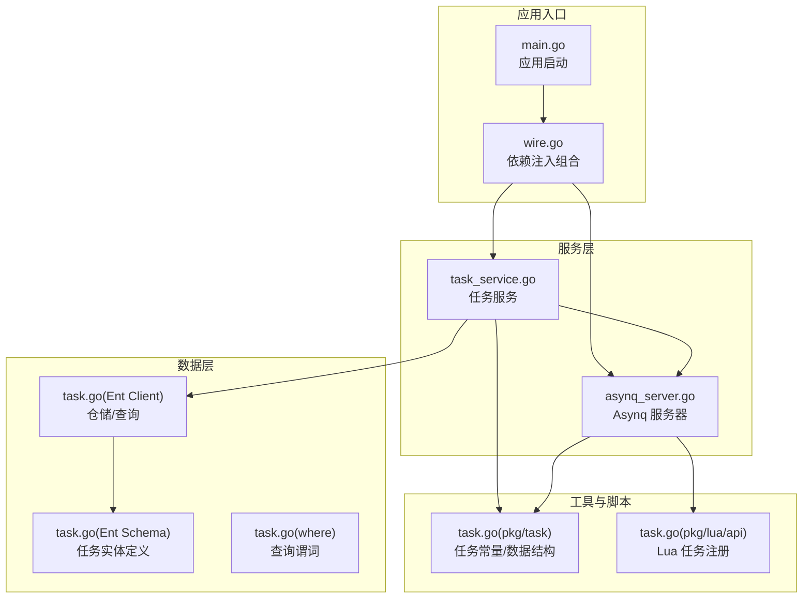
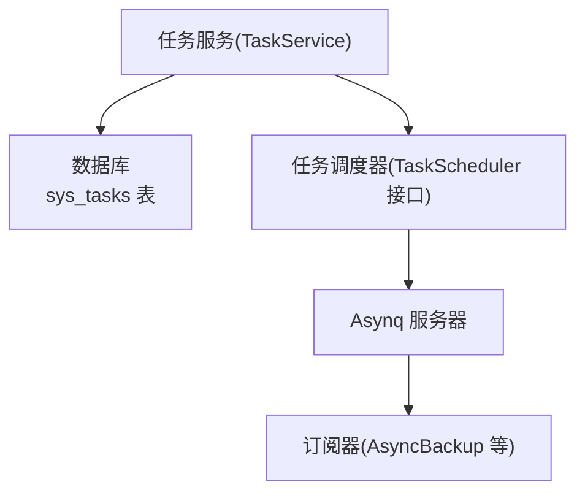
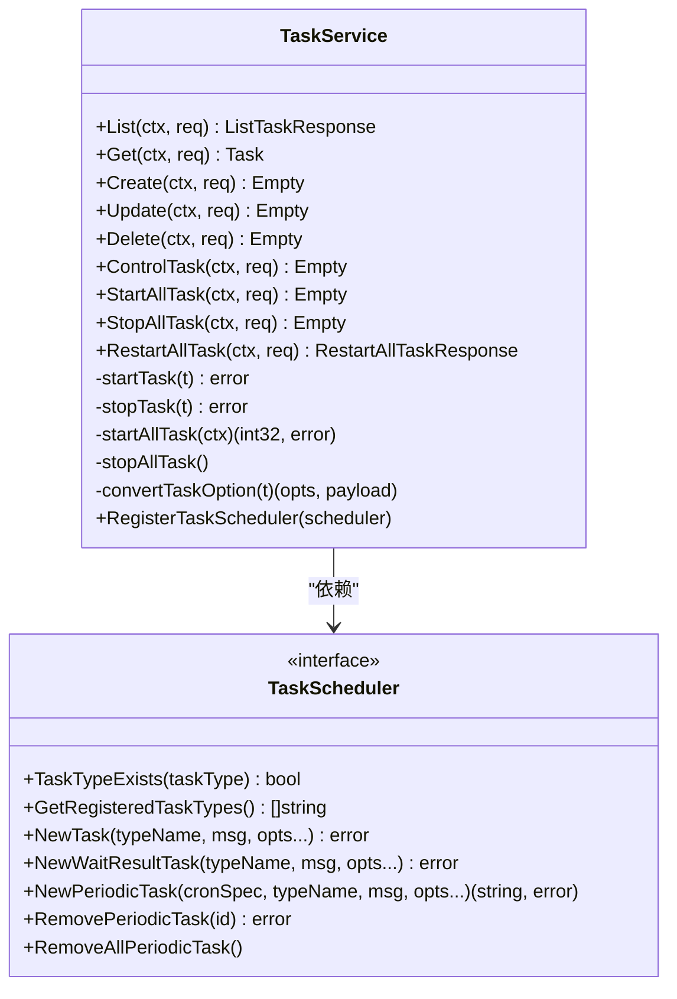
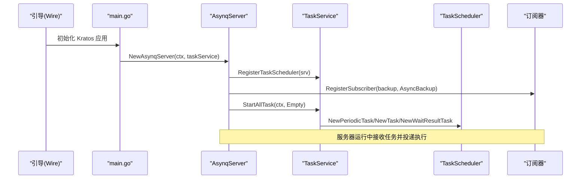
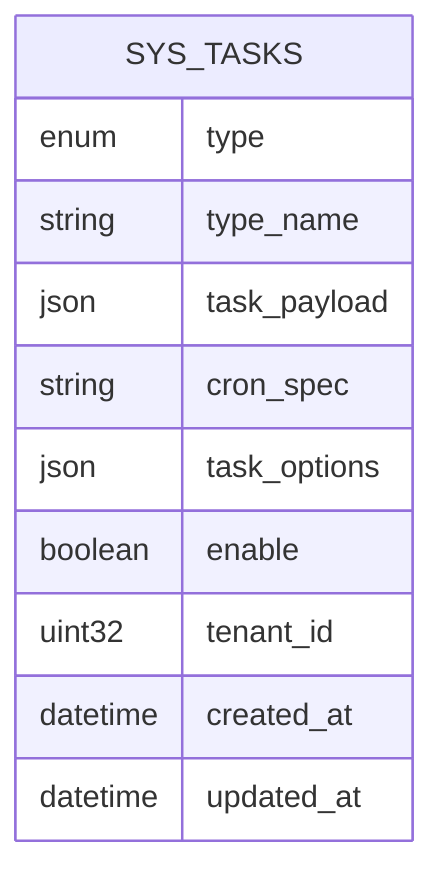
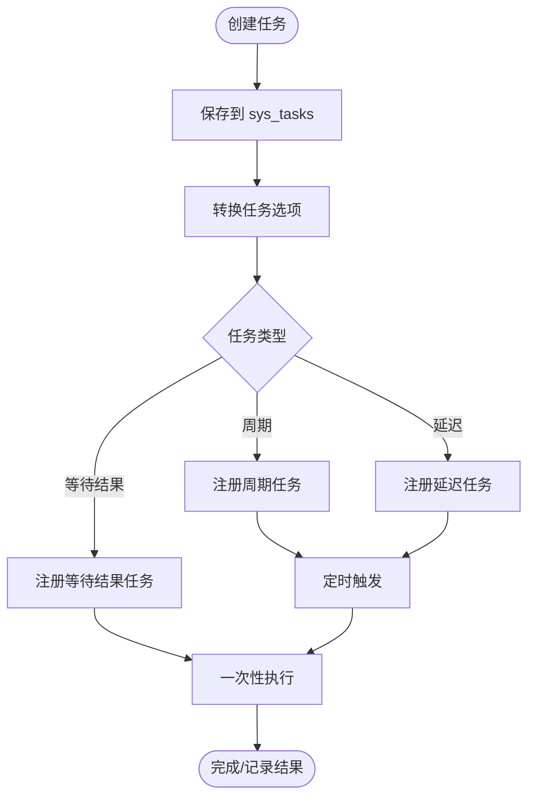
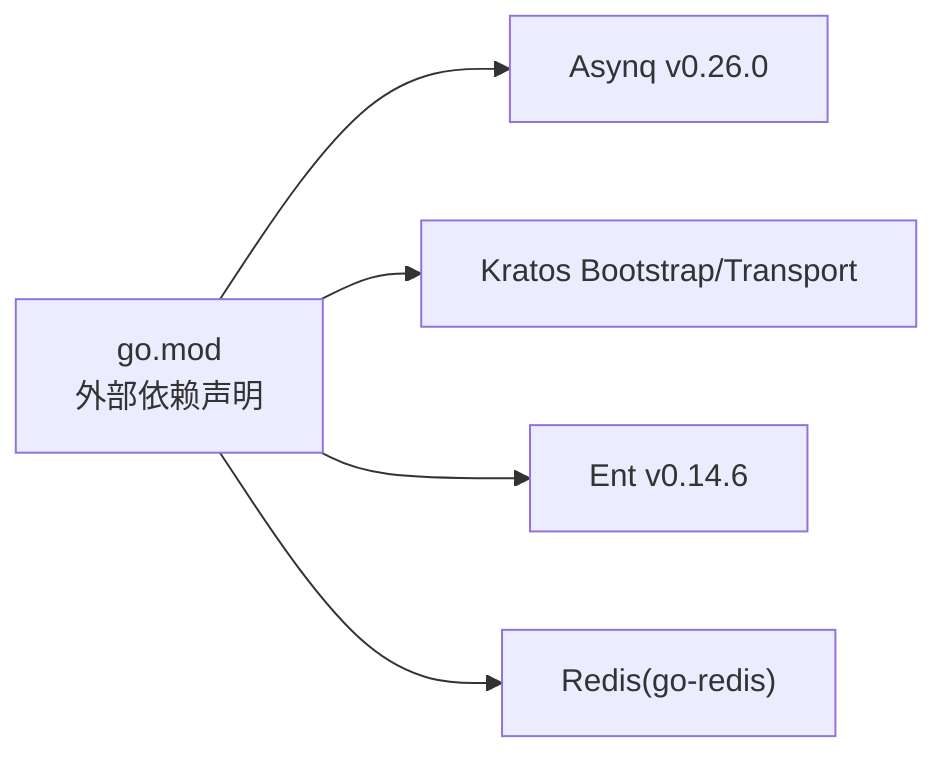

# 任务调度系统

<cite>
**本文引用的文件**
- [task_service.go](file://backend/app/admin/service/internal/service/task_service.go)
- [asynq_server.go](file://backend/app/admin/service/internal/server/asynq_server.go)
- [main.go](file://backend/app/admin/service/cmd/server/main.go)
- [task.go](file://backend/pkg/task/backup.go)
- [task.go](file://backend/app/admin/service/internal/data/ent/schema/task.go)
- [task.go](file://backend/app/admin/service/internal/data/ent/task/task.go)
- [task.go](file://backend/app/admin/service/internal/data/ent/task/where.go)
- [go.mod](file://backend/go.mod)
- [wire.go](file://backend/app/admin/service/cmd/server/wire.go)
- [task.go](file://backend/pkg/lua/api/task.go)
</cite>

## 目录
1. [引言](#引言)
2. [项目结构](#项目结构)
3. [核心组件](#核心组件)
4. [架构总览](#架构总览)
5. [详细组件分析](#详细组件分析)
6. [依赖关系分析](#依赖关系分析)
7. [性能考虑](#性能考虑)
8. [故障排查指南](#故障排查指南)
9. [结论](#结论)
10. [附录：任务调度示例](#附录任务调度示例)

## 引言
本文件面向“任务调度系统”的技术文档，围绕基于 Asynq 的任务调度架构进行深入解析。内容覆盖任务队列管理、任务执行器、任务监控与运维、任务生命周期、任务类型与优先级管理、处理器开发指南、性能优化策略以及典型业务场景示例。读者可据此快速理解系统如何通过数据库驱动的任务定义、Asynq 定时/延迟/等待结果任务模型，以及统一的任务调度器接口，实现稳定、可观测、可扩展的任务编排。

## 项目结构
本项目采用分层与模块化组织方式：
- 应用入口与引导：服务启动、Wire 组合、Kratos 应用装配
- 服务层：任务服务负责任务的增删改查、启停控制、批量重启、与调度器交互
- 数据层：Ent Schema 定义任务实体、索引与字段；提供仓储接口
- 配置与传输：Asynq 服务器初始化、订阅器注册、任务选项转换
- 工具与脚本：任务常量、Lua 任务处理器注册等

**图表来源**
- [main.go:46-76](file://backend/app/admin/service/cmd/server/main.go#L46-L76)
- [wire.go:27-46](file://backend/app/admin/service/cmd/server/wire.go#L27-L46)
- [asynq_server.go:17-47](file://backend/app/admin/service/internal/server/asynq_server.go#L17-L47)
- [task_service.go:37-65](file://backend/app/admin/service/internal/service/task_service.go#L37-L65)
- [task.go:16-115](file://backend/app/admin/service/internal/data/ent/schema/task.go#L16-L115)
- [task.go:49-105](file://backend/app/admin/service/internal/data/ent/task/task.go#L49-L105)
- [task.go:1-19](file://backend/pkg/task/backup.go#L1-L19)
- [task.go:1-51](file://backend/pkg/lua/api/task.go#L1-L51)

**章节来源**
- [main.go:46-76](file://backend/app/admin/service/cmd/server/main.go#L46-L76)
- [wire.go:27-46](file://backend/app/admin/service/cmd/server/wire.go#L27-L46)

## 核心组件
- 任务服务（TaskService）：封装任务 CRUD、启停控制、批量启停、任务选项转换、与调度器交互
- Asynq 服务器（AsynqServer）：基于 Kratos-Bootstrap/Transport Asynq 封装，注册订阅器、启动任务
- 任务调度器接口（TaskScheduler）：抽象出周期任务、一次性任务、等待结果任务的创建与移除能力
- 任务实体（Ent Schema）：定义任务类型、名称、负载、Cron 表达式、选项、启用状态等
- 任务常量与数据结构（pkg/task）：提供任务类型常量、负载结构、唯一任务 ID 规则
- Lua 任务处理器注册（pkg/lua/api）：支持通过 Lua 动态注册任务处理器

**章节来源**
- [task_service.go:24-65](file://backend/app/admin/service/internal/service/task_service.go#L24-L65)
- [asynq_server.go:17-47](file://backend/app/admin/service/internal/server/asynq_server.go#L17-L47)
- [task.go:34-77](file://backend/app/admin/service/internal/data/ent/schema/task.go#L34-L77)
- [task.go:1-19](file://backend/pkg/task/backup.go#L1-L19)
- [task.go:1-51](file://backend/pkg/lua/api/task.go#L1-L51)

## 架构总览
系统以“数据库驱动的任务定义 + Asynq 执行引擎”为核心，通过任务服务将任务定义转换为 Asynq 任务，并由 Asynq 定时器或调度器执行。任务服务还提供启停控制、批量重启、任务选项转换等功能，形成完整的任务生命周期闭环。

**图表来源**
- [task_service.go:320-357](file://backend/app/admin/service/internal/service/task_service.go#L320-L357)
- [asynq_server.go:25-47](file://backend/app/admin/service/internal/server/asynq_server.go#L25-L47)
- [task.go:34-77](file://backend/app/admin/service/internal/data/ent/schema/task.go#L34-L77)

## 详细组件分析

### 任务服务（TaskService）
职责与关键点：
- 任务 CRUD：创建、更新、删除、列表、按类型名查询
- 任务启停控制：单任务启停、批量启停、全量重启
- 任务选项转换：将任务选项映射为 Asynq 选项（重试次数、超时、截止时间、唯一性、保留期、分组、任务 ID 等）
- 任务类型分发：根据任务类型创建周期任务、延迟任务、等待结果任务
- 与调度器交互：通过 TaskScheduler 接口抽象，屏蔽具体实现细节

**图表来源**
- [task_service.go:37-65](file://backend/app/admin/service/internal/service/task_service.go#L37-L65)
- [task_service.go:319-357](file://backend/app/admin/service/internal/service/task_service.go#L319-L357)

**章节来源**
- [task_service.go:67-154](file://backend/app/admin/service/internal/service/task_service.go#L67-L154)
- [task_service.go:156-213](file://backend/app/admin/service/internal/service/task_service.go#L156-L213)
- [task_service.go:215-274](file://backend/app/admin/service/internal/service/task_service.go#L215-L274)
- [task_service.go:276-317](file://backend/app/admin/service/internal/service/task_service.go#L276-L317)
- [task_service.go:319-357](file://backend/app/admin/service/internal/service/task_service.go#L319-L357)

### Asynq 服务器与订阅器
- Asynq 服务器初始化：读取配置，创建 Asynq 服务器实例
- 订阅器注册：将任务类型与处理器绑定（如 AsyncBackup）
- 启动所有任务：在服务启动时加载数据库中的任务并注册到调度器

**图表来源**
- [asynq_server.go:17-47](file://backend/app/admin/service/internal/server/asynq_server.go#L17-L47)
- [task_service.go:319-357](file://backend/app/admin/service/internal/service/task_service.go#L319-L357)

**章节来源**
- [asynq_server.go:17-47](file://backend/app/admin/service/internal/server/asynq_server.go#L17-L47)

### 任务实体与索引（Ent Schema）
- 字段：任务类型（周期/延迟/等待结果）、任务类型名、任务负载（JSON）、Cron 表达式、任务选项（JSON）、启用状态
- 索引：按租户+类型名唯一、按租户+类型、按租户+启用+创建时间等，支撑多租户隔离与高效查询

**图表来源**
- [task.go:34-77](file://backend/app/admin/service/internal/data/ent/schema/task.go#L34-L77)
- [task.go:90-114](file://backend/app/admin/service/internal/data/ent/schema/task.go#L90-L114)

**章节来源**
- [task.go:16-115](file://backend/app/admin/service/internal/data/ent/schema/task.go#L16-L115)
- [task.go:49-105](file://backend/app/admin/service/internal/data/ent/task/task.go#L49-L105)
- [task.go:717-755](file://backend/app/admin/service/internal/data/ent/task/where.go#L717-L755)

### 任务生命周期（从创建到完成）
- 创建：写入数据库，同时调用调度器创建对应任务
- 入队：根据任务类型选择周期、延迟或等待结果入队
- 调度：Asynq 定时器或调度器按规则触发
- 执行：订阅器处理器消费任务并执行
- 完成：任务执行结束，周期任务持续调度，延迟/等待结果任务一次性完成

**图表来源**
- [task_service.go:82-104](file://backend/app/admin/service/internal/service/task_service.go#L82-L104)
- [task_service.go:319-357](file://backend/app/admin/service/internal/service/task_service.go#L319-L357)

**章节来源**
- [task_service.go:82-104](file://backend/app/admin/service/internal/service/task_service.go#L82-L104)
- [task_service.go:319-357](file://backend/app/admin/service/internal/service/task_service.go#L319-L357)

### 任务类型与优先级管理
- 任务类型
  - 周期任务：使用 Cron 表达式，通过调度器注册周期任务
  - 延迟任务：指定 ProcessIn/ProcessAt，延迟一段时间后执行
  - 等待结果任务：用于异步等待结果的场景
- 优先级与并发
  - 通过分组（Group）与唯一性（Unique TTL）控制同组任务的并发与去重
  - 通过任务 ID（TaskID）实现幂等
  - 通过重试次数（MaxRetry）与超时（Timeout）控制可靠性与资源占用
  - 通过保留期（Retention）控制历史数据清理

**章节来源**
- [task_service.go:276-317](file://backend/app/admin/service/internal/service/task_service.go#L276-L317)
- [task_service.go:319-357](file://backend/app/admin/service/internal/service/task_service.go#L319-L357)
- [task.go:34-77](file://backend/app/admin/service/internal/data/ent/schema/task.go#L34-L77)

### 处理器开发指南
- 任务类型命名：使用统一常量（如 backup），避免硬编码
- 订阅器注册：在 Asynq 服务器初始化时注册处理器
- 参数解析：从任务负载 JSON 解析为处理器期望的数据结构
- 结果处理：根据任务类型决定是否返回结果或仅记录日志
- 错误恢复：利用 MaxRetry、Timeout、Deadline、Unique、Retention 等选项提升健壮性
- 幂等与去重：使用 Unique TTL 与 TaskID 避免重复执行

**章节来源**
- [asynq_server.go:34-38](file://backend/app/admin/service/internal/server/asynq_server.go#L34-L38)
- [task.go:1-19](file://backend/pkg/task/backup.go#L1-L19)
- [task_service.go:276-317](file://backend/app/admin/service/internal/service/task_service.go#L276-L317)

### Lua 任务处理器注册
- 提供 Lua 侧任务处理器注册机制，支持描述、超时、重试、优先级等配置
- 通过 VM 管理接口标记专用虚拟机，确保任务执行隔离与安全

**章节来源**
- [task.go:1-51](file://backend/pkg/lua/api/task.go#L1-L51)

## 依赖关系分析
- 外部依赖
  - Asynq：任务队列与调度核心
  - Kratos/Bootstrap：应用引导、配置、传输层
  - Ent：ORM 与 Schema 定义
  - Redis：作为 Asynq 后端存储
- 内部依赖
  - 服务层依赖数据层（Ent）与工具包（pkg/task、pkg/lua）
  - Asynq 服务器依赖服务层进行任务注册与启动

**图表来源**
- [go.mod:15-64](file://backend/go.mod#L15-L64)

**章节来源**
- [go.mod:1-290](file://backend/go.mod#L1-L290)

## 性能考虑
- 并发控制
  - 使用 Group 对同组任务限流，Unique TTL 防止重复执行
  - 合理设置 MaxRetry 与 Timeout，避免资源长时间占用
- 资源管理
  - 利用 Retention 清理过期任务记录，降低存储压力
  - 通过 TaskID 实现幂等，减少无效重试
- 负载均衡
  - 多实例部署 Asynq Worker，结合 Redis 分布式锁与队列实现水平扩展
- 查询与索引
  - 借助 Ent Schema 中的多维索引，加速任务查询与分页
- 监控与日志
  - 在处理器中记录关键指标与异常，结合 Asynq 内置统计与外部监控系统

[本节为通用指导，无需特定文件引用]

## 故障排查指南
- 任务未执行
  - 检查任务启用状态与类型是否正确
  - 核对 Cron 表达式与 ProcessIn/ProcessAt 设置
  - 确认订阅器已注册且处理器签名匹配
- 重复执行或未去重
  - 检查 Unique TTL 与 TaskID 是否合理
- 超时或堆积
  - 调整 Timeout、MaxRetry、Group 并评估任务耗时
- 启动失败
  - 查看启动日志，确认数据库连接与 Asynq 配置正确
- Lua 任务异常
  - 检查 Lua 脚本注册与 VM 管理接口调用

**章节来源**
- [task_service.go:319-357](file://backend/app/admin/service/internal/service/task_service.go#L319-L357)
- [asynq_server.go:34-38](file://backend/app/admin/service/internal/server/asynq_server.go#L34-L38)

## 结论
本系统以数据库驱动的任务定义与 Asynq 执行引擎为核心，通过统一的任务服务与调度器接口，实现了周期、延迟与等待结果任务的全生命周期管理。配合完善的任务选项、索引与监控，系统具备良好的可扩展性与运维可观测性。建议在生产环境中结合分组限流、唯一性去重、保留期清理与多实例 Worker 部署，进一步提升稳定性与吞吐。

[本节为总结，无需特定文件引用]

## 附录：任务调度示例

### 数据备份任务
- 任务类型：周期任务（Cron）
- 负载：包含备份名称等必要参数
- 处理器：订阅器 AsyncBackup，执行备份逻辑
- 关键选项：Unique TTL（避免重复备份）、Retention（清理历史记录）

**章节来源**
- [asynq_server.go:34-38](file://backend/app/admin/service/internal/server/asynq_server.go#L34-L38)
- [task.go:1-19](file://backend/pkg/task/backup.go#L1-L19)
- [task_service.go:319-357](file://backend/app/admin/service/internal/service/task_service.go#L319-L357)

### 文件处理任务
- 任务类型：延迟任务（ProcessIn/ProcessAt）
- 场景：上传后延迟处理（如转码、压缩）
- 关键选项：Timeout、MaxRetry、Unique（避免重复处理）

**章节来源**
- [task_service.go:276-317](file://backend/app/admin/service/internal/service/task_service.go#L276-L317)
- [task_service.go:319-357](file://backend/app/admin/service/internal/service/task_service.go#L319-L357)

### 系统维护任务
- 任务类型：周期任务（Cron）
- 场景：清理临时文件、归档日志、健康检查
- 关键选项：Group（限流）、Retention（清理旧记录）

**章节来源**
- [task_service.go:319-357](file://backend/app/admin/service/internal/service/task_service.go#L319-L357)
- [task.go:34-77](file://backend/app/admin/service/internal/data/ent/schema/task.go#L34-L77)