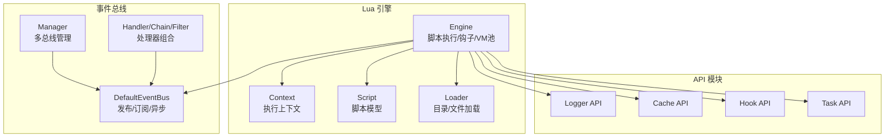
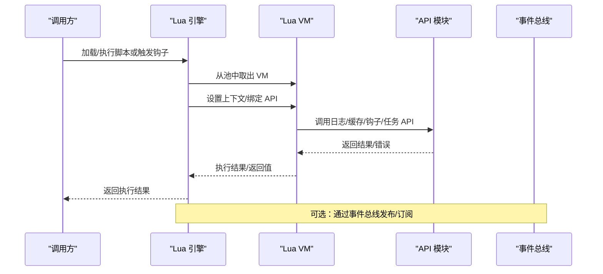
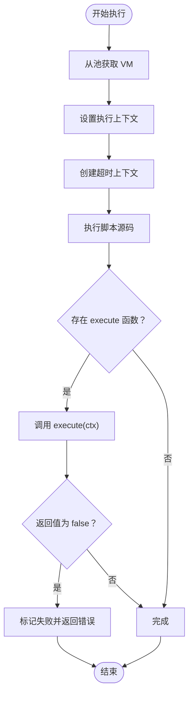
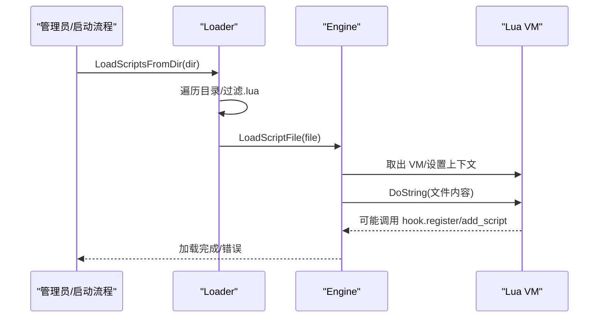
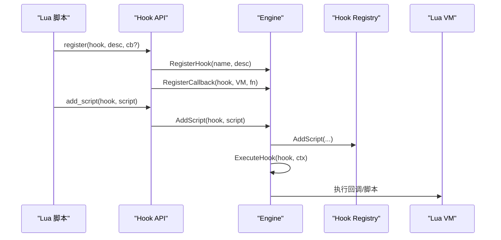
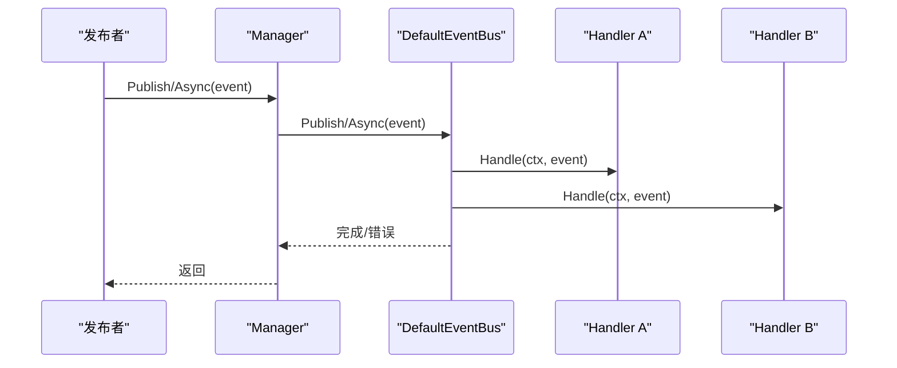
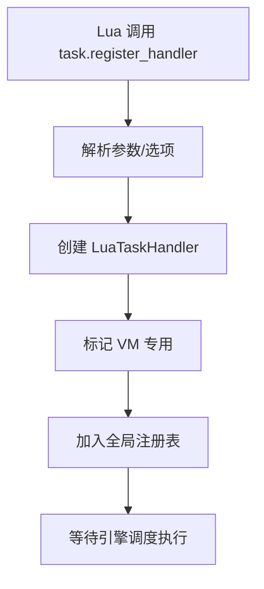
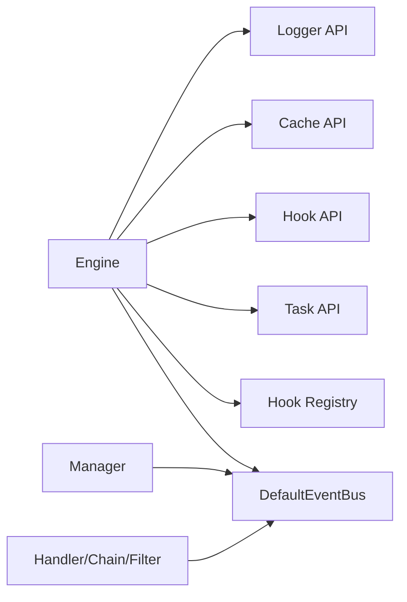

# 扩展系统

<cite>
**本文引用的文件**
- [engine.go](file://backend/pkg/lua/engine.go)
- [context.go](file://backend/pkg/lua/context.go)
- [loader.go](file://backend/pkg/lua/loader.go)
- [script.go](file://backend/pkg/lua/script.go)
- [eventbus.go](file://backend/pkg/eventbus/eventbus.go)
- [manager.go](file://backend/pkg/eventbus/manager.go)
- [handler.go](file://backend/pkg/eventbus/handler.go)
- [logger.go](file://backend/pkg/lua/api/logger.go)
- [cache.go](file://backend/pkg/lua/api/cache.go)
- [hook.go](file://backend/pkg/lua/api/hook.go)
- [task.go](file://backend/pkg/lua/api/task.go)
- [registry.go](file://backend/pkg/lua/hook/registry.go)
- [on_server_start.lua](file://backend/app/admin/service/scripts/on_server_start.lua)
- [example_config_access.lua.example](file://backend/app/admin/service/scripts/example_config_access.lua.example)
</cite>

## 目录
1. [简介](#简介)
2. [项目结构](#项目结构)
3. [核心组件](#核心组件)
4. [架构总览](#架构总览)
5. [详细组件分析](#详细组件分析)
6. [依赖分析](#依赖分析)
7. [性能考虑](#性能考虑)
8. [故障排查指南](#故障排查指南)
9. [结论](#结论)
10. [附录](#附录)

## 简介
本文件面向后端扩展系统的技术文档，聚焦以下目标：
- 深入解释 Lua 脚本引擎的集成与使用：脚本加载、执行上下文、API 调用等
- 描述事件总线的实现与使用：事件发布订阅、异步处理、事件链等
- 阐述任务调度系统的配置与使用：任务注册、执行上下文、超时与重试策略等
- 解释脚本钩子机制与自定义扩展点的实现
- 提供扩展开发的最佳实践：性能优化、错误处理、调试技巧
- 给出具体扩展开发示例与集成方法

## 项目结构
扩展系统由三大部分组成：
- Lua 脚本引擎：负责脚本生命周期管理、上下文传递、API 注册与调用
- 事件总线：提供事件发布订阅、异步处理与统计接口
- 任务调度：通过 Lua API 注册任务处理器，支持超时、重试与优先级控制



图表来源
- [engine.go:28-97](file://backend/pkg/lua/engine.go#L28-L97)
- [context.go:13-26](file://backend/pkg/lua/context.go#L13-L26)
- [loader.go:11-52](file://backend/pkg/lua/loader.go#L11-L52)
- [eventbus.go:12-52](file://backend/pkg/eventbus/eventbus.go#L12-L52)
- [manager.go:10-26](file://backend/pkg/eventbus/manager.go#L10-L26)
- [handler.go:7-21](file://backend/pkg/eventbus/handler.go#L7-L21)
- [logger.go:25-110](file://backend/pkg/lua/api/logger.go#L25-L110)
- [cache.go:15-305](file://backend/pkg/lua/api/cache.go#L15-L305)
- [hook.go:31-143](file://backend/pkg/lua/api/hook.go#L31-L143)
- [task.go:37-60](file://backend/pkg/lua/api/task.go#L37-L60)

章节来源
- [engine.go:28-97](file://backend/pkg/lua/engine.go#L28-L97)
- [eventbus.go:12-52](file://backend/pkg/eventbus/eventbus.go#L12-L52)
- [manager.go:10-26](file://backend/pkg/eventbus/manager.go#L10-L26)

## 核心组件
- Lua 引擎（Engine）：管理 VM 池、安全沙箱、API 注册、脚本执行与钩子执行
- 执行上下文（Context）：承载用户信息、请求信息、日志、取消上下文、停止信号与数据容器
- 事件总线（EventBus/Manager）：统一事件发布订阅、异步发布、一次性订阅与统计
- API 模块：日志、缓存、钩子、任务等模块以 require 方式暴露给 Lua
- 钩子注册表（Registry）：维护钩子与脚本映射，支持优先级排序与动态增删

章节来源
- [engine.go:28-97](file://backend/pkg/lua/engine.go#L28-L97)
- [context.go:13-26](file://backend/pkg/lua/context.go#L13-L26)
- [eventbus.go:12-52](file://backend/pkg/eventbus/eventbus.go#L12-L52)
- [manager.go:10-26](file://backend/pkg/eventbus/manager.go#L10-L26)
- [registry.go:30-91](file://backend/pkg/lua/hook/registry.go#L30-L91)

## 架构总览
扩展系统采用“Go 主框架 + Lua 可插拔脚本”的混合架构。Go 负责基础设施（事件总线、缓存、任务等），Lua 负责业务逻辑扩展与快速迭代。



图表来源
- [engine.go:263-328](file://backend/pkg/lua/engine.go#L263-L328)
- [logger.go:25-110](file://backend/pkg/lua/api/logger.go#L25-L110)
- [cache.go:15-305](file://backend/pkg/lua/api/cache.go#L15-L305)
- [hook.go:31-143](file://backend/pkg/lua/api/hook.go#L31-L143)
- [task.go:37-60](file://backend/pkg/lua/api/task.go#L37-L60)
- [eventbus.go:106-152](file://backend/pkg/eventbus/eventbus.go#L106-L152)

## 详细组件分析

### Lua 引擎与脚本执行
- 安全沙箱：仅开放基础库与字符串/数学等安全库，移除危险函数，自定义 require 实现最小化模块系统
- VM 池：预创建固定数量 VM，按需借还，避免频繁初始化开销
- 执行流程：设置上下文 → 超时控制 → 执行脚本 → 调用可选的 execute 函数 → 处理返回值与停止信号
- 回调机制：支持在 Lua 中直接注册回调函数，引擎保存 VM 与函数指针，按顺序执行



图表来源
- [engine.go:263-328](file://backend/pkg/lua/engine.go#L263-L328)

章节来源
- [engine.go:99-115](file://backend/pkg/lua/engine.go#L99-L115)
- [engine.go:117-189](file://backend/pkg/lua/engine.go#L117-L189)
- [engine.go:263-328](file://backend/pkg/lua/engine.go#L263-L328)
- [engine.go:330-398](file://backend/pkg/lua/engine.go#L330-L398)

### 执行上下文（Context）
- 数据容器：键值对存储，支持并发读写保护
- 用户与请求信息：封装当前用户与 HTTP 请求上下文
- 停止机制：脚本可通过上下文停止后续处理，便于短路与错误传播
- 克隆与序列化：支持克隆与导出为 map，便于跨层传递与记录

```mermaid
classDiagram
class Context {
+string ID
+string HookName
+map~string,interface{}~ Data
+UserContext User
+HTTPContext Request
+Helper Logger
+Context Cancel
+bool Stopped
+string StopReason
+time Time StartTime
+Set(key, value)
+Get(key) interface{}
+Has(key) bool
+Delete(key)
+Clone() Context
+Stop(reason) error
}
class UserContext {
+uint32 ID
+string Username
+string Email
+[]string Roles
+uint32 TenantID
}
class HTTPContext {
+string Method
+string Path
+string RemoteAddr
+map~string,string~ Headers
+map~string,string~ Query
}
Context --> UserContext : "包含"
Context --> HTTPContext : "包含"
```

图表来源
- [context.go:13-26](file://backend/pkg/lua/context.go#L13-L26)
- [context.go:28-44](file://backend/pkg/lua/context.go#L28-L44)

章节来源
- [context.go:46-188](file://backend/pkg/lua/context.go#L46-L188)
- [context.go:195-222](file://backend/pkg/lua/context.go#L195-L222)

### 脚本加载与自动注册
- 目录加载：遍历指定目录，过滤 .lua 文件，逐个执行以允许脚本调用钩子注册 API
- 文件加载：读取文件内容，设置上下文后执行，支持在运行时注册钩子与脚本
- 字符串加载：直接执行给定源码字符串，便于动态注入



图表来源
- [loader.go:11-52](file://backend/pkg/lua/loader.go#L11-L52)
- [loader.go:54-92](file://backend/pkg/lua/loader.go#L54-L92)
- [loader.go:94-125](file://backend/pkg/lua/loader.go#L94-L125)

章节来源
- [loader.go:11-52](file://backend/pkg/lua/loader.go#L11-L52)
- [loader.go:54-92](file://backend/pkg/lua/loader.go#L54-L92)
- [loader.go:94-125](file://backend/pkg/lua/loader.go#L94-L125)

### 钩子机制与自定义扩展点
- 钩子注册：支持动态注册钩子名称与描述，避免循环依赖
- 脚本添加：支持以脚本表形式添加到指定钩子，自动去重并按优先级排序
- 回调注册：允许在 Lua 中直接注册回调函数，引擎保存 VM 与函数指针
- 钩子执行：先执行回调，再执行已注册脚本；任一失败可中断（关键脚本）



图表来源
- [hook.go:31-143](file://backend/pkg/lua/api/hook.go#L31-L143)
- [engine.go:446-449](file://backend/pkg/lua/engine.go#L446-L449)
- [engine.go:451-482](file://backend/pkg/lua/engine.go#L451-L482)
- [engine.go:330-398](file://backend/pkg/lua/engine.go#L330-L398)
- [registry.go:61-91](file://backend/pkg/lua/hook/registry.go#L61-L91)

章节来源
- [hook.go:31-143](file://backend/pkg/lua/api/hook.go#L31-L143)
- [engine.go:446-449](file://backend/pkg/lua/engine.go#L446-L449)
- [engine.go:451-482](file://backend/pkg/lua/engine.go#L451-L482)
- [engine.go:330-398](file://backend/pkg/lua/engine.go#L330-L398)
- [registry.go:61-91](file://backend/pkg/lua/hook/registry.go#L61-L91)

### 事件总线实现与使用
- 发布订阅：支持同步订阅、一次性订阅与异步订阅
- 异步发布：使用独立后台上下文与超时，避免阻塞调用方
- 统计与管理：支持查询事件类型、订阅者数量与全局/命名总线



图表来源
- [manager.go:50-70](file://backend/pkg/eventbus/manager.go#L50-L70)
- [eventbus.go:106-152](file://backend/pkg/eventbus/eventbus.go#L106-L152)
- [handler.go:41-59](file://backend/pkg/eventbus/handler.go#L41-L59)

章节来源
- [eventbus.go:12-52](file://backend/pkg/eventbus/eventbus.go#L12-L52)
- [eventbus.go:106-152](file://backend/pkg/eventbus/eventbus.go#L106-L152)
- [manager.go:28-70](file://backend/pkg/eventbus/manager.go#L28-L70)
- [handler.go:41-59](file://backend/pkg/eventbus/handler.go#L41-L59)

### 任务调度与 Lua 任务处理器
- 任务处理器注册：Lua 调用 task.register_handler(name, desc, handler, options)，支持必填字段、可选字段、超时、重试与优先级
- VM 管理：注册后标记 VM 专用，确保处理器函数可用
- 运行时行为：引擎侧可基于注册表进行任务分发与执行（注册表导出用于外部集成）



图表来源
- [task.go:62-153](file://backend/pkg/lua/api/task.go#L62-L153)

章节来源
- [task.go:37-60](file://backend/pkg/lua/api/task.go#L37-L60)
- [task.go:62-153](file://backend/pkg/lua/api/task.go#L62-L153)
- [task.go:155-171](file://backend/pkg/lua/api/task.go#L155-L171)

### API 模块详解
- 日志 API：提供 info/warn/error/debug 及带格式化版本，桥接 Kratos 日志
- 缓存 API：提供 get/set/delete/exists/incr/decr/expire/ttl/keys/hash 操作，自动 JSON 序列化/反序列化
- 钩子 API：允许脚本动态注册钩子与脚本，列出所有钩子
- 任务 API：注册任务处理器，支持超时、重试与优先级

章节来源
- [logger.go:25-110](file://backend/pkg/lua/api/logger.go#L25-L110)
- [cache.go:15-305](file://backend/pkg/lua/api/cache.go#L15-L305)
- [hook.go:31-143](file://backend/pkg/lua/api/hook.go#L31-L143)
- [task.go:37-60](file://backend/pkg/lua/api/task.go#L37-L60)

### 示例脚本与集成方法
- 服务器启动钩子：演示如何在启动时访问配置、服务信息并执行初始化逻辑
- 配置访问示例：展示如何安全地访问嵌套配置、验证必要字段并根据环境调整行为

章节来源
- [on_server_start.lua:1-82](file://backend/app/admin/service/scripts/on_server_start.lua#L1-L82)
- [example_config_access.lua.example:1-141](file://backend/app/admin/service/scripts/example_config_access.lua.example#L1-L141)

## 依赖分析
- 引擎对 API 的依赖：通过注册器集中注入日志、缓存、事件总线、钩子与任务 API
- 钩子注册表：独立于引擎，避免循环依赖；引擎通过反射兼容不同脚本结构
- 事件总线：Manager 统一管理多个 EventBus，提供全局与命名总线



图表来源
- [engine.go:191-261](file://backend/pkg/lua/engine.go#L191-L261)
- [registry.go:30-41](file://backend/pkg/lua/hook/registry.go#L30-L41)
- [manager.go:18-26](file://backend/pkg/eventbus/manager.go#L18-L26)
- [handler.go:18-21](file://backend/pkg/eventbus/handler.go#L18-L21)

章节来源
- [engine.go:191-261](file://backend/pkg/lua/engine.go#L191-L261)
- [registry.go:30-41](file://backend/pkg/lua/hook/registry.go#L30-L41)
- [manager.go:18-26](file://backend/pkg/eventbus/manager.go#L18-L26)
- [handler.go:18-21](file://backend/pkg/eventbus/handler.go#L18-L21)

## 性能考虑
- VM 池：预创建固定数量 VM，减少频繁初始化开销；空闲时复用，满载时新建
- 超时控制：每个脚本/回调执行均受超时限制，防止长时间阻塞；超时后替换 VM 并返回错误
- 内存限制：可配置每 VM 最大内存，结合超时共同保障稳定性
- 异步事件：异步发布使用独立后台上下文与超时，避免调用方被阻塞
- 任务处理器：注册后标记 VM 专用，确保处理器可用性；建议合理设置超时与重试

章节来源
- [engine.go:674-755](file://backend/pkg/lua/engine.go#L674-L755)
- [engine.go:274-328](file://backend/pkg/lua/engine.go#L274-L328)
- [eventbus.go:154-167](file://backend/pkg/eventbus/eventbus.go#L154-L167)
- [task.go:138-145](file://backend/pkg/lua/api/task.go#L138-L145)

## 故障排查指南
- 脚本执行超时：检查脚本复杂度与外部依赖；适当提高超时或拆分任务
- 回调返回 false：脚本明确返回 false 将导致钩子中断；确认业务逻辑是否需要短路
- 事件未到达：确认订阅者是否正确注册、事件类型是否匹配；查看一次性订阅在执行后会被清理
- 缓存操作失败：检查 Redis 连接与权限；关注 JSON 序列化错误
- 配置访问异常：注意大小写差异与嵌套路径；使用辅助函数安全访问

章节来源
- [engine.go:317-328](file://backend/pkg/lua/engine.go#L317-L328)
- [engine.go:297-311](file://backend/pkg/lua/engine.go#L297-L311)
- [eventbus.go:106-152](file://backend/pkg/eventbus/eventbus.go#L106-L152)
- [cache.go:23-48](file://backend/pkg/lua/api/cache.go#L23-L48)
- [example_config_access.lua.example:115-141](file://backend/app/admin/service/scripts/example_config_access.lua.example#L115-L141)

## 结论
该扩展系统通过 Lua 引擎与事件总线实现了高内聚、低耦合的可插拔架构。Lua 提供灵活的业务扩展能力，事件总线支撑解耦的异步处理，任务 API 则为后台作业提供了统一入口。配合完善的上下文与 API 模块，开发者可以快速构建稳定、可维护的扩展功能。

## 附录
- 开发最佳实践
  - 使用钩子 API 动态注册扩展点，避免硬编码
  - 在脚本中使用上下文的 stop 机制进行短路控制
  - 对外部依赖（如 Redis）进行容错与降级
  - 合理设置任务处理器的超时与重试，避免资源泄漏
  - 使用异步事件处理耗时操作，保持接口响应
- 常见问题
  - 如何在脚本中访问配置：参考示例脚本中的安全访问模式
  - 如何注册任务处理器：参考任务 API 的注册函数与选项
  - 如何启用事件总线：通过 Manager 获取/创建总线并订阅事件