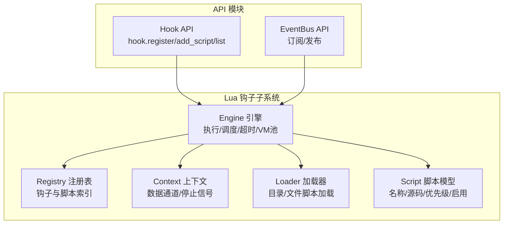
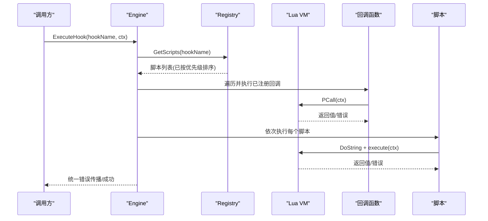
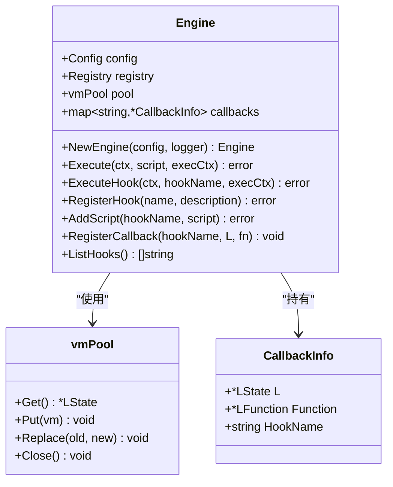
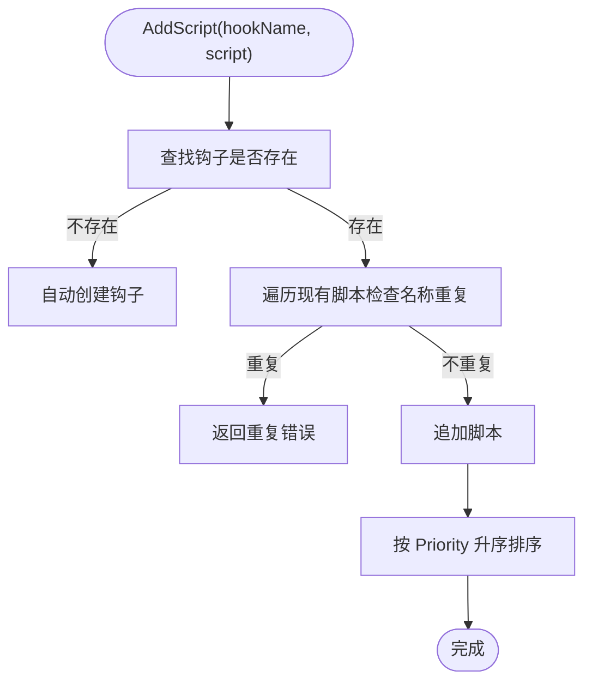
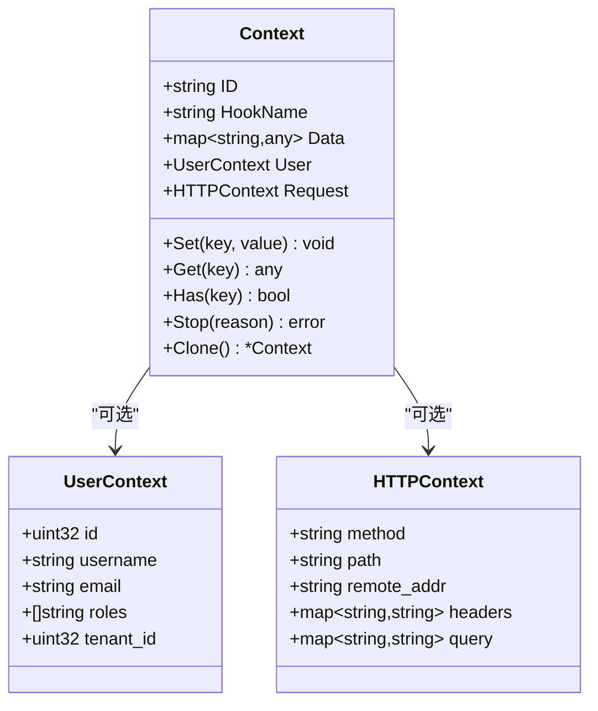
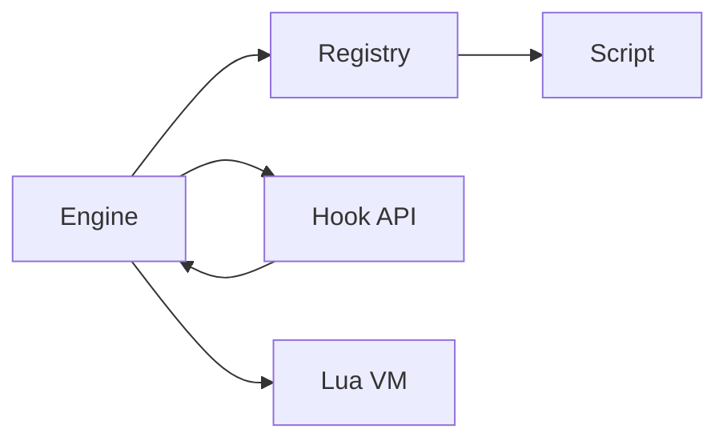

# 扩展钩子机制

<cite>
**本文引用的文件**   
- [engine.go](file://backend/pkg/lua/engine.go)
- [registry.go](file://backend/pkg/lua/hook/registry.go)
- [hook.go](file://backend/pkg/lua/api/hook.go)
- [context.go](file://backend/pkg/lua/context.go)
- [loader.go](file://backend/pkg/lua/loader.go)
- [script.go](file://backend/pkg/lua/script.go)
- [on_server_start.lua](file://backend/app/admin/service/scripts/on_server_start.lua)
- [example_callback_registration.lua](file://backend/pkg/lua/example_callback_registration.lua)
- [example_self_register.lua](file://backend/pkg/lua/example_self_register.lua)
- [hook_test.go](file://backend/pkg/lua/hook_test.go)
- [eventbus.go](file://backend/pkg/lua/api/eventbus.go)
</cite>

## 目录
1. [简介](#简介)
2. [项目结构](#项目结构)
3. [核心组件](#核心组件)
4. [架构总览](#架构总览)
5. [详细组件分析](#详细组件分析)
6. [依赖分析](#依赖分析)
7. [性能考量](#性能考量)
8. [故障排查指南](#故障排查指南)
9. [结论](#结论)
10. [附录](#附录)

## 简介
本文件系统性阐述 GoWind 后端中的扩展钩子机制，覆盖钩子注册、触发与回调管理的完整生命周期；解释系统钩子、业务钩子、事件钩子等类型及其使用场景；说明执行顺序与优先级策略；给出安全机制与最佳实践；并提供可直接参考的开发示例与调试测试方法。

## 项目结构
钩子机制主要位于后端包 pkg/lua 下，围绕“引擎-注册表-上下文-加载器”的结构组织，配合 Lua API 模块向脚本暴露注册接口，支持脚本自注册与动态挂载。

图表来源
- [engine.go:28-97](file://backend/pkg/lua/engine.go#L28-L97)
- [registry.go:31-41](file://backend/pkg/lua/hook/registry.go#L31-L41)
- [context.go:13-26](file://backend/pkg/lua/context.go#L13-L26)
- [loader.go:11-52](file://backend/pkg/lua/loader.go#L11-L52)
- [script.go:9-23](file://backend/pkg/lua/script.go#L9-L23)
- [hook.go:31-144](file://backend/pkg/lua/api/hook.go#L31-L144)

章节来源
- [engine.go:28-97](file://backend/pkg/lua/engine.go#L28-L97)
- [registry.go:31-41](file://backend/pkg/lua/hook/registry.go#L31-L41)
- [context.go:13-26](file://backend/pkg/lua/context.go#L13-L26)
- [loader.go:11-52](file://backend/pkg/lua/loader.go#L11-L52)
- [script.go:9-23](file://backend/pkg/lua/script.go#L9-L23)
- [hook.go:31-144](file://backend/pkg/lua/api/hook.go#L31-L144)

## 核心组件
- 引擎 Engine：负责 VM 生命周期、沙箱环境、API 注入、脚本执行、钩子触发、超时控制与错误传播。
- 注册表 Registry：维护钩子名到脚本列表的映射，支持自动注册、去重、按优先级排序。
- 上下文 Context：跨脚本/回调传递输入输出数据，支持停止信号与取消上下文。
- 加载器 Loader：从目录或字符串加载脚本，允许脚本调用 hook API 完成自注册。
- 脚本模型 Script：统一脚本元数据，含名称、源码、启用状态、优先级、描述、作者、版本、是否关键等。
- Hook API：向 Lua 脚本暴露 hook.register/hook.add_script/hook.list，支持回调式注册与动态挂载。

章节来源
- [engine.go:28-97](file://backend/pkg/lua/engine.go#L28-L97)
- [registry.go:31-91](file://backend/pkg/lua/hook/registry.go#L31-L91)
- [context.go:13-188](file://backend/pkg/lua/context.go#L13-L188)
- [loader.go:54-125](file://backend/pkg/lua/loader.go#L54-L125)
- [script.go:9-62](file://backend/pkg/lua/script.go#L9-L62)
- [hook.go:8-15](file://backend/pkg/lua/api/hook.go#L8-L15)

## 架构总览
钩子执行路径分为两类：回调式与脚本式。两者均通过引擎统一调度，按优先级顺序执行，支持超时与中断。

图表来源
- [engine.go:330-398](file://backend/pkg/lua/engine.go#L330-L398)
- [engine.go:400-444](file://backend/pkg/lua/engine.go#L400-L444)
- [registry.go:113-127](file://backend/pkg/lua/hook/registry.go#L113-L127)

章节来源
- [engine.go:330-398](file://backend/pkg/lua/engine.go#L330-L398)
- [engine.go:400-444](file://backend/pkg/lua/engine.go#L400-L444)
- [registry.go:113-127](file://backend/pkg/lua/hook/registry.go#L113-L127)

## 详细组件分析

### 引擎 Engine
- VM 池化：预创建固定数量 VM，空闲复用，避免频繁初始化开销。
- 沙箱与 API：仅开放安全标准库，注入日志、缓存、事件总线、OSS、加密、任务、钩子等模块。
- 执行模型：脚本以字符串形式执行，若存在全局 execute(ctx) 则调用之；回调通过独立路径执行。
- 超时控制：每个回调/脚本执行均在独立超时上下文中运行，超时后替换 VM 并返回错误。
- 回调注册：支持在 hook.register 的第三个参数直接传入 Lua 函数，引擎保存 VM 与函数指针，标记专用 VM 不参与池化。
- 上下文桥接：将 Context 转换为 Lua 表，提供 get/set/stop 方法供脚本读写与中断。

图表来源
- [engine.go:28-97](file://backend/pkg/lua/engine.go#L28-L97)
- [engine.go:674-755](file://backend/pkg/lua/engine.go#L674-L755)
- [engine.go:21-40](file://backend/pkg/lua/engine.go#L21-L40)

章节来源
- [engine.go:67-97](file://backend/pkg/lua/engine.go#L67-L97)
- [engine.go:191-261](file://backend/pkg/lua/engine.go#L191-L261)
- [engine.go:263-328](file://backend/pkg/lua/engine.go#L263-L328)
- [engine.go:330-398](file://backend/pkg/lua/engine.go#L330-L398)
- [engine.go:400-444](file://backend/pkg/lua/engine.go#L400-L444)
- [engine.go:556-573](file://backend/pkg/lua/engine.go#L556-L573)
- [engine.go:674-755](file://backend/pkg/lua/engine.go#L674-L755)

### 注册表 Registry
- 自动注册：添加脚本时若钩子不存在则自动创建。
- 去重与排序：同钩子内脚本名不可重复；按 Priority 升序排序，数值越小越先执行。
- 查询与统计：提供按钩子查询、列出全部钩子、统计总数等能力。

图表来源
- [registry.go:61-91](file://backend/pkg/lua/hook/registry.go#L61-L91)

章节来源
- [registry.go:43-91](file://backend/pkg/lua/hook/registry.go#L43-L91)
- [registry.go:113-154](file://backend/pkg/lua/hook/registry.go#L113-L154)

### 上下文 Context
- 数据通道：键值对存储，支持并发读写保护；提供 Get/Set/Has/Delete/Clone 等便捷方法。
- 中断与取消：支持 ctx.stop(reason) 设置停止标志与原因；可结合 Cancel 上下文实现外部取消。
- 用户与请求：可携带 UserContext 与 HTTPContext，便于脚本访问当前用户与请求信息。
- 序列化：提供 ToMap 方便日志与审计。

图表来源
- [context.go:13-26](file://backend/pkg/lua/context.go#L13-L26)
- [context.go:28-44](file://backend/pkg/lua/context.go#L28-L44)
- [context.go:46-188](file://backend/pkg/lua/context.go#L46-L188)

章节来源
- [context.go:13-188](file://backend/pkg/lua/context.go#L13-L188)

### 加载器 Loader
- 目录加载：递归扫描 .lua 文件，逐个执行，遇到错误继续加载其他文件。
- 文件加载：获取 VM 执行单个脚本，支持标记专用 VM。
- 字符串加载：从源码字符串执行，便于动态注入。

章节来源
- [loader.go:11-52](file://backend/pkg/lua/loader.go#L11-L52)
- [loader.go:54-125](file://backend/pkg/lua/loader.go#L54-L125)

### 脚本模型 Script
- 元数据：名称、所属钩子、源码、启用状态、优先级、描述、作者、版本、是否关键、时间戳。
- 校验：名称/钩子/源码必填。
- 哈希：基于源码计算 SHA256，用于一致性校验或变更检测。

章节来源
- [script.go:9-62](file://backend/pkg/lua/script.go#L9-L62)

### Hook API（Lua）
- hook.register(hook_name, description?, callback?)：注册钩子点，可选传入回调函数；回调将被引擎保存并在钩子触发时执行。
- hook.add_script(hook_name, {name, source, enabled?, priority?, description?})：动态挂载脚本到指定钩子。
- hook.list()：返回所有已注册钩子名数组。

章节来源
- [hook.go:31-144](file://backend/pkg/lua/api/hook.go#L31-L144)

## 依赖分析
- 引擎依赖注册表进行钩子与脚本索引；依赖 VM 池减少创建成本；依赖日志、Redis、EventBus、OSS 等外部服务并通过 API 注入。
- 注册表与脚本模型解耦于引擎，避免循环依赖。
- Hook API 通过接口 HookEngine 与引擎交互，保持低耦合。

图表来源
- [engine.go:28-97](file://backend/pkg/lua/engine.go#L28-L97)
- [hook.go:8-15](file://backend/pkg/lua/api/hook.go#L8-L15)
- [registry.go:31-41](file://backend/pkg/lua/hook/registry.go#L31-L41)
- [script.go:9-23](file://backend/pkg/lua/script.go#L9-L23)

章节来源
- [engine.go:28-97](file://backend/pkg/lua/engine.go#L28-L97)
- [hook.go:8-15](file://backend/pkg/lua/api/hook.go#L8-L15)
- [registry.go:31-41](file://backend/pkg/lua/hook/registry.go#L31-L41)
- [script.go:9-23](file://backend/pkg/lua/script.go#L9-L23)

## 性能考量
- VM 池：预创建固定数量 VM，降低频繁初始化开销；空闲复用，满载时按需新建。
- 超时控制：每个回调/脚本执行设置独立超时，防止卡顿影响整体吞吐。
- 排序与去重：注册阶段完成去重与排序，执行阶段无需再次排序，提升效率。
- 内存限制：可通过配置限制单 VM 内存上限，避免内存泄漏导致系统不稳定。
- 日志与可观测：记录每次回调/脚本的耗时与结果，便于定位慢脚本。

章节来源
- [engine.go:67-97](file://backend/pkg/lua/engine.go#L67-L97)
- [engine.go:263-328](file://backend/pkg/lua/engine.go#L263-L328)
- [engine.go:400-444](file://backend/pkg/lua/engine.go#L400-L444)
- [registry.go:85-88](file://backend/pkg/lua/hook/registry.go#L85-L88)

## 故障排查指南
- 超时问题：若脚本或回调返回超时，引擎会关闭对应 VM 并替换新 VM；检查脚本复杂度与外部依赖延迟。
- 返回 false 中止：脚本或回调返回 false 将导致钩子执行中止；确认逻辑分支与前置条件。
- 回调未执行：确认 hook.register 第三个参数为函数且未被忽略；检查引擎是否正确保存回调并标记专用 VM。
- 动态挂载失败：检查 add_script 参数完整性与脚本源码语法；查看返回的错误信息。
- 目录加载失败：检查目录权限与文件编码；注意单文件错误不会阻断其他文件加载。

章节来源
- [engine.go:263-328](file://backend/pkg/lua/engine.go#L263-L328)
- [engine.go:400-444](file://backend/pkg/lua/engine.go#L400-L444)
- [hook.go:71-120](file://backend/pkg/lua/api/hook.go#L71-L120)
- [loader.go:11-52](file://backend/pkg/lua/loader.go#L11-L52)

## 结论
该钩子机制以“引擎-注册表-上下文-加载器”为核心，结合 Lua Hook API 提供了灵活、可扩展、可观察的扩展点。通过回调与脚本双轨执行、优先级排序、超时与中断控制，既满足系统级钩子（如启动钩子）也支持业务钩子（如用户注册、权限验证、数据处理）的动态扩展。建议在生产环境中严格控制脚本复杂度、开启必要的安全与限流措施，并通过测试用例保障钩子行为的稳定性。

## 附录

### 钩子类型与使用场景
- 系统钩子：服务器启动、定时任务、系统事件等。例如“on_server_start”钩子，可在服务启动时执行初始化任务。
- 业务钩子：用户注册、登录、权限变更、数据保存等。例如“user.created”钩子，用于发送欢迎邮件或写入追踪缓存。
- 事件钩子：与事件总线结合，实现异步处理与解耦。

章节来源
- [on_server_start.lua:13-79](file://backend/app/admin/service/scripts/on_server_start.lua#L13-L79)
- [example_self_register.lua:8-45](file://backend/pkg/lua/example_self_register.lua#L8-L45)
- [eventbus.go:63-262](file://backend/pkg/lua/api/eventbus.go#L63-L262)

### 执行顺序与优先级管理
- 顺序：先执行已注册的回调，再按 Priority 升序执行脚本；同一钩子内的脚本名不可重复。
- 中止：脚本或回调返回 false 会中止后续执行；关键脚本（Critical）失败将直接终止钩子流程。
- 停止：脚本可通过 ctx.stop(reason) 主动中止当前钩子流程。

章节来源
- [registry.go:85-88](file://backend/pkg/lua/hook/registry.go#L85-L88)
- [engine.go:330-398](file://backend/pkg/lua/engine.go#L330-L398)
- [engine.go:400-444](file://backend/pkg/lua/engine.go#L400-L444)
- [context.go:180-188](file://backend/pkg/lua/context.go#L180-L188)

### 安全机制
- 沙箱：仅开放安全标准库，禁用危险函数（如 dofile/loadfile/load/loadstring），避免文件系统与网络访问。
- 模块白名单：通过配置限制允许的模块集合，进一步收紧权限。
- 超时与内存限制：防止恶意或异常脚本消耗资源。
- 输入校验：脚本通过上下文读取数据，建议在业务层做好输入校验与权限验证。

章节来源
- [engine.go:117-189](file://backend/pkg/lua/engine.go#L117-L189)
- [engine.go:43-64](file://backend/pkg/lua/engine.go#L43-L64)

### 钩子开发最佳实践
- 命名规范：使用清晰语义的钩子名，如“业务域.事件”，避免冲突。
- 参数传递：通过 Context 的 get/set 传递必要数据，避免全局变量。
- 返回值处理：明确返回 true/false 的含义；需要中止时返回 false 或调用 ctx.stop。
- 性能考虑：避免长耗时操作；必要时拆分为多个低优先级脚本；合理使用缓存与异步事件。
- 可观测性：记录关键日志与指标；为关键钩子设置超时与告警。

### 开发示例
- 用户注册钩子：脚本自注册到“user.created”，在 execute(ctx) 中读取用户信息并发送通知或写入缓存。
- 权限验证钩子：在业务前置钩子中校验权限，返回 false 中止后续流程。
- 数据处理钩子：在保存前进行数据清洗与校验，在保存后进行通知或审计。

章节来源
- [example_self_register.lua:8-45](file://backend/pkg/lua/example_self_register.lua#L8-L45)
- [example_callback_registration.lua:6-39](file://backend/pkg/lua/example_callback_registration.lua#L6-L39)
- [hook_test.go:121-191](file://backend/pkg/lua/hook_test.go#L121-L191)

### 调试、测试与监控
- 测试用例：覆盖注册、动态挂载、回调注册、混合注册、复杂工作流等场景，确保钩子行为稳定。
- 监控：记录每次钩子执行耗时、失败率与回调数；对关键钩子设置告警阈值。
- 日志：在引擎与 API 层打印详细日志，便于定位问题。

章节来源
- [hook_test.go:13-56](file://backend/pkg/lua/hook_test.go#L13-L56)
- [hook_test.go:58-119](file://backend/pkg/lua/hook_test.go#L58-L119)
- [hook_test.go:241-351](file://backend/pkg/lua/hook_test.go#L241-L351)
- [hook_test.go:353-421](file://backend/pkg/lua/hook_test.go#L353-L421)
- [hook_test.go:471-540](file://backend/pkg/lua/hook_test.go#L471-L540)