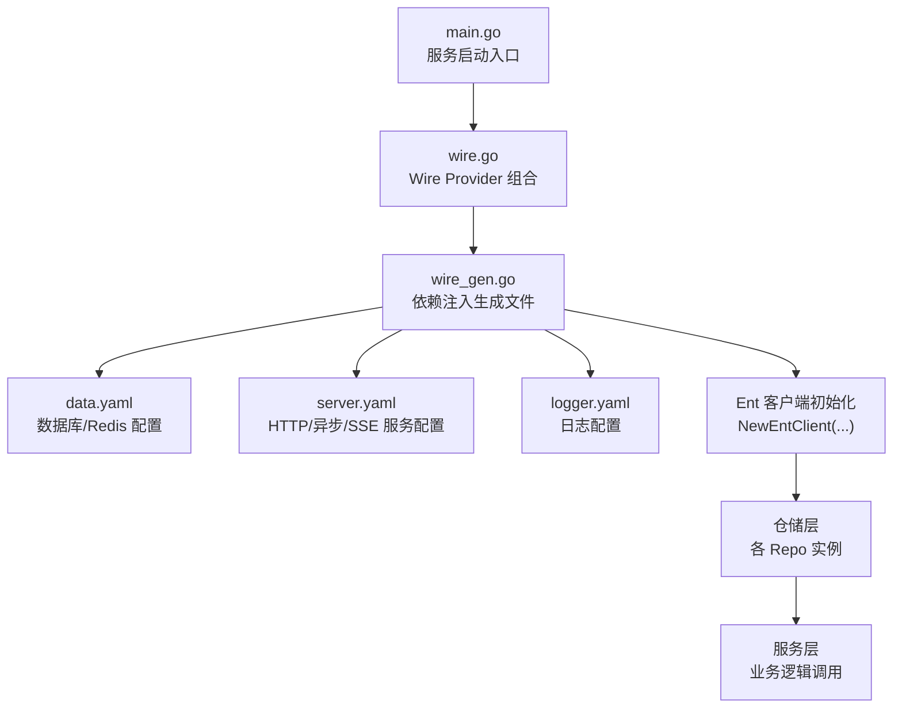
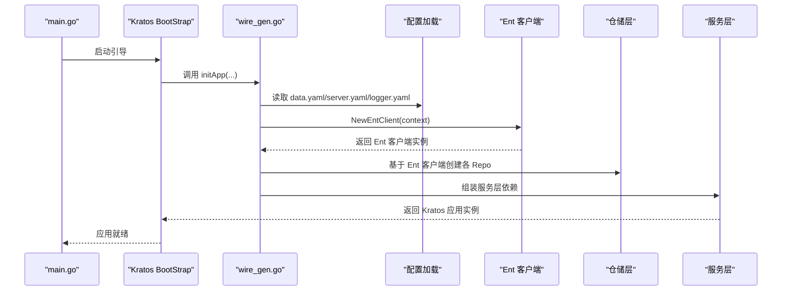
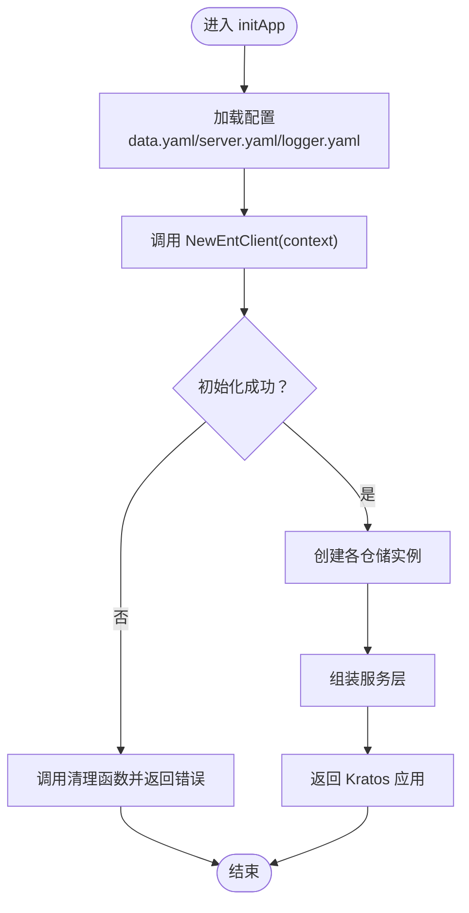
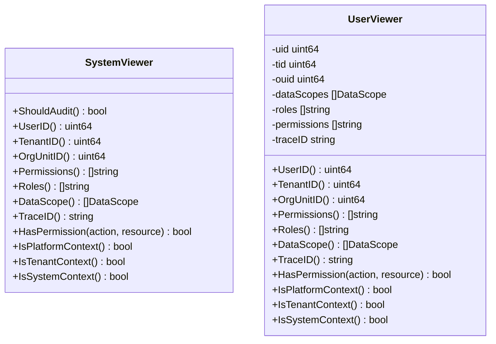
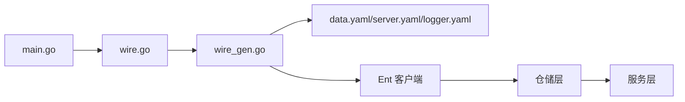

# Ent ORM 集成

<cite>
**本文引用的文件**
- [main.go](file://backend/app/admin/service/cmd/server/main.go)
- [wire.go](file://backend/app/admin/service/cmd/server/wire.go)
- [wire_gen.go](file://backend/app/admin/service/cmd/server/wire_gen.go)
- [data.yaml](file://backend/app/admin/service/configs/data.yaml)
- [server.yaml](file://backend/app/admin/service/configs/server.yaml)
- [logger.yaml](file://backend/app/admin/service/configs/logger.yaml)
- [system_viewer.go](file://backend/pkg/entgo/viewer/system_viewer.go)
- [user_viewer.go](file://backend/pkg/entgo/viewer/user_viewer.go)
</cite>

## 目录
1. [简介](#简介)
2. [项目结构](#项目结构)
3. [核心组件](#核心组件)
4. [架构总览](#架构总览)
5. [详细组件分析](#详细组件分析)
6. [依赖分析](#依赖分析)
7. [性能考虑](#性能考虑)
8. [故障排查指南](#故障排查指南)
9. [结论](#结论)
10. [附录](#附录)

## 简介
本文件面向 Ent ORM 在本项目中的集成与使用，围绕以下目标展开：数据库连接配置、驱动程序设置、自动迁移机制；Ent 客户端初始化流程（含日志配置、错误处理、连接池管理）；运行时配置与自定义选项；以及基于现有代码的配置参数说明、最佳实践与常见问题解决方案。文档严格依据仓库内实际文件进行分析与总结。

## 项目结构
本项目采用 Kratos BootStrap 引导框架，服务启动入口通过 Wire 依赖注入完成应用装配。Ent ORM 的客户端由数据层提供者负责创建与生命周期管理，其余模块通过仓储接口与服务层交互。

**图表来源**
- [main.go:1-76](file://backend/app/admin/service/cmd/server/main.go#L1-L76)
- [wire.go:1-47](file://backend/app/admin/service/cmd/server/wire.go#L1-L47)
- [wire_gen.go:1-134](file://backend/app/admin/service/cmd/server/wire_gen.go#L1-L134)
- [data.yaml:1-21](file://backend/app/admin/service/configs/data.yaml#L1-L21)
- [server.yaml:1-49](file://backend/app/admin/service/configs/server.yaml#L1-L49)
- [logger.yaml:1-32](file://backend/app/admin/service/configs/logger.yaml#L1-L32)

**章节来源**
- [main.go:1-76](file://backend/app/admin/service/cmd/server/main.go#L1-L76)
- [wire.go:1-47](file://backend/app/admin/service/cmd/server/wire.go#L1-L47)
- [wire_gen.go:1-134](file://backend/app/admin/service/cmd/server/wire_gen.go#L1-L134)

## 核心组件
- 数据库配置与连接池
  - 驱动与连接字符串：Postgres 驱动与连接串已启用；MySQL 作为注释保留以便切换。
  - 自动迁移：开启 migrate。
  - 调试与追踪：debug、enable_trace 关闭；metrics 关闭。
  - 连接池：最大空闲连接 25，最大打开连接 25，连接最大存活时间 300 秒。
- 日志配置
  - 支持多种日志后端类型（std/file/fluent/zap/logrus/aliyun/tencent），当前示例使用 std。
  - 可按需启用不同后端的特定参数（如 zap 的文件名、大小、保留天数等）。
- 服务配置
  - REST 服务器地址与超时、Swagger 与 pprof 开关、CORS 配置、中间件开关。
  - Asynq 异步队列：Redis 地址、编码、并发、队列优先级与队列权重。
  - SSE 事件推送：监听地址、路径、自动流式等。
- Ent 视图器（Viewer）
  - 系统视图器：平台上下文、系统任务上下文标识。
  - 用户视图器：用户ID、租户ID、组织单元ID、数据范围、角色与权限集合、TraceID、审计开关等。

**章节来源**
- [data.yaml:1-21](file://backend/app/admin/service/configs/data.yaml#L1-L21)
- [logger.yaml:1-32](file://backend/app/admin/service/configs/logger.yaml#L1-L32)
- [server.yaml:1-49](file://backend/app/admin/service/configs/server.yaml#L1-L49)
- [system_viewer.go:1-79](file://backend/pkg/entgo/viewer/system_viewer.go#L1-L79)
- [user_viewer.go:1-117](file://backend/pkg/entgo/viewer/user_viewer.go#L1-L117)

## 架构总览
下图展示了从服务启动到 Ent 客户端初始化、仓储与服务装配的整体流程。

**图表来源**
- [main.go:59-75](file://backend/app/admin/service/cmd/server/main.go#L59-L75)
- [wire_gen.go:30-133](file://backend/app/admin/service/cmd/server/wire_gen.go#L30-L133)
- [data.yaml:1-21](file://backend/app/admin/service/configs/data.yaml#L1-L21)
- [server.yaml:1-49](file://backend/app/admin/service/configs/server.yaml#L1-L49)
- [logger.yaml:1-32](file://backend/app/admin/service/configs/logger.yaml#L1-L32)

## 详细组件分析

### 数据库连接与自动迁移
- 驱动与连接源
  - Postgres 驱动与连接串已启用，适用于开发与生产环境。
  - MySQL 作为注释保留，便于在需要时切换。
- 自动迁移
  - migrate: true 表示启动时执行迁移，确保模式一致性。
- 调试与追踪
  - debug: false，避免在生产环境输出过多调试信息。
  - enable_trace: false，不启用数据库追踪。
  - enable_metrics: false，不启用指标采集。
- 连接池
  - max_idle_connections: 25
  - max_open_connections: 25
  - connection_max_lifetime: 300s
  - 建议结合数据库负载与延迟特征调整，避免连接不足或过度占用。

最佳实践
- 生产环境建议开启日志与指标，配合监控系统观察连接池健康。
- 对高并发场景，评估 max_open_connections 与连接复用策略，避免峰值抖动。
- 使用只读副本或连接池中间件以提升可用性与稳定性。

**章节来源**
- [data.yaml:1-21](file://backend/app/admin/service/configs/data.yaml#L1-L21)

### Ent 客户端初始化流程
- 初始化入口
  - 通过 wire_gen.go 中的 initApp(...) 完成依赖注入与应用装配。
  - 在 initApp 中调用 data.NewEntClient(context) 获取 Ent 客户端。
- 生命周期管理
  - wire_gen.go 中对 Ent 客户端的清理函数进行组合，确保应用关闭时释放资源。
- 错误处理
  - 若 NewEntClient 返回错误，立即调用已建立的清理函数并返回错误，避免资源泄漏。
- 日志与可观测性
  - data.yaml 中未直接配置 Ent 日志级别，但可通过全局 logger.yaml 控制日志输出格式与级别。
  - enable_trace 与 enable_metrics 在 data.yaml 中关闭，若需追踪与指标，请按需开启。

**图表来源**
- [wire_gen.go:30-133](file://backend/app/admin/service/cmd/server/wire_gen.go#L30-L133)
- [data.yaml:1-21](file://backend/app/admin/service/configs/data.yaml#L1-L21)
- [logger.yaml:1-32](file://backend/app/admin/service/configs/logger.yaml#L1-L32)

**章节来源**
- [wire.go:27-46](file://backend/app/admin/service/cmd/server/wire.go#L27-L46)
- [wire_gen.go:30-133](file://backend/app/admin/service/cmd/server/wire_gen.go#L30-L133)

### 运行时配置与自定义选项
- 服务层配置
  - REST 服务器：地址、超时、Swagger、pprof、CORS、中间件开关。
  - Asynq：Redis URI、编码、并发、队列权重、位置与时区。
  - SSE：监听地址、路径、自动流式等。
- 日志配置
  - 支持多种后端类型与参数，可根据部署环境选择合适方案。
- Ent 视图器
  - 系统视图器：适合后台任务与平台管理场景。
  - 用户视图器：支持多维度数据范围、角色与权限、审计开关等。

**章节来源**
- [server.yaml:1-49](file://backend/app/admin/service/configs/server.yaml#L1-L49)
- [logger.yaml:1-32](file://backend/app/admin/service/configs/logger.yaml#L1-L32)
- [system_viewer.go:1-79](file://backend/pkg/entgo/viewer/system_viewer.go#L1-L79)
- [user_viewer.go:1-117](file://backend/pkg/entgo/viewer/user_viewer.go#L1-L117)

### Ent 视图器类结构

**图表来源**
- [system_viewer.go:9-79](file://backend/pkg/entgo/viewer/system_viewer.go#L9-L79)
- [user_viewer.go:9-117](file://backend/pkg/entgo/viewer/user_viewer.go#L9-L117)

**章节来源**
- [system_viewer.go:1-79](file://backend/pkg/entgo/viewer/system_viewer.go#L1-L79)
- [user_viewer.go:1-117](file://backend/pkg/entgo/viewer/user_viewer.go#L1-L117)

## 依赖分析
- Wire 注入链路
  - main.go -> bootstrap.NewApp(...) -> wire_gen.go 中的 initApp(...) -> data.NewEntClient(...) -> 各仓储与服务实例。
- 配置依赖
  - data.yaml 提供数据库与 Redis 配置；server.yaml 提供服务层配置；logger.yaml 提供日志配置。
- 清理与错误传播
  - wire_gen.go 明确在初始化失败时调用清理函数，避免资源泄漏。

**图表来源**
- [main.go:59-75](file://backend/app/admin/service/cmd/server/main.go#L59-L75)
- [wire.go:27-46](file://backend/app/admin/service/cmd/server/wire.go#L27-L46)
- [wire_gen.go:30-133](file://backend/app/admin/service/cmd/server/wire_gen.go#L30-L133)
- [data.yaml:1-21](file://backend/app/admin/service/configs/data.yaml#L1-L21)
- [server.yaml:1-49](file://backend/app/admin/service/configs/server.yaml#L1-L49)
- [logger.yaml:1-32](file://backend/app/admin/service/configs/logger.yaml#L1-L32)

**章节来源**
- [main.go:59-75](file://backend/app/admin/service/cmd/server/main.go#L59-L75)
- [wire.go:27-46](file://backend/app/admin/service/cmd/server/wire.go#L27-L46)
- [wire_gen.go:30-133](file://backend/app/admin/service/cmd/server/wire_gen.go#L30-L133)

## 性能考虑
- 连接池调优
  - 结合数据库性能与延迟特征，动态调整 max_idle_connections 与 max_open_connections。
  - connection_max_lifetime 需平衡连接复用与过期回收。
- 迁移与模式一致性
  - migrate: true 在启动时执行迁移，建议在灰度发布或维护窗口执行，减少对在线业务的影响。
- 日志与追踪
  - debug 与 enable_trace 默认关闭，生产环境建议保持现状；如需诊断，临时开启并注意日志量。
- 服务层并发
  - Asynq 的并发与队列权重应根据任务类型与资源配额合理分配，避免队列饥饿或资源争用。

## 故障排查指南
- 启动失败与清理
  - 若 Ent 客户端初始化失败，wire_gen.go 会调用清理函数并返回错误，检查数据库连接串与凭据。
- 连接池异常
  - 观察 max_idle_connections 与 max_open_connections 是否与数据库最大连接数匹配；适当降低峰值连接数。
- 迁移失败
  - 检查 migrate: true 时的数据库权限与网络连通性；必要时手动执行迁移脚本。
- 日志输出
  - 根据 logger.yaml 选择合适的日志后端与级别；std 适合开发调试，zap/logrus 等适合生产落地。

**章节来源**
- [wire_gen.go:39-43](file://backend/app/admin/service/cmd/server/wire_gen.go#L39-L43)
- [data.yaml:1-21](file://backend/app/admin/service/configs/data.yaml#L1-L21)
- [logger.yaml:1-32](file://backend/app/admin/service/configs/logger.yaml#L1-L32)

## 结论
本项目通过 Kratos BootStrap 与 Wire 实现了 Ent ORM 的自动化装配与生命周期管理。数据库连接、驱动与迁移均已在配置中明确；日志与服务层配置提供了良好的可观测性基础。建议在生产环境中结合监控与告警完善日志与指标体系，并根据业务负载持续优化连接池与迁移策略。

## 附录
- 配置参数速查
  - 数据库：driver、source、migrate、debug、enable_trace、enable_metrics、max_idle_connections、max_open_connections、connection_max_lifetime
  - 服务：REST 地址与超时、Swagger、pprof、CORS、中间件开关；Asynq Redis URI、编码、并发、队列权重、位置；SSE 地址、路径、自动流式
  - 日志：type、fluent、zap、logrus、aliyun、tencent 等后端参数