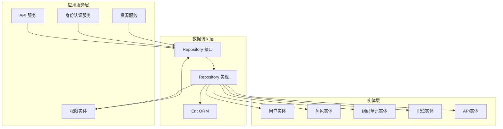
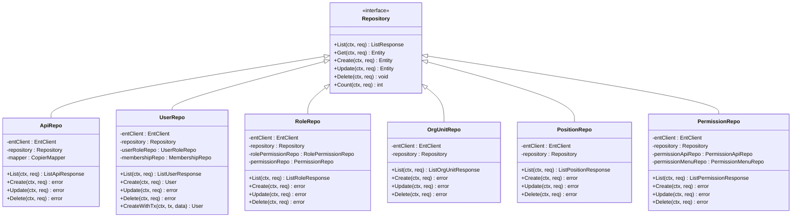
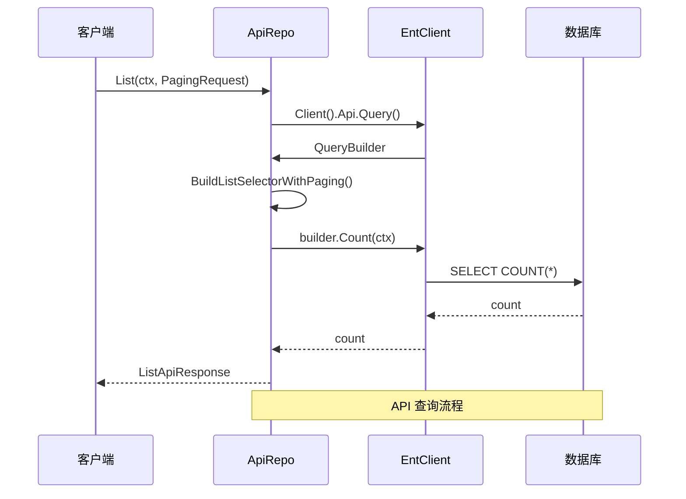
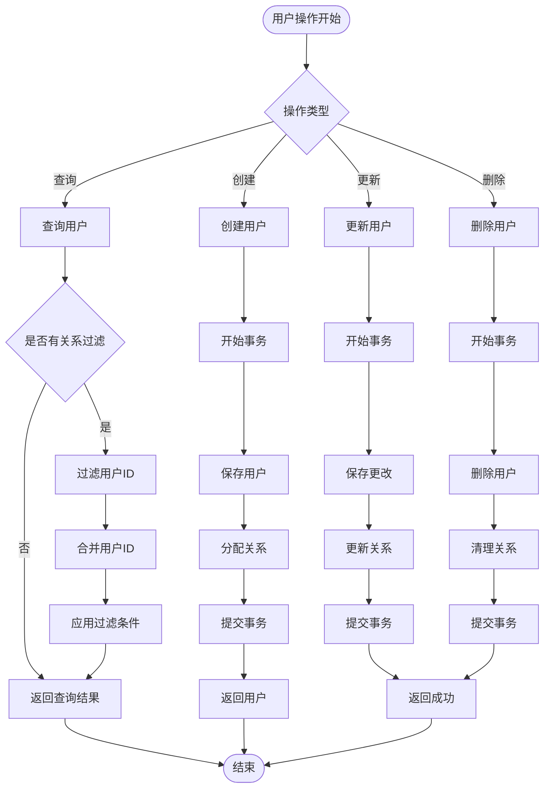
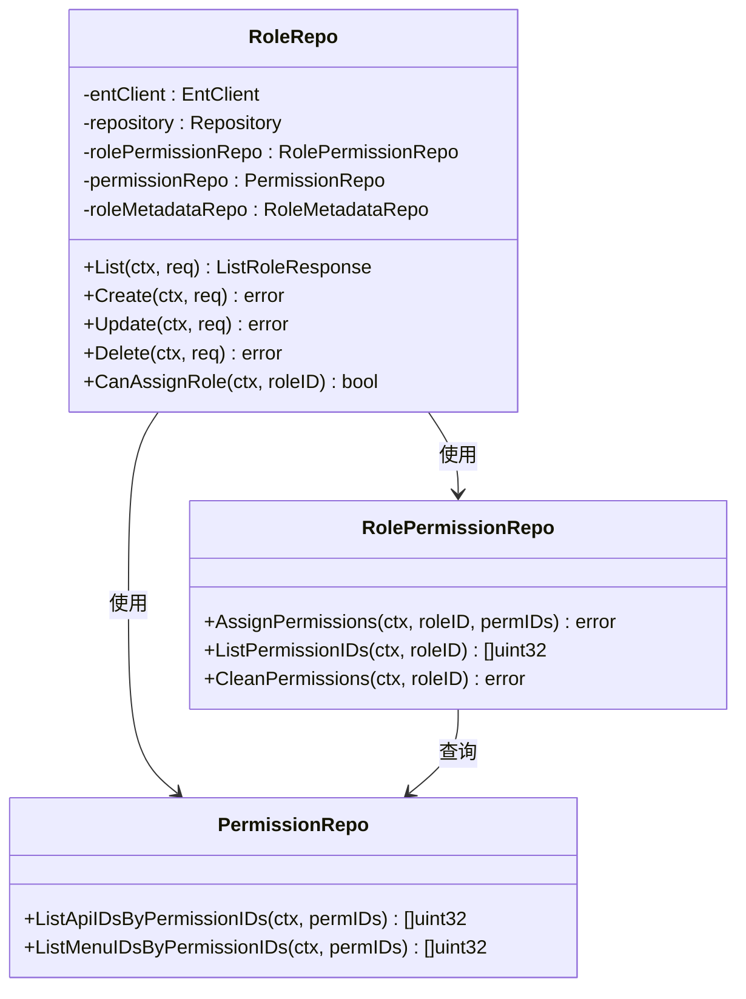
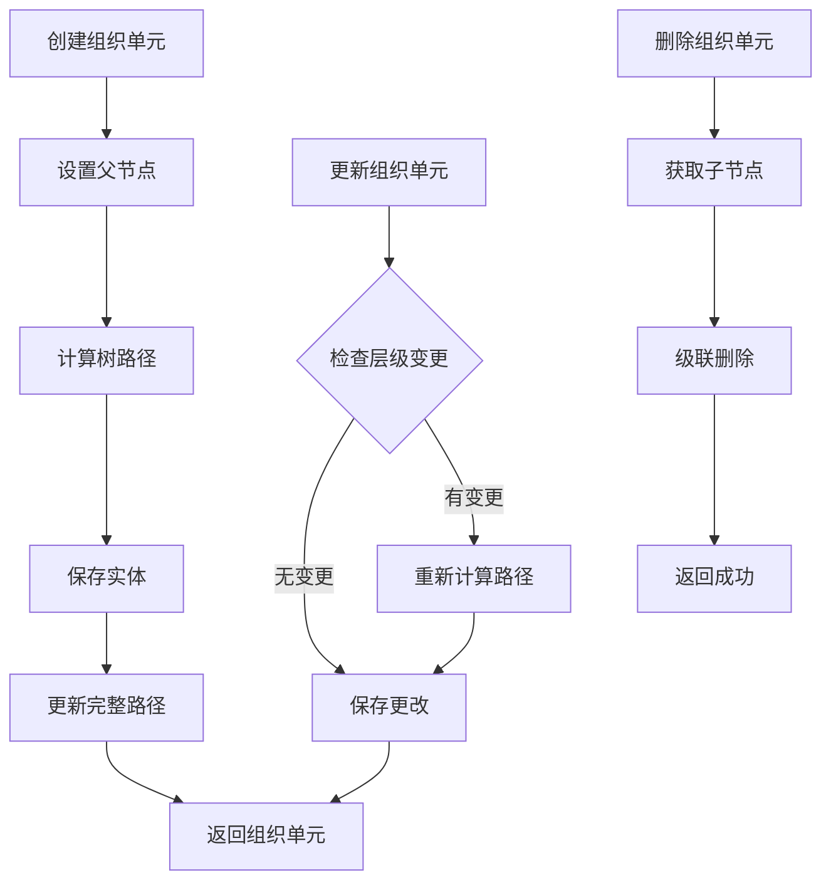
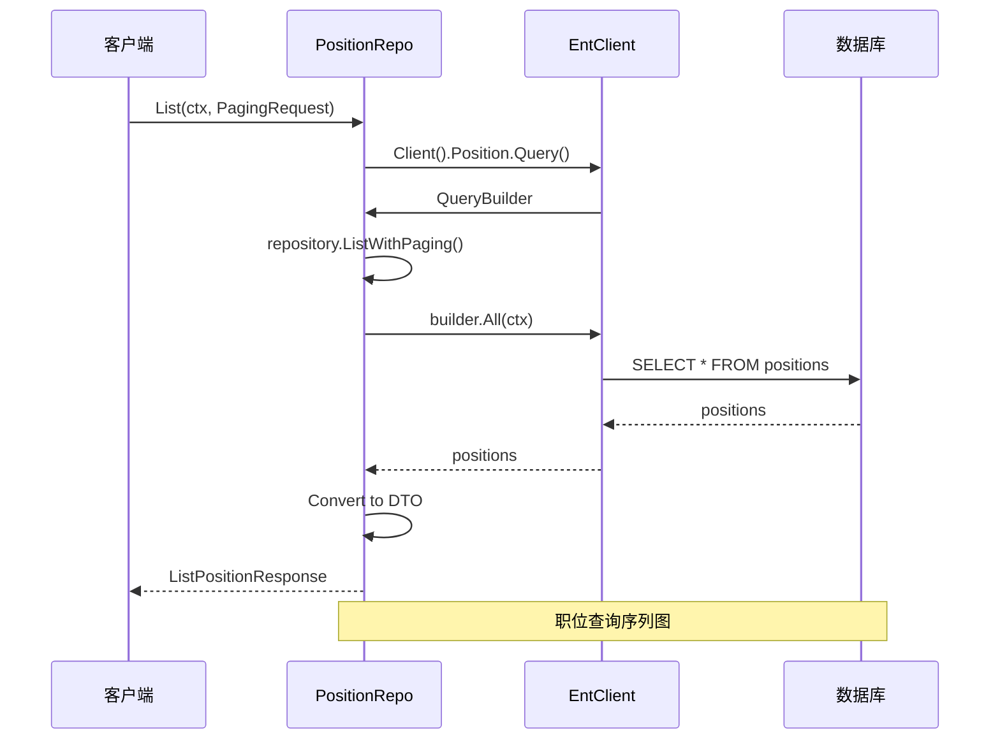
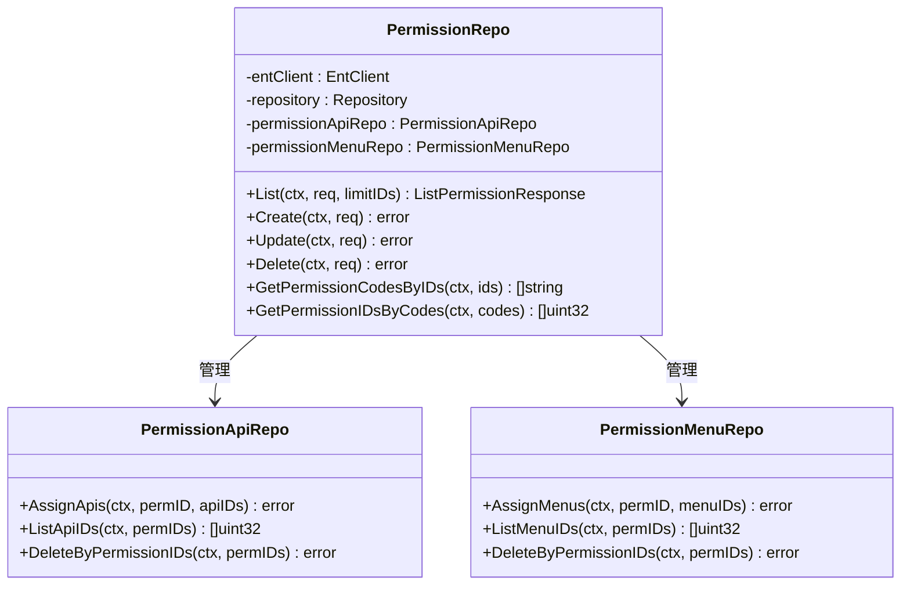
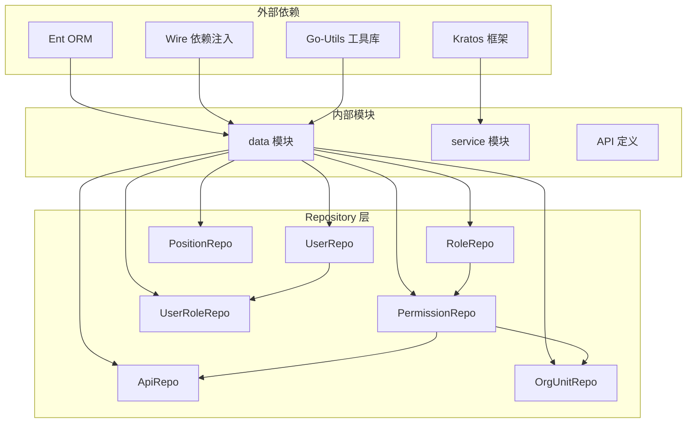

# Repository 模式实现

<cite>
**本文档引用的文件**
- [main.go](file://backend/app/admin/service/cmd/server/main.go)
- [wire.go](file://backend/app/admin/service/cmd/server/wire.go)
- [api_repo.go](file://backend/app/admin/service/internal/data/api_repo.go)
- [user_repo.go](file://backend/app/admin/service/internal/data/user_repo.go)
- [role_repo.go](file://backend/app/admin/service/internal/data/role_repo.go)
- [org_unit_repo.go](file://backend/app/admin/service/internal/data/org_unit_repo.go)
- [position_repo.go](file://backend/app/admin/service/internal/data/position_repo.go)
- [permission_repo.go](file://backend/app/admin/service/internal/data/permission_repo.go)
- [user_role_repo.go](file://backend/app/admin/service/internal/data/user_role_repo.go)
</cite>

## 目录
1. [简介](#简介)
2. [项目结构](#项目结构)
3. [核心组件](#核心组件)
4. [架构概览](#架构概览)
5. [详细组件分析](#详细组件分析)
6. [依赖分析](#依赖分析)
7. [性能考虑](#性能考虑)
8. [故障排除指南](#故障排除指南)
9. [结论](#结论)

## 简介

本文档深入解析 Go-Wind 项目中 Repository 模式的设计与实现。Repository 模式作为数据访问层的重要设计模式，通过抽象数据访问逻辑，提供统一的接口来管理实体对象的持久化。在本项目中，Repository 模式被广泛应用于用户、角色、组织单元、职位、权限等核心实体的数据访问操作。

该项目采用 Ent 库作为 ORM 框架，结合自定义的 Repository 基类，实现了类型安全的数据访问层。每个实体都有对应的 Repository 实现，提供了完整的 CRUD 操作、批量操作、事务处理等功能。

## 项目结构

项目采用模块化的架构设计，数据访问层位于 `backend/app/admin/service/internal/data` 目录下，按照实体类型进行组织：

**图表来源**
- [main.go:1-76](file://backend/app/admin/service/cmd/server/main.go#L1-L76)
- [wire.go:1-47](file://backend/app/admin/service/cmd/server/wire.go#L1-L47)

**章节来源**
- [main.go:1-76](file://backend/app/admin/service/cmd/server/main.go#L1-L76)
- [wire.go:1-47](file://backend/app/admin/service/cmd/server/wire.go#L1-L47)

## 核心组件

### Repository 基础架构

项目中的 Repository 实现基于一个通用的 Repository 基类，该基类提供了以下核心功能：

1. **类型安全的泛型支持**：通过泛型参数定义查询、选择、创建、更新、删除等操作的类型
2. **自动映射机制**：内置 DTO 和实体之间的双向转换
3. **分页查询支持**：统一的分页查询接口
4. **条件过滤**：灵活的查询条件构建
5. **批量操作**：高效的批量插入和更新

### Ent 集成

Repository 实现深度集成了 Ent ORM 框架，提供了以下优势：

- **编译时类型检查**：所有数据库操作在编译时验证
- **链式查询构建**：直观的查询构建语法
- **事务支持**：原生的事务管理能力
- **关系查询**：复杂的多表关联查询

**章节来源**
- [api_repo.go:25-71](file://backend/app/admin/service/internal/data/api_repo.go#L25-L71)
- [user_repo.go:70-134](file://backend/app/admin/service/internal/data/user_repo.go#L70-L134)
- [role_repo.go:27-93](file://backend/app/admin/service/internal/data/role_repo.go#L27-L93)

## 架构概览

**图表来源**
- [api_repo.go:25-326](file://backend/app/admin/service/internal/data/api_repo.go#L25-L326)
- [user_repo.go:70-800](file://backend/app/admin/service/internal/data/user_repo.go#L70-L800)
- [role_repo.go:27-719](file://backend/app/admin/service/internal/data/role_repo.go#L27-L719)
- [org_unit_repo.go:27-423](file://backend/app/admin/service/internal/data/org_unit_repo.go#L27-L423)
- [position_repo.go:25-300](file://backend/app/admin/service/internal/data/position_repo.go#L25-L300)
- [permission_repo.go:28-605](file://backend/app/admin/service/internal/data/permission_repo.go#L28-L605)

## 详细组件分析

### API Repository 实现

API Repository 是最简单的实体 Repository 实现，专注于 API 资源的管理：

**图表来源**
- [api_repo.go:92-111](file://backend/app/admin/service/internal/data/api_repo.go#L92-L111)

API Repository 提供了以下核心功能：

1. **基础 CRUD 操作**：完整的增删改查功能
2. **批量操作**：支持批量插入和更新
3. **条件查询**：支持按 ID、路径、方法等多种条件查询
4. **存在性检查**：快速检查 API 资源是否存在

**章节来源**
- [api_repo.go:73-326](file://backend/app/admin/service/internal/data/api_repo.go#L73-L326)

### 用户 Repository 实现

用户 Repository 是最复杂的实体 Repository，需要处理多种关联关系：

**图表来源**
- [user_repo.go:289-422](file://backend/app/admin/service/internal/data/user_repo.go#L289-L422)

用户 Repository 的特点：

1. **复杂关系管理**：处理用户与角色、组织单元、职位的多对多关系
2. **事务一致性**：确保用户创建、更新、删除操作的原子性
3. **灵活的查询**：支持基于关系的复杂查询
4. **批量操作**：支持批量用户操作

**章节来源**
- [user_repo.go:136-800](file://backend/app/admin/service/internal/data/user_repo.go#L136-L800)

### 角色 Repository 实现

角色 Repository 专注于角色管理，同时维护角色与权限的关联关系：

**图表来源**
- [role_repo.go:27-719](file://backend/app/admin/service/internal/data/role_repo.go#L27-L719)

角色 Repository 的核心功能：

1. **角色生命周期管理**：完整的角色创建、更新、删除流程
2. **权限关联管理**：维护角色与权限的多对多关系
3. **角色模板系统**：支持基于模板创建租户角色
4. **权限继承**：通过角色继承权限

**章节来源**
- [role_repo.go:95-719](file://backend/app/admin/service/internal/data/role_repo.go#L95-L719)

### 组织单元 Repository 实现

组织单元 Repository 处理树形结构的组织管理：

**图表来源**
- [org_unit_repo.go:367-397](file://backend/app/admin/service/internal/data/org_unit_repo.go#L367-L397)

组织单元 Repository 的特色功能：

1. **树形结构管理**：支持父子关系的树形结构
2. **路径计算**：自动计算和维护组织单元的完整路径
3. **级联操作**：删除父节点时自动处理子节点
4. **层级遍历**：支持树形结构的查询和遍历

**章节来源**
- [org_unit_repo.go:76-423](file://backend/app/admin/service/internal/data/org_unit_repo.go#L76-L423)

### 职位 Repository 实现

职位 Repository 管理职位信息和汇报关系：

**图表来源**
- [position_repo.go:110-129](file://backend/app/admin/service/internal/data/position_repo.go#L110-L129)

职位 Repository 的特点：

1. **汇报关系管理**：支持职位间的汇报关系
2. **层级结构**：支持多层级的职位结构
3. **统计信息**：支持职位相关的统计查询

**章节来源**
- [position_repo.go:78-300](file://backend/app/admin/service/internal/data/position_repo.go#L78-L300)

### 权限 Repository 实现

权限 Repository 是权限系统的核心，管理权限与 API、菜单的关联：

**图表来源**
- [permission_repo.go:28-605](file://backend/app/admin/service/internal/data/permission_repo.go#L28-L605)

权限 Repository 的核心功能：

1. **权限生命周期管理**：完整的权限 CRUD 操作
2. **多维度关联**：权限与 API、菜单的关联管理
3. **批量操作**：支持批量权限操作
4. **权限查询优化**：针对权限查询的特殊优化

**章节来源**
- [permission_repo.go:86-605](file://backend/app/admin/service/internal/data/permission_repo.go#L86-L605)

## 依赖分析

**图表来源**
- [main.go:3-40](file://backend/app/admin/service/cmd/server/main.go#L3-L40)
- [wire.go:16-46](file://backend/app/admin/service/cmd/server/wire.go#L16-L46)

依赖关系分析：

1. **核心依赖**：Ent ORM、Kratos 框架、Wire 依赖注入
2. **工具库依赖**：Go-Utils 提供的映射、转换、时间处理等功能
3. **模块间依赖**：Repository 之间存在清晰的依赖关系
4. **接口隔离**：每个 Repository 都有明确的职责边界

**章节来源**
- [main.go:3-40](file://backend/app/admin/service/cmd/server/main.go#L3-L40)
- [wire.go:16-46](file://backend/app/admin/service/cmd/server/wire.go#L16-L46)

## 性能考虑

### 查询优化策略

1. **索引优化**：为常用查询字段建立适当的数据库索引
2. **批量操作**：使用批量插入和更新减少数据库往返
3. **分页查询**：合理使用分页避免一次性加载大量数据
4. **选择性字段**：使用 FieldMask 只查询必要的字段

### 缓存策略

1. **读写分离**：热点数据使用缓存，写操作保持数据库一致性
2. **失效策略**：设置合理的缓存过期时间
3. **预热机制**：启动时预加载常用数据

### 事务管理

1. **最小化事务范围**：只在必要时使用事务
2. **超时控制**：设置合理的事务超时时间
3. **死锁预防**：避免复杂的跨表事务

## 故障排除指南

### 常见问题及解决方案

1. **连接池耗尽**
   - 检查数据库连接配置
   - 优化查询性能减少连接占用
   - 合理设置连接池大小

2. **事务回滚**
   - 检查事务中的异常处理
   - 确保所有分支都有正确的错误处理
   - 使用 defer 语句确保资源正确释放

3. **性能问题**
   - 分析慢查询日志
   - 添加必要的数据库索引
   - 优化复杂的关联查询

**章节来源**
- [user_repo.go:466-486](file://backend/app/admin/service/internal/data/user_repo.go#L466-L486)
- [role_repo.go:373-394](file://backend/app/admin/service/internal/data/role_repo.go#L373-L394)

## 结论

Go-Wind 项目中的 Repository 模式实现展现了现代 Go 应用开发的最佳实践。通过类型安全的泛型设计、完善的事务管理、灵活的关系处理，以及高效的查询优化，该项目为复杂的企业级应用提供了坚实的数据访问层基础。

Repository 模式的成功实施主要体现在以下几个方面：

1. **清晰的职责分离**：每个 Repository 专注于特定实体的数据访问
2. **强大的扩展性**：通过接口设计支持功能扩展和定制
3. **高性能的实现**：结合 Ent ORM 和优化策略提供优秀的性能表现
4. **良好的可维护性**：标准化的代码结构便于团队协作和长期维护

这种实现方式不仅满足了当前的功能需求，也为未来的功能扩展和技术演进奠定了良好的基础。