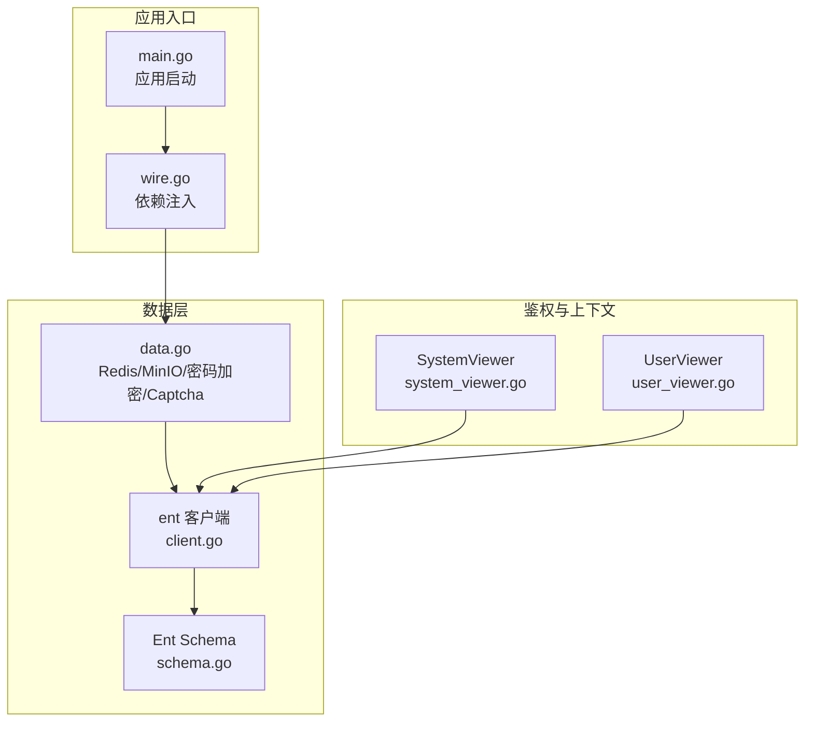
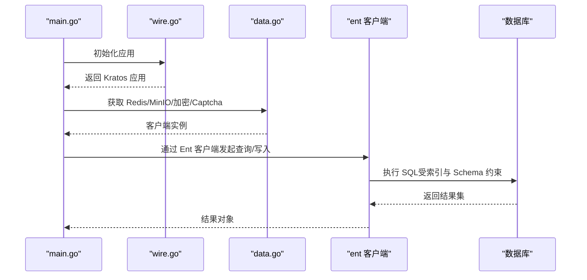
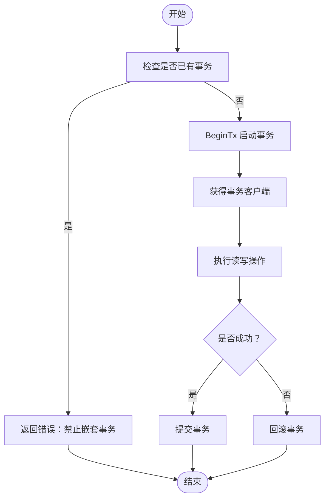
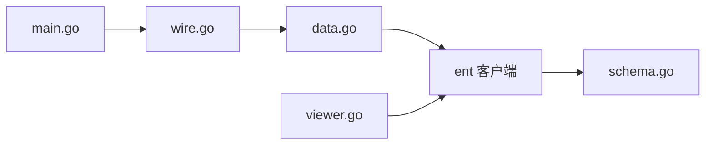

# 数据库操作

<cite>
**本文引用的文件**
- [main.go](file://backend/app/admin/service/cmd/server/main.go)
- [wire.go](file://backend/app/admin/service/cmd/server/wire.go)
- [data.go](file://backend/app/admin/service/internal/data/data.go)
- [schema.go](file://backend/app/admin/service/internal/data/ent/migrate/schema.go)
- [client.go](file://backend/app/admin/service/internal/data/ent/client.go)
- [system_viewer.go](file://backend/pkg/entgo/viewer/system_viewer.go)
- [user_viewer.go](file://backend/pkg/entgo/viewer/user_viewer.go)
</cite>

## 目录
1. [简介](#简介)
2. [项目结构](#项目结构)
3. [核心组件](#核心组件)
4. [架构总览](#架构总览)
5. [详细组件分析](#详细组件分析)
6. [依赖分析](#依赖分析)
7. [性能考虑](#性能考虑)
8. [故障排查指南](#故障排查指南)
9. [结论](#结论)
10. [附录](#附录)

## 简介
本文件面向数据库操作与数据访问层的技术文档，聚焦以下主题：
- 数据库连接管理与驱动选择
- 事务处理机制与最佳实践
- 查询优化策略与索引设计
- 使用 Ent 查询构建器进行条件查询、聚合查询与子查询
- 事务管理（嵌套事务、回滚策略、并发控制）
- 复杂数据操作、批量处理与性能优化
- 数据库连接池配置、查询缓存策略与错误处理机制

## 项目结构
后端采用 Kratos 应用框架，数据层通过 Ent 生成的客户端访问数据库，并结合 Redis 缓存与 MinIO 对象存储。服务启动流程由引导器负责装配，Wire 作为依赖注入容器生成应用实例。

**图表来源**
- [main.go:1-76](file://backend/app/admin/service/cmd/server/main.go#L1-L76)
- [wire.go:1-47](file://backend/app/admin/service/cmd/server/wire.go#L1-L47)
- [data.go:1-63](file://backend/app/admin/service/internal/data/data.go#L1-L63)
- [client.go:240-351](file://backend/app/admin/service/internal/data/ent/client.go#L240-L351)
- [schema.go:1-800](file://backend/app/admin/service/internal/data/ent/migrate/schema.go#L1-L800)
- [system_viewer.go:1-79](file://backend/pkg/entgo/viewer/system_viewer.go#L1-L79)
- [user_viewer.go:1-117](file://backend/pkg/entgo/viewer/user_viewer.go#L1-L117)

**章节来源**
- [main.go:1-76](file://backend/app/admin/service/cmd/server/main.go#L1-L76)
- [wire.go:1-47](file://backend/app/admin/service/cmd/server/wire.go#L1-L47)
- [data.go:1-63](file://backend/app/admin/service/internal/data/data.go#L1-L63)

## 核心组件
- 应用启动与依赖注入
  - 应用入口负责初始化引导上下文与 Kratos 应用实例；依赖注入通过 Wire 组合 Provider 集合完成。
- 数据访问层
  - 提供 Redis 客户端、MinIO 客户端、密码加密工具与验证码组件的工厂方法。
- Ent 客户端与 Schema
  - 通过 Ent 生成的客户端访问数据库；Schema 定义了多张业务表及索引，支撑查询优化与审计日志等场景。
- 视图上下文（Viewer）
  - SystemViewer 与 UserViewer 提供租户、组织单元、数据范围、权限等上下文能力，辅助数据权限与审计策略。

**章节来源**
- [main.go:1-76](file://backend/app/admin/service/cmd/server/main.go#L1-L76)
- [wire.go:1-47](file://backend/app/admin/service/cmd/server/wire.go#L1-L47)
- [data.go:1-63](file://backend/app/admin/service/internal/data/data.go#L1-L63)
- [schema.go:1-800](file://backend/app/admin/service/internal/data/ent/migrate/schema.go#L1-L800)
- [system_viewer.go:1-79](file://backend/pkg/entgo/viewer/system_viewer.go#L1-L79)
- [user_viewer.go:1-117](file://backend/pkg/entgo/viewer/user_viewer.go#L1-L117)

## 架构总览
下图展示了从应用启动到数据访问的整体流程，以及 Ent 客户端与数据库 Schema 的交互关系。

**图表来源**
- [main.go:1-76](file://backend/app/admin/service/cmd/server/main.go#L1-L76)
- [wire.go:1-47](file://backend/app/admin/service/cmd/server/wire.go#L1-L47)
- [data.go:1-63](file://backend/app/admin/service/internal/data/data.go#L1-L63)
- [client.go:240-351](file://backend/app/admin/service/internal/data/ent/client.go#L240-L351)

## 详细组件分析

### 数据库连接管理
- 驱动与打开连接
  - 支持 MySQL、Postgres、SQLite 驱动；Open 函数根据驱动名与数据源字符串创建底层 sql.DB 并封装为 Ent 客户端。
- 连接池配置
  - 通过底层 sql.DB 的连接池参数（最大连接数、空闲连接数、连接生命周期）进行调优，建议结合数据库类型与负载特征设置。
- 连接生命周期
  - 在应用关闭时释放资源，确保连接安全回收。

**章节来源**
- [client.go:240-261](file://backend/app/admin/service/internal/data/ent/client.go#L240-L261)

### 事务处理机制
- 开启事务
  - BeginTx 接受上下文与事务选项，若当前驱动已是事务驱动则拒绝开启新事务，避免嵌套事务。
- 事务客户端
  - 成功开启后返回 Tx 客户端，内部持有事务级驱动，所有后续操作均在该事务上下文中执行。
- 回滚与提交
  - 通过事务客户端的回滚/提交接口完成一致性控制；建议在业务层统一异常处理，失败时回滚，成功时提交。
- 嵌套事务与并发控制
  - 不支持在同一客户端上开启嵌套事务；并发控制建议结合数据库锁（排他/共享）、分布式锁与幂等设计。

**图表来源**
- [client.go:322-351](file://backend/app/admin/service/internal/data/ent/client.go#L322-L351)

**章节来源**
- [client.go:322-351](file://backend/app/admin/service/internal/data/ent/client.go#L322-L351)

### 查询优化策略与索引设计
- 索引覆盖
  - 多表定义了复合唯一索引与普通索引，覆盖常见过滤字段（租户、创建时间、状态、路径+方法等），有助于减少全表扫描。
- 聚合与审计
  - 审计日志表包含按租户、时间、状态、用户等维度的索引，便于统计与报表查询。
- 字段选择与分页
  - 建议仅查询必要列，配合分页与游标式分页，避免一次性加载大结果集。
- 批量写入
  - 使用事务包裹批量插入/更新，减少往返开销。

**章节来源**
- [schema.go:1-800](file://backend/app/admin/service/internal/data/ent/migrate/schema.go#L1-L800)

### Ent 查询构建器使用方法
- 条件查询
  - 使用 Ent 客户端提供的 where 子句组合器，结合索引字段进行高效过滤。
- 聚合查询
  - 可通过原生 SQL 或数据库方言扩展实现聚合统计，再映射到实体模型。
- 子查询
  - 对于跨表关联与去重逻辑，可借助子查询或 JOIN 实现，注意索引命中与执行计划。
- 数据范围与权限
  - 结合 Viewer 上下文中的数据范围与权限集合，动态拼接查询条件，实现最小权限原则。

**章节来源**
- [system_viewer.go:1-79](file://backend/pkg/entgo/viewer/system_viewer.go#L1-L79)
- [user_viewer.go:1-117](file://backend/pkg/entgo/viewer/user_viewer.go#L1-L117)

### 事务管理最佳实践
- 统一入口
  - 将事务封装在服务层，避免在控制器或数据层直接暴露事务细节。
- 错误即回滚
  - 捕获异常后立即回滚，保证数据一致性；提交前进行最终校验。
- 幂等性
  - 对外接口应具备幂等能力，避免重复提交导致副作用。
- 并发控制
  - 使用数据库锁或分布式锁保护关键资源；对热点数据采用读写分离与缓存降压。

**章节来源**
- [client.go:322-351](file://backend/app/admin/service/internal/data/ent/client.go#L322-L351)

### 复杂数据操作与批量处理
- 批量导入/导出
  - 使用事务包裹批量写入；导出时分批拉取并流式输出，降低内存占用。
- 数据清洗与迁移
  - 基于审计日志与索引，定位异常数据并进行修复；迁移时先建立索引再导入，最后重建索引以提升查询性能。
- 缓存策略
  - 对热点查询结果进行缓存（如字典项、语言配置），结合 TTL 与失效策略；写操作时同步清理相关缓存键。

**章节来源**
- [data.go:1-63](file://backend/app/admin/service/internal/data/data.go#L1-L63)

### 性能优化技巧
- 索引优化
  - 针对高频过滤字段建立合适索引；避免冗余索引导致写入性能下降。
- SQL 调优
  - 使用 EXPLAIN 分析执行计划；避免 N+1 查询，优先使用 JOIN 或预加载。
- 连接池与超时
  - 设置合理的连接池大小与超时时间；对长事务进行拆分，缩短锁持有时间。
- 缓存与异步
  - 对读多写少的数据引入缓存；对耗时操作采用异步队列处理。

**章节来源**
- [schema.go:1-800](file://backend/app/admin/service/internal/data/ent/migrate/schema.go#L1-L800)

### 数据库连接池配置、查询缓存策略与错误处理机制
- 连接池配置
  - 通过 sql.DB 的 SetMaxOpenConns、SetMaxIdleConns、SetConnMaxLifetime 等参数进行调优。
- 查询缓存
  - 使用 Redis 缓存热点查询结果；对字典类数据设置较长 TTL；对敏感数据禁用缓存或进行脱敏。
- 错误处理
  - 对数据库错误进行分类处理（连接失败、超时、约束冲突等）；记录审计日志以便追踪问题。

**章节来源**
- [data.go:1-63](file://backend/app/admin/service/internal/data/data.go#L1-L63)

## 依赖分析
- 组件耦合
  - 应用入口与依赖注入解耦；数据层通过工厂方法提供外部组件；Ent 客户端与 Schema 解耦，便于演进。
- 外部依赖
  - 数据库驱动、Redis 客户端、MinIO 客户端、密码加密与验证码组件均为独立模块，便于替换与测试。
- 循环依赖
  - 未发现循环依赖迹象；各模块职责清晰。

**图表来源**
- [main.go:1-76](file://backend/app/admin/service/cmd/server/main.go#L1-L76)
- [wire.go:1-47](file://backend/app/admin/service/cmd/server/wire.go#L1-L47)
- [data.go:1-63](file://backend/app/admin/service/internal/data/data.go#L1-L63)
- [client.go:240-351](file://backend/app/admin/service/internal/data/ent/client.go#L240-L351)
- [schema.go:1-800](file://backend/app/admin/service/internal/data/ent/migrate/schema.go#L1-L800)
- [system_viewer.go:1-79](file://backend/pkg/entgo/viewer/system_viewer.go#L1-L79)
- [user_viewer.go:1-117](file://backend/pkg/entgo/viewer/user_viewer.go#L1-L117)

**章节来源**
- [main.go:1-76](file://backend/app/admin/service/cmd/server/main.go#L1-L76)
- [wire.go:1-47](file://backend/app/admin/service/cmd/server/wire.go#L1-L47)
- [data.go:1-63](file://backend/app/admin/service/internal/data/data.go#L1-L63)

## 性能考虑
- 读写分离与分库分表
  - 高并发场景下可考虑读写分离与分片策略，结合路由规则与一致性哈希。
- 事务拆分
  - 将长事务拆分为多个短事务，减少锁竞争与回滚成本。
- 索引维护
  - 定期分析与重建索引，监控慢查询日志，持续优化执行计划。

## 故障排查指南
- 连接失败
  - 检查数据库可达性、凭据与网络策略；确认连接池参数合理。
- 超时与死锁
  - 分析事务时长与锁等待；调整超时时间与重试策略。
- 索引缺失
  - 使用 EXPLAIN 定位未命中索引的查询；补充必要索引。
- 审计与回溯
  - 利用审计日志表定位异常操作与失败原因，结合 TraceID 追踪请求链路。

**章节来源**
- [schema.go:1-800](file://backend/app/admin/service/internal/data/ent/migrate/schema.go#L1-L800)

## 结论
本项目通过 Kratos 与 Ent 构建了清晰的数据访问层，配合 Redis 缓存与 MinIO 存储，实现了可扩展、可观测与高性能的数据操作体系。遵循事务最佳实践、索引优化与缓存策略，可在保证一致性的前提下显著提升吞吐与延迟表现。

## 附录
- 示例参考路径
  - 事务开启与回滚：[client.go:322-351](file://backend/app/admin/service/internal/data/ent/client.go#L322-L351)
  - 数据库驱动打开：[client.go:240-261](file://backend/app/admin/service/internal/data/ent/client.go#L240-L261)
  - Redis 客户端创建：[data.go:23-39](file://backend/app/admin/service/internal/data/data.go#L23-L39)
  - MinIO 客户端创建：[data.go:41-43](file://backend/app/admin/service/internal/data/data.go#L41-L43)
  - 密码加密与验证码：[data.go:45-62](file://backend/app/admin/service/internal/data/data.go#L45-L62)
  - 系统视图上下文：[system_viewer.go:1-79](file://backend/pkg/entgo/viewer/system_viewer.go#L1-L79)
  - 用户视图上下文：[user_viewer.go:1-117](file://backend/pkg/entgo/viewer/user_viewer.go#L1-L117)
  - 表结构与索引：[schema.go:1-800](file://backend/app/admin/service/internal/data/ent/migrate/schema.go#L1-L800)