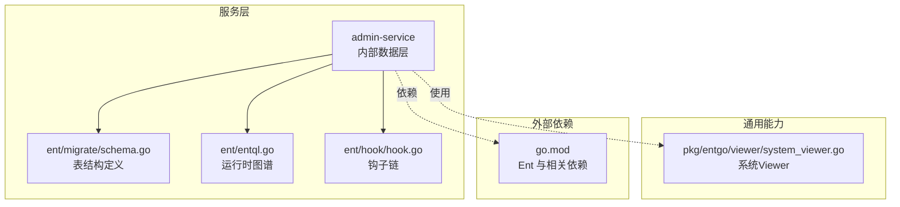
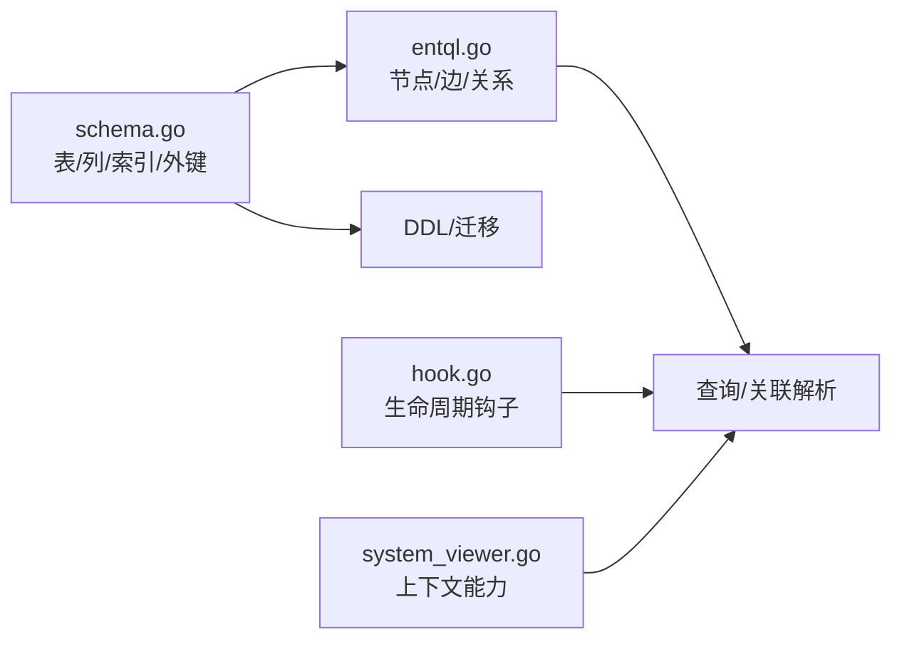
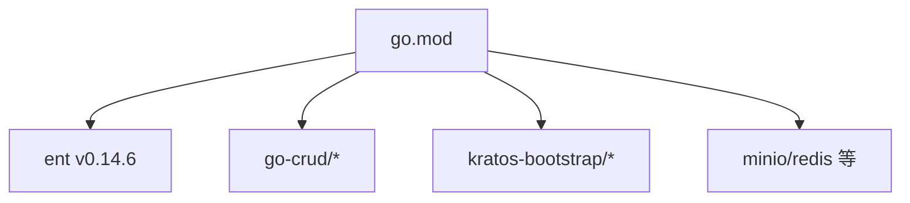

# 数据模型设计

<cite>
**本文引用的文件**
- [schema.go](file://backend/app/admin/service/internal/data/ent/migrate/schema.go)
- [entql.go](file://backend/app/admin/service/internal/data/ent/entql.go)
- [hook.go](file://backend/app/admin/service/internal/data/ent/hook/hook.go)
- [system_viewer.go](file://backend/pkg/entgo/viewer/system_viewer.go)
- [go.mod](file://backend/go.mod)
</cite>

## 目录
1. [简介](#简介)
2. [项目结构](#项目结构)
3. [核心组件](#核心组件)
4. [架构总览](#架构总览)
5. [详细组件分析](#详细组件分析)
6. [依赖分析](#依赖分析)
7. [性能考量](#性能考量)
8. [故障排查指南](#故障排查指南)
9. [结论](#结论)
10. [附录](#附录)

## 简介
本文件聚焦于项目中的数据模型设计与实现，基于 Ent Schema 的自动生成与扩展机制，系统性阐述字段类型选择、约束与索引配置、实体关系映射（一对一、一对多、多对多）、模型验证规则、默认值与触发器配置、模型演进策略与版本管理、性能优化与设计模式应用。文档以仓库中已生成的迁移 schema 文件为核心依据，并结合 Ent 运行时图谱与钩子机制进行说明。

## 项目结构
后端采用分层与模块化的组织方式，数据模型位于服务内部的 ent 子目录，通过 Ent 的迁移工具生成数据库表结构；同时在 pkg 层提供 Viewer 上下文能力，支撑多租户与审计等横切需求。

**图表来源**
- [schema.go:1-800](file://backend/app/admin/service/internal/data/ent/migrate/schema.go#L1-L800)
- [entql.go:52-1278](file://backend/app/admin/service/internal/data/ent/entql.go#L52-L1278)
- [hook.go:596-642](file://backend/app/admin/service/internal/data/ent/hook/hook.go#L596-L642)
- [system_viewer.go:1-79](file://backend/pkg/entgo/viewer/system_viewer.go#L1-L79)
- [go.mod:1-290](file://backend/go.mod#L1-L290)

**章节来源**
- [schema.go:1-800](file://backend/app/admin/service/internal/data/ent/migrate/schema.go#L1-L800)
- [entql.go:52-1278](file://backend/app/admin/service/internal/data/ent/entql.go#L52-L1278)
- [hook.go:596-642](file://backend/app/admin/service/internal/data/ent/hook/hook.go#L596-L642)
- [system_viewer.go:1-79](file://backend/pkg/entgo/viewer/system_viewer.go#L1-L79)
- [go.mod:1-290](file://backend/go.mod#L1-L290)

## 核心组件
- 表结构定义：由 Ent 迁移生成的 schema 文件集中描述各实体的列、主键、外键与索引，体现字段类型、可空性、默认值与枚举约束。
- 运行时图谱：entql.go 中维护实体节点与边的关系映射，明确一对一、一对多、多对多的建模方式。
- 钩子机制：通过 Hook 在插入/更新/删除前后注入业务逻辑，实现软删除、审计、权限控制等。
- Viewer 上下文：提供租户、用户、数据范围等上下文能力，支撑多租户与数据隔离。

**章节来源**
- [schema.go:1-800](file://backend/app/admin/service/internal/data/ent/migrate/schema.go#L1-L800)
- [entql.go:52-1278](file://backend/app/admin/service/internal/data/ent/entql.go#L52-L1278)
- [hook.go:596-642](file://backend/app/admin/service/internal/data/ent/hook/hook.go#L596-L642)
- [system_viewer.go:1-79](file://backend/pkg/entgo/viewer/system_viewer.go#L1-L79)

## 架构总览
Ent Schema 与运行时图谱共同构成数据模型的“静态定义 + 动态关系”双层结构。迁移生成的 schema 决定数据库层面的表结构与约束，entql.go 的图谱决定查询与关联的语义，Hook 贯穿生命周期实现业务规则，Viewer 提供上下文能力。

**图表来源**
- [schema.go:1-800](file://backend/app/admin/service/internal/data/ent/migrate/schema.go#L1-L800)
- [entql.go:52-1278](file://backend/app/admin/service/internal/data/ent/entql.go#L52-L1278)
- [hook.go:596-642](file://backend/app/admin/service/internal/data/ent/hook/hook.go#L596-L642)
- [system_viewer.go:1-79](file://backend/pkg/entgo/viewer/system_viewer.go#L1-L79)

## 详细组件分析

### 字段类型选择与约束配置
- 基础类型：整型、字符串、布尔、时间、JSON、字节数组等，满足不同业务属性的存储需求。
- 枚举类型：通过枚举数组与默认值限定取值范围，保证数据一致性与可读性。
- 可空性：根据业务需要设置可空，避免强制非空导致的写入阻塞。
- 默认值：常见如状态、排序、租户标识、供应商等字段设置默认值，减少显式赋值成本。
- 复合索引：针对高频查询条件组合建立唯一或非唯一索引，提升查询效率。

示例定位（字段与索引定义）：
- [API 资源表列与索引:11-68](file://backend/app/admin/service/internal/data/ent/migrate/schema.go#L11-L68)
- [API 审计日志表列与索引:69-163](file://backend/app/admin/service/internal/data/ent/migrate/schema.go#L69-L163)
- [数据访问审计日志表列与索引:164-277](file://backend/app/admin/service/internal/data/ent/migrate/schema.go#L164-L277)
- [字典类型/条目/国际化表列与索引:278-422](file://backend/app/admin/service/internal/data/ent/migrate/schema.go#L278-L422)
- [文件表列与索引:423-499](file://backend/app/admin/service/internal/data/ent/migrate/schema.go#L423-L499)
- [站内信消息/分类/接收人表列与索引:500-653](file://backend/app/admin/service/internal/data/ent/migrate/schema.go#L500-L653)
- [语言表列与索引:654-718](file://backend/app/admin/service/internal/data/ent/migrate/schema.go#L654-L718)
- [登录审计日志表列与索引:719-800](file://backend/app/admin/service/internal/data/ent/migrate/schema.go#L719-L800)

**章节来源**
- [schema.go:11-800](file://backend/app/admin/service/internal/data/ent/migrate/schema.go#L11-L800)

### 实体关系映射（一对一/一对多/多对多）
- 一对一/一对多：通过外键与单列索引实现，典型如字典条目与字典类型的父子关系。
- 多对多：通过中间表或双向边表达，例如菜单树形结构的 parent/children 边。
- 运行时图谱：entql.go 中通过 AddE 注册边关系，明确 M2O/O2M/Bidi 等方向与表/列映射。

示例定位（关系注册）：
- [菜单父子关系:1204-1228](file://backend/app/admin/service/internal/data/ent/entql.go#L1204-L1228)
- [组织单元父子关系:1229-1252](file://backend/app/admin/service/internal/data/ent/entql.go#L1229-L1252)
- [权限组父子关系:1253-1276](file://backend/app/admin/service/internal/data/ent/entql.go#L1253-L1276)

**章节来源**
- [entql.go:1204-1276](file://backend/app/admin/service/internal/data/ent/entql.go#L1204-L1276)

### 模型验证规则、默认值与触发器
- 验证规则：Proto 生成的校验代码提供字段级校验错误封装，便于在服务层统一处理。
- 默认值：schema 中通过 Default 设置常见字段默认值，减少业务层重复赋值。
- 触发器：Ent 未直接提供 DDL 触发器配置，但可通过 Hook 在应用层实现类似逻辑（如审计、软删除、数据掩码）。

示例定位（验证错误类型）：
- [OrgUnit 验证错误类型:404-459](file://backend/api/gen/go/identity/service/v1/org_unit.pb.validate.go#L404-L459)

示例定位（Hook 链与拒绝操作）：
- [Hook 链与拒绝操作:596-642](file://backend/app/admin/service/internal/data/ent/hook/hook.go#L596-L642)

**章节来源**
- [org_unit.pb.validate.go:404-459](file://backend/api/gen/go/identity/service/v1/org_unit.pb.validate.go#L404-L459)
- [hook.go:596-642](file://backend/app/admin/service/internal/data/ent/hook/hook.go#L596-L642)

### 具体代码示例与最佳实践
以下示例展示如何在 Ent Schema 中设计合理的数据模型与约束，建议遵循：
- 明确业务含义的字段命名与注释，便于跨团队协作与文档生成。
- 对高频过滤/排序字段建立索引，避免全表扫描。
- 使用枚举限制取值范围，配合默认值减少异常状态。
- 通过外键与唯一索引保证参照完整性与业务唯一性。
- 在需要审计/安全的场景使用 Hook 注入行为，避免分散逻辑。

示例定位（字段类型与默认值）：
- [API 资源表字段与默认值:11-29](file://backend/app/admin/service/internal/data/ent/migrate/schema.go#L11-L29)
- [文件表字段与默认值:423-445](file://backend/app/admin/service/internal/data/ent/migrate/schema.go#L423-L445)

示例定位（唯一索引与复合索引）：
- [API 资源唯一索引:36-67](file://backend/app/admin/service/internal/data/ent/migrate/schema.go#L36-L67)
- [文件表唯一索引:452-499](file://backend/app/admin/service/internal/data/ent/migrate/schema.go#L452-L499)

**章节来源**
- [schema.go:11-499](file://backend/app/admin/service/internal/data/ent/migrate/schema.go#L11-L499)

### 模型演进策略与版本管理
- 基于 Ent 迁移：通过 schema.go 维护表结构与索引变更，确保数据库结构与代码一致。
- 版本化命名：索引与外键采用清晰的命名规范，便于识别版本与用途。
- 渐进式变更：优先新增列/索引，再逐步淘汰旧索引，避免长事务锁表。
- 回滚预案：保留历史 schema 片段与迁移脚本，确保回滚到稳定版本。

示例定位（索引命名与用途）：
- [API 资源复合索引:36-67](file://backend/app/admin/service/internal/data/ent/migrate/schema.go#L36-L67)
- [登录审计日志复合索引:749-800](file://backend/app/admin/service/internal/data/ent/migrate/schema.go#L749-L800)

**章节来源**
- [schema.go:36-800](file://backend/app/admin/service/internal/data/ent/migrate/schema.go#L36-L800)

### 设计模式应用
- 钩子链模式：通过 Chain 将多个 Hook 组合，按逆序执行，实现横切关注点（审计、权限、日志）的模块化。
- 运行时图谱模式：以节点与边描述实体关系，支持动态解析与查询优化。
- 上下文模式：Viewer 提供租户、用户、数据范围等上下文，统一在查询层拼接数据权限。

示例定位（Hook 链）：
- [Hook 链实现:610-642](file://backend/app/admin/service/internal/data/ent/hook/hook.go#L610-L642)

示例定位（Viewer 上下文）：
- [SystemViewer 接口与方法:9-79](file://backend/pkg/entgo/viewer/system_viewer.go#L9-L79)

**章节来源**
- [hook.go:610-642](file://backend/app/admin/service/internal/data/ent/hook/hook.go#L610-L642)
- [system_viewer.go:9-79](file://backend/pkg/entgo/viewer/system_viewer.go#L9-L79)

## 依赖分析
- Ent 核心：ent v0.14.6 提供 Schema、迁移、图谱与 Hook 能力。
- 相关生态：go-crud、kratos-bootstrap、minio、redis 等为服务提供鉴权、缓存、对象存储等支撑。

**图表来源**
- [go.mod:5-65](file://backend/go.mod#L5-L65)

**章节来源**
- [go.mod:5-65](file://backend/go.mod#L5-L65)

## 性能考量
- 索引策略：围绕高频查询条件建立复合索引，避免重复索引；对唯一约束使用唯一索引。
- 查询优化：利用 entql 图谱进行关系解析，避免 N+1 查询；必要时使用预加载与批量查询。
- 写入优化：合理设置默认值与非空约束，减少写入阶段的校验成本；批量写入时注意事务大小。
- 审计与日志：对高并发场景下的审计表建立分区或归档策略，降低热表压力。

[本节为通用指导，无需特定文件引用]

## 故障排查指南
- 字段校验失败：检查 Proto 生成的验证错误类型与字段约束，定位具体字段与原因。
- 关系查询异常：核对 entql 中的边定义与表/列映射，确认 M2O/O2M/Bidi 方向是否正确。
- 权限与审计问题：检查 Hook 链顺序与拒绝规则，确认 Viewer 上下文是否正确注入。
- 索引命中率低：分析慢查询日志，评估现有索引覆盖度，补充缺失的复合索引。

示例定位（验证错误类型）：
- [OrgUnit 验证错误类型:404-459](file://backend/api/gen/go/identity/service/v1/org_unit.pb.validate.go#L404-L459)

示例定位（Hook 链与拒绝操作）：
- [Hook 链与拒绝操作:596-642](file://backend/app/admin/service/internal/data/ent/hook/hook.go#L596-L642)

**章节来源**
- [org_unit.pb.validate.go:404-459](file://backend/api/gen/go/identity/service/v1/org_unit.pb.validate.go#L404-L459)
- [hook.go:596-642](file://backend/app/admin/service/internal/data/ent/hook/hook.go#L596-L642)

## 结论
本项目通过 Ent Schema 与迁移工具实现了强一致的数据库结构定义，结合运行时图谱与 Hook 机制，提供了灵活的实体关系建模与业务规则注入能力。配合 Viewer 上下文，能够有效支撑多租户与数据权限控制。建议在后续演进中持续完善索引策略、引入分区与归档、加强审计与日志的异步化处理，以进一步提升性能与可维护性。

[本节为总结，无需特定文件引用]

## 附录
- 示例定位（更多表结构参考）：
  - [API 审计日志表:69-163](file://backend/app/admin/service/internal/data/ent/migrate/schema.go#L69-L163)
  - [数据访问审计日志表:164-277](file://backend/app/admin/service/internal/data/ent/migrate/schema.go#L164-L277)
  - [字典类型/条目/国际化表:278-422](file://backend/app/admin/service/internal/data/ent/migrate/schema.go#L278-L422)
  - [文件表:423-499](file://backend/app/admin/service/internal/data/ent/migrate/schema.go#L423-L499)
  - [站内信消息/分类/接收人表:500-653](file://backend/app/admin/service/internal/data/ent/migrate/schema.go#L500-L653)
  - [语言表:654-718](file://backend/app/admin/service/internal/data/ent/migrate/schema.go#L654-L718)
  - [登录审计日志表:719-800](file://backend/app/admin/service/internal/data/ent/migrate/schema.go#L719-L800)

**章节来源**
- [schema.go:69-800](file://backend/app/admin/service/internal/data/ent/migrate/schema.go#L69-L800)