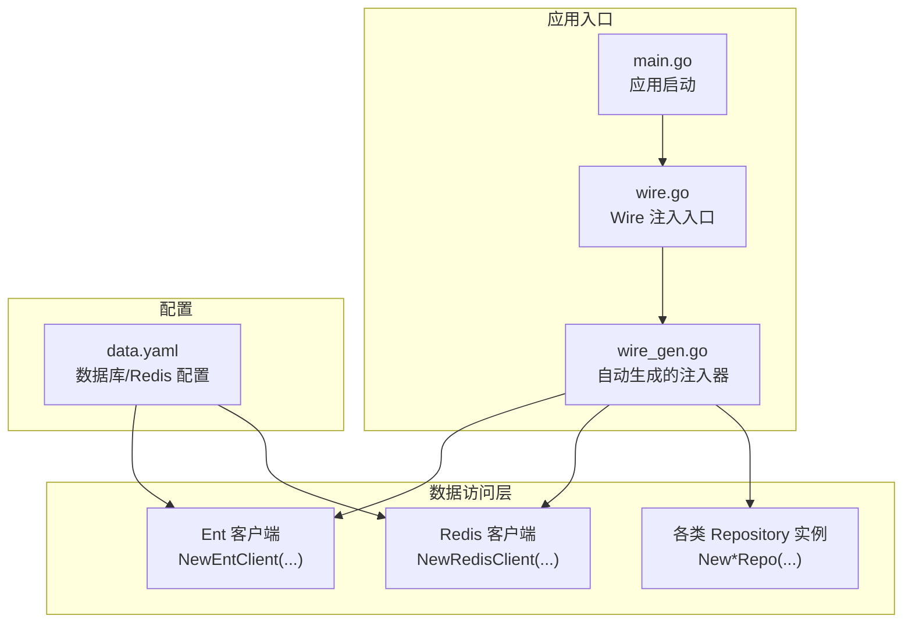
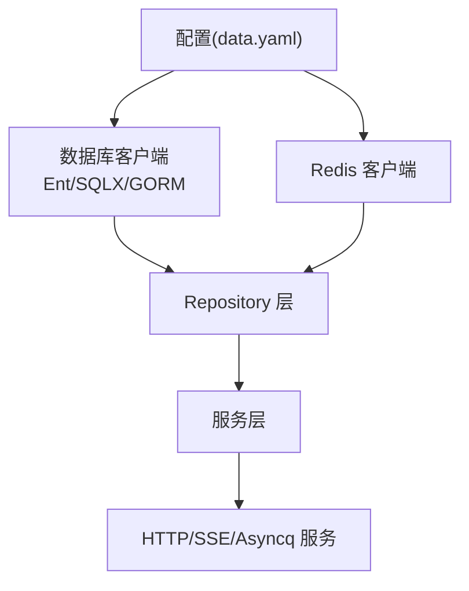
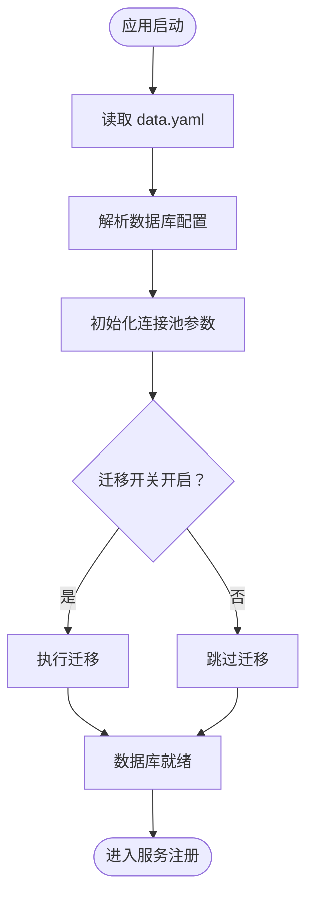
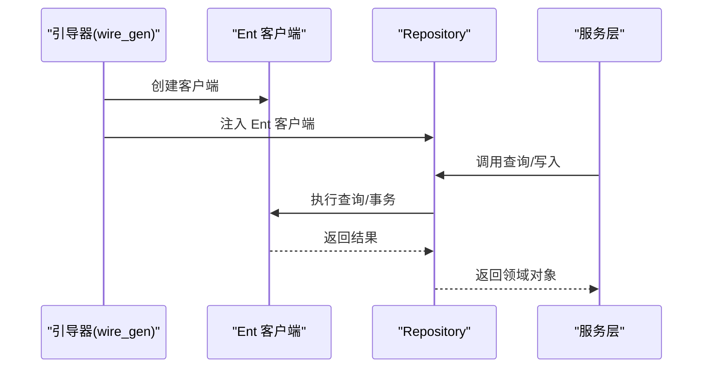
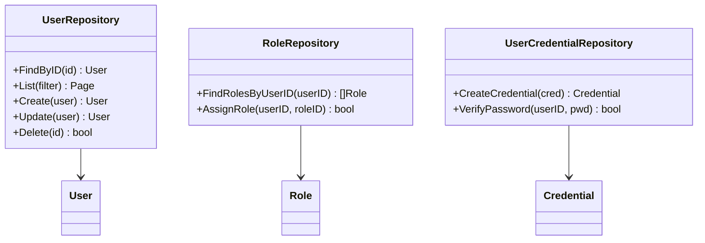
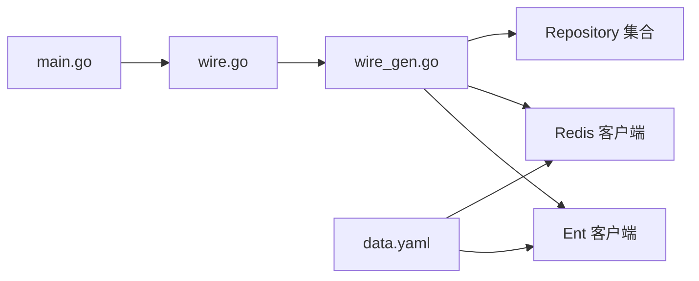

# 数据访问层

<cite>
**本文引用的文件**
- [main.go](file://backend/app/admin/service/cmd/server/main.go)
- [wire.go](file://backend/app/admin/service/cmd/server/wire.go)
- [wire_gen.go](file://backend/app/admin/service/cmd/server/wire_gen.go)
- [data.yaml](file://backend/app/admin/service/configs/data.yaml)
- [system_viewer.go](file://backend/pkg/entgo/viewer/system_viewer.go)
</cite>

## 目录
1. [简介](#简介)
2. [项目结构](#项目结构)
3. [核心组件](#核心组件)
4. [架构总览](#架构总览)
5. [详细组件分析](#详细组件分析)
6. [依赖分析](#依赖分析)
7. [性能考虑](#性能考虑)
8. [故障排查指南](#故障排查指南)
9. [结论](#结论)
10. [附录](#附录)

## 简介
本文件聚焦于数据访问层的技术实现与最佳实践，围绕以下目标展开：
- 解释 Ent ORM 的配置与使用：数据库连接管理、模型定义、查询构建器的使用
- 阐述 GORM 的集成与传统数据库操作方式（在本仓库中以 Ent 为主，GORM 作为可选方案）
- 描述 Repository 模式的实现：数据访问接口设计、事务处理机制、连接池管理
- 提供数据模型设计最佳实践：实体关系映射、索引优化、查询性能调优
- 展示复杂数据查询与批量操作的实现思路与参考路径

## 项目结构
数据访问层位于后端应用的“admin service”模块中，通过引导框架启动，使用 Wire 进行依赖注入，配置文件集中管理数据库与缓存参数。

图表来源
- [main.go:60-75](file://backend/app/admin/service/cmd/server/main.go#L60-L75)
- [wire.go:37-46](file://backend/app/admin/service/cmd/server/wire.go#L37-L46)
- [wire_gen.go:30-133](file://backend/app/admin/service/cmd/server/wire_gen.go#L30-L133)
- [data.yaml:1-21](file://backend/app/admin/service/configs/data.yaml#L1-L21)

章节来源
- [main.go:1-76](file://backend/app/admin/service/cmd/server/main.go#L1-L76)
- [wire.go:1-47](file://backend/app/admin/service/cmd/server/wire.go#L1-L47)
- [wire_gen.go:1-134](file://backend/app/admin/service/cmd/server/wire_gen.go#L1-L134)
- [data.yaml:1-21](file://backend/app/admin/service/configs/data.yaml#L1-L21)

## 核心组件
- 应用引导与启动
  - 使用引导框架初始化 Kratos 应用，加载配置并运行服务。
  - 参考路径：[main.go:60-75](file://backend/app/admin/service/cmd/server/main.go#L60-L75)
- 依赖注入（Wire）
  - 通过 provider 组合与注入器生成，统一创建 Redis、Ent 客户端以及各领域 Repository。
  - 参考路径：[wire.go:37-46](file://backend/app/admin/service/cmd/server/wire.go#L37-L46)、[wire_gen.go:30-133](file://backend/app/admin/service/cmd/server/wire_gen.go#L30-L133)
- 数据库与缓存配置
  - 数据库驱动、连接字符串、迁移开关、连接池参数；Redis 地址与超时设置。
  - 参考路径：[data.yaml:1-21](file://backend/app/admin/service/configs/data.yaml#L1-L21)
- 视图上下文（Viewer）
  - 提供系统级视图上下文，用于审计、权限与数据范围控制。
  - 参考路径：[system_viewer.go:13-79](file://backend/pkg/entgo/viewer/system_viewer.go#L13-L79)

章节来源
- [main.go:60-75](file://backend/app/admin/service/cmd/server/main.go#L60-L75)
- [wire.go:37-46](file://backend/app/admin/service/cmd/server/wire.go#L37-L46)
- [wire_gen.go:30-133](file://backend/app/admin/service/cmd/server/wire_gen.go#L30-L133)
- [data.yaml:1-21](file://backend/app/admin/service/configs/data.yaml#L1-L21)
- [system_viewer.go:13-79](file://backend/pkg/entgo/viewer/system_viewer.go#L13-L79)

## 架构总览
数据访问层采用“配置驱动 + 依赖注入 + 仓储模式”的架构：
- 配置驱动：从 data.yaml 读取数据库与 Redis 参数，统一初始化客户端
- 依赖注入：通过 Wire 将客户端与各 Repository 绑定到服务层
- 仓储模式：每个聚合根或领域实体对应一个 Repository 接口与实现，封装 CRUD 与复杂查询

图表来源
- [data.yaml:1-21](file://backend/app/admin/service/configs/data.yaml#L1-L21)
- [wire_gen.go:39-68](file://backend/app/admin/service/cmd/server/wire_gen.go#L39-L68)
- [wire_gen.go:115-127](file://backend/app/admin/service/cmd/server/wire_gen.go#L115-L127)

## 详细组件分析

### 数据库连接与连接池管理
- 驱动与连接字符串
  - 支持 PostgreSQL，默认连接串已配置；MySQL 作为注释示例保留。
  - 参考路径：[data.yaml:3-6](file://backend/app/admin/service/configs/data.yaml#L3-L6)
- 连接池参数
  - 最大空闲连接数、最大打开连接数、连接最大生命周期。
  - 参考路径：[data.yaml:11-13](file://backend/app/admin/service/configs/data.yaml#L11-L13)
- 迁移与调试
  - 开关迁移、开启调试模式便于开发阶段定位问题。
  - 参考路径：[data.yaml:7-8](file://backend/app/admin/service/configs/data.yaml#L7-L8)

图表来源
- [data.yaml:1-21](file://backend/app/admin/service/configs/data.yaml#L1-L21)

章节来源
- [data.yaml:1-21](file://backend/app/admin/service/configs/data.yaml#L1-L21)

### Ent ORM 的配置与使用
- 客户端初始化
  - 通过注入器创建 Ent 客户端，随后由各 Repository 持有并使用。
  - 参考路径：[wire_gen.go:39-43](file://backend/app/admin/service/cmd/server/wire_gen.go#L39-L43)
- 查询构建器与模型
  - 建议在 Repository 中封装查询构建器调用，避免在服务层直接操作底层 API
  - 参考路径：[wire_gen.go:44-68](file://backend/app/admin/service/cmd/server/wire_gen.go#L44-L68)

图表来源
- [wire_gen.go:39-68](file://backend/app/admin/service/cmd/server/wire_gen.go#L39-L68)

章节来源
- [wire_gen.go:39-68](file://backend/app/admin/service/cmd/server/wire_gen.go#L39-L68)

### GORM 的集成与传统数据库操作
- 集成方式
  - 可在现有 Ent 客户端之外，按需引入 GORM 客户端用于特定场景（如复杂统计、历史归档等）
  - 建议通过独立的 Provider 创建 GORM 客户端，并在需要的传统操作中注入使用
- 传统数据库操作
  - 使用原生 SQL、事务块、批量插入/更新等，结合连接池参数进行性能优化
  - 注意与 Ent 的事务隔离与并发控制保持一致

说明：本仓库以 Ent 为主要 ORM，GORM 作为可选补充。具体集成点可参考 Wire 注入器扩展与配置文件新增项。

### Repository 模式实现
- 接口设计
  - 每个聚合根/实体定义对应的 Repository 接口，暴露领域语义的操作（如按条件分页、批量更新等）
- 事务处理
  - 在 Repository 内部对单次业务操作使用事务，确保一致性；跨多个 Repository 的复合操作在服务层协调
- 连接池管理
  - 数据库连接池参数在配置文件中集中管理，Ent/GORM 客户端共享同一连接池配置

图表来源
- [wire_gen.go:63-65](file://backend/app/admin/service/cmd/server/wire_gen.go#L63-L65)
- [wire_gen.go:66-67](file://backend/app/admin/service/cmd/server/wire_gen.go#L66-L67)
- [wire_gen.go:68-68](file://backend/app/admin/service/cmd/server/wire_gen.go#L68-L68)

章节来源
- [wire_gen.go:63-68](file://backend/app/admin/service/cmd/server/wire_gen.go#L63-L68)

### 复杂查询与批量操作
- 复杂查询
  - 使用 Ent 查询构建器组合多表关联、条件过滤、排序与分页
  - 在 Repository 中封装查询逻辑，对外暴露简洁的领域方法
- 批量操作
  - 使用批量插入/更新减少往返次数；注意分批大小与内存占用
  - 对于高并发写入，结合连接池参数与数据库性能指标进行调优

参考路径（示例）：[wire_gen.go:76-78](file://backend/app/admin/service/cmd/server/wire_gen.go#L76-L78)

章节来源
- [wire_gen.go:76-78](file://backend/app/admin/service/cmd/server/wire_gen.go#L76-L78)

### 数据模型设计最佳实践
- 实体关系映射
  - 明确主从关系与外键约束，避免 N+1 查询；合理拆分聚合边界
- 索引优化
  - 为高频查询字段建立合适索引；避免冗余索引导致写入性能下降
- 查询性能调优
  - 使用 EXPLAIN 分析慢查询；限制返回列、分页与缓存热点数据
  - 结合连接池参数与数据库资源上限进行压测与调参

## 依赖分析
- 启动流程依赖
  - main.go 依赖引导框架与注入器生成文件
- 注入关系
  - wire_gen.go 统一创建 Redis、Ent 客户端与各 Repository，并注入到服务层
- 配置依赖
  - data.yaml 为数据库与 Redis 提供统一配置源

图表来源
- [main.go:60-75](file://backend/app/admin/service/cmd/server/main.go#L60-L75)
- [wire.go:37-46](file://backend/app/admin/service/cmd/server/wire.go#L37-L46)
- [wire_gen.go:30-133](file://backend/app/admin/service/cmd/server/wire_gen.go#L30-L133)
- [data.yaml:1-21](file://backend/app/admin/service/configs/data.yaml#L1-L21)

章节来源
- [main.go:60-75](file://backend/app/admin/service/cmd/server/main.go#L60-L75)
- [wire.go:37-46](file://backend/app/admin/service/cmd/server/wire.go#L37-L46)
- [wire_gen.go:30-133](file://backend/app/admin/service/cmd/server/wire_gen.go#L30-L133)
- [data.yaml:1-21](file://backend/app/admin/service/configs/data.yaml#L1-L21)

## 性能考虑
- 连接池参数
  - 根据 QPS 与数据库资源设定最大空闲/打开连接数与生命周期
  - 参考路径：[data.yaml:11-13](file://backend/app/admin/service/configs/data.yaml#L11-L13)
- 查询优化
  - 使用分页与投影减少网络与内存开销；必要时引入缓存层
- 批量操作
  - 合理分批与重试策略，避免一次性大批量写入造成数据库压力

## 故障排查指南
- 连接失败
  - 检查数据库驱动与连接字符串是否正确；确认容器网络可达性
  - 参考路径：[data.yaml:3-6](file://backend/app/admin/service/configs/data.yaml#L3-L6)
- 迁移异常
  - 关闭迁移开关后重启，检查迁移脚本与数据库版本；开启调试模式定位问题
  - 参考路径：[data.yaml:7-8](file://backend/app/admin/service/configs/data.yaml#L7-L8)
- 缓存不可用
  - 校验 Redis 地址、密码与超时参数；确认网络连通
  - 参考路径：[data.yaml:15-21](file://backend/app/admin/service/configs/data.yaml#L15-L21)
- 权限与审计
  - 使用系统视图上下文进行审计开关与数据范围控制
  - 参考路径：[system_viewer.go:21-53](file://backend/pkg/entgo/viewer/system_viewer.go#L21-L53)

章节来源
- [data.yaml:3-21](file://backend/app/admin/service/configs/data.yaml#L3-L21)
- [system_viewer.go:21-53](file://backend/pkg/entgo/viewer/system_viewer.go#L21-L53)

## 结论
本数据访问层以 Ent ORM 为核心，配合 Wire 依赖注入与集中式配置，实现了清晰的仓储模式与可维护的数据库交互层。通过合理的连接池参数、查询优化与批量操作策略，可在保证性能的同时满足复杂业务需求。对于需要传统 SQL 或特殊场景的处理，可按需引入 GORM 客户端并遵循统一的注入与配置规范。

## 附录
- 关键实现参考路径汇总
  - 应用启动与引导：[main.go:60-75](file://backend/app/admin/service/cmd/server/main.go#L60-L75)
  - 依赖注入入口与生成器：[wire.go:37-46](file://backend/app/admin/service/cmd/server/wire.go#L37-L46)、[wire_gen.go:30-133](file://backend/app/admin/service/cmd/server/wire_gen.go#L30-L133)
  - 数据库与缓存配置：[data.yaml:1-21](file://backend/app/admin/service/configs/data.yaml#L1-L21)
  - 系统视图上下文：[system_viewer.go:13-79](file://backend/pkg/entgo/viewer/system_viewer.go#L13-L79)