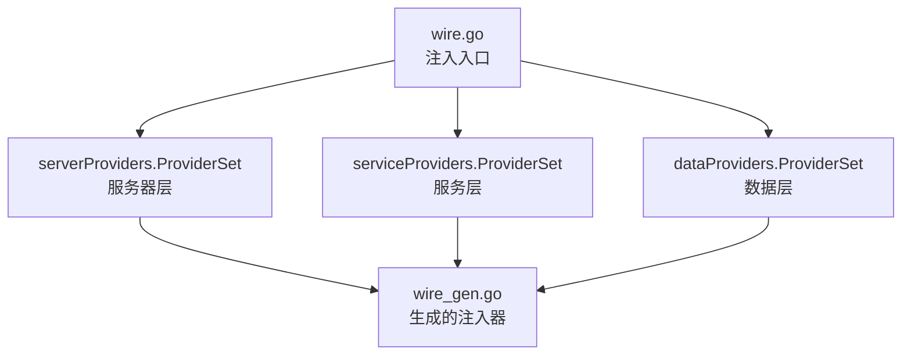
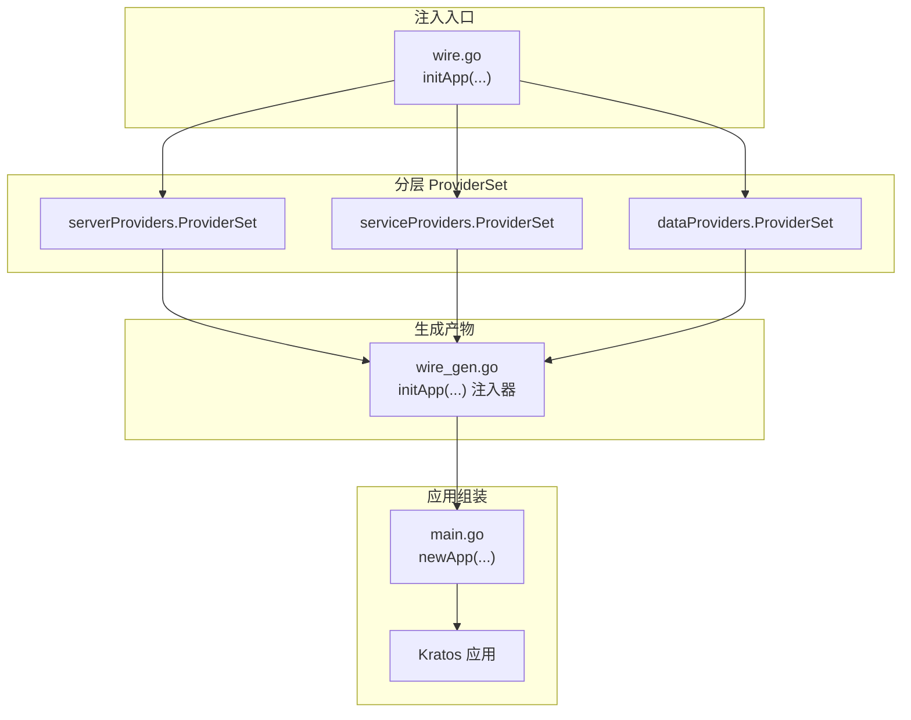
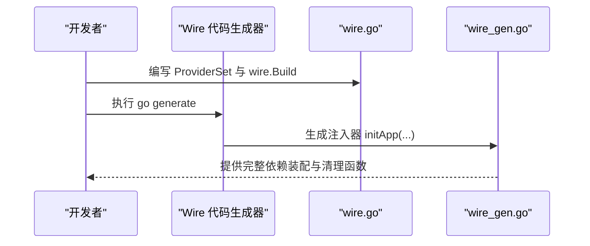
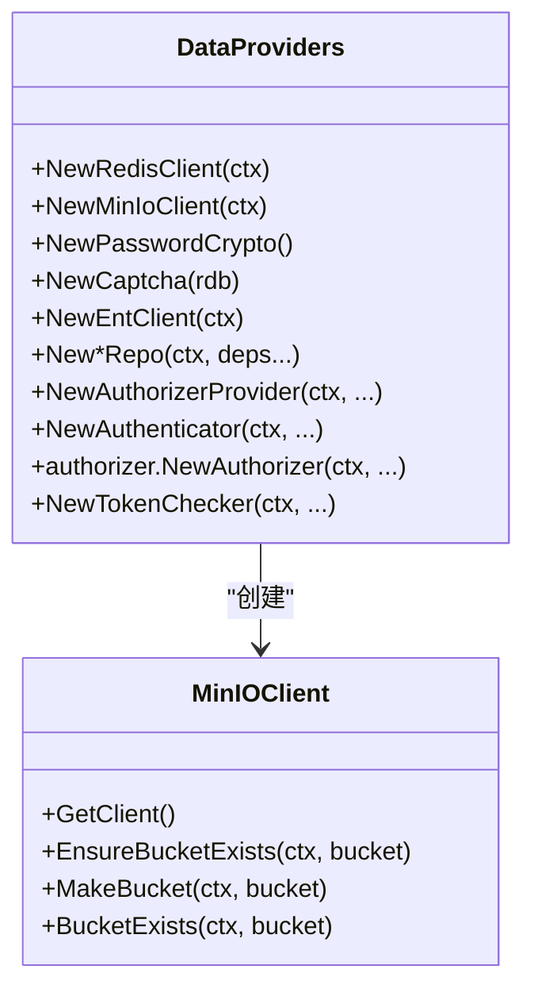
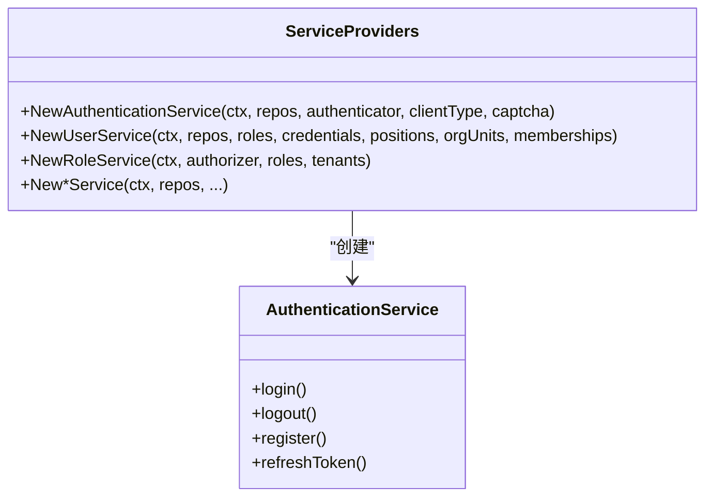
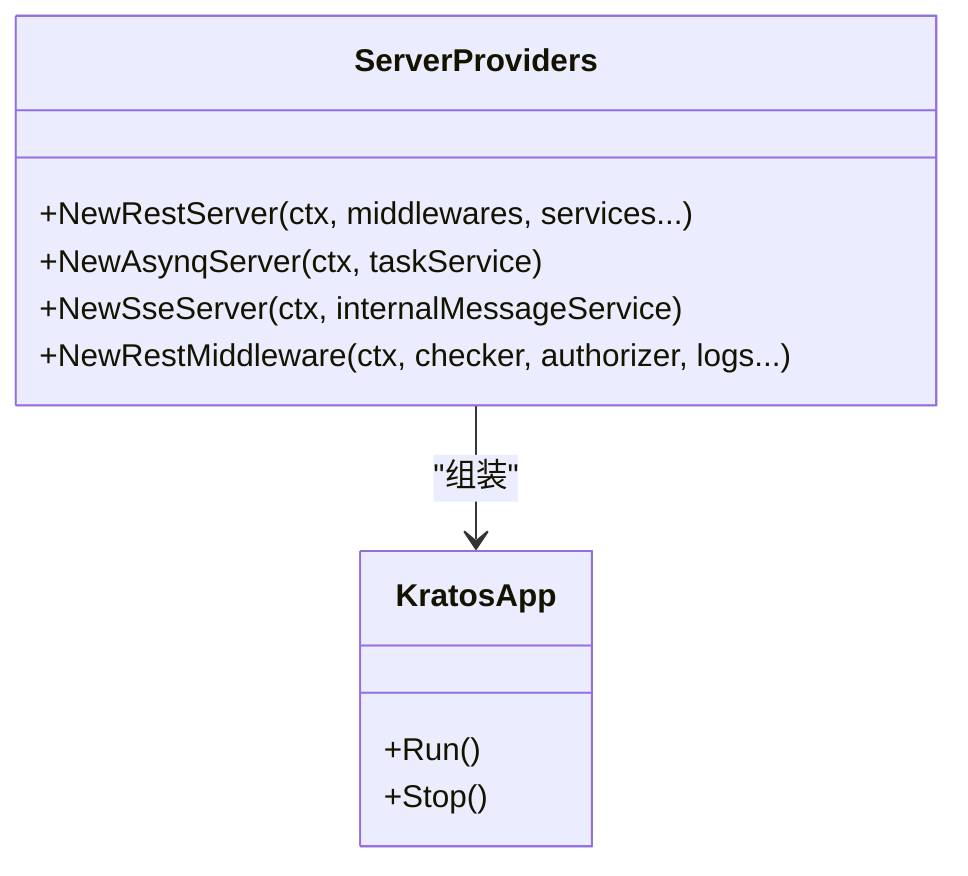
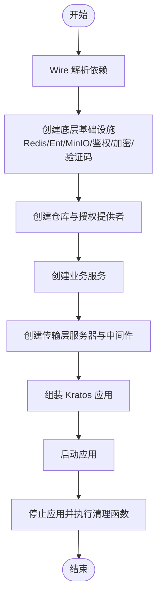
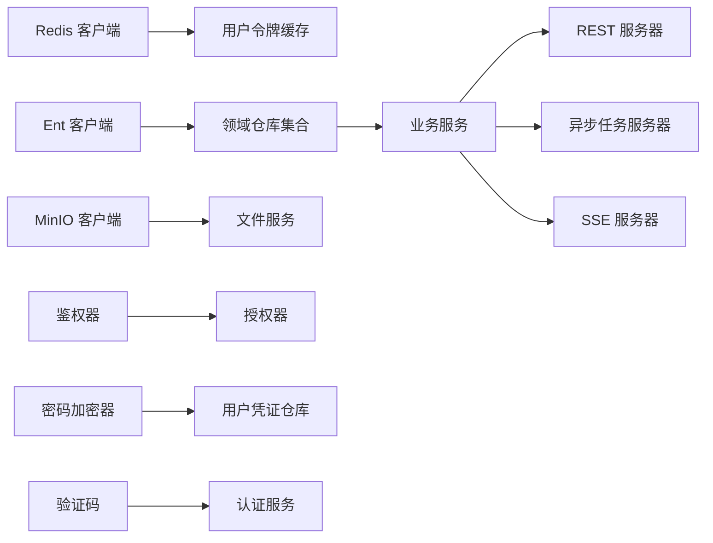

# 依赖注入容器

<cite>
**本文引用的文件**   
- [wire.go](file://backend/app/admin/service/cmd/server/wire.go)
- [wire_gen.go](file://backend/app/admin/service/cmd/server/wire_gen.go)
- [main.go](file://backend/app/admin/service/cmd/server/main.go)
- [wire_set.go（数据层）](file://backend/app/admin/service/internal/data/providers/wire_set.go)
- [wire_set.go（服务层）](file://backend/app/admin/service/internal/service/providers/wire_set.go)
- [wire_set.go（服务器层）](file://backend/app/admin/service/internal/server/providers/wire_set.go)
- [data.go（数据层工厂）](file://backend/app/admin/service/internal/data/data.go)
- [minio.go（对象存储封装）](file://backend/pkg/oss/minio.go)
- [go.mod](file://backend/go.mod)
</cite>

## 目录
1. [简介](#简介)
2. [项目结构](#项目结构)
3. [核心组件](#核心组件)
4. [架构总览](#架构总览)
5. [详细组件分析](#详细组件分析)
6. [依赖关系分析](#依赖关系分析)
7. [性能考量](#性能考量)
8. [故障排查指南](#故障排查指南)
9. [结论](#结论)
10. [附录：最佳实践与常见问题](#附录最佳实践与常见问题)

## 简介
本文件系统性阐述 GoWind Admin 后端在 Kratos 生态下对 Google Wire 依赖注入容器的应用。内容覆盖依赖关系定义、Provider 函数编写、注入集配置、模块化依赖管理、循环依赖检测与解析机制、服务初始化与生命周期管理，并给出接口抽象、工厂模式、测试替身等最佳实践及常见问题的解决方案。

## 项目结构
Wire 在本项目中的组织方式遵循“按层拆分 ProviderSet”的模块化策略：
- 顶层入口：命令行服务通过 wire.go 定义注入入口，组合各层 ProviderSet 并产出 Kratos 应用实例。
- 分层 ProviderSet：数据层、服务层、服务器层分别维护独立的 ProviderSet，集中声明构造函数。
- 生成产物：wire 基于注入入口自动生成 wire_gen.go，内含完整的依赖解析与装配逻辑。

图表来源
- [wire.go:37-46](file://backend/app/admin/service/cmd/server/wire.go#L37-L46)
- [wire_set.go（服务器层）:19-25](file://backend/app/admin/service/internal/server/providers/wire_set.go#L19-L25)
- [wire_set.go（服务层）:19-50](file://backend/app/admin/service/internal/service/providers/wire_set.go#L19-L50)
- [wire_set.go（数据层）:21-86](file://backend/app/admin/service/internal/data/providers/wire_set.go#L21-L86)

章节来源
- [wire.go:1-47](file://backend/app/admin/service/cmd/server/wire.go#L1-L47)
- [wire_set.go（服务器层）:1-26](file://backend/app/admin/service/internal/server/providers/wire_set.go#L1-L26)
- [wire_set.go（服务层）:1-51](file://backend/app/admin/service/internal/service/providers/wire_set.go#L1-L51)
- [wire_set.go（数据层）:1-87](file://backend/app/admin/service/internal/data/providers/wire_set.go#L1-L87)

## 核心组件
- 注入入口与生成器
  - wire.go 使用 wire.Build 组合各层 ProviderSet，并以 newApp 作为最终产出函数，配合 go:generate 指令驱动代码生成。
- 生成产物
  - wire_gen.go 是由 Wire 自动生成的完整注入器，包含从底层基础设施到高层服务的完整依赖链路与清理函数串联。
- 应用组装
  - main.go 提供 newApp 将 HTTP、异步任务与 SSE 服务器整合为 Kratos 应用，并交由 bootstrap.RunApp 驱动启动。

章节来源
- [wire.go:37-46](file://backend/app/admin/service/cmd/server/wire.go#L37-L46)
- [wire_gen.go:20-134](file://backend/app/admin/service/cmd/server/wire_gen.go#L20-L134)
- [main.go:46-57](file://backend/app/admin/service/cmd/server/main.go#L46-L57)

## 架构总览
Wire 在本项目中的作用是将“配置、缓存、数据库、对象存储、鉴权与授权、业务服务、传输层”等横切关注点以 Provider 的形式声明并自动解析依赖关系，最终输出可运行的 Kratos 应用实例。

图表来源
- [wire.go:37-46](file://backend/app/admin/service/cmd/server/wire.go#L37-L46)
- [wire_set.go（服务器层）:19-25](file://backend/app/admin/service/internal/server/providers/wire_set.go#L19-L25)
- [wire_set.go（服务层）:19-50](file://backend/app/admin/service/internal/service/providers/wire_set.go#L19-L50)
- [wire_set.go（数据层）:21-86](file://backend/app/admin/service/internal/data/providers/wire_set.go#L21-L86)
- [wire_gen.go:20-134](file://backend/app/admin/service/cmd/server/wire_gen.go#L20-L134)
- [main.go:46-57](file://backend/app/admin/service/cmd/server/main.go#L46-L57)

## 详细组件分析

### 1) 注入入口与 ProviderSet 组合
- 注入入口：initApp 接收 bootstrap.Context，返回 *kratos.App、关闭清理函数与错误。通过 wire.Build 聚合服务器、服务、数据三层 ProviderSet，并以 newApp 作为最终产出。
- 生成流程：go:generate 触发 Wire 代码生成，生成不带 wireinject 标签的 wire_gen.go，其中包含完整的依赖解析与装配序列。

图表来源
- [wire.go:37-46](file://backend/app/admin/service/cmd/server/wire.go#L37-L46)
- [wire_gen.go:20-134](file://backend/app/admin/service/cmd/server/wire_gen.go#L20-L134)

章节来源
- [wire.go:1-47](file://backend/app/admin/service/cmd/server/wire.go#L1-L47)
- [wire_gen.go:1-134](file://backend/app/admin/service/cmd/server/wire_gen.go#L1-L134)

### 2) 数据层 ProviderSet 与工厂函数
- 数据层 ProviderSet 负责声明 Redis、Ent、MinIO、鉴权与授权、密码加密、验证码等基础设施与仓库的构造函数。
- 关键工厂函数示例：
  - NewRedisClient：基于配置创建 Redis 客户端并返回关闭函数。
  - NewMinIoClient：封装 MinIO 客户端。
  - NewPasswordCrypto：创建密码加密器。
  - NewCaptcha：基于 Redis 与配置创建验证码实例。
- 仓库与服务依赖：数据层 ProviderSet 同时声明了大量 Repo 与 Provider，形成稳定的基础设施与领域模型边界。

图表来源
- [wire_set.go（数据层）:21-86](file://backend/app/admin/service/internal/data/providers/wire_set.go#L21-L86)
- [data.go（数据层工厂）:23-62](file://backend/app/admin/service/internal/data/data.go#L23-L62)
- [minio.go:45-84](file://backend/pkg/oss/minio.go#L45-L84)

章节来源
- [wire_set.go（数据层）:1-87](file://backend/app/admin/service/internal/data/providers/wire_set.go#L1-L87)
- [data.go（数据层工厂）:1-62](file://backend/app/admin/service/internal/data/data.go#L1-L62)
- [minio.go:1-84](file://backend/pkg/oss/minio.go#L1-L84)

### 3) 服务层 ProviderSet 与业务服务
- 服务层 ProviderSet 声明各类业务服务的构造函数，如认证、用户、角色、菜单、权限、审计日志、内部消息、任务、文件与字典等。
- 依赖注入体现：业务服务普遍接收仓储、鉴权器、配置、客户端类型、验证码等依赖，确保职责单一与可替换。

图表来源
- [wire_set.go（服务层）:19-50](file://backend/app/admin/service/internal/service/providers/wire_set.go#L19-L50)

章节来源
- [wire_set.go（服务层）:1-51](file://backend/app/admin/service/internal/service/providers/wire_set.go#L1-L51)

### 4) 服务器层 ProviderSet 与传输层
- 服务器层 ProviderSet 声明 REST、异步任务与 SSE 服务器以及中间件的构造函数。
- 生成器在 wire_gen.go 中按序创建中间件与各服务实例，再组装为 Kratos 应用。

图表来源
- [wire_set.go（服务器层）:19-25](file://backend/app/admin/service/internal/server/providers/wire_set.go#L19-L25)
- [wire_gen.go:55-128](file://backend/app/admin/service/cmd/server/wire_gen.go#L55-L128)
- [main.go:46-57](file://backend/app/admin/service/cmd/server/main.go#L46-L57)

章节来源
- [wire_set.go（服务器层）:1-26](file://backend/app/admin/service/internal/server/providers/wire_set.go#L1-L26)
- [wire_gen.go:1-134](file://backend/app/admin/service/cmd/server/wire_gen.go#L1-L134)
- [main.go:1-76](file://backend/app/admin/service/cmd/server/main.go#L1-L76)

### 5) 依赖解析与生命周期管理
- 解析顺序：Wire 自顶向下解析依赖，先创建底层基础设施（Redis、Ent、MinIO、鉴权与授权、密码与验证码），再创建仓库与服务，最后组装服务器与应用。
- 清理函数：生成器在任一阶段失败时，会回溯调用已创建对象的关闭函数，确保资源释放。
- 生命周期：应用启动由 bootstrap.RunApp 驱动；关闭时依次调用各层清理函数。

图表来源
- [wire_gen.go:20-134](file://backend/app/admin/service/cmd/server/wire_gen.go#L20-L134)
- [main.go:46-57](file://backend/app/admin/service/cmd/server/main.go#L46-L57)

章节来源
- [wire_gen.go:1-134](file://backend/app/admin/service/cmd/server/wire_gen.go#L1-L134)
- [main.go:1-76](file://backend/app/admin/service/cmd/server/main.go#L1-L76)

## 依赖关系分析
- 分层解耦：数据层、服务层、服务器层通过 ProviderSet 明确边界，彼此通过接口或具体类型进行依赖传递。
- 外部依赖：Redis、Ent、MinIO、鉴权与授权引擎、密码加密库、验证码库等均通过 Provider 注入，便于替换与测试。
- 生成器约束：Wire 会在编译期检查依赖是否可满足，若出现循环依赖或缺失依赖，将在生成阶段报错，避免运行时风险。

图表来源
- [wire_set.go（数据层）:21-86](file://backend/app/admin/service/internal/data/providers/wire_set.go#L21-L86)
- [wire_set.go（服务层）:19-50](file://backend/app/admin/service/internal/service/providers/wire_set.go#L19-L50)
- [wire_set.go（服务器层）:19-25](file://backend/app/admin/service/internal/server/providers/wire_set.go#L19-L25)
- [wire_gen.go:31-128](file://backend/app/admin/service/cmd/server/wire_gen.go#L31-L128)

章节来源
- [wire_set.go（数据层）:1-87](file://backend/app/admin/service/internal/data/providers/wire_set.go#L1-L87)
- [wire_set.go（服务层）:1-51](file://backend/app/admin/service/internal/service/providers/wire_set.go#L1-L51)
- [wire_set.go（服务器层）:1-26](file://backend/app/admin/service/internal/server/providers/wire_set.go#L1-L26)
- [wire_gen.go:1-134](file://backend/app/admin/service/cmd/server/wire_gen.go#L1-L134)

## 性能考量
- 依赖解析成本：Wire 在构建阶段完成依赖解析，运行时无反射开销，适合生产环境。
- 资源复用：通过 ProviderSet 将 Redis、Ent、MinIO 等资源集中管理，减少重复初始化。
- 清理一致性：生成器保证失败路径下的资源回收，降低泄漏风险。
- 可观测性：结合 Kratos Bootstrap 的日志与监控能力，可在注入阶段记录关键步骤与耗时。

## 故障排查指南
- 循环依赖
  - 症状：go generate 报错，提示无法解析依赖。
  - 排查：检查 ProviderSet 中是否存在互相依赖的构造函数；必要时引入接口抽象或延迟初始化。
- 缺失依赖
  - 症状：Wire 无法解析某类型依赖。
  - 排查：确认对应 NewXxx 函数已在 ProviderSet 中注册，且参数类型与构造签名一致。
- 资源初始化失败
  - 症状：Redis/数据库/MinIO 初始化失败。
  - 排查：检查配置项与连接参数；观察 wire_gen.go 中的错误分支与清理函数调用顺序。
- 生成文件未更新
  - 症状：修改 ProviderSet 后未生效。
  - 排查：确保执行 go generate 或 go run github.com/google/wire/cmd/wire；确认 wire.go 存在 go:generate 指令且未被 wireinject 标签屏蔽。

章节来源
- [wire.go:1-47](file://backend/app/admin/service/cmd/server/wire.go#L1-L47)
- [wire_gen.go:1-134](file://backend/app/admin/service/cmd/server/wire_gen.go#L1-L134)

## 结论
本项目通过 Wire 将基础设施、领域仓库与业务服务清晰地解耦并自动化装配，既保证了开发效率，又提升了系统的可维护性与可测试性。建议在新增服务时遵循“接口抽象 + 工厂函数 + ProviderSet”的模式，并在分层 ProviderSet 中集中声明，以获得最佳的模块化与可演进性。

## 附录：最佳实践与常见问题

### 最佳实践
- 接口抽象
  - 对外暴露接口而非具体实现，便于替换与测试替身。
- 工厂模式
  - 将复杂初始化逻辑收敛到 NewXxx 函数，统一处理配置、日志与清理函数。
- ProviderSet 分层
  - 按数据、服务、服务器三层划分，保持边界清晰。
- 测试替身
  - 在测试中通过自定义 ProviderSet 替换真实依赖，隔离单元测试。
- 生命周期管理
  - 在 Provider 中返回关闭函数，确保资源正确释放；利用生成器的失败回滚能力。

### 新增服务注入步骤
- 步骤 1：在服务层 ProviderSet 中注册 NewXxxService 构造函数。
- 步骤 2：在 wire.go 的 wire.Build 中确保服务层 ProviderSet 被包含。
- 步骤 3：执行 go generate，验证生成的注入器是否包含新服务。
- 步骤 4：在 main.go 的 newApp 中将新服务注入到 Kratos 应用或传输层。

章节来源
- [wire_set.go（服务层）:19-50](file://backend/app/admin/service/internal/service/providers/wire_set.go#L19-L50)
- [wire.go:37-46](file://backend/app/admin/service/cmd/server/wire.go#L37-L46)
- [wire_gen.go:1-134](file://backend/app/admin/service/cmd/server/wire_gen.go#L1-L134)
- [main.go:46-57](file://backend/app/admin/service/cmd/server/main.go#L46-L57)