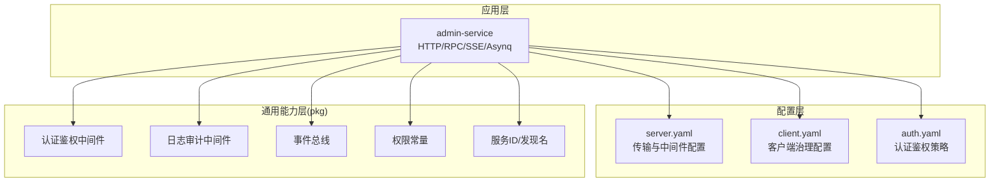
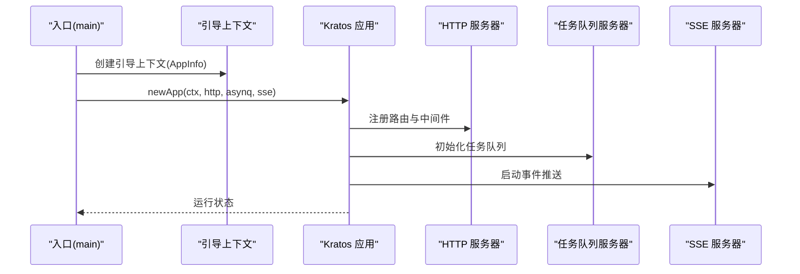
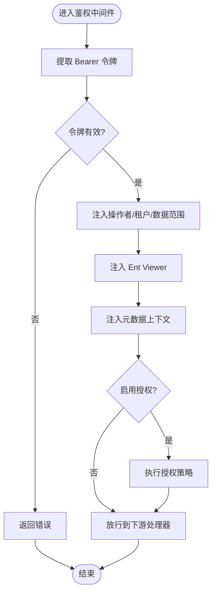
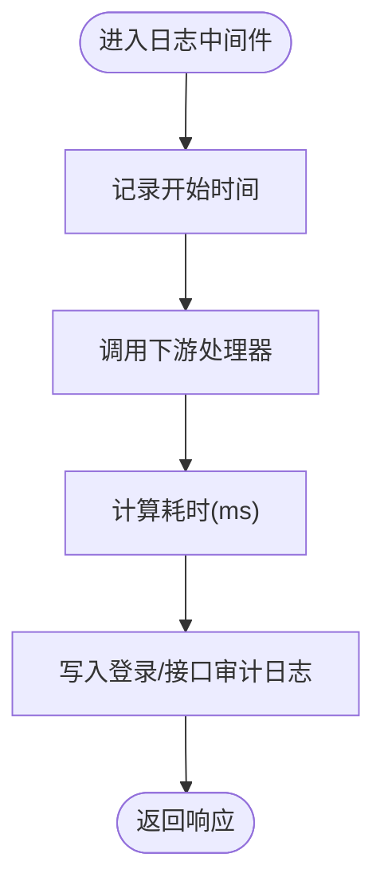
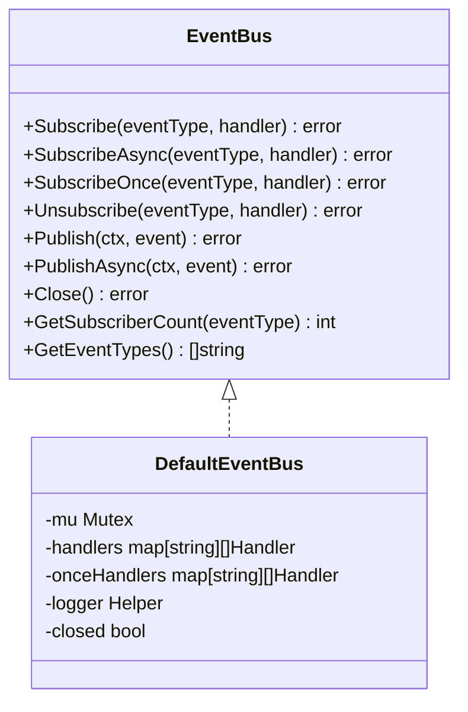
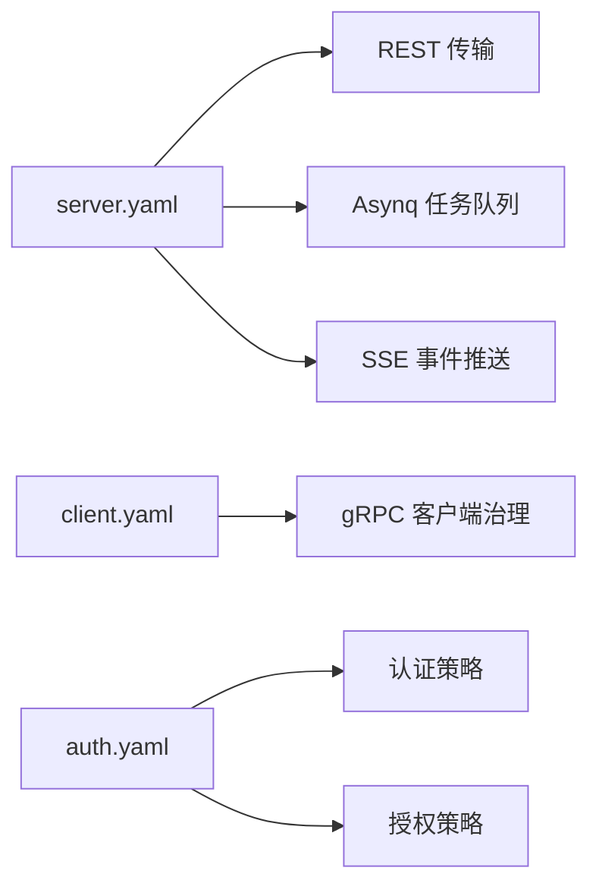
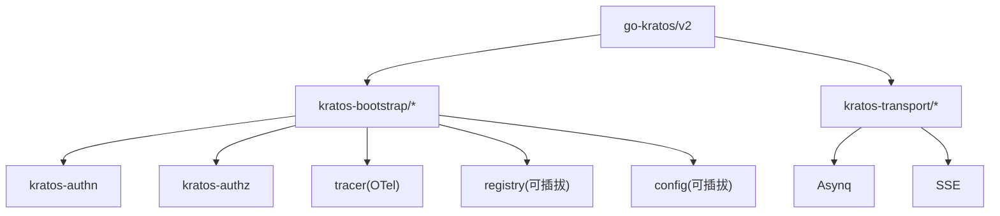

# 微服务架构设计

<cite>
**本文引用的文件**
- [go.mod](file://backend/go.mod)
- [main.go](file://backend/app/admin/service/cmd/server/main.go)
- [wire.go](file://backend/app/admin/service/cmd/server/wire.go)
- [server.yaml](file://backend/app/admin/service/configs/server.yaml)
- [client.yaml](file://backend/app/admin/service/configs/client.yaml)
- [auth.yaml](file://backend/app/admin/service/configs/auth.yaml)
- [logging.go](file://backend/pkg/middleware/logging/logging.go)
- [auth.go](file://backend/pkg/middleware/auth/auth.go)
- [eventbus.go](file://backend/pkg/eventbus/eventbus.go)
- [permission.go](file://backend/pkg/constants/permission.go)
- [service_id.go](file://backend/pkg/serviceid/service_id.go)
- [apiauditlog.go](file://backend/app/admin/service/internal/data/ent/apiauditlog.go)
</cite>

## 目录
1. [引言](#引言)
2. [项目结构](#项目结构)
3. [核心组件](#核心组件)
4. [架构总览](#架构总览)
5. [详细组件分析](#详细组件分析)
6. [依赖分析](#依赖分析)
7. [性能考虑](#性能考虑)
8. [故障排查指南](#故障排查指南)
9. [结论](#结论)
10. [附录](#附录)

## 引言
本文件面向 GoWind Admin 微服务架构设计，围绕基于 go-kratos 框架的服务化理念，系统阐述服务拆分原则、服务边界划分、服务间通信机制，并结合项目现有配置与中间件能力，给出服务发现与注册、负载均衡、熔断降级、服务网格与分布式追踪的落地建议。同时提供微服务开发最佳实践，包括服务版本管理、灰度发布策略与监控告警配置，并通过具体代码示例路径，指导如何设计新的微服务模块与配置服务治理参数。

## 项目结构
后端采用多模块微服务组织方式，以领域服务为单位划分应用包，统一通过 Kratos 引导框架启动 HTTP、RPC、任务队列与 SSE 传输层。配置采用 YAML 文件集中管理，中间件与通用能力沉淀在 pkg 层，便于跨服务复用。

图示来源
- [main.go:46-75](file://backend/app/admin/service/cmd/server/main.go#L46-L75)
- [server.yaml:1-49](file://backend/app/admin/service/configs/server.yaml#L1-L49)
- [client.yaml:1-14](file://backend/app/admin/service/configs/client.yaml#L1-L14)
- [auth.yaml:1-37](file://backend/app/admin/service/configs/auth.yaml#L1-L37)

章节来源
- [main.go:1-76](file://backend/app/admin/service/cmd/server/main.go#L1-L76)
- [server.yaml:1-49](file://backend/app/admin/service/configs/server.yaml#L1-L49)
- [client.yaml:1-14](file://backend/app/admin/service/configs/client.yaml#L1-L14)
- [auth.yaml:1-37](file://backend/app/admin/service/configs/auth.yaml#L1-L37)

## 核心组件
- 应用引导与容器
  - Kratos 应用通过引导上下文初始化，统一承载 HTTP、Asynq、SSE 传输层与业务服务。
  - 依赖注入使用 Wire，按 ProviderSet 组织 server、service、data 三类 Provider，确保可测试性与可替换性。
- 中间件体系
  - 认证鉴权中间件：支持多种令牌校验与注入，结合授权引擎进行细粒度控制。
  - 日志审计中间件：记录登录、API 调用等关键操作，支持延迟统计与审计日志落库。
- 事件总线
  - 提供同步/异步订阅、一次性订阅、并发安全发布与优雅关闭能力，适配内部事件编排。
- 权限常量
  - 定义系统权限前缀、受保护权限集合与模块标识，保障权限模型一致性。
- 服务标识与发现
  - 统一服务 ID 与服务发现命名规范，便于服务注册与发现。

章节来源
- [main.go:46-75](file://backend/app/admin/service/cmd/server/main.go#L46-L75)
- [wire.go:27-46](file://backend/app/admin/service/cmd/server/wire.go#L27-L46)
- [auth.go:24-121](file://backend/pkg/middleware/auth/auth.go#L24-L121)
- [logging.go:14-51](file://backend/pkg/middleware/logging/logging.go#L14-L51)
- [eventbus.go:12-214](file://backend/pkg/eventbus/eventbus.go#L12-L214)
- [permission.go:1-39](file://backend/pkg/constants/permission.go#L1-L39)
- [service_id.go:1-10](file://backend/pkg/serviceid/service_id.go#L1-L10)

## 架构总览
下图展示 admin-service 的启动流程与关键组件交互，体现基于 Kratos 的传输层与中间件协同工作模式。

图示来源
- [main.go:46-75](file://backend/app/admin/service/cmd/server/main.go#L46-L75)
- [wire.go:27-46](file://backend/app/admin/service/cmd/server/wire.go#L27-L46)

## 详细组件分析

### 认证鉴权中间件
- 功能要点
  - 从请求元数据提取令牌，校验有效性；支持注入操作者信息、租户信息、数据范围。
  - 将用户视图注入 Ent Viewer，实现数据隔离与访问控制。
  - 可选启用授权处理，结合授权引擎执行策略判断。
- 关键行为
  - 令牌缺失或过期返回明确错误码。
  - 在 OpenTelemetry 上下文中提取 TraceID，用于审计与追踪关联。

图示来源
- [auth.go:38-121](file://backend/pkg/middleware/auth/auth.go#L38-L121)

章节来源
- [auth.go:1-122](file://backend/pkg/middleware/auth/auth.go#L1-L122)

### 日志与审计中间件
- 功能要点
  - 统计请求耗时，采集登录/登出与 API 调用信息。
  - 基于 HTTP 传输上下文写入登录审计与 API 审计日志。
- 适用场景
  - 安全合规审计、性能分析与问题定位。

图示来源
- [logging.go:31-51](file://backend/pkg/middleware/logging/logging.go#L31-L51)

章节来源
- [logging.go:1-52](file://backend/pkg/middleware/logging/logging.go#L1-L52)

### 事件总线
- 能力矩阵
  - 同步订阅、异步订阅、一次性订阅、取消订阅、批量发布、优雅关闭。
  - 内置并发安全与失败容错，异步发布带超时保护。
- 使用建议
  - 优先使用同步订阅保证一致性；对耗时操作使用异步订阅。
  - 对关键事件采用一次性订阅避免重复处理。

图示来源
- [eventbus.go:12-214](file://backend/pkg/eventbus/eventbus.go#L12-L214)

章节来源
- [eventbus.go:1-214](file://backend/pkg/eventbus/eventbus.go#L1-L214)

### 权限常量与受保护权限
- 设计要点
  - 统一系统权限前缀与模块标识，定义受保护权限集合，防止误删。
- 实践建议
  - 新增权限时遵循模块化命名，避免硬编码字符串；通过常量集中维护。

章节来源
- [permission.go:1-39](file://backend/pkg/constants/permission.go#L1-L39)

### 服务标识与发现
- 设计要点
  - 统一服务 ID 与服务发现名称格式，便于注册中心识别与路由。
- 实践建议
  - 服务启动时携带 AppInfo（项目名、AppId、版本），配合注册中心完成自动发现。

章节来源
- [service_id.go:1-10](file://backend/pkg/serviceid/service_id.go#L1-L10)
- [main.go:60-68](file://backend/app/admin/service/cmd/server/main.go#L60-L68)

### 传输层与治理配置
- HTTP 服务器
  - 支持 CORS、Swagger、pprof、中间件开关（日志、恢复、追踪、校验、熔断、元数据）。
- 客户端治理
  - gRPC 客户端超时与中间件开关，可配置认证密钥。
- 任务队列与 SSE
  - Asynq 队列优先级、并发、Shutdown 超时；SSE 地址、路径与自动流式。

图示来源
- [server.yaml:1-49](file://backend/app/admin/service/configs/server.yaml#L1-L49)
- [client.yaml:1-14](file://backend/app/admin/service/configs/client.yaml#L1-L14)
- [auth.yaml:1-37](file://backend/app/admin/service/configs/auth.yaml#L1-L37)

章节来源
- [server.yaml:1-49](file://backend/app/admin/service/configs/server.yaml#L1-L49)
- [client.yaml:1-14](file://backend/app/admin/service/configs/client.yaml#L1-L14)
- [auth.yaml:1-37](file://backend/app/admin/service/configs/auth.yaml#L1-L37)

## 依赖分析
- 框架与生态
  - 基于 go-kratos v2，结合 tx7do 生态（kratos-authn/authz、kratos-bootstrap、kratos-transport）实现认证鉴权、配置中心、注册中心、追踪与传输扩展。
- 中间件与工具
  - OpenTelemetry 追踪、Ent Viewer 数据隔离、事件总线、权限常量、服务标识等。
- 外部集成
  - Asynq 任务队列、Redis、SSE、Swagger/pprof 等。

图示来源
- [go.mod:10-65](file://backend/go.mod#L10-L65)

章节来源
- [go.mod:1-290](file://backend/go.mod#L1-L290)

## 性能考虑
- 传输层优化
  - 合理设置 REST 超时与中间件开关，避免过度开销；对高并发接口开启 pprof 定位瓶颈。
- 任务队列
  - 根据业务优先级配置队列权重与并发；严格设置 Shutdown 超时，避免优雅停机阻塞。
- 审计与追踪
  - 审计日志写入需考虑 IO 压力，必要时异步化；追踪采样率与导出器配置影响可观测性成本。
- 缓存与数据库
  - 结合 Ent Viewer 与查询过滤，减少不必要的数据扫描；对热点数据引入缓存。

## 故障排查指南
- 认证相关
  - 令牌缺失或过期：检查请求头是否携带 Bearer 令牌，确认令牌签发与有效期。
  - 授权失败：核对授权策略配置与用户角色/权限映射。
- 审计日志
  - API 审计字段包含 TraceID、SpanID、延迟等，可用于端到端追踪与回溯。
- 事件总线
  - 发布失败不影响主流程，但应关注异步发布超时与重试策略。
- 配置问题
  - server.yaml 与 client.yaml 的中间件开关与超时需与实际环境匹配。

章节来源
- [auth.go:46-61](file://backend/pkg/middleware/auth/auth.go#L46-L61)
- [logging.go:31-51](file://backend/pkg/middleware/logging/logging.go#L31-L51)
- [eventbus.go:154-167](file://backend/pkg/eventbus/eventbus.go#L154-L167)
- [apiauditlog.go:378-431](file://backend/app/admin/service/internal/data/ent/apiauditlog.go#L378-L431)

## 结论
GoWind Admin 基于 go-kratos 与 tx7do 生态，构建了以传输层、中间件与通用能力为核心的微服务体系。通过统一的服务标识、完善的认证鉴权与审计、事件总线与权限常量，以及可插拔的配置与注册中心支持，为后续扩展服务网格、熔断降级与灰度发布提供了坚实基础。建议在生产环境中完善注册中心与配置中心接入、强化追踪与指标采集，并制定标准化的版本管理与灰度发布流程。

## 附录

### 服务拆分原则与边界划分
- 原则
  - 以业务域为核心划分服务，保持高内聚低耦合；跨域协作通过 API 或事件驱动。
  - 明确服务边界与职责，避免重复逻辑与循环依赖。
- 边界
  - 认证与授权：独立服务或中间件能力，统一处理令牌与策略。
  - 身份与权限：用户、角色、菜单、API 等资源管理。
  - 审计与日志：统一采集与存储，支持合规与风控。
  - 存储与任务：文件、对象存储与后台任务解耦。

### 服务间通信机制
- REST/gRPC：面向外部与内部服务的标准 RPC 通道。
- 事件总线：内部异步编排与解耦。
- SSE：服务端事件推送，适用于实时通知。

### 服务发现与注册、负载均衡、熔断降级
- 服务发现与注册
  - 通过引导上下文 AppInfo 与服务 ID，结合注册中心实现自动注册与发现。
- 负载均衡
  - 客户端侧可结合注册中心提供的服务列表进行轮询/加权轮询。
- 熔断降级
  - 建议在客户端中间件链路启用熔断与快速失败，避免级联故障。

### 服务网格集成与分布式追踪
- 服务网格
  - 在现有传输层基础上，可引入 Sidecar 与流量治理策略，实现更细粒度的路由、限流与安全策略。
- 分布式追踪
  - 借助 OpenTelemetry 导出器与追踪上下文传播，结合 API 审计日志中的 TraceID/SpanID 完成端到端追踪。

### 微服务开发最佳实践
- 版本管理
  - 服务版本号随构建注入，便于灰度与回滚。
- 灰度发布
  - 通过注册中心标签或网关路由规则，逐步扩大流量比例。
- 监控告警
  - 指标采集（QPS、P95/P99、错误率）、日志聚合与告警阈值设定。

### 设计新微服务模块与配置治理参数示例路径
- 启动与引导
  - 参考入口与引导上下文创建：[main.go:60-68](file://backend/app/admin/service/cmd/server/main.go#L60-L68)
  - Wire Provider 组织入口：[wire.go:27-46](file://backend/app/admin/service/cmd/server/wire.go#L27-L46)
- 传输层与中间件
  - 服务器配置（REST/SSE/Asynq/中间件开关）：[server.yaml:1-49](file://backend/app/admin/service/configs/server.yaml#L1-L49)
  - 客户端治理（gRPC 超时与中间件）：[client.yaml:1-14](file://backend/app/admin/service/configs/client.yaml#L1-L14)
  - 认证与授权策略：[auth.yaml:1-37](file://backend/app/admin/service/configs/auth.yaml#L1-L37)
- 中间件能力
  - 认证鉴权中间件：[auth.go:24-121](file://backend/pkg/middleware/auth/auth.go#L24-L121)
  - 日志审计中间件：[logging.go:14-51](file://backend/pkg/middleware/logging/logging.go#L14-L51)
- 通用能力
  - 事件总线：[eventbus.go:12-214](file://backend/pkg/eventbus/eventbus.go#L12-L214)
  - 权限常量：[permission.go:1-39](file://backend/pkg/constants/permission.go#L1-L39)
  - 服务标识与发现名：[service_id.go:1-10](file://backend/pkg/serviceid/service_id.go#L1-L10)