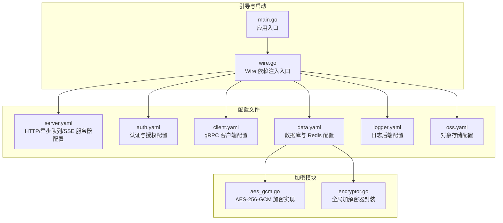
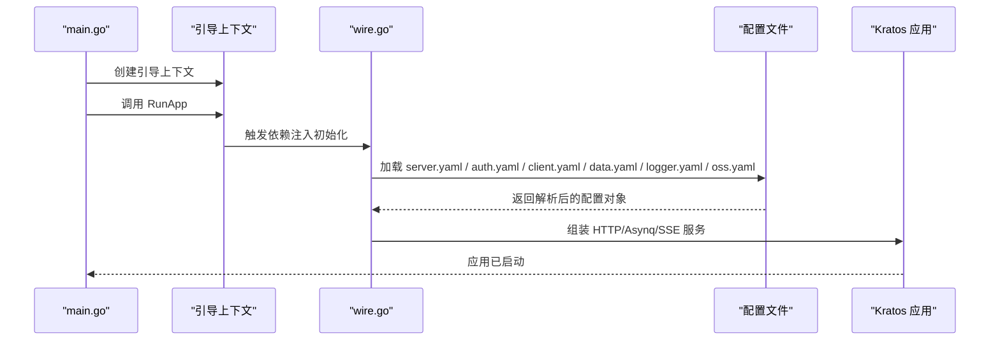
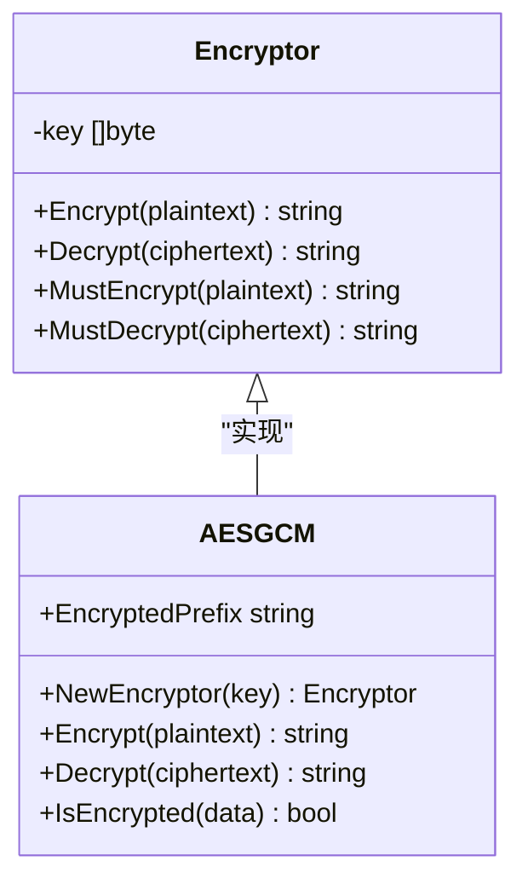
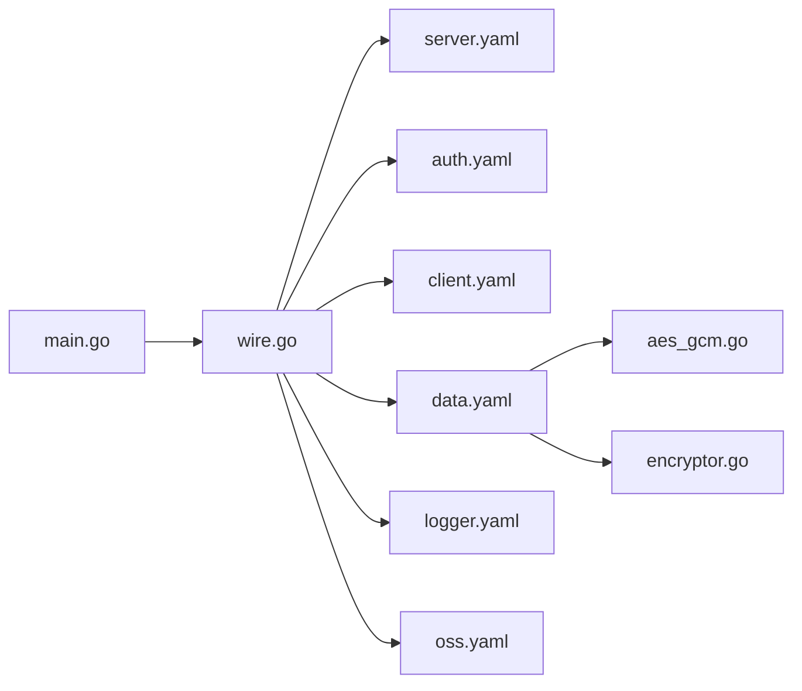

# 服务器配置管理

<cite>
**本文引用的文件**
- [main.go](file://backend/app/admin/service/cmd/server/main.go)
- [wire.go](file://backend/app/admin/service/cmd/server/wire.go)
- [server.yaml](file://backend/app/admin/service/configs/server.yaml)
- [auth.yaml](file://backend/app/admin/service/configs/auth.yaml)
- [client.yaml](file://backend/app/admin/service/configs/client.yaml)
- [data.yaml](file://backend/app/admin/service/configs/data.yaml)
- [logger.yaml](file://backend/app/admin/service/configs/logger.yaml)
- [oss.yaml](file://backend/app/admin/service/configs/oss.yaml)
- [aes_gcm.go](file://backend/pkg/crypto/aes_gcm.go)
- [encryptor.go](file://backend/pkg/crypto/encryptor.go)
</cite>

## 目录
1. [简介](#简介)
2. [项目结构](#项目结构)
3. [核心组件](#核心组件)
4. [架构总览](#架构总览)
5. [详细组件分析](#详细组件分析)
6. [依赖分析](#依赖分析)
7. [性能考虑](#性能考虑)
8. [故障排查指南](#故障排查指南)
9. [结论](#结论)
10. [附录](#附录)

## 简介
本文件系统性梳理 GoWind Admin 后端的服务器配置管理，涵盖配置文件格式、配置项定义、环境变量覆盖机制、配置热重载能力、配置验证与加密存储策略，并给出环境分离、敏感信息保护与配置版本控制的最佳实践。读者可据此快速理解并正确部署与维护系统。

## 项目结构
后端服务通过引导入口加载多类配置文件，采用 Kratos Bootstrap 提供的通用配置加载与应用启动流程。配置按功能域拆分在独立 YAML 文件中，便于维护与演进。

图表来源
- [main.go:1-76](file://backend/app/admin/service/cmd/server/main.go#L1-L76)
- [wire.go:1-47](file://backend/app/admin/service/cmd/server/wire.go#L1-L47)
- [server.yaml:1-49](file://backend/app/admin/service/configs/server.yaml#L1-L49)
- [auth.yaml:1-37](file://backend/app/admin/service/configs/auth.yaml#L1-L37)
- [client.yaml:1-14](file://backend/app/admin/service/configs/client.yaml#L1-L14)
- [data.yaml:1-21](file://backend/app/admin/service/configs/data.yaml#L1-L21)
- [logger.yaml:1-32](file://backend/app/admin/service/configs/logger.yaml#L1-L32)
- [oss.yaml:1-10](file://backend/app/admin/service/configs/oss.yaml#L1-L10)
- [aes_gcm.go:1-154](file://backend/pkg/crypto/aes_gcm.go#L1-L154)
- [encryptor.go:1-55](file://backend/pkg/crypto/encryptor.go#L1-L55)

章节来源
- [main.go:1-76](file://backend/app/admin/service/cmd/server/main.go#L1-L76)
- [wire.go:1-47](file://backend/app/admin/service/cmd/server/wire.go#L1-L47)

## 核心组件
- 配置加载与应用启动：由引导入口负责加载配置、初始化服务组件并启动应用。
- 配置文件域：HTTP/异步队列/SSE、认证与授权、gRPC 客户端、数据库与缓存、日志、对象存储。
- 加密模块：提供对敏感字段的加密存储与解密读取能力，支持统一前缀标识与自动识别。

章节来源
- [server.yaml:1-49](file://backend/app/admin/service/configs/server.yaml#L1-L49)
- [auth.yaml:1-37](file://backend/app/admin/service/configs/auth.yaml#L1-L37)
- [client.yaml:1-14](file://backend/app/admin/service/configs/client.yaml#L1-L14)
- [data.yaml:1-21](file://backend/app/admin/service/configs/data.yaml#L1-L21)
- [logger.yaml:1-32](file://backend/app/admin/service/configs/logger.yaml#L1-L32)
- [oss.yaml:1-10](file://backend/app/admin/service/configs/oss.yaml#L1-L10)
- [aes_gcm.go:1-154](file://backend/pkg/crypto/aes_gcm.go#L1-L154)
- [encryptor.go:1-55](file://backend/pkg/crypto/encryptor.go#L1-L55)

## 架构总览
下图展示从应用启动到各配置域生效的关键交互路径。

图表来源
- [main.go:59-75](file://backend/app/admin/service/cmd/server/main.go#L59-L75)
- [wire.go:37-46](file://backend/app/admin/service/cmd/server/wire.go#L37-L46)
- [server.yaml:1-49](file://backend/app/admin/service/configs/server.yaml#L1-L49)
- [auth.yaml:1-37](file://backend/app/admin/service/configs/auth.yaml#L1-L37)
- [client.yaml:1-14](file://backend/app/admin/service/configs/client.yaml#L1-L14)
- [data.yaml:1-21](file://backend/app/admin/service/configs/data.yaml#L1-L21)
- [logger.yaml:1-32](file://backend/app/admin/service/configs/logger.yaml#L1-L32)
- [oss.yaml:1-10](file://backend/app/admin/service/configs/oss.yaml#L1-L10)

## 详细组件分析

### HTTP/异步队列/SSE 服务器配置（server.yaml）
- HTTP REST 服务器
  - 监听地址与超时
  - Swagger 与 pprof 开关
  - CORS 头部、方法与来源白名单
  - 中间件开关：日志、恢复、链路追踪、参数校验、熔断、元数据
- Asynq 异步任务服务器
  - 连接 URI、编解码、并发度、优雅停机、严格优先级、时区、队列权重
- SSE 事件推送
  - 监听地址、编解码、路径、自动流式与自动应答

章节来源
- [server.yaml:1-49](file://backend/app/admin/service/configs/server.yaml#L1-L49)

### 认证与授权配置（auth.yaml）
- 认证（authn）
  - 类型：jwt、oidc、预共享密钥
  - JWT：签名算法与密钥
  - OIDC：发行者、受众、算法
  - 预共享密钥：有效密钥列表
- 授权（authz）
  - 类型：casbin、opa、zanzibar/noop
  - Zanzibar 子类型：keto 或 openfga，分别配置写/读地址、gRPC 使用、API 地址、Store ID、访问令牌

章节来源
- [auth.yaml:1-37](file://backend/app/admin/service/configs/auth.yaml#L1-L37)

### gRPC 客户端配置（client.yaml）
- 超时时间
- 中间件开关：日志、恢复、链路追踪、参数校验、熔断、元数据
- 认证：方法与密钥

章节来源
- [client.yaml:1-14](file://backend/app/admin/service/configs/client.yaml#L1-L14)

### 数据库与缓存配置（data.yaml）
- 数据库
  - 驱动：postgres 或注释掉的 mysql
  - 连接串（建议使用环境变量或密文）
  - 迁移开关、调试模式、链路追踪与指标
  - 连接池：空闲/最大连接数、生命周期
- 缓存（Redis）
  - 地址、密码、拨号/读/写超时

章节来源
- [data.yaml:1-21](file://backend/app/admin/service/configs/data.yaml#L1-L21)

### 日志配置（logger.yaml）
- 日志类型：标准输出、文件、fluent、zap、logrus、阿里云、腾讯云
- 各类型特定参数：如文件日志的级别、文件名、轮转大小/天数/备份数；logrus 的格式化与时间戳；云厂商的接入点、项目、凭证

章节来源
- [logger.yaml:1-32](file://backend/app/admin/service/configs/logger.yaml#L1-L32)

### 对象存储配置（oss.yaml）
- MinIO：端点、上传/下载主机、访问密钥、私密密钥、会话令牌、是否启用 SSL

章节来源
- [oss.yaml:1-10](file://backend/app/admin/service/configs/oss.yaml#L1-L10)

### 配置加密存储与解密读取（aes_gcm.go, encryptor.go）
- 加密实现
  - 前缀标识：用于区分明文与密文
  - 密钥派生：SHA-256 派生 32 字节密钥
  - 加密：AES-256-GCM，随机 Nonce，Base64 编码，带前缀
  - 解密：校验前缀、Base64 解码、GCM 验证与解封
- 全局加解密器
  - 单例初始化与开关控制
  - 条件加密/解密：未启用时返回原值

图表来源
- [aes_gcm.go:26-154](file://backend/pkg/crypto/aes_gcm.go#L26-L154)
- [encryptor.go:12-55](file://backend/pkg/crypto/encryptor.go#L12-L55)

## 依赖分析
- 配置文件之间无直接耦合，通过引导入口集中加载，降低模块内聚与外部依赖复杂度。
- 加密模块与数据配置域弱耦合：仅在需要对敏感字段进行加密存储时使用，不影响其他配置域。

图表来源
- [main.go:1-76](file://backend/app/admin/service/cmd/server/main.go#L1-L76)
- [wire.go:1-47](file://backend/app/admin/service/cmd/server/wire.go#L1-L47)
- [server.yaml:1-49](file://backend/app/admin/service/configs/server.yaml#L1-L49)
- [auth.yaml:1-37](file://backend/app/admin/service/configs/auth.yaml#L1-L37)
- [client.yaml:1-14](file://backend/app/admin/service/configs/client.yaml#L1-L14)
- [data.yaml:1-21](file://backend/app/admin/service/configs/data.yaml#L1-L21)
- [logger.yaml:1-32](file://backend/app/admin/service/configs/logger.yaml#L1-L32)
- [oss.yaml:1-10](file://backend/app/admin/service/configs/oss.yaml#L1-L10)
- [aes_gcm.go:1-154](file://backend/pkg/crypto/aes_gcm.go#L1-L154)
- [encryptor.go:1-55](file://backend/pkg/crypto/encryptor.go#L1-L55)

## 性能考虑
- HTTP 中间件：日志、恢复、链路追踪、参数校验、熔断与元数据会带来额外开销，建议在生产环境按需开启。
- Asynq 并发与队列权重：根据业务负载调整并发度与队列优先级，避免资源争用。
- 数据库连接池：合理设置空闲/最大连接数与生命周期，避免频繁创建销毁连接。
- 日志级别与轮转：生产环境建议提升日志级别并配置合理的轮转策略，减少磁盘 IO。

## 故障排查指南
- 配置加载失败
  - 检查配置文件路径与权限，确认引导入口已正确引入对应配置文件。
  - 关注中间件开关是否导致请求异常，逐步禁用定位问题。
- 认证/授权异常
  - 核对认证类型与密钥配置，确保算法与密钥匹配。
  - 授权为 noop 时不具备策略检查能力，需切换至 casbin/opa/zanzibar 并完善策略。
- 数据库连接失败
  - 校验驱动与连接串，优先使用环境变量注入敏感信息。
  - 检查网络连通性与密码，确认迁移开关与调试模式。
- 加密字段无法解密
  - 确认密钥长度与派生逻辑，检查密文前缀是否存在。
  - 若未启用加密器，返回原值属预期行为。

章节来源
- [server.yaml:1-49](file://backend/app/admin/service/configs/server.yaml#L1-L49)
- [auth.yaml:1-37](file://backend/app/admin/service/configs/auth.yaml#L1-L37)
- [data.yaml:1-21](file://backend/app/admin/service/configs/data.yaml#L1-L21)
- [aes_gcm.go:82-130](file://backend/pkg/crypto/aes_gcm.go#L82-L130)
- [encryptor.go:36-54](file://backend/pkg/crypto/encryptor.go#L36-L54)

## 结论
GoWind Admin 的配置体系以清晰的文件域划分与简洁的引导加载机制为核心，结合可选的加密存储与中间件能力，满足开发、测试与生产的多样化需求。遵循本文最佳实践，可在保证安全性的同时提升运维效率与系统稳定性。

## 附录

### 配置项与默认值对照表
- HTTP REST
  - 监听地址：默认端口与绑定地址
  - 超时：默认秒级超时
  - Swagger：默认开启
  - pprof：默认开启
  - CORS：默认允许常用头部、方法与来源
  - 中间件：默认开启日志、恢复、链路追踪、参数校验、熔断、元数据
- Asynq
  - 编解码：默认 JSON
  - 并发度：默认数值
  - 优雅停机：默认关闭
  - 严格优先级：默认开启
  - 时区：默认本地时区
  - 队列权重：默认多队列配置
- SSE
  - 监听地址：默认端口与绑定地址
  - 编解码：默认 JSON
  - 路径：默认事件路径
  - 自动流式/自动应答：默认开启/关闭
- 认证（authn）
  - 类型：默认 jwt
  - JWT：默认算法与密钥
  - OIDC：默认发行者、受众与算法
  - 预共享密钥：默认空列表
- 授权（authz）
  - 类型：默认 noop
  - Zanzibar：默认 keto 写/读地址与 gRPC 开关
- gRPC 客户端
  - 超时：默认秒级超时
  - 中间件：默认开启日志、恢复、链路追踪、参数校验、熔断、元数据
  - 认证：默认空方法与密钥
- 数据库
  - 驱动：默认 postgres
  - 迁移：默认开启
  - 调试/链路追踪/指标：默认关闭
  - 连接池：默认空闲/最大连接数与生命周期
- Redis
  - 地址：默认容器内地址
  - 密码：默认空串
  - 超时：默认秒级拨号/读/写
- 日志
  - 类型：默认标准输出
  - 各类型参数：按需配置
- 对象存储
  - MinIO：默认端点与密钥

章节来源
- [server.yaml:1-49](file://backend/app/admin/service/configs/server.yaml#L1-L49)
- [auth.yaml:1-37](file://backend/app/admin/service/configs/auth.yaml#L1-L37)
- [client.yaml:1-14](file://backend/app/admin/service/configs/client.yaml#L1-L14)
- [data.yaml:1-21](file://backend/app/admin/service/configs/data.yaml#L1-L21)
- [logger.yaml:1-32](file://backend/app/admin/service/configs/logger.yaml#L1-L32)
- [oss.yaml:1-10](file://backend/app/admin/service/configs/oss.yaml#L1-L10)

### 环境变量覆盖机制
- 本仓库未显式声明环境变量覆盖规则。建议在部署环境中通过环境变量注入敏感配置（如数据库密码、加密密钥、对象存储密钥），并在启动前进行校验与解密处理，避免硬编码于配置文件中。

### 配置热重载机制
- 本仓库未内置配置热重载实现。建议在生产环境采用配置中心（如 Apollo/Consul/Etcd/Nacos）并结合文件监听或信号触发平滑重启，确保变更生效且不中断服务。

### 配置验证规则
- 建议在加载配置后执行以下验证：
  - 必填字段非空校验
  - 数值范围与枚举值校验
  - 连接串语法与可达性校验
  - 加密字段前缀与格式校验

### 配置加密存储最佳实践
- 对敏感字段（如数据库密码、对象存储密钥、认证密钥）采用统一前缀标识与 AES-256-GCM 加密，密钥通过环境变量注入。
- 在读取阶段自动识别密文并解密，未启用加密器时返回原值，保证兼容性。
- 定期轮换加密密钥并更新存量密文。

章节来源
- [aes_gcm.go:15-24](file://backend/pkg/crypto/aes_gcm.go#L15-L24)
- [aes_gcm.go:46-78](file://backend/pkg/crypto/aes_gcm.go#L46-L78)
- [aes_gcm.go:80-130](file://backend/pkg/crypto/aes_gcm.go#L80-L130)
- [encryptor.go:12-25](file://backend/pkg/crypto/encryptor.go#L12-L25)
- [encryptor.go:36-54](file://backend/pkg/crypto/encryptor.go#L36-L54)

### 环境分离与版本控制
- 环境分离：开发/测试/生产使用不同配置文件或环境变量集，敏感信息通过密钥管理服务注入。
- 版本控制：将配置文件纳入版本库，对敏感信息使用占位符并通过 CI/CD 注入，避免泄露。