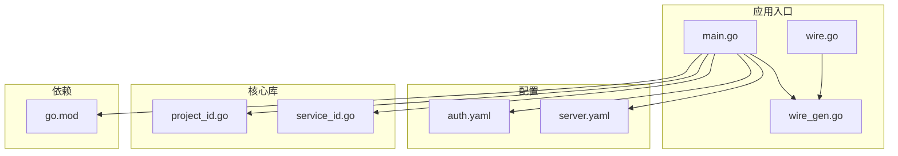
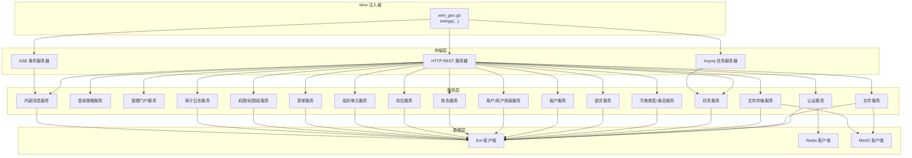
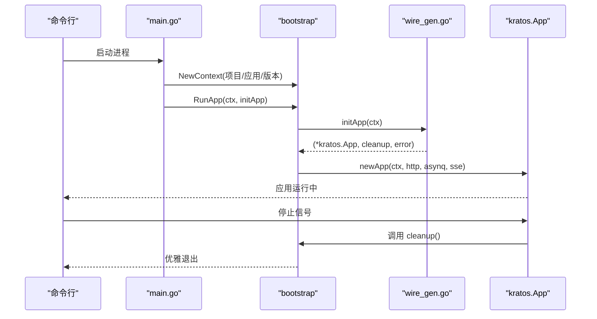
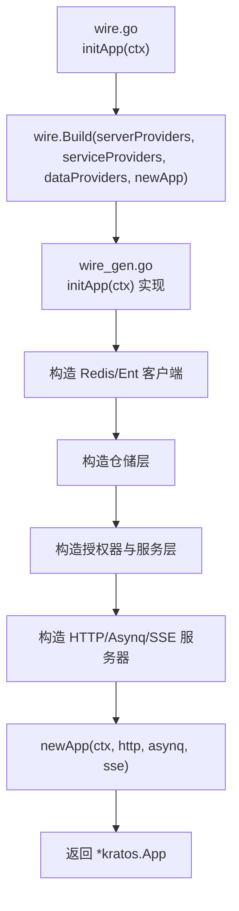
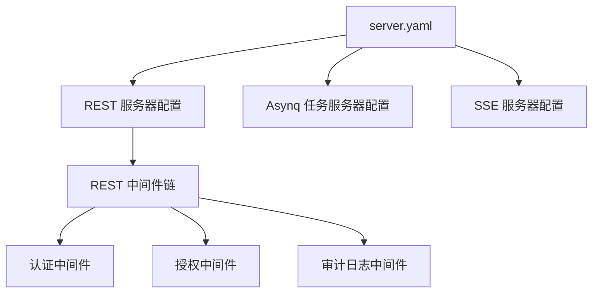
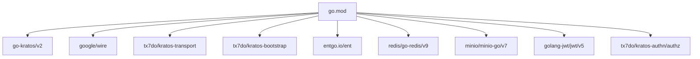

# 服务架构设计

<cite>
**本文引用的文件**
- [main.go](file://backend/app/admin/service/cmd/server/main.go)
- [wire.go](file://backend/app/admin/service/cmd/server/wire.go)
- [wire_gen.go](file://backend/app/admin/service/cmd/server/wire_gen.go)
- [server.yaml](file://backend/app/admin/service/configs/server.yaml)
- [auth.yaml](file://backend/app/admin/service/configs/auth.yaml)
- [go.mod](file://backend/go.mod)
- [service_id.go](file://backend/pkg/serviceid/service_id.go)
- [project_id.go](file://backend/pkg/serviceid/project_id.go)
</cite>

## 目录
1. [简介](#简介)
2. [项目结构](#项目结构)
3. [核心组件](#核心组件)
4. [架构总览](#架构总览)
5. [详细组件分析](#详细组件分析)
6. [依赖关系分析](#依赖关系分析)
7. [性能考虑](#性能考虑)
8. [故障排查指南](#故障排查指南)
9. [结论](#结论)
10. [附录](#附录)

## 简介
本文件系统性阐述 GoWind Admin 服务的基于 go-kratos 的微服务架构设计与实现要点，涵盖服务接口定义、Wire 依赖注入容器配置、服务生命周期管理、启动流程、服务器配置、REST 与 gRPC 注册机制、服务间通信模式与集成策略，并提供服务开发标准模板与最佳实践（错误处理、日志记录、性能监控等）。文中所有技术细节均来自仓库现有源码与配置文件，确保可追溯与可验证。

## 项目结构
GoWind Admin 服务采用分层与功能域混合的组织方式：
- 应用入口与引导：位于 backend/app/admin/service/cmd/server，包含 main、wire、wire_gen 及自动生成的注入器
- 配置：位于 backend/app/admin/service/configs，包含服务器、认证与授权等配置
- 核心库与工具：位于 backend/pkg，如服务标识、权限授权、加密、事件总线、中间件等
- 依赖声明：backend/go.mod 明确了 go-kratos 生态、Wire、Asynq、SSE、OpenTelemetry、数据库与缓存等依赖

**图表来源**
- [main.go:1-76](file://backend/app/admin/service/cmd/server/main.go#L1-L76)
- [wire.go:1-47](file://backend/app/admin/service/cmd/server/wire.go#L1-L47)
- [wire_gen.go:1-134](file://backend/app/admin/service/cmd/server/wire_gen.go#L1-L134)
- [server.yaml:1-49](file://backend/app/admin/service/configs/server.yaml#L1-L49)
- [auth.yaml:1-37](file://backend/app/admin/service/configs/auth.yaml#L1-L37)
- [go.mod:1-290](file://backend/go.mod#L1-L290)
- [service_id.go:1-11](file://backend/pkg/serviceid/service_id.go#L1-L11)
- [project_id.go:1-6](file://backend/pkg/serviceid/project_id.go#L1-L6)

**章节来源**
- [main.go:1-76](file://backend/app/admin/service/cmd/server/main.go#L1-L76)
- [wire.go:1-47](file://backend/app/admin/service/cmd/server/wire.go#L1-L47)
- [wire_gen.go:1-134](file://backend/app/admin/service/cmd/server/wire_gen.go#L1-L134)
- [server.yaml:1-49](file://backend/app/admin/service/configs/server.yaml#L1-L49)
- [auth.yaml:1-37](file://backend/app/admin/service/configs/auth.yaml#L1-L37)
- [go.mod:1-290](file://backend/go.mod#L1-L290)
- [service_id.go:1-11](file://backend/pkg/serviceid/service_id.go#L1-L11)
- [project_id.go:1-6](file://backend/pkg/serviceid/project_id.go#L1-L6)

## 核心组件
- 服务引导与生命周期
  - 应用通过 bootstrap.RunApp(ctx, initApp) 启动，initApp 由 Wire 生成的注入器提供，负责装配 HTTP、Asynq、SSE 三大传输层与各领域服务
  - 版本号通过链接参数注入，便于可观测性与发布追踪
- 传输层
  - HTTP REST：启用 Swagger、pprof、CORS、日志、恢复、链路追踪、参数校验、熔断、元数据等中间件
  - Asynq：基于 Redis 的异步任务队列，支持多优先级队列、并发控制、优雅停机
  - SSE：服务端推送事件，支持 JSON 编解码与路径配置
- 认证与授权
  - 认证：支持 JWT、OIDC、预共享密钥三种模式
  - 授权：支持 Casbin、OPA、Zanzibar（Keto/OpenFGA）或 NoOp 模式
- 数据与仓储
  - 基于 Ent 的实体访问层，提供角色、权限、用户、菜单、审计日志、字典、语言、租户、组织单元、岗位、内部消息、任务等仓储
- 中间件与基础设施
  - REST 中间件链：令牌校验、授权、审计日志、登录审计、API 审计、操作审计、数据访问审计等
  - 缓存与密码加密、MinIO 文件存储、Lua 脚本引擎、事件总线等

**章节来源**
- [main.go:46-76](file://backend/app/admin/service/cmd/server/main.go#L46-L76)
- [wire_gen.go:30-134](file://backend/app/admin/service/cmd/server/wire_gen.go#L30-L134)
- [server.yaml:1-49](file://backend/app/admin/service/configs/server.yaml#L1-L49)
- [auth.yaml:1-37](file://backend/app/admin/service/configs/auth.yaml#L1-L37)

## 架构总览
下图展示了 Admin 服务的整体架构：Wire 注入器装配数据层、服务层与传输层，bootstrap 将其组合为 Kratos 应用；HTTP REST 提供 Web API 与 Swagger，Asynq 处理后台任务，SSE 推送事件；认证与授权贯穿请求处理链路。

**图表来源**
- [wire_gen.go:30-134](file://backend/app/admin/service/cmd/server/wire_gen.go#L30-L134)
- [server.yaml:1-49](file://backend/app/admin/service/configs/server.yaml#L1-L49)
- [auth.yaml:1-37](file://backend/app/admin/service/configs/auth.yaml#L1-L37)

## 详细组件分析

### 服务启动流程与生命周期
- 入口函数 main 调用 runApp，创建 bootstrap 上下文（包含项目名、应用 ID、版本），随后调用 bootstrap.RunApp 执行初始化与启动
- initApp 由 Wire 生成，负责按顺序构建 Redis/Ent 客户端、仓储、授权器、服务，再创建 HTTP/Asynq/SSE 服务器并组装为 kratos.App
- 关闭时执行清理回调，释放数据库连接与 Redis 连接

**图表来源**
- [main.go:59-76](file://backend/app/admin/service/cmd/server/main.go#L59-L76)
- [wire_gen.go:30-134](file://backend/app/admin/service/cmd/server/wire_gen.go#L30-L134)

**章节来源**
- [main.go:59-76](file://backend/app/admin/service/cmd/server/main.go#L59-L76)
- [wire_gen.go:30-134](file://backend/app/admin/service/cmd/server/wire_gen.go#L30-L134)

### Wire 依赖注入容器配置
- wire.go 定义了 ProviderSet 的组合，通过 wire.Build 将 server、service、data 三类 ProviderSet 与 newApp 聚合，形成 initApp 的注入入口
- wire_gen.go 是 Wire 生成的注入器实现，按依赖顺序构造 Redis/Ent 客户端、仓储、授权器、服务，再创建 HTTP/Asynq/SSE 服务器并返回 kratos.App

**图表来源**
- [wire.go:27-46](file://backend/app/admin/service/cmd/server/wire.go#L27-L46)
- [wire_gen.go:30-134](file://backend/app/admin/service/cmd/server/wire_gen.go#L30-L134)

**章节来源**
- [wire.go:1-47](file://backend/app/admin/service/cmd/server/wire.go#L1-L47)
- [wire_gen.go:1-134](file://backend/app/admin/service/cmd/server/wire_gen.go#L1-L134)

### 服务器配置与注册机制
- REST 服务器
  - 地址与超时、Swagger 开关、pprof 开关、CORS 放行列表、中间件开关（日志、恢复、链路追踪、参数校验、熔断、元数据）
  - 中间件链在 server 层统一装配，覆盖认证、授权、审计日志等
- Asynq 任务服务器
  - Redis 连接串、编解码、并发、优雅停机、严格优先级、时区、多队列优先级
- SSE 服务器
  - 地址、编解码、事件路径、自动流式与自动应答

**图表来源**
- [server.yaml:1-49](file://backend/app/admin/service/configs/server.yaml#L1-L49)

**章节来源**
- [server.yaml:1-49](file://backend/app/admin/service/configs/server.yaml#L1-L49)

### 服务间通信模式与集成策略
- 内部服务调用
  - 服务层通过仓储层与 Ent 客户端交互，避免跨模块直接耦合
  - 授权器在服务层统一使用，保证权限策略一致性
- 异步任务
  - 使用 Asynq 处理耗时任务（如文件上传、通知发送），通过多优先级队列保障关键任务及时性
- 事件推送
  - 使用 SSE 向前端推送内部消息等实时事件
- 外部集成
  - MinIO 对象存储用于文件上传下载
  - Redis 用于缓存与令牌校验

**章节来源**
- [wire_gen.go:30-134](file://backend/app/admin/service/cmd/server/wire_gen.go#L30-L134)
- [server.yaml:30-49](file://backend/app/admin/service/configs/server.yaml#L30-L49)
- [auth.yaml:1-37](file://backend/app/admin/service/configs/auth.yaml#L1-L37)

### 服务开发标准模板与最佳实践
- 创建新服务模块步骤
  - 在 internal/service 下新增服务包，定义服务结构体与方法
  - 在 internal/data 下新增仓储与实体映射，使用 Ent 客户端
  - 在 internal/server 下注册 REST 方法与路由，必要时扩展中间件
  - 在 wire.go 的对应 ProviderSet 中添加新服务与仓储的提供者
  - 在 wire_gen.go 中确认注入顺序正确，确保依赖满足
- 错误处理
  - 使用统一的错误包装与返回，结合中间件进行日志与链路追踪
- 日志记录
  - REST 中间件开启日志与恢复，结合 OpenTelemetry 进行分布式追踪
- 性能监控
  - 启用 pprof 与 Prometheus 指标（需在中间件与导出器配置中启用）
  - Asynq 队列设置合理并发与队列优先级，避免阻塞
- 配置管理
  - 通过 YAML 配置集中管理服务器、认证与授权策略，支持热更新与环境隔离

**章节来源**
- [wire.go:27-46](file://backend/app/admin/service/cmd/server/wire.go#L27-L46)
- [wire_gen.go:30-134](file://backend/app/admin/service/cmd/server/wire_gen.go#L30-L134)
- [server.yaml:1-49](file://backend/app/admin/service/configs/server.yaml#L1-L49)
- [auth.yaml:1-37](file://backend/app/admin/service/configs/auth.yaml#L1-L37)

## 依赖关系分析
- 核心框架
  - go-kratos/v2：微服务框架与传输层抽象
  - google/wire：依赖注入容器
- 传输与中间件
  - tx7do/kratos-transport：Asynq/SSE 传输适配
  - tx7do/kratos-bootstrap：引导、配置、注册中心、追踪等生态组件
- 数据与缓存
  - entgo.io/ent：ORM 与实体模型
  - redis/go-redis/v9：Redis 客户端
  - minio/minio-go/v7：对象存储客户端
- 安全与鉴权
  - golang-jwt/jwt/v5：JWT 处理
  - tx7do/kratos-authn/authz：认证与授权引擎（Casbin、OPA、Zanzibar）

**图表来源**
- [go.mod:1-290](file://backend/go.mod#L1-L290)

**章节来源**
- [go.mod:1-290](file://backend/go.mod#L1-L290)

## 性能考虑
- 传输层
  - REST：启用 pprof 便于性能剖析；合理设置超时与中间件开销
  - Asynq：根据业务负载调整并发与队列优先级，避免饥饿
  - SSE：注意事件流的背压与客户端重连策略
- 数据访问
  - 使用 Ent 的预加载与批量操作减少 N+1 查询
  - Redis 缓存热点数据，降低数据库压力
- 监控与追踪
  - 启用 OpenTelemetry 导出器，收集链路与指标
  - 结合 Prometheus/Grafana 进行可视化监控

## 故障排查指南
- 启动失败
  - 检查 server.yaml 中 REST/Asynq/SSE 地址是否冲突
  - 确认 Redis/数据库连接串与凭据正确
- 认证/授权异常
  - 校验 auth.yaml 中认证类型与密钥配置
  - 授权策略（Casbin/OPA/Zanzibar）配置是否匹配
- 任务积压
  - 检查 Asynq 并发与队列优先级设置
  - 查看 Redis 队列长度与任务耗时
- 审计日志缺失
  - 确认审计中间件已启用且仓储可用
  - 检查数据库写入权限与表结构

**章节来源**
- [server.yaml:1-49](file://backend/app/admin/service/configs/server.yaml#L1-L49)
- [auth.yaml:1-37](file://backend/app/admin/service/configs/auth.yaml#L1-L37)
- [wire_gen.go:30-134](file://backend/app/admin/service/cmd/server/wire_gen.go#L30-L134)

## 结论
GoWind Admin 服务以 go-kratos 为核心，借助 Wire 实现清晰的依赖注入与模块化装配，结合 tx7do 生态组件完成 REST、Asynq、SSE 的多传输层集成。通过统一的认证与授权策略、完善的中间件链与仓储层抽象，实现了高内聚、低耦合的服务架构。遵循本文提供的开发模板与最佳实践，可快速扩展新服务模块并保持一致的可观测性与可靠性。

## 附录
- 服务标识
  - 项目名：gowind
  - 应用 ID：admin-service
- 版本注入
  - 通过链接参数 main.version 设置版本号，便于部署与追踪

**章节来源**
- [service_id.go:1-11](file://backend/pkg/serviceid/service_id.go#L1-L11)
- [project_id.go:1-6](file://backend/pkg/serviceid/project_id.go#L1-L6)
- [main.go:42-46](file://backend/app/admin/service/cmd/server/main.go#L42-L46)