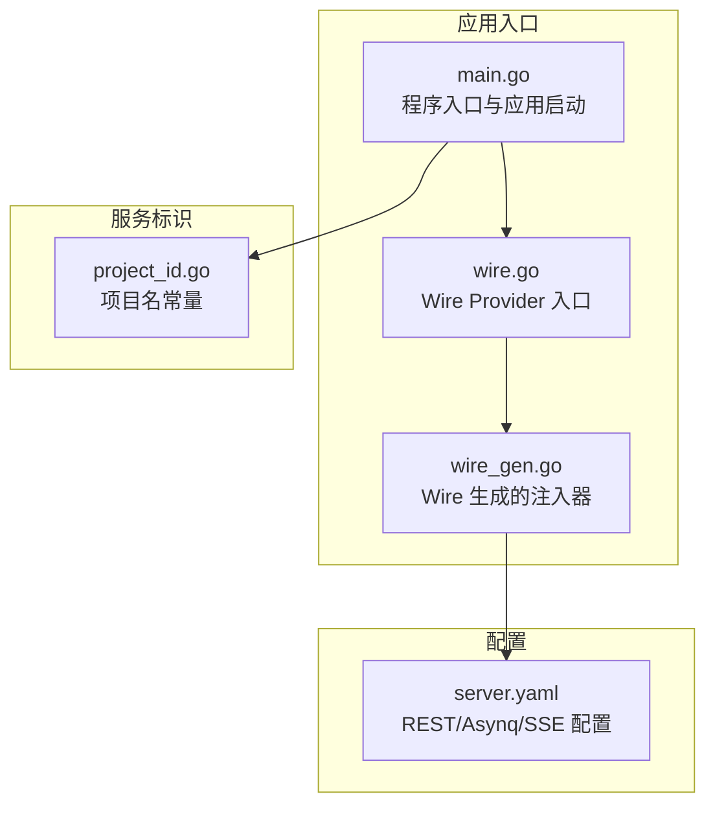
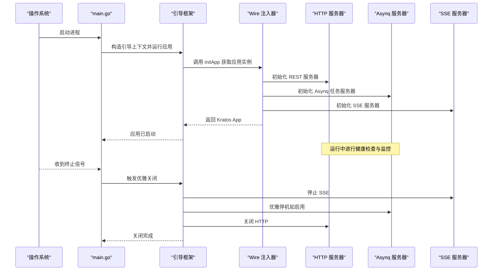
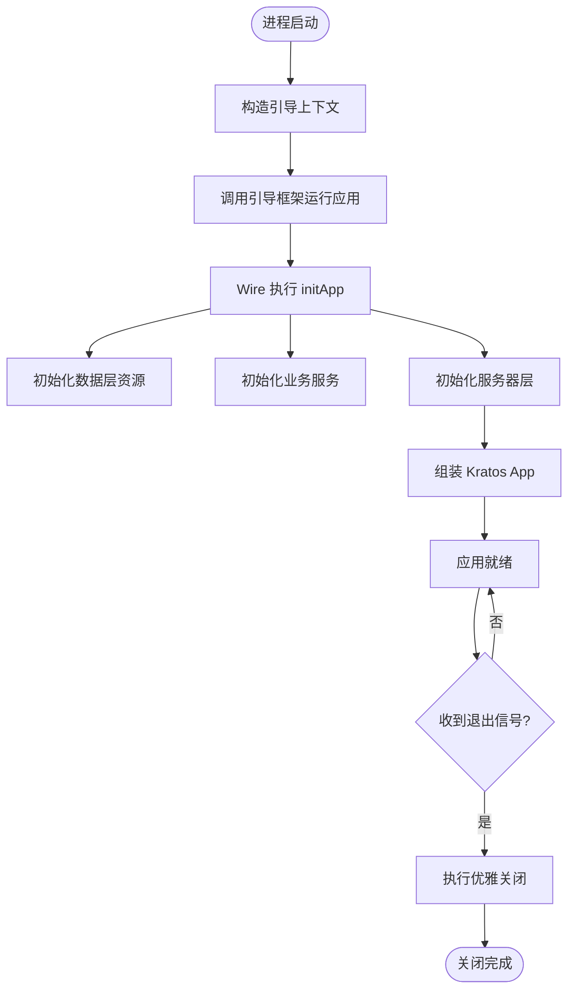
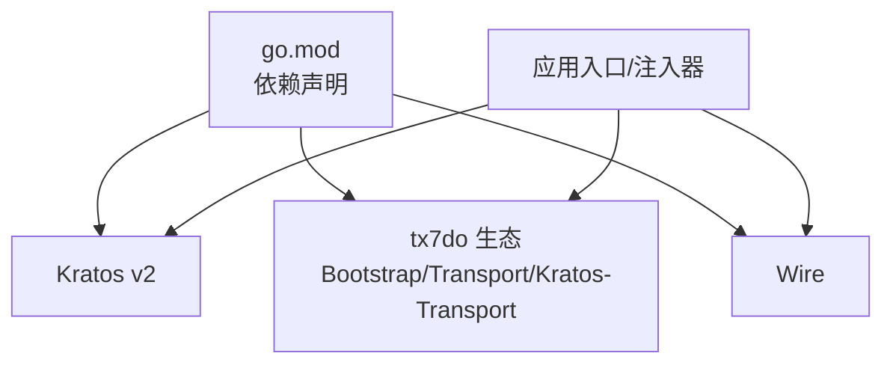

# 服务生命周期管理

<cite>
**本文引用的文件**
- [main.go](file://backend/app/admin/service/cmd/server/main.go)
- [wire.go](file://backend/app/admin/service/cmd/server/wire.go)
- [wire_gen.go](file://backend/app/admin/service/cmd/server/wire_gen.go)
- [server.yaml](file://backend/app/admin/service/configs/server.yaml)
- [project_id.go](file://backend/pkg/serviceid/project_id.go)
- [go.mod](file://backend/go.mod)
</cite>

## 目录
1. [简介](#简介)
2. [项目结构](#项目结构)
3. [核心组件](#核心组件)
4. [架构总览](#架构总览)
5. [详细组件分析](#详细组件分析)
6. [依赖分析](#依赖分析)
7. [性能考虑](#性能考虑)
8. [故障排查指南](#故障排查指南)
9. [结论](#结论)
10. [附录](#附录)

## 简介
本文件系统性阐述 GoWind Admin 后端服务在 Kratos 生态下的完整生命周期：从启动、初始化、运行、健康检查到优雅关闭与故障恢复。重点覆盖多服务器实例（HTTP、Asynq、SSE）的配置与协调、资源加载顺序与依赖关系验证、钩子扩展点与启动失败处理策略，并通过图示化方式呈现关键流程。

## 项目结构
- 服务入口位于后端应用的命令行模块，采用 Kratos Bootstrap 提供的引导框架，结合 Wire 依赖注入完成应用装配。
- 配置集中于 YAML 文件，分别控制 REST、Asynq、SSE 三类服务器的行为参数。
- 服务标识由独立包提供，贯穿应用上下文以统一标识项目与服务实例。

图表来源
- [main.go:1-76](file://backend/app/admin/service/cmd/server/main.go#L1-L76)
- [wire.go:1-47](file://backend/app/admin/service/cmd/server/wire.go#L1-L47)
- [wire_gen.go:1-134](file://backend/app/admin/service/cmd/server/wire_gen.go#L1-L134)
- [server.yaml:1-49](file://backend/app/admin/service/configs/server.yaml#L1-L49)
- [project_id.go:1-6](file://backend/pkg/serviceid/project_id.go#L1-L6)

章节来源
- [main.go:1-76](file://backend/app/admin/service/cmd/server/main.go#L1-L76)
- [wire.go:1-47](file://backend/app/admin/service/cmd/server/wire.go#L1-L47)
- [wire_gen.go:1-134](file://backend/app/admin/service/cmd/server/wire_gen.go#L1-L134)
- [server.yaml:1-49](file://backend/app/admin/service/configs/server.yaml#L1-L49)
- [project_id.go:1-6](file://backend/pkg/serviceid/project_id.go#L1-L6)

## 核心组件
- 应用入口与引导
  - 程序入口负责构造引导上下文，调用引导框架运行应用。
  - 应用由 HTTP、Asynq、SSE 三种传输层服务器组成，统一交由 Kratos App 管理。
- 依赖注入与装配
  - 使用 Wire 将数据层、服务层、服务器层的 Provider 组合，生成注入器，确保资源按序初始化与释放。
- 多服务器实例
  - HTTP REST 服务器：提供 API 与 Swagger、pprof 能力，内置中间件链。
  - Asynq 任务服务器：基于 Redis，支持队列优先级、并发与优雅停机。
  - SSE 服务器：提供事件推送能力，可配置地址、路径与编解码。
- 配置中心
  - 通过 YAML 集中管理各服务器的网络、超时、中间件开关等参数。

章节来源
- [main.go:46-76](file://backend/app/admin/service/cmd/server/main.go#L46-L76)
- [wire.go:27-46](file://backend/app/admin/service/cmd/server/wire.go#L27-L46)
- [wire_gen.go:30-134](file://backend/app/admin/service/cmd/server/wire_gen.go#L30-L134)
- [server.yaml:1-49](file://backend/app/admin/service/configs/server.yaml#L1-L49)

## 架构总览
下图展示了服务生命周期的关键阶段：启动、初始化、运行、健康检查、优雅关闭与故障恢复。

图表来源
- [main.go:59-76](file://backend/app/admin/service/cmd/server/main.go#L59-L76)
- [wire_gen.go:115-134](file://backend/app/admin/service/cmd/server/wire_gen.go#L115-L134)

## 详细组件分析

### 启动与初始化流程
- 引导上下文
  - 在入口处构造包含项目名、服务 ID、版本号的引导上下文，作为后续依赖注入与配置解析的基础。
- 应用装配
  - 通过 Wire Provider 组合，依次初始化数据层（Redis、数据库）、服务层（认证、权限、用户、任务等）、服务器层（REST、Asynq、SSE）。
  - 若任一阶段初始化失败，将回滚已初始化资源并返回错误。
- 应用启动
  - 将 HTTP、Asynq、SSE 服务器注册至 Kratos App，统一管理生命周期。

图表来源
- [main.go:59-76](file://backend/app/admin/service/cmd/server/main.go#L59-L76)
- [wire.go:27-46](file://backend/app/admin/service/cmd/server/wire.go#L27-L46)
- [wire_gen.go:30-134](file://backend/app/admin/service/cmd/server/wire_gen.go#L30-L134)

章节来源
- [main.go:59-76](file://backend/app/admin/service/cmd/server/main.go#L59-L76)
- [wire.go:27-46](file://backend/app/admin/service/cmd/server/wire.go#L27-L46)
- [wire_gen.go:30-134](file://backend/app/admin/service/cmd/server/wire_gen.go#L30-L134)

### 服务器配置与健康检查
- HTTP REST 服务器
  - 监听地址、超时、Swagger 与 pprof 开关、CORS 策略、中间件开关（日志、恢复、追踪、校验、熔断、元数据）。
- Asynq 任务服务器
  - Redis 连接串、编解码、并发、关闭超时、是否启用优雅停机、严格优先级、时区、队列权重。
- SSE 服务器
  - 监听地址、编解码、事件路径、自动流式推送与自动应答。
- 健康检查
  - 建议在 HTTP 层暴露健康检查端点；对 Asynq 可通过连接 Redis 与队列状态进行简单探活；SSE 可通过连接可用性与事件通道状态判断。

章节来源
- [server.yaml:1-49](file://backend/app/admin/service/configs/server.yaml#L1-L49)

### 优雅关闭机制
- 关闭顺序
  - SSE → Asynq（若启用优雅停机）→ HTTP。
  - Asynq 的优雅停机受配置项控制，建议在生产环境开启以保证任务处理完整性。
- 清理函数
  - Wire 注入器在初始化失败时会回滚已建立的资源；应用退出时由 Kratos App 调用清理函数释放资源。

章节来源
- [wire_gen.go:129-134](file://backend/app/admin/service/cmd/server/wire_gen.go#L129-L134)
- [server.yaml:30-49](file://backend/app/admin/service/configs/server.yaml#L30-L49)

### 多服务器实例管理
- 实例职责
  - HTTP：对外提供 API、静态资源、Swagger 文档与调试接口。
  - Asynq：后台任务调度与执行，支持优先级队列与重试策略。
  - SSE：向客户端推送实时事件。
- 协同与隔离
  - 三者通过 Kratos App 统一管理，彼此独立运行，避免相互阻塞。
  - 中间件链在 HTTP 层统一生效，便于统一鉴权、审计与可观测性。

章节来源
- [main.go:46-57](file://backend/app/admin/service/cmd/server/main.go#L46-L57)
- [wire_gen.go:115-128](file://backend/app/admin/service/cmd/server/wire_gen.go#L115-L128)

### 服务监控与故障恢复策略
- 监控建议
  - HTTP：启用 pprof 与指标导出，结合中间件日志与追踪。
  - Asynq：监控队列长度、处理耗时、失败重试次数；必要时接入告警。
  - SSE：监控连接数、事件发送速率与客户端断连率。
- 故障恢复
  - 启动失败：利用 Wire 回滚与错误传播，定位具体初始化环节。
  - 运行期异常：启用恢复中间件与日志记录，结合外部进程管理器（如 PM2/Docker）实现自动重启。
  - 优雅重启：通过进程信号触发优雅关闭，配合新进程接管端口。

章节来源
- [server.yaml:22-29](file://backend/app/admin/service/configs/server.yaml#L22-L29)
- [server.yaml:30-49](file://backend/app/admin/service/configs/server.yaml#L30-L49)

### 自定义生命周期钩子与启动失败处理
- 生命周期钩子
  - 可在引导框架提供的扩展点注册启动前/启动后钩子，用于延迟初始化或外部依赖探测。
  - 示例参考路径：[main.go:59-69](file://backend/app/admin/service/cmd/server/main.go#L59-L69)
- 启动失败处理
  - Wire 初始化失败时，注入器会返回错误并触发回滚；应用启动阶段即刻失败，避免部分初始化导致的资源泄漏。
  - 示例参考路径：[wire_gen.go:115-134](file://backend/app/admin/service/cmd/server/wire_gen.go#L115-L134)

章节来源
- [main.go:59-69](file://backend/app/admin/service/cmd/server/main.go#L59-L69)
- [wire_gen.go:115-134](file://backend/app/admin/service/cmd/server/wire_gen.go#L115-L134)

## 依赖分析
- 模块依赖
  - 项目使用 Kratos v2 作为核心框架，结合 tx7do 生态（Bootstrap、Transport、Kratos-Transport）实现多服务器与传输层能力。
  - Wire 用于依赖注入，go.mod 明确声明了相关依赖版本。
- 组件耦合
  - 应用入口与 Wire 注入器松耦合，通过 Provider 组合实现高内聚低耦合。
  - 服务器层与业务层通过服务接口解耦，便于替换与测试。

图表来源
- [go.mod:5-65](file://backend/go.mod#L5-L65)
- [main.go:3-40](file://backend/app/admin/service/cmd/server/main.go#L3-L40)

章节来源
- [go.mod:5-65](file://backend/go.mod#L5-L65)
- [main.go:3-40](file://backend/app/admin/service/cmd/server/main.go#L3-L40)

## 性能考虑
- 并发与队列
  - Asynq 的并发与队列权重需根据任务类型与资源情况调整，避免过载。
- 超时与中间件
  - HTTP 超时与中间件开销需平衡响应时间与可观测性。
- 缓存与数据库
  - Redis 与数据库连接池大小应与并发峰值匹配，避免阻塞。

## 故障排查指南
- 启动失败
  - 检查配置文件语法与键名；确认依赖服务（Redis、数据库）可达；查看 Wire 注入器返回的错误信息。
  - 参考路径：[wire_gen.go:31-43](file://backend/app/admin/service/cmd/server/wire_gen.go#L31-L43)
- 运行期异常
  - 启用恢复中间件与日志记录，定位异常请求与堆栈；结合 pprof 分析热点。
  - 参考路径：[server.yaml:22-29](file://backend/app/admin/service/configs/server.yaml#L22-L29)
- 优雅关闭问题
  - 确认 Asynq 是否启用优雅停机；检查关闭超时设置；观察任务处理进度与队列积压。
  - 参考路径：[server.yaml:34-35](file://backend/app/admin/service/configs/server.yaml#L34-L35)

章节来源
- [wire_gen.go:31-43](file://backend/app/admin/service/cmd/server/wire_gen.go#L31-L43)
- [server.yaml:22-29](file://backend/app/admin/service/configs/server.yaml#L22-L29)
- [server.yaml:34-35](file://backend/app/admin/service/configs/server.yaml#L34-L35)

## 结论
GoWind Admin 的服务生命周期依托 Kratos 与 tx7do 生态，借助 Wire 完成清晰的依赖注入与资源管理。通过分层配置与多服务器协同，系统实现了启动快速、运行稳定、关闭优雅与故障可恢复的目标。建议在生产环境中启用健康检查、监控与自动重启策略，并根据负载动态调整 Asynq 并发与队列权重。

## 附录
- 服务标识
  - 项目名常量位于独立包，便于全局一致识别。
  - 参考路径：[project_id.go:3-5](file://backend/pkg/serviceid/project_id.go#L3-L5)
- 配置清单
  - REST、Asynq、SSE 的关键参数均集中在配置文件中，便于运维统一管理。
  - 参考路径：[server.yaml:1-49](file://backend/app/admin/service/configs/server.yaml#L1-L49)