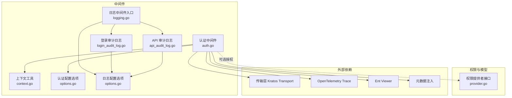
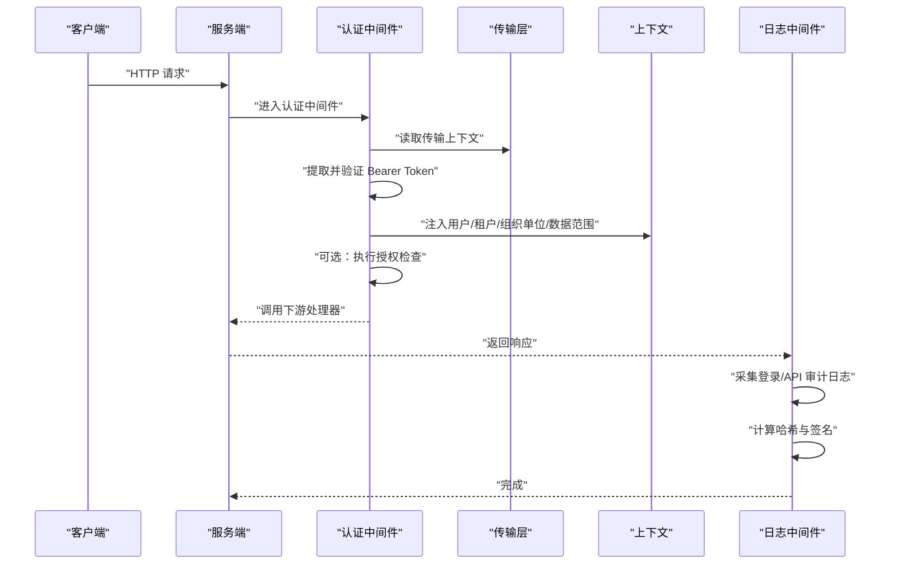
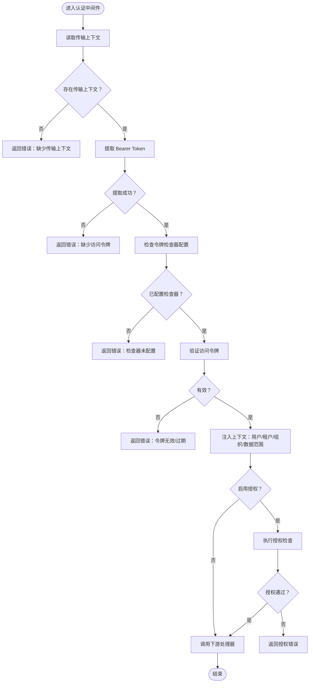
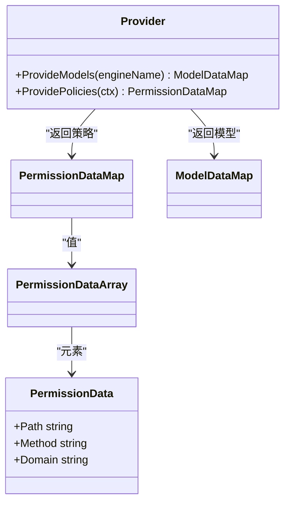
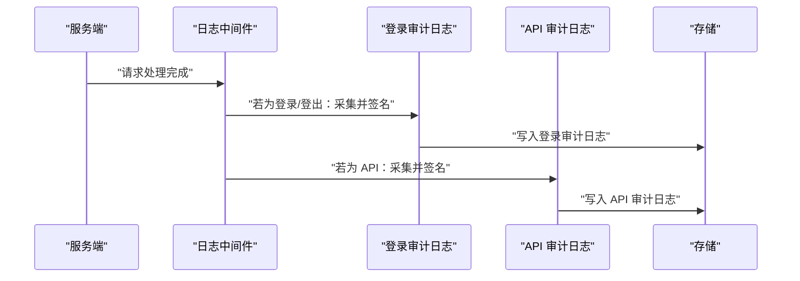
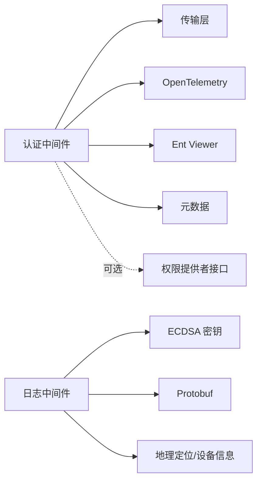

# 中间件安全

<cite>
**本文引用的文件**
- [auth.go](file://backend/pkg/middleware/auth/auth.go)
- [context.go](file://backend/pkg/middleware/auth/context.go)
- [options.go](file://backend/pkg/middleware/auth/options.go)
- [logging.go](file://backend/pkg/middleware/logging/logging.go)
- [login_audit_log.go](file://backend/pkg/middleware/logging/login_audit_log.go)
- [api_audit_log.go](file://backend/pkg/middleware/logging/api_audit_log.go)
- [options.go](file://backend/pkg/middleware/logging/options.go)
- [provider.go](file://backend/pkg/authorizer/provider.go)
</cite>

## 目录
1. [简介](#简介)
2. [项目结构](#项目结构)
3. [核心组件](#核心组件)
4. [架构总览](#架构总览)
5. [组件详解](#组件详解)
6. [依赖关系分析](#依赖关系分析)
7. [性能考量](#性能考量)
8. [故障排除指南](#故障排除指南)
9. [结论](#结论)
10. [附录](#附录)

## 简介
本文件面向中间件安全组件的实现与使用，聚焦以下方面：
- 认证中间件：请求拦截、Token 验证、用户上下文注入、错误处理
- 权限检查中间件：权限解析、RBAC 检查、访问控制决策、权限缓存
- 日志中间件：登录/API 审计日志、敏感信息处理、日志完整性校验与签名
- 安全过滤中间件：XSS、SQL 注入、CSRF、请求频率限制等（概念性说明）
- 配置选项与自定义扩展
- 性能优化与安全最佳实践
- 使用示例与故障排除

## 项目结构
中间件安全相关代码主要位于 backend/pkg/middleware 下，分为认证与日志两大模块，配合权限提供者接口与用户 Token 载荷类型。

图示来源
- [auth.go:1-122](file://backend/pkg/middleware/auth/auth.go#L1-L122)
- [context.go:1-26](file://backend/pkg/middleware/auth/context.go#L1-L26)
- [options.go:1-146](file://backend/pkg/middleware/auth/options.go#L1-L146)
- [logging.go:1-52](file://backend/pkg/middleware/logging/logging.go#L1-L52)
- [login_audit_log.go:1-364](file://backend/pkg/middleware/logging/login_audit_log.go#L1-L364)
- [api_audit_log.go:1-162](file://backend/pkg/middleware/logging/api_audit_log.go#L1-L162)
- [options.go:1-61](file://backend/pkg/middleware/logging/options.go#L1-L61)
- [provider.go:1-28](file://backend/pkg/authorizer/provider.go#L1-L28)

章节来源
- [auth.go:1-122](file://backend/pkg/middleware/auth/auth.go#L1-L122)
- [logging.go:1-52](file://backend/pkg/middleware/logging/logging.go#L1-L52)
- [provider.go:1-28](file://backend/pkg/authorizer/provider.go#L1-L28)

## 核心组件
- 认证中间件：负责从请求中提取并验证访问令牌，构建用户上下文，注入操作员/租户/组织单位/数据范围等信息，并可选执行授权检查。
- 权限提供者接口：抽象权限模型与策略的数据源，便于接入 RBAC/ABAC 等策略引擎。
- 日志中间件：在服务端统一采集登录与 API 请求的审计日志，计算哈希与签名，确保不可抵赖与完整性。

章节来源
- [auth.go:24-122](file://backend/pkg/middleware/auth/auth.go#L24-L122)
- [options.go:62-146](file://backend/pkg/middleware/auth/options.go#L62-L146)
- [provider.go:20-28](file://backend/pkg/authorizer/provider.go#L20-L28)
- [logging.go:14-52](file://backend/pkg/middleware/logging/logging.go#L14-L52)

## 架构总览
下图展示认证与日志中间件在一次请求中的协作流程。

图示来源
- [auth.go:38-120](file://backend/pkg/middleware/auth/auth.go#L38-L120)
- [logging.go:31-50](file://backend/pkg/middleware/logging/logging.go#L31-L50)
- [login_audit_log.go:39-114](file://backend/pkg/middleware/logging/login_audit_log.go#L39-L114)
- [api_audit_log.go:37-88](file://backend/pkg/middleware/logging/api_audit_log.go#L37-L88)

## 组件详解

### 认证中间件
职责与流程
- 请求拦截：从传输上下文中读取请求元信息。
- Token 验证：通过访问令牌检查器验证 Bearer Token 的有效性与黑名单状态。
- 上下文注入：将用户标识、租户、组织单位、数据范围等注入到上下文，并可选注入 Ent Viewer 与元数据。
- 授权检查：可选启用授权流程（如 RBAC），在上下文中进行访问控制决策。
- 错误处理：对缺失传输上下文、缺少或无效 Token、配置缺失等情况返回明确错误。

关键实现要点
- 令牌来源与格式：从元数据中提取 Bearer 类型 Token。
- 令牌检查器接口：支持自定义有效性和阻断逻辑，便于集成 Redis、数据库或远程校验。
- 上下文键：使用独立键保存用户载荷，避免冲突。
- 可选注入项：操作员 ID、租户 ID、Ent Viewer、元数据 OperatorMetadata。
- 授权开关：默认启用授权，可通过选项关闭。

图示来源
- [auth.go:38-120](file://backend/pkg/middleware/auth/auth.go#L38-L120)
- [context.go:15-25](file://backend/pkg/middleware/auth/context.go#L15-L25)
- [options.go:62-146](file://backend/pkg/middleware/auth/options.go#L62-L146)

章节来源
- [auth.go:24-122](file://backend/pkg/middleware/auth/auth.go#L24-L122)
- [context.go:1-26](file://backend/pkg/middleware/auth/context.go#L1-L26)
- [options.go:11-146](file://backend/pkg/middleware/auth/options.go#L11-L146)

### 权限检查中间件（RBAC/策略）
职责与流程
- 权限解析：从权限提供者接口获取策略与模型数据。
- RBAC 检查：基于路径、方法、域等维度进行访问控制决策。
- 权限缓存：可将策略与模型缓存以减少重复加载与计算开销。
- 访问控制决策：根据策略与当前用户上下文决定允许或拒绝。

图示来源
- [provider.go:5-28](file://backend/pkg/authorizer/provider.go#L5-L28)

章节来源
- [provider.go:1-28](file://backend/pkg/authorizer/provider.go#L1-L28)

### 日志中间件（审计日志）
职责与流程
- 登录审计日志：识别登录/登出操作，采集 IP、设备、地理位置、风险评分与因素、签名等。
- API 审计日志：记录 HTTP 方法、路径模板、请求体、响应状态、延迟、签名等。
- 完整性与不可否认：对日志进行 SHA256 哈希与 ECDSA 签名，排除签名与哈希字段参与确定性序列化。
- 写入与扩展：通过回调函数将日志持久化至存储系统。

图示来源
- [logging.go:31-50](file://backend/pkg/middleware/logging/logging.go#L31-L50)
- [login_audit_log.go:39-114](file://backend/pkg/middleware/logging/login_audit_log.go#L39-L114)
- [api_audit_log.go:37-88](file://backend/pkg/middleware/logging/api_audit_log.go#L37-L88)

章节来源
- [logging.go:14-52](file://backend/pkg/middleware/logging/logging.go#L14-L52)
- [login_audit_log.go:1-364](file://backend/pkg/middleware/logging/login_audit_log.go#L1-L364)
- [api_audit_log.go:1-162](file://backend/pkg/middleware/logging/api_audit_log.go#L1-L162)
- [options.go:13-61](file://backend/pkg/middleware/logging/options.go#L13-L61)

### 安全过滤中间件（概念性说明）
- XSS 防护：输入输出过滤与转义，白名单策略。
- SQL 注入防护：参数化查询、ORM 使用、动态 SQL 严格校验。
- CSRF 保护：同源校验、Token 校验、Samesite Cookie。
- 请求频率限制：基于 IP/用户/路由的限流策略。
- 敏感信息过滤：日志中脱敏手机号、身份证、密码等字段。
- 本仓库未提供具体实现文件，以上为通用安全实践建议。

## 依赖关系分析
- 认证中间件依赖传输层、OpenTelemetry、Ent Viewer、元数据模块以及权限提供者接口。
- 日志中间件依赖 ECDSA 密钥对、Protobuf 序列化、地理定位与设备信息采集能力。
- 权限提供者接口为策略引擎提供模型与策略数据，便于解耦与扩展。

图示来源
- [auth.go:38-120](file://backend/pkg/middleware/auth/auth.go#L38-L120)
- [logging.go:31-50](file://backend/pkg/middleware/logging/logging.go#L31-L50)
- [provider.go:20-28](file://backend/pkg/authorizer/provider.go#L20-L28)

章节来源
- [auth.go:1-122](file://backend/pkg/middleware/auth/auth.go#L1-L122)
- [logging.go:1-52](file://backend/pkg/middleware/logging/logging.go#L1-L52)
- [provider.go:1-28](file://backend/pkg/authorizer/provider.go#L1-L28)

## 性能考量
- 令牌验证：优先使用内存缓存与批量校验，避免频繁远程调用。
- 上下文注入：仅注入必要字段，减少上下文体积。
- 授权检查：策略与模型缓存、热点路径短路、预编译策略表达式。
- 日志签名：异步落库、批量化写入，避免阻塞主链路。
- 连接池与超时：合理设置数据库/缓存连接池与超时时间。
- 压测与监控：结合指标与追踪，定位瓶颈点。

## 故障排除指南
常见问题与排查步骤
- 缺少传输上下文
  - 现象：认证中间件直接返回错误。
  - 排查：确认服务端中间件注册顺序与传输适配器正确。
  - 参考
    - [auth.go:40-44](file://backend/pkg/middleware/auth/auth.go#L40-L44)
- 缺少或无效 Bearer Token
  - 现象：返回缺少访问令牌或令牌无效/过期错误。
  - 排查：确认客户端请求头携带格式正确的 Token；检查签发方与有效期。
  - 参考
    - [auth.go:46-61](file://backend/pkg/middleware/auth/auth.go#L46-L61)
- 令牌检查器未配置
  - 现象：返回检查器未配置错误。
  - 排查：初始化时注入 AccessTokenChecker 或使用工厂函数。
  - 参考
    - [auth.go:51-54](file://backend/pkg/middleware/auth/auth.go#L51-L54)
    - [options.go:79-90](file://backend/pkg/middleware/auth/options.go#L79-L90)
- 上下文注入失败
  - 现象：后续处理器无法读取用户信息。
  - 排查：确认注入开关开启，检查 Token 载荷字段完整性。
  - 参考
    - [auth.go:63-108](file://backend/pkg/middleware/auth/auth.go#L63-L108)
    - [context.go:15-25](file://backend/pkg/middleware/auth/context.go#L15-L25)
- 授权未生效
  - 现象：未执行授权或授权异常。
  - 排查：确认 enableAuthz 开关、权限提供者实现与策略数据。
  - 参考
    - [auth.go:110-116](file://backend/pkg/middleware/auth/auth.go#L110-L116)
    - [options.go:133-138](file://backend/pkg/middleware/auth/options.go#L133-L138)
    - [provider.go:20-28](file://backend/pkg/authorizer/provider.go#L20-L28)
- 日志签名失败
  - 现象：日志缺少签名或哈希计算异常。
  - 排查：确认 ECDSA 私钥/公钥配置、序列化一致性。
  - 参考
    - [login_audit_log.go:118-190](file://backend/pkg/middleware/logging/login_audit_log.go#L118-L190)
    - [api_audit_log.go:90-161](file://backend/pkg/middleware/logging/api_audit_log.go#L90-L161)
    - [options.go:50-60](file://backend/pkg/middleware/logging/options.go#L50-L60)

章节来源
- [auth.go:38-120](file://backend/pkg/middleware/auth/auth.go#L38-L120)
- [context.go:15-25](file://backend/pkg/middleware/auth/context.go#L15-L25)
- [options.go:79-146](file://backend/pkg/middleware/auth/options.go#L79-L146)
- [login_audit_log.go:118-190](file://backend/pkg/middleware/logging/login_audit_log.go#L118-L190)
- [api_audit_log.go:90-161](file://backend/pkg/middleware/logging/api_audit_log.go#L90-L161)
- [options.go:50-60](file://backend/pkg/middleware/logging/options.go#L50-L60)

## 结论
本中间件安全体系通过认证中间件实现严格的请求拦截与上下文注入，结合可插拔的权限提供者接口实现灵活的 RBAC/策略控制；日志中间件提供完整的审计能力与不可抵赖性保障。通过合理的配置与扩展，可在保证安全性的同时兼顾性能与可观测性。

## 附录

### 配置选项与自定义扩展
- 认证中间件
  - WithAccessTokenChecker：注入自定义令牌检查器
  - WithEnableCheckRefreshTokenExpiration：启用刷新令牌过期检查
  - WithEnableCheckScopes：启用作用域检查
  - WithInjectOperatorId/WithInjectTenantId：注入操作员/租户 ID
  - WithInjectEnt：注入 Ent Viewer
  - WithInjectMetadata：注入元数据
  - WithEnableAuthority：启用授权
  - WithLogger：自定义日志记录器
  - 参考
    - [options.go:79-146](file://backend/pkg/middleware/auth/options.go#L79-L146)
- 日志中间件
  - WithWriteApiLogFunc/WithWriteLoginLogFunc：设置写入回调
  - WithLoginOperation/WithLogoutOperation：指定登录/登出操作名
  - WithECPrivateKey/WithECPublicKey：配置 ECDSA 密钥
  - 参考
    - [options.go:26-61](file://backend/pkg/middleware/logging/options.go#L26-L61)

### 使用示例（步骤说明）
- 认证中间件
  - 初始化 AccessTokenChecker（本地校验或远程校验）
  - 在服务端注册认证中间件，按需开启注入与授权
  - 在下游处理器中通过上下文读取用户信息
  - 参考
    - [auth.go:24-122](file://backend/pkg/middleware/auth/auth.go#L24-L122)
    - [context.go:15-25](file://backend/pkg/middleware/auth/context.go#L15-L25)
- 日志中间件
  - 实现写入回调函数，将审计日志持久化
  - 配置 ECDSA 密钥对，确保签名可用
  - 注册日志中间件，自动采集登录与 API 日志
  - 参考
    - [logging.go:14-52](file://backend/pkg/middleware/logging/logging.go#L14-L52)
    - [login_audit_log.go:39-114](file://backend/pkg/middleware/logging/login_audit_log.go#L39-L114)
    - [api_audit_log.go:37-88](file://backend/pkg/middleware/logging/api_audit_log.go#L37-L88)