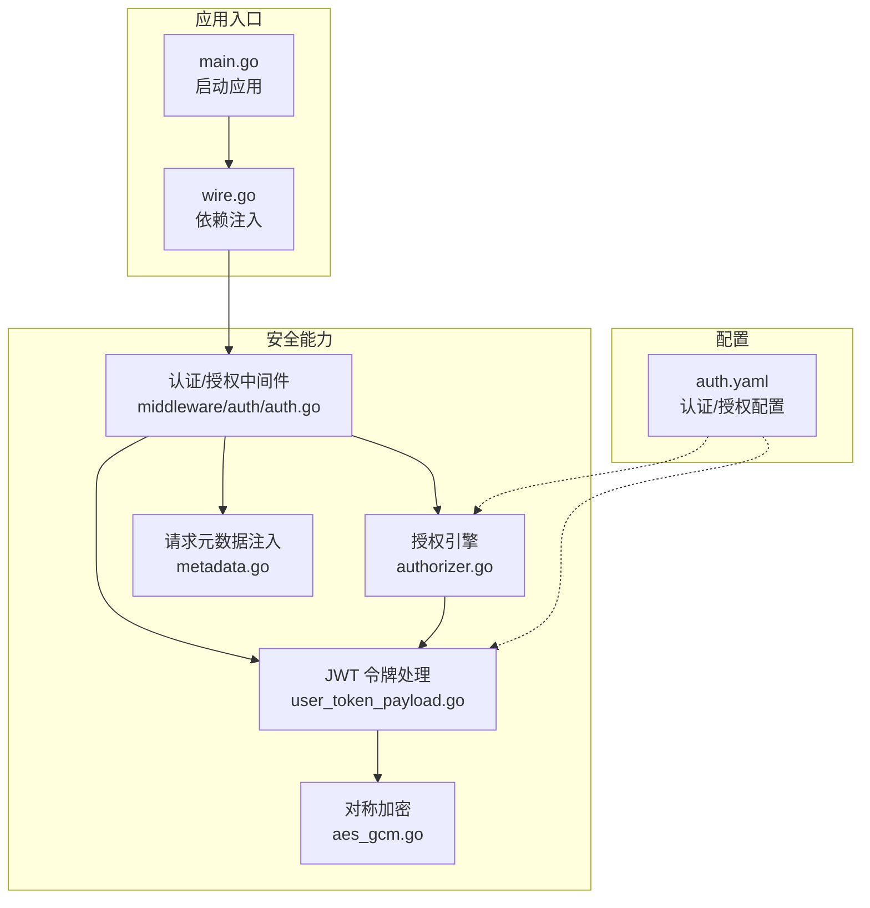
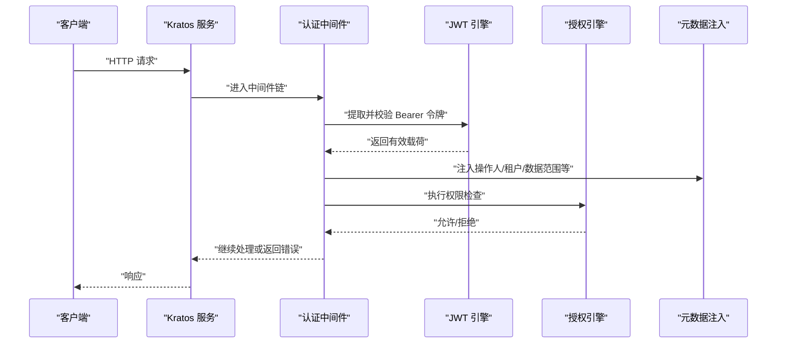
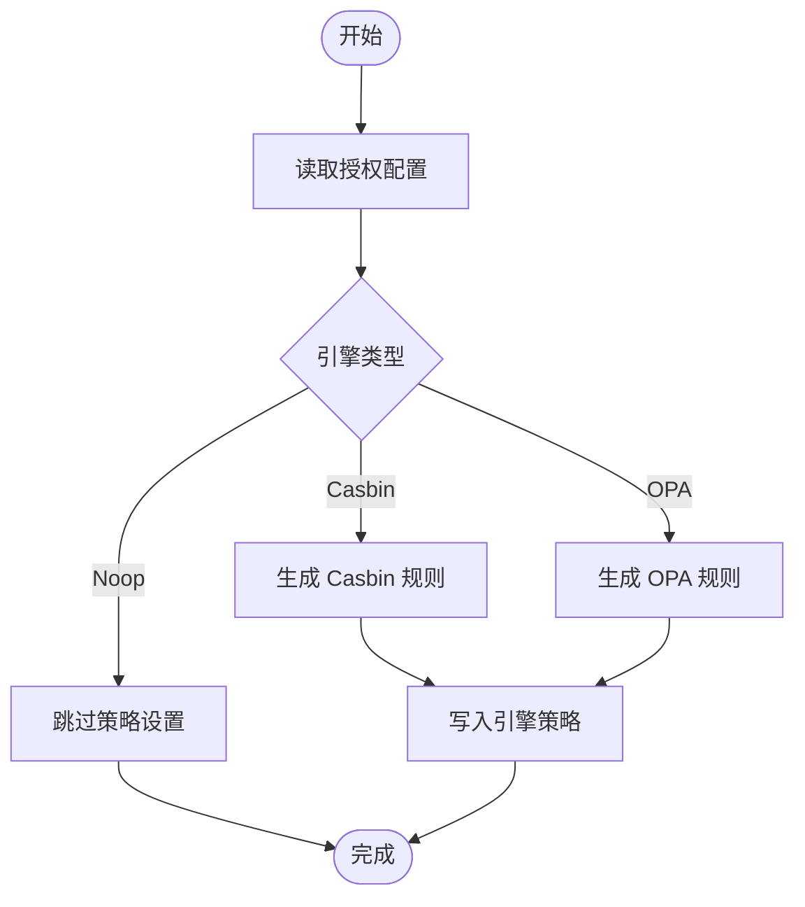
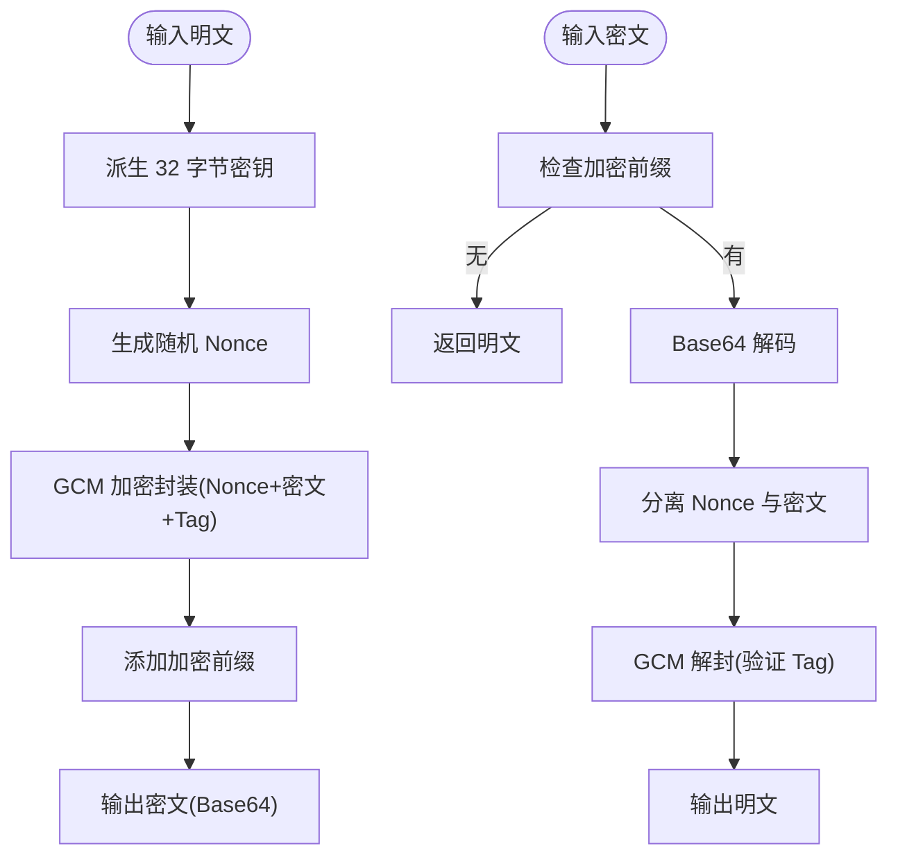
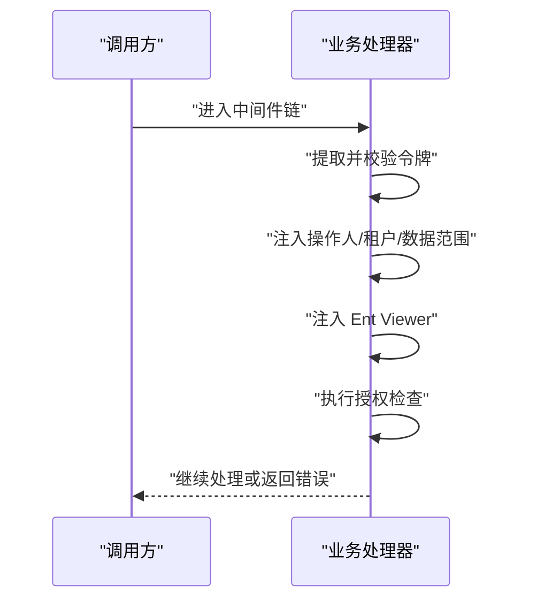
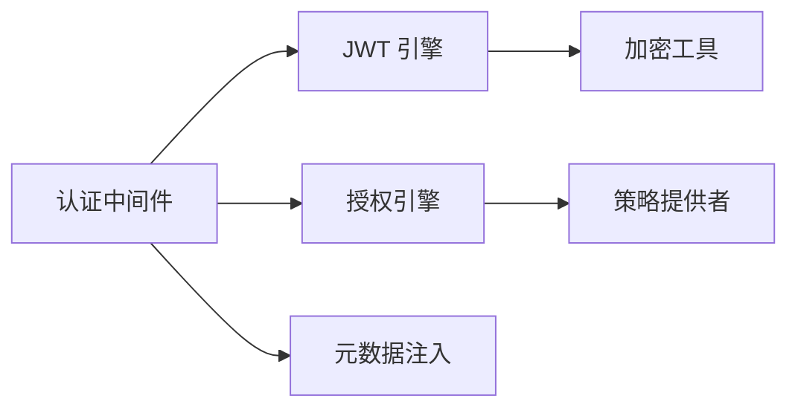

# 安全设计

<cite>
**本文引用的文件**
- [backend/app/admin/service/cmd/server/main.go](file://backend/app/admin/service/cmd/server/main.go)
- [backend/app/admin/service/cmd/server/wire.go](file://backend/app/admin/service/cmd/server/wire.go)
- [backend/app/admin/service/configs/auth.yaml](file://backend/app/admin/service/configs/auth.yaml)
- [backend/pkg/crypto/aes_gcm.go](file://backend/pkg/crypto/aes_gcm.go)
- [backend/pkg/jwt/user_token_payload.go](file://backend/pkg/jwt/user_token_payload.go)
- [backend/pkg/authorizer/authorizer.go](file://backend/pkg/authorizer/authorizer.go)
- [backend/pkg/authorizer/provider.go](file://backend/pkg/authorizer/provider.go)
- [backend/pkg/middleware/auth/auth.go](file://backend/pkg/middleware/auth/auth.go)
- [backend/pkg/middleware/auth/options.go](file://backend/pkg/middleware/auth/options.go)
- [backend/pkg/metadata/metadata.go](file://backend/pkg/metadata/metadata.go)
- [backend/pkg/metadata/errors.go](file://backend/pkg/metadata/errors.go)
</cite>

## 目录
1. [引言](#引言)
2. [项目结构](#项目结构)
3. [核心组件](#核心组件)
4. [架构总览](#架构总览)
5. [详细组件分析](#详细组件分析)
6. [依赖关系分析](#依赖关系分析)
7. [性能考虑](#性能考虑)
8. [故障排查指南](#故障排查指南)
9. [结论](#结论)
10. [附录](#附录)

## 引言
本文件面向 GoWind Admin 后端服务，提供一套系统化的安全设计文档，覆盖认证与授权、数据安全、中间件安全组件、安全配置与最佳实践。内容基于仓库现有实现进行提炼与可视化说明，帮助开发者在不改变既有架构的前提下，进一步强化系统的安全性与可维护性。

## 项目结构
后端采用 Kratos 微服务框架，通过引导器初始化应用，统一注入 HTTP、任务队列与 SSE 服务；安全相关能力分布在独立包中，包括认证 JWT、授权引擎（Casbin/OPA/Noop）、加密工具、元数据注入与中间件等。



图示来源
- [backend/app/admin/service/cmd/server/main.go:1-76](file://backend/app/admin/service/cmd/server/main.go#L1-L76)
- [backend/app/admin/service/cmd/server/wire.go:1-47](file://backend/app/admin/service/cmd/server/wire.go#L1-L47)
- [backend/app/admin/service/configs/auth.yaml:1-37](file://backend/app/admin/service/configs/auth.yaml#L1-L37)
- [backend/pkg/jwt/user_token_payload.go:1-279](file://backend/pkg/jwt/user_token_payload.go#L1-L279)
- [backend/pkg/authorizer/authorizer.go:1-241](file://backend/pkg/authorizer/authorizer.go#L1-L241)
- [backend/pkg/middleware/auth/auth.go:1-122](file://backend/pkg/middleware/auth/auth.go#L1-L122)
- [backend/pkg/metadata/metadata.go](file://backend/pkg/metadata/metadata.go)

章节来源
- [backend/app/admin/service/cmd/server/main.go:1-76](file://backend/app/admin/service/cmd/server/main.go#L1-L76)
- [backend/app/admin/service/cmd/server/wire.go:1-47](file://backend/app/admin/service/cmd/server/wire.go#L1-L47)
- [backend/app/admin/service/configs/auth.yaml:1-37](file://backend/app/admin/service/configs/auth.yaml#L1-L37)

## 核心组件
- 认证与令牌
  - JWT 载荷与声明：定义用户身份、租户、角色、设备、客户端、数据范围等字段，并提供过期与未生效判断。
  - 令牌校验：中间件从请求元数据提取 Bearer 令牌并调用访问令牌检查器进行有效性校验。
- 授权与策略
  - 授权引擎：支持 Noop、Casbin、OPA 等后端，动态加载策略并执行访问控制。
  - 策略提供者：从数据源获取角色-接口映射，生成对应引擎的策略规则。
- 数据安全
  - 对称加密：AES-256-GCM 实现密钥派生、随机 Nonce、认证标签，提供加解密与前缀标识。
- 中间件与元数据
  - 认证中间件：注入操作人、租户、组织单元、数据范围、Ent Viewer、OpenTelemetry TraceID 等上下文信息。
  - 请求元数据：封装 OperatorMetadata，便于下游服务使用。

章节来源
- [backend/pkg/jwt/user_token_payload.go:1-279](file://backend/pkg/jwt/user_token_payload.go#L1-L279)
- [backend/pkg/middleware/auth/auth.go:1-122](file://backend/pkg/middleware/auth/auth.go#L1-L122)
- [backend/pkg/authorizer/authorizer.go:1-241](file://backend/pkg/authorizer/authorizer.go#L1-L241)
- [backend/pkg/crypto/aes_gcm.go:1-154](file://backend/pkg/crypto/aes_gcm.go#L1-L154)
- [backend/pkg/metadata/metadata.go](file://backend/pkg/metadata/metadata.go)

## 架构总览
下图展示从请求进入服务端到完成认证与授权的整体流程，以及与加密、元数据注入的关系。



图示来源
- [backend/pkg/middleware/auth/auth.go:1-122](file://backend/pkg/middleware/auth/auth.go#L1-L122)
- [backend/pkg/jwt/user_token_payload.go:1-279](file://backend/pkg/jwt/user_token_payload.go#L1-L279)
- [backend/pkg/authorizer/authorizer.go:1-241](file://backend/pkg/authorizer/authorizer.go#L1-L241)
- [backend/pkg/metadata/metadata.go](file://backend/pkg/metadata/metadata.go)

## 详细组件分析

### 认证与 JWT 管理
- 令牌载荷与声明
  - 定义用户名、用户ID、租户ID、角色码、数据范围、组织单元ID、设备ID、客户端ID等字段。
  - 提供从 JWT MapClaims 或 AuthClaims 反序列化载荷的方法。
  - 内置过期与未生效时间判断，考虑默认时间容差以避免时钟偏差。
- 令牌生命周期
  - 默认访问令牌有效期与刷新令牌有效期常量定义，便于集中管理。
- 与中间件协作
  - 中间件从请求上下文中提取 Bearer 令牌，调用访问令牌检查器进行校验，校验通过后将载荷注入上下文。

```mermaid
classDiagram
class UserTokenPayload {
+string Username
+uint32 UserId
+uint32 TenantId
+[]string Roles
+DataScope DataScope
+string DeviceId
+string ClientId
+uint32 OrgUnitId
}
class AuthClaims {
+string Subject
+int64 IssuedAt
+int64 ExpirationTime
+string JwtID
+map[string]interface{} Claims
}
class JWTUtil {
+NewUserTokenPayload(...)
+NewUserTokenAuthClaims(...)
+NewUserTokenPayloadWithClaims(...)
+IsTokenExpired(...)
+IsTokenNotValidYet(...)
}
JWTUtil --> UserTokenPayload : "构造/解析"
JWTUtil --> AuthClaims : "生成声明"
```

图示来源
- [backend/pkg/jwt/user_token_payload.go:17-100](file://backend/pkg/jwt/user_token_payload.go#L17-L100)
- [backend/pkg/jwt/user_token_payload.go:102-182](file://backend/pkg/jwt/user_token_payload.go#L102-L182)
- [backend/pkg/jwt/user_token_payload.go:184-246](file://backend/pkg/jwt/user_token_payload.go#L184-L246)
- [backend/pkg/jwt/user_token_payload.go:248-279](file://backend/pkg/jwt/user_token_payload.go#L248-L279)

章节来源
- [backend/pkg/jwt/user_token_payload.go:1-279](file://backend/pkg/jwt/user_token_payload.go#L1-L279)
- [backend/pkg/middleware/auth/auth.go:38-121](file://backend/pkg/middleware/auth/auth.go#L38-L121)

### 授权与 RBAC/策略引擎
- 引擎选择与初始化
  - 支持 Noop、Casbin、OPA、Zanzibar（预留）等引擎类型，依据配置动态创建。
  - OPA 引擎加载自定义模型文件，确保策略语言与业务一致。
- 策略生成
  - Casbin：将角色-接口映射转换为 p 规则（角色、路径、方法、域）。
  - OPA：将角色-接口映射转换为 JSON 结构，便于 Rego 模块评估。
- 策略注入
  - 通过 Provider 获取策略数据，写入所选引擎，实现热更新与集中管理。



图示来源
- [backend/pkg/authorizer/authorizer.go:50-109](file://backend/pkg/authorizer/authorizer.go#L50-L109)
- [backend/pkg/authorizer/authorizer.go:111-160](file://backend/pkg/authorizer/authorizer.go#L111-L160)
- [backend/pkg/authorizer/authorizer.go:162-240](file://backend/pkg/authorizer/authorizer.go#L162-L240)

章节来源
- [backend/pkg/authorizer/authorizer.go:1-241](file://backend/pkg/authorizer/authorizer.go#L1-L241)
- [backend/pkg/authorizer/provider.go](file://backend/pkg/authorizer/provider.go)

### 数据安全与加密
- 对称加密（AES-256-GCM）
  - 密钥派生：输入任意长度密钥经哈希得到固定 32 字节密钥。
  - 加密：随机 Nonce + GCM 认证标签，输出带前缀的 Base64 文本。
  - 解密：校验前缀、Base64 解码、分离 Nonce 与密文、验证认证标签。
  - 前向兼容：未加密数据直接返回，便于迁移。
- 使用建议
  - 密钥管理：通过环境变量或密钥管理服务注入，避免硬编码。
  - 存储策略：敏感字段在入库前加密，读取时解密；日志与审计避免泄露明文。



图示来源
- [backend/pkg/crypto/aes_gcm.go:33-78](file://backend/pkg/crypto/aes_gcm.go#L33-L78)
- [backend/pkg/crypto/aes_gcm.go:82-130](file://backend/pkg/crypto/aes_gcm.go#L82-L130)

章节来源
- [backend/pkg/crypto/aes_gcm.go:1-154](file://backend/pkg/crypto/aes_gcm.go#L1-L154)

### 中间件安全组件
- 认证中间件职责
  - 提取 Bearer 令牌并校验有效性。
  - 注入操作人ID、租户ID、组织单元ID、数据范围、OpenTelemetry TraceID。
  - 注入 Ent Viewer，实现数据级访问控制（结合数据范围与组织单元）。
  - 执行授权检查（可配置启用/禁用）。
- 配置项
  - 可选注入操作人ID/租户ID、启用/禁用授权检查、注入 Ent Viewer、注入元数据。
  - 通过选项函数进行灵活配置。



图示来源
- [backend/pkg/middleware/auth/auth.go:24-121](file://backend/pkg/middleware/auth/auth.go#L24-L121)
- [backend/pkg/middleware/auth/options.go](file://backend/pkg/middleware/auth/options.go)

章节来源
- [backend/pkg/middleware/auth/auth.go:1-122](file://backend/pkg/middleware/auth/auth.go#L1-L122)
- [backend/pkg/middleware/auth/options.go](file://backend/pkg/middleware/auth/options.go)

### 元数据与上下文注入
- OperatorMetadata
  - 封装当前请求的操作人、租户、组织单元、数据范围等，便于日志、审计与策略评估。
- 上下文注入
  - 中间件将 OperatorMetadata 注入请求上下文，下游服务可直接读取。
- 错误处理
  - 提供错误类型与辅助方法，便于定位注入失败原因。

章节来源
- [backend/pkg/metadata/metadata.go](file://backend/pkg/metadata/metadata.go)
- [backend/pkg/metadata/errors.go](file://backend/pkg/metadata/errors.go)

## 依赖关系分析
- 组件耦合
  - 中间件依赖认证引擎与授权引擎；授权引擎依赖策略提供者；JWT 工具与授权引擎相互配合。
  - 加密模块与业务数据存储解耦，通过统一接口进行加解密。
- 外部依赖
  - 认证/授权引擎通过配置切换（Noop/Casbin/OPA/Zanzibar），便于在开发/生产环境之间快速切换。
- 潜在风险
  - 若访问令牌检查器未正确配置，中间件将直接拒绝请求。
  - 授权引擎未加载策略或策略为空时，可能导致“放行”风险。



图示来源
- [backend/pkg/middleware/auth/auth.go:1-122](file://backend/pkg/middleware/auth/auth.go#L1-L122)
- [backend/pkg/authorizer/authorizer.go:1-241](file://backend/pkg/authorizer/authorizer.go#L1-L241)
- [backend/pkg/jwt/user_token_payload.go:1-279](file://backend/pkg/jwt/user_token_payload.go#L1-L279)
- [backend/pkg/crypto/aes_gcm.go:1-154](file://backend/pkg/crypto/aes_gcm.go#L1-L154)
- [backend/pkg/metadata/metadata.go](file://backend/pkg/metadata/metadata.go)

章节来源
- [backend/pkg/authorizer/authorizer.go:1-241](file://backend/pkg/authorizer/authorizer.go#L1-L241)
- [backend/pkg/middleware/auth/auth.go:1-122](file://backend/pkg/middleware/auth/auth.go#L1-L122)

## 性能考虑
- 令牌校验成本
  - JWT 校验为 CPU 密集型操作，建议缓存近期常用令牌的校验结果（需自行扩展）。
- 授权检查
  - Casbin/OPA 的策略匹配应尽量简化规则，避免复杂通配与深层嵌套。
- 加密开销
  - AES-256-GCM 在现代 CPU 上性能良好，但频繁加解密仍需注意批量处理与缓存。
- 中间件链路
  - 减少不必要的上下文注入与日志记录，避免在高并发场景放大延迟。

## 故障排查指南
- 常见错误与定位
  - 缺失 Bearer 令牌：中间件会在缺少令牌时直接返回错误，检查客户端是否正确携带 Authorization 头。
  - 令牌无效/过期：确认 JWT 密钥、签名算法与过期时间配置一致；核对服务器时间同步。
  - 访问令牌检查器未配置：中间件会提示检查器未配置，检查初始化流程与配置文件。
  - 授权策略未生效：确认策略提供者已返回数据，且授权引擎已成功写入策略。
  - 加密失败：检查密钥长度与格式，确认密文前缀与 Base64 编码正确。
- 日志与追踪
  - 中间件与授权引擎均输出详细日志，结合 OpenTelemetry TraceID 定位请求链路。

章节来源
- [backend/pkg/middleware/auth/auth.go:46-61](file://backend/pkg/middleware/auth/auth.go#L46-L61)
- [backend/pkg/authorizer/authorizer.go:50-109](file://backend/pkg/authorizer/authorizer.go#L50-L109)
- [backend/pkg/crypto/aes_gcm.go:20-24](file://backend/pkg/crypto/aes_gcm.go#L20-L24)

## 结论
本设计在不破坏现有架构的前提下，提供了清晰的认证、授权、数据安全与中间件安全组件边界。通过可插拔的授权引擎与严格的令牌校验流程，系统具备良好的扩展性与安全性。建议在生产环境中完善密钥管理、策略热更新与审计日志，持续提升整体安全水平。

## 附录

### 安全配置指南（基于现有配置）
- 认证配置
  - 类型：JWT
  - 算法：HS256（示例配置）
  - 密钥：请替换为强随机密钥，避免硬编码
- 授权配置
  - 类型：noop（开发环境）
  - 生产建议：Casbin 或 OPA，结合策略提供者实现细粒度控制
- HTTPS 与安全头
  - 本仓库未包含具体 HTTPS/CORS/安全头配置文件，请在网关或反向代理层统一配置，确保：
    - 强 TLS 版本与密码套件
    - 启用 HSTS、X-Content-Type-Options、X-Frame-Options、Referrer-Policy 等
    - CORS 仅开放必要域名与方法
- 多因素认证（MFA）
  - 当前仓库未内置 MFA 流程，可在登录流程中集成一次性验证码或硬件令牌，并在 JWT 中附加 MFA 状态字段，由中间件与授权引擎共同决策。

章节来源
- [backend/app/admin/service/configs/auth.yaml:1-37](file://backend/app/admin/service/configs/auth.yaml#L1-L37)