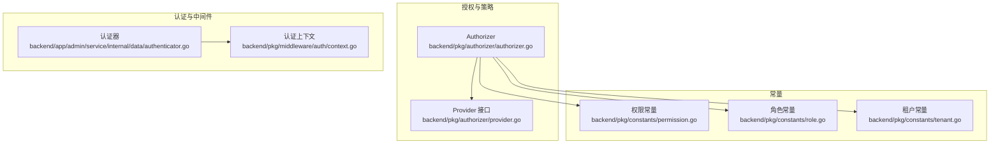
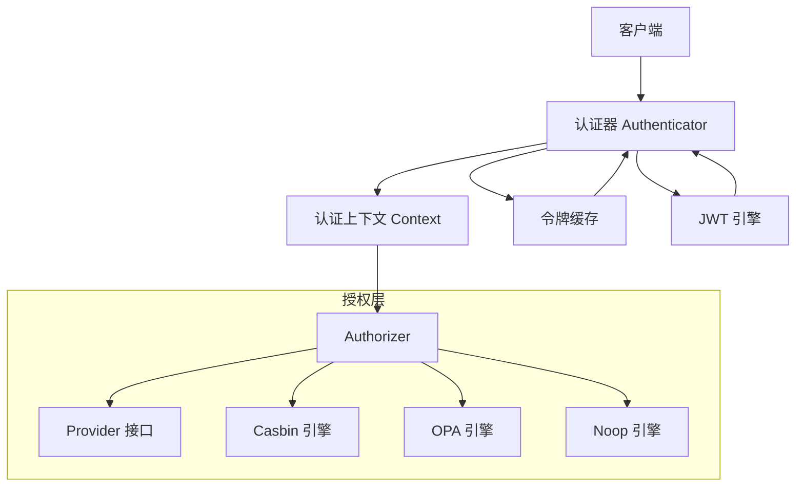
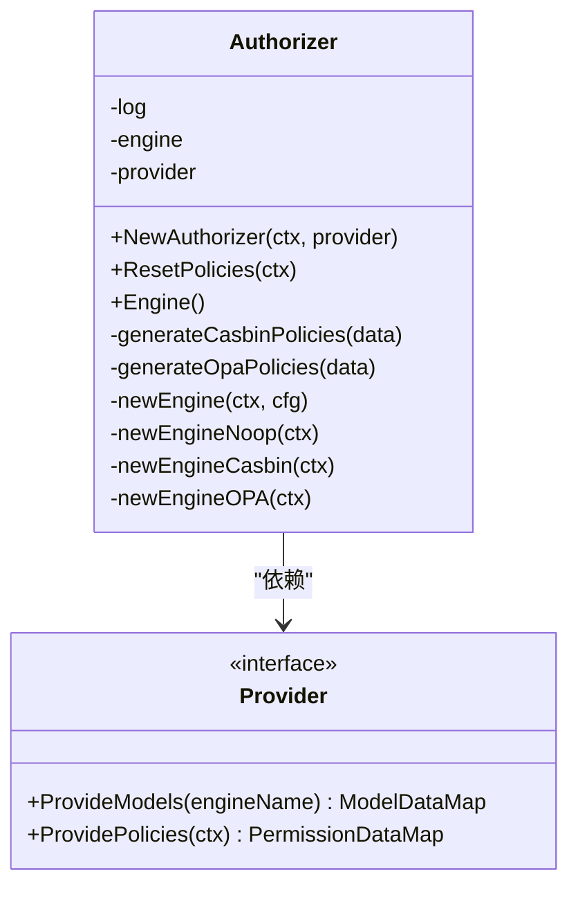
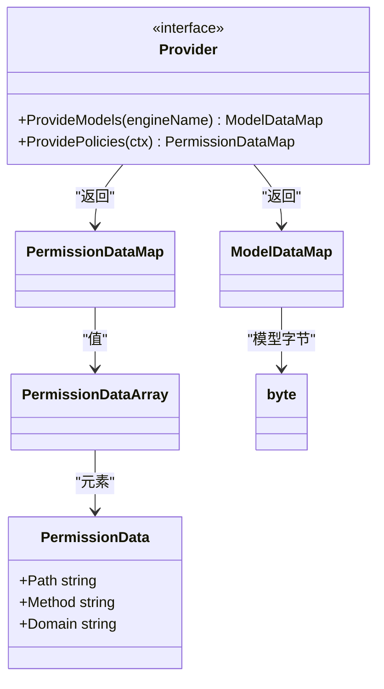
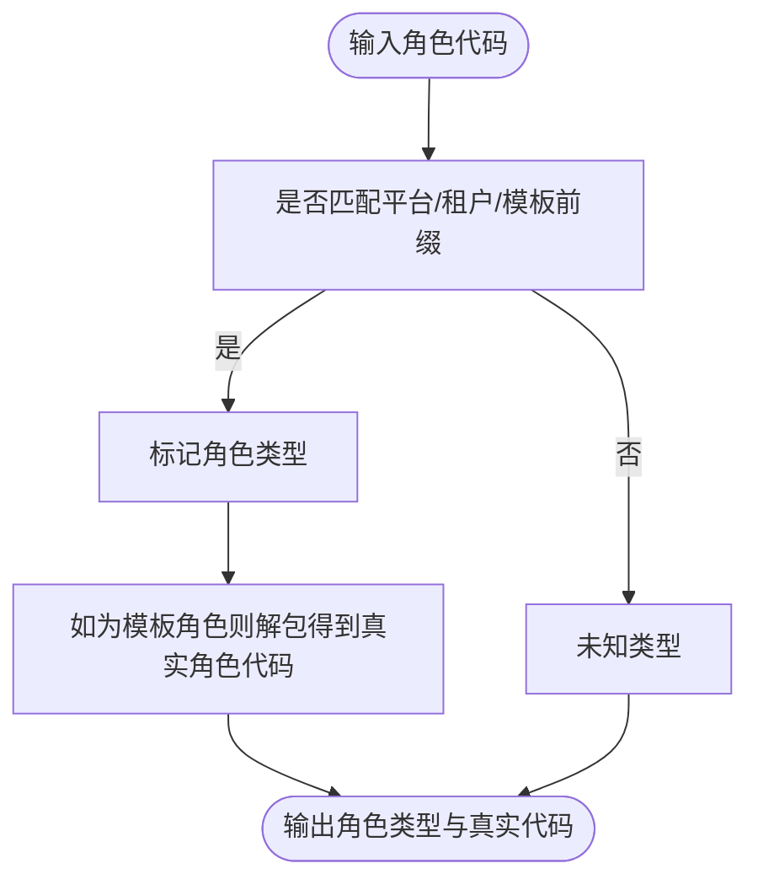
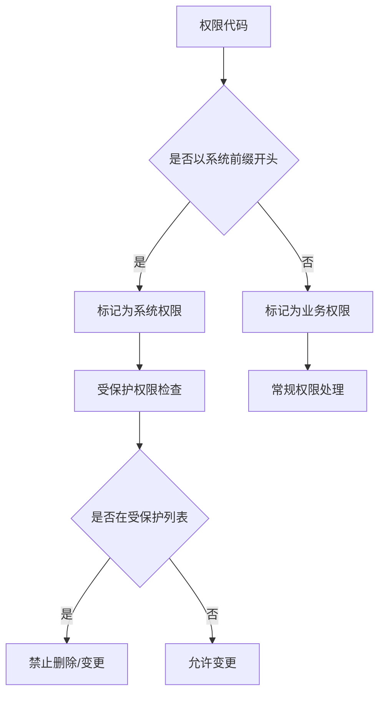
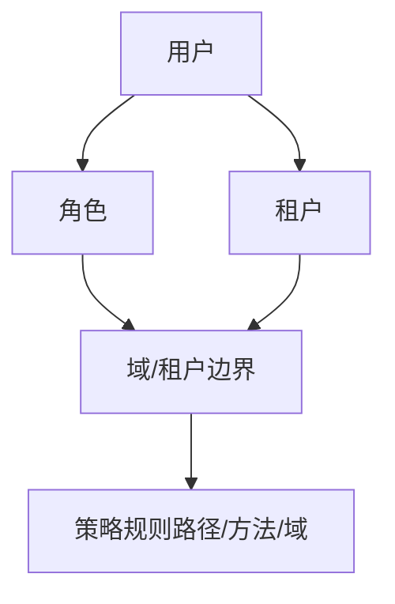
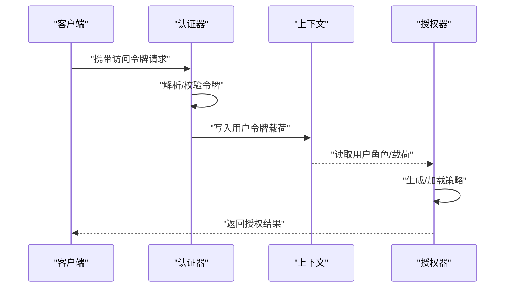
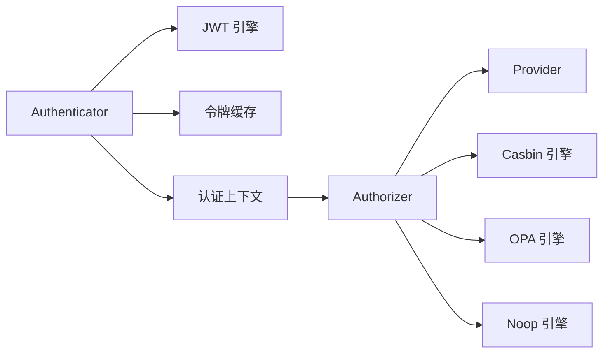

# 授权安全

<cite>
**本文引用的文件**
- [backend/pkg/authorizer/authorizer.go](file://backend/pkg/authorizer/authorizer.go)
- [backend/pkg/authorizer/provider.go](file://backend/pkg/authorizer/provider.go)
- [backend/pkg/constants/permission.go](file://backend/pkg/constants/permission.go)
- [backend/pkg/constants/role.go](file://backend/pkg/constants/role.go)
- [backend/pkg/constants/tenant.go](file://backend/pkg/constants/tenant.go)
- [backend/pkg/middleware/auth/context.go](file://backend/pkg/middleware/auth/context.go)
- [backend/app/admin/service/internal/data/authenticator.go](file://backend/app/admin/service/internal/data/authenticator.go)
</cite>

## 目录
1. [简介](#简介)
2. [项目结构](#项目结构)
3. [核心组件](#核心组件)
4. [架构总览](#架构总览)
5. [详细组件分析](#详细组件分析)
6. [依赖分析](#依赖分析)
7. [性能考虑](#性能考虑)
8. [故障排查指南](#故障排查指南)
9. [结论](#结论)
10. [附录](#附录)

## 简介
本文件面向授权安全模块，系统性阐述基于 RBAC 的权限控制模型在本项目中的实现方式，覆盖角色定义、权限分配、继承关系、数据权限隔离、接口权限验证、资源访问控制策略、权限缓存与性能优化、最佳实践与审计建议，并提供架构设计图与实现代码示例路径。

## 项目结构
围绕授权与安全的关键目录与文件如下：
- 授权引擎与策略加载：backend/pkg/authorizer
- 常量定义（权限、角色、租户）：backend/pkg/constants
- 认证上下文与令牌校验：backend/pkg/middleware/auth
- 认证服务与令牌缓存：backend/app/admin/service/internal/data

图表来源
- [backend/pkg/authorizer/authorizer.go:1-241](file://backend/pkg/authorizer/authorizer.go#L1-L241)
- [backend/pkg/authorizer/provider.go:1-28](file://backend/pkg/authorizer/provider.go#L1-L28)
- [backend/pkg/constants/permission.go:1-39](file://backend/pkg/constants/permission.go#L1-L39)
- [backend/pkg/constants/role.go:1-49](file://backend/pkg/constants/role.go#L1-L49)
- [backend/pkg/constants/tenant.go:1-25](file://backend/pkg/constants/tenant.go#L1-L25)
- [backend/app/admin/service/internal/data/authenticator.go:1-440](file://backend/app/admin/service/internal/data/authenticator.go#L1-L440)
- [backend/pkg/middleware/auth/context.go:1-26](file://backend/pkg/middleware/auth/context.go#L1-L26)

章节来源
- [backend/pkg/authorizer/authorizer.go:1-241](file://backend/pkg/authorizer/authorizer.go#L1-L241)
- [backend/pkg/authorizer/provider.go:1-28](file://backend/pkg/authorizer/provider.go#L1-L28)
- [backend/pkg/constants/permission.go:1-39](file://backend/pkg/constants/permission.go#L1-L39)
- [backend/pkg/constants/role.go:1-49](file://backend/pkg/constants/role.go#L1-L49)
- [backend/pkg/constants/tenant.go:1-25](file://backend/pkg/constants/tenant.go#L1-L25)
- [backend/app/admin/service/internal/data/authenticator.go:1-440](file://backend/app/admin/service/internal/data/authenticator.go#L1-L440)
- [backend/pkg/middleware/auth/context.go:1-26](file://backend/pkg/middleware/auth/context.go#L1-L26)

## 核心组件
- 授权器（Authorizer）：负责根据配置选择授权引擎（Casbin/OPA/Noop），从 Provider 加载策略与模型，生成并注入策略规则。
- Provider 接口：抽象策略与模型提供者，支持不同引擎的策略格式转换。
- 常量模块：统一管理权限代码前缀、受保护权限列表、角色前缀与识别逻辑、租户模式与关系类型。
- 认证器（Authenticator）：基于 JWT 的令牌签发、校验、撤销与封禁，结合缓存进行有效性检查。
- 认证上下文：在请求上下文中传递用户令牌载荷，便于后续授权与审计。

章节来源
- [backend/pkg/authorizer/authorizer.go:18-109](file://backend/pkg/authorizer/authorizer.go#L18-L109)
- [backend/pkg/authorizer/provider.go:20-27](file://backend/pkg/authorizer/provider.go#L20-L27)
- [backend/pkg/constants/permission.go:3-39](file://backend/pkg/constants/permission.go#L3-L39)
- [backend/pkg/constants/role.go:3-49](file://backend/pkg/constants/role.go#L3-L49)
- [backend/pkg/constants/tenant.go:3-25](file://backend/pkg/constants/tenant.go#L3-L25)
- [backend/app/admin/service/internal/data/authenticator.go:30-58](file://backend/app/admin/service/internal/data/authenticator.go#L30-L58)
- [backend/pkg/middleware/auth/context.go:15-25](file://backend/pkg/middleware/auth/context.go#L15-L25)

## 架构总览
下图展示授权与认证在系统中的交互关系：认证器负责令牌生命周期与有效性校验，授权器负责策略加载与执行，Provider 抽象策略与模型来源，常量模块提供统一的权限/角色/租户语义。

图表来源
- [backend/app/admin/service/internal/data/authenticator.go:30-58](file://backend/app/admin/service/internal/data/authenticator.go#L30-L58)
- [backend/pkg/middleware/auth/context.go:15-25](file://backend/pkg/middleware/auth/context.go#L15-L25)
- [backend/pkg/authorizer/authorizer.go:50-109](file://backend/pkg/authorizer/authorizer.go#L50-L109)
- [backend/pkg/authorizer/authorizer.go:162-183](file://backend/pkg/authorizer/authorizer.go#L162-L183)
- [backend/pkg/authorizer/authorizer.go:190-240](file://backend/pkg/authorizer/authorizer.go#L190-L240)
- [backend/pkg/authorizer/provider.go:20-27](file://backend/pkg/authorizer/provider.go#L20-L27)

## 详细组件分析

### 授权器（RBAC 策略加载与引擎选择）
- 引擎选择：根据配置类型选择 Noop/Casbin/OPA/Zanzibar，默认回退到 Noop。
- 策略生成：
  - Casbin：将角色-接口路径-方法-域映射为策略规则集。
  - OPA：将角色映射为路径+方法的白名单集合。
- 策略注入：通过引擎 SetPolicies 写入策略存储。
- 模型加载：OPA 引擎从 Provider 提供的模型字节中加载指定模型。

图表来源
- [backend/pkg/authorizer/authorizer.go:18-109](file://backend/pkg/authorizer/authorizer.go#L18-L109)
- [backend/pkg/authorizer/authorizer.go:111-160](file://backend/pkg/authorizer/authorizer.go#L111-L160)
- [backend/pkg/authorizer/authorizer.go:162-240](file://backend/pkg/authorizer/authorizer.go#L162-L240)
- [backend/pkg/authorizer/provider.go:20-27](file://backend/pkg/authorizer/provider.go#L20-L27)

章节来源
- [backend/pkg/authorizer/authorizer.go:50-109](file://backend/pkg/authorizer/authorizer.go#L50-L109)
- [backend/pkg/authorizer/authorizer.go:111-160](file://backend/pkg/authorizer/authorizer.go#L111-L160)
- [backend/pkg/authorizer/authorizer.go:162-240](file://backend/pkg/authorizer/authorizer.go#L162-L240)
- [backend/pkg/authorizer/provider.go:20-27](file://backend/pkg/authorizer/provider.go#L20-L27)

### Provider 接口与策略数据结构
- PermissionData：接口路径、HTTP 方法、域信息。
- PermissionDataMap：角色代码到权限数据数组的映射。
- ModelDataMap：引擎名到模型字节的映射。
- Provider：抽象策略与模型提供者，用于授权器加载策略与模型。

图表来源
- [backend/pkg/authorizer/provider.go:5-18](file://backend/pkg/authorizer/provider.go#L5-L18)
- [backend/pkg/authorizer/provider.go:20-27](file://backend/pkg/authorizer/provider.go#L20-L27)

章节来源
- [backend/pkg/authorizer/provider.go:5-18](file://backend/pkg/authorizer/provider.go#L5-L18)
- [backend/pkg/authorizer/provider.go:20-27](file://backend/pkg/authorizer/provider.go#L20-L27)

### 角色定义与继承关系
- 角色前缀：模板角色、平台角色、租户角色，统一以冒号分隔。
- 角色识别：提供前缀判断与模板角色解包函数，便于识别平台/租户/模板角色。
- 默认角色：平台管理员、租户管理员及其模板角色代码。

图表来源
- [backend/pkg/constants/role.go:27-48](file://backend/pkg/constants/role.go#L27-L48)

章节来源
- [backend/pkg/constants/role.go:3-49](file://backend/pkg/constants/role.go#L3-L49)

### 权限代码与受保护权限
- 权限前缀与模块：系统权限前缀与模块标识，业务模块标识。
- 受保护权限：系统访问后台、管理租户、审计日志、平台/租户管理员等，禁止删除。

图表来源
- [backend/pkg/constants/permission.go:3-39](file://backend/pkg/constants/permission.go#L3-L39)

章节来源
- [backend/pkg/constants/permission.go:3-39](file://backend/pkg/constants/permission.go#L3-L39)

### 数据权限隔离与租户边界
- 多租户关系：支持一对一或一对多关系，默认启用租户模式。
- 隔离边界：通过角色前缀与域（Domain）字段在策略中表达租户维度的访问边界。

图表来源
- [backend/pkg/constants/tenant.go:6-24](file://backend/pkg/constants/tenant.go#L6-L24)
- [backend/pkg/authorizer/authorizer.go:115-124](file://backend/pkg/authorizer/authorizer.go#L115-L124)

章节来源
- [backend/pkg/constants/tenant.go:6-24](file://backend/pkg/constants/tenant.go#L6-L24)
- [backend/pkg/authorizer/authorizer.go:115-124](file://backend/pkg/authorizer/authorizer.go#L115-L124)

### 接口权限验证流程（API 路由与参数）
- 令牌校验：认证器解析 JWT，检查过期、黑名单与缓存有效性。
- 上下文传递：将用户令牌载荷写入请求上下文，供授权器读取。
- 授权决策：授权器根据当前用户角色与请求上下文，调用授权引擎进行策略匹配。

图表来源
- [backend/app/admin/service/internal/data/authenticator.go:80-171](file://backend/app/admin/service/internal/data/authenticator.go#L80-L171)
- [backend/pkg/middleware/auth/context.go:15-25](file://backend/pkg/middleware/auth/context.go#L15-L25)
- [backend/pkg/authorizer/authorizer.go:50-109](file://backend/pkg/authorizer/authorizer.go#L50-L109)

章节来源
- [backend/app/admin/service/internal/data/authenticator.go:80-171](file://backend/app/admin/service/internal/data/authenticator.go#L80-L171)
- [backend/pkg/middleware/auth/context.go:15-25](file://backend/pkg/middleware/auth/context.go#L15-L25)
- [backend/pkg/authorizer/authorizer.go:50-109](file://backend/pkg/authorizer/authorizer.go#L50-L109)

### 资源访问控制策略（菜单/按钮/字段级）
- 菜单权限：通过接口路径与方法映射到角色，菜单可见性由后端策略与前端路由共同控制。
- 按钮权限：针对具体操作接口进行 RBAC 控制，按钮可用性由后端策略判定。
- 字段级控制：可在策略中引入域（Domain）与更细粒度的资源标识，结合业务实体进行字段可见性/编辑性控制。

章节来源
- [backend/pkg/authorizer/authorizer.go:111-160](file://backend/pkg/authorizer/authorizer.go#L111-L160)
- [backend/pkg/authorizer/authorizer.go:162-240](file://backend/pkg/authorizer/authorizer.go#L162-L240)

### 权限缓存机制与性能优化
- 令牌缓存：认证器维护访问令牌与刷新令牌的缓存，支持撤销、封禁与黑名单检查，避免频繁数据库查询。
- 策略缓存：授权器将策略注入授权引擎后，引擎内部通常具备缓存与快速匹配能力（如 Casbin/OPA）。
- 性能建议：
  - 合理设置令牌过期时间与刷新周期。
  - 使用批量策略加载与增量更新。
  - 对热点角色与高频接口进行缓存预热。

章节来源
- [backend/app/admin/service/internal/data/authenticator.go:200-214](file://backend/app/admin/service/internal/data/authenticator.go#L200-L214)
- [backend/app/admin/service/internal/data/authenticator.go:217-252](file://backend/app/admin/service/internal/data/authenticator.go#L217-L252)
- [backend/app/admin/service/internal/data/authenticator.go:306-344](file://backend/app/admin/service/internal/data/authenticator.go#L306-L344)

## 依赖分析
- 组件耦合：
  - Authorizer 依赖 Provider 与多种授权引擎实现。
  - Authenticator 依赖 JWT 引擎与令牌缓存。
  - 中间件通过上下文传递认证信息给授权器。
- 外部依赖：
  - Casbin/OPA 引擎作为授权决策核心。
  - JWT 工具库用于令牌签发与解析。

图表来源
- [backend/app/admin/service/internal/data/authenticator.go:30-58](file://backend/app/admin/service/internal/data/authenticator.go#L30-L58)
- [backend/pkg/middleware/auth/context.go:15-25](file://backend/pkg/middleware/auth/context.go#L15-L25)
- [backend/pkg/authorizer/authorizer.go:162-240](file://backend/pkg/authorizer/authorizer.go#L162-L240)
- [backend/pkg/authorizer/provider.go:20-27](file://backend/pkg/authorizer/provider.go#L20-L27)

章节来源
- [backend/app/admin/service/internal/data/authenticator.go:30-58](file://backend/app/admin/service/internal/data/authenticator.go#L30-L58)
- [backend/pkg/middleware/auth/context.go:15-25](file://backend/pkg/middleware/auth/context.go#L15-L25)
- [backend/pkg/authorizer/authorizer.go:162-240](file://backend/pkg/authorizer/authorizer.go#L162-L240)
- [backend/pkg/authorizer/provider.go:20-27](file://backend/pkg/authorizer/provider.go#L20-L27)

## 性能考虑
- 策略规模：优先使用角色-接口-方法的简洁映射，减少策略数量与匹配复杂度。
- 缓存命中：通过令牌缓存与策略缓存提升授权决策速度。
- 引擎选择：Casbin 适合静态 RBAC；OPA 适合复杂策略与条件组合。
- 批量加载：在系统启动或定时任务中批量加载策略，避免运行时抖动。

## 故障排查指南
- 认证失败：
  - 检查令牌是否过期、是否被撤销或封禁。
  - 核对客户端类型与签名密钥配置。
- 授权失败：
  - 确认角色-接口-方法-域映射是否正确。
  - 检查策略是否成功注入授权引擎。
- 常见错误定位：
  - 访问令牌为空或格式不正确。
  - 刷新令牌不存在或已被撤销。
  - 令牌黑名单命中。

章节来源
- [backend/app/admin/service/internal/data/authenticator.go:80-171](file://backend/app/admin/service/internal/data/authenticator.go#L80-L171)
- [backend/app/admin/service/internal/data/authenticator.go:217-295](file://backend/app/admin/service/internal/data/authenticator.go#L217-L295)
- [backend/pkg/authorizer/authorizer.go:62-109](file://backend/pkg/authorizer/authorizer.go#L62-L109)

## 结论
本授权安全模块以 RBAC 为核心，结合多租户与域维度实现细粒度的数据权限隔离；通过认证器与授权器的协作，形成“令牌校验 + 策略授权”的闭环。配合令牌缓存与引擎缓存，可在保证安全性的同时兼顾性能。建议在生产环境中遵循最小权限、权限分离与定期审计的原则，持续完善策略与模型。

## 附录
- 实现代码示例路径（不含具体代码内容）：
  - 授权器初始化与策略注入：[backend/pkg/authorizer/authorizer.go:26-109](file://backend/pkg/authorizer/authorizer.go#L26-L109)
  - Casbin 策略生成：[backend/pkg/authorizer/authorizer.go:111-133](file://backend/pkg/authorizer/authorizer.go#L111-L133)
  - OPA 策略生成：[backend/pkg/authorizer/authorizer.go:135-160](file://backend/pkg/authorizer/authorizer.go#L135-L160)
  - 引擎选择与初始化：[backend/pkg/authorizer/authorizer.go:162-240](file://backend/pkg/authorizer/authorizer.go#L162-L240)
  - Provider 接口定义：[backend/pkg/authorizer/provider.go:20-27](file://backend/pkg/authorizer/provider.go#L20-L27)
  - 权限常量与受保护权限：[backend/pkg/constants/permission.go:3-39](file://backend/pkg/constants/permission.go#L3-L39)
  - 角色前缀与识别：[backend/pkg/constants/role.go:27-48](file://backend/pkg/constants/role.go#L27-L48)
  - 租户关系与模式开关：[backend/pkg/constants/tenant.go:6-24](file://backend/pkg/constants/tenant.go#L6-L24)
  - 认证器令牌校验与缓存：[backend/app/admin/service/internal/data/authenticator.go:80-171](file://backend/app/admin/service/internal/data/authenticator.go#L80-L171)
  - 认证上下文传递：[backend/pkg/middleware/auth/context.go:15-25](file://backend/pkg/middleware/auth/context.go#L15-L25)