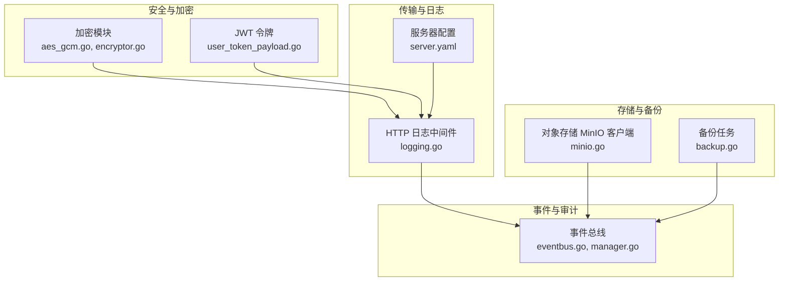
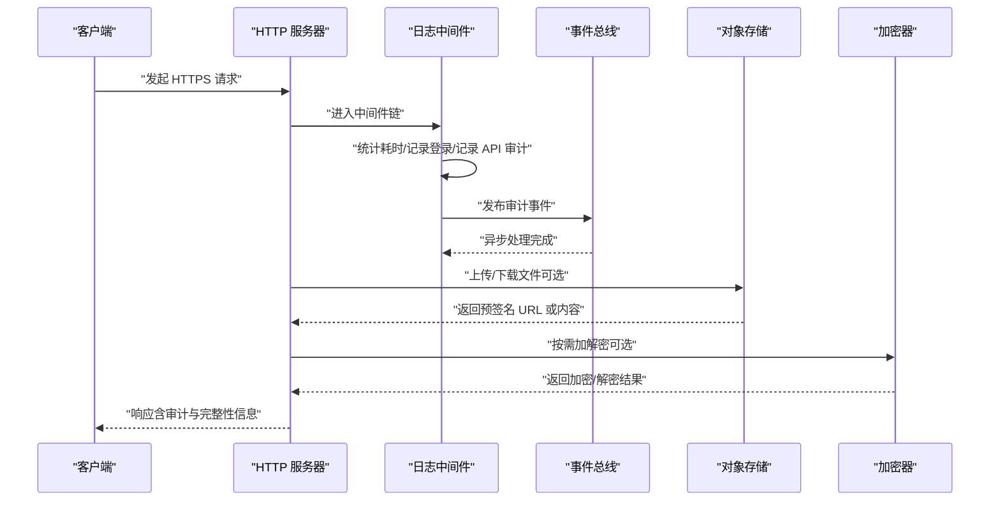
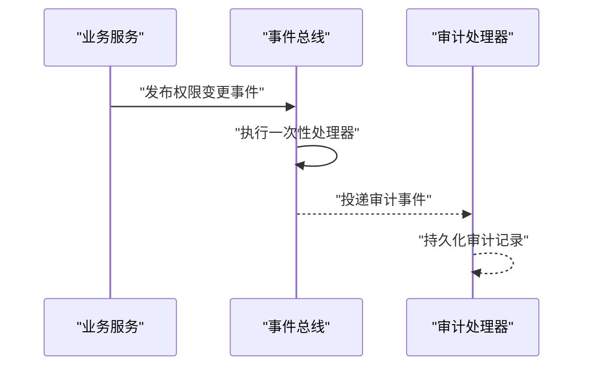
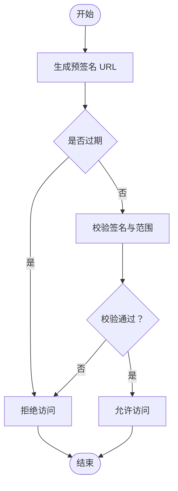
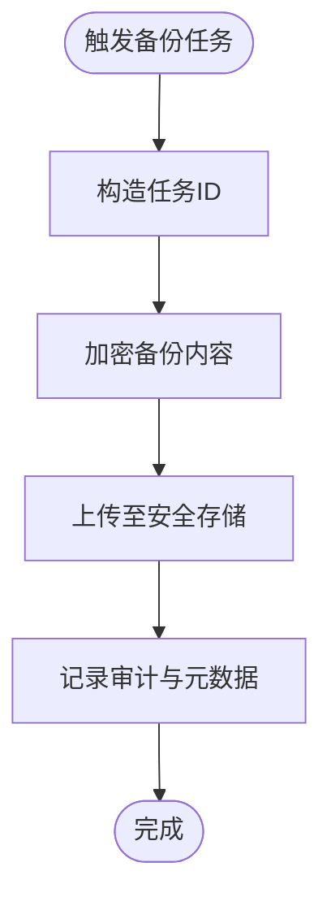
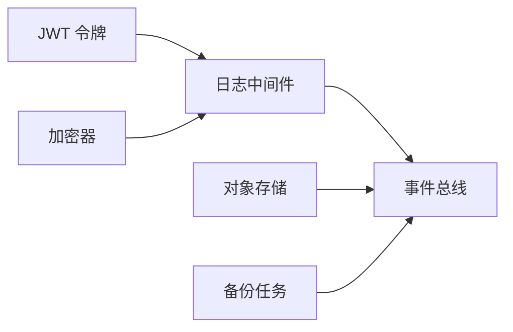

# 数据安全

<cite>
**本文引用的文件**
- [aes_gcm.go](file://backend/pkg/crypto/aes_gcm.go)
- [encryptor.go](file://backend/pkg/crypto/encryptor.go)
- [user_token_payload.go](file://backend/pkg/jwt/user_token_payload.go)
- [logging.go](file://backend/pkg/middleware/logging/logging.go)
- [server.yaml](file://backend/app/admin/service/configs/server.yaml)
- [minio.go](file://backend/pkg/oss/minio.go)
- [eventbus.go](file://backend/pkg/eventbus/eventbus.go)
- [manager.go](file://backend/pkg/eventbus/manager.go)
- [backup.go](file://backend/pkg/task/backup.go)
</cite>

## 目录
1. [引言](#引言)
2. [项目结构](#项目结构)
3. [核心组件](#核心组件)
4. [架构总览](#架构总览)
5. [详细组件分析](#详细组件分析)
6. [依赖分析](#依赖分析)
7. [性能考虑](#性能考虑)
8. [故障排查指南](#故障排查指南)
9. [结论](#结论)
10. [附录](#附录)

## 引言
本文件聚焦于数据安全模块，围绕以下主题展开：传输加密与证书管理、敏感数据脱敏策略、审计日志设计与实现、安全事件监控与告警、数据完整性保护、备份与恢复安全策略，以及合规性与最佳实践。通过对代码库中加密、日志中间件、事件总线、对象存储与任务调度等模块的分析，给出可落地的安全方案与实施建议。

## 项目结构
后端采用分层与领域服务结合的组织方式，安全相关能力主要分布在如下位置：
- 加密与密钥派生：backend/pkg/crypto
- 认证与令牌：backend/pkg/jwt
- 日志与审计中间件：backend/pkg/middleware/logging
- 事件总线：backend/pkg/eventbus
- 对象存储与预签名链接：backend/pkg/oss
- 任务与备份：backend/pkg/task
- 服务器配置：backend/app/admin/service/configs/server.yaml

图表来源
- [aes_gcm.go:1-154](file://backend/pkg/crypto/aes_gcm.go#L1-L154)
- [encryptor.go:1-55](file://backend/pkg/crypto/encryptor.go#L1-L55)
- [user_token_payload.go:1-279](file://backend/pkg/jwt/user_token_payload.go#L1-L279)
- [logging.go:1-52](file://backend/pkg/middleware/logging/logging.go#L1-L52)
- [server.yaml:1-49](file://backend/app/admin/service/configs/server.yaml#L1-L49)
- [eventbus.go:1-214](file://backend/pkg/eventbus/eventbus.go#L1-L214)
- [manager.go:1-119](file://backend/pkg/eventbus/manager.go#L1-L119)
- [minio.go:1-467](file://backend/pkg/oss/minio.go#L1-L467)
- [backup.go:1-19](file://backend/pkg/task/backup.go#L1-L19)

章节来源
- [server.yaml:1-49](file://backend/app/admin/service/configs/server.yaml#L1-L49)

## 核心组件
- 对称加密与密钥派生：AES-256-GCM 实现，支持密钥哈希派生、随机 Nonce、Base64 编码输出、前缀标识加密状态。
- 全局加密器：支持启用/禁用模式，提供条件加解密入口。
- JWT 令牌与声明：定义标准与自定义声明字段，含过期与生效时间判断。
- HTTP 日志与审计中间件：统一记录请求耗时、错误、登录与 API 调用审计。
- 事件总线：异步事件发布/订阅，支持一次性处理器与全局总线。
- 对象存储与预签名链接：上传/下载预签名 URL 生成，支持过期时间与主机替换。
- 备份任务：备份任务类型与任务 ID 构造。

章节来源
- [aes_gcm.go:1-154](file://backend/pkg/crypto/aes_gcm.go#L1-L154)
- [encryptor.go:1-55](file://backend/pkg/crypto/encryptor.go#L1-L55)
- [user_token_payload.go:1-279](file://backend/pkg/jwt/user_token_payload.go#L1-L279)
- [logging.go:1-52](file://backend/pkg/middleware/logging/logging.go#L1-L52)
- [eventbus.go:1-214](file://backend/pkg/eventbus/eventbus.go#L1-L214)
- [manager.go:1-119](file://backend/pkg/eventbus/manager.go#L1-L119)
- [minio.go:1-467](file://backend/pkg/oss/minio.go#L1-L467)
- [backup.go:1-19](file://backend/pkg/task/backup.go#L1-L19)

## 架构总览
下图展示数据安全相关模块在请求生命周期中的交互路径，包括传输、认证、日志审计与事件通知。

图表来源
- [logging.go:1-52](file://backend/pkg/middleware/logging/logging.go#L1-L52)
- [eventbus.go:1-214](file://backend/pkg/eventbus/eventbus.go#L1-L214)
- [minio.go:1-467](file://backend/pkg/oss/minio.go#L1-L467)
- [aes_gcm.go:1-154](file://backend/pkg/crypto/aes_gcm.go#L1-L154)

## 详细组件分析

### 传输加密与 HTTPS 证书管理
- TLS 配置与 HTTPS
  - 服务器配置启用了 REST 服务监听、Swagger 文档与 pprof 性能分析，但未直接暴露 TLS 证书与密钥参数。建议在生产环境通过独立配置项或环境变量注入证书与私钥，并在网关或反向代理层强制启用 HTTPS。
  - CORS 放宽至允许任意来源，建议在生产环境限定可信域名。
- 证书管理
  - 建议使用自动化证书签发与轮换（如 ACME），并结合证书固定（HPKP/STS）与健康检查策略。
- 加密通道建立
  - 前端与后端之间通过 HTTPS 传输；若涉及 WebSocket/SSE，建议在同源或受控网络内部署，避免明文传输。

章节来源
- [server.yaml:1-49](file://backend/app/admin/service/configs/server.yaml#L1-L49)

### 敏感数据脱敏策略
- 用户隐私数据处理
  - 在日志中间件中对登录与 API 调用进行审计记录，建议对用户名、设备 ID、客户端 ID 等敏感字段进行脱敏或最小化采集。
- 日志脱敏
  - 可在日志中间件中增加字段白名单与脱敏规则，避免将完整敏感信息写入日志。
- API 响应脱敏
  - 对于返回体中的敏感字段（如令牌、凭证），建议仅返回必要片段或摘要，避免全量泄露。

说明：当前仓库未提供专门的日志脱敏实现文件，建议在日志中间件中扩展脱敏逻辑。

章节来源
- [logging.go:1-52](file://backend/pkg/middleware/logging/logging.go#L1-L52)

### 审计日志系统设计与实现
- 登录审计
  - 中间件在 HTTP 层面收集登录/登出操作，记录耗时与错误，便于后续审计。
- 操作审计
  - 通过事件总线发布一次性事件，用于操作审计与跨模块联动。
- API 调用审计
  - 中间件记录每次 API 调用的元数据（方法、路径、耗时、状态码、错误），便于追踪调用行为。
- 权限变更审计
  - 建议在权限相关业务流程中触发事件，由事件总线汇聚到审计模块。

图表来源
- [logging.go:1-52](file://backend/pkg/middleware/logging/logging.go#L1-L52)
- [eventbus.go:1-214](file://backend/pkg/eventbus/eventbus.go#L1-L214)
- [manager.go:1-119](file://backend/pkg/eventbus/manager.go#L1-L119)

章节来源
- [logging.go:1-52](file://backend/pkg/middleware/logging/logging.go#L1-L52)
- [eventbus.go:1-214](file://backend/pkg/eventbus/eventbus.go#L1-L214)
- [manager.go:1-119](file://backend/pkg/eventbus/manager.go#L1-L119)

### 安全事件监控与告警机制
- 异常登录检测
  - 建议基于登录审计日志统计异常 IP、设备、时间窗口内的失败次数，触发告警。
- 权限滥用监控
  - 对高风险操作（如批量删除、权限提升）进行实时事件监控，结合阈值与规则引擎告警。
- 数据访问异常
  - 对对象存储的异常访问（如频繁预签名 URL 生成、大流量下载）进行监控与告警。

说明：当前仓库未提供专门的监控与告警实现文件，建议引入指标采集（Prometheus）、日志聚合（ELK/OTel）与告警平台（AlertManager/钉钉/企业微信）。

章节来源
- [logging.go:1-52](file://backend/pkg/middleware/logging/logging.go#L1-L52)
- [minio.go:1-467](file://backend/pkg/oss/minio.go#L1-L467)

### 数据完整性保护
- 数据校验
  - 对象存储下载接口返回 SHA-256 校验值，可用于完整性校验。
- 签名验证
  - 预签名 URL 的生成与过期时间控制，可降低重放与篡改风险。
- 防篡改机制
  - 结合 HMAC/签名与最小权限原则，限制预签名 URL 的有效期与用途。

图表来源
- [minio.go:317-364](file://backend/pkg/oss/minio.go#L317-L364)

章节来源
- [minio.go:1-467](file://backend/pkg/oss/minio.go#L1-L467)

### 数据备份与恢复安全策略
- 加密备份
  - 建议在备份任务中集成加密步骤，确保备份介质与归档文件的机密性。
- 访问控制
  - 备份存储桶与对象设置严格的 ACL 与 IAM 策略，限制访问范围。
- 灾难恢复
  - 制定备份保留周期与异地复制策略，定期演练恢复流程。

图表来源
- [backup.go:1-19](file://backend/pkg/task/backup.go#L1-L19)

章节来源
- [backup.go:1-19](file://backend/pkg/task/backup.go#L1-L19)

## 依赖分析
- 组件耦合
  - 日志中间件依赖 HTTP 传输上下文，抽取登录与 API 审计信息；事件总线作为解耦的异步通知通道。
  - 加密器与 JWT 令牌分别服务于数据静态加密与动态身份鉴别，二者可组合使用。
  - 对象存储客户端提供预签名能力，与审计与事件总线协同，形成“可审计、可追溯”的数据访问闭环。
- 外部依赖
  - 事件总线使用 Kratos 日志组件；对象存储依赖 MinIO 客户端；加密模块依赖 Go 标准库密码学包。

图表来源
- [logging.go:1-52](file://backend/pkg/middleware/logging/logging.go#L1-L52)
- [eventbus.go:1-214](file://backend/pkg/eventbus/eventbus.go#L1-L214)
- [minio.go:1-467](file://backend/pkg/oss/minio.go#L1-L467)
- [aes_gcm.go:1-154](file://backend/pkg/crypto/aes_gcm.go#L1-L154)
- [user_token_payload.go:1-279](file://backend/pkg/jwt/user_token_payload.go#L1-L279)
- [backup.go:1-19](file://backend/pkg/task/backup.go#L1-L19)

## 性能考虑
- 中间件开销
  - 日志中间件包含耗时统计与多次审计写入，建议在高并发场景开启异步审计与批量落盘。
- 事件总线
  - 异步发布使用独立后台上下文与超时控制，避免阻塞主请求链路。
- 对象存储
  - 预签名 URL 可显著降低服务端带宽压力；合理设置过期时间与缓存策略以平衡安全性与性能。

## 故障排查指南
- 加密相关
  - 若出现解密失败或密钥长度不合法，检查密钥来源与初始化流程。
- JWT 令牌
  - 若令牌过期或尚未生效，检查系统时间同步与令牌声明字段。
- 日志与审计
  - 若审计缺失，检查中间件是否正确挂载与事件总线是否关闭。
- 对象存储
  - 若预签名失败，检查存储桶存在性、权限与主机替换逻辑。

章节来源
- [aes_gcm.go:1-154](file://backend/pkg/crypto/aes_gcm.go#L1-L154)
- [user_token_payload.go:1-279](file://backend/pkg/jwt/user_token_payload.go#L1-L279)
- [logging.go:1-52](file://backend/pkg/middleware/logging/logging.go#L1-L52)
- [eventbus.go:1-214](file://backend/pkg/eventbus/eventbus.go#L1-L214)
- [minio.go:1-467](file://backend/pkg/oss/minio.go#L1-L467)

## 结论
本项目在数据安全方面已具备基础能力：对称加密、JWT 令牌、HTTP 审计中间件与事件总线。建议在生产环境中补充 HTTPS 强制、证书管理、日志脱敏、监控告警与备份加密等措施，形成完整的数据安全闭环。

## 附录
- 合规性与最佳实践
  - 强制 HTTPS 与证书轮换，限制 CORS 与来源。
  - 最小化日志采集与脱敏，避免敏感信息落盘。
  - 令牌与密钥安全存储与轮换，严格控制权限与访问范围。
  - 对象存储预签名 URL 设置合理过期时间与用途限制。
  - 备份加密、访问控制与异地复制，定期演练恢复。