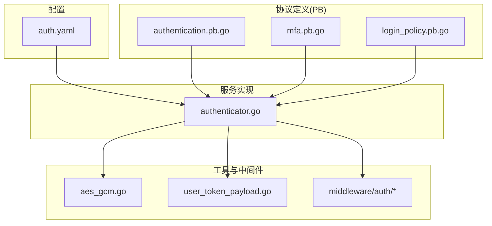
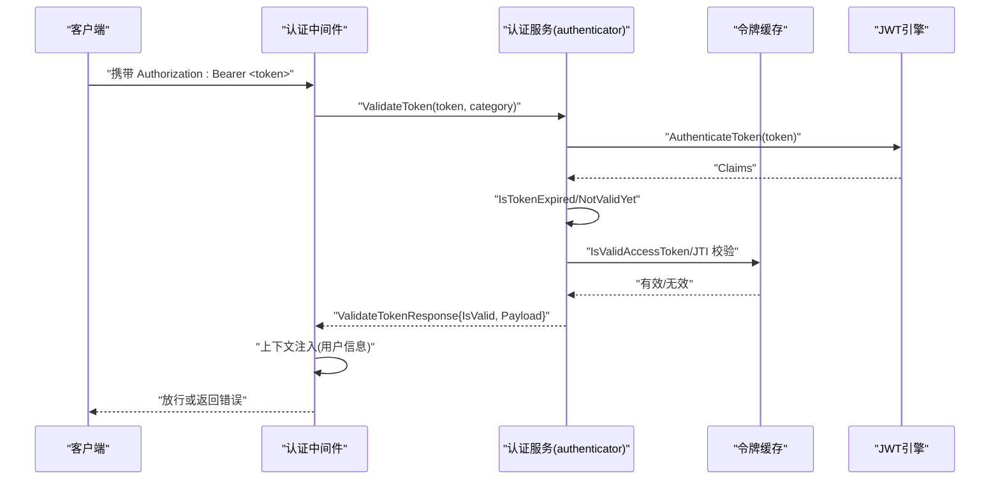
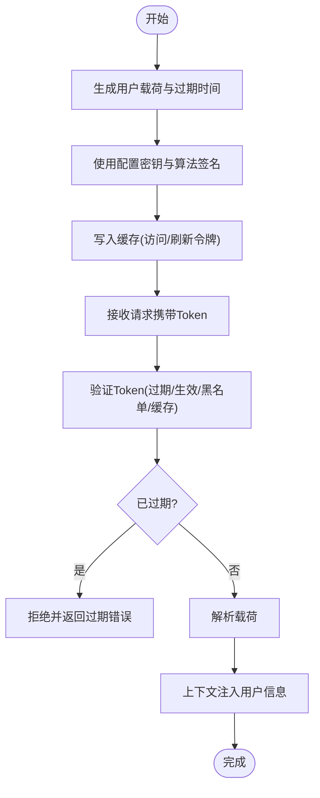
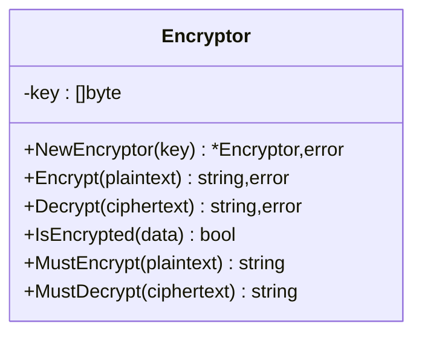
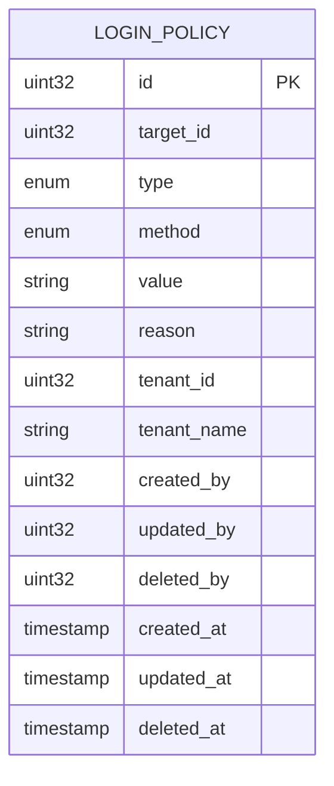
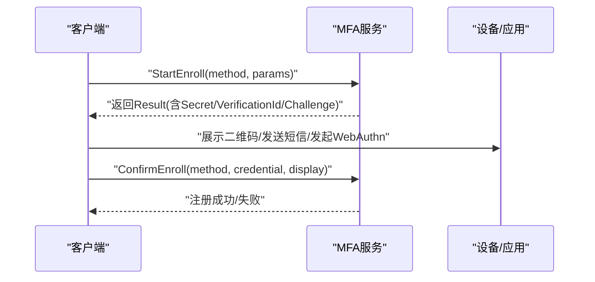
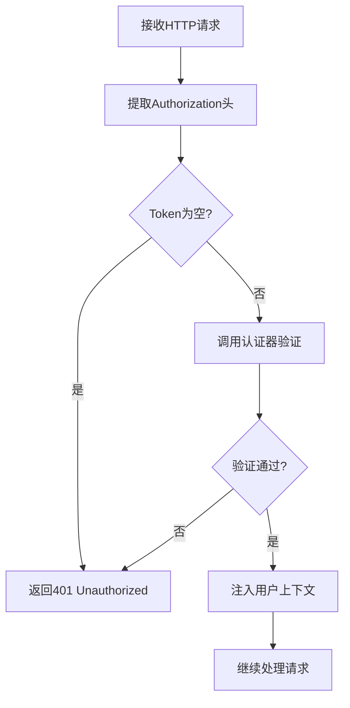
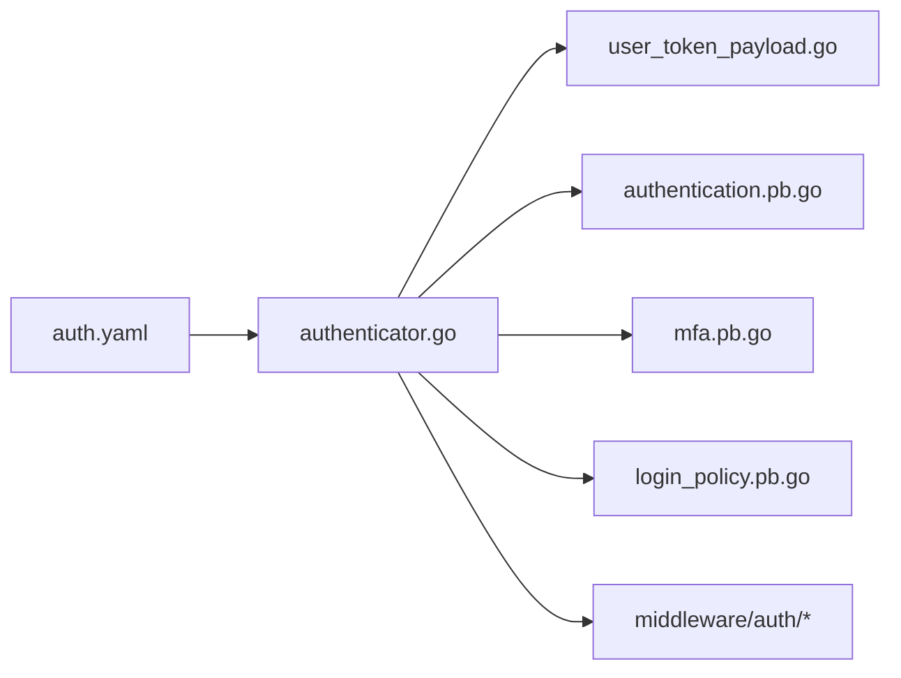

# 认证安全

<cite>
**本文引用的文件**
- [backend/pkg/crypto/aes_gcm.go](file://backend/pkg/crypto/aes_gcm.go)
- [backend/pkg/jwt/user_token_payload.go](file://backend/pkg/jwt/user_token_payload.go)
- [backend/app/admin/service/configs/auth.yaml](file://backend/app/admin/service/configs/auth.yaml)
- [backend/app/admin/service/internal/data/authenticator.go](file://backend/app/admin/service/internal/data/authenticator.go)
- [backend/api/gen/go/authentication/service/v1/authentication.pb.go](file://backend/api/gen/go/authentication/service/v1/authentication.pb.go)
- [backend/api/gen/go/authentication/service/v1/mfa.pb.go](file://backend/api/gen/go/authentication/service/v1/mfa.pb.go)
- [backend/api/gen/go/authentication/service/v1/login_policy.pb.go](file://backend/api/gen/go/authentication/service/v1/login_policy.pb.go)
- [backend/pkg/middleware/auth/auth.go](file://backend/pkg/middleware/auth/auth.go)
- [backend/pkg/middleware/auth/context.go](file://backend/pkg/middleware/auth/context.go)
- [backend/pkg/middleware/auth/options.go](file://backend/pkg/middleware/auth/options.go)
- [backend/pkg/middleware/auth/utils.go](file://backend/pkg/middleware/auth/utils.go)
- [backend/pkg/middleware/auth/errors.go](file://backend/pkg/middleware/auth/errors.go)
</cite>

## 目录
1. [简介](#简介)
2. [项目结构](#项目结构)
3. [核心组件](#核心组件)
4. [架构总览](#架构总览)
5. [详细组件分析](#详细组件分析)
6. [依赖分析](#依赖分析)
7. [性能考虑](#性能考虑)
8. [故障排查指南](#故障排查指南)
9. [结论](#结论)
10. [附录](#附录)

## 简介
本文件面向认证安全模块，围绕以下主题提供系统化说明与最佳实践：
- JWT Token 管理：生成、验证、刷新与过期处理
- 密码与敏感数据加密存储：AES-GCM 实现与密钥管理
- 登录策略：失败次数限制、账户锁定、登录时间窗口等
- 多因素认证（MFA）：原理、方法枚举与配置要点
- 认证中间件：Token 提取、验证流程、上下文注入
- 安全最佳实践：Token 存储、传输加密、防重放等

## 项目结构
认证安全相关代码主要分布在如下位置：
- 加密与密钥：backend/pkg/crypto
- JWT 工具：backend/pkg/jwt
- 配置：backend/app/admin/service/configs/auth.yaml
- 认证服务实现：backend/app/admin/service/internal/data/authenticator.go
- 协议定义（PB）：backend/api/gen/go/authentication/service/v1/*.pb.go
- 中间件：backend/pkg/middleware/auth

图表来源
- [backend/app/admin/service/configs/auth.yaml](file://backend/app/admin/service/configs/auth.yaml)
- [backend/app/admin/service/internal/data/authenticator.go](file://backend/app/admin/service/internal/data/authenticator.go)
- [backend/api/gen/go/authentication/service/v1/authentication.pb.go](file://backend/api/gen/go/authentication/service/v1/authentication.pb.go)
- [backend/api/gen/go/authentication/service/v1/mfa.pb.go](file://backend/api/gen/go/authentication/service/v1/mfa.pb.go)
- [backend/api/gen/go/authentication/service/v1/login_policy.pb.go](file://backend/api/gen/go/authentication/service/v1/login_policy.pb.go)
- [backend/pkg/crypto/aes_gcm.go](file://backend/pkg/crypto/aes_gcm.go)
- [backend/pkg/jwt/user_token_payload.go](file://backend/pkg/jwt/user_token_payload.go)
- [backend/pkg/middleware/auth/auth.go](file://backend/pkg/middleware/auth/auth.go)

章节来源
- [backend/app/admin/service/configs/auth.yaml](file://backend/app/admin/service/configs/auth.yaml)
- [backend/app/admin/service/internal/data/authenticator.go](file://backend/app/admin/service/internal/data/authenticator.go)

## 核心组件
- 加密与密钥
  - AES-GCM 加密器：提供对称加密、随机 Nonce、Base64 编码、前缀标记与错误处理
  - 密钥派生：输入键经 SHA-256 派生为 32 字节密钥，满足 AES-256 要求
- JWT 工具
  - 用户令牌载荷构建与解析
  - 过期与生效时间判断（带默认容差）
- 认证服务
  - 访问令牌与刷新令牌生成、校验、撤销、封禁
  - 令牌缓存一致性校验与黑名单检查
- 协议与策略
  - 登录策略（黑名单/白名单、IP/MAC/地区/时间/设备）
  - MFA 方法枚举（TOTP、SMS、EMAIL、U2F、WEBAUTHN、BACKUP_CODE 等）
- 中间件
  - Token 提取、验证、上下文注入、错误处理

章节来源
- [backend/pkg/crypto/aes_gcm.go](file://backend/pkg/crypto/aes_gcm.go)
- [backend/pkg/jwt/user_token_payload.go](file://backend/pkg/jwt/user_token_payload.go)
- [backend/app/admin/service/internal/data/authenticator.go](file://backend/app/admin/service/internal/data/authenticator.go)
- [backend/api/gen/go/authentication/service/v1/login_policy.pb.go](file://backend/api/gen/go/authentication/service/v1/login_policy.pb.go)
- [backend/api/gen/go/authentication/service/v1/mfa.pb.go](file://backend/api/gen/go/authentication/service/v1/mfa.pb.go)
- [backend/pkg/middleware/auth/auth.go](file://backend/pkg/middleware/auth/auth.go)

## 架构总览
认证安全的整体流程：
- 配置加载：读取 auth.yaml 的认证类型与 JWT 签名算法/密钥
- 登录与签发：服务端生成访问令牌与刷新令牌，写入缓存
- 请求拦截：中间件提取请求中的 Token，调用认证器进行验证
- 令牌校验：检查过期、黑名单、缓存有效性；解析载荷
- 上下文注入：将用户信息注入到请求上下文中供后续业务使用

图表来源
- [backend/pkg/middleware/auth/auth.go](file://backend/pkg/middleware/auth/auth.go)
- [backend/app/admin/service/internal/data/authenticator.go](file://backend/app/admin/service/internal/data/authenticator.go)
- [backend/pkg/jwt/user_token_payload.go](file://backend/pkg/jwt/user_token_payload.go)
- [backend/api/gen/go/authentication/service/v1/authentication.pb.go](file://backend/api/gen/go/authentication/service/v1/authentication.pb.go)

## 详细组件分析

### JWT 管理机制
- 令牌生成
  - 访问令牌：基于用户载荷与过期时间生成，使用配置的签名算法与密钥
  - 刷新令牌：独立生成并存储于缓存，用于换取新的访问令牌
- 令牌验证
  - 解析 JWT Claims，检查过期与生效时间（带容差）
  - 校验缓存中 JTI 是否有效，避免重放与撤销
  - 支持跳过 Redis 校验与黑名单校验（调试/特殊场景）
- 令牌刷新与撤销
  - 验证刷新令牌后撤销旧访问令牌与刷新令牌，确保一次性使用
  - 支持按用户或 JTI 撤销，支持封禁指定令牌

图表来源
- [backend/app/admin/service/internal/data/authenticator.go](file://backend/app/admin/service/internal/data/authenticator.go)
- [backend/pkg/jwt/user_token_payload.go](file://backend/pkg/jwt/user_token_payload.go)
- [backend/api/gen/go/authentication/service/v1/authentication.pb.go](file://backend/api/gen/go/authentication/service/v1/authentication.pb.go)

章节来源
- [backend/app/admin/service/internal/data/authenticator.go](file://backend/app/admin/service/internal/data/authenticator.go)
- [backend/pkg/jwt/user_token_payload.go](file://backend/pkg/jwt/user_token_payload.go)
- [backend/api/gen/go/authentication/service/v1/authentication.pb.go](file://backend/api/gen/go/authentication/service/v1/authentication.pb.go)

### 密码与敏感数据加密存储（AES-GCM）
- 算法与模式
  - AES-256-GCM：提供机密性与完整性保护
  - 随机 Nonce：每次加密生成，长度由 GCM 模式决定
  - Base64 编码输出，前缀“enc:”区分密文与明文
- 密钥管理
  - 输入密钥经 SHA-256 派生为 32 字节，满足 AES-256 要求
  - 错误处理：无效密钥、无效密文、解密失败等
  - 兼容性：未加密明文直接返回，便于迁移
- 使用建议
  - 生产环境密钥长度≥32 字节，妥善保管与轮换
  - 对数据库中存储的敏感配置（如邮件、API 密钥）进行加密后再入库

图表来源
- [backend/pkg/crypto/aes_gcm.go](file://backend/pkg/crypto/aes_gcm.go)

章节来源
- [backend/pkg/crypto/aes_gcm.go](file://backend/pkg/crypto/aes_gcm.go)

### 登录策略配置（失败限制、账户锁定、登录时间窗口）
- 策略类型
  - 黑名单：禁止特定条件下的登录
  - 白名单：仅允许特定条件下的登录
- 限制方式
  - IP、MAC、地区、时间、设备
- 配置要点
  - 通过协议消息 LoginPolicy 描述策略项
  - 支持分页查询、计数、增删改查
- 实施建议
  - 结合地理位置与设备指纹，动态调整策略
  - 登录时间窗口可结合业务场景设置（如仅工作时间）

图表来源
- [backend/api/gen/go/authentication/service/v1/login_policy.pb.go](file://backend/api/gen/go/authentication/service/v1/login_policy.pb.go)

章节来源
- [backend/api/gen/go/authentication/service/v1/login_policy.pb.go](file://backend/api/gen/go/authentication/service/v1/login_policy.pb.go)

### 多因素认证（MFA）实现原理与配置
- 方法枚举
  - TOTP、SMS、EMAIL、U2F、WEBAUTHN、BACKUP_CODE 等
- 注册与确认
  - 启动注册：返回相应凭据（如 TOTP 秘钥、短信验证码、WebAuthn 挑战）
  - 确认注册：提交一次性验证结果，完成绑定
- 配置要点
  - 不同方法可能需要额外参数（如手机号、邮箱）
  - 注册过程需设置过期时间与临时操作 ID
- 安全建议
  - TOTP 秘钥仅在注册时返回一次，服务端仅保存哈希/引用
  - WebAuthn/RSA/Ed25519 等公钥算法可替代传统密码

图表来源
- [backend/api/gen/go/authentication/service/v1/mfa.pb.go](file://backend/api/gen/go/authentication/service/v1/mfa.pb.go)

章节来源
- [backend/api/gen/go/authentication/service/v1/mfa.pb.go](file://backend/api/gen/go/authentication/service/v1/mfa.pb.go)

### 认证中间件工作机制
- Token 提取
  - 从请求头 Authorization 中提取 Bearer Token
- 验证流程
  - 调用认证器 ValidateToken，执行过期、生效、黑名单、缓存校验
  - 解析用户载荷，注入上下文
- 上下文注入
  - 将用户 ID、租户 ID、角色、设备/客户端 ID 等放入上下文
- 错误处理
  - 统一错误码与消息，便于前端与日志记录

图表来源
- [backend/pkg/middleware/auth/auth.go](file://backend/pkg/middleware/auth/auth.go)
- [backend/pkg/middleware/auth/context.go](file://backend/pkg/middleware/auth/context.go)
- [backend/pkg/middleware/auth/utils.go](file://backend/pkg/middleware/auth/utils.go)
- [backend/pkg/middleware/auth/errors.go](file://backend/pkg/middleware/auth/errors.go)

章节来源
- [backend/pkg/middleware/auth/auth.go](file://backend/pkg/middleware/auth/auth.go)
- [backend/pkg/middleware/auth/context.go](file://backend/pkg/middleware/auth/context.go)
- [backend/pkg/middleware/auth/options.go](file://backend/pkg/middleware/auth/options.go)
- [backend/pkg/middleware/auth/utils.go](file://backend/pkg/middleware/auth/utils.go)
- [backend/pkg/middleware/auth/errors.go](file://backend/pkg/middleware/auth/errors.go)

## 依赖分析
- 认证器依赖
  - 配置：auth.yaml 中的 JWT 算法与密钥
  - JWT 引擎：用于签名与验证
  - 缓存：令牌有效性与黑名单检查
- 协议依赖
  - authentication.pb.go：ValidateToken 请求/响应
  - mfa.pb.go：MFA 注册/确认流程
  - login_policy.pb.go：登录策略模型
- 中间件依赖
  - 认证器接口与错误码

图表来源
- [backend/app/admin/service/configs/auth.yaml](file://backend/app/admin/service/configs/auth.yaml)
- [backend/app/admin/service/internal/data/authenticator.go](file://backend/app/admin/service/internal/data/authenticator.go)
- [backend/pkg/jwt/user_token_payload.go](file://backend/pkg/jwt/user_token_payload.go)
- [backend/api/gen/go/authentication/service/v1/authentication.pb.go](file://backend/api/gen/go/authentication/service/v1/authentication.pb.go)
- [backend/api/gen/go/authentication/service/v1/mfa.pb.go](file://backend/api/gen/go/authentication/service/v1/mfa.pb.go)
- [backend/api/gen/go/authentication/service/v1/login_policy.pb.go](file://backend/api/gen/go/authentication/service/v1/login_policy.pb.go)
- [backend/pkg/middleware/auth/auth.go](file://backend/pkg/middleware/auth/auth.go)

章节来源
- [backend/app/admin/service/internal/data/authenticator.go](file://backend/app/admin/service/internal/data/authenticator.go)
- [backend/app/admin/service/configs/auth.yaml](file://backend/app/admin/service/configs/auth.yaml)

## 性能考虑
- JWT 验证
  - 使用内存缓存（令牌有效性、黑名单）降低数据库压力
  - 合理设置过期时间，平衡安全性与性能
- 加密性能
  - AES-GCM 为硬件加速友好，适合高吞吐场景
  - 批量加密/解密时注意内存分配与 GC 压力
- 中间件
  - 尽量减少重复解析与序列化，复用上下文对象

## 故障排查指南
- 常见错误
  - 令牌过期：检查服务器时间同步与过期时间设置
  - 令牌被撤销/封禁：检查缓存状态与封禁列表
  - 刷新令牌无效：确认是否已被使用并撤销
  - 解密失败：核对密钥是否一致、密文格式是否正确
- 排查步骤
  - 开启中间件与服务端日志，定位错误来源
  - 使用协议定义中的验证方法辅助定位问题
  - 在测试环境中复现并对比预期行为

章节来源
- [backend/pkg/middleware/auth/errors.go](file://backend/pkg/middleware/auth/errors.go)
- [backend/app/admin/service/internal/data/authenticator.go](file://backend/app/admin/service/internal/data/authenticator.go)
- [backend/pkg/crypto/aes_gcm.go](file://backend/pkg/crypto/aes_gcm.go)

## 结论
本认证安全模块以 JWT 为核心，结合缓存与策略实现完整的登录与访问控制能力；同时提供 AES-GCM 加密与 MFA 支持，满足生产级安全需求。通过中间件统一接入，开发者可快速集成并遵循最佳实践。

## 附录

### 配置模板（auth.yaml）
- 认证类型与 JWT 签名算法/密钥
- OIDC 与预共享密钥配置（可选）

章节来源
- [backend/app/admin/service/configs/auth.yaml](file://backend/app/admin/service/configs/auth.yaml)

### 代码示例路径
- JWT 载荷构建与解析
  - [backend/pkg/jwt/user_token_payload.go](file://backend/pkg/jwt/user_token_payload.go)
- 访问/刷新令牌生成与校验
  - [backend/app/admin/service/internal/data/authenticator.go](file://backend/app/admin/service/internal/data/authenticator.go)
- 中间件 Token 提取与上下文注入
  - [backend/pkg/middleware/auth/auth.go](file://backend/pkg/middleware/auth/auth.go)
  - [backend/pkg/middleware/auth/context.go](file://backend/pkg/middleware/auth/context.go)
- AES-GCM 加密/解密
  - [backend/pkg/crypto/aes_gcm.go](file://backend/pkg/crypto/aes_gcm.go)