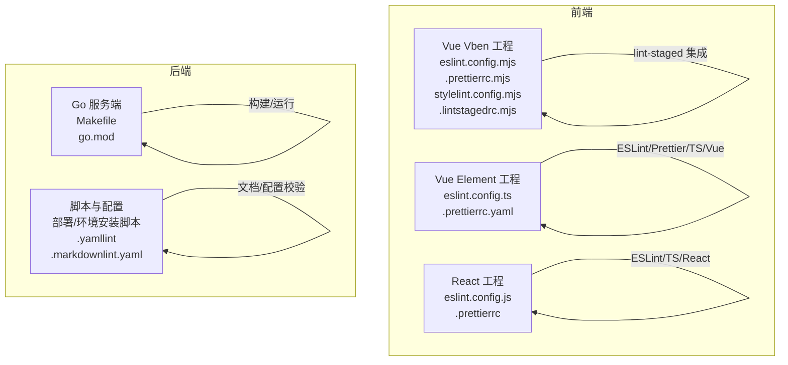
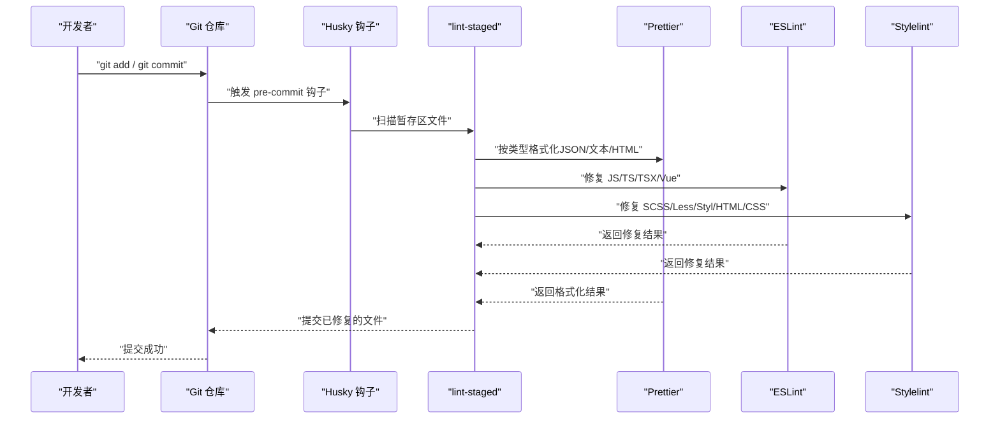
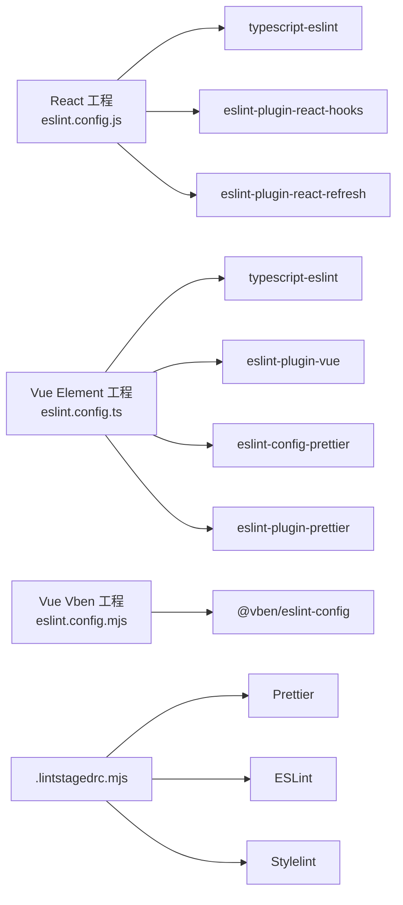

# 代码质量工具

<cite>
**本文引用的文件**
- [frontend/admin/react/eslint.config.js](file://frontend/admin/react/eslint.config.js)
- [frontend/admin/vue-element/eslint.config.ts](file://frontend/admin/vue-element/eslint.config.ts)
- [frontend/admin/vue-vben/eslint.config.mjs](file://frontend/admin/vue-vben/eslint.config.mjs)
- [frontend/admin/react/.prettierrc](file://frontend/admin/react/.prettierrc)
- [frontend/admin/vue-element/.prettierrc.yaml](file://frontend/admin/vue-element/.prettierrc.yaml)
- [frontend/admin/vue-vben/.prettierrc.mjs](file://frontend/admin/vue-vben/.prettierrc.mjs)
- [frontend/admin/vue-vben/stylelint.config.mjs](file://frontend/admin/vue-vben/stylelint.config.mjs)
- [frontend/admin/vue-vben/.lintstagedrc.mjs](file://frontend/admin/vue-vben/.lintstagedrc.mjs)
- [frontend/admin/vue-vben/internal/lint-configs/eslint-config/package.json](file://frontend/admin/vue-vben/internal/lint-configs/eslint-config/package.json)
- [frontend/admin/vue-vben/internal/lint-configs/prettier-config/package.json](file://frontend/admin/vue-vben/internal/lint-configs/prettier-config/package.json)
- [frontend/admin/vue-vben/internal/lint-configs/stylelint-config/package.json](file://frontend/admin/vue-vben/internal/lint-configs/stylelint-config/package.json)
- [frontend/admin/vue-vben/internal/lint-configs/commitlint-config/package.json](file://frontend/admin/vue-vben/internal/lint-configs/commitlint-config/package.json)
- [frontend/admin/vue-vben/vitest.config.ts](file://frontend/admin/vue-vben/vitest.config.ts)
- [frontend/admin/vue-vben/vitest.workspace.ts](file://frontend/admin/vue-vben/vitest.workspace.ts)
- [backend/Makefile](file://backend/Makefile)
- [backend/app/admin/service/Makefile](file://backend/app/admin/service/Makefile)
- [backend/go.mod](file://backend/go.mod)
- [backend/.yamllint](file://backend/.yamllint)
- [backend/.markdownlint.yaml](file://backend/.markdownlint.yaml)
- [backend/scripts/deploy/pm2_service.sh](file://backend/scripts/deploy/pm2_service.sh)
- [backend/scripts/docker/full_deploy.sh](file://backend/scripts/docker/full_deploy.sh)
- [backend/scripts/docker/libs_only.sh](file://backend/scripts/docker/libs_only.sh)
- [backend/scripts/env/install_golang.sh](file://backend/scripts/env/install_golang.sh)
- [backend/scripts/env/install_unix_dev.sh](file://backend/scripts/env/install_unix_dev.sh)
- [backend/scripts/env/install_unix_prod.sh](file://backend/scripts/env/install_unix_prod.sh)
- [backend/scripts/env/install_windows_dev.ps1](file://backend/scripts/env/install_windows_dev.ps1)
</cite>

## 目录
1. [简介](#简介)
2. [项目结构](#项目结构)
3. [核心组件](#核心组件)
4. [架构总览](#架构总览)
5. [详细组件分析](#详细组件分析)
6. [依赖关系分析](#依赖关系分析)
7. [性能考虑](#性能考虑)
8. [故障排查指南](#故障排查指南)
9. [结论](#结论)
10. [附录](#附录)

## 简介
本文件面向 GoWind Admin 项目的前端与后端团队，系统梳理并说明代码质量工具链的配置与使用方法，覆盖以下方面：
- 前端：ESLint、Prettier、Stylelint 的规则与集成方式
- 后端：Go 语言静态分析与质量保障思路
- Git Hooks：pre-commit 钩子与 lint-staged 的配置与使用
- 代码覆盖率：前端 Vitest 配置与覆盖率统计
- 文档与配置文件：YAML、Markdown 的校验配置

目标是帮助团队建立统一、可复用且自动化的代码质量保障体系。

## 项目结构
本项目采用“前后端分离 + 多前端框架”的组织方式：
- 前端包含 React、Vue Element Plus、Vue Vben 三种实现，分别位于 frontend/admin/react、frontend/admin/vue-element、frontend/admin/vue-vben
- 后端位于 backend，包含服务端代码、脚本与配置
- 各前端工程均配有独立的 ESLint、Prettier、Stylelint 配置与 lint-staged 集成

图表来源
- [frontend/admin/react/eslint.config.js:1-140](file://frontend/admin/react/eslint.config.js#L1-L140)
- [frontend/admin/vue-element/eslint.config.ts:1-230](file://frontend/admin/vue-element/eslint.config.ts#L1-L230)
- [frontend/admin/vue-vben/eslint.config.mjs:1-6](file://frontend/admin/vue-vben/eslint.config.mjs#L1-L6)
- [frontend/admin/vue-vben/.lintstagedrc.mjs:1-21](file://frontend/admin/vue-vben/.lintstagedrc.mjs#L1-L21)
- [backend/Makefile:1-50](file://backend/Makefile#L1-L50)

章节来源
- [frontend/admin/react/eslint.config.js:1-140](file://frontend/admin/react/eslint.config.js#L1-L140)
- [frontend/admin/vue-element/eslint.config.ts:1-230](file://frontend/admin/vue-element/eslint.config.ts#L1-L230)
- [frontend/admin/vue-vben/eslint.config.mjs:1-6](file://frontend/admin/vue-vben/eslint.config.mjs#L1-L6)
- [frontend/admin/vue-vben/.lintstagedrc.mjs:1-21](file://frontend/admin/vue-vben/.lintstagedrc.mjs#L1-L21)
- [backend/Makefile:1-50](file://backend/Makefile#L1-L50)

## 核心组件
- 前端 ESLint 配置
  - React 工程：基于 flat config，启用 TypeScript、React Hooks、React Refresh 插件，覆盖大量基础与风格规则
  - Vue Element 工程：多段式配置，分别针对基础 JS、Vue 单文件组件、TypeScript、.d.ts 以及特定目录进行差异化规则
  - Vue Vben 工程：通过 @vben/eslint-config 快速生成统一配置
- 前端 Prettier 配置
  - React：.prettierrc JSON，集中定义缩进、引号、行宽、分号等风格
  - Vue Element：.prettierrc.yaml YAML，覆盖 Vue 特性与 HTML/JSX 行为
  - Vue Vben：.prettierrc.mjs 导出 @vben/prettier-config，便于统一风格
- 前端 Stylelint 配置
  - Vue Vben：stylelint.config.mjs 扩展 @vben/stylelint-config，统一样式规范
- Git Hooks 与 lint-staged
  - Vue Vben：.lintstagedrc.mjs 定义 staged 文件的自动修复流程（Prettier、ESLint、Stylelint）
- 前端覆盖率
  - Vue Vben：vitest.config.ts 与 vitest.workspace.ts 提供测试与覆盖率统计入口
- 后端质量与脚手架
  - Makefile：构建、运行、清理等任务编排
  - go.mod：模块与依赖管理
  - .yamllint、.markdownlint.yaml：文档与配置文件的校验

章节来源
- [frontend/admin/react/.prettierrc:1-14](file://frontend/admin/react/.prettierrc#L1-L14)
- [frontend/admin/vue-element/.prettierrc.yaml:1-42](file://frontend/admin/vue-element/.prettierrc.yaml#L1-L42)
- [frontend/admin/vue-vben/.prettierrc.mjs:1-2](file://frontend/admin/vue-vben/.prettierrc.mjs#L1-L2)
- [frontend/admin/vue-vben/stylelint.config.mjs:1-5](file://frontend/admin/vue-vben/stylelint.config.mjs#L1-L5)
- [frontend/admin/vue-vben/.lintstagedrc.mjs:1-21](file://frontend/admin/vue-vben/.lintstagedrc.mjs#L1-L21)
- [frontend/admin/vue-vben/vitest.config.ts:1-50](file://frontend/admin/vue-vben/vitest.config.ts#L1-L50)
- [frontend/admin/vue-vben/vitest.workspace.ts:1-50](file://frontend/admin/vue-vben/vitest.workspace.ts#L1-L50)
- [backend/Makefile:1-50](file://backend/Makefile#L1-L50)
- [backend/go.mod:1-50](file://backend/go.mod#L1-L50)
- [backend/.yamllint:1-50](file://backend/.yamllint#L1-L50)
- [backend/.markdownlint.yaml:1-50](file://backend/.markdownlint.yaml#L1-L50)

## 架构总览
下图展示前端代码质量工具链的整体工作流：编辑器保存或提交时，通过 husky 钩子触发 lint-staged，按文件类型依次执行 Prettier 格式化、ESLint 修复、Stylelint 修复，并最终完成提交。

图表来源
- [frontend/admin/vue-vben/.lintstagedrc.mjs:1-21](file://frontend/admin/vue-vben/.lintstagedrc.mjs#L1-L21)

## 详细组件分析

### React 工程：ESLint 配置与规则
- 配置类型：Flat config，启用 @eslint/js、typescript-eslint、react-hooks、react-refresh
- 重点规则方向
  - 禁止未使用变量、重复 case、空函数、不可达代码等
  - 控制数组括号、大括号风格、分号、空格、缩进等
  - React Hooks 规则与依赖检查
  - TypeScript 相关规则（如非空断言等）
- 忽略项：dist 目录
- 语言选项：浏览器环境全局变量，ECMAScript 2020

建议使用方式
- 在 IDE 中安装 ESLint 插件，开启保存时自动修复
- CI 中执行 eslint --ext .ts,.tsx --fix 进行统一修复
- 如需与 Prettier 协同，可在本地启用 eslint-plugin-prettier 并关闭冲突规则

章节来源
- [frontend/admin/react/eslint.config.js:1-140](file://frontend/admin/react/eslint.config.js#L1-L140)

### Vue Element 工程：多段式 ESLint 配置
- 结构说明
  - 基础 JS 推荐规则
  - Vue Flat 推荐规则
  - TypeScript 推建规则
  - Vue 文件特定规则（组件命名、模板结构、自闭合等）
  - TypeScript 文件特定规则（any、未使用变量、导入类型副作用等）
  - .d.ts 文件特定规则
  - 特定目录（CURD 组件）放宽规则
  - Prettier 集成（必须置于最后）
- 自动导入全局变量：从 .eslintrc-auto-import.json 动态注入，避免 no-undef
- Element Plus 组件全局变量：预置常见组件，减少告警
- 环境变量：根据 NODE_ENV 控制生产/开发环境下的规则严格程度

建议使用方式
- 在 IDE 中启用 ESLint 与 Prettier 插件
- 通过 npm/yarn/pnpm 脚本统一执行 eslint --fix 与 prettier --write
- CI 中执行多段规则校验，确保一致性

章节来源
- [frontend/admin/vue-element/eslint.config.ts:1-230](file://frontend/admin/vue-element/eslint.config.ts#L1-L230)

### Vue Vben 工程：统一 ESLint、Prettier、Stylelint 与 lint-staged
- ESLint：通过 @vben/eslint-config 快速生成统一配置
- Prettier：通过 @vben/prettier-config 统一风格
- Stylelint：扩展 @vben/stylelint-config，统一样式规范
- lint-staged：按文件类型分组执行修复
  - JS/TS/TSX/Vue：Prettier + ESLint
  - 样式文件：Prettier + Stylelint
  - JSON：Prettier（指定 JSON 解析器）
  - Markdown：Prettier
- husky 集成：在 .husky 目录下放置 pre-commit 钩子以触发 lint-staged

建议使用方式
- 本地安装 husky 并初始化钩子
- 通过 npm/yarn/pnpm 脚本执行 lint:js、lint:css、lint:json、lint:md
- CI 中执行 npm run lint:all 或对应分组命令

章节来源
- [frontend/admin/vue-vben/eslint.config.mjs:1-6](file://frontend/admin/vue-vben/eslint.config.mjs#L1-L6)
- [frontend/admin/vue-vben/.prettierrc.mjs:1-2](file://frontend/admin/vue-vben/.prettierrc.mjs#L1-L2)
- [frontend/admin/vue-vben/stylelint.config.mjs:1-5](file://frontend/admin/vue-vben/stylelint.config.mjs#L1-L5)
- [frontend/admin/vue-vben/.lintstagedrc.mjs:1-21](file://frontend/admin/vue-vben/.lintstagedrc.mjs#L1-L21)

### Prettier 配置与使用
- React：.prettierrc JSON，集中定义单引号、分号、行宽、缩进、箭头括号等
- Vue Element：.prettierrc.yaml YAML，覆盖 Vue 特性（如 vueIndentScriptAndStyle）、HTML 敏感度、嵌入语言格式化等
- Vue Vben：.prettierrc.mjs 导出 @vben/prettier-config，便于跨包统一

建议使用方式
- 在 IDE 中启用 Prettier 插件，保存时自动格式化
- 通过 npm/yarn/pnpm 脚本执行 prettier --write
- CI 中执行 prettier --check 确保一致性

章节来源
- [frontend/admin/react/.prettierrc:1-14](file://frontend/admin/react/.prettierrc#L1-L14)
- [frontend/admin/vue-element/.prettierrc.yaml:1-42](file://frontend/admin/vue-element/.prettierrc.yaml#L1-L42)
- [frontend/admin/vue-vben/.prettierrc.mjs:1-2](file://frontend/admin/vue-vben/.prettierrc.mjs#L1-L2)

### Stylelint 配置与使用
- Vue Vben：stylelint.config.mjs 扩展 @vben/stylelint-config，统一样式规范
- lint-staged 中对样式文件执行 stylelint --fix，支持 SCSS/Less/Styl/HTML/CSS

建议使用方式
- 在 IDE 中启用 Stylelint 插件
- 通过 npm/yarn/pnpm 脚本执行 stylelint --fix
- CI 中执行 stylelint --report-needless-disables

章节来源
- [frontend/admin/vue-vben/stylelint.config.mjs:1-5](file://frontend/admin/vue-vben/stylelint.config.mjs#L1-L5)
- [frontend/admin/vue-vben/.lintstagedrc.mjs:1-21](file://frontend/admin/vue-vben/.lintstagedrc.mjs#L1-L21)

### Git Hooks 与 lint-staged
- .lintstagedrc.mjs：定义文件类型到命令的映射，确保格式化与修复顺序正确
- husky：在 .husky 目录下放置 pre-commit 钩子，触发 lint-staged
- 建议在团队中统一安装 husky 并初始化钩子，避免本地差异导致 CI 失败

章节来源
- [frontend/admin/vue-vben/.lintstagedrc.mjs:1-21](file://frontend/admin/vue-vben/.lintstagedrc.mjs#L1-L21)

### 代码覆盖率：Vitest 配置与使用
- vitest.config.ts：提供测试与覆盖率统计的基础配置
- vitest.workspace.ts：多包工作区的测试配置入口
- 建议在 CI 中执行覆盖率统计，并设置阈值（如语句、分支、函数、行）

章节来源
- [frontend/admin/vue-vben/vitest.config.ts:1-50](file://frontend/admin/vue-vben/vitest.config.ts#L1-L50)
- [frontend/admin/vue-vben/vitest.workspace.ts:1-50](file://frontend/admin/vue-vben/vitest.workspace.ts#L1-L50)

### 后端质量与脚手架
- Makefile：提供构建、运行、清理等常用任务，便于本地与 CI 使用
- go.mod：模块与依赖管理，配合 go vet、go fmt、go lint 等工具形成质量闭环
- .yamllint、.markdownlint.yaml：对 YAML 与 Markdown 文件进行风格与结构校验，提升文档质量

建议使用方式
- 本地开发前执行 make dev 或相应脚本准备环境
- CI 中执行 go vet、gofmt、golangci-lint（见下一节）等步骤
- 文档类文件遵循 .yamllint 与 .markdownlint.yaml 规则

章节来源
- [backend/Makefile:1-50](file://backend/Makefile#L1-L50)
- [backend/go.mod:1-50](file://backend/go.mod#L1-L50)
- [backend/.yamllint:1-50](file://backend/.yamllint#L1-L50)
- [backend/.markdownlint.yaml:1-50](file://backend/.markdownlint.yaml#L1-L50)

## 依赖关系分析
前端 lint 配置与工具的依赖关系如下：

图表来源
- [frontend/admin/react/eslint.config.js:1-140](file://frontend/admin/react/eslint.config.js#L1-L140)
- [frontend/admin/vue-element/eslint.config.ts:1-230](file://frontend/admin/vue-element/eslint.config.ts#L1-L230)
- [frontend/admin/vue-vben/eslint.config.mjs:1-6](file://frontend/admin/vue-vben/eslint.config.mjs#L1-L6)
- [frontend/admin/vue-vben/.lintstagedrc.mjs:1-21](file://frontend/admin/vue-vben/.lintstagedrc.mjs#L1-L21)

章节来源
- [frontend/admin/react/eslint.config.js:1-140](file://frontend/admin/react/eslint.config.js#L1-L140)
- [frontend/admin/vue-element/eslint.config.ts:1-230](file://frontend/admin/vue-element/eslint.config.ts#L1-L230)
- [frontend/admin/vue-vben/eslint.config.mjs:1-6](file://frontend/admin/vue-vben/eslint.config.mjs#L1-L6)
- [frontend/admin/vue-vben/.lintstagedrc.mjs:1-21](file://frontend/admin/vue-vben/.lintstagedrc.mjs#L1-L21)

## 性能考虑
- lint-staged 仅处理暂存区文件，避免全量扫描带来的性能开销
- Prettier 与 ESLint 的缓存机制（--cache）可显著降低二次执行时间
- Vue Vben 工程通过 @vben/eslint-config、@vben/prettier-config、@vben/stylelint-config 统一规则，减少配置差异导致的重复计算
- 建议在 CI 中并行执行不同类型的检查（如 JS/TS 与样式），缩短流水线时间

## 故障排查指南
- ESLint 与 Prettier 冲突
  - 现象：两者对同一文件产生相反的格式化结果
  - 处理：在 Vue Element 工程中已通过 eslint-config-prettier 与 eslint-plugin-prettier 协调；若仍有冲突，优先以 Prettier 输出为准，并关闭冲突的 ESLint 规则
- Vue 文件规则不生效
  - 现象：.vue 文件中 ESLint 规则未按预期执行
  - 处理：确认 eslint.config.ts 中针对 *.vue 的配置段落已启用，且 tsconfig.eslint.json 正确指向
- lint-staged 未触发
  - 现象：保存或提交后未执行任何修复
  - 处理：确认 husky 已安装并初始化，.lintstagedrc.mjs 的文件匹配模式与实际文件一致
- 样式修复无效
  - 现象：stylelint 未对样式文件进行修复
  - 处理：确认 stylelint.config.mjs 已正确扩展 @vben/stylelint-config，且 .lintstagedrc.mjs 中包含对应文件类型
- 覆盖率统计异常
  - 现象：覆盖率报告缺失或不准确
  - 处理：检查 vitest.config.ts 与 vitest.workspace.ts 的覆盖率配置，确保测试文件路径与源码路径一致

章节来源
- [frontend/admin/vue-element/eslint.config.ts:217-229](file://frontend/admin/vue-element/eslint.config.ts#L217-L229)
- [frontend/admin/vue-vben/.lintstagedrc.mjs:1-21](file://frontend/admin/vue-vben/.lintstagedrc.mjs#L1-L21)
- [frontend/admin/vue-vben/vitest.config.ts:1-50](file://frontend/admin/vue-vben/vitest.config.ts#L1-L50)
- [frontend/admin/vue-vben/vitest.workspace.ts:1-50](file://frontend/admin/vue-vben/vitest.workspace.ts#L1-L50)

## 结论
通过统一的 ESLint、Prettier、Stylelint 配置与 lint-staged 集成，结合 husky 钩子，GoWind Admin 已建立起高效的前端代码质量保障体系。后端方面，借助 Makefile、go.mod 与文档校验配置，形成可维护的质量基线。建议团队持续完善 CI 中的静态分析与覆盖率统计，确保代码质量稳定提升。

## 附录
- 前端 lint 配置包（Vue Vben 内部）
  - eslint-config：统一 ESLint 规则
  - prettier-config：统一 Prettier 规则
  - stylelint-config：统一 Stylelint 规则
  - commitlint-config：统一提交信息规范
- 后端脚本与部署
  - 部署脚本：pm2_service.sh、full_deploy.sh、libs_only.sh
  - 环境安装脚本：install_golang.sh、install_unix_dev.sh、install_unix_prod.sh、install_windows_dev.ps1

章节来源
- [frontend/admin/vue-vben/internal/lint-configs/eslint-config/package.json:1-200](file://frontend/admin/vue-vben/internal/lint-configs/eslint-config/package.json#L1-L200)
- [frontend/admin/vue-vben/internal/lint-configs/prettier-config/package.json:1-200](file://frontend/admin/vue-vben/internal/lint-configs/prettier-config/package.json#L1-L200)
- [frontend/admin/vue-vben/internal/lint-configs/stylelint-config/package.json:1-200](file://frontend/admin/vue-vben/internal/lint-configs/stylelint-config/package.json#L1-L200)
- [frontend/admin/vue-vben/internal/lint-configs/commitlint-config/package.json:1-200](file://frontend/admin/vue-vben/internal/lint-configs/commitlint-config/package.json#L1-L200)
- [backend/scripts/deploy/pm2_service.sh:1-200](file://backend/scripts/deploy/pm2_service.sh#L1-L200)
- [backend/scripts/docker/full_deploy.sh:1-200](file://backend/scripts/docker/full_deploy.sh#L1-L200)
- [backend/scripts/docker/libs_only.sh:1-200](file://backend/scripts/docker/libs_only.sh#L1-L200)
- [backend/scripts/env/install_golang.sh:1-200](file://backend/scripts/env/install_golang.sh#L1-L200)
- [backend/scripts/env/install_unix_dev.sh:1-200](file://backend/scripts/env/install_unix_dev.sh#L1-L200)
- [backend/scripts/env/install_unix_prod.sh:1-200](file://backend/scripts/env/install_unix_prod.sh#L1-L200)
- [backend/scripts/env/install_windows_dev.ps1:1-200](file://backend/scripts/env/install_windows_dev.ps1#L1-L200)