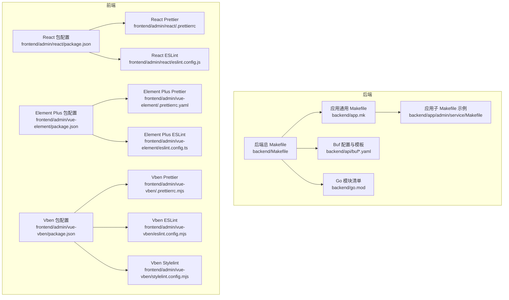
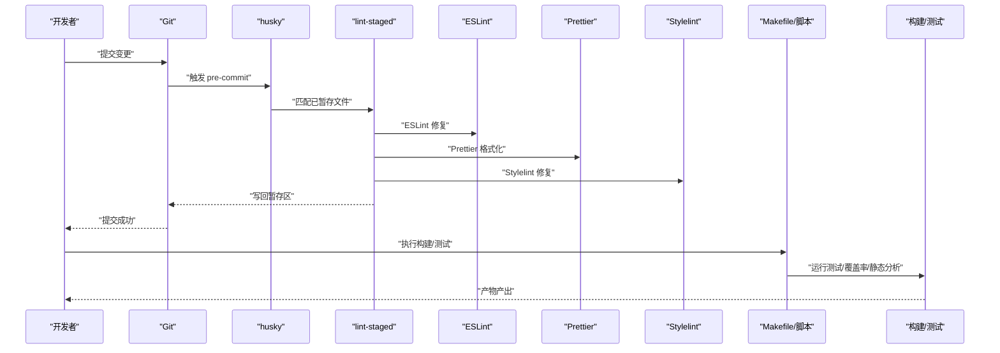
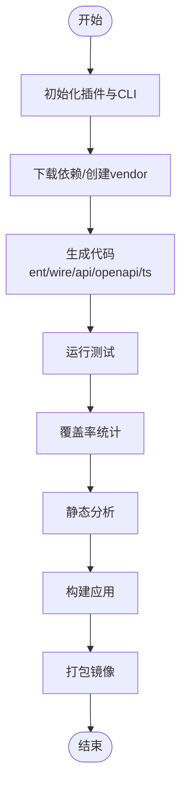
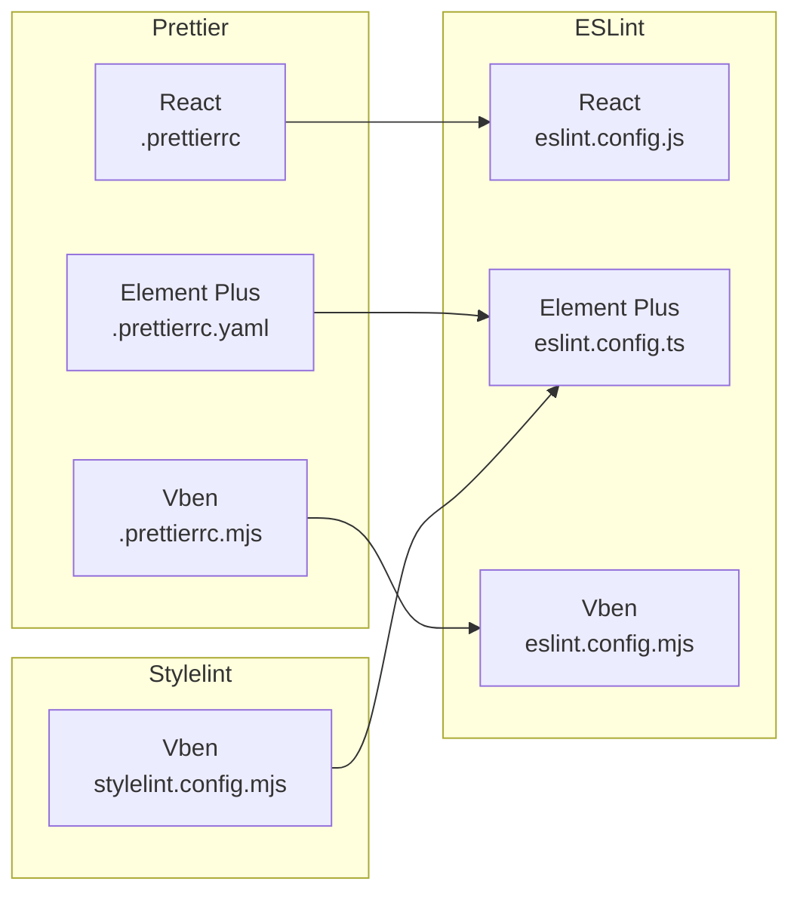
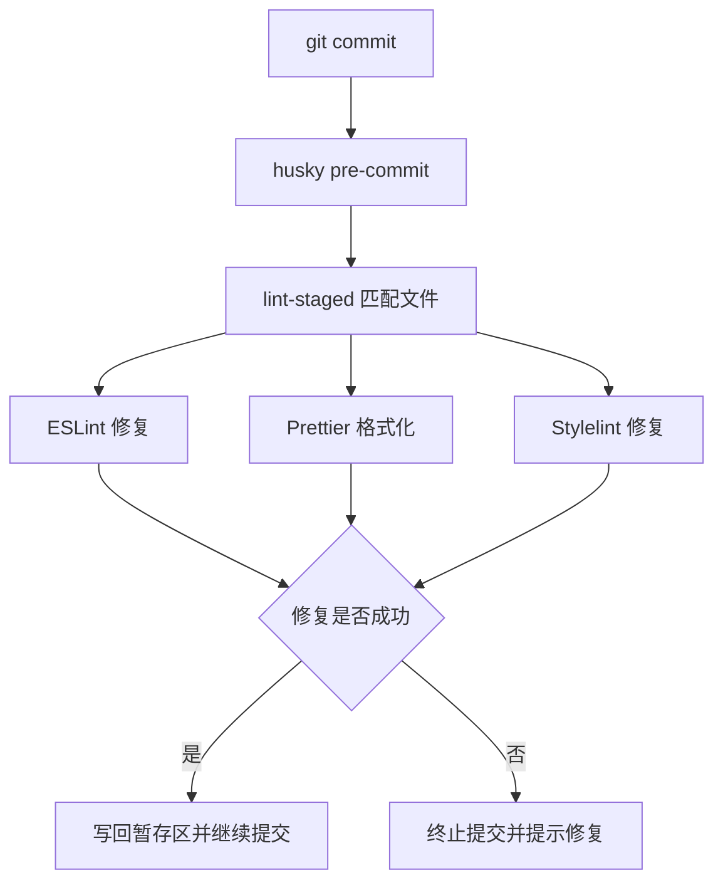
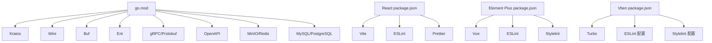

# 开发工具链

<cite>
**本文引用的文件**   
- [后端总 Makefile](file://backend/Makefile)
- [应用通用 Makefile](file://backend/app.mk)
- [应用服务子 Makefile（示例）](file://backend/app/admin/service/Makefile)
- [后端模块清单](file://backend/go.mod)
- [前端 React 项目配置](file://frontend/admin/react/package.json)
- [前端 Element Plus 项目配置](file://frontend/admin/vue-element/package.json)
- [前端 Vben 项目配置](file://frontend/admin/vue-vben/package.json)
- [React Prettier 配置](file://frontend/admin/react/.prettierrc)
- [Element Plus Prettier 配置](file://frontend/admin/vue-element/.prettierrc.yaml)
- [Vben Prettier 配置](file://frontend/admin/vue-vben/.prettierrc.mjs)
- [React ESLint 配置](file://frontend/admin/react/eslint.config.js)
- [Element Plus ESLint 配置](file://frontend/admin/vue-element/eslint.config.ts)
- [Vben ESLint 配置](file://frontend/admin/vue-vben/eslint.config.mjs)
- [Vben Stylelint 配置](file://frontend/admin/vue-vben/stylelint.config.mjs)
- [后端 Protobuf 构建配置](file://backend/api/buf.yaml)
- [后端 OpenAPI 生成模板](file://backend/api/buf.admin.openapi.gen.yaml)
- [后端 TypeScript 生成模板（Vben）](file://backend/api/buf.vue-vben.admin.typescript.gen.yaml)
- [后端 TypeScript 生成模板（Element）](file://backend/api/buf.vue-element.admin.typescript.gen.yaml)
- [后端脚本：部署到 PM2](file://backend/scripts/deploy/pm2_service.sh)
- [后端脚本：完整部署（Windows）](file://backend/scripts/docker/full_deploy.ps1)
- [后端脚本：完整部署（Unix）](file://backend/scripts/docker/full_deploy.sh)
- [后端脚本：依赖服务启动（Windows）](file://backend/scripts/docker/libs_only.ps1)
- [后端脚本：依赖服务启动（Unix）](file://backend/scripts/docker/libs_only.sh)
- [后端脚本：安装开发环境（Unix）](file://backend/scripts/env/install_unix_dev.sh)
- [后端脚本：安装生产环境（Unix）](file://backend/scripts/env/install_unix_prod.sh)
- [后端脚本：安装 Golang](file://backend/scripts/env/install_golang.sh)
</cite>

## 目录
1. [简介](#简介)
2. [项目结构](#项目结构)
3. [核心组件](#核心组件)
4. [架构总览](#架构总览)
5. [详细组件分析](#详细组件分析)
6. [依赖分析](#依赖分析)
7. [性能考虑](#性能考虑)
8. [故障排查指南](#故障排查指南)
9. [结论](#结论)
10. [附录](#附录)

## 简介
本文件面向 GoWind Admin 的开发团队，系统性梳理并说明开发工具链的配置与使用，覆盖以下方面：
- 后端与前端的构建与自动化：Makefile、脚本、包管理器与任务编排
- 代码规范工具：ESLint、Prettier、Stylelint 的规则与集成方式
- Git Hooks 与提交前检查：husky、lint-staged、commitizen 的工作流
- 调试与性能分析：IDE 配置要点、断点调试、性能分析建议
- 质量保障：单元测试、集成测试、覆盖率、静态分析
- 开发效率与最佳实践：环境准备、常用技巧与优化建议

## 项目结构
项目采用前后端分离的多框架方案：
- 后端基于 Go 微服务，使用 Kratos 框架与 Ent ORM，通过 Buf 进行 Protobuf 代码与 OpenAPI/TypeScript 生成
- 前端提供三套模板：React（Ant Design Pro）、Vue Element Plus、Vue Vben，分别对应不同的工程化与样式体系
- 工具链统一由 Makefile 与脚本驱动，配合包管理器（Go、npm/pnpm）完成依赖与构建

**图示来源**
- [后端总 Makefile:1-227](file://backend/Makefile#L1-L227)
- [应用通用 Makefile:1-164](file://backend/app.mk#L1-L164)
- [应用服务子 Makefile（示例）:1-1](file://backend/app/admin/service/Makefile#L1-L1)
- [后端模块清单:1-290](file://backend/go.mod#L1-L290)
- [后端 Protobuf 构建配置](file://backend/api/buf.yaml)
- [前端 React 项目配置:1-82](file://frontend/admin/react/package.json#L1-L82)
- [前端 Element Plus 项目配置:1-173](file://frontend/admin/vue-element/package.json#L1-L173)
- [前端 Vben 项目配置:1-118](file://frontend/admin/vue-vben/package.json#L1-L118)
- [React Prettier 配置:1-14](file://frontend/admin/react/.prettierrc#L1-L14)
- [Element Plus Prettier 配置:1-42](file://frontend/admin/vue-element/.prettierrc.yaml#L1-L42)
- [Vben Prettier 配置:1-2](file://frontend/admin/vue-vben/.prettierrc.mjs#L1-L2)
- [React ESLint 配置:1-140](file://frontend/admin/react/eslint.config.js#L1-L140)
- [Element Plus ESLint 配置:1-230](file://frontend/admin/vue-element/eslint.config.ts#L1-L230)
- [Vben ESLint 配置:1-6](file://frontend/admin/vue-vben/eslint.config.mjs#L1-L6)
- [Vben Stylelint 配置:1-5](file://frontend/admin/vue-vben/stylelint.config.mjs#L1-L5)

**章节来源**
- [后端总 Makefile:1-227](file://backend/Makefile#L1-L227)
- [应用通用 Makefile:1-164](file://backend/app.mk#L1-L164)
- [后端模块清单:1-290](file://backend/go.mod#L1-L290)

## 核心组件
- 后端构建与生成
  - 通过后端总 Makefile 调用各应用子 Makefile，实现统一的构建、测试、覆盖率、静态分析、代码生成（Ent/Wire/Protobuf/OpenAPI/TS）与容器化
  - 应用通用 Makefile 提供版本、Git 标签、构建参数与 Docker 打包能力
- 前端工程化
  - 三套前端模板均通过包管理器脚本统一执行开发、构建、类型检查、ESLint、Prettier、Stylelint 与测试
  - Vite/Vitest/TurboRun 等工具链贯穿开发体验
- 代码规范
  - Prettier：统一格式化策略（缩进、引号、行宽、换行符等）
  - ESLint：推荐规则与自定义规则组合，结合 Prettier 插件
  - Stylelint：Vben 模板使用共享配置，Element Plus 模板内置规则
- Git Hooks 与提交流程
  - husky + lint-staged：在提交前自动格式化与修复
  - commitizen：规范化提交信息

**章节来源**
- [后端总 Makefile:18-227](file://backend/Makefile#L18-L227)
- [应用通用 Makefile:73-164](file://backend/app.mk#L73-L164)
- [前端 React 项目配置:7-12](file://frontend/admin/react/package.json#L7-L12)
- [前端 Element Plus 项目配置:7-25](file://frontend/admin/vue-element/package.json#L7-L25)
- [前端 Vben 项目配置:7-34](file://frontend/admin/vue-vben/package.json#L7-L34)

## 架构总览
下图展示从本地开发到产物产出的关键流程：代码变更触发 Git Hooks，随后执行 Lint/Format/Test，最终进入构建与打包阶段。

**图示来源**
- [前端 Element Plus 项目配置:26-46](file://frontend/admin/vue-element/package.json#L26-L46)
- [前端 Vben 项目配置:93-116](file://frontend/admin/vue-vben/package.json#L93-L116)
- [后端总 Makefile:62-77](file://backend/Makefile#L62-L77)

## 详细组件分析

### 后端构建与代码生成（Makefile 与脚本）
- 总体目标
  - 初始化插件与 CLI、下载依赖、生成 Wire/Ent/Protobuf/OpenAPI/TS、运行测试/覆盖率/静态分析、构建与打包
- 关键流程
  - 插件与 CLI 安装：一次性安装 Protobuf、Kratos、Buf、Ent、golangci-lint 等
  - 依赖管理：go mod download/vendor
  - 代码生成：按顺序执行 ent、wire、api、openapi、ts
  - 构建与打包：逐应用执行 build/build_only、docker
  - 环境脚本：Windows/Unix 双栈的完整部署与依赖服务启动
- 适用场景
  - 本地开发：先生成再构建，确保接口与实体同步
  - CI/CD：统一的 all/build/build_only/targets

**图示来源**
- [后端总 Makefile:30-161](file://backend/Makefile#L30-L161)
- [应用通用 Makefile:113-144](file://backend/app.mk#L113-L144)

**章节来源**
- [后端总 Makefile:18-227](file://backend/Makefile#L18-L227)
- [应用通用 Makefile:73-164](file://backend/app.mk#L73-L164)

### 代码规范工具（ESLint、Prettier、Stylelint）
- Prettier
  - React：单引号、分号、大括号空格、行宽 100、2 空格缩进、LF 结尾、箭头函数括号等
  - Element Plus：更宽松的单双引号策略、HTML 敏感度、Vue 脚本缩进等
  - Vben：使用共享配置，集中维护
- ESLint
  - React：TypeScript + React Hooks + React Refresh 推荐规则，部分规则关闭以适配项目风格
  - Element Plus：Flat 配置，集成 Vue Parser、Prettier 插件，忽略大量类型与自动导入文件
  - Vben：使用 @vben/eslint-config，统一团队规则
- Stylelint
  - Vben：使用 @vben/stylelint-config，根目录启用
  - Element Plus：内置规则与插件，结合 Prettier 预设

**图示来源**
- [React Prettier 配置:1-14](file://frontend/admin/react/.prettierrc#L1-L14)
- [Element Plus Prettier 配置:1-42](file://frontend/admin/vue-element/.prettierrc.yaml#L1-L42)
- [Vben Prettier 配置:1-2](file://frontend/admin/vue-vben/.prettierrc.mjs#L1-L2)
- [React ESLint 配置:1-140](file://frontend/admin/react/eslint.config.js#L1-L140)
- [Element Plus ESLint 配置:1-230](file://frontend/admin/vue-element/eslint.config.ts#L1-L230)
- [Vben ESLint 配置:1-6](file://frontend/admin/vue-vben/eslint.config.mjs#L1-L6)
- [Vben Stylelint 配置:1-5](file://frontend/admin/vue-vben/stylelint.config.mjs#L1-L5)

**章节来源**
- [React Prettier 配置:1-14](file://frontend/admin/react/.prettierrc#L1-L14)
- [Element Plus Prettier 配置:1-42](file://frontend/admin/vue-element/.prettierrc.yaml#L1-L42)
- [Vben Prettier 配置:1-2](file://frontend/admin/vue-vben/.prettierrc.mjs#L1-L2)
- [React ESLint 配置:1-140](file://frontend/admin/react/eslint.config.js#L1-L140)
- [Element Plus ESLint 配置:1-230](file://frontend/admin/vue-element/eslint.config.ts#L1-L230)
- [Vben ESLint 配置:1-6](file://frontend/admin/vue-vben/eslint.config.mjs#L1-L6)
- [Vben Stylelint 配置:1-5](file://frontend/admin/vue-vben/stylelint.config.mjs#L1-L5)

### Git Hooks 与提交前检查
- husky + lint-staged
  - Element Plus：在 package.json 中定义 lint-staged，针对不同文件类型执行 ESLint、Prettier、Stylelint
  - Vben：同样在 package.json 中配置 lint-staged，覆盖 TS、Vue、SCSS/Less/HTML、JSON、Markdown
- 提交信息
  - Element Plus：使用 commitizen + cz-git；React：使用 commitlint + husky
- 工作流
  - 提交前自动修复与格式化，失败则阻止提交，确保仓库整洁

**图示来源**
- [前端 Element Plus 项目配置:26-46](file://frontend/admin/vue-element/package.json#L26-L46)
- [前端 Vben 项目配置:93-116](file://frontend/admin/vue-vben/package.json#L93-L116)
- [前端 React 项目配置:54-60](file://frontend/admin/react/package.json#L54-L60)

**章节来源**
- [前端 Element Plus 项目配置:26-46](file://frontend/admin/vue-element/package.json#L26-L46)
- [前端 Vben 项目配置:93-116](file://frontend/admin/vue-vben/package.json#L93-L116)
- [前端 React 项目配置:54-60](file://frontend/admin/react/package.json#L54-L60)

### 调试工具与性能分析
- IDE 配置
  - Go：Kratos 服务入口位于应用服务的 main.go，建议在 IDE 中配置运行参数（如配置目录、日志级别）
  - 前端：React/Vue 模板均通过 Vite 启动，建议在 IDE 中配置调试端口与断点
- 断点调试
  - 后端：使用 Delve（dlv）或 IDE 集成调试器附加进程
  - 前端：浏览器断点、React DevTools/Vue DevTools 辅助定位状态与渲染问题
- 性能分析
  - 后端：pprof 集成（可通过中间件或独立端点暴露），结合火焰图分析热点
  - 前端：Chrome DevTools Performance 面板、Vercel/Bundle 分析工具

[本节为通用指导，不直接分析具体文件，故无“章节来源”]

### 质量保证（测试、覆盖率、静态分析）
- 单元测试与集成测试
  - 后端：go test 覆盖所有包；应用通用 Makefile 提供测试目标
  - 前端：React/Vue 模板使用 Vitest（Vben 亦支持 Playwright），分别在各自 package.json 中定义测试脚本
- 覆盖率
  - 后端：go test -coverprofile=coverage.out 输出覆盖率文件
  - 前端：Vitest 默认支持覆盖率，可在项目配置中开启
- 静态分析
  - 后端：golangci-lint run；go vet
  - 前端：ESLint（含 Prettier 插件）与 Stylelint

**章节来源**
- [后端总 Makefile:62-77](file://backend/Makefile#L62-L77)
- [应用通用 Makefile:105-109](file://backend/app.mk#L105-L109)
- [前端 React 项目配置:7-12](file://frontend/admin/react/package.json#L7-L12)
- [前端 Vben 项目配置:30-33](file://frontend/admin/vue-vben/package.json#L30-L33)

### 开发环境优化与常用技巧
- 环境准备
  - 后端：一键安装开发/生产环境脚本，支持 Unix 系列；Windows 使用 PowerShell 脚本
  - 前端：Element Plus/Vben 建议使用 pnpm；React 使用 npm
- 常用技巧
  - 使用 Makefile 的 init 目标安装 Protobuf/Buf/Kratos/Ent/golangci-lint
  - 利用 lint-staged 在提交前自动修复，减少 CI 失败
  - 为不同模板选择合适的格式化与规则集，保持团队一致性
  - 后端生成代码后立即运行测试，确保接口契约一致

**章节来源**
- [后端总 Makefile:166-208](file://backend/Makefile#L166-L208)
- [前端 Element Plus 项目配置:166-172](file://frontend/admin/vue-element/package.json#L166-L172)
- [前端 Vben 项目配置:70-74](file://frontend/admin/vue-vben/package.json#L70-L74)

## 依赖分析
- 后端依赖
  - Kratos、Wire、Buf、Ent、gRPC、OpenAPI、MinIO、Redis、MySQL/PostgreSQL 等
  - 通过 go.mod 管理版本与间接依赖
- 前端依赖
  - React/Vue 生态、Vite、ESLint、Prettier、Stylelint、Vitest、Turbo 等
  - Vben 模板通过工作区与共享配置降低重复

**图示来源**
- [后端模块清单:5-65](file://backend/go.mod#L5-L65)
- [前端 React 项目配置:13-80](file://frontend/admin/react/package.json#L13-L80)
- [前端 Element Plus 项目配置:47-165](file://frontend/admin/vue-element/package.json#L47-L165)
- [前端 Vben 项目配置:35-68](file://frontend/admin/vue-vben/package.json#L35-L68)

**章节来源**
- [后端模块清单:1-290](file://backend/go.mod#L1-L290)
- [前端 React 项目配置:1-82](file://frontend/admin/react/package.json#L1-L82)
- [前端 Element Plus 项目配置:1-173](file://frontend/admin/vue-element/package.json#L1-L173)
- [前端 Vben 项目配置:1-118](file://frontend/admin/vue-vben/package.json#L1-L118)

## 性能考虑
- 后端
  - 使用 Ent 的隐私、SQL 修改器等特性提升查询与写入性能
  - gRPC/Protobuf 传输高效，结合 OpenAPI 文档便于前后端协作
- 前端
  - Vite 的快速冷启动与热更新显著提升开发体验
  - Vben 的 Turbo 构建与按需加载策略优化打包体积
- 通用
  - 在提交前进行格式化与修复，减少 CI 时间
  - 合理拆分测试用例，优先运行失败概率高的用例

[本节提供通用建议，不直接分析具体文件，故无“章节来源”]

## 故障排查指南
- 提交被拒绝
  - 检查 lint-staged 是否正确配置，确认 ESLint/Prettier/Stylelint 是否报错
  - 查看 husky 日志与终端输出，定位具体文件与规则
- 构建失败
  - 后端：确认插件与 CLI 是否安装成功，go.mod 是否完整
  - 前端：确认 Node 版本满足 engines 要求，pnpm/npm 缓存是否异常
- 生成代码不生效
  - 检查 Buf 模板与 api 目录权限，确认 api/openapi/ts 目标是否执行
- Docker 打包异常
  - 检查 Dockerfile 参数与上下文路径，确认构建参数 SERVICE_NAME/APP_VERSION 是否正确

**章节来源**
- [前端 Element Plus 项目配置:26-46](file://frontend/admin/vue-element/package.json#L26-L46)
- [前端 Vben 项目配置:93-116](file://frontend/admin/vue-vben/package.json#L93-L116)
- [后端总 Makefile:30-52](file://backend/Makefile#L30-L52)
- [后端脚本：完整部署（Unix）](file://backend/scripts/docker/full_deploy.sh)
- [后端脚本：完整部署（Windows）](file://backend/scripts/docker/full_deploy.ps1)

## 结论
本工具链通过 Makefile 与脚本统一了后端构建与生成流程，借助 Buf 实现跨语言的协议与文档生成；前端三套模板分别满足不同团队偏好，并通过 husky/lint-staged 保证提交质量。结合 ESLint/Prettier/Stylelint 与测试/覆盖率/静态分析，形成从本地到 CI 的闭环质量保障。建议团队在日常开发中遵循统一的格式化与提交规范，持续优化构建与测试效率。

[本节为总结性内容，不直接分析具体文件，故无“章节来源”]

## 附录
- 常用命令速查
  - 后端：make init、make dep、make gen、make test/cover/vet/lint、make build/docker
  - 前端：npm/pnpm run dev/build/lint/test，husky 预提交自动修复
- 脚本位置
  - 后端部署与环境脚本：scripts/env、scripts/docker、scripts/deploy
  - 前端模板脚本：各 package.json scripts 字段

**章节来源**
- [后端总 Makefile:210-227](file://backend/Makefile#L210-L227)
- [前端 React 项目配置:7-12](file://frontend/admin/react/package.json#L7-L12)
- [前端 Vben 项目配置:7-34](file://frontend/admin/vue-vben/package.json#L7-L34)
- [后端脚本：安装开发环境（Unix）](file://backend/scripts/env/install_unix_dev.sh)
- [后端脚本：安装生产环境（Unix）](file://backend/scripts/env/install_unix_prod.sh)
- [后端脚本：安装 Golang](file://backend/scripts/env/install_golang.sh)
- [后端脚本：部署到 PM2](file://backend/scripts/deploy/pm2_service.sh)
- [后端脚本：完整部署（Unix）](file://backend/scripts/docker/full_deploy.sh)
- [后端脚本：完整部署（Windows）](file://backend/scripts/docker/full_deploy.ps1)
- [后端脚本：依赖服务启动（Unix）](file://backend/scripts/docker/libs_only.sh)
- [后端脚本：依赖服务启动（Windows）](file://backend/scripts/docker/libs_only.ps1)