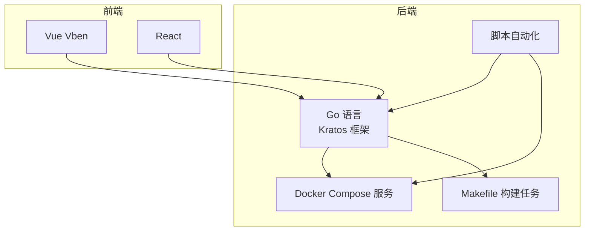
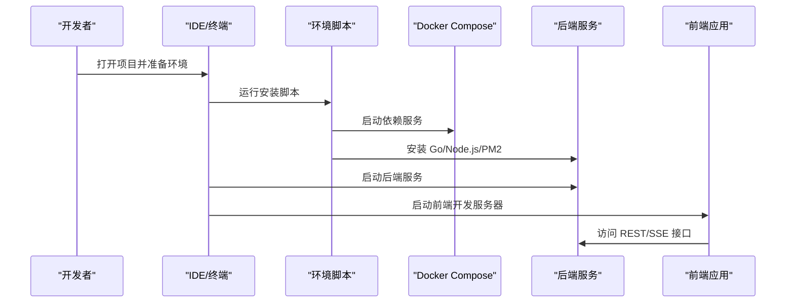
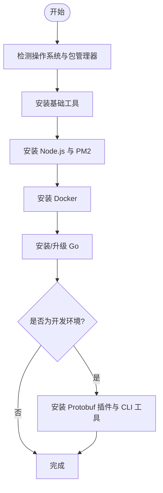
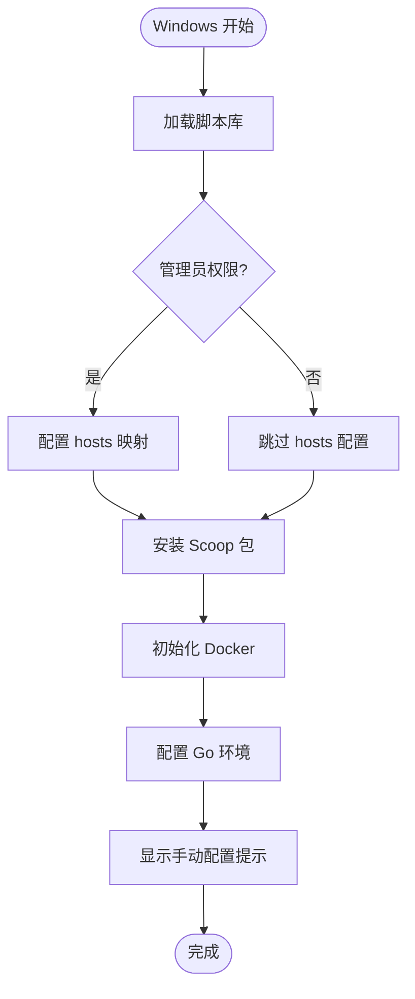
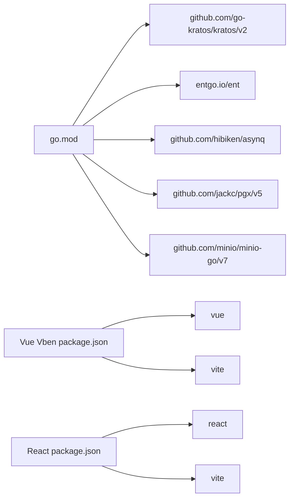

# 开发环境配置

<cite>
**本文引用的文件**
- [install_unix_prod.sh](file://backend/scripts/env/install_unix_prod.sh)
- [install_unix_dev.sh](file://backend/scripts/env/install_unix_dev.sh)
- [install_golang.sh](file://backend/scripts/env/install_golang.sh)
- [install_windows_dev.ps1](file://backend/scripts/env/install_windows_dev.ps1)
- [Makefile](file://backend/Makefile)
- [go.mod](file://backend/go.mod)
- [docker-compose.yaml](file://backend/docker-compose.yaml)
- [server.yaml](file://backend/app/admin/service/configs/server.yaml)
- [data.yaml](file://backend/app/admin/service/configs/data.yaml)
- [main.go](file://backend/app/admin/service/cmd/server/main.go)
- [package.json (Vue Vben)](file://frontend/admin/vue-vben/package.json)
- [package.json (React)](file://frontend/admin/react/package.json)
- [README.md (脚本)](file://backend/scripts/README.md)
</cite>

## 目录
1. [简介](#简介)
2. [项目结构](#项目结构)
3. [核心组件](#核心组件)
4. [架构概览](#架构概览)
5. [详细组件分析](#详细组件分析)
6. [依赖分析](#依赖分析)
7. [性能考虑](#性能考虑)
8. [故障排除指南](#故障排除指南)
9. [结论](#结论)
10. [附录](#附录)

## 简介
本指南面向 GoWind Admin 项目的开发者，提供跨平台（Unix/Linux/macOS 与 Windows）的开发环境配置方案。内容涵盖：
- 系统级工具与运行时安装（Go、Node.js、Docker）
- 项目依赖服务的容器化启动（PostgreSQL、Redis、MinIO）
- IDE 配置建议（VSCode、GoLand、WebStorm）
- 开发效率优化技巧与常用快捷键
- 常见问题排查与解决方案

## 项目结构
项目采用前后端分离架构，后端使用 Go 语言与 Kratos 框架，前端提供 Vue Vben 与 React 两种实现。后端通过 Makefile 与脚本统一管理环境准备、代码生成、构建与部署。

**图表来源**
- [Makefile:166-207](file://backend/Makefile#L166-L207)
- [docker-compose.yaml:5-125](file://backend/docker-compose.yaml#L5-L125)

**章节来源**
- [Makefile:1-227](file://backend/Makefile#L1-L227)
- [README.md (脚本):29-146](file://backend/scripts/README.md#L29-L146)

## 核心组件
- Go 运行时与开发工具链：通过独立脚本安装，支持版本检测与升级。
- Node.js 与包管理器：安装 Node.js LTS 与 PM2，适配 macOS/Linux 与 Windows。
- Docker 与依赖服务：一键启动数据库、缓存与对象存储等依赖。
- 项目构建与代码生成：Makefile 提供统一入口，集成 Protobuf、Ent、Wire 等生成任务。
- 前端工程：Vue Vben 与 React 两套前端实现，分别使用 pnpm 与 Vite。

**章节来源**
- [install_golang.sh:1-160](file://backend/scripts/env/install_golang.sh#L1-L160)
- [install_unix_prod.sh:187-239](file://backend/scripts/env/install_unix_prod.sh#L187-L239)
- [install_unix_dev.sh:28-95](file://backend/scripts/env/install_unix_dev.sh#L28-L95)
- [Makefile:30-110](file://backend/Makefile#L30-L110)
- [package.json (Vue Vben):70-74](file://frontend/admin/vue-vben/package.json#L70-L74)
- [package.json (React):70-74](file://frontend/admin/react/package.json#L70-L74)

## 架构概览
下图展示开发环境的关键交互：IDE/终端触发脚本与 Makefile，脚本负责安装工具与启动依赖容器；后端服务监听 REST 与 SSE 端口，前端通过代理访问后端接口。

**图表来源**
- [install_unix_prod.sh:373-420](file://backend/scripts/env/install_unix_prod.sh#L373-L420)
- [docker-compose.yaml:5-125](file://backend/docker-compose.yaml#L5-L125)
- [server.yaml:1-49](file://backend/app/admin/service/configs/server.yaml#L1-L49)

## 详细组件分析

### Unix/Linux/macOS 环境安装
- 自动检测系统与包管理器，安装基础工具、Node.js、Docker、Go，并配置开发工具链。
- 开发脚本额外安装 Protobuf 插件与 CLI 工具，便于本地代码生成与调试。
- 支持从脚本中扩展 Go 工具与插件列表，满足团队定制需求。

**图表来源**
- [install_unix_prod.sh:42-124](file://backend/scripts/env/install_unix_prod.sh#L42-L124)
- [install_unix_dev.sh:28-95](file://backend/scripts/env/install_unix_dev.sh#L28-L95)

**章节来源**
- [install_unix_prod.sh:1-422](file://backend/scripts/env/install_unix_prod.sh#L1-L422)
- [install_unix_dev.sh:1-150](file://backend/scripts/env/install_unix_dev.sh#L1-L150)

### Windows 环境安装
- 使用 PowerShell 脚本，通过 Scoop 安装 Git、Node.js、Go 等工具。
- 支持跳过 Docker 安装与自动确认参数，便于无人值守部署。
- 提示手动配置 GOPATH 与 PATH，确保 Go 工具链可用。

**图表来源**
- [install_windows_dev.ps1:1-80](file://backend/scripts/env/install_windows_dev.ps1#L1-L80)

**章节来源**
- [install_windows_dev.ps1:1-80](file://backend/scripts/env/install_windows_dev.ps1#L1-L80)

### Go 运行时安装
- 自动检测当前 Go 版本，下载最新稳定版并更新 PATH。
- 支持 zsh 与 bash 的环境变量写入，确保新开终端生效。
- 可作为独立脚本运行，或被其他脚本调用。

**章节来源**
- [install_golang.sh:1-160](file://backend/scripts/env/install_golang.sh#L1-L160)

### 依赖服务与配置
- Docker Compose 定义 PostgreSQL、Redis、MinIO 等服务，端口映射与环境变量集中管理。
- 后端服务配置文件包含 REST、SSE、Asynq 队列与 CORS、中间件等选项。
- 数据源配置支持 PostgreSQL，默认启用迁移与连接池参数。

**章节来源**
- [docker-compose.yaml:5-125](file://backend/docker-compose.yaml#L5-L125)
- [server.yaml:1-49](file://backend/app/admin/service/configs/server.yaml#L1-L49)
- [data.yaml:1-21](file://backend/app/admin/service/configs/data.yaml#L1-L21)

### 前端开发环境
- Vue Vben 与 React 前端均使用 pnpm 管理依赖，Node 版本要求较高（>=20.10.0）。
- 通过 Vite 启动开发服务器，支持热更新与代理转发。
- 建议在 IDE 中配置 TypeScript/JavaScript 语法检查与格式化规则。

**章节来源**
- [package.json (Vue Vben):70-74](file://frontend/admin/vue-vben/package.json#L70-L74)
- [package.json (React):70-74](file://frontend/admin/react/package.json#L70-L74)

## 依赖分析
- 后端 Go 版本：项目使用 Go 1.25.7，脚本会优先安装匹配版本或最新稳定版。
- 关键依赖：Kratos、Ent、Asynq、PostgreSQL/MySQL 驱动、MinIO SDK 等。
- 前端依赖：Vue 3、Vite、TypeScript、ESLint/Prettier 等。

**图表来源**
- [go.mod:3-65](file://backend/go.mod#L3-L65)
- [package.json (Vue Vben):67-68](file://frontend/admin/vue-vben/package.json#L67-L68)
- [package.json (React):32-37](file://frontend/admin/react/package.json#L32-L37)

**章节来源**
- [go.mod:1-290](file://backend/go.mod#L1-L290)
- [package.json (Vue Vben):1-118](file://frontend/admin/vue-vben/package.json#L1-L118)
- [package.json (React):1-82](file://frontend/admin/react/package.json#L1-L82)

## 性能考虑
- 数据库连接池：合理设置最大空闲与活动连接数，避免资源争用。
- 缓存策略：Redis 作为缓存层，注意键空间与过期策略。
- 日志与监控：开启必要的中间件与指标收集，便于定位性能瓶颈。
- 前端构建：使用 pnpm 与 Vite，合理拆分包与懒加载，减少首屏体积。

## 故障排除指南
- Docker 启动失败：检查 Docker 版本与权限，必要时以管理员身份运行。
- Go 插件缺失：通过脚本安装 Protobuf 插件与 CLI 工具，或在 IDE 中配置外部工具。
- 端口冲突：调整 docker-compose.yaml 中的端口映射，或停止占用进程。
- 网络连通性：确认容器网络与服务间 DNS 解析正常，检查防火墙设置。
- 前端依赖安装失败：升级 Node 版本至要求范围，清理缓存后重试。

**章节来源**
- [README.md (脚本):380-414](file://backend/scripts/README.md#L380-L414)

## 结论
通过统一的脚本与 Makefile，GoWind Admin 实现了跨平台的一键环境准备与服务编排。结合合理的 IDE 配置与性能优化实践，开发者可以快速搭建高效稳定的开发环境，专注于业务逻辑的实现与迭代。

## 附录

### 开发工具安装清单
- Unix/Linux/macOS
  - 基础工具：Git、Wget、JQ、Unzip、HTop、Curl
  - Node.js：22.x LTS（LTS 版本）
  - PM2：全局安装
  - Docker：Docker Engine + Compose
  - Go：1.25.x 或最新稳定版
- Windows
  - Scoop 包：Git、Node.js、Go、Wget、Unzip、Make
  - Docker Desktop（可选）
  - PowerShell 管理员权限

**章节来源**
- [install_unix_prod.sh:130-185](file://backend/scripts/env/install_unix_prod.sh#L130-L185)
- [install_windows_dev.ps1:56-64](file://backend/scripts/env/install_windows_dev.ps1#L56-L64)

### IDE 配置建议
- VSCode
  - Go 扩展：安装官方 Go 扩展，启用 vet、lint、测试与调试。
  - 前端扩展：Volar/Vetur、ESLint、Prettier、Tailwind CSS。
  - 设置：启用格式化、保存时自动修复、TypeScript 严格模式。
- GoLand
  - 语言级别：Go 1.25
  - 代码风格：使用 gofmt/goimports
  - 测试：内置测试框架与覆盖率报告
- WebStorm
  - Node.js 与 TypeScript 配置
  - ESLint/Prettier 集成
  - Vite 开发服务器配置

### 开发快捷键与技巧
- Go
  - 代码生成：make gen（Protobuf、Ent、Wire）
  - 依赖管理：make dep、make vendor
  - 测试与覆盖率：make test、make cover
  - Lint：make lint
- 前端
  - pnpm：安装依赖、构建、预览
  - Vite：热更新、代理转发、TypeScript 类型检查
- Docker
  - make docker-up：启动完整服务栈
  - make docker-libs：仅启动依赖服务
  - make docker-down：停止所有服务

**章节来源**
- [Makefile:16-124](file://backend/Makefile#L16-L124)
- [README.md (脚本):294-360](file://backend/scripts/README.md#L294-L360)