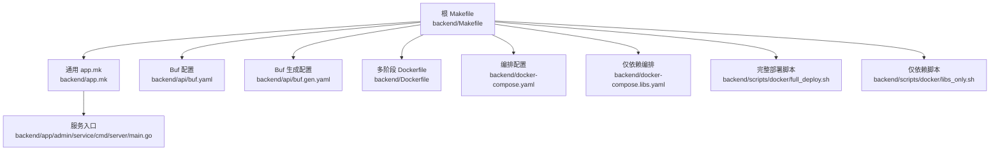
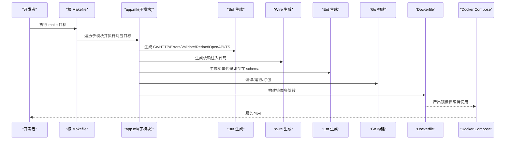
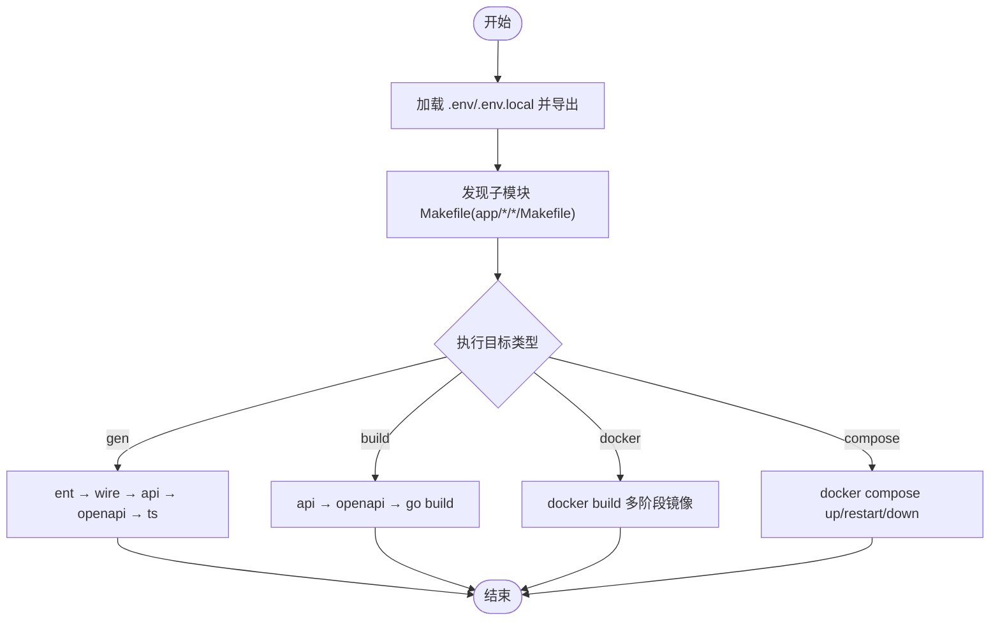
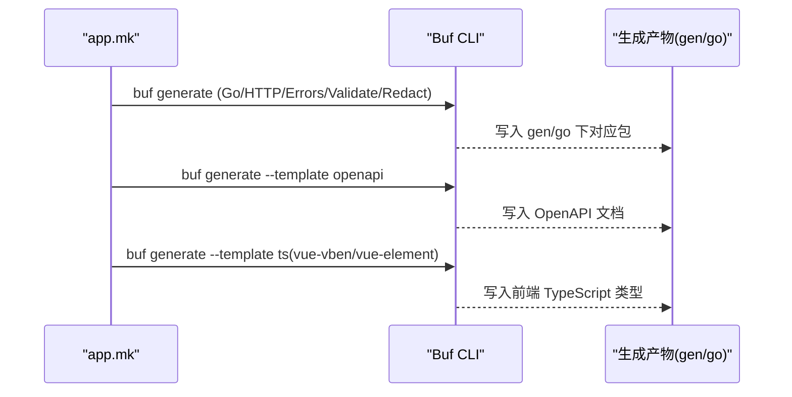
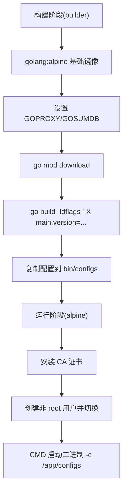
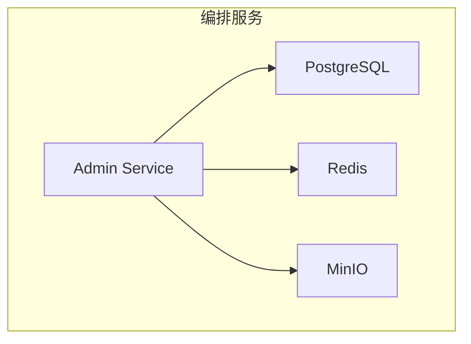
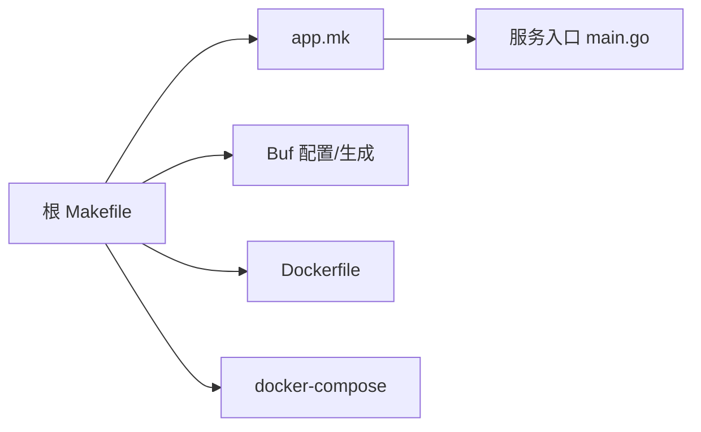

# 构建工具

<cite>
**本文引用的文件**
- [backend/Makefile](file://backend/Makefile)
- [backend/app.mk](file://backend/app.mk)
- [backend/Dockerfile](file://backend/Dockerfile)
- [backend/docker-compose.yaml](file://backend/docker-compose.yaml)
- [backend/docker-compose.libs.yaml](file://backend/docker-compose.libs.yaml)
- [backend/api/buf.yaml](file://backend/api/buf.yaml)
- [backend/api/buf.gen.yaml](file://backend/api/buf.gen.yaml)
- [backend/scripts/docker/full_deploy.sh](file://backend/scripts/docker/full_deploy.sh)
- [backend/scripts/docker/libs_only.sh](file://backend/scripts/docker/libs_only.sh)
- [backend/app/admin/service/cmd/server/main.go](file://backend/app/admin/service/cmd/server/main.go)
</cite>

## 目录
1. [简介](#简介)
2. [项目结构](#项目结构)
3. [核心组件](#核心组件)
4. [架构总览](#架构总览)
5. [详细组件分析](#详细组件分析)
6. [依赖分析](#依赖分析)
7. [性能考虑](#性能考虑)
8. [故障排查指南](#故障排查指南)
9. [结论](#结论)
10. [附录](#附录)

## 简介
本文件系统性梳理 GoWind Admin 项目的构建工具与流程，涵盖以下方面：
- Makefile 自动化构建流程：目标命令执行顺序、环境变量加载、依赖管理与子模块并行构建策略
- 代码生成工具链：Protobuf 代码生成、Wire 依赖注入代码生成、Ent ORM 代码生成
- Docker 容器化构建：单阶段与多阶段构建、镜像参数化、容器编排与启动脚本
- 构建优化技巧与常见问题解决方案，帮助开发者高效完成项目构建与交付

## 项目结构
项目采用“根 Makefile + 子模块 Makefile + 通用 app.mk”的分层构建组织方式：
- 根 Makefile 负责全局目标与子模块遍历执行
- app.mk 提供每个微服务应用的标准构建、生成、打包能力
- Dockerfile 与 docker-compose.* 提供容器化与编排能力
- api 目录下的 buf.* 配置驱动 Protobuf 代码生成与 OpenAPI 文档生成

图表来源
- [backend/Makefile:1-227](file://backend/Makefile#L1-L227)
- [backend/app.mk:1-164](file://backend/app.mk#L1-L164)
- [backend/Dockerfile:1-66](file://backend/Dockerfile#L1-L66)
- [backend/docker-compose.yaml:1-125](file://backend/docker-compose.yaml#L1-L125)
- [backend/docker-compose.libs.yaml:1-85](file://backend/docker-compose.libs.yaml#L1-L85)
- [backend/api/buf.yaml:1-26](file://backend/api/buf.yaml#L1-L26)
- [backend/api/buf.gen.yaml:1-96](file://backend/api/buf.gen.yaml#L1-L96)
- [backend/scripts/docker/full_deploy.sh:1-96](file://backend/scripts/docker/full_deploy.sh#L1-L96)
- [backend/scripts/docker/libs_only.sh:1-120](file://backend/scripts/docker/libs_only.sh#L1-L120)
- [backend/app/admin/service/cmd/server/main.go:1-76](file://backend/app/admin/service/cmd/server/main.go#L1-L76)

章节来源
- [backend/Makefile:1-227](file://backend/Makefile#L1-L227)
- [backend/app.mk:1-164](file://backend/app.mk#L1-L164)

## 核心组件
- 根构建入口与目标编排
  - 支持初始化、插件安装、CLI 工具安装、依赖下载与 vendor、测试、覆盖率、静态检查、代码生成、构建、Docker 构建、Compose 启停、PM2 部署等
  - 通过扫描 app/*/*/Makefile 自动发现子模块并并行执行对应目标
- 通用应用构建模板
  - 提供标准的 build/build_only/run/app/gen/ent/wire/api/openapi/docker 等目标
  - 通过 LDFLAGS 注入版本信息，支持 Git Tag 推导版本
- 代码生成体系
  - Protobuf：基于 buf 的多模板生成（Go/HTTP/Errors/Validate/Redact/OpenAPI/TypeScript）
  - Wire：在服务入口目录生成依赖注入代码
  - Ent：按需生成实体代码（当 internal/data/ent 存在时）
- 容器化与编排
  - 多阶段 Dockerfile：构建阶段使用 golang:alpine，运行阶段使用 alpine，最小化镜像体积
  - docker-compose：定义数据库、缓存、对象存储等依赖服务，以及应用服务
  - 启动脚本：full_deploy.sh 与 libs_only.sh 封装权限、卷与 compose 命令选择

章节来源
- [backend/Makefile:18-227](file://backend/Makefile#L18-L227)
- [backend/app.mk:73-164](file://backend/app.mk#L73-L164)
- [backend/api/buf.yaml:1-26](file://backend/api/buf.yaml#L1-L26)
- [backend/api/buf.gen.yaml:1-96](file://backend/api/buf.gen.yaml#L1-L96)
- [backend/Dockerfile:1-66](file://backend/Dockerfile#L1-L66)
- [backend/docker-compose.yaml:1-125](file://backend/docker-compose.yaml#L1-L125)
- [backend/docker-compose.libs.yaml:1-85](file://backend/docker-compose.libs.yaml#L1-L85)
- [backend/scripts/docker/full_deploy.sh:1-96](file://backend/scripts/docker/full_deploy.sh#L1-L96)
- [backend/scripts/docker/libs_only.sh:1-120](file://backend/scripts/docker/libs_only.sh#L1-L120)

## 架构总览
下图展示从 Makefile 到代码生成、构建与容器化的整体流程。

图表来源
- [backend/Makefile:78-137](file://backend/Makefile#L78-L137)
- [backend/app.mk:110-144](file://backend/app.mk#L110-L144)
- [backend/api/buf.gen.yaml:56-96](file://backend/api/buf.gen.yaml#L56-L96)
- [backend/Dockerfile:1-66](file://backend/Dockerfile#L1-L66)
- [backend/docker-compose.yaml:104-125](file://backend/docker-compose.yaml#L104-L125)

## 详细组件分析

### Makefile 自动化构建流程
- 目标执行顺序
  - 初始化：plugin/cli → 依赖下载 → 代码生成 → 构建
  - 代码生成：ent → wire → api → openapi → ts（按需）
  - 构建：build/build_only/app（含 api/openapi）
  - 容器化：docker（逐子模块）
  - 编排：compose-up/restart/down、docker-up/libs/down
- 环境变量配置
  - 自动加载 .env/.env.local（根与子模块），并导出
  - 版本号通过 Git Tag 推导，或显式传入 SERVICE_APP_VERSION
  - LDFLAGS 注入 main.version，用于二进制版本标识
- 依赖管理
  - go mod download / vendor
  - 子模块通过 app.mk 统一管理 GOFLAGS/LDFLAGS/GOVERSION/GOPATH
- 并行与遍历
  - 根 Makefile 递归发现 app/*/*/Makefile，逐个进入执行对应目标
  - 适合多服务并行构建与统一管理

图表来源
- [backend/Makefile:16-137](file://backend/Makefile#L16-L137)
- [backend/app.mk:75-144](file://backend/app.mk#L75-L144)

章节来源
- [backend/Makefile:18-227](file://backend/Makefile#L18-L227)
- [backend/app.mk:13-88](file://backend/app.mk#L13-L88)

### 代码生成工具链

#### Protobuf 代码生成（Buf）
- 配置与模板
  - buf.yaml：模块、Lint/Breaking 规则、外部依赖
  - buf.gen.yaml：生成插件与输出路径、go_package 前缀与按目录覆盖
- 生成范围
  - Go/HTTP/Errors/Validate/Redact/OpenAPI/TypeScript 等多模板
  - 通过 api 目录下的 buf generate 命令统一触发
- 生成顺序
  - app.mk 中 api/openapi/ts 目标分别调用不同模板
  - 根 Makefile 的 gen 目标统一触发 ent → wire → api → openapi

图表来源
- [backend/app.mk:129-137](file://backend/app.mk#L129-L137)
- [backend/Makefile:95-109](file://backend/Makefile#L95-L109)
- [backend/api/buf.gen.yaml:56-96](file://backend/api/buf.gen.yaml#L56-L96)
- [backend/api/buf.yaml:1-26](file://backend/api/buf.yaml#L1-L26)

章节来源
- [backend/api/buf.yaml:1-26](file://backend/api/buf.yaml#L1-L26)
- [backend/api/buf.gen.yaml:1-96](file://backend/api/buf.gen.yaml#L1-L96)
- [backend/Makefile:95-109](file://backend/Makefile#L95-L109)
- [backend/app.mk:129-137](file://backend/app.mk#L129-L137)

#### Wire 依赖注入代码生成
- 触发位置
  - app.mk 的 wire 目标在服务入口目录执行 wire 生成
  - 根 Makefile 的 wire 目标遍历子模块并执行
- 作用
  - 在服务启动前自动生成依赖注入初始化代码，降低样板代码

章节来源
- [backend/app.mk:125-127](file://backend/app.mk#L125-L127)
- [backend/Makefile:78-83](file://backend/Makefile#L78-L83)

#### Ent ORM 代码生成
- 触发条件
  - app.mk 的 ent 目标检测 internal/data/ent 是否存在，存在则执行 ent generate
- 生成特性
  - 启用 privacy、entql、sql/modifier、sql/upsert、sql/lock 等特性
- 与构建集成
  - app 目标自动包含 ent；gen 目标也包含 ent

章节来源
- [backend/app.mk:113-123](file://backend/app.mk#L113-L123)
- [backend/Makefile:85-90](file://backend/Makefile#L85-L90)

### Docker 容器化构建流程

#### 多阶段构建
- 构建阶段（builder）
  - 基础镜像：golang:alpine
  - 设置 GOPROXY 与 GOSUMDB，加速依赖下载并规避校验问题
  - 编译 Linux amd64 二进制，并注入版本信息
  - 复制配置文件至 bin/configs
- 运行阶段
  - 基础镜像：alpine
  - 安装 CA 证书，创建非 root 用户，切换用户
  - CMD 启动二进制并指定配置目录

图表来源
- [backend/Dockerfile:1-66](file://backend/Dockerfile#L1-L66)

章节来源
- [backend/Dockerfile:1-66](file://backend/Dockerfile#L1-L66)

#### 镜像构建与参数化
- 参数
  - GO_VERSION、SERVICE_NAME、APP_VERSION（通过 Docker build args 注入）
- 构建命令
  - app.mk 的 docker 目标统一调用 docker build，传递参数与 Dockerfile 路径

章节来源
- [backend/app.mk:139-144](file://backend/app.mk#L139-L144)
- [backend/Dockerfile:6-10](file://backend/Dockerfile#L6-L10)

#### 容器编排与启动脚本
- docker-compose.yaml
  - 定义 postgres、redis、minio 等依赖服务
  - 定义 admin-service 应用服务，使用本地镜像（pull_policy: never），映射端口，依赖关系明确
- docker-compose.libs.yaml
  - 仅包含依赖服务，便于本地开发时独立启动
- 启动脚本
  - full_deploy.sh：完整部署（应用+依赖），自动准备数据卷与权限，选择 docker compose 或 docker-compose
  - libs_only.sh：仅启动依赖，便于本地 IDE 运行应用

图表来源
- [backend/docker-compose.yaml:5-125](file://backend/docker-compose.yaml#L5-L125)
- [backend/docker-compose.libs.yaml:1-85](file://backend/docker-compose.libs.yaml#L1-L85)
- [backend/scripts/docker/full_deploy.sh:1-96](file://backend/scripts/docker/full_deploy.sh#L1-L96)
- [backend/scripts/docker/libs_only.sh:1-120](file://backend/scripts/docker/libs_only.sh#L1-L120)

章节来源
- [backend/docker-compose.yaml:104-125](file://backend/docker-compose.yaml#L104-L125)
- [backend/docker-compose.libs.yaml:1-85](file://backend/docker-compose.libs.yaml#L1-L85)
- [backend/scripts/docker/full_deploy.sh:1-96](file://backend/scripts/docker/full_deploy.sh#L1-L96)
- [backend/scripts/docker/libs_only.sh:1-120](file://backend/scripts/docker/libs_only.sh#L1-L120)

### 服务入口与运行参数
- main.go
  - 通过 bootstrap.NewContext 注入 AppInfo（Project/AppId/Version）
  - 二进制支持通过 ldflags 注入版本号，便于运行时查看
- 运行方式
  - app.mk 的 run 目标直接 go run 启动服务，指定配置目录
  - docker CMD 启动时同样传入配置目录

章节来源
- [backend/app/admin/service/cmd/server/main.go:42-75](file://backend/app/admin/service/cmd/server/main.go#L42-L75)
- [backend/app.mk:98-100](file://backend/app.mk#L98-L100)
- [backend/Dockerfile:64-65](file://backend/Dockerfile#L64-L65)

## 依赖分析
- 组件耦合
  - 根 Makefile 与 app.mk 解耦：根负责遍历与编排，app.mk 提供标准化能力
  - 代码生成工具链与构建解耦：buf/wire/ent 通过各自目标被统一触发
  - 容器化与编排解耦：Dockerfile 与 docker-compose 独立维护
- 外部依赖
  - Go 生态：kratos、wire、ent、buf、golangci-lint 等
  - 运行时依赖：PostgreSQL、Redis、MinIO 等
- 潜在循环依赖
  - 未见直接循环依赖；生成目标与构建目标通过 Makefile 层级控制执行顺序

图表来源
- [backend/Makefile:16-137](file://backend/Makefile#L16-L137)
- [backend/app.mk:73-144](file://backend/app.mk#L73-L144)
- [backend/Dockerfile:1-66](file://backend/Dockerfile#L1-L66)
- [backend/docker-compose.yaml:1-125](file://backend/docker-compose.yaml#L1-L125)
- [backend/app/admin/service/cmd/server/main.go:1-76](file://backend/app/admin/service/cmd/server/main.go#L1-L76)

章节来源
- [backend/Makefile:16-137](file://backend/Makefile#L16-L137)
- [backend/app.mk:73-144](file://backend/app.mk#L73-L144)

## 性能考虑
- 依赖下载优化
  - 使用 GOPROXY=https://goproxy.cn,direct 加速下载
  - 关闭 GOSUMDB 校验以避免网络问题导致的失败
- 构建并行化
  - 根 Makefile 递归遍历子模块，可在多核环境下并行提升效率
- 二进制体积与启动时间
  - 多阶段构建仅保留运行时所需文件，减少镜像体积
  - CGO_ENABLED=0 生成纯 Go 二进制，提升跨平台兼容性与启动速度
- 生成阶段缓存
  - 仅在 schema 或 proto 变更时触发 ent/wire/api/openapi，避免重复生成

章节来源
- [backend/Dockerfile:18-27](file://backend/Dockerfile#L18-L27)
- [backend/Makefile:16-137](file://backend/Makefile#L16-L137)
- [backend/app.mk:113-123](file://backend/app.mk#L113-L123)

## 故障排查指南
- 环境变量未生效
  - 确认 .env/.env.local 是否存在且被正确 include/export
  - 子模块 .env 由 app.mk 自动加载
- 依赖下载失败
  - 检查 GOPROXY 与 GOSUMDB 设置，必要时切换网络或代理
- Wire 生成失败
  - 确认服务入口目录存在并已初始化 wire 包
- Ent 生成失败
  - 确认 internal/data/ent/schema 存在且符合 ent 语法
- Protobuf 生成异常
  - 检查 buf.yaml/buf.gen.yaml 配置是否正确，插件是否安装
- Docker 构建失败
  - 确认 Dockerfile 路径与 build-args 传递正确
  - 检查镜像构建上下文与权限
- Compose 启动失败
  - 确认 docker compose 命令可用（v2 插件或 docker-compose）
  - 检查端口占用与数据卷权限

章节来源
- [backend/Makefile:7-11](file://backend/Makefile#L7-L11)
- [backend/app.mk:7-11](file://backend/app.mk#L7-L11)
- [backend/Dockerfile:18-27](file://backend/Dockerfile#L18-L27)
- [backend/scripts/docker/full_deploy.sh:83-92](file://backend/scripts/docker/full_deploy.sh#L83-L92)
- [backend/scripts/docker/libs_only.sh:107-116](file://backend/scripts/docker/libs_only.sh#L107-L116)

## 结论
本项目通过根 Makefile 与 app.mk 的协同，实现了对多微服务的一致化构建与管理；借助 Buf、Wire、Ent 等工具链，形成从协议到 ORM 的完整代码生成闭环；结合多阶段 Dockerfile 与 docker-compose，提供了稳定高效的容器化与编排能力。遵循本文档的流程与最佳实践，可显著提升构建效率与可维护性。

## 附录
- 常用命令速查
  - 初始化与安装：make init
  - 代码生成：make gen
  - 构建：make build 或 make app
  - Docker 构建：make docker
  - 启动依赖：make docker-libs 或使用脚本 scripts/docker/libs_only.sh
  - 启动完整栈：make docker-up 或使用脚本 scripts/docker/full_deploy.sh
- 版本注入
  - 通过 LDFLAGS 注入 main.version，支持 Git Tag 推导或显式传参

章节来源
- [backend/Makefile:28-208](file://backend/Makefile#L28-L208)
- [backend/app.mk:65-67](file://backend/app.mk#L65-L67)