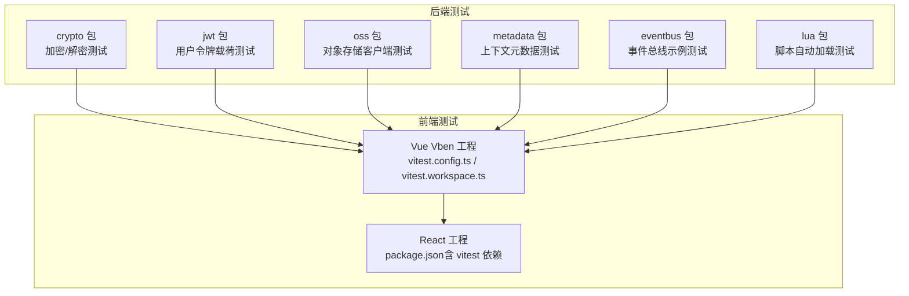
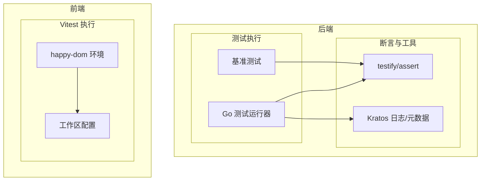
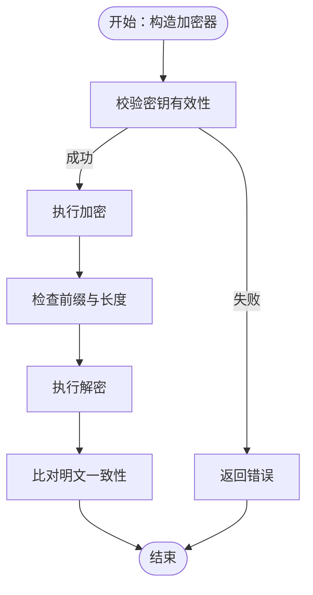
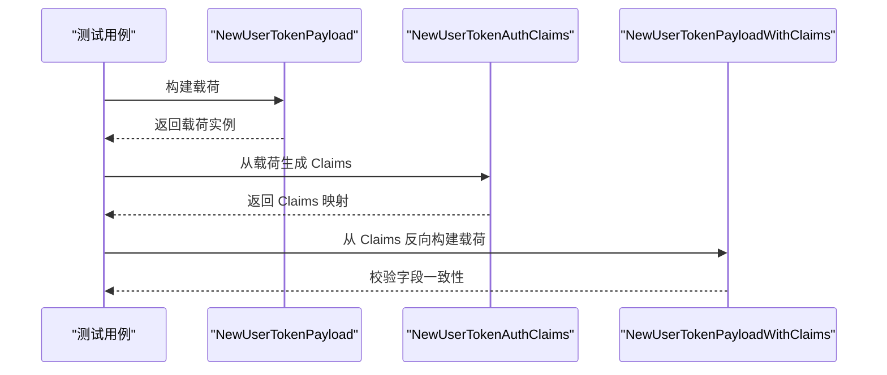
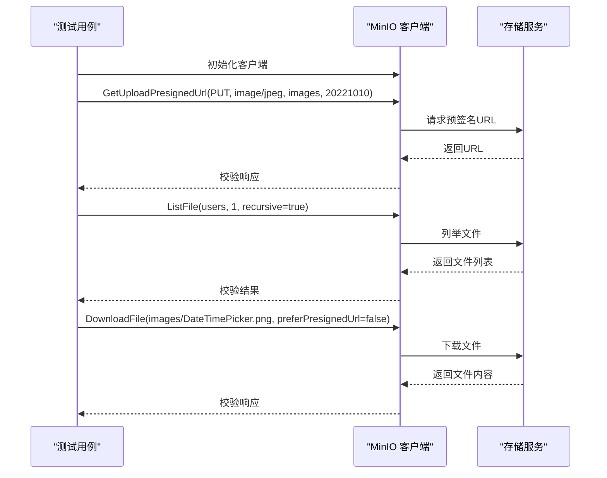
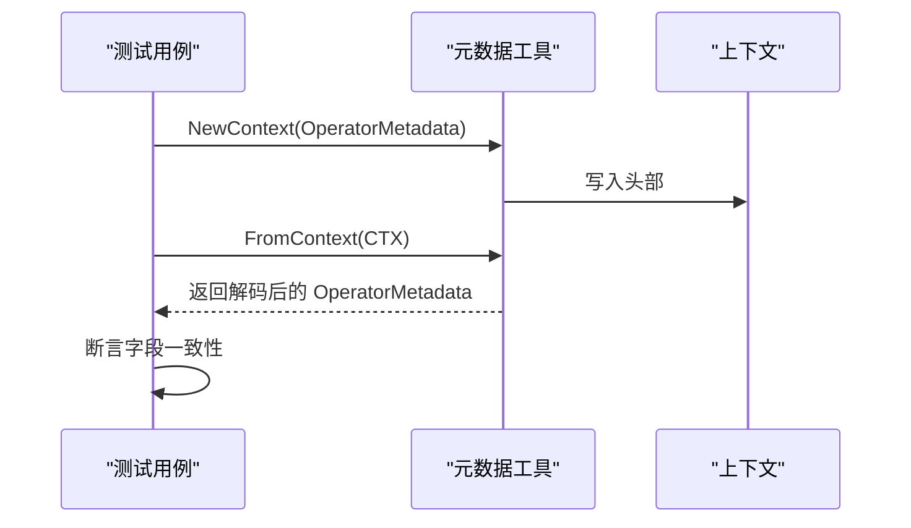
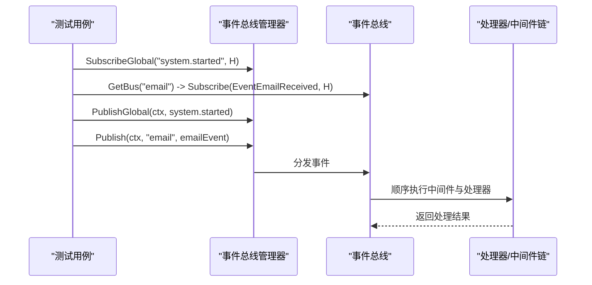
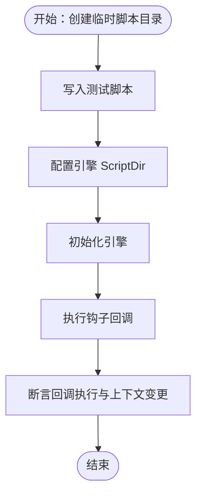
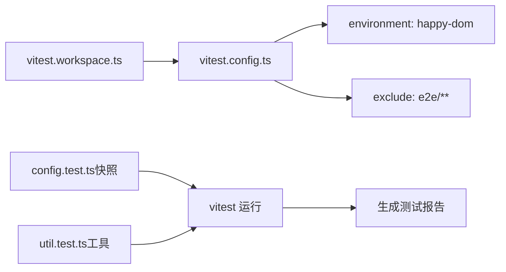
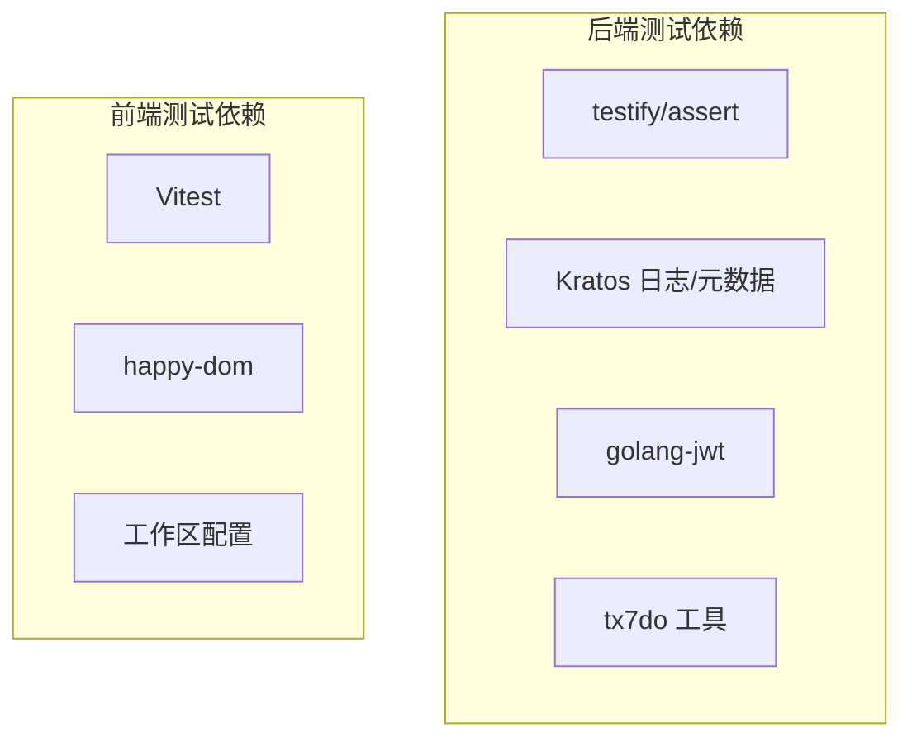

# 测试框架

<cite>
**本文引用的文件**
- [aes_gcm_test.go](file://backend/pkg/crypto/aes_gcm_test.go)
- [example_test.go](file://backend/pkg/crypto/example_test.go)
- [payload_test.go](file://backend/pkg/crypto/payload_test.go)
- [user_token_payload_test.go](file://backend/pkg/jwt/user_token_payload_test.go)
- [minio_test.go](file://backend/pkg/oss/minio_test.go)
- [metadata_test.go](file://backend/pkg/metadata/metadata_test.go)
- [example_test.go](file://backend/pkg/eventbus/example_test.go)
- [engine_autoload_test.go](file://backend/pkg/lua/engine_autoload_test.go)
- [vitest.config.ts](file://frontend/admin/vue-vben/vitest.config.ts)
- [vitest.workspace.ts](file://frontend/admin/vue-vben/vitest.workspace.ts)
- [config.test.ts](file://frontend/admin/vue-vben/packages/@core/preferences/__tests__/config.test.ts)
- [util.test.ts](file://frontend/admin/vue-vben/packages/@core/base/shared/src/utils/__tests__/util.test.ts)
- [package.json（Vue Vben）](file://frontend/admin/vue-vben/package.json)
- [package.json（React）](file://frontend/admin/react/package.json)
</cite>

## 目录
1. [引言](#引言)
2. [项目结构](#项目结构)
3. [核心组件](#核心组件)
4. [架构总览](#架构总览)
5. [详细组件分析](#详细组件分析)
6. [依赖分析](#依赖分析)
7. [性能考虑](#性能考虑)
8. [故障排查指南](#故障排查指南)
9. [结论](#结论)
10. [附录](#附录)

## 引言
本文件面向 GoWind Admin 的测试体系，系统化梳理后端 Go 单元测试与基准测试、前端 Vitest 单元测试与快照测试、以及可扩展的集成与端到端测试思路。内容覆盖测试文件命名规范、测试函数结构、Mock 对象与外部依赖处理、覆盖率统计与分析、以及测试自动化与持续集成建议，帮助团队建立完善、可维护、可扩展的测试体系。

## 项目结构
- 后端测试集中在各模块包内，遵循 Go 标准命名规范：以 _test.go 结尾的文件即为该包的测试文件；部分示例测试以 example_test.go 命名，用于展示典型用法与行为。
- 前端测试采用 Vitest，Vue Vben 工程通过 vitest.config.ts 配置 DOM 环境与排除规则，通过 vitest.workspace.ts 将配置工作区化；React 工程在 package.json 中声明了 vitest 依赖与脚本入口。

**图表来源**
- [vitest.config.ts:1-12](file://frontend/admin/vue-vben/vitest.config.ts#L1-L12)
- [vitest.workspace.ts:1-4](file://frontend/admin/vue-vben/vitest.workspace.ts#L1-L4)
- [package.json（Vue Vben）:1-118](file://frontend/admin/vue-vben/package.json#L1-L118)
- [package.json（React）:1-82](file://frontend/admin/react/package.json#L1-L82)

**章节来源**
- [vitest.config.ts:1-12](file://frontend/admin/vue-vben/vitest.config.ts#L1-L12)
- [vitest.workspace.ts:1-4](file://frontend/admin/vue-vben/vitest.workspace.ts#L1-L4)
- [package.json（Vue Vben）:1-118](file://frontend/admin/vue-vben/package.json#L1-L118)
- [package.json（React）:1-82](file://frontend/admin/react/package.json#L1-L82)

## 核心组件
- 后端 Go 测试
  - 加密与载荷：覆盖构造器校验、加解密正确性、兼容旧格式、不同密钥差异、以及基准测试。
  - JWT 用户令牌：验证载荷字段映射、Claims 转换、角色与数据范围等。
  - 对象存储：预签名上传 URL 获取、文件列表与下载。
  - 元数据上下文：OperatorMetadata 编解码、缺失或非法头处理、读写往返。
  - 事件总线：订阅/发布、中间件链、异步处理器、过滤器、一次性订阅、处理器链等。
  - Lua 引擎：脚本目录自动加载、钩子回调执行、无脚本目录初始化。
- 前端 Vitest 测试
  - 快照测试：保证默认配置不可变。
  - 工具函数测试：方法绑定、嵌套值获取等。
  - 配置与运行：DOM 环境、排除 e2e、工作区化配置。

**章节来源**
- [aes_gcm_test.go:1-234](file://backend/pkg/crypto/aes_gcm_test.go#L1-L234)
- [payload_test.go:1-282](file://backend/pkg/crypto/payload_test.go#L1-L282)
- [user_token_payload_test.go:1-158](file://backend/pkg/jwt/user_token_payload_test.go#L1-L158)
- [minio_test.go:1-76](file://backend/pkg/oss/minio_test.go#L1-L76)
- [metadata_test.go:1-107](file://backend/pkg/metadata/metadata_test.go#L1-L107)
- [example_test.go:1-242](file://backend/pkg/eventbus/example_test.go#L1-L242)
- [engine_autoload_test.go:1-86](file://backend/pkg/lua/engine_autoload_test.go#L1-L86)
- [config.test.ts:1-11](file://frontend/admin/vue-vben/packages/@core/preferences/__tests__/config.test.ts#L1-L11)
- [util.test.ts:1-157](file://frontend/admin/vue-vben/packages/@core/base/shared/src/utils/__tests__/util.test.ts#L1-L157)

## 架构总览
后端测试围绕“模块化”与“最小依赖”原则组织，每个包内的测试文件仅依赖必要的外部库（如 testify 断言、Kratos 日志与元数据），并通过基准测试评估关键路径性能。前端测试通过 Vitest 在 happy-dom 环境中运行，结合工作区配置实现多包统一管理。

**图表来源**
- [user_token_payload_test.go:1-158](file://backend/pkg/jwt/user_token_payload_test.go#L1-L158)
- [metadata_test.go:1-107](file://backend/pkg/metadata/metadata_test.go#L1-L107)
- [vitest.config.ts:1-12](file://frontend/admin/vue-vben/vitest.config.ts#L1-L12)
- [vitest.workspace.ts:1-4](file://frontend/admin/vue-vben/vitest.workspace.ts#L1-L4)

## 详细组件分析

### 后端 Go 测试：加密与载荷（crypto）
- 测试要点
  - 构造器参数校验：空密钥应报错，有效密钥应成功创建。
  - 加解密流程：明文与密文格式检查、不同输入类型（JSON、特殊字符、Unicode）覆盖、解密一致性校验。
  - 兼容性：未加密数据透传、无效密文错误处理。
  - 载荷加密：保留任务元数据、敏感字段不落盘、嵌套结构比较。
  - 性能：基准测试评估加解密吞吐。
- 最佳实践
  - 使用表驱动测试提升可读性与覆盖面。
  - 使用基准测试定位热点路径。
  - 对外部依赖（如全局加密器）进行初始化与清理。

**图表来源**
- [aes_gcm_test.go:8-103](file://backend/pkg/crypto/aes_gcm_test.go#L8-L103)
- [payload_test.go:8-103](file://backend/pkg/crypto/payload_test.go#L8-L103)

**章节来源**
- [aes_gcm_test.go:1-234](file://backend/pkg/crypto/aes_gcm_test.go#L1-L234)
- [payload_test.go:1-282](file://backend/pkg/crypto/payload_test.go#L1-L282)
- [example_test.go:1-149](file://backend/pkg/crypto/example_test.go#L1-L149)

### 后端 Go 测试：JWT 用户令牌载荷（jwt）
- 测试要点
  - 载荷构建：用户名、用户ID、租户ID、客户端ID、设备ID、角色、数据范围、组织单元等字段映射。
  - Claims 转换：从自定义载荷到 AuthClaims、jwt.MapClaims 的双向转换。
  - 类型兼容：JSON 数字类型（float64）与整数的兼容处理。
- 最佳实践
  - 使用断言库进行细粒度断言，避免字符串拼接。
  - 对可选字段进行存在性与值双重校验。

**图表来源**
- [user_token_payload_test.go:14-115](file://backend/pkg/jwt/user_token_payload_test.go#L14-L115)

**章节来源**
- [user_token_payload_test.go:1-158](file://backend/pkg/jwt/user_token_payload_test.go#L1-L158)

### 后端 Go 测试：对象存储（oss）
- 测试要点
  - 客户端初始化：配置 MinIO 连接信息。
  - 预签名上传 URL：PUT 方法、内容类型、桶名、目录。
  - 文件列举与下载：递归查询、对象选择器、直链下载。
- 最佳实践
  - 使用本地或容器化 MinIO 进行集成测试。
  - 对请求参数进行边界与异常场景覆盖。

**图表来源**
- [minio_test.go:30-75](file://backend/pkg/oss/minio_test.go#L30-L75)

**章节来源**
- [minio_test.go:1-76](file://backend/pkg/oss/minio_test.go#L1-L76)

### 后端 Go 测试：元数据上下文（metadata）
- 测试要点
  - 缺失或非法头：断言错误与空返回。
  - 正常编解码：OperatorMetadata 字段完整性校验。
  - 读写往返：从上下文提取与写入的一致性。
- 最佳实践
  - 使用 Kratos 元数据工具进行头注入与读取。
  - 对 Base64 编码与 Protobuf 序列化进行边界测试。

**图表来源**
- [metadata_test.go:71-106](file://backend/pkg/metadata/metadata_test.go#L71-L106)

**章节来源**
- [metadata_test.go:1-107](file://backend/pkg/metadata/metadata_test.go#L1-L107)

### 后端 Go 测试：事件总线（eventbus）
- 测试要点
  - 基本发布/订阅：事件类型与数据传递。
  - 类型化事件：GetData 反序列化与结构体断言。
  - 中间件：日志、恢复、超时等链式组合。
  - 异步处理：发布立即返回，后台协程执行。
  - 过滤器与一次性订阅：优先级过滤、单次触发。
  - 处理器链：多步骤串联执行。
- 最佳实践
  - 使用 Manager 管理多个命名总线，便于隔离与统计。
  - 对异步处理器使用等待策略或时间片验证。

**图表来源**
- [example_test.go:95-127](file://backend/pkg/eventbus/example_test.go#L95-L127)

**章节来源**
- [example_test.go:1-242](file://backend/pkg/eventbus/example_test.go#L1-L242)

### 后端 Go 测试：Lua 引擎自动加载（lua）
- 测试要点
  - 自动加载：配置 ScriptDir 后脚本自动注册钩子。
  - 回调执行：钩子回调设置上下文标志位。
  - 边界条件：无脚本目录、非存在目录初始化。
- 最佳实践
  - 使用临时目录隔离测试脚本，避免污染环境。
  - 对钩子名称与回调签名进行严格约束。

**图表来源**
- [engine_autoload_test.go:12-61](file://backend/pkg/lua/engine_autoload_test.go#L12-L61)

**章节来源**
- [engine_autoload_test.go:1-86](file://backend/pkg/lua/engine_autoload_test.go#L1-L86)

### 前端测试：Vitest 配置与示例（Vue Vben）
- 配置要点
  - 环境：happy-dom 提供 DOM API 支持。
  - 排除：默认排除 e2e 目录，避免误测。
  - 工作区：通过 vitest.workspace.ts 将配置集中管理。
- 示例测试
  - 快照测试：保证默认配置对象不可变。
  - 工具函数测试：bindMethods 与 getNestedValue 的行为验证。
- 最佳实践
  - 将测试文件放置于 __tests__ 目录，命名与被测模块一一对应。
  - 使用 describe/it 组织测试用例，配合 expect 断言。

**图表来源**
- [vitest.config.ts:1-12](file://frontend/admin/vue-vben/vitest.config.ts#L1-L12)
- [vitest.workspace.ts:1-4](file://frontend/admin/vue-vben/vitest.workspace.ts#L1-L4)
- [config.test.ts:1-11](file://frontend/admin/vue-vben/packages/@core/preferences/__tests__/config.test.ts#L1-L11)
- [util.test.ts:1-157](file://frontend/admin/vue-vben/packages/@core/base/shared/src/utils/__tests__/util.test.ts#L1-L157)

**章节来源**
- [vitest.config.ts:1-12](file://frontend/admin/vue-vben/vitest.config.ts#L1-L12)
- [vitest.workspace.ts:1-4](file://frontend/admin/vue-vben/vitest.workspace.ts#L1-L4)
- [config.test.ts:1-11](file://frontend/admin/vue-vben/packages/@core/preferences/__tests__/config.test.ts#L1-L11)
- [util.test.ts:1-157](file://frontend/admin/vue-vben/packages/@core/base/shared/src/utils/__tests__/util.test.ts#L1-L157)

### 前端测试：React 工程（依赖与脚本）
- 依赖与脚本
  - vitest 作为开发依赖，提供单元测试能力。
  - jsdom 作为 DOM 环境替代方案（在 React 工程中常见）。
- 最佳实践
  - 在 React 工程中结合 React Testing Library 或 @testing-library/react 进行组件测试。
  - 使用 Mock 与工厂模式隔离外部依赖。

**章节来源**
- [package.json（React）:1-82](file://frontend/admin/react/package.json#L1-L82)

## 依赖分析
- 后端测试依赖
  - testify/assert：断言与错误报告。
  - Kratos 日志与元数据：上下文与日志记录。
  - golang-jwt：JWT Claims 生成与解析。
  - tx7do 工具：类型转换与指针辅助。
- 前端测试依赖
  - Vitest：测试运行器与 DOM 环境（happy-dom）。
  - 工作区化配置：统一管理多包测试。

**图表来源**
- [user_token_payload_test.go:3-12](file://backend/pkg/jwt/user_token_payload_test.go#L3-L12)
- [metadata_test.go:3-13](file://backend/pkg/metadata/metadata_test.go#L3-L13)
- [vitest.config.ts:1-12](file://frontend/admin/vue-vben/vitest.config.ts#L1-L12)
- [vitest.workspace.ts:1-4](file://frontend/admin/vue-vben/vitest.workspace.ts#L1-L4)

**章节来源**
- [user_token_payload_test.go:1-158](file://backend/pkg/jwt/user_token_payload_test.go#L1-L158)
- [metadata_test.go:1-107](file://backend/pkg/metadata/metadata_test.go#L1-L107)
- [vitest.config.ts:1-12](file://frontend/admin/vue-vben/vitest.config.ts#L1-L12)
- [vitest.workspace.ts:1-4](file://frontend/admin/vue-vben/vitest.workspace.ts#L1-L4)

## 性能考虑
- 后端基准测试
  - 使用 testing.B 与 b.ResetTimer 控制计时，避免预热与无关开销。
  - 对热点路径（如加解密、载荷处理）进行基准测试，识别回归。
- 前端测试性能
  - 使用 happy-dom 减少浏览器启动成本。
  - 合理拆分测试文件，避免单文件过大导致运行缓慢。
- 资源管理
  - 测试中创建的临时资源（如文件、上下文）应在 defer 中释放。
  - 对外部服务（MinIO）使用容器化或本地实例，减少网络抖动影响。

[本节为通用指导，无需特定文件引用]

## 故障排查指南
- 后端测试常见问题
  - 密钥长度或格式错误：检查 NewEncryptor 参数与错误返回。
  - 加密数据格式不符：确认 EncryptedPrefix 与编码方式。
  - JWT Claims 类型不匹配：注意 JSON 数字转 float64 的兼容处理。
  - 元数据头缺失或非法：检查 Base64 编码与 Protobuf 序列化。
  - 事件总线异步处理未完成：增加等待或时间片验证。
- 前端测试常见问题
  - DOM API 未定义：确认使用 happy-dom 环境。
  - 快照不一致：更新快照或修正被测逻辑。
  - 工作区配置未生效：检查 vitest.workspace.ts 与配置文件路径。

**章节来源**
- [aes_gcm_test.go:123-151](file://backend/pkg/crypto/aes_gcm_test.go#L123-L151)
- [user_token_payload_test.go:117-157](file://backend/pkg/jwt/user_token_payload_test.go#L117-L157)
- [metadata_test.go:27-45](file://backend/pkg/metadata/metadata_test.go#L27-L45)
- [vitest.config.ts:7-11](file://frontend/admin/vue-vben/vitest.config.ts#L7-L11)

## 结论
本测试框架文档总结了 GoWind Admin 的后端与前端测试现状与最佳实践。建议在现有基础上进一步完善：
- 建立统一的测试覆盖率统计与阈值策略。
- 补充集成测试与端到端测试，覆盖真实数据库与外部服务交互。
- 在 CI 中引入自动化测试流水线，结合覆盖率报告与质量门禁。

[本节为总结性内容，无需特定文件引用]

## 附录
- 测试文件命名规范
  - 后端：以 _test.go 结尾，示例测试以 example_test.go 命名。
  - 前端：测试文件放置于 __tests__ 目录，命名与被测模块一一对应。
- 测试函数结构
  - 使用表驱动测试提升可读性与覆盖面。
  - 使用断言库进行明确的错误与状态断言。
- Mock 对象与外部依赖
  - 后端：通过构造器注入配置，必要时使用接口抽象外部服务。
  - 前端：使用 Vitest Mock 与工厂模式隔离外部依赖。
- 集成与端到端测试
  - 建议使用容器化环境（如 Docker Compose）搭建测试数据库与对象存储。
  - 端到端测试可借助 Playwright 或 Cypress，结合 CI 触发。
- 覆盖率统计与分析
  - 后端：使用 go test -cover 与 -coverprofile 输出覆盖率文件，结合工具可视化。
  - 前端：Vitest 支持覆盖率输出，可在 CI 中收集并上报。
- 测试自动化与持续集成
  - 在 CI 中分别执行单元测试、集成测试与端到端测试，设置失败即停。
  - 将覆盖率报告与测试日志归档，便于追踪与审计。

[本节为通用指导，无需特定文件引用]