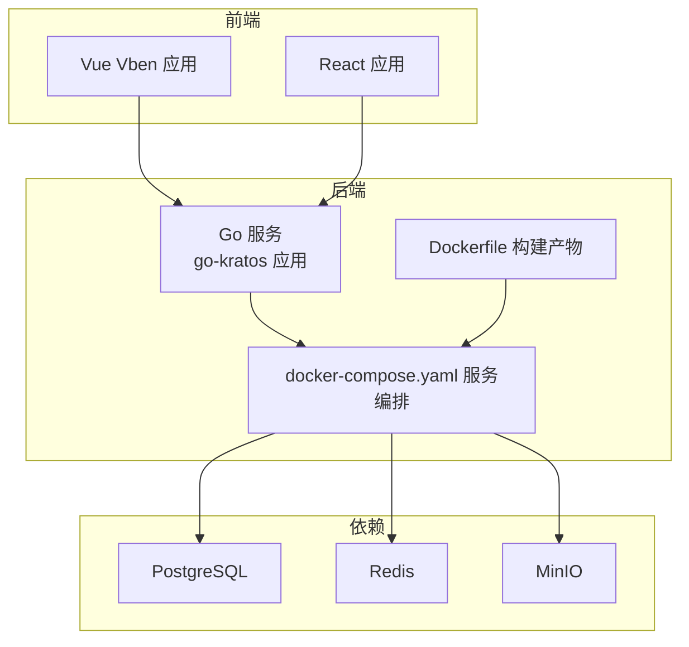
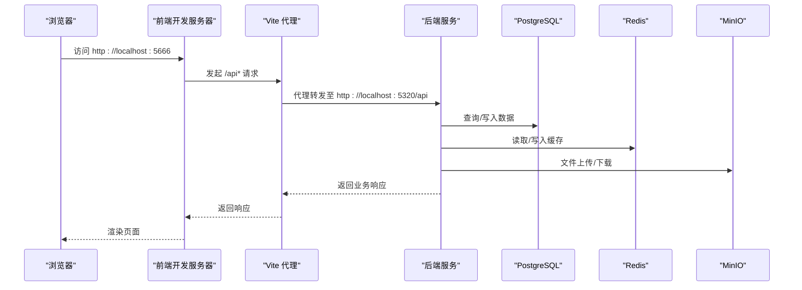
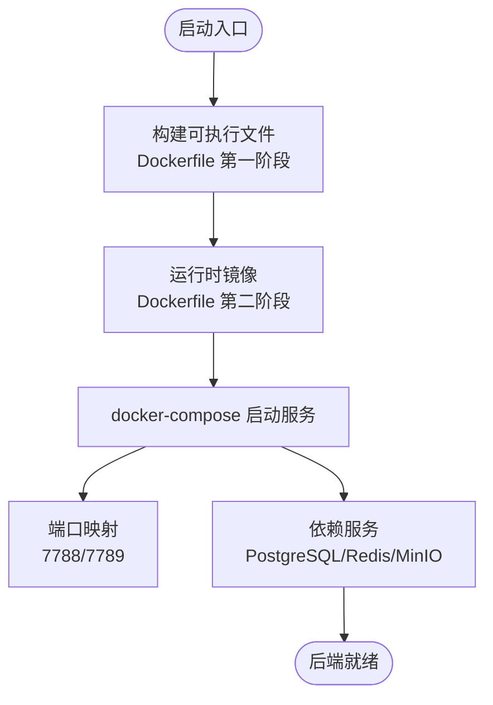
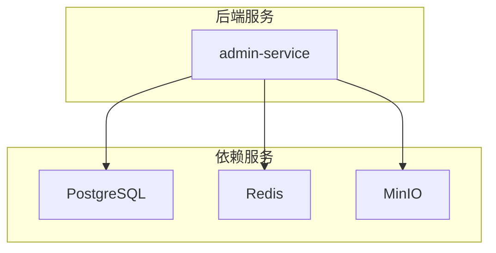

# 快速开始

<cite>
**本文引用的文件**
- [README.md](file://README.md)
- [main.go](file://backend/app/admin/service/cmd/server/main.go)
- [Dockerfile](file://backend/Dockerfile)
- [docker-compose.yaml](file://backend/docker-compose.yaml)
- [full_deploy.sh](file://backend/scripts/docker/full_deploy.sh)
- [install_golang.sh](file://backend/scripts/env/install_golang.sh)
- [install_unix_dev.sh](file://backend/scripts/env/install_unix_dev.sh)
- [package.json（Vue Vben）](file://frontend/admin/vue-vben/package.json)
- [vite.config.mts（Vue Vben）](file://frontend/admin/vue-vben/apps/admin/vite.config.mts)
- [package.json（React）](file://frontend/admin/react/package.json)
</cite>

## 目录
1. [简介](#简介)
2. [项目结构](#项目结构)
3. [核心组件](#核心组件)
4. [架构总览](#架构总览)
5. [详细组件分析](#详细组件分析)
6. [依赖分析](#依赖分析)
7. [性能考虑](#性能考虑)
8. [故障排查指南](#故障排查指南)
9. [结论](#结论)
10. [附录](#附录)

## 简介
本指南面向首次接触 GoWind Admin 的开发者，帮助你在最短时间内完成环境准备、一键安装与启动，快速看到效果。你将获得：
- 环境准备：Golang 与 Docker 的安装与配置
- 一键安装脚本：覆盖 Ubuntu、CentOS、Rocky、Windows、macOS 的安装命令
- 前端开发环境：Node.js、pnpm 的安装与验证
- 完整启动流程：后端服务到前端应用的启动顺序与验证
- 默认登录信息与访问测试地址

## 项目结构
GoWind Admin 采用前后端分离的多框架脚手架，后端基于 go-kratos 微服务框架，前端提供 Vue Vben 与 React 两套实现。项目通过 Docker Compose 将数据库、缓存、对象存储等依赖容器化，便于一键启动。

图表来源
- [Dockerfile:1-66](file://backend/Dockerfile#L1-L66)
- [docker-compose.yaml:1-125](file://backend/docker-compose.yaml#L1-L125)

章节来源
- [README.md:1-185](file://README.md#L1-L185)

## 核心组件
- 后端服务入口：后端应用通过 main.go 启动，集成 HTTP、异步队列与 SSE 传输层，并由引导框架统一运行。
- 容器化构建：Dockerfile 将 Go 服务编译为精简的 Linux 可执行文件，并以非 root 用户运行。
- 依赖编排：docker-compose.yaml 定义了 PostgreSQL、Redis、MinIO 等服务，以及后端服务的端口映射与构建参数。
- 前端应用：Vue Vben 与 React 两套前端工程，分别通过各自 package.json 的脚本与 Vite 配置启动开发服务器。

章节来源
- [main.go:1-76](file://backend/app/admin/service/cmd/server/main.go#L1-L76)
- [Dockerfile:1-66](file://backend/Dockerfile#L1-L66)
- [docker-compose.yaml:1-125](file://backend/docker-compose.yaml#L1-L125)
- [package.json（Vue Vben）:1-118](file://frontend/admin/vue-vben/package.json#L1-L118)
- [package.json（React）:1-82](file://frontend/admin/react/package.json#L1-L82)

## 架构总览
下图展示了从浏览器到后端服务的典型交互路径，以及前端如何通过代理访问后端 API。

图表来源
- [vite.config.mts（Vue Vben）:1-21](file://frontend/admin/vue-vben/apps/admin/vite.config.mts#L1-L21)
- [docker-compose.yaml:104-125](file://backend/docker-compose.yaml#L104-L125)

章节来源
- [README.md:87-91](file://README.md#L87-L91)

## 详细组件分析

### 后端服务启动流程
后端服务通过引导框架启动，统一管理 HTTP、异步队列与 SSE 传输层。Dockerfile 将服务编译为 Linux 可执行文件，并以非 root 用户运行；docker-compose.yaml 将其与数据库、缓存、对象存储等依赖容器化。

图表来源
- [Dockerfile:1-66](file://backend/Dockerfile#L1-L66)
- [docker-compose.yaml:104-125](file://backend/docker-compose.yaml#L104-L125)

章节来源
- [main.go:46-76](file://backend/app/admin/service/cmd/server/main.go#L46-L76)
- [Dockerfile:1-66](file://backend/Dockerfile#L1-L66)
- [docker-compose.yaml:1-125](file://backend/docker-compose.yaml#L1-L125)

### 前端开发环境搭建
- Node.js：从官网下载 LTS 版本并安装，使用 node -v 与 npm -v 验证。
- pnpm：全局安装 pnpm 并使用 pnpm install 与 pnpm dev 启动开发服务器。
- Vue Vben：开发服务器默认监听端口见其 Vite 配置；React：开发服务器默认监听端口见其 Vite 配置。

章节来源
- [README.md:61-85](file://README.md#L61-L85)
- [package.json（Vue Vben）:1-118](file://frontend/admin/vue-vben/package.json#L1-L118)
- [vite.config.mts（Vue Vben）:1-21](file://frontend/admin/vue-vben/apps/admin/vite.config.mts#L1-L21)
- [package.json（React）:1-82](file://frontend/admin/react/package.json#L1-L82)

### 一键安装脚本使用
- Golang 与 Docker 安装：提供跨平台脚本，自动识别系统与架构，安装最新版 Go 并配置环境变量。
- 开发工具安装：安装 Protobuf 编译器、相关 Go 插件与 CLI 工具，提升开发效率。
- 一键部署：通过 docker-compose 启动完整应用栈（数据库、缓存、对象存储、后端服务）。

章节来源
- [README.md:30-57](file://README.md#L30-L57)
- [install_golang.sh:1-160](file://backend/scripts/env/install_golang.sh#L1-L160)
- [install_unix_dev.sh:1-150](file://backend/scripts/env/install_unix_dev.sh#L1-L150)
- [full_deploy.sh:1-96](file://backend/scripts/docker/full_deploy.sh#L1-L96)

### 启动顺序与验证
- 后端：使用 docker-compose 启动依赖与后端服务，等待端口 7788/7789 就绪。
- 前端：进入前端目录，安装依赖后启动开发服务器，访问 http://localhost:5666。
- 登录：默认账号密码见 README 中的演示地址与默认账号密码说明。

章节来源
- [README.md:87-91](file://README.md#L87-L91)
- [docker-compose.yaml:104-125](file://backend/docker-compose.yaml#L104-L125)

## 依赖分析
后端服务依赖 PostgreSQL、Redis、MinIO 等基础设施，docker-compose.yaml 明确了这些服务的镜像、端口映射与环境变量。Dockerfile 将后端服务构建为独立的运行时镜像，并以非 root 用户运行，提升安全性。

图表来源
- [docker-compose.yaml:1-125](file://backend/docker-compose.yaml#L1-L125)

章节来源
- [docker-compose.yaml:1-125](file://backend/docker-compose.yaml#L1-L125)
- [Dockerfile:1-66](file://backend/Dockerfile#L1-L66)

## 性能考虑
- 构建优化：Dockerfile 使用 goproxy.cn 代理与关闭 GOSUMDB 校验，加速依赖下载。
- 运行时优化：以 alpine 为基础镜像，非 root 用户运行，减小攻击面并降低资源占用。
- 前端开发：Vue Vben 与 React 均采用现代打包工具，建议在本地磁盘进行开发，避免网络挂载导致的 I/O 影响。

章节来源
- [Dockerfile:18-20](file://backend/Dockerfile#L18-L20)
- [package.json（Vue Vben）:1-118](file://frontend/admin/vue-vben/package.json#L1-L118)
- [package.json（React）:1-82](file://frontend/admin/react/package.json#L1-L82)

## 故障排查指南
- Docker Compose 未找到：确认已安装 Docker Compose v2 或 docker-compose 可执行文件。
- 端口冲突：若 5432、6379、9000、7788 等端口被占用，请释放或调整映射。
- Go 环境问题：使用 install_golang.sh 自动安装与配置；如需手动安装，参考 install_golang.sh 的安装逻辑。
- 前端依赖安装失败：确保 Node.js 版本满足 package.json 中 engines 的要求；使用 pnpm 替代 npm/yarn。

章节来源
- [full_deploy.sh:84-92](file://backend/scripts/docker/full_deploy.sh#L84-L92)
- [install_golang.sh:1-160](file://backend/scripts/env/install_golang.sh#L1-L160)
- [package.json（Vue Vben）:70-73](file://frontend/admin/vue-vben/package.json#L70-L73)

## 结论
通过本快速开始指南，你可以完成环境准备、一键安装与启动，随后即可访问前端管理界面并使用默认账号登录。建议在熟悉整体架构后再逐步调整配置与扩展功能。

## 附录
- 默认登录信息与访问测试地址请参阅 README 中的演示地址与默认账号密码说明。
- 如需在不同操作系统上使用一键安装脚本，请参考 README 中的各平台安装命令。

章节来源
- [README.md:15-22](file://README.md#L15-L22)
- [README.md:87-91](file://README.md#L87-L91)