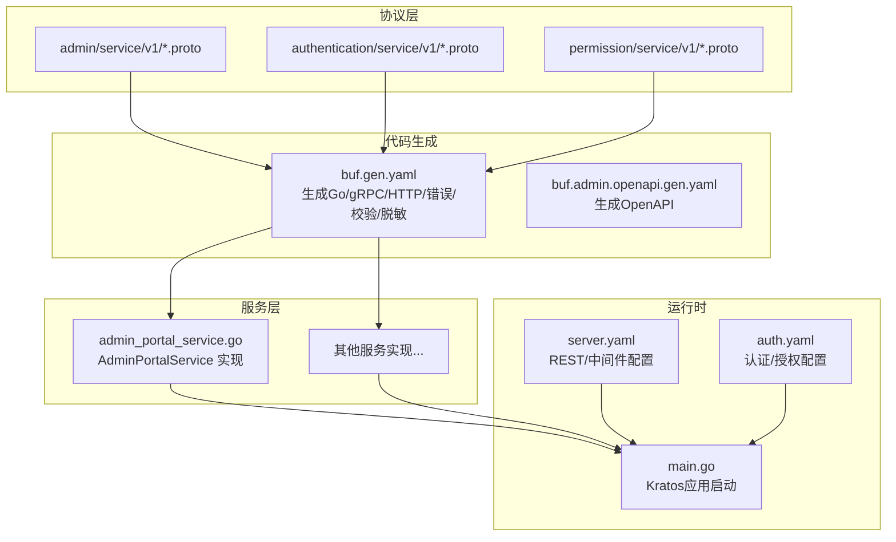
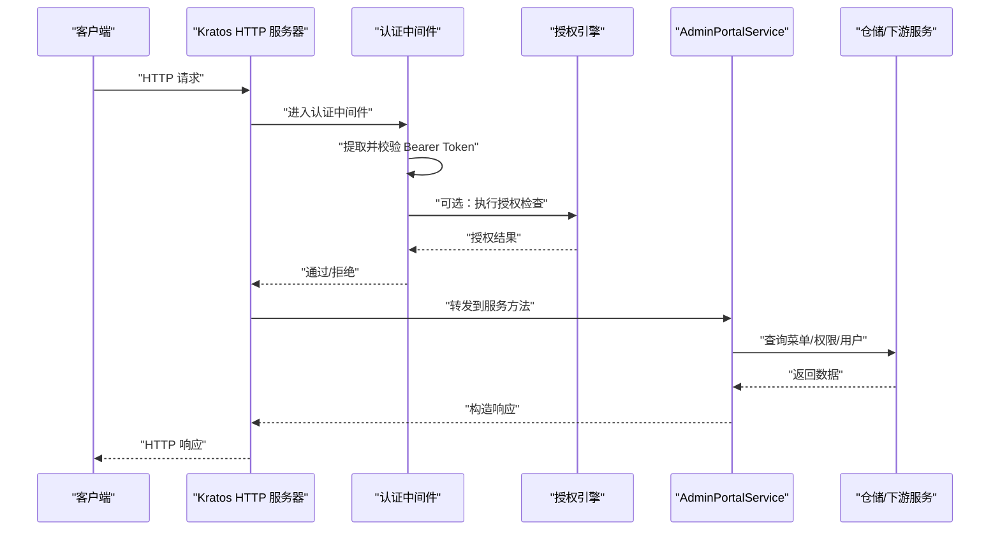
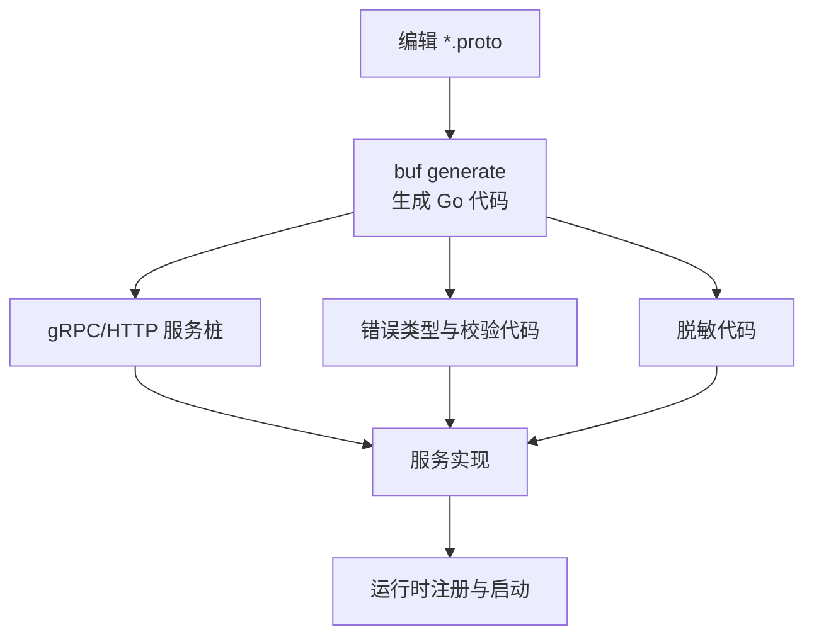
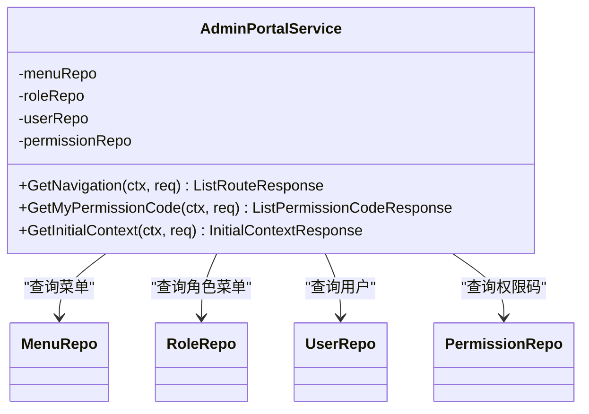
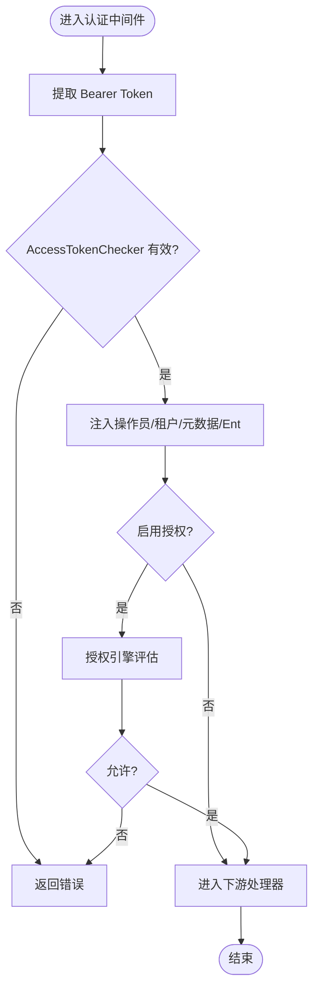
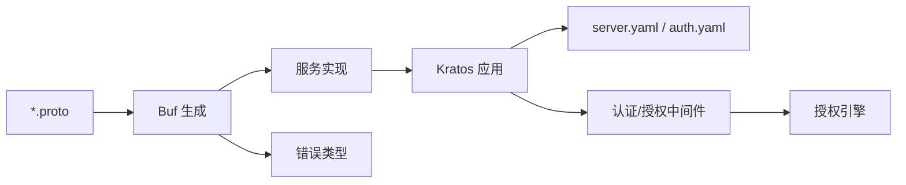

# API 扩展开发

<cite>
**本文引用的文件**
- [buf.yaml](file://backend/api/buf.yaml)
- [buf.gen.yaml](file://backend/api/buf.gen.yaml)
- [buf.admin.openapi.gen.yaml](file://backend/api/buf.admin.openapi.gen.yaml)
- [main.go](file://backend/app/admin/service/cmd/server/main.go)
- [server.yaml](file://backend/app/admin/service/configs/server.yaml)
- [auth.yaml](file://backend/app/admin/service/configs/auth.yaml)
- [auth.go](file://backend/pkg/middleware/auth/auth.go)
- [options.go](file://backend/pkg/middleware/auth/options.go)
- [authorizer.go](file://backend/pkg/authorizer/authorizer.go)
- [permission.go](file://backend/pkg/constants/permission.go)
- [i_admin_portal.proto](file://backend/api/protos/admin/service/v1/i_admin_portal.proto)
- [authentication.proto](file://backend/api/protos/authentication/service/v1/authentication.proto)
- [permission.proto](file://backend/api/protos/permission/service/v1/permission.proto)
- [admin_portal_service.go](file://backend/app/admin/service/internal/service/admin_portal_service.go)
</cite>

## 目录
1. [简介](#简介)
2. [项目结构](#项目结构)
3. [核心组件](#核心组件)
4. [架构总览](#架构总览)
5. [详细组件分析](#详细组件分析)
6. [依赖关系分析](#依赖关系分析)
7. [性能考量](#性能考量)
8. [故障排查指南](#故障排查指南)
9. [结论](#结论)
10. [附录](#附录)

## 简介
本指南面向希望在现有系统上扩展 API 的开发者，覆盖从 Protobuf 协议定义、服务接口实现、HTTP/REST 生成、前端客户端生成、到安全与治理（认证、授权、速率限制）、测试与部署监控的完整流程。文档结合仓库中的实际实现，给出可复用的最佳实践与步骤说明。

## 项目结构
后端采用 Kratos 框架与 Buf 工具链组织 API 代码，遵循“协议驱动”的设计：先定义 .proto，再通过 Buf 生成 Go 代码（gRPC、HTTP、错误、校验、脱敏等），最后在服务层实现业务逻辑，并通过中间件完成认证与授权。

图表来源
- [buf.gen.yaml:56-96](file://backend/api/buf.gen.yaml#L56-L96)
- [buf.admin.openapi.gen.yaml:21-44](file://backend/api/buf.admin.openapi.gen.yaml#L21-L44)
- [main.go:46-75](file://backend/app/admin/service/cmd/server/main.go#L46-L75)
- [server.yaml:1-49](file://backend/app/admin/service/configs/server.yaml#L1-L49)
- [auth.yaml:1-37](file://backend/app/admin/service/configs/auth.yaml#L1-L37)

章节来源
- [buf.yaml:1-26](file://backend/api/buf.yaml#L1-L26)
- [buf.gen.yaml:1-96](file://backend/api/buf.gen.yaml#L1-L96)
- [buf.admin.openapi.gen.yaml:1-44](file://backend/api/buf.admin.openapi.gen.yaml#L1-L44)
- [main.go:1-76](file://backend/app/admin/service/cmd/server/main.go#L1-L76)
- [server.yaml:1-49](file://backend/app/admin/service/configs/server.yaml#L1-L49)
- [auth.yaml:1-37](file://backend/app/admin/service/configs/auth.yaml#L1-L37)

## 核心组件
- 协议与生成
  - 使用 Buf 管理 proto 模块、Lint/Breaking 检查与依赖。
  - 通过 buf.gen.yaml 生成 gRPC、HTTP、错误、校验、脱敏等代码。
  - 通过 buf.admin.openapi.gen.yaml 生成 OpenAPI 文档。
- 服务实现
  - 以 AdminPortalService 为例，展示如何在服务层调用仓储与下游服务，组装响应。
- 中间件与安全
  - 认证中间件负责提取与校验 Bearer Token，注入操作员/租户/元数据，以及可选的鉴权。
  - 授权引擎支持 noop、casbin、opa 等，策略由 Provider 提供。
- 运行时配置
  - server.yaml 控制 REST 地址、超时、CORS、中间件开关（日志、恢复、追踪、校验、熔断、元数据）。
  - auth.yaml 控制认证（jwt/oidc/preshared_key）与授权（noop/casbin/opa/zanzibar）类型及参数。

章节来源
- [buf.yaml:1-26](file://backend/api/buf.yaml#L1-L26)
- [buf.gen.yaml:1-96](file://backend/api/buf.gen.yaml#L1-L96)
- [buf.admin.openapi.gen.yaml:1-44](file://backend/api/buf.admin.openapi.gen.yaml#L1-L44)
- [admin_portal_service.go:1-208](file://backend/app/admin/service/internal/service/admin_portal_service.go#L1-L208)
- [auth.go:1-122](file://backend/pkg/middleware/auth/auth.go#L1-L122)
- [options.go:1-146](file://backend/pkg/middleware/auth/options.go#L1-L146)
- [authorizer.go:1-241](file://backend/pkg/authorizer/authorizer.go#L1-L241)
- [server.yaml:1-49](file://backend/app/admin/service/configs/server.yaml#L1-L49)
- [auth.yaml:1-37](file://backend/app/admin/service/configs/auth.yaml#L1-L37)

## 架构总览
下面的时序图展示了从客户端发起请求到服务端返回响应的关键路径，包括认证与授权中间件的介入。

图表来源
- [auth.go:24-121](file://backend/pkg/middleware/auth/auth.go#L24-L121)
- [authorizer.go:162-240](file://backend/pkg/authorizer/authorizer.go#L162-L240)
- [admin_portal_service.go:105-207](file://backend/app/admin/service/internal/service/admin_portal_service.go#L105-L207)
- [server.yaml:22-28](file://backend/app/admin/service/configs/server.yaml#L22-L28)

## 详细组件分析

### 协议与生成流水线
- 协议定义
  - 示例：后台门户服务、认证服务、权限服务等均以 .proto 文件定义 RPC 与消息。
- 生成配置
  - 通过 buf.gen.yaml 指定插件与输出目录，统一 go_package 前缀与各子目录的包映射。
  - 通过 buf.admin.openapi.gen.yaml 生成 OpenAPI 文档，便于前端对接与调试。
- 版本与依赖
  - buf.yaml 管理模块版本、Lint/Breaking 规则与第三方依赖（googleapis、kratos、gnostic、protoc-gen-validate 等）。

图表来源
- [buf.gen.yaml:56-96](file://backend/api/buf.gen.yaml#L56-L96)
- [buf.admin.openapi.gen.yaml:26-44](file://backend/api/buf.admin.openapi.gen.yaml#L26-L44)

章节来源
- [i_admin_portal.proto:1-48](file://backend/api/protos/admin/service/v1/i_admin_portal.proto#L1-L48)
- [authentication.proto:1-551](file://backend/api/protos/authentication/service/v1/authentication.proto#L1-L551)
- [permission.proto:1-172](file://backend/api/protos/permission/service/v1/permission.proto#L1-L172)
- [buf.gen.yaml:1-96](file://backend/api/buf.gen.yaml#L1-L96)
- [buf.admin.openapi.gen.yaml:1-44](file://backend/api/buf.admin.openapi.gen.yaml#L1-L44)
- [buf.yaml:1-26](file://backend/api/buf.yaml#L1-L26)

### 服务实现示例：AdminPortalService
- 职责
  - 提供后台导航、权限码、初始上下文等接口，聚合菜单、角色、权限与用户信息。
- 关键点
  - 从认证中间件获取操作员信息。
  - 通过仓储查询角色菜单、用户角色、权限码等。
  - 将菜单树转换为前端路由项。
- 错误处理
  - 使用生成的错误类型返回内部错误等。

图表来源
- [admin_portal_service.go:26-51](file://backend/app/admin/service/internal/service/admin_portal_service.go#L26-L51)

章节来源
- [admin_portal_service.go:1-208](file://backend/app/admin/service/internal/service/admin_portal_service.go#L1-L208)

### 认证与授权中间件
- 认证
  - 从请求元数据中提取 Bearer Token，调用 AccessTokenChecker 校验有效性与黑名单状态。
  - 支持注入操作员ID、租户ID、Ent Viewer、元数据等。
- 授权
  - 可选启用授权检查，授权引擎支持 noop、casbin、opa 等。
  - 策略由 Provider 提供，Authorizer 负责加载与设置策略。

图表来源
- [auth.go:38-121](file://backend/pkg/middleware/auth/auth.go#L38-L121)
- [options.go:62-146](file://backend/pkg/middleware/auth/options.go#L62-L146)
- [authorizer.go:162-240](file://backend/pkg/authorizer/authorizer.go#L162-L240)

章节来源
- [auth.go:1-122](file://backend/pkg/middleware/auth/auth.go#L1-L122)
- [options.go:1-146](file://backend/pkg/middleware/auth/options.go#L1-L146)
- [authorizer.go:1-241](file://backend/pkg/authorizer/authorizer.go#L1-L241)
- [permission.go:1-39](file://backend/pkg/constants/permission.go#L1-L39)

### 运行时与配置
- 应用启动
  - main.go 使用 bootstrap 初始化 Kratos 应用，注册 HTTP、异步队列、SSE 等。
- 服务器配置
  - server.yaml 控制 REST 地址、超时、CORS、中间件开关（日志、恢复、追踪、校验、熔断、元数据）。
- 认证/授权配置
  - auth.yaml 控制认证类型（jwt/oidc/preshared_key）与授权类型（noop/casbin/opa/zanzibar），以及具体参数。

章节来源
- [main.go:1-76](file://backend/app/admin/service/cmd/server/main.go#L1-L76)
- [server.yaml:1-49](file://backend/app/admin/service/configs/server.yaml#L1-L49)
- [auth.yaml:1-37](file://backend/app/admin/service/configs/auth.yaml#L1-L37)

## 依赖关系分析
- 协议与生成
  - buf.yaml 声明模块与依赖；buf.gen.yaml/ buf.admin.openapi.gen.yaml 定义生成规则与输出。
- 服务与中间件
  - 服务实现依赖生成的 gRPC/HTTP 客户端与错误类型；认证中间件依赖 AccessTokenChecker 与授权引擎。
- 运行时
  - main.go 通过 bootstrap 组合 HTTP、异步队列、SSE；server.yaml 与 auth.yaml 影响行为。

图表来源
- [buf.gen.yaml:56-96](file://backend/api/buf.gen.yaml#L56-L96)
- [buf.admin.openapi.gen.yaml:26-44](file://backend/api/buf.admin.openapi.gen.yaml#L26-L44)
- [main.go:46-75](file://backend/app/admin/service/cmd/server/main.go#L46-L75)
- [server.yaml:1-49](file://backend/app/admin/service/configs/server.yaml#L1-L49)
- [auth.yaml:1-37](file://backend/app/admin/service/configs/auth.yaml#L1-L37)

章节来源
- [buf.yaml:1-26](file://backend/api/buf.yaml#L1-L26)
- [buf.gen.yaml:1-96](file://backend/api/buf.gen.yaml#L1-L96)
- [buf.admin.openapi.gen.yaml:1-44](file://backend/api/buf.admin.openapi.gen.yaml#L1-L44)
- [main.go:1-76](file://backend/app/admin/service/cmd/server/main.go#L1-L76)
- [server.yaml:1-49](file://backend/app/admin/service/configs/server.yaml#L1-L49)
- [auth.yaml:1-37](file://backend/app/admin/service/configs/auth.yaml#L1-L37)

## 性能考量
- 生成与编译
  - 使用 Buf 管理依赖与生成，确保一致性与可重复构建。
- 传输与序列化
  - gRPC 与 HTTP/JSON 生成由 Buf 插件提供，按需选择以平衡性能与易用性。
- 中间件开销
  - 认证/授权中间件在请求路径上引入额外处理，建议开启必要的中间件并合理配置超时。
- 并发与队列
  - 异步任务队列（Asynq）可用于耗时操作，避免阻塞请求。

## 故障排查指南
- 认证相关
  - 缺失 Bearer Token、Token 无效或已拉黑：检查认证中间件日志与 AccessTokenChecker 实现。
  - 注入失败：确认 Token 载荷字段与注入选项配置一致。
- 授权相关
  - 授权失败：检查授权引擎类型与 Provider 提供的策略；查看策略加载日志。
- 服务实现
  - 内部错误：服务实现返回生成的错误类型；检查仓储/下游调用是否异常。
- 运行时
  - CORS/中间件：检查 server.yaml 中 CORS 与中间件开关；确认请求头与方法符合预期。
  - 认证/授权配置：核对 auth.yaml 中类型与参数，确保与实际环境一致。

章节来源
- [auth.go:40-121](file://backend/pkg/middleware/auth/auth.go#L40-L121)
- [options.go:62-146](file://backend/pkg/middleware/auth/options.go#L62-L146)
- [authorizer.go:63-109](file://backend/pkg/authorizer/authorizer.go#L63-L109)
- [admin_portal_service.go:105-207](file://backend/app/admin/service/internal/service/admin_portal_service.go#L105-L207)
- [server.yaml:7-28](file://backend/app/admin/service/configs/server.yaml#L7-L28)
- [auth.yaml:1-37](file://backend/app/admin/service/configs/auth.yaml#L1-L37)

## 结论
通过“协议驱动”的方式，结合 Buf 生成工具链与 Kratos 运行时，系统实现了高内聚、低耦合的 API 扩展能力。配合完善的认证、授权中间件与可配置的运行时，能够快速、安全地扩展新服务模块，并保证前后端协同与可观测性。

## 附录

### API 扩展最佳实践清单
- 协议设计
  - 明确版本命名空间（如 admin/service/v1），保持向后兼容与 Breaking 规则。
  - 使用 protoc-gen-validate 与 redact 保障输入校验与敏感信息处理。
- 服务实现
  - 在服务层聚合仓储与下游服务，集中处理错误与响应构造。
  - 使用生成的错误类型返回标准错误。
- 安全
  - 强制 Bearer Token 认证；必要时启用授权检查。
  - 对敏感字段使用 redact；对关键操作记录审计日志。
- 文档与前端
  - 通过 OpenAPI 生成文档，便于前端联调与自动化测试。
- 测试
  - 单元测试：针对服务方法与业务逻辑。
  - 集成测试：端到端验证 gRPC/HTTP 与数据库交互。
  - 性能测试：压测关键路径，关注认证/授权与队列延迟。
- 部署与监控
  - 使用 server.yaml 配置 REST/CORS/中间件；在生产关闭调试功能。
  - 结合日志、追踪与指标监控，持续优化性能与稳定性。

### 新增服务模块步骤（从协议到前端）
- 定义协议
  - 在对应模块目录新增 .proto 文件，定义 service 与 messages。
  - 在 buf.gen.yaml 中配置 go_package 与生成插件。
- 生成代码
  - 执行 Buf 生成命令，生成 Go/gRPC/HTTP/错误/校验/脱敏代码。
- 实现服务
  - 在服务层实现 RPC 方法，注入依赖（仓储/下游服务），返回生成的响应。
- 注册与运行
  - 在 main.go 中注册服务，使用 bootstrap 启动应用。
  - 在 server.yaml 中配置 REST 与中间件，在 auth.yaml 中配置认证/授权。
- 文档与前端
  - 使用 buf.admin.openapi.gen.yaml 生成 OpenAPI 文档，供前端消费。
  - 前端根据 OpenAPI 生成客户端代码并联调。

章节来源
- [buf.gen.yaml:1-96](file://backend/api/buf.gen.yaml#L1-L96)
- [buf.admin.openapi.gen.yaml:1-44](file://backend/api/buf.admin.openapi.gen.yaml#L1-L44)
- [admin_portal_service.go:1-208](file://backend/app/admin/service/internal/service/admin_portal_service.go#L1-L208)
- [main.go:1-76](file://backend/app/admin/service/cmd/server/main.go#L1-L76)
- [server.yaml:1-49](file://backend/app/admin/service/configs/server.yaml#L1-L49)
- [auth.yaml:1-37](file://backend/app/admin/service/configs/auth.yaml#L1-L37)