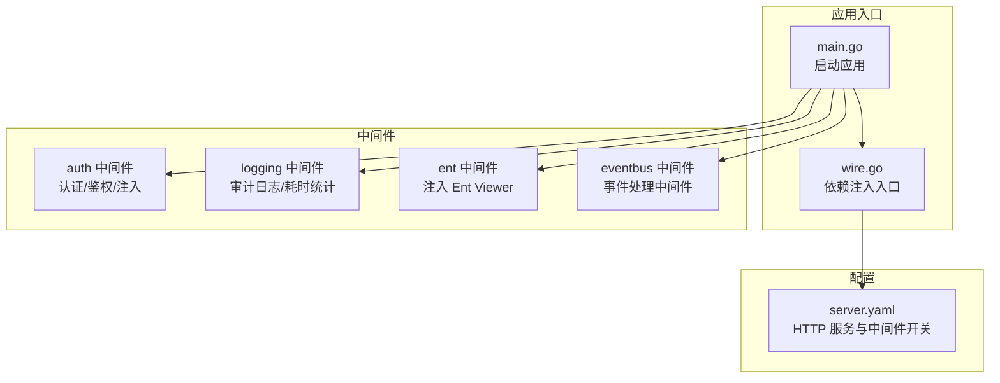
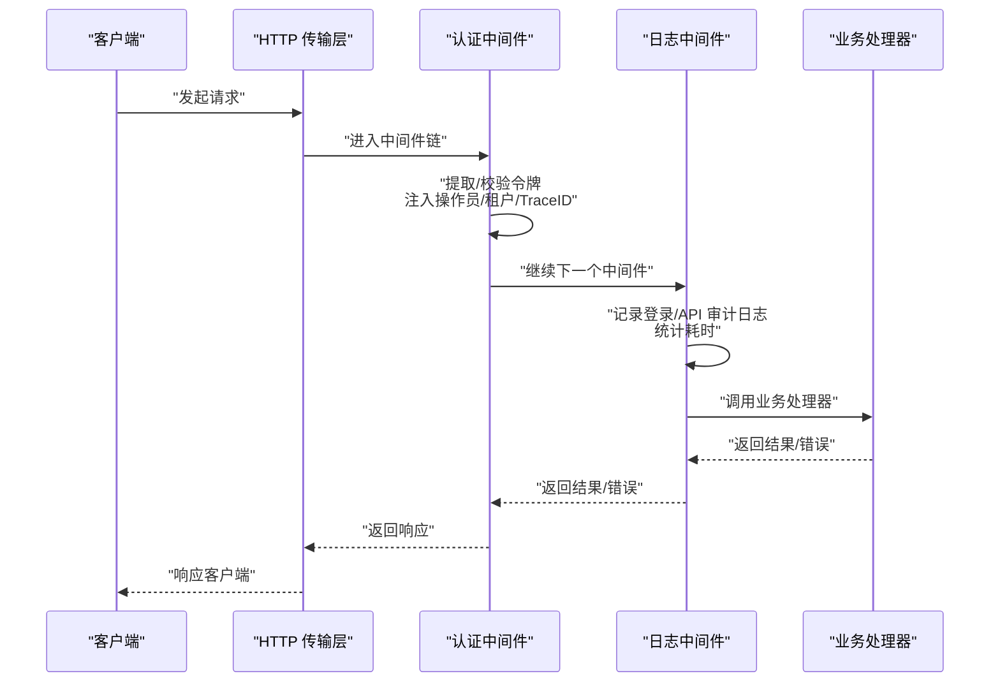
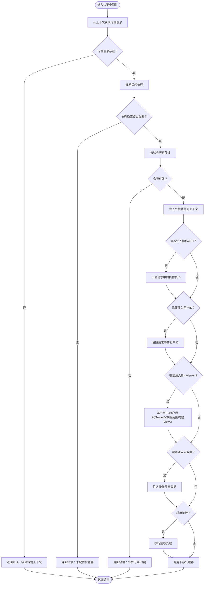
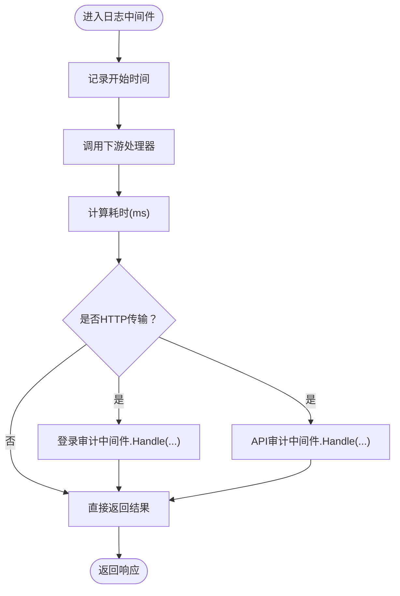
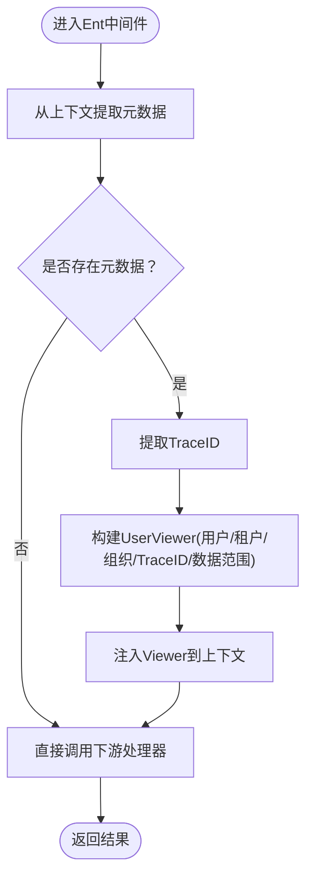
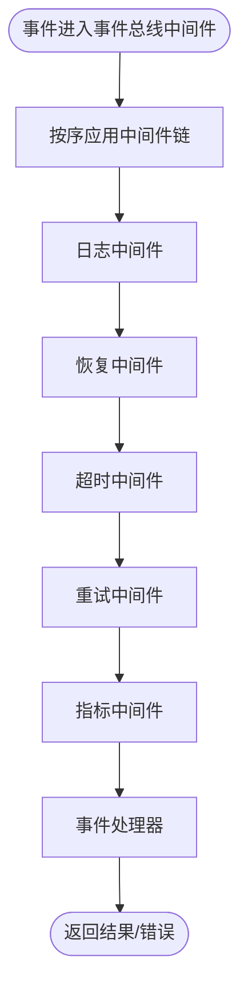
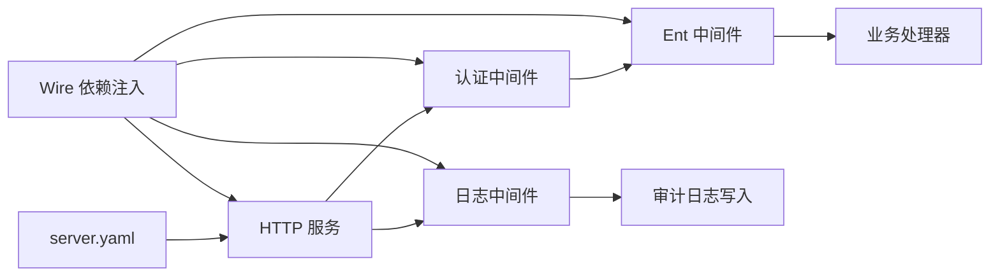

# 中间件扩展

<cite>
**本文引用的文件**
- [backend/pkg/middleware/auth/auth.go](file://backend/pkg/middleware/auth/auth.go)
- [backend/pkg/middleware/auth/options.go](file://backend/pkg/middleware/auth/options.go)
- [backend/pkg/middleware/auth/context.go](file://backend/pkg/middleware/auth/context.go)
- [backend/pkg/middleware/logging/logging.go](file://backend/pkg/middleware/logging/logging.go)
- [backend/pkg/middleware/logging/options.go](file://backend/pkg/middleware/logging/options.go)
- [backend/pkg/middleware/ent/ent.go](file://backend/pkg/middleware/ent/ent.go)
- [backend/pkg/eventbus/middleware.go](file://backend/pkg/eventbus/middleware.go)
- [backend/app/admin/service/cmd/server/main.go](file://backend/app/admin/service/cmd/server/main.go)
- [backend/app/admin/service/cmd/server/wire.go](file://backend/app/admin/service/cmd/server/wire.go)
- [backend/app/admin/service/configs/server.yaml](file://backend/app/admin/service/configs/server.yaml)
</cite>

## 目录
1. [简介](#简介)
2. [项目结构](#项目结构)
3. [核心组件](#核心组件)
4. [架构总览](#架构总览)
5. [详细组件分析](#详细组件分析)
6. [依赖分析](#依赖分析)
7. [性能考量](#性能考量)
8. [故障排查指南](#故障排查指南)
9. [结论](#结论)
10. [附录](#附录)

## 简介
本指南面向希望在本项目中扩展中间件能力的开发者，系统讲解中间件的架构设计与执行流程，覆盖中间件链、请求处理管道、响应处理等；解析现有中间件的实现方式（认证中间件、日志中间件、数据库中间件等）；给出自定义中间件的开发步骤（接口实现、配置管理、错误处理）、最佳实践（性能、可复用性、测试策略）以及注册与依赖注入集成方法。文档同时提供可直接参考的代码片段路径，帮助快速落地。

## 项目结构
本项目采用分层与功能模块化组织，中间件相关代码集中在 backend/pkg/middleware 下，服务启动入口位于 backend/app/admin/service/cmd/server，配置位于 configs/server.yaml。整体结构如下：

图表来源
- [backend/app/admin/service/cmd/server/main.go:1-76](file://backend/app/admin/service/cmd/server/main.go#L1-L76)
- [backend/app/admin/service/cmd/server/wire.go:1-47](file://backend/app/admin/service/cmd/server/wire.go#L1-L47)
- [backend/app/admin/service/configs/server.yaml:1-49](file://backend/app/admin/service/configs/server.yaml#L1-L49)
- [backend/pkg/middleware/auth/auth.go:1-122](file://backend/pkg/middleware/auth/auth.go#L1-L122)
- [backend/pkg/middleware/logging/logging.go:1-52](file://backend/pkg/middleware/logging/logging.go#L1-L52)
- [backend/pkg/middleware/ent/ent.go:1-42](file://backend/pkg/middleware/ent/ent.go#L1-L42)
- [backend/pkg/eventbus/middleware.go:1-135](file://backend/pkg/eventbus/middleware.go#L1-L135)

章节来源
- [backend/app/admin/service/cmd/server/main.go:1-76](file://backend/app/admin/service/cmd/server/main.go#L1-L76)
- [backend/app/admin/service/cmd/server/wire.go:1-47](file://backend/app/admin/service/cmd/server/wire.go#L1-L47)
- [backend/app/admin/service/configs/server.yaml:1-49](file://backend/app/admin/service/configs/server.yaml#L1-L49)

## 核心组件
- 认证中间件：负责从传输层提取并校验访问令牌，注入操作员、租户、数据范围、OpenTelemetry TraceID 等上下文信息，并可选进行鉴权处理。
- 日志中间件：对 HTTP 请求进行统一审计日志记录（登录、API 调用），统计耗时，支持可插拔的日志写入函数与 ECDSA 密钥对。
- 数据库中间件（Ent）：基于已有的操作员元数据，向 Context 注入 Ent Viewer，以实现数据访问控制与审计。
- 事件总线中间件：为事件处理器提供日志、恢复、超时、重试、指标等通用横切能力。

章节来源
- [backend/pkg/middleware/auth/auth.go:24-121](file://backend/pkg/middleware/auth/auth.go#L24-L121)
- [backend/pkg/middleware/logging/logging.go:15-51](file://backend/pkg/middleware/logging/logging.go#L15-L51)
- [backend/pkg/middleware/ent/ent.go:15-41](file://backend/pkg/middleware/ent/ent.go#L15-L41)
- [backend/pkg/eventbus/middleware.go:10-114](file://backend/pkg/eventbus/middleware.go#L10-L114)

## 架构总览
下图展示 Kratos 服务器端中间件链的典型调用顺序：HTTP 传输层 -> 认证中间件 -> 鉴权/注入 -> 业务处理器 -> 响应返回；日志中间件在处理前后分别记录审计日志与耗时。

图表来源
- [backend/pkg/middleware/auth/auth.go:38-118](file://backend/pkg/middleware/auth/auth.go#L38-L118)
- [backend/pkg/middleware/logging/logging.go:31-49](file://backend/pkg/middleware/logging/logging.go#L31-L49)

## 详细组件分析

### 认证中间件（auth）
- 设计要点
  - 通过传输上下文提取令牌，使用可插拔的 AccessTokenChecker 校验有效性与黑名单状态。
  - 可选注入操作员 ID、租户 ID、数据范围、OpenTelemetry TraceID，以及基于用户视角的 Ent Viewer。
  - 可选启用鉴权处理，进一步限制资源访问。
- 关键接口与选项
  - AccessTokenChecker 接口及组合实现，支持函数式适配。
  - 选项包括：启用刷新令牌过期检查、启用作用域检查、注入开关（操作员/租户/Ent/元数据）、鉴权开关、日志记录器。
- 执行流程
  - 提取令牌 -> 校验令牌 -> 注入上下文 -> 可选注入 Ent Viewer -> 可选鉴权处理 -> 调用下游处理器。

图表来源
- [backend/pkg/middleware/auth/auth.go:38-118](file://backend/pkg/middleware/auth/auth.go#L38-L118)
- [backend/pkg/middleware/auth/options.go:62-75](file://backend/pkg/middleware/auth/options.go#L62-L75)
- [backend/pkg/middleware/auth/context.go:15-25](file://backend/pkg/middleware/auth/context.go#L15-L25)

章节来源
- [backend/pkg/middleware/auth/auth.go:24-121](file://backend/pkg/middleware/auth/auth.go#L24-L121)
- [backend/pkg/middleware/auth/options.go:11-145](file://backend/pkg/middleware/auth/options.go#L11-L145)
- [backend/pkg/middleware/auth/context.go:9-25](file://backend/pkg/middleware/auth/context.go#L9-L25)

### 日志中间件（logging）
- 设计要点
  - 在请求进入与退出时分别记录登录审计与 API 审计日志，统计耗时。
  - 支持通过 Option 注入写入函数，便于对接不同存储或消息通道。
  - 内置 ECDSA 密钥对生成逻辑，用于安全场景下的签名/验签（可由外部注入）。
- 执行流程
  - 记录开始时间 -> 调用下游处理器 -> 计算耗时 -> 根据传输类型选择审计中间件 -> 写入审计日志。

图表来源
- [backend/pkg/middleware/logging/logging.go:31-49](file://backend/pkg/middleware/logging/logging.go#L31-L49)
- [backend/pkg/middleware/logging/options.go:13-22](file://backend/pkg/middleware/logging/options.go#L13-L22)

章节来源
- [backend/pkg/middleware/logging/logging.go:14-51](file://backend/pkg/middleware/logging/logging.go#L14-L51)
- [backend/pkg/middleware/logging/options.go:10-60](file://backend/pkg/middleware/logging/options.go#L10-L60)

### 数据库中间件（ent）
- 设计要点
  - 从上下文读取操作员元数据，基于用户、租户、组织单元、TraceID、数据范围构建 Ent Viewer，并注入到上下文中。
  - 适用于所有需要按用户维度进行数据隔离与审计的服务。
- 执行流程
  - 从上下文提取元数据 -> 获取 TraceID -> 构建 Viewer -> 注入上下文 -> 调用下游处理器。

图表来源
- [backend/pkg/middleware/ent/ent.go:15-41](file://backend/pkg/middleware/ent/ent.go#L15-L41)

章节来源
- [backend/pkg/middleware/ent/ent.go:14-41](file://backend/pkg/middleware/ent/ent.go#L14-L41)

### 事件总线中间件（eventbus）
- 设计要点
  - 针对事件处理器提供通用中间件：日志、恢复（panic 恢复）、超时、重试、指标采集。
  - 提供 Chain 组合多个中间件的能力，形成事件处理管道。
- 执行流程
  - 依次应用日志/恢复/超时/重试/指标中间件，包装事件处理器，捕获异常、限制耗时、记录指标。

图表来源
- [backend/pkg/eventbus/middleware.go:106-114](file://backend/pkg/eventbus/middleware.go#L106-L114)
- [backend/pkg/eventbus/middleware.go:14-104](file://backend/pkg/eventbus/middleware.go#L14-L104)

章节来源
- [backend/pkg/eventbus/middleware.go:10-135](file://backend/pkg/eventbus/middleware.go#L10-L135)

## 依赖分析
- 中间件与传输层
  - 认证中间件依赖传输上下文以获取请求元信息，并通过 OpenTelemetry 获取 TraceID。
  - 日志中间件依赖 HTTP 传输类型以区分登录与 API 审计。
- 中间件与配置
  - HTTP 服务配置文件开启/关闭各类中间件（如日志、恢复、追踪、验证、熔断、元数据）。
- 中间件与依赖注入
  - 应用通过 Wire 组合 server、service、data ProviderSet 并构造 Kratos 应用实例，中间件作为服务层的横切关注点参与构建。

图表来源
- [backend/app/admin/service/configs/server.yaml:22-28](file://backend/app/admin/service/configs/server.yaml#L22-L28)
- [backend/app/admin/service/cmd/server/wire.go:37-45](file://backend/app/admin/service/cmd/server/wire.go#L37-L45)
- [backend/pkg/middleware/auth/auth.go:38-118](file://backend/pkg/middleware/auth/auth.go#L38-L118)
- [backend/pkg/middleware/logging/logging.go:31-49](file://backend/pkg/middleware/logging/logging.go#L31-L49)
- [backend/pkg/middleware/ent/ent.go:15-41](file://backend/pkg/middleware/ent/ent.go#L15-L41)

章节来源
- [backend/app/admin/service/configs/server.yaml:1-49](file://backend/app/admin/service/configs/server.yaml#L1-L49)
- [backend/app/admin/service/cmd/server/wire.go:27-46](file://backend/app/admin/service/cmd/server/wire.go#L27-L46)

## 性能考量
- 中间件链长度与顺序
  - 合理安排中间件顺序，将昂贵操作（如鉴权、审计落库）置于链路靠后位置，避免阻塞高频路径。
- 资源开销
  - 日志中间件建议异步写入或批量提交，降低 IO 对主链路的影响。
  - 认证中间件尽量使用缓存与短生命周期令牌，减少远程校验次数。
- 超时与重试
  - 事件总线中间件提供超时与重试机制，需结合业务特性设置合理的超时阈值与重试次数，防止级联失败。
- Trace 与指标
  - 通过 TraceID 串联请求链路，配合指标中间件收集耗时分布，定位瓶颈。

## 故障排查指南
- 认证中间件常见问题
  - 缺少传输上下文：检查上游是否正确传递 transport 上下文。
  - 令牌缺失或无效：确认客户端携带 Bearer 令牌，且 AccessTokenChecker 配置正确。
  - 注入失败：检查元数据上下文是否存在，以及注入开关是否开启。
- 日志中间件常见问题
  - 审计日志未落库：确认写入函数已注入，且传输类型为 HTTP。
  - ECDSA 密钥缺失：若涉及签名/验签，确保私钥/公钥已正确配置。
- 事件总线中间件常见问题
  - 事件处理超时：调整 TimeoutMiddleware 的超时时间或优化处理器逻辑。
  - 事件处理 panic：恢复中间件会捕获 panic 并返回特定错误类型，需检查日志定位根因。

章节来源
- [backend/pkg/middleware/auth/auth.go:40-44](file://backend/pkg/middleware/auth/auth.go#L40-L44)
- [backend/pkg/middleware/logging/logging.go:40-46](file://backend/pkg/middleware/logging/logging.go#L40-L46)
- [backend/pkg/eventbus/middleware.go:44-68](file://backend/pkg/eventbus/middleware.go#L44-L68)

## 结论
本项目中间件体系围绕 Kratos 中间件模型构建，通过可插拔的选项与清晰的职责边界，实现了认证、审计、数据隔离与事件处理的横切能力。遵循本文的开发步骤与最佳实践，可高效扩展自定义中间件并安全地集成到现有服务中。

## 附录

### 自定义中间件开发步骤
- 明确职责与输入输出
  - 确定中间件要处理的横切需求（如限流、熔断、加密、压缩等）。
  - 定义 Option 与配置项，保证可测试与可替换。
- 实现中间件函数
  - 使用 Kratos 中间件签名封装处理器，按需读取/修改上下文与请求对象。
  - 对错误进行分类与包装，便于上层统一处理。
- 注册与集成
  - 在服务初始化阶段将中间件加入 HTTP/GRPC 管道。
  - 通过配置文件或环境变量控制中间件开关与参数。
- 测试策略
  - 单元测试：针对中间件函数进行行为测试，模拟上下文与错误分支。
  - 集成测试：在最小化服务中验证中间件链路与配置生效。
  - 压力测试：评估中间件对吞吐与延迟的影响。

### 开发示例（思路与路径）
- 自定义认证中间件
  - 参考认证中间件的选项与上下文注入模式，实现新的 AccessTokenChecker 或扩展现有校验逻辑。
  - 示例路径：[认证中间件实现:24-121](file://backend/pkg/middleware/auth/auth.go#L24-L121)、[选项与接口:11-145](file://backend/pkg/middleware/auth/options.go#L11-L145)、[上下文键值:15-25](file://backend/pkg/middleware/auth/context.go#L15-L25)
- 审计日志中间件
  - 参考日志中间件的写入函数注入与耗时统计，扩展新的审计类型或存储后端。
  - 示例路径：[日志中间件实现:15-51](file://backend/pkg/middleware/logging/logging.go#L15-L51)、[选项与写入函数:10-60](file://backend/pkg/middleware/logging/options.go#L10-L60)
- 事件处理中间件
  - 参考事件总线中间件的链式组合与错误包装，为事件处理器增加日志、超时、重试等能力。
  - 示例路径：[事件中间件:10-135](file://backend/pkg/eventbus/middleware.go#L10-L135)

### 注册与配置方法
- 服务配置
  - 在 server.yaml 中开启/关闭 HTTP 侧中间件（如日志、恢复、追踪、验证、熔断、元数据）。
  - 示例路径：[HTTP 服务与中间件开关:22-28](file://backend/app/admin/service/configs/server.yaml#L22-L28)
- 依赖注入
  - 使用 Wire 组合 ProviderSet 并在应用入口构造 Kratos 应用，中间件作为服务层横切能力参与构建。
  - 示例路径：[应用入口与 Wire:46-75](file://backend/app/admin/service/cmd/server/main.go#L46-L75)、[Wire 入口:27-46](file://backend/app/admin/service/cmd/server/wire.go#L27-L46)