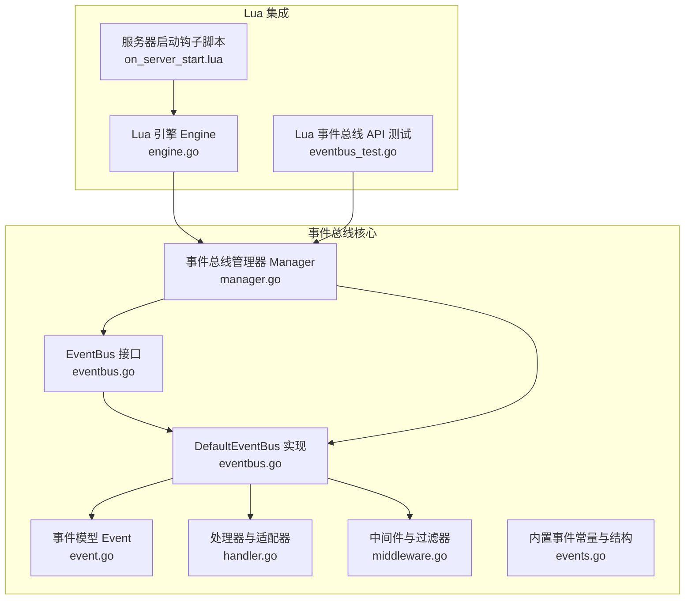
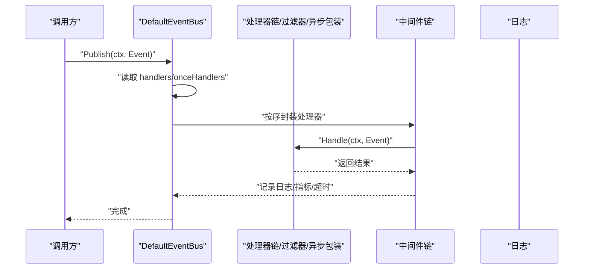
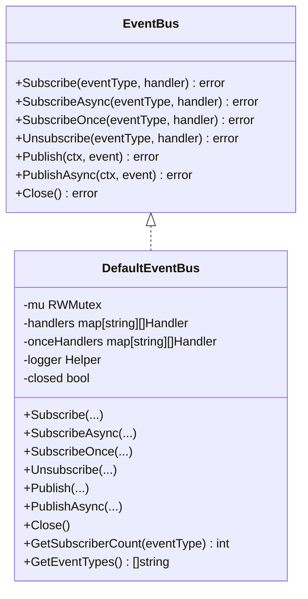
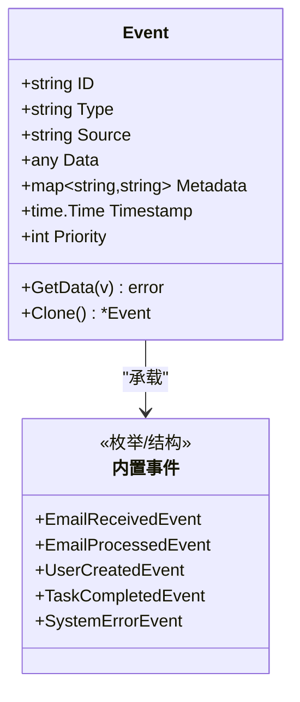
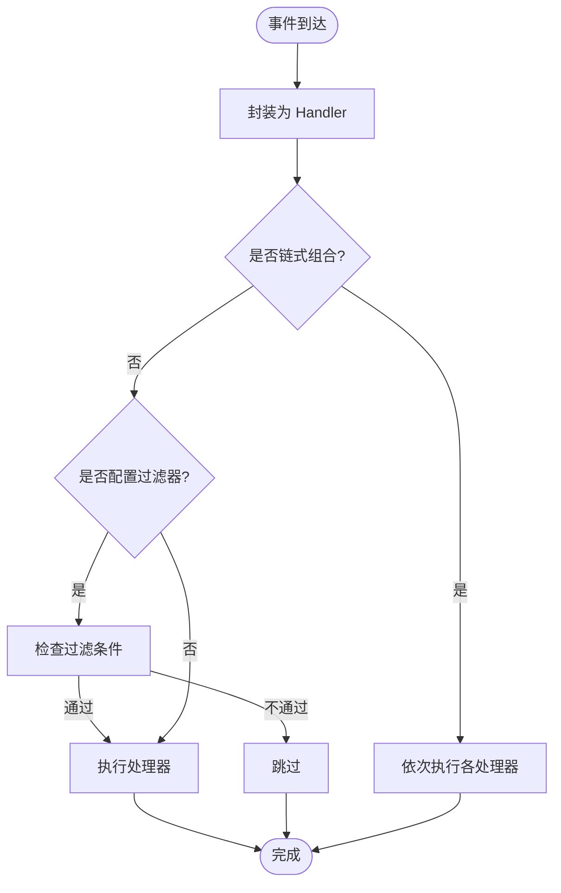
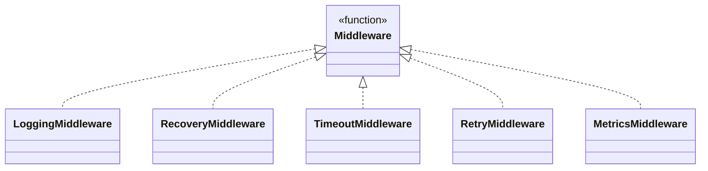
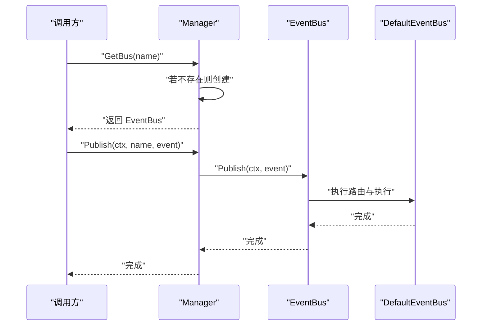
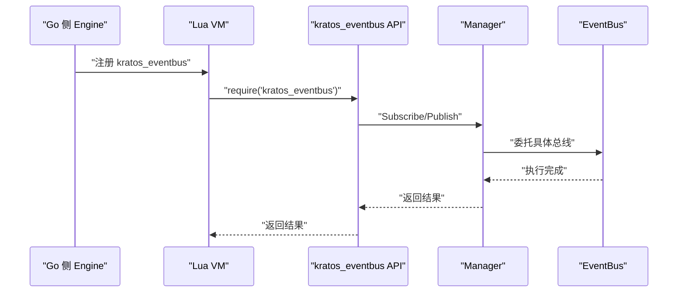
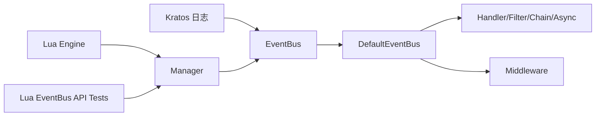

# 事件钩子

<cite>
**本文引用的文件**
- [eventbus.go](file://backend/pkg/eventbus/eventbus.go)
- [events.go](file://backend/pkg/eventbus/events.go)
- [handler.go](file://backend/pkg/eventbus/handler.go)
- [manager.go](file://backend/pkg/eventbus/manager.go)
- [middleware.go](file://backend/pkg/eventbus/middleware.go)
- [event.go](file://backend/pkg/eventbus/event.go)
- [example_test.go](file://backend/pkg/eventbus/example_test.go)
- [eventbus_test.go](file://backend/pkg/lua/api/eventbus_test.go)
- [engine.go](file://backend/pkg/lua/engine.go)
- [on_server_start.lua](file://backend/app/admin/service/scripts/on_server_start.lua)
</cite>

## 目录
1. [简介](#简介)
2. [项目结构](#项目结构)
3. [核心组件](#核心组件)
4. [架构总览](#架构总览)
5. [组件详解](#组件详解)
6. [依赖关系分析](#依赖关系分析)
7. [性能与并发特性](#性能与并发特性)
8. [故障排查指南](#故障排查指南)
9. [结论](#结论)
10. [附录：使用示例与最佳实践](#附录使用示例与最佳实践)

## 简介
本文件系统性阐述后端事件钩子体系的设计与实现，涵盖事件总线的发布订阅模型、事件处理器注册与路由机制、中间件与过滤器、全局与命名事件总线、以及与Lua脚本引擎的集成。文档同时给出内置事件类型、自定义事件开发指南、异步处理策略、错误处理与性能优化建议，并提供可直接参考的使用示例与开发模板。

## 项目结构
事件钩子系统主要位于 backend/pkg/eventbus 目录，围绕事件总线接口、默认实现、事件模型、处理器与中间件、以及事件总线管理器展开；同时通过 backend/pkg/lua 引擎将事件总线能力暴露给Lua脚本，实现“钩子”式扩展点。

**图表来源**
- [eventbus.go:12-214](file://backend/pkg/eventbus/eventbus.go#L12-L214)
- [event.go:8-113](file://backend/pkg/eventbus/event.go#L8-L113)
- [handler.go:7-82](file://backend/pkg/eventbus/handler.go#L7-L82)
- [middleware.go:10-135](file://backend/pkg/eventbus/middleware.go#L10-L135)
- [manager.go:10-119](file://backend/pkg/eventbus/manager.go#L10-L119)
- [events.go:3-77](file://backend/pkg/eventbus/events.go#L3-L77)
- [engine.go:28-261](file://backend/pkg/lua/engine.go#L28-L261)
- [eventbus_test.go:15-478](file://backend/pkg/lua/api/eventbus_test.go#L15-L478)
- [on_server_start.lua:1-82](file://backend/app/admin/service/scripts/on_server_start.lua#L1-L82)

**章节来源**
- [eventbus.go:12-214](file://backend/pkg/eventbus/eventbus.go#L12-L214)
- [manager.go:10-119](file://backend/pkg/eventbus/manager.go#L10-L119)
- [engine.go:28-261](file://backend/pkg/lua/engine.go#L28-L261)

## 核心组件
- 事件总线接口与默认实现：提供订阅、取消订阅、一次性订阅、同步/异步发布、关闭与统计查询等能力。
- 事件模型：统一的事件载体，支持任意数据载荷、元数据、来源、时间戳与优先级。
- 处理器与适配器：函数适配器、链式处理器、异步处理器、过滤器处理器。
- 中间件：日志、恢复、超时、重试、指标等通用横切逻辑。
- 事件总线管理器：多总线（含全局）管理、按名称获取、发布到指定总线或全局总线。
- 内置事件类型与数据结构：邮件、用户、任务、系统等常用事件。
- Lua 集成：将事件总线以API形式暴露给Lua脚本，支持从Go侧注册回调与脚本，执行钩子时调用Lua脚本或回调。

**章节来源**
- [eventbus.go:12-214](file://backend/pkg/eventbus/eventbus.go#L12-L214)
- [event.go:8-113](file://backend/pkg/eventbus/event.go#L8-L113)
- [handler.go:7-82](file://backend/pkg/eventbus/handler.go#L7-L82)
- [middleware.go:10-135](file://backend/pkg/eventbus/middleware.go#L10-L135)
- [manager.go:10-119](file://backend/pkg/eventbus/manager.go#L10-L119)
- [events.go:3-77](file://backend/pkg/eventbus/events.go#L3-L77)
- [engine.go:28-261](file://backend/pkg/lua/engine.go#L28-L261)

## 架构总览
事件钩子系统采用“事件总线 + 处理器 + 中间件”的分层架构。默认事件总线负责事件路由与执行；管理器提供多总线隔离与全局总线；Lua引擎将事件总线能力注入Lua运行时，使脚本可订阅事件、发布事件、或作为钩子回调参与流程控制。

**图表来源**
- [eventbus.go:106-152](file://backend/pkg/eventbus/eventbus.go#L106-L152)
- [handler.go:23-82](file://backend/pkg/eventbus/handler.go#L23-L82)
- [middleware.go:13-114](file://backend/pkg/eventbus/middleware.go#L13-L114)

**章节来源**
- [eventbus.go:106-152](file://backend/pkg/eventbus/eventbus.go#L106-L152)
- [handler.go:23-82](file://backend/pkg/eventbus/handler.go#L23-L82)
- [middleware.go:13-114](file://backend/pkg/eventbus/middleware.go#L13-L114)

## 组件详解

### 事件总线接口与默认实现
- 接口能力：订阅/取消订阅、一次性订阅、同步/异步发布、关闭、统计查询。
- 默认实现要点：
  - 使用读写锁保护订阅表与一次性订阅表，保证并发安全。
  - 同步发布时先执行常规处理器，再执行一次性处理器并清理。
  - 异步发布使用带超时的背景上下文，避免调用方取消影响后台处理。
  - 关闭后拒绝新订阅，清空订阅表并记录日志。

**图表来源**
- [eventbus.go:12-52](file://backend/pkg/eventbus/eventbus.go#L12-L52)
- [eventbus.go:54-184](file://backend/pkg/eventbus/eventbus.go#L54-L184)

**章节来源**
- [eventbus.go:12-52](file://backend/pkg/eventbus/eventbus.go#L12-L52)
- [eventbus.go:54-184](file://backend/pkg/eventbus/eventbus.go#L54-L184)

### 事件模型与内置事件
- 事件模型包含：唯一ID、类型、来源、数据载荷、元数据、时间戳、优先级。
- 内置事件类型覆盖邮件、用户、任务、系统等场景，并提供对应的数据结构体用于强类型事件处理。

**图表来源**
- [event.go:8-113](file://backend/pkg/eventbus/event.go#L8-L113)
- [events.go:3-77](file://backend/pkg/eventbus/events.go#L3-L77)

**章节来源**
- [event.go:8-113](file://backend/pkg/eventbus/event.go#L8-L113)
- [events.go:3-77](file://backend/pkg/eventbus/events.go#L3-L77)

### 处理器与路由机制
- 函数适配器：将普通函数转换为处理器接口，便于直接注册。
- 链式处理器：将多个处理器串联，顺序执行，任一失败即中断。
- 异步处理器：包装处理器，在独立goroutine中执行，不阻塞发布者。
- 过滤处理器：基于事件属性进行条件过滤，仅在满足条件时执行。

**图表来源**
- [handler.go:18-82](file://backend/pkg/eventbus/handler.go#L18-L82)

**章节来源**
- [handler.go:18-82](file://backend/pkg/eventbus/handler.go#L18-L82)

### 中间件与横切能力
- 日志中间件：记录事件类型、ID、来源及处理结果。
- 恢复中间件：捕获panic并返回特定错误类型，避免进程崩溃。
- 超时中间件：为处理器执行设置超时，超时返回特定错误类型。
- 重试中间件：在失败时按次数与延迟重试。
- 指标中间件：统计处理耗时与成功状态。

**图表来源**
- [middleware.go:10-135](file://backend/pkg/eventbus/middleware.go#L10-L135)

**章节来源**
- [middleware.go:10-135](file://backend/pkg/eventbus/middleware.go#L10-L135)

### 事件总线管理器
- 提供全局总线与命名总线，按需创建。
- 支持向指定总线或全局总线发布事件。
- 提供统计接口，查询各总线已订阅的事件类型。

**图表来源**
- [manager.go:28-91](file://backend/pkg/eventbus/manager.go#L28-L91)

**章节来源**
- [manager.go:28-91](file://backend/pkg/eventbus/manager.go#L28-L91)

### Lua 集成与钩子
- Lua 引擎将事件总线API注入Lua运行时，脚本可通过 require("kratos_eventbus") 订阅/发布事件。
- 支持命名总线隔离，确保不同业务域事件互不影响。
- 服务器启动钩子脚本演示了如何在服务启动时注册钩子并执行初始化逻辑。

**图表来源**
- [engine.go:191-261](file://backend/pkg/lua/engine.go#L191-L261)
- [eventbus_test.go:15-478](file://backend/pkg/lua/api/eventbus_test.go#L15-L478)

**章节来源**
- [engine.go:191-261](file://backend/pkg/lua/engine.go#L191-L261)
- [eventbus_test.go:15-478](file://backend/pkg/lua/api/eventbus_test.go#L15-L478)
- [on_server_start.lua:13-79](file://backend/app/admin/service/scripts/on_server_start.lua#L13-L79)

## 依赖关系分析
- 事件总线依赖 Kratos 日志库进行日志输出。
- 管理器聚合多个事件总线实例，形成多总线拓扑。
- Lua 引擎通过API模块向Lua暴露事件总线能力，实现脚本化扩展。
- 示例与测试验证了典型使用路径：基础发布订阅、中间件链、命名总线、异步发布、一次性订阅、链式处理器与过滤器。

**图表来源**
- [eventbus.go:3-10](file://backend/pkg/eventbus/eventbus.go#L3-L10)
- [manager.go:3-8](file://backend/pkg/eventbus/manager.go#L3-L8)
- [engine.go:3-19](file://backend/pkg/lua/engine.go#L3-L19)
- [eventbus_test.go:3-13](file://backend/pkg/lua/api/eventbus_test.go#L3-L13)

**章节来源**
- [eventbus.go:3-10](file://backend/pkg/eventbus/eventbus.go#L3-L10)
- [manager.go:3-8](file://backend/pkg/eventbus/manager.go#L3-L8)
- [engine.go:3-19](file://backend/pkg/lua/engine.go#L3-L19)
- [eventbus_test.go:3-13](file://backend/pkg/lua/api/eventbus_test.go#L3-L13)

## 性能与并发特性
- 并发安全：默认实现使用读写锁保护订阅表，避免竞态。
- 执行模型：同步发布按订阅顺序串行执行，异步发布在独立goroutine执行，减少阻塞。
- 资源管理：关闭事件总线会清空订阅表并拒绝新订阅，防止资源泄漏。
- 超时与恢复：中间件提供超时与panic恢复，提升稳定性。
- 统计接口：可查询事件类型集合，辅助运维与容量规划。

**章节来源**
- [eventbus.go:54-184](file://backend/pkg/eventbus/eventbus.go#L54-L184)
- [middleware.go:44-88](file://backend/pkg/eventbus/middleware.go#L44-L88)
- [manager.go:93-118](file://backend/pkg/eventbus/manager.go#L93-L118)

## 故障排查指南
- 发布失败或无响应
  - 检查事件总线是否已关闭。
  - 查看处理器返回的错误日志，确认是否有panic被恢复中间件捕获。
  - 若为超时，调整中间件超时配置或优化处理器逻辑。
- 订阅未生效
  - 确认事件类型字符串一致且大小写正确。
  - 检查一次性订阅在首次触发后是否被自动清理。
- 命名总线隔离问题
  - 确认发布时使用的总线名称与订阅时一致。
  - 使用统计接口核对事件类型集合。
- Lua 脚本执行异常
  - 检查脚本执行超时与VM池状态。
  - 确认kratos_eventbus模块已正确注册并可用。

**章节来源**
- [eventbus.go:111-114](file://backend/pkg/eventbus/eventbus.go#L111-L114)
- [middleware.go:116-135](file://backend/pkg/eventbus/middleware.go#L116-L135)
- [manager.go:93-118](file://backend/pkg/eventbus/manager.go#L93-L118)
- [engine.go:263-328](file://backend/pkg/lua/engine.go#L263-L328)

## 结论
该事件钩子系统以简洁的接口与默认实现为核心，结合中间件与过滤器提供了强大的扩展能力；通过管理器实现多总线隔离与全局总线统一；借助Lua引擎将事件总线能力开放给脚本，形成“钩子+事件”的复合扩展模型。系统在并发安全、异步处理、错误恢复与可观测性方面均有良好设计，适合在复杂业务场景中构建松耦合、可演进的事件驱动架构。

## 附录：使用示例与最佳实践

### 内置事件类型一览
- 邮件类：接收、发送、删除、已读、加星、处理完成、处理失败。
- 用户类：创建、更新、删除、登录、登出。
- 任务类：创建、开始、完成、失败、取消。
- 系统类：启动、停止、错误。

**章节来源**
- [events.go:3-32](file://backend/pkg/eventbus/events.go#L3-L32)

### 自定义事件开发指南
- 定义事件类型与数据结构
  - 选择合适的事件类型标识符，遵循“领域.动作”的命名规范。
  - 为强类型事件定义专用数据结构，便于处理器解析。
- 创建事件并填充载荷
  - 使用事件构造器创建事件，设置来源、元数据、优先级等。
- 注册处理器
  - 可直接使用函数适配器，或组合链式处理器、过滤器处理器、异步处理器。
- 应用中间件
  - 在处理器外层包裹日志、超时、恢复、重试、指标等中间件。
- 触发事件
  - 在业务流程的关键节点发布事件，必要时使用异步发布避免阻塞。

**章节来源**
- [event.go:32-97](file://backend/pkg/eventbus/event.go#L32-L97)
- [handler.go:18-82](file://backend/pkg/eventbus/handler.go#L18-L82)
- [middleware.go:13-114](file://backend/pkg/eventbus/middleware.go#L13-L114)

### 异步处理与性能优化
- 异步发布：对非关键路径或耗时操作使用异步发布，降低主流程延迟。
- 超时控制：为耗时处理器设置合理超时，避免长时间阻塞。
- 错误恢复：启用恢复中间件，防止panic导致整体失败。
- 重试策略：对临时性失败的处理器启用有限次重试。
- 指标监控：通过指标中间件收集处理耗时与成功率，持续优化。

**章节来源**
- [eventbus.go:154-167](file://backend/pkg/eventbus/eventbus.go#L154-L167)
- [middleware.go:44-104](file://backend/pkg/eventbus/middleware.go#L44-L104)

### 具体使用示例与开发模板
- 基础发布订阅
  - 参考示例：[Example_basic:12-32](file://backend/pkg/eventbus/example_test.go#L12-L32)
- 强类型事件数据
  - 参考示例：[Example_typedEvents:34-62](file://backend/pkg/eventbus/example_test.go#L34-L62)
- 中间件链
  - 参考示例：[Example_middleware:64-93](file://backend/pkg/eventbus/example_test.go#L64-L93)
- 管理器与命名总线
  - 参考示例：[Example_manager:95-127](file://backend/pkg/eventbus/example_test.go#L95-L127)
- 异步处理器
  - 参考示例：[Example_asyncHandlers:129-153](file://backend/pkg/eventbus/example_test.go#L129-L153)
- 过滤器处理器
  - 参考示例：[Example_filterHandler:155-182](file://backend/pkg/eventbus/example_test.go#L155-L182)
- 一次性订阅
  - 参考示例：[Example_subscribeOnce:184-207](file://backend/pkg/eventbus/example_test.go#L184-L207)
- 链式处理器
  - 参考示例：[Example_chainHandlers:209-241](file://backend/pkg/eventbus/example_test.go#L209-L241)
- Lua 事件总线API
  - 参考测试：[TestEventBusAPI_*:15-478](file://backend/pkg/lua/api/eventbus_test.go#L15-L478)
- 服务器启动钩子
  - 参考脚本：[on_server_start.lua:13-79](file://backend/app/admin/service/scripts/on_server_start.lua#L13-L79)