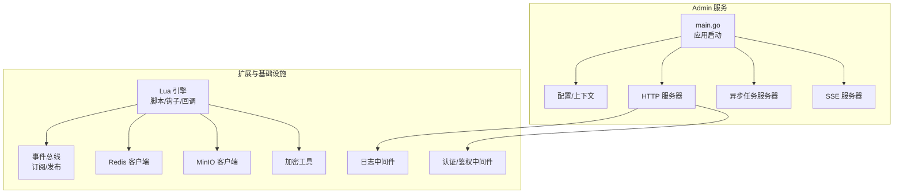
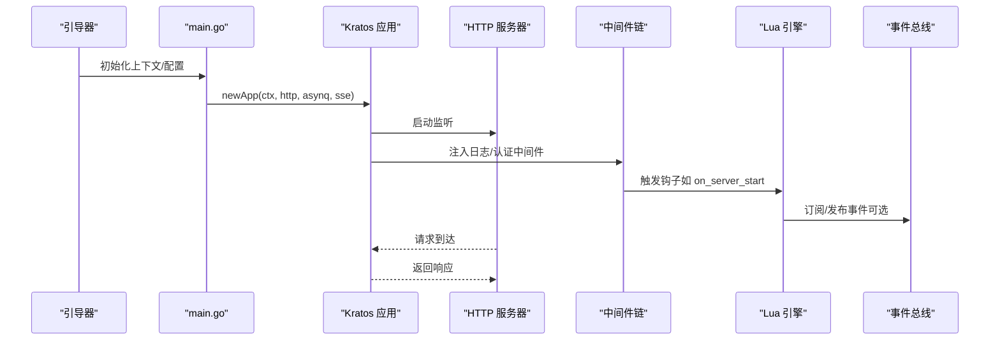
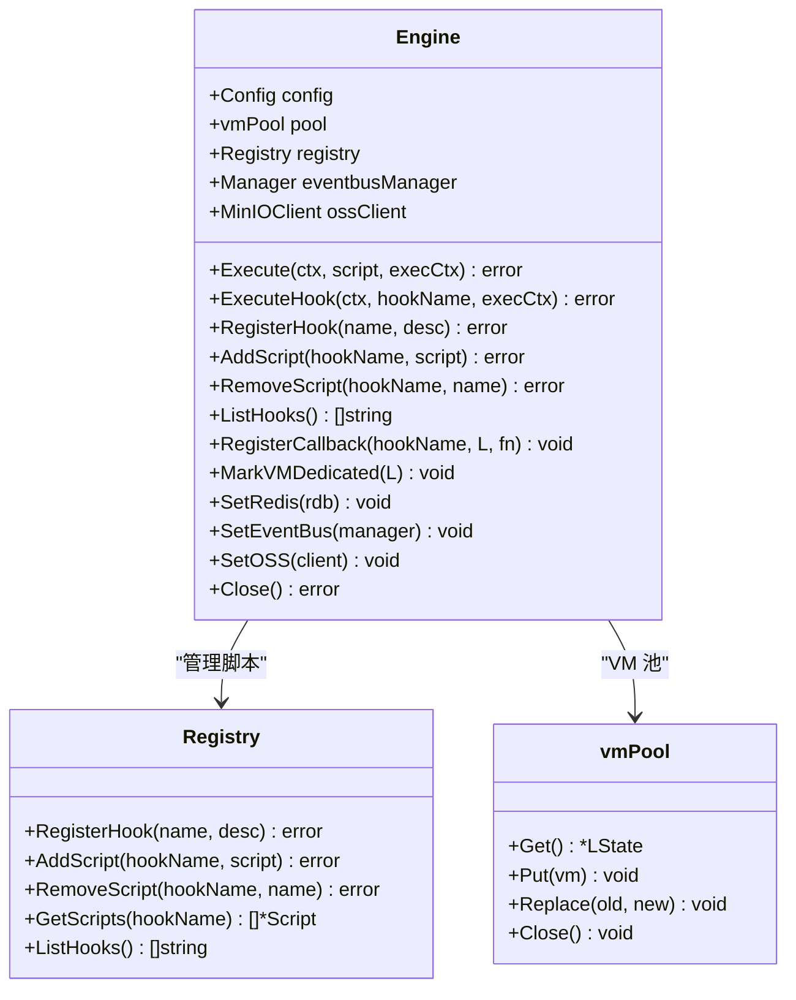
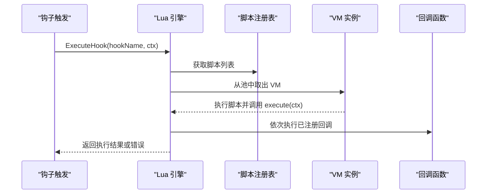
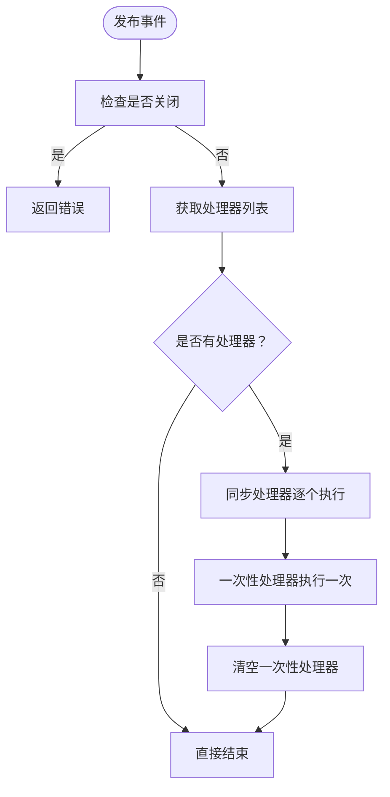
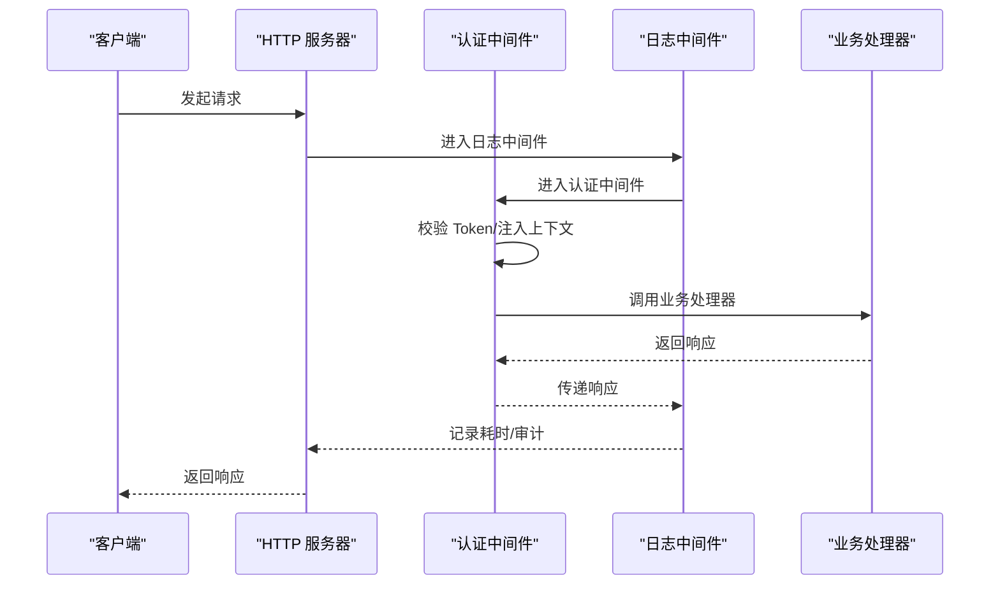
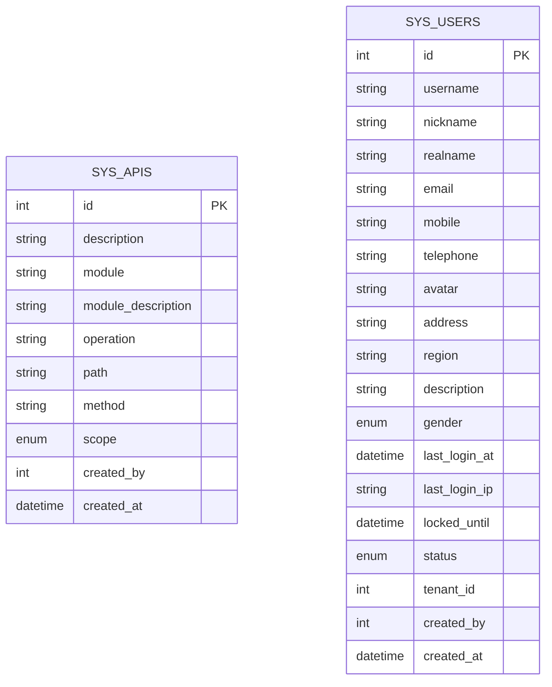
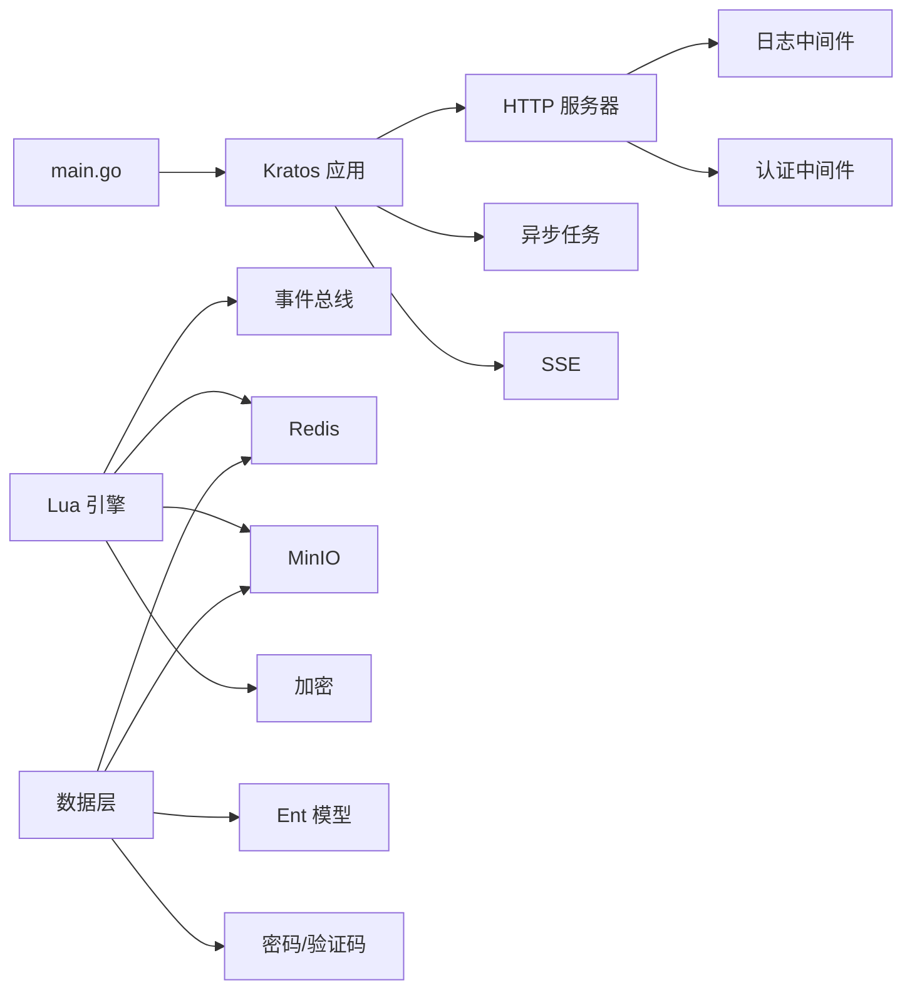

# 扩展开发

<cite>
**本文引用的文件**   
- [backend/app/admin/service/cmd/server/main.go](file://backend/app/admin/service/cmd/server/main.go)
- [backend/pkg/lua/engine.go](file://backend/pkg/lua/engine.go)
- [backend/app/admin/service/scripts/on_server_start.lua](file://backend/app/admin/service/scripts/on_server_start.lua)
- [backend/pkg/eventbus/eventbus.go](file://backend/pkg/eventbus/eventbus.go)
- [backend/pkg/middleware/logging/logging.go](file://backend/pkg/middleware/logging/logging.go)
- [backend/pkg/middleware/auth/auth.go](file://backend/pkg/middleware/auth/auth.go)
- [backend/app/admin/service/internal/data/data.go](file://backend/app/admin/service/internal/data/data.go)
- [backend/app/admin/service/internal/data/ent/schema/api.go](file://backend/app/admin/service/internal/data/ent/schema/api.go)
- [backend/app/admin/service/internal/data/ent/schema/user.go](file://backend/app/admin/service/internal/data/ent/schema/user.go)
- [backend/pkg/crypto/aes_gcm.go](file://backend/pkg/crypto/aes_gcm.go)
</cite>

## 目录
1. [简介](#简介)
2. [项目结构](#项目结构)
3. [核心组件](#核心组件)
4. [架构总览](#架构总览)
5. [详细组件分析](#详细组件分析)
6. [依赖分析](#依赖分析)
7. [性能考虑](#性能考虑)
8. [故障排查指南](#故障排查指南)
9. [结论](#结论)
10. [附录](#附录)

## 简介
本指南面向希望在 GoWind Admin 后端进行扩展开发的工程师，系统讲解插件系统（Lua 脚本引擎）、事件钩子机制、中间件扩展、自定义服务开发、第三方集成（OAuth2、LDAP、邮件/短信）、API 扩展（Protobuf 协议与前端集成）以及最佳实践（模块化、配置管理、版本兼容）。文档以仓库现有实现为依据，结合架构图与流程图帮助快速上手。

## 项目结构
后端采用 Kratos 应用框架，Admin 服务作为入口，通过引导器启动 HTTP、异步任务与 SSE 传输；核心能力由独立包提供：Lua 引擎、事件总线、中间件、加密、对象存储等。Admin 服务内部使用 Ent 数据模型与 Redis 缓存，支持可插拔的脚本与钩子扩展。

**图表来源**
- [backend/app/admin/service/cmd/server/main.go:1-76](file://backend/app/admin/service/cmd/server/main.go#L1-L76)
- [backend/pkg/lua/engine.go:1-755](file://backend/pkg/lua/engine.go#L1-L755)
- [backend/pkg/eventbus/eventbus.go:1-214](file://backend/pkg/eventbus/eventbus.go#L1-L214)
- [backend/pkg/middleware/logging/logging.go:1-52](file://backend/pkg/middleware/logging/logging.go#L1-L52)
- [backend/pkg/middleware/auth/auth.go:1-122](file://backend/pkg/middleware/auth/auth.go#L1-L122)
- [backend/app/admin/service/internal/data/data.go:1-63](file://backend/app/admin/service/internal/data/data.go#L1-L63)
- [backend/pkg/crypto/aes_gcm.go:1-154](file://backend/pkg/crypto/aes_gcm.go#L1-L154)

**章节来源**
- [backend/app/admin/service/cmd/server/main.go:1-76](file://backend/app/admin/service/cmd/server/main.go#L1-L76)

## 核心组件
- Lua 脚本引擎：提供沙箱 VM 池、安全标准库、API 注册、钩子执行、回调注册、超时控制与资源回收。
- 事件总线：支持同步/异步订阅、一次性订阅、发布、统计与关闭。
- 中间件：日志中间件（含登录/接口审计）、认证/鉴权中间件（注入操作者、租户、元数据、权限校验）。
- 数据与缓存：Ent 数据模型（API、用户等）、Redis 客户端、MinIO 客户端、密码加密与验证码生成。
- 加密：AES-256-GCM 封装，带前缀标识与错误处理。

**章节来源**
- [backend/pkg/lua/engine.go:1-755](file://backend/pkg/lua/engine.go#L1-L755)
- [backend/pkg/eventbus/eventbus.go:1-214](file://backend/pkg/eventbus/eventbus.go#L1-L214)
- [backend/pkg/middleware/logging/logging.go:1-52](file://backend/pkg/middleware/logging/logging.go#L1-L52)
- [backend/pkg/middleware/auth/auth.go:1-122](file://backend/pkg/middleware/auth/auth.go#L1-L122)
- [backend/app/admin/service/internal/data/data.go:1-63](file://backend/app/admin/service/internal/data/data.go#L1-L63)
- [backend/pkg/crypto/aes_gcm.go:1-154](file://backend/pkg/crypto/aes_gcm.go#L1-L154)

## 架构总览
下图展示 Admin 服务启动、中间件链路、Lua 钩子与事件总线交互、以及数据访问层的协作关系。

**图表来源**
- [backend/app/admin/service/cmd/server/main.go:46-76](file://backend/app/admin/service/cmd/server/main.go#L46-L76)
- [backend/pkg/middleware/logging/logging.go:14-52](file://backend/pkg/middleware/logging/logging.go#L14-L52)
- [backend/pkg/middleware/auth/auth.go:24-122](file://backend/pkg/middleware/auth/auth.go#L24-L122)
- [backend/pkg/lua/engine.go:330-398](file://backend/pkg/lua/engine.go#L330-L398)
- [backend/pkg/eventbus/eventbus.go:106-152](file://backend/pkg/eventbus/eventbus.go#L106-L152)

## 详细组件分析

### Lua 插件系统与钩子机制
- 引擎职责：管理 VM 池、加载脚本、注册安全标准库与 API、执行脚本/回调、超时与错误处理、上下文传递。
- 钩子机制：注册钩子点、添加脚本、执行回调、按优先级顺序执行、支持“关键”脚本中断处理。
- API 注册：日志、缓存（Redis）、事件总线、对象存储（MinIO）、加解密、任务、工具函数等。
- 上下文：通过全局表向 Lua 暴露 get/set/stop 方法，允许脚本读写上下文数据并可中止后续处理。
- 示例脚本：on_server_start.lua 展示了如何在服务启动时注册钩子并读取上下文配置。

**图表来源**
- [backend/pkg/lua/engine.go:28-97](file://backend/pkg/lua/engine.go#L28-L97)
- [backend/pkg/lua/engine.go:446-482](file://backend/pkg/lua/engine.go#L446-L482)
- [backend/pkg/lua/engine.go:674-755](file://backend/pkg/lua/engine.go#L674-L755)

**图表来源**
- [backend/pkg/lua/engine.go:330-398](file://backend/pkg/lua/engine.go#L330-L398)
- [backend/pkg/lua/engine.go:556-573](file://backend/pkg/lua/engine.go#L556-L573)

**章节来源**
- [backend/pkg/lua/engine.go:1-755](file://backend/pkg/lua/engine.go#L1-L755)
- [backend/app/admin/service/scripts/on_server_start.lua:1-82](file://backend/app/admin/service/scripts/on_server_start.lua#L1-L82)

### 事件总线
- 功能：订阅/取消订阅、一次性订阅、同步/异步发布、关闭清理、订阅数量与事件类型查询。
- 并发：读写锁保护处理器映射，异步发布使用独立后台上下文与超时。
- 日志：统一日志辅助器输出调试信息与错误。

**图表来源**
- [backend/pkg/eventbus/eventbus.go:106-152](file://backend/pkg/eventbus/eventbus.go#L106-L152)
- [backend/pkg/eventbus/eventbus.go:154-167](file://backend/pkg/eventbus/eventbus.go#L154-L167)

**章节来源**
- [backend/pkg/eventbus/eventbus.go:1-214](file://backend/pkg/eventbus/eventbus.go#L1-L214)

### 中间件扩展
- 日志中间件：记录登录/登出与 API 调用耗时，支持审计日志中间件组合。
- 认证/鉴权中间件：从元数据提取 Token，校验有效性，注入操作者、租户、组织单元、数据范围、元数据，支持鉴权决策。

**图表来源**
- [backend/pkg/middleware/auth/auth.go:38-121](file://backend/pkg/middleware/auth/auth.go#L38-L121)
- [backend/pkg/middleware/logging/logging.go:31-51](file://backend/pkg/middleware/logging/logging.go#L31-L51)

**章节来源**
- [backend/pkg/middleware/logging/logging.go:1-52](file://backend/pkg/middleware/logging/logging.go#L1-L52)
- [backend/pkg/middleware/auth/auth.go:1-122](file://backend/pkg/middleware/auth/auth.go#L1-L122)

### 自定义服务开发（数据访问层与依赖注入）
- 依赖注入：通过引导上下文获取配置与日志，创建 Redis、MinIO、密码加密、验证码等实例。
- 数据模型：Ent Schema 定义 API 与用户实体字段、注解、索引与混合器，确保唯一性与查询效率。
- 服务接口：建议基于 Protobuf 服务接口定义，结合 Ent 数据访问层实现业务逻辑，并通过 Kratos 服务容器注入依赖。

**图表来源**
- [backend/app/admin/service/internal/data/ent/schema/api.go:12-113](file://backend/app/admin/service/internal/data/ent/schema/api.go#L12-L113)
- [backend/app/admin/service/internal/data/ent/schema/user.go:13-172](file://backend/app/admin/service/internal/data/ent/schema/user.go#L13-L172)

**章节来源**
- [backend/app/admin/service/internal/data/data.go:1-63](file://backend/app/admin/service/internal/data/data.go#L1-L63)
- [backend/app/admin/service/internal/data/ent/schema/api.go:1-113](file://backend/app/admin/service/internal/data/ent/schema/api.go#L1-L113)
- [backend/app/admin/service/internal/data/ent/schema/user.go:1-172](file://backend/app/admin/service/internal/data/ent/schema/user.go#L1-L172)

### 第三方集成指南
- OAuth2 提供商集成：在认证中间件基础上，扩展 Token 校验器与 Operator 元数据注入，确保跨系统身份一致。
- LDAP 目录服务：通过自定义数据源适配器对接 LDAP，将用户属性映射到系统用户模型，结合 Ent 的 Tenant/OrgUnit 字段实现多租户隔离。
- 邮件/短信服务：封装第三方 SDK，提供统一发送接口，结合 Lua 钩子在关键事件（如注册、登录、重置密码）触发消息通知。

[本节为概念性指导，不直接分析具体文件]

### API 扩展开发指南
- Protobuf 协议定义：在 backend/api/gen/go 下新增服务与消息定义，生成 Go 代码并与 Kratos gRPC/HTTP 适配器集成。
- 服务实现：基于生成的服务接口实现业务逻辑，注入依赖（Redis、数据库、事件总线），遵循中间件链路。
- 前端集成：根据 buf 生成的 TypeScript/Vue/React 类型定义，调用新服务接口，保持命名与参数一致性。

[本节为概念性指导，不直接分析具体文件]

## 依赖分析
- Admin 服务启动依赖 Kratos 引导器与传输组件（HTTP、异步任务、SSE）。
- 中间件依赖认证/鉴权引擎与元数据注入模块。
- Lua 引擎依赖事件总线、Redis、MinIO、日志与转换工具。
- 数据层依赖 Ent、Redis、MinIO、密码工具与验证码生成器。

**图表来源**
- [backend/app/admin/service/cmd/server/main.go:46-76](file://backend/app/admin/service/cmd/server/main.go#L46-L76)
- [backend/pkg/middleware/logging/logging.go:14-52](file://backend/pkg/middleware/logging/logging.go#L14-L52)
- [backend/pkg/middleware/auth/auth.go:24-122](file://backend/pkg/middleware/auth/auth.go#L24-L122)
- [backend/pkg/lua/engine.go:191-261](file://backend/pkg/lua/engine.go#L191-L261)
- [backend/app/admin/service/internal/data/data.go:23-62](file://backend/app/admin/service/internal/data/data.go#L23-L62)

**章节来源**
- [backend/app/admin/service/cmd/server/main.go:1-76](file://backend/app/admin/service/cmd/server/main.go#L1-L76)
- [backend/pkg/lua/engine.go:1-755](file://backend/pkg/lua/engine.go#L1-L755)
- [backend/pkg/middleware/logging/logging.go:1-52](file://backend/pkg/middleware/logging/logging.go#L1-L52)
- [backend/pkg/middleware/auth/auth.go:1-122](file://backend/pkg/middleware/auth/auth.go#L1-L122)
- [backend/app/admin/service/internal/data/data.go:1-63](file://backend/app/admin/service/internal/data/data.go#L1-L63)

## 性能考虑
- Lua VM 池：合理设置池大小与最大 VM 数，避免频繁创建销毁；为长耗时脚本标记专用 VM，防止被回收。
- 超时控制：为脚本执行与回调设置超时，失败时替换 VM 并记录日志。
- 中间件链：减少不必要的日志与鉴权开销，批量审计日志可异步发布。
- 数据访问：为高频查询建立合适索引，使用 Ent 查询构建器避免 N+1；Redis 缓存热点数据。
- 事件总线：避免过多一次性处理器，异步发布使用独立上下文与超时，防止阻塞。

[本节提供通用建议，不直接分析具体文件]

## 故障排查指南
- Lua 脚本超时：检查 VMTimeout 配置与脚本复杂度；查看日志中的超时与替换 VM 记录。
- 钩子未触发：确认脚本已启用且优先级设置正确；检查注册表与回调注册情况。
- 中间件异常：核对 Token 格式与校验器配置；检查注入的 Operator/Tenant/Metadata 是否完整。
- 事件总线无订阅：确认订阅类型与处理器注册；检查关闭状态与一次性处理器是否提前清理。
- 数据模型异常：核对唯一索引与字段约束；检查 Ent 迁移与索引重建。

**章节来源**
- [backend/pkg/lua/engine.go:320-328](file://backend/pkg/lua/engine.go#L320-L328)
- [backend/pkg/lua/engine.go:437-444](file://backend/pkg/lua/engine.go#L437-L444)
- [backend/pkg/middleware/auth/auth.go:46-61](file://backend/pkg/middleware/auth/auth.go#L46-L61)
- [backend/pkg/eventbus/eventbus.go:107-152](file://backend/pkg/eventbus/eventbus.go#L107-L152)

## 结论
通过 Lua 脚本引擎与事件总线，GoWind Admin 提供了强大的可扩展能力；配合中间件链与数据层抽象，开发者可以快速实现自定义服务、第三方集成与 API 扩展。建议遵循模块化、配置管理与版本兼容的最佳实践，确保扩展的稳定性与可维护性。

[本节为总结性内容，不直接分析具体文件]

## 附录
- 开发模板与示例
  - 新增钩子与脚本：参考 on_server_start.lua 的注册方式，在服务启动阶段完成初始化。
  - 中间件扩展：在日志/认证中间件基础上增加审计或策略处理，注意上下文注入与错误传播。
  - 数据访问层：基于 Ent Schema 定义实体与索引，结合 Redis/MinIO 实现业务数据与附件管理。
  - 加密与安全：使用 AES-256-GCM 对敏感数据进行加解密，确保密钥管理与前缀识别。

**章节来源**
- [backend/app/admin/service/scripts/on_server_start.lua:1-82](file://backend/app/admin/service/scripts/on_server_start.lua#L1-L82)
- [backend/pkg/crypto/aes_gcm.go:1-154](file://backend/pkg/crypto/aes_gcm.go#L1-L154)