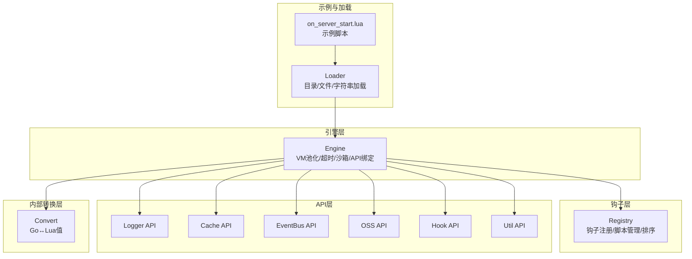
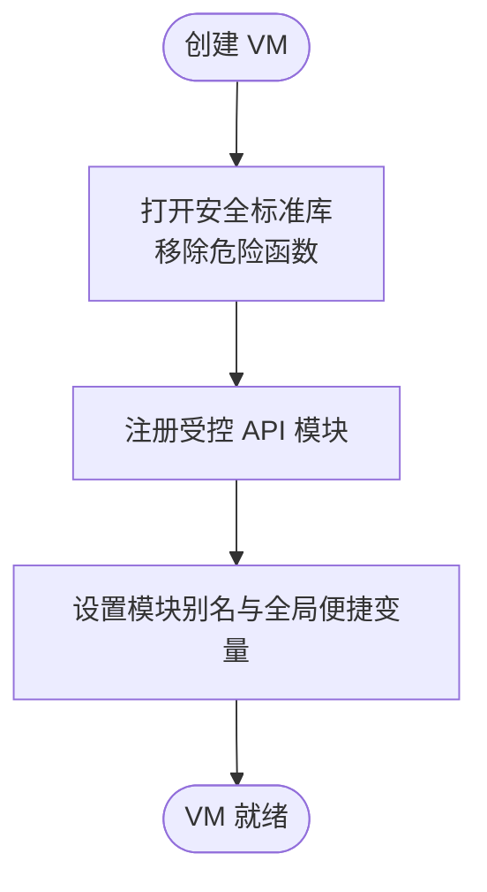
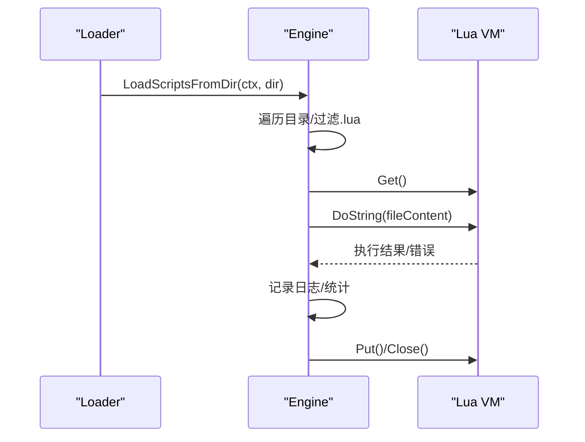
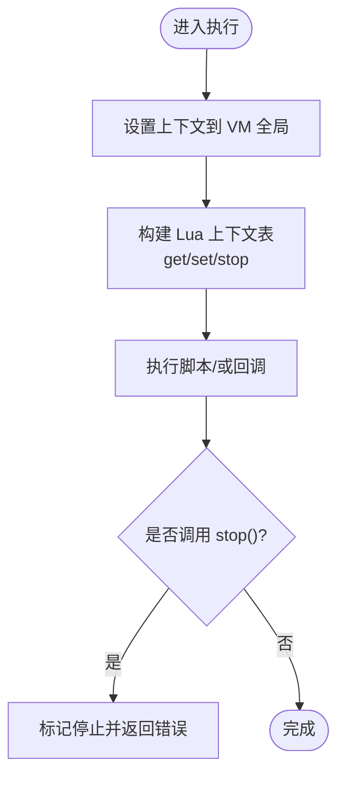
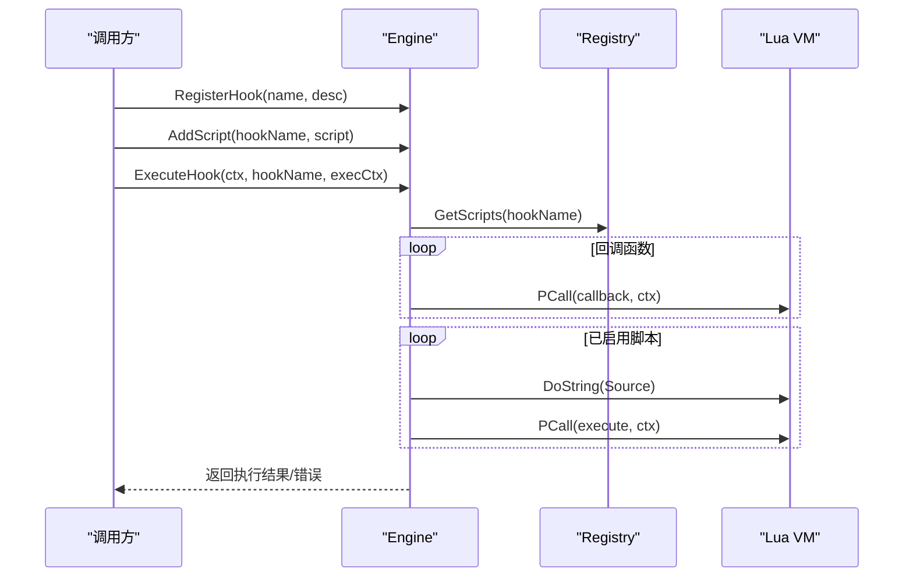
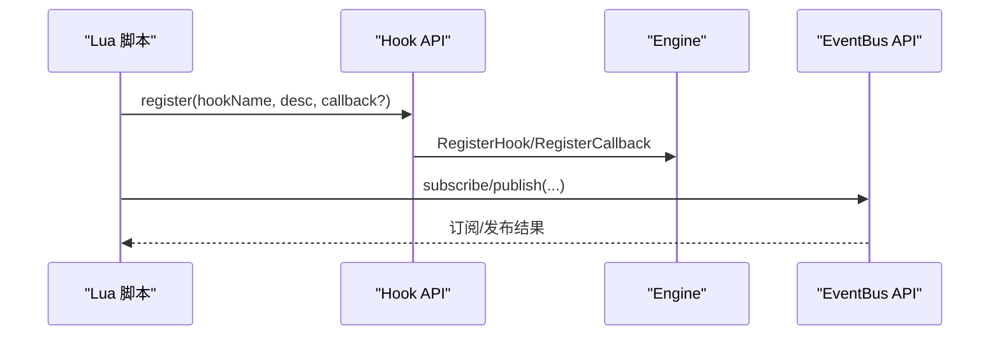
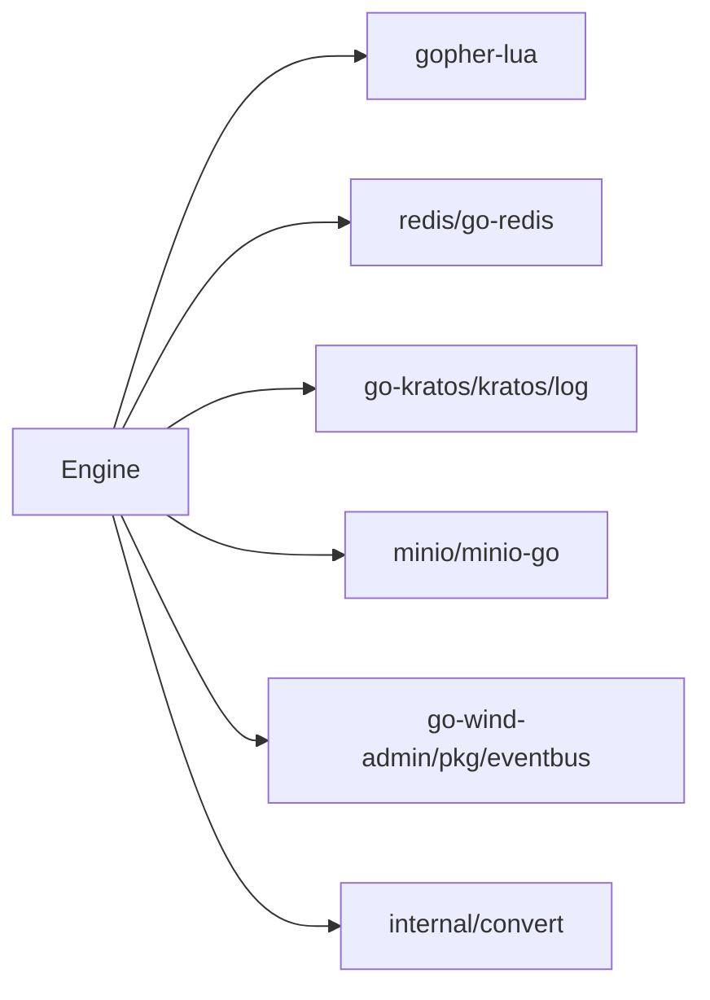

# 插件系统

<cite>
**本文引用的文件**
- [engine.go](file://backend/pkg/lua/engine.go)
- [context.go](file://backend/pkg/lua/context.go)
- [loader.go](file://backend/pkg/lua/loader.go)
- [script.go](file://backend/pkg/lua/script.go)
- [registry.go](file://backend/pkg/lua/hook/registry.go)
- [logger.go](file://backend/pkg/lua/api/logger.go)
- [cache.go](file://backend/pkg/lua/api/cache.go)
- [eventbus.go](file://backend/pkg/lua/api/eventbus.go)
- [oss.go](file://backend/pkg/lua/api/oss.go)
- [hook.go](file://backend/pkg/lua/api/hook.go)
- [util.go](file://backend/pkg/lua/api/util.go)
- [convert.go](file://backend/pkg/lua/internal/convert/convert.go)
- [on_server_start.lua](file://backend/app/admin/service/scripts/on_server_start.lua)
</cite>

## 目录
1. [简介](#简介)
2. [项目结构](#项目结构)
3. [核心组件](#核心组件)
4. [架构总览](#架构总览)
5. [详细组件分析](#详细组件分析)
6. [依赖分析](#依赖分析)
7. [性能考虑](#性能考虑)
8. [故障排查指南](#故障排查指南)
9. [结论](#结论)
10. [附录：开发与测试示例](#附录开发与测试示例)

## 简介
本文件系统性阐述 GoWind Admin 的插件系统（基于 Lua 脚本引擎）的设计与实现，涵盖以下主题：
- Lua 引擎初始化与沙箱配置
- 脚本加载机制（目录扫描、单文件加载、字符串加载）
- 上下文管理（Context）与数据传递
- 插件生命周期（注册、执行、卸载）
- 插件与主系统的交互（API 调用、事件回调、钩子注册）
- 安全机制（沙箱限制、模块白名单、超时与内存限制）
- 调试与测试方法
- 性能优化建议

## 项目结构
插件系统位于后端包 backend/pkg/lua 下，主要由以下层次构成：
- 引擎层：负责 VM 池化、安全沙箱、API 注册、脚本执行与钩子调度
- 钩子层：注册表与脚本管理，支持优先级排序与启用状态
- API 层：日志、缓存、事件总线、对象存储、钩子自注册、工具函数
- 内部转换层：Go 与 Lua 值之间的双向转换
- 示例与加载：从目录自动加载脚本，示例脚本演示启动钩子



**图表来源**
- [engine.go:28-97](file://backend/pkg/lua/engine.go#L28-L97)
- [registry.go:30-41](file://backend/pkg/lua/hook/registry.go#L30-L41)
- [loader.go:11-52](file://backend/pkg/lua/loader.go#L11-L52)
- [logger.go:25-110](file://backend/pkg/lua/api/logger.go#L25-L110)
- [cache.go:15-305](file://backend/pkg/lua/api/cache.go#L15-L305)
- [eventbus.go:63-285](file://backend/pkg/lua/api/eventbus.go#L63-L285)
- [oss.go:15-222](file://backend/pkg/lua/api/oss.go#L15-L222)
- [hook.go:31-143](file://backend/pkg/lua/api/hook.go#L31-L143)
- [util.go:10-64](file://backend/pkg/lua/api/util.go#L10-L64)
- [convert.go:10-90](file://backend/pkg/lua/internal/convert/convert.go#L10-L90)
- [on_server_start.lua:1-82](file://backend/app/admin/service/scripts/on_server_start.lua#L1-L82)

**章节来源**
- [engine.go:28-97](file://backend/pkg/lua/engine.go#L28-L97)
- [loader.go:11-52](file://backend/pkg/lua/loader.go#L11-L52)
- [on_server_start.lua:1-82](file://backend/app/admin/service/scripts/on_server_start.lua#L1-L82)

## 核心组件
- 引擎 Engine：管理 VM 池、沙箱标准库、API 绑定、脚本执行、钩子执行、回调注册、关闭流程
- 上下文 Context：承载执行上下文（用户、请求、日志、取消、停止标志、数据容器）
- 脚本 Script：描述一个可被钩子调用的 Lua 脚本（名称、钩子名、源码、启用、优先级、版本、作者、是否关键）
- 钩子注册表 Registry：维护钩子与其脚本列表，按优先级排序，支持增删查与统计
- API 模块：日志、缓存、事件总线、对象存储、钩子自注册、工具函数
- 值转换器 Convert：在 Go 与 Lua 之间进行类型安全的双向转换

**章节来源**
- [engine.go:28-672](file://backend/pkg/lua/engine.go#L28-L672)
- [context.go:13-222](file://backend/pkg/lua/context.go#L13-L222)
- [script.go:9-63](file://backend/pkg/lua/script.go#L9-L63)
- [registry.go:30-196](file://backend/pkg/lua/hook/registry.go#L30-L196)
- [convert.go:10-277](file://backend/pkg/lua/internal/convert/convert.go#L10-L277)

## 架构总览
插件系统通过 Engine 将 Lua VM 与主系统解耦，提供安全可控的执行环境。Engine 在创建 VM 时仅开放安全标准库，并通过 package.preload 注入受控 API 模块；同时以 VM 池降低创建开销，以超时与专用 VM 标记保障稳定性。

```mermaid
classDiagram
class Engine {
+Config config
+vmPool pool
+Registry registry
+map~string,[]CallbackInfo~ callbacks
+map~*LState,bool~ dedicatedVMs
+NewEngine(config, logger) Engine
+Execute(ctx, script, execCtx) error
+ExecuteHook(ctx, hookName, execCtx) error
+RegisterHook(name, description) error
+AddScript(hookName, script) error
+RemoveScript(hookName, scriptName) error
+LoadScriptsFromDir(ctx, dir) error
+LoadScriptFile(ctx, path) error
+LoadScriptString(ctx, name, source) error
+Close() error
}
class Context {
+string ID
+string HookName
+map~string,interface{}~ Data
+UserContext User
+HTTPContext Request
+log.Helper Logger
+context.Context Cancel
+bool Stopped
+string StopReason
+time.Time StartTime
+Set(key, value) void
+Get(key) interface{}
+Has(key) bool
+Stop(reason) error
}
class Script {
+uint32 ID
+string Name
+string Hook
+string Source
+bool Enabled
+int Priority
+string Description
+int Version
+string Author
+bool Critical
+Hash() string
+Validate() error
}
class Registry {
+map~string,*Hook~ hooks
+RegisterHook(name, description) error
+AddScript(hookName, script) error
+RemoveScript(hookName, scriptName) error
+GetScripts(hookName) []*Script
+ListHooks() []string
}
Engine --> Registry : "管理"
Engine --> Context : "执行时注入"
Engine --> Script : "执行/注册"
```

**图表来源**
- [engine.go:28-97](file://backend/pkg/lua/engine.go#L28-L97)
- [context.go:13-54](file://backend/pkg/lua/context.go#L13-L54)
- [script.go:9-30](file://backend/pkg/lua/script.go#L9-L30)
- [registry.go:30-91](file://backend/pkg/lua/hook/registry.go#L30-L91)

## 详细组件分析

### 引擎初始化与沙箱
- VM 创建：禁用默认 package 库，仅开启基础、表、字符串、数学库，并移除危险函数（如 dofile/loadfile/load/loadstring），显式提供最小化 require 实现
- API 注册：按需注册日志、缓存、事件总线、对象存储、钩子自注册、任务、工具等模块，并在 package.preload 中暴露别名（如 logger、hook、util）
- VM 池：预创建固定数量 VM，空闲复用；超限时替换为新 VM 并关闭旧 VM，避免阻塞



**图表来源**
- [engine.go:99-189](file://backend/pkg/lua/engine.go#L99-L189)
- [engine.go:191-261](file://backend/pkg/lua/engine.go#L191-L261)

**章节来源**
- [engine.go:99-189](file://backend/pkg/lua/engine.go#L99-L189)
- [engine.go:191-261](file://backend/pkg/lua/engine.go#L191-L261)

### 脚本加载机制
- 目录加载：遍历指定目录，过滤 .lua 文件，逐个执行脚本内容，允许脚本在执行期调用 hook.register/hook.add_script 进行自注册
- 单文件加载：读取文件内容并执行，返回错误但不中断后续文件处理
- 字符串加载：直接执行给定源码字符串



**图表来源**
- [loader.go:11-52](file://backend/pkg/lua/loader.go#L11-L52)
- [loader.go:54-92](file://backend/pkg/lua/loader.go#L54-L92)

**章节来源**
- [loader.go:11-52](file://backend/pkg/lua/loader.go#L11-L52)
- [loader.go:54-92](file://backend/pkg/lua/loader.go#L54-L92)

### 上下文管理
- Context 提供线程安全的数据容器，支持 get/set/has/delete/clone 等操作
- 执行时将 Context 转换为 Lua 表，暴露 get/set/stop 方法，便于脚本读写与中止流程
- 支持用户信息、HTTP 请求上下文、日志、取消上下文、停止标记与耗时统计



**图表来源**
- [engine.go:607-644](file://backend/pkg/lua/engine.go#L607-L644)
- [context.go:13-54](file://backend/pkg/lua/context.go#L13-L54)

**章节来源**
- [engine.go:607-644](file://backend/pkg/lua/engine.go#L607-L644)
- [context.go:13-54](file://backend/pkg/lua/context.go#L13-L54)

### 钩子与脚本生命周期
- 注册钩子：Engine 通过 Registry 注册钩子点，支持描述信息
- 添加脚本：支持传入 Script 或兼容结构体，自动提取字段并按优先级排序
- 执行钩子：先执行已注册的回调函数，再按启用状态与优先级顺序执行脚本；任一关键脚本失败即终止
- 卸载脚本：从注册表移除指定钩子下的脚本



**图表来源**
- [engine.go:446-482](file://backend/pkg/lua/engine.go#L446-L482)
- [engine.go:330-398](file://backend/pkg/lua/engine.go#L330-L398)
- [registry.go:61-91](file://backend/pkg/lua/hook/registry.go#L61-L91)

**章节来源**
- [engine.go:446-482](file://backend/pkg/lua/engine.go#L446-L482)
- [engine.go:330-398](file://backend/pkg/lua/engine.go#L330-L398)
- [registry.go:61-91](file://backend/pkg/lua/hook/registry.go#L61-L91)

### 插件与主系统的交互
- API 调用：脚本通过 require("kratos_logger"/"kratos_cache"/...) 使用受控 API
- 事件回调：脚本可通过 EventBus API 订阅/发布事件，或在回调中直接调用
- 钩子注册：脚本可在执行期调用 hook.register/hook.add_script 动态注册钩子与脚本



**图表来源**
- [hook.go:31-143](file://backend/pkg/lua/api/hook.go#L31-L143)
- [eventbus.go:63-285](file://backend/pkg/lua/api/eventbus.go#L63-L285)

**章节来源**
- [hook.go:31-143](file://backend/pkg/lua/api/hook.go#L31-L143)
- [eventbus.go:63-285](file://backend/pkg/lua/api/eventbus.go#L63-L285)

### 安全机制
- 沙箱限制：禁用危险标准库函数，仅保留基础库与安全数学/字符串/表操作
- require 重写：最小化实现，仅从 package.preload 加载受控模块
- 资源访问控制：缓存 API 仅通过 Redis 客户端访问；对象存储 API 仅通过 MinIO 客户端访问；日志 API 仅写入主系统日志
- 执行保护：超时控制（默认 5 秒）、专用 VM 标记、VM 池替换与关闭

**章节来源**
- [engine.go:117-189](file://backend/pkg/lua/engine.go#L117-L189)
- [engine.go:263-328](file://backend/pkg/lua/engine.go#L263-L328)
- [cache.go:15-305](file://backend/pkg/lua/api/cache.go#L15-L305)
- [oss.go:15-222](file://backend/pkg/lua/api/oss.go#L15-L222)

## 依赖分析
- 组件内聚与耦合
  - Engine 与 Registry 高内聚，通过接口解耦钩子注册与脚本管理
  - API 模块均通过 Preload 注入，避免直接导入导致循环依赖
  - Convert 层独立于引擎与 API，提供通用类型转换
- 外部依赖
  - gopher-lua：Lua VM 与运行时
  - redis/go-redis：缓存 API
  - go-kratos/kratos 日志：统一日志输出
  - minio/minio-go：对象存储 API
  - go-wind-admin/pkg/eventbus：事件总线



**图表来源**
- [engine.go:3-19](file://backend/pkg/lua/engine.go#L3-L19)
- [cache.go:3-13](file://backend/pkg/lua/api/cache.go#L3-L13)
- [oss.go:3-13](file://backend/pkg/lua/api/oss.go#L3-L13)
- [eventbus.go:3-13](file://backend/pkg/lua/api/eventbus.go#L3-L13)

**章节来源**
- [engine.go:3-19](file://backend/pkg/lua/engine.go#L3-L19)

## 性能考虑
- VM 池化：预创建固定数量 VM，减少频繁创建销毁开销
- 超时控制：每个执行与回调均设置超时，防止长时间阻塞
- 专用 VM：注册回调或需要持久状态的场景可标记专用 VM，避免被池回收
- 数据转换：尽量避免大对象在上下文间频繁传递，必要时使用缓存 API
- 优先级与短路：关键脚本失败立即终止，减少无效执行

[本节为通用指导，无需特定文件来源]

## 故障排查指南
- 脚本加载失败
  - 检查目录是否存在与权限
  - 查看加载日志与错误堆栈
  - 参考路径：[loader.go:11-52](file://backend/pkg/lua/loader.go#L11-L52)
- 脚本执行超时
  - 调整配置中的 VMTimeout
  - 分析脚本逻辑，避免阻塞操作
  - 参考路径：[engine.go:263-328](file://backend/pkg/lua/engine.go#L263-L328)
- 回调执行失败
  - 检查回调返回值是否为 false 导致中止
  - 参考路径：[engine.go:400-444](file://backend/pkg/lua/engine.go#L400-L444)
- API 使用异常
  - 缓存/事件总线/OSS API 返回错误时会携带错误字符串，检查日志
  - 参考路径：[cache.go:15-305](file://backend/pkg/lua/api/cache.go#L15-L305)、[eventbus.go:63-285](file://backend/pkg/lua/api/eventbus.go#L63-L285)、[oss.go:15-222](file://backend/pkg/lua/api/oss.go#L15-L222)
- 类型转换问题
  - 确认 Go→Lua 与 Lua→Go 的映射规则
  - 参考路径：[convert.go:10-138](file://backend/pkg/lua/internal/convert/convert.go#L10-L138)

**章节来源**
- [loader.go:11-52](file://backend/pkg/lua/loader.go#L11-L52)
- [engine.go:263-328](file://backend/pkg/lua/engine.go#L263-L328)
- [engine.go:400-444](file://backend/pkg/lua/engine.go#L400-L444)
- [cache.go:15-305](file://backend/pkg/lua/api/cache.go#L15-L305)
- [eventbus.go:63-285](file://backend/pkg/lua/api/eventbus.go#L63-L285)
- [oss.go:15-222](file://backend/pkg/lua/api/oss.go#L15-L222)
- [convert.go:10-138](file://backend/pkg/lua/internal/convert/convert.go#L10-L138)

## 结论
GoWind Admin 的插件系统以安全沙箱为核心，结合 VM 池化、超时控制与受控 API，实现了稳定、可扩展的 Lua 脚本执行平台。通过钩子注册与动态脚本添加，系统支持灵活的功能扩展；通过上下文与事件总线，脚本可与主系统深度协作。配合完善的日志与错误处理，开发者可以快速构建并维护生产级插件。

[本节为总结，无需特定文件来源]

## 附录：开发与测试示例

### 示例：服务器启动钩子
- 示例脚本 on_server_start.lua 展示了如何在服务器启动时注册钩子并打印配置信息
- 关键点：require kratos_logger 与 kratos_hook；在 hook.register 的回调中读取 ctx.get("config"/"service")

参考路径：
- [on_server_start.lua:1-82](file://backend/app/admin/service/scripts/on_server_start.lua#L1-L82)

**章节来源**
- [on_server_start.lua:1-82](file://backend/app/admin/service/scripts/on_server_start.lua#L1-L82)

### 示例：脚本注册与执行
- 在脚本中调用 hook.register 注册钩子并附加回调
- 在脚本中调用 hook.add_script 动态添加脚本
- 在主流程中调用 Engine.ExecuteHook 触发钩子执行

参考路径：
- [hook.go:31-143](file://backend/pkg/lua/api/hook.go#L31-L143)
- [engine.go:446-482](file://backend/pkg/lua/engine.go#L446-L482)
- [engine.go:330-398](file://backend/pkg/lua/engine.go#L330-L398)

**章节来源**
- [hook.go:31-143](file://backend/pkg/lua/api/hook.go#L31-L143)
- [engine.go:446-482](file://backend/pkg/lua/engine.go#L446-L482)
- [engine.go:330-398](file://backend/pkg/lua/engine.go#L330-L398)

### 示例：API 使用要点
- 日志：require("kratos_logger") 后使用 info/warn/error/debug 及格式化输出
- 缓存：require("kratos_cache") 后使用 get/set/delete/exists/incr/decr/ttl/keys/hget/hset/hgetall
- 事件总线：require("kratos_eventbus") 后使用 subscribe/subscribe_async/subscribe_once/publish/publish_async/create_event
- 对象存储：require("kratos_oss") 后使用 upload_url/list_files/delete_file/upload_file/ensure_bucket/get_bucket_for_type
- 工具：require("kratos_util") 后使用 sleep/time/timestamp/date

参考路径：
- [logger.go:25-110](file://backend/pkg/lua/api/logger.go#L25-L110)
- [cache.go:15-305](file://backend/pkg/lua/api/cache.go#L15-L305)
- [eventbus.go:63-285](file://backend/pkg/lua/api/eventbus.go#L63-L285)
- [oss.go:15-222](file://backend/pkg/lua/api/oss.go#L15-L222)
- [util.go:10-64](file://backend/pkg/lua/api/util.go#L10-L64)

**章节来源**
- [logger.go:25-110](file://backend/pkg/lua/api/logger.go#L25-L110)
- [cache.go:15-305](file://backend/pkg/lua/api/cache.go#L15-L305)
- [eventbus.go:63-285](file://backend/pkg/lua/api/eventbus.go#L63-L285)
- [oss.go:15-222](file://backend/pkg/lua/api/oss.go#L15-L222)
- [util.go:10-64](file://backend/pkg/lua/api/util.go#L10-L64)

### 调试与测试建议
- 开启调试日志：在配置中启用 EnableDebug，以便捕获更详细的执行栈
- 使用 Context.stop(reason)：在脚本中主动中止后续处理，便于测试短路行为
- 单元测试：针对 API 模块与转换器编写测试，覆盖边界条件与错误分支
- 性能压测：模拟高并发钩子触发，观察 VM 池与超时策略表现

[本节为通用指导，无需特定文件来源]