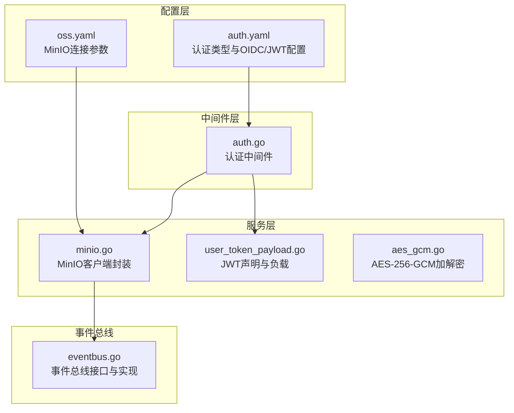
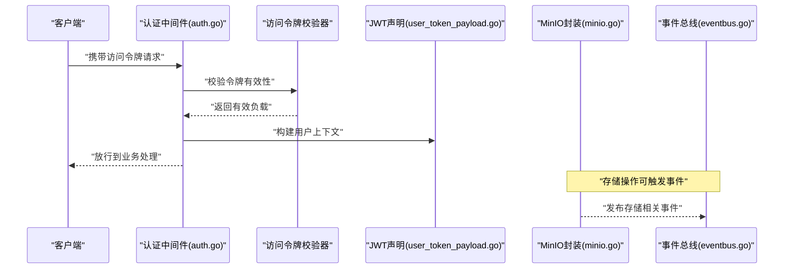
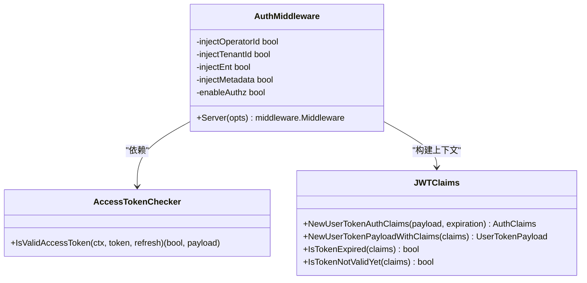
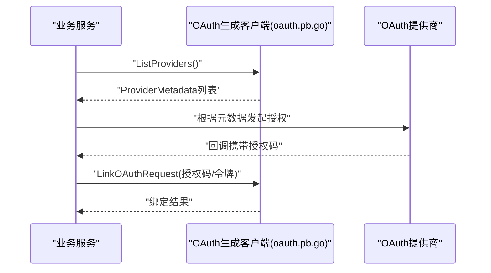
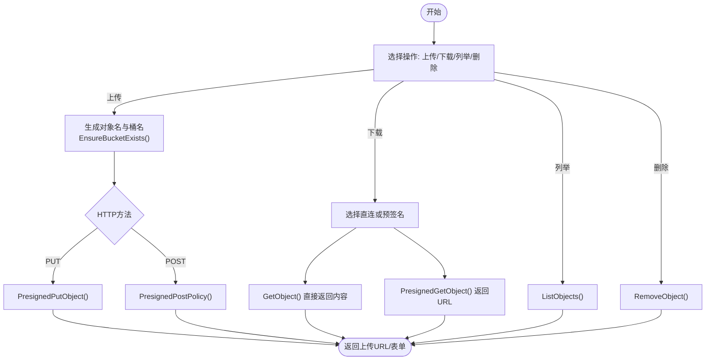
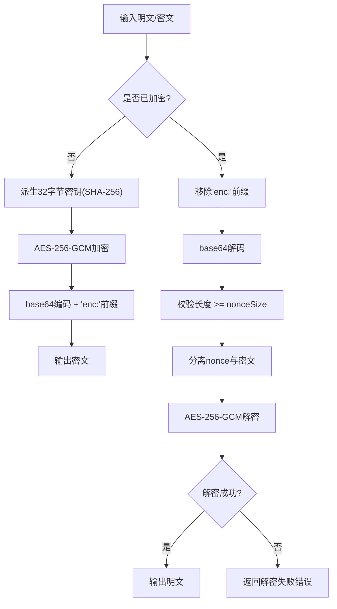
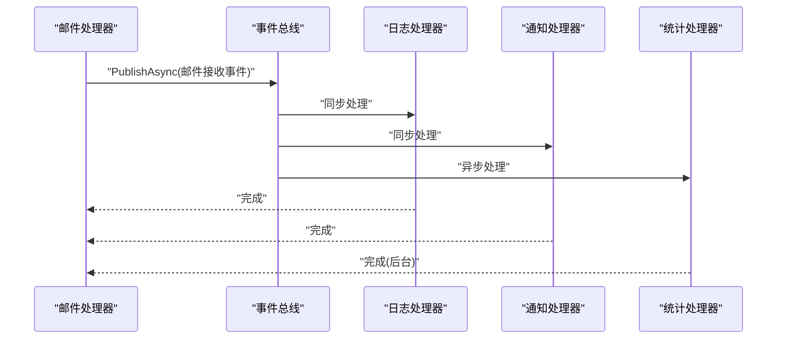
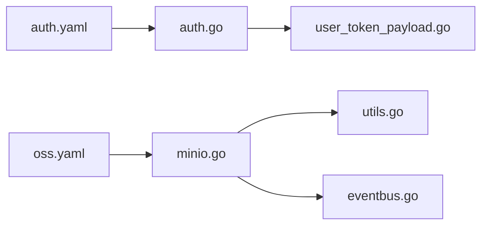

# 第三方集成

<cite>
**本文引用的文件**
- [backend/pkg/crypto/aes_gcm.go](file://backend/pkg/crypto/aes_gcm.go)
- [backend/pkg/oss/minio.go](file://backend/pkg/oss/minio.go)
- [backend/pkg/oss/utils.go](file://backend/pkg/oss/utils.go)
- [backend/app/admin/service/configs/oss.yaml](file://backend/app/admin/service/configs/oss.yaml)
- [backend/app/admin/service/configs/auth.yaml](file://backend/app/admin/service/configs/auth.yaml)
- [backend/pkg/jwt/user_token_payload.go](file://backend/pkg/jwt/user_token_payload.go)
- [backend/pkg/middleware/auth/auth.go](file://backend/pkg/middleware/auth/auth.go)
- [backend/pkg/eventbus/eventbus.go](file://backend/pkg/eventbus/eventbus.go)
- [backend/pkg/eventbus/INTEGRATION.md](file://backend/pkg/eventbus/INTEGRATION.md)
- [backend/app/admin/service/internal/data/data.go](file://backend/app/admin/service/internal/data/data.go)
- [backend/api/gen/go/authentication/service/v1/oauth.pb.go](file://backend/api/gen/go/authentication/service/v1/oauth.pb.go)
- [backend/api/gen/go/authentication/service/v1/mfa.pb.go](file://backend/api/gen/go/authentication/service/v1/mfa.pb.go)
</cite>

## 目录
1. [简介](#简介)
2. [项目结构与集成入口](#项目结构与集成入口)
3. [核心组件与设计模式](#核心组件与设计模式)
4. [架构总览](#架构总览)
5. [详细组件分析](#详细组件分析)
6. [依赖关系分析](#依赖关系分析)
7. [性能与可靠性考量](#性能与可靠性考量)
8. [故障排查指南](#故障排查指南)
9. [结论](#结论)
10. [附录：配置模板与最佳实践](#附录配置模板与最佳实践)

## 简介
本指南面向第三方集成开发者，系统讲解如何在本项目中对接外部服务与组件，包括：
- 认证与授权：OAuth2 提供商、JWT 令牌、多因子认证（MFA）
- 存储服务：MinIO 对象存储、云存储抽象
- 加密服务：数据加密与密钥派生
- 事件总线：解耦与异步扩展
- 最佳实践：错误处理、超时控制、重试策略

文档将结合代码实现，给出架构图、流程图与可直接参考的配置模板。

## 项目结构与集成入口
- 配置层：通过 YAML 文件集中管理外部服务参数（如 MinIO、认证类型与密钥）
- 中间件层：统一接入认证与鉴权，注入租户、操作员、元数据与 Ent Viewer
- 服务层：封装第三方 SDK（如 MinIO、JWT 引擎），提供稳定接口
- 事件总线：跨模块解耦，支持异步处理与可观测性

图表来源
- [backend/app/admin/service/configs/auth.yaml:1-37](file://backend/app/admin/service/configs/auth.yaml#L1-L37)
- [backend/app/admin/service/configs/oss.yaml:1-10](file://backend/app/admin/service/configs/oss.yaml#L1-L10)
- [backend/pkg/middleware/auth/auth.go:24-121](file://backend/pkg/middleware/auth/auth.go#L24-L121)
- [backend/pkg/oss/minio.go:27-43](file://backend/pkg/oss/minio.go#L27-L43)
- [backend/pkg/jwt/user_token_payload.go:39-100](file://backend/pkg/jwt/user_token_payload.go#L39-L100)
- [backend/pkg/crypto/aes_gcm.go:26-44](file://backend/pkg/crypto/aes_gcm.go#L26-L44)
- [backend/pkg/eventbus/eventbus.go:12-34](file://backend/pkg/eventbus/eventbus.go#L12-L34)

章节来源
- [backend/app/admin/service/configs/auth.yaml:1-37](file://backend/app/admin/service/configs/auth.yaml#L1-L37)
- [backend/app/admin/service/configs/oss.yaml:1-10](file://backend/app/admin/service/configs/oss.yaml#L1-L10)
- [backend/pkg/middleware/auth/auth.go:24-121](file://backend/pkg/middleware/auth/auth.go#L24-L121)

## 核心组件与设计模式
- 适配器模式：MinIO 客户端封装、密码加密器、JWT 声明转换
- 代理模式：认证中间件代理访问令牌校验器，注入上下文与鉴权
- 桥接模式：事件总线桥接 Email 处理器与日志/通知/统计等下游处理器
- 工厂与单例：通过依赖注入创建 Redis、MinIO、JWT、Captcha 实例

章节来源
- [backend/pkg/oss/minio.go:27-43](file://backend/pkg/oss/minio.go#L27-L43)
- [backend/pkg/middleware/auth/auth.go:24-121](file://backend/pkg/middleware/auth/auth.go#L24-L121)
- [backend/pkg/eventbus/eventbus.go:12-34](file://backend/pkg/eventbus/eventbus.go#L12-L34)
- [backend/app/admin/service/internal/data/data.go:23-62](file://backend/app/admin/service/internal/data/data.go#L23-L62)

## 架构总览
下图展示认证、存储与事件总线的关键交互路径：

图表来源
- [backend/pkg/middleware/auth/auth.go:38-121](file://backend/pkg/middleware/auth/auth.go#L38-L121)
- [backend/pkg/jwt/user_token_payload.go:39-100](file://backend/pkg/jwt/user_token_payload.go#L39-L100)
- [backend/pkg/oss/minio.go:87-163](file://backend/pkg/oss/minio.go#L87-L163)
- [backend/pkg/eventbus/eventbus.go:106-152](file://backend/pkg/eventbus/eventbus.go#L106-L152)

## 详细组件分析

### 认证与授权集成（JWT/OIDC/MFA）
- 认证类型与配置
  - 支持 jwt、oidc、预共享密钥三种类型
  - OIDC 需配置发行方、受众与签名算法
  - JWT 支持多种算法（HS256/RS256/ES256 等）
- 中间件职责
  - 从请求中提取 Bearer 令牌
  - 调用访问令牌校验器验证
  - 注入操作员ID、租户ID、元数据与 Ent Viewer
  - 可选启用鉴权（RBAC/ABAC）
- JWT 负载与声明
  - 用户名、用户ID、租户ID、角色码、设备ID、客户端ID、数据范围等
  - 过期时间与“容差”处理
- MFA 支持
  - TOTP、SMS、EMAIL、U2F、WEBAUTHN、备份码等方法枚举
  - 可配置强制级别（不需、可选、必须）

图表来源
- [backend/pkg/middleware/auth/auth.go:24-121](file://backend/pkg/middleware/auth/auth.go#L24-L121)
- [backend/pkg/jwt/user_token_payload.go:39-100](file://backend/pkg/jwt/user_token_payload.go#L39-L100)

章节来源
- [backend/app/admin/service/configs/auth.yaml:1-37](file://backend/app/admin/service/configs/auth.yaml#L1-L37)
- [backend/pkg/middleware/auth/auth.go:24-121](file://backend/pkg/middleware/auth/auth.go#L24-L121)
- [backend/pkg/jwt/user_token_payload.go:39-100](file://backend/pkg/jwt/user_token_payload.go#L39-L100)
- [backend/api/gen/go/authentication/service/v1/mfa.pb.go:42-148](file://backend/api/gen/go/authentication/service/v1/mfa.pb.go#L42-L148)

### OAuth2 提供商集成
- 协议与端点
  - 支持列出提供商、获取提供商元数据（授权端点、令牌端点、默认作用域、附加参数）
  - 支持自定义提供商名称
- 集成建议
  - 在业务服务中通过生成的客户端调用提供商元数据接口
  - 依据元数据动态拼装授权 URL 与令牌交换流程
  - 将回调令牌持久化并与用户账户绑定

图表来源
- [backend/api/gen/go/authentication/service/v1/oauth.pb.go:1350-1392](file://backend/api/gen/go/authentication/service/v1/oauth.pb.go#L1350-L1392)
- [backend/api/gen/go/authentication/service/v1/oauth.pb.go:1446-1523](file://backend/api/gen/go/authentication/service/v1/oauth.pb.go#L1446-L1523)

章节来源
- [backend/api/gen/go/authentication/service/v1/oauth.pb.go:1350-1392](file://backend/api/gen/go/authentication/service/v1/oauth.pb.go#L1350-L1392)
- [backend/api/gen/go/authentication/service/v1/oauth.pb.go:1446-1523](file://backend/api/gen/go/authentication/service/v1/oauth.pb.go#L1446-L1523)

### 存储服务集成（MinIO 对象存储）
- 功能覆盖
  - 桶存在性检查与创建
  - 预签名上传/下载 URL 生成（PUT/POST）
  - 直接上传与下载（含范围请求）
  - 文件列表与删除
- 文件命名与桶选择
  - 基于 MIME 类型/扩展名自动选择桶
  - 支持 UUID、内容 SHA256、HMAC 内容、时间戳等多种命名策略
- 配置要点
  - endpoint、upload_host、download_host、access_key、secret_key、use_ssl
- 依赖注入
  - 通过依赖注入工厂创建 MinIO 客户端实例

图表来源
- [backend/pkg/oss/minio.go:86-163](file://backend/pkg/oss/minio.go#L86-L163)
- [backend/pkg/oss/minio.go:165-199](file://backend/pkg/oss/minio.go#L165-L199)
- [backend/pkg/oss/minio.go:201-263](file://backend/pkg/oss/minio.go#L201-L263)
- [backend/pkg/oss/minio.go:348-364](file://backend/pkg/oss/minio.go#L348-L364)
- [backend/pkg/oss/utils.go:37-86](file://backend/pkg/oss/utils.go#L37-L86)
- [backend/pkg/oss/utils.go:404-422](file://backend/pkg/oss/utils.go#L404-L422)

章节来源
- [backend/pkg/oss/minio.go:27-43](file://backend/pkg/oss/minio.go#L27-L43)
- [backend/pkg/oss/minio.go:86-163](file://backend/pkg/oss/minio.go#L86-L163)
- [backend/pkg/oss/minio.go:201-263](file://backend/pkg/oss/minio.go#L201-L263)
- [backend/pkg/oss/minio.go:348-364](file://backend/pkg/oss/minio.go#L348-L364)
- [backend/pkg/oss/utils.go:37-86](file://backend/pkg/oss/utils.go#L37-L86)
- [backend/pkg/oss/utils.go:404-422](file://backend/pkg/oss/utils.go#L404-L422)
- [backend/app/admin/service/configs/oss.yaml:1-10](file://backend/app/admin/service/configs/oss.yaml#L1-L10)
- [backend/app/admin/service/internal/data/data.go:41-43](file://backend/app/admin/service/internal/data/data.go#L41-L43)

### 加密服务集成（数据加密与密钥管理）
- 加密算法
  - AES-256-GCM，自动随机 nonce，附带认证标签
- 密钥派生
  - 任意长度密钥输入经 SHA-256 派生为 32 字节密钥
- 编解码
  - 密文前缀“enc:”，base64 编码
  - 自动兼容明文回退（无前缀）
- 错误处理
  - 无效密钥、无效密文、解密失败等明确错误类型

图表来源
- [backend/pkg/crypto/aes_gcm.go:33-44](file://backend/pkg/crypto/aes_gcm.go#L33-L44)
- [backend/pkg/crypto/aes_gcm.go:48-78](file://backend/pkg/crypto/aes_gcm.go#L48-L78)
- [backend/pkg/crypto/aes_gcm.go:82-130](file://backend/pkg/crypto/aes_gcm.go#L82-L130)

章节来源
- [backend/pkg/crypto/aes_gcm.go:26-44](file://backend/pkg/crypto/aes_gcm.go#L26-L44)
- [backend/pkg/crypto/aes_gcm.go:48-78](file://backend/pkg/crypto/aes_gcm.go#L48-L78)
- [backend/pkg/crypto/aes_gcm.go:82-130](file://backend/pkg/crypto/aes_gcm.go#L82-L130)

### 事件总线集成（解耦与扩展）
- 接口能力
  - 同步/异步订阅、一次性订阅、取消订阅
  - 发布事件、关闭资源、统计事件类型
- 集成步骤
  - 初始化 EventBus Manager，按命名空间获取 Bus
  - 在处理器中发布事件（异步不阻塞）
  - 注册多个下游处理器（日志、通知、统计）
- 示例参考
  - 邮件接收事件、失败事件、通知转发、异步统计更新

图表来源
- [backend/pkg/eventbus/eventbus.go:106-152](file://backend/pkg/eventbus/eventbus.go#L106-L152)
- [backend/pkg/eventbus/INTEGRATION.md:127-186](file://backend/pkg/eventbus/INTEGRATION.md#L127-L186)

章节来源
- [backend/pkg/eventbus/eventbus.go:12-34](file://backend/pkg/eventbus/eventbus.go#L12-L34)
- [backend/pkg/eventbus/eventbus.go:106-152](file://backend/pkg/eventbus/eventbus.go#L106-L152)
- [backend/pkg/eventbus/INTEGRATION.md:1-327](file://backend/pkg/eventbus/INTEGRATION.md#L1-L327)

## 依赖关系分析
- 配置驱动：auth.yaml 与 oss.yaml 为外部集成提供参数
- 中间件依赖：认证中间件依赖访问令牌校验器与 JWT 声明工具
- 存储依赖：MinIO 封装依赖 MinIO 客户端与 OSS 工具集
- 事件依赖：事件总线独立于具体业务，通过命名空间隔离

图表来源
- [backend/app/admin/service/configs/auth.yaml:1-37](file://backend/app/admin/service/configs/auth.yaml#L1-L37)
- [backend/app/admin/service/configs/oss.yaml:1-10](file://backend/app/admin/service/configs/oss.yaml#L1-L10)
- [backend/pkg/middleware/auth/auth.go:24-121](file://backend/pkg/middleware/auth/auth.go#L24-L121)
- [backend/pkg/oss/minio.go:27-43](file://backend/pkg/oss/minio.go#L27-L43)
- [backend/pkg/oss/utils.go:37-86](file://backend/pkg/oss/utils.go#L37-L86)
- [backend/pkg/jwt/user_token_payload.go:39-100](file://backend/pkg/jwt/user_token_payload.go#L39-L100)
- [backend/pkg/eventbus/eventbus.go:12-34](file://backend/pkg/eventbus/eventbus.go#L12-L34)

章节来源
- [backend/app/admin/service/configs/auth.yaml:1-37](file://backend/app/admin/service/configs/auth.yaml#L1-L37)
- [backend/app/admin/service/configs/oss.yaml:1-10](file://backend/app/admin/service/configs/oss.yaml#L1-L10)
- [backend/pkg/middleware/auth/auth.go:24-121](file://backend/pkg/middleware/auth/auth.go#L24-L121)
- [backend/pkg/oss/minio.go:27-43](file://backend/pkg/oss/minio.go#L27-L43)
- [backend/pkg/oss/utils.go:37-86](file://backend/pkg/oss/utils.go#L37-L86)
- [backend/pkg/jwt/user_token_payload.go:39-100](file://backend/pkg/jwt/user_token_payload.go#L39-L100)
- [backend/pkg/eventbus/eventbus.go:12-34](file://backend/pkg/eventbus/eventbus.go#L12-L34)

## 性能与可靠性考量
- 超时与并发
  - 事件总线异步发布使用独立背景上下文与超时，避免阻塞请求生命周期
- 重试与幂等
  - 存储上传/下载建议在应用层实现指数退避重试
  - 事件处理应具备幂等性，避免重复消费造成副作用
- 资源管理
  - MinIO 客户端与 Redis 连接应在服务生命周期内正确关闭
- 安全
  - JWT 密钥与 OIDC 配置应从安全位置加载，避免硬编码
  - 加密密钥应定期轮换，密钥派生与存储遵循最小权限原则

## 故障排查指南
- 认证相关
  - 中间件提示缺少 Bearer 令牌或令牌无效：检查请求头与令牌有效期
  - 鉴权失败：确认令牌负载字段与业务期望一致
- 存储相关
  - 桶不存在：确保 EnsureBucketExists 成功
  - 预签名失败：检查 endpoint、host 替换逻辑与网络可达性
  - 下载失败：确认对象名、桶名与范围参数
- 加密相关
  - 无效密钥：确认输入长度与 SHA-256 派生
  - 解密失败：核对 nonce 长度与 base64 编码
- 事件总线
  - 事件未到达：检查订阅事件类型与命名空间
  - 异步处理未执行：确认 PublishAsync 是否被调用且未被关闭

章节来源
- [backend/pkg/middleware/auth/auth.go:46-61](file://backend/pkg/middleware/auth/auth.go#L46-L61)
- [backend/pkg/oss/minio.go:50-58](file://backend/pkg/oss/minio.go#L50-L58)
- [backend/pkg/oss/minio.go:116-126](file://backend/pkg/oss/minio.go#L116-L126)
- [backend/pkg/crypto/aes_gcm.go:82-130](file://backend/pkg/crypto/aes_gcm.go#L82-L130)
- [backend/pkg/eventbus/eventbus.go:154-167](file://backend/pkg/eventbus/eventbus.go#L154-L167)

## 结论
本项目通过配置驱动、中间件代理、适配器封装与事件总线，提供了清晰的第三方集成路径。认证（JWT/OIDC/MFA）、存储（MinIO）、加密（AES-256-GCM）与事件解耦均具备可扩展性与可维护性。建议在生产环境强化密钥管理、引入重试与熔断、完善可观测性与告警。

## 附录：配置模板与最佳实践
- MinIO 配置模板
  - 参考路径：[oss.yaml:1-10](file://backend/app/admin/service/configs/oss.yaml#L1-L10)
  - 关键项：endpoint、upload_host、download_host、access_key、secret_key、use_ssl
- 认证配置模板
  - 参考路径：[auth.yaml:1-37](file://backend/app/admin/service/configs/auth.yaml#L1-L37)
  - 关键项：authn.type、jwt.method/key、oidc.issuer_url/audience/method、zanzibar.keto/open_fga
- 依赖注入与工厂
  - 参考路径：[data.go:23-62](file://backend/app/admin/service/internal/data/data.go#L23-L62)
  - 包含：Redis、MinIO、密码加密器、验证码
- 最佳实践清单
  - 使用环境变量或密钥管理服务加载敏感配置
  - 为外部调用设置合理超时与重试策略
  - 对事件处理实现幂等与死信队列
  - 定期轮换密钥，限制密钥权限范围