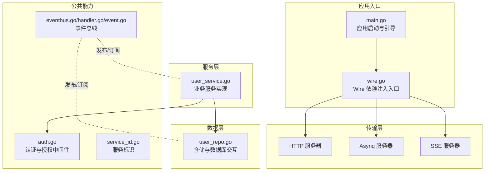
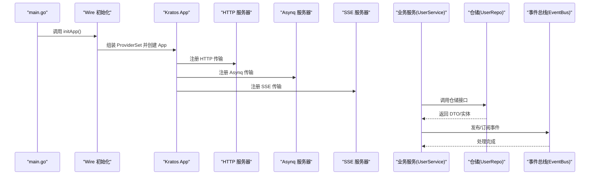
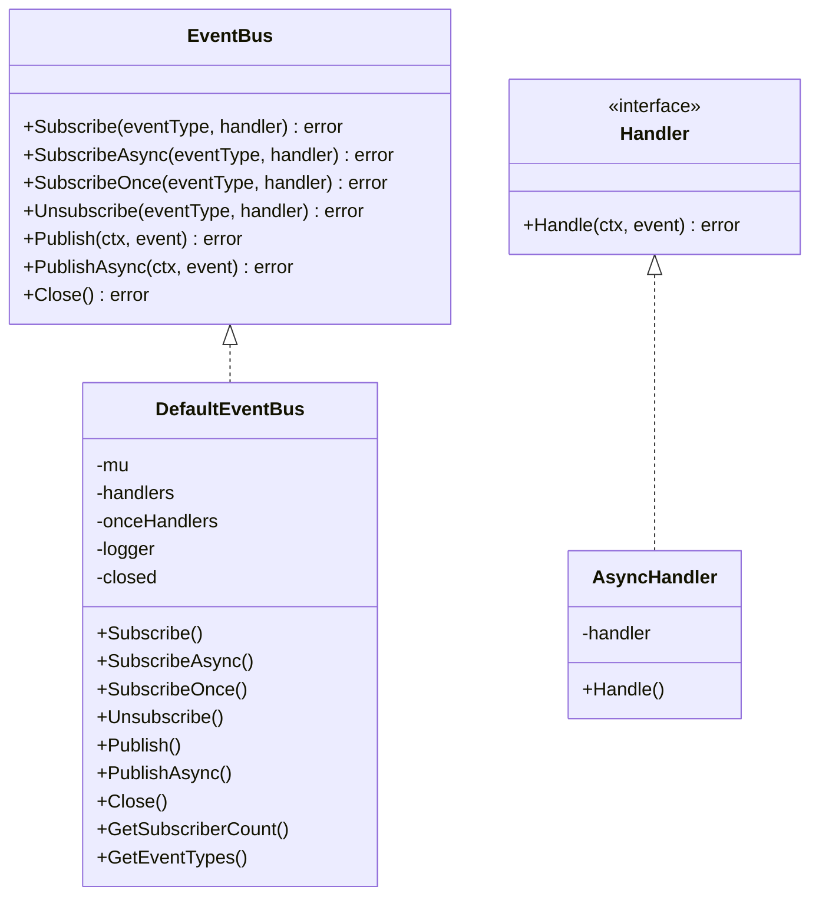
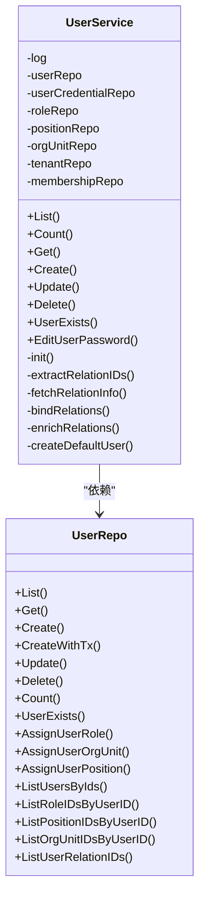
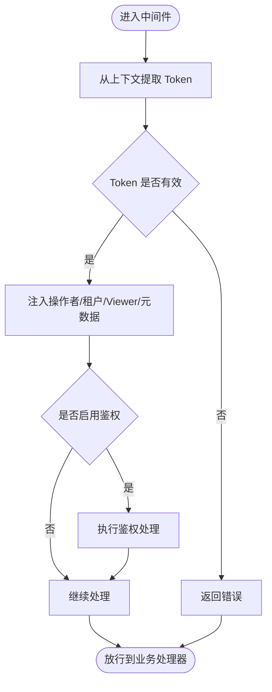
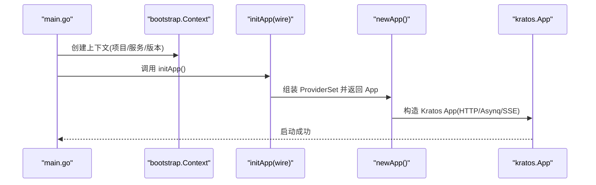
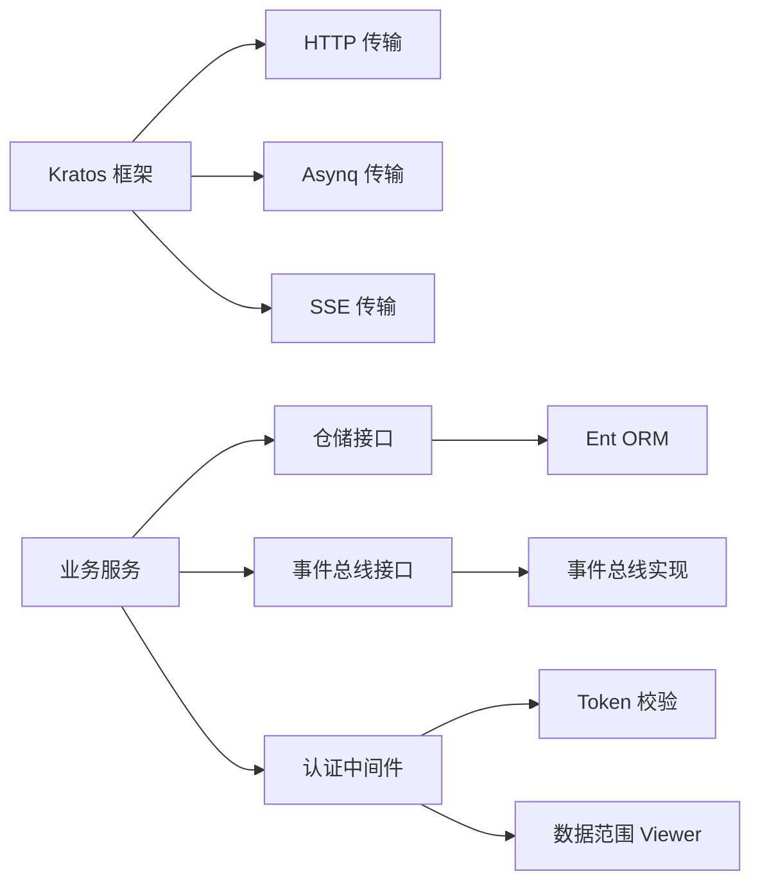

# 自定义服务开发

<cite>
**本文引用的文件**
- [main.go](file://backend/app/admin/service/cmd/server/main.go)
- [wire.go](file://backend/app/admin/service/cmd/server/wire.go)
- [eventbus.go](file://backend/pkg/eventbus/eventbus.go)
- [event.go](file://backend/pkg/eventbus/event.go)
- [handler.go](file://backend/pkg/eventbus/handler.go)
- [auth.go](file://backend/pkg/middleware/auth/auth.go)
- [user_service.go](file://backend/app/admin/service/internal/service/user_service.go)
- [user_repo.go](file://backend/app/admin/service/internal/data/user_repo.go)
- [service_id.go](file://backend/pkg/serviceid/service_id.go)
- [go.mod](file://backend/go.mod)
</cite>

## 目录
1. [简介](#简介)
2. [项目结构](#项目结构)
3. [核心组件](#核心组件)
4. [架构总览](#架构总览)
5. [详细组件分析](#详细组件分析)
6. [依赖分析](#依赖分析)
7. [性能考虑](#性能考虑)
8. [故障排查指南](#故障排查指南)
9. [结论](#结论)
10. [附录](#附录)

## 简介
本指南面向在 GoWind 项目基础上进行“自定义服务开发”的工程师，系统讲解服务架构设计与实现方法，涵盖服务接口定义、实现类结构、依赖注入配置、服务间通信（本地调用、远程调用、事件通信）、服务生命周期管理、测试策略以及配置与部署最佳实践。文档以现有 admin-service 为例，提供从接口到实现再到部署的全流程参考。

## 项目结构
- 后端采用分层与模块化组织：应用入口位于 app/admin/service/cmd/server，内部按 internal 下的 data（数据访问）、service（业务服务）、server（传输层）划分职责；公共能力位于 pkg（事件总线、中间件、常量、工具等）。
- 服务通过 Kratos 框架运行，支持 HTTP、异步任务（Asynq）、服务端事件（SSE）等传输协议。
- 使用 Google Wire 进行依赖注入组合，入口在 wire.go 中通过 ProviderSet 聚合各层 Provider。

**图表来源**
- [main.go:1-76](file://backend/app/admin/service/cmd/server/main.go#L1-L76)
- [wire.go:1-47](file://backend/app/admin/service/cmd/server/wire.go#L1-L47)
- [user_service.go:1-641](file://backend/app/admin/service/internal/service/user_service.go#L1-L641)
- [user_repo.go:1-800](file://backend/app/admin/service/internal/data/user_repo.go#L1-L800)
- [eventbus.go:1-214](file://backend/pkg/eventbus/eventbus.go#L1-L214)
- [handler.go:1-82](file://backend/pkg/eventbus/handler.go#L1-L82)
- [auth.go:1-122](file://backend/pkg/middleware/auth/auth.go#L1-L122)
- [service_id.go:1-11](file://backend/pkg/serviceid/service_id.go#L1-L11)

**章节来源**
- [main.go:1-76](file://backend/app/admin/service/cmd/server/main.go#L1-L76)
- [wire.go:1-47](file://backend/app/admin/service/cmd/server/wire.go#L1-L47)

## 核心组件
- 服务接口与实现
  - 业务服务接口：在 internal/service 下定义服务接口与实现，如用户服务 UserService，封装业务流程（增删改查、关系绑定、默认数据初始化等）。
  - 数据访问接口：在 internal/data 下定义仓储接口与实现，如 UserRepo，负责与 Ent ORM 交互、事务处理、复杂查询与关系维护。
- 依赖注入
  - 通过 Wire ProviderSet 将服务层、数据层、传输层的 Provider 组合，统一由 initApp 构建 Kratos 应用实例。
- 事件总线
  - 提供 EventBus 接口与默认实现，支持同步/异步订阅、一次性订阅、发布、关闭与统计等能力，便于服务解耦与扩展。
- 认证与授权中间件
  - 基于 Kratos 中间件机制，从请求中提取 Token，校验有效性，并注入操作者信息、租户信息、数据范围 Viewer、元数据等，同时可启用鉴权引擎。

**章节来源**
- [user_service.go:1-641](file://backend/app/admin/service/internal/service/user_service.go#L1-L641)
- [user_repo.go:1-800](file://backend/app/admin/service/internal/data/user_repo.go#L1-L800)
- [wire.go:27-46](file://backend/app/admin/service/cmd/server/wire.go#L27-L46)
- [eventbus.go:12-34](file://backend/pkg/eventbus/eventbus.go#L12-L34)
- [auth.go:23-121](file://backend/pkg/middleware/auth/auth.go#L23-L121)

## 架构总览
下图展示 admin-service 的运行时架构：应用启动后，Wire 注入各 Provider，构建 Kratos App，注册 HTTP/Asynq/SSE 传输层，业务服务通过仓储访问数据，事件总线支撑跨模块解耦。

**图表来源**
- [main.go:46-75](file://backend/app/admin/service/cmd/server/main.go#L46-L75)
- [wire.go:27-46](file://backend/app/admin/service/cmd/server/wire.go#L27-L46)
- [user_service.go:28-68](file://backend/app/admin/service/internal/service/user_service.go#L28-L68)
- [user_repo.go:94-117](file://backend/app/admin/service/internal/data/user_repo.go#L94-L117)
- [eventbus.go:46-52](file://backend/pkg/eventbus/eventbus.go#L46-L52)

## 详细组件分析

### 事件总线组件
- 设计要点
  - EventBus 接口定义订阅、一次性订阅、取消订阅、同步/异步发布、关闭等能力。
  - DefaultEventBus 内部使用读写锁保护订阅者列表，支持并发安全。
  - 支持一次性处理器（执行一次后自动移除），异步处理器（goroutine 执行）。
- 使用建议
  - 对高吞吐场景，优先使用 PublishAsync 并设置超时背景上下文，避免阻塞调用方。
  - 订阅者需对异常进行容错处理，防止影响其他订阅者执行。

**图表来源**
- [eventbus.go:12-52](file://backend/pkg/eventbus/eventbus.go#L12-L52)
- [handler.go:18-39](file://backend/pkg/eventbus/handler.go#L18-L39)

**章节来源**
- [eventbus.go:1-214](file://backend/pkg/eventbus/eventbus.go#L1-L214)
- [handler.go:1-82](file://backend/pkg/eventbus/handler.go#L1-L82)
- [event.go:1-113](file://backend/pkg/eventbus/event.go#L1-L113)

### 用户服务组件
- 设计要点
  - UserService 聚合多个仓储（用户、角色、组织单元、岗位、租户、成员关系等），负责业务编排与关系增强。
  - 提供 List/Get/Create/Update/Delete/Count/UserExists 等标准 CRUD 与扩展能力。
  - 在创建/更新用户时，结合权限与租户范围进行参数校验与注入。
- 性能与可靠性
  - 使用事务包裹创建/更新流程，失败自动回滚。
  - 关系查询采用批量拉取与聚合绑定，减少 N+1 查询风险。

**图表来源**
- [user_service.go:28-68](file://backend/app/admin/service/internal/service/user_service.go#L28-L68)
- [user_repo.go:34-92](file://backend/app/admin/service/internal/data/user_repo.go#L34-L92)

**章节来源**
- [user_service.go:1-641](file://backend/app/admin/service/internal/service/user_service.go#L1-L641)
- [user_repo.go:1-800](file://backend/app/admin/service/internal/data/user_repo.go#L1-L800)

### 认证与授权中间件
- 设计要点
  - 从传输上下文中解析 Bearer Token，校验有效性。
  - 可选注入操作者 ID、租户 ID、数据范围 Viewer、元数据。
  - 可启用鉴权引擎（如 Casbin/OPA）进行细粒度授权。
- 使用建议
  - 在服务端中间件链中尽早执行，确保后续处理均具备上下文信息。
  - 对 Token 校验失败与缺失进行明确错误返回，便于前端或上游服务处理。

**图表来源**
- [auth.go:24-121](file://backend/pkg/middleware/auth/auth.go#L24-L121)

**章节来源**
- [auth.go:1-122](file://backend/pkg/middleware/auth/auth.go#L1-L122)

### 依赖注入与应用启动
- Wire ProviderSet
  - 通过 ProviderSet 聚合 server、service、data 层 Provider，initApp 作为注入入口，newApp 组装 Kratos App。
- 应用启动
  - main.go 中创建 bootstrap 上下文，传入项目名、服务 ID、版本号，然后运行 RunApp 完成初始化与启动。

**图表来源**
- [main.go:59-75](file://backend/app/admin/service/cmd/server/main.go#L59-L75)
- [wire.go:27-46](file://backend/app/admin/service/cmd/server/wire.go#L27-L46)

**章节来源**
- [main.go:1-76](file://backend/app/admin/service/cmd/server/main.go#L1-L76)
- [wire.go:1-47](file://backend/app/admin/service/cmd/server/wire.go#L1-L47)
- [service_id.go:1-11](file://backend/pkg/serviceid/service_id.go#L1-L11)

## 依赖分析
- 外部依赖
  - Kratos 框架与传输层（HTTP、Asynq、SSE）、Ent ORM、Wire、认证/授权引擎、OpenTelemetry 等。
- 内部依赖
  - 服务层依赖数据层仓储接口；事件总线为跨模块解耦提供基础；认证中间件贯穿业务处理链路。
- 循环依赖
  - 当前结构通过接口隔离（service -> data 接口、eventbus 接口）避免循环依赖；建议新增模块时保持接口向下依赖。

**图表来源**
- [go.mod:5-65](file://backend/go.mod#L5-L65)
- [user_service.go:1-641](file://backend/app/admin/service/internal/service/user_service.go#L1-L641)
- [user_repo.go:1-800](file://backend/app/admin/service/internal/data/user_repo.go#L1-L800)
- [eventbus.go:1-214](file://backend/pkg/eventbus/eventbus.go#L1-L214)
- [auth.go:1-122](file://backend/pkg/middleware/auth/auth.go#L1-L122)

**章节来源**
- [go.mod:1-290](file://backend/go.mod#L1-L290)

## 性能考虑
- 事件总线
  - 异步发布使用独立后台上下文与超时控制，避免阻塞调用方；建议对高频事件设置优先级与限流策略。
- 仓储与事务
  - 批量查询与关系绑定减少多次往返；事务包裹关键路径，失败快速回滚。
- 中间件
  - 认证/授权中间件尽量前置，避免重复校验；对 Token 校验失败进行短路返回。
- 传输层
  - HTTP/SSE/Asynq 各司其职，避免在单通道承载过多类型负载；合理设置连接池与超时。

## 故障排查指南
- 事件总线
  - 若事件无法到达订阅者，检查订阅类型与处理器注册；确认 EventBus 未关闭；查看日志中的错误记录。
- 业务服务
  - 创建/更新失败时检查事务回滚日志；核对角色/租户范围参数与权限校验。
- 认证中间件
  - 缺失 Token 或 Token 失效会导致请求被拒绝；检查 Token 来源与有效期。
- 启动与注入
  - Wire 注入失败通常由 Provider 缺失或构造函数签名不匹配引起；检查 ProviderSet 组合与 initApp 实现。

**章节来源**
- [eventbus.go:107-151](file://backend/pkg/eventbus/eventbus.go#L107-L151)
- [user_service.go:326-431](file://backend/app/admin/service/internal/service/user_service.go#L326-L431)
- [auth.go:38-61](file://backend/pkg/middleware/auth/auth.go#L38-L61)
- [wire.go:27-46](file://backend/app/admin/service/cmd/server/wire.go#L27-L46)

## 结论
通过接口隔离、依赖注入与事件总线，GoWind 提供了清晰的服务开发范式。遵循本文的接口设计、实现结构、通信方式与生命周期管理建议，可在 admin-service 基础上快速扩展新的服务模块，并保证可维护性与可扩展性。

## 附录

### 如何创建新的服务模块（从零到一）
- 定义服务接口与实现
  - 在 internal/service 下新增服务包与接口定义，实现业务逻辑。
  - 示例参考：[user_service.go:28-68](file://backend/app/admin/service/internal/service/user_service.go#L28-L68)
- 定义数据访问接口与实现
  - 在 internal/data 下新增仓储接口与实现，封装数据库交互与事务。
  - 示例参考：[user_repo.go:34-117](file://backend/app/admin/service/internal/data/user_repo.go#L34-L117)
- 配置依赖注入
  - 在各自 internal/*/providers 下定义 Provider，汇总到 wire.go 的 ProviderSet。
  - 示例参考：[wire.go:27-46](file://backend/app/admin/service/cmd/server/wire.go#L27-L46)
- 集成传输层
  - 在 main.go 中组装 Kratos App，确保 HTTP/Asynq/SSE 均已注册。
  - 示例参考：[main.go:46-57](file://backend/app/admin/service/cmd/server/main.go#L46-L57)
- 服务间通信
  - 同步调用：通过服务接口直接依赖。
  - 异步事件：使用事件总线发布/订阅，降低耦合。
  - 远程调用：通过 gRPC/HTTP 客户端访问其他服务（参考项目中相关 proto 与客户端生成物）。
- 生命周期管理
  - 在 initApp 中统一装配，利用 Kratos 的生命周期钩子进行资源清理。
  - 示例参考：[main.go:59-75](file://backend/app/admin/service/cmd/server/main.go#L59-L75)
- 测试策略
  - 单元测试：针对服务与仓储的纯函数与关键分支。
  - 集成测试：使用内存数据库或测试容器，验证端到端流程。
  - 性能测试：对热点路径（如事件发布/订阅、批量查询）进行压测。
- 配置与部署
  - 使用环境变量与配置文件管理服务端口、数据库连接、事件总线参数等。
  - Docker 与 PM2 部署脚本可参考项目 scripts 目录下的部署脚本。