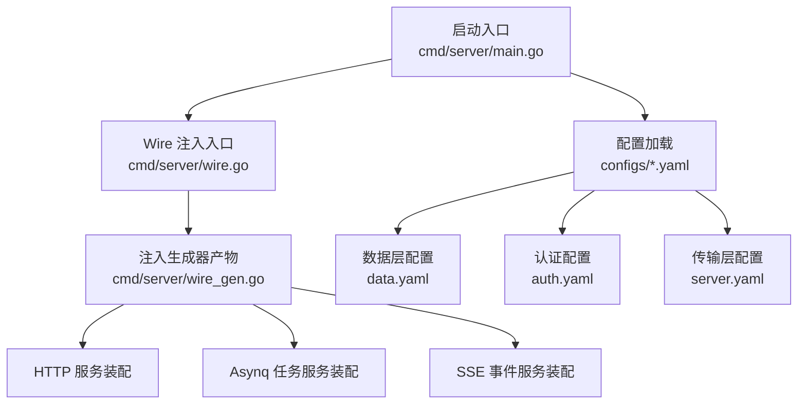
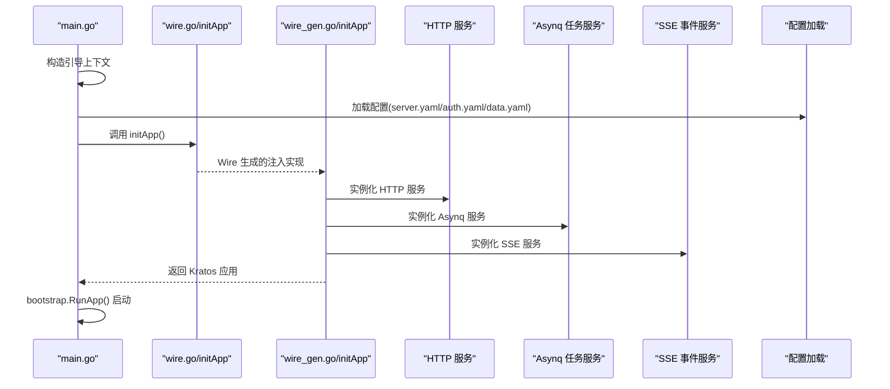
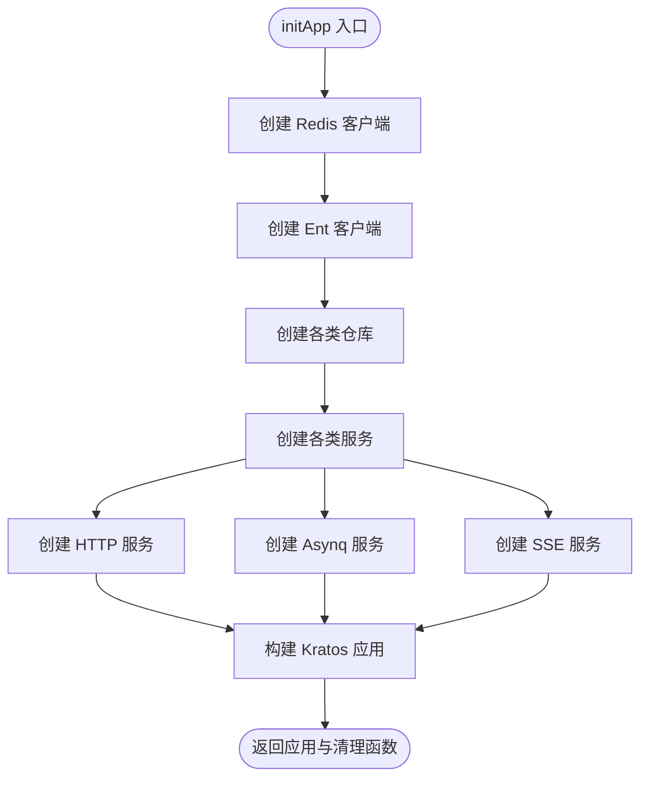
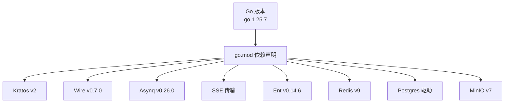

# 启动失败排查

<cite>
**本文引用的文件**
- [main.go](file://backend/app/admin/service/cmd/server/main.go)
- [wire.go](file://backend/app/admin/service/cmd/server/wire.go)
- [wire_gen.go](file://backend/app/admin/service/cmd/server/wire_gen.go)
- [server.yaml](file://backend/app/admin/service/configs/server.yaml)
- [auth.yaml](file://backend/app/admin/service/configs/auth.yaml)
- [data.yaml](file://backend/app/admin/service/configs/data.yaml)
- [go.mod](file://backend/go.mod)
- [data.go](file://backend/app/admin/service/internal/data/data.go)
</cite>

## 目录
1. [简介](#简介)
2. [项目结构](#项目结构)
3. [核心组件](#核心组件)
4. [架构总览](#架构总览)
5. [详细组件分析](#详细组件分析)
6. [依赖分析](#依赖分析)
7. [性能考虑](#性能考虑)
8. [故障排查指南](#故障排查指南)
9. [结论](#结论)
10. [附录](#附录)

## 简介
本指南聚焦于 GoWind Admin 后端服务在启动阶段的常见失败场景与系统化排查方法，覆盖配置文件加载失败、依赖注入错误、服务注册失败等关键问题。文档基于实际源码与配置文件进行分析，提供可操作的检查清单、错误信息解读与修复步骤，并给出启动日志的关键信息定位技巧。

## 项目结构
GoWind Admin 后端采用 Kratos 框架与 tx7do 生态，通过 Wire 依赖注入生成器完成应用装配。启动入口位于服务命令目录，配置集中于 configs 目录，模块依赖在 go.mod 中声明。

图表来源
- [main.go:71-76](file://backend/app/admin/service/cmd/server/main.go#L71-L76)
- [wire.go:37-46](file://backend/app/admin/service/cmd/server/wire.go#L37-L46)
- [wire_gen.go:30-134](file://backend/app/admin/service/cmd/server/wire_gen.go#L30-L134)
- [server.yaml:1-49](file://backend/app/admin/service/configs/server.yaml#L1-L49)
- [auth.yaml:1-37](file://backend/app/admin/service/configs/auth.yaml#L1-L37)
- [data.yaml:1-21](file://backend/app/admin/service/configs/data.yaml#L1-L21)

章节来源
- [main.go:1-76](file://backend/app/admin/service/cmd/server/main.go#L1-L76)
- [wire.go:1-47](file://backend/app/admin/service/cmd/server/wire.go#L1-L47)
- [wire_gen.go:1-134](file://backend/app/admin/service/cmd/server/wire_gen.go#L1-L134)
- [server.yaml:1-49](file://backend/app/admin/service/configs/server.yaml#L1-L49)
- [auth.yaml:1-37](file://backend/app/admin/service/configs/auth.yaml#L1-L37)
- [data.yaml:1-21](file://backend/app/admin/service/configs/data.yaml#L1-L21)

## 核心组件
- 启动入口与引导：启动入口负责构造引导上下文、调用引导框架运行应用；应用通过 bootstrap.RunApp 完成装配与启动。
- 依赖注入：使用 Wire 将 server、service、data 三类 ProviderSet 聚合，生成初始化函数 initApp，完成 HTTP、Asynq、SSE 服务实例化与 Kratos 应用构建。
- 配置体系：REST、Asynq、SSE 传输层配置与认证授权、数据库、缓存等数据层配置分别位于独立 YAML 文件中，由引导框架按约定加载。

章节来源
- [main.go:59-75](file://backend/app/admin/service/cmd/server/main.go#L59-L75)
- [wire.go:37-46](file://backend/app/admin/service/cmd/server/wire.go#L37-L46)
- [wire_gen.go:30-134](file://backend/app/admin/service/cmd/server/wire_gen.go#L30-L134)
- [server.yaml:1-49](file://backend/app/admin/service/configs/server.yaml#L1-L49)
- [auth.yaml:1-37](file://backend/app/admin/service/configs/auth.yaml#L1-L37)
- [data.yaml:1-21](file://backend/app/admin/service/configs/data.yaml#L1-L21)

## 架构总览
下图展示启动阶段从入口到服务装配的关键交互：

图表来源
- [main.go:59-75](file://backend/app/admin/service/cmd/server/main.go#L59-L75)
- [wire.go:37-46](file://backend/app/admin/service/cmd/server/wire.go#L37-L46)
- [wire_gen.go:30-134](file://backend/app/admin/service/cmd/server/wire_gen.go#L30-L134)
- [server.yaml:1-49](file://backend/app/admin/service/configs/server.yaml#L1-L49)
- [auth.yaml:1-37](file://backend/app/admin/service/configs/auth.yaml#L1-L37)
- [data.yaml:1-21](file://backend/app/admin/service/configs/data.yaml#L1-L21)

## 详细组件分析

### 启动入口与引导流程
- 入口函数负责构造引导上下文并调用引导框架运行应用，若运行失败直接抛出错误。
- 引导上下文中包含项目标识、应用标识与版本号，确保服务元信息正确传递至各子系统。

章节来源
- [main.go:59-75](file://backend/app/admin/service/cmd/server/main.go#L59-L75)

### 依赖注入与装配流程
- Wire 注入入口定义了 initApp 的 provider 组合，聚合 server、service、data ProviderSet 并绑定 newApp。
- 注入生成器产物中实现了完整的装配逻辑：依次创建 Redis 客户端、Ent 数据库客户端、各类仓库与服务、HTTP/Asynq/SSE 传输层，最后构建 Kratos 应用并返回清理函数。

图表来源
- [wire.go:37-46](file://backend/app/admin/service/cmd/server/wire.go#L37-L46)
- [wire_gen.go:30-134](file://backend/app/admin/service/cmd/server/wire_gen.go#L30-L134)

章节来源
- [wire.go:37-46](file://backend/app/admin/service/cmd/server/wire.go#L37-L46)
- [wire_gen.go:30-134](file://backend/app/admin/service/cmd/server/wire_gen.go#L30-L134)

### 配置文件与加载要点
- 传输层配置（server.yaml）：包含 REST 地址与超时、Swagger、pprof、CORS、中间件开关；Asynq 任务队列连接、并发、队列优先级与分区；SSE 地址、路径与自动流式策略。
- 认证配置（auth.yaml）：支持 JWT/OIDC/Preshared Key 三种认证方式，以及授权引擎类型与外部授权系统（如 Keto/OpenFGA）参数。
- 数据层配置（data.yaml）：数据库驱动与连接串、迁移开关、连接池参数；Redis 地址、密码与超时。

章节来源
- [server.yaml:1-49](file://backend/app/admin/service/configs/server.yaml#L1-L49)
- [auth.yaml:1-37](file://backend/app/admin/service/configs/auth.yaml#L1-L37)
- [data.yaml:1-21](file://backend/app/admin/service/configs/data.yaml#L1-L21)

### 数据层工具与依赖
- Redis 客户端创建：通过引导框架提供的配置与日志助手创建 Redis 客户端，并提供关闭回调。
- MinIO 客户端创建：基于配置与日志助手创建对象存储客户端。
- 密码加密与验证码：提供密码加密器与验证码生成器的工厂方法。

章节来源
- [data.go:23-62](file://backend/app/admin/service/internal/data/data.go#L23-L62)

## 依赖分析
- 运行时依赖：Kratos v2、Wire、Asynq、SSE 传输、Ent、Redis、Postgres/MySQL 驱动、MinIO 客户端等。
- 版本与兼容性：go.mod 明确 Go 版本与依赖版本范围，建议在升级依赖前核对兼容性与破坏性变更。

图表来源
- [go.mod:1-290](file://backend/go.mod#L1-L290)

章节来源
- [go.mod:1-290](file://backend/go.mod#L1-L290)

## 性能考虑
- 连接池参数：合理设置数据库最大空闲/活动连接数与生命周期，避免连接抖动与资源耗尽。
- Redis 超时：根据网络与负载调整读写超时，避免阻塞导致请求堆积。
- Asynq 并发与队列：根据任务类型与 CPU/内存资源设定并发与队列权重，避免过载或饥饿。
- 中间件开销：启用 Swagger/pprof/Tracing 便于调试但会增加开销，生产环境建议按需开启。

## 故障排查指南

### 一、配置文件加载失败
常见症状
- 启动时报“无法读取配置文件”“配置未找到”等错误。
- 应用启动后立即退出或卡在初始化阶段。

排查步骤
1. 确认配置文件存在且路径正确
   - server.yaml、auth.yaml、data.yaml 是否存在于 configs 目录。
   - 文件名大小写与扩展名是否匹配。
2. 校验配置文件格式
   - 使用 YAML 校验工具检查语法错误（缩进、冒号、引号）。
   - 关键字段如地址、端口、驱动名、布尔值需符合预期。
3. 校验配置键名与默认值
   - server.yaml：rest.addr、asynq.uri、sse.addr、queues.* 等。
   - auth.yaml：authn.type、jwt.method/key、authz.type、zanzibar.* 等。
   - data.yaml：data.database.driver/source/migrate、data.redis.addr/password 等。
4. 环境变量与密钥
   - 若使用环境变量注入敏感信息（如数据库密码、Redis 密码），确认变量已正确设置且未被覆盖。
5. 权限与挂载
   - 在容器或非本地环境中，确认配置文件已正确挂载到容器内对应路径。

章节来源
- [server.yaml:1-49](file://backend/app/admin/service/configs/server.yaml#L1-L49)
- [auth.yaml:1-37](file://backend/app/admin/service/configs/auth.yaml#L1-L37)
- [data.yaml:1-21](file://backend/app/admin/service/configs/data.yaml#L1-L21)

### 二、依赖注入错误（Wire）
常见症状
- 启动时报“未找到 provider”“无法解析依赖”“wire: found field X but no provider”等。
- 应用在装配阶段崩溃。

排查步骤
1. 确认 Wire 生成文件存在
   - wire_gen.go 是否存在且未被删除或误改。
   - 构建标签与生成规则是否正确（wireinject 与非 wireinject）。
2. 检查 ProviderSet 组合
   - server、service、data 三类 ProviderSet 是否存在且可导入。
   - wire.go 中的组合顺序与依赖链是否完整。
3. 修复注入错误
   - 为缺失的 provider 提供具体实现或引入相应包。
   - 确保所有依赖类型均有对应 provider 或默认值。
4. 重新生成注入代码
   - 执行 Wire 代码生成命令，确保生成文件与源码一致。

章节来源
- [wire.go:37-46](file://backend/app/admin/service/cmd/server/wire.go#L37-L46)
- [wire_gen.go:30-134](file://backend/app/admin/service/cmd/server/wire_gen.go#L30-L134)

### 三、服务注册失败（HTTP/Asynq/SSE）
常见症状
- 启动后 HTTP 服务无法监听端口，或 Asynq/SSE 服务初始化报错。
- 应用启动成功但无对外服务。

排查步骤
1. 检查传输层配置
   - server.yaml 中 rest.addr 与 sse.addr 是否冲突或被占用。
   - asynq.uri 是否指向正确的 Redis 实例与数据库。
2. 端口可用性
   - 使用系统工具检查端口占用情况（如 netstat/ss/lsof）。
   - 如端口被占用，修改配置中的端口号或释放占用进程。
3. 依赖服务连通性
   - Redis：确认地址、密码、网络可达性。
   - Postgres/MySQL：确认驱动、连接串、网络与权限。
   - 对象存储（MinIO）：确认地址、凭据与桶权限。
4. 中间件与功能开关
   - Swagger/pprof/Tracing 等中间件可能导致额外依赖，必要时临时关闭以定位问题。
5. 日志与错误栈
   - 查看启动日志中“New*Server”相关错误，结合配置逐项比对。

章节来源
- [server.yaml:1-49](file://backend/app/admin/service/configs/server.yaml#L1-L49)
- [data.yaml:1-21](file://backend/app/admin/service/configs/data.yaml#L1-L21)
- [wire_gen.go:115-127](file://backend/app/admin/service/cmd/server/wire_gen.go#L115-L127)

### 四、数据库与缓存初始化失败
常见症状
- 启动时报数据库连接失败、迁移失败或 Redis 连接失败。
- 应用在装配阶段因数据层初始化异常而中断。

排查步骤
1. 数据库连接
   - 校验 data.yaml 中 driver 与 source 字段，确认主机、端口、用户名、密码、数据库名、SSL 设置。
   - 若使用 MySQL，确认字符集与时区设置；若使用 Postgres，确认 SSL 模式与驱动版本兼容。
2. 迁移与模式
   - migrate: true 时，确认数据库具备迁移权限；若失败，先手动执行迁移或关闭迁移后重试。
3. Redis 连接
   - 校验 data.yaml 中 addr 与 password；确认网络连通与防火墙策略。
   - 若使用验证码等依赖 Redis 的功能，确认键空间前缀与过期时间设置合理。
4. 日志与错误栈
   - 查看数据层初始化日志，定位具体错误来源（连接、认证、权限、网络）。

章节来源
- [data.yaml:1-21](file://backend/app/admin/service/configs/data.yaml#L1-L21)
- [data.go:23-62](file://backend/app/admin/service/internal/data/data.go#L23-L62)

### 五、认证与授权配置问题
常见症状
- 登录接口报认证失败、令牌无效或授权拒绝。
- 授权中间件无法正常工作。

排查步骤
1. 认证方式
   - auth.yaml 中 authn.type 与 jwt.method/key 是否正确；OIDC 需要正确的 issuer_url 与 audience。
   - Preshared Key 需要至少一个有效 key。
2. 授权引擎
   - authz.type 选择与后端实现匹配；若选择 zanzibar，则需正确配置 keto/openfga 的地址与令牌。
3. 令牌与签名
   - 确认签发方与接收方一致；密钥长度与算法强度满足要求。
4. 中间件链路
   - 确认 REST 中间件启用顺序与鉴权/授权中间件位置正确。

章节来源
- [auth.yaml:1-37](file://backend/app/admin/service/configs/auth.yaml#L1-L37)

### 六、启动日志的关键信息分析与定位技巧
- 定位装配阶段错误
  - 关注 initApp 及其生成实现中的“New*Server/New*Client”调用链，定位首个失败点。
- 定位配置加载错误
  - 关注配置读取与校验阶段的日志，确认文件路径、键名与类型匹配。
- 定位依赖注入错误
  - 关注 Wire 报错信息，逐条修复缺失的 provider 或类型不匹配问题。
- 定位端口与网络错误
  - 关注监听失败与连接超时日志，结合系统工具排查端口占用与网络策略。
- 定位数据库/缓存错误
  - 关注连接、认证、权限与迁移相关日志，逐步缩小范围。

## 结论
启动失败通常由配置错误、依赖注入缺失、服务端口冲突或底层依赖不可达引起。建议按照“配置—注入—服务—依赖”的顺序逐层排查，并结合日志与错误栈快速定位根因。生产部署前应完善环境变量与密钥管理、最小化中间件开销并验证端到端连通性。

## 附录

### 常见错误与修复对照表
- 配置文件不存在/格式错误
  - 现象：启动即退出或报“无法读取配置”
  - 处理：校验文件存在与 YAML 语法；核对键名与类型
- Wire 未生成或 provider 缺失
  - 现象：装配阶段崩溃或找不到 provider
  - 处理：重新生成注入代码；补齐缺失的 provider
- 端口占用或不可用
  - 现象：HTTP/Asynq/SSE 监听失败
  - 处理：更换端口或释放占用；检查防火墙与 SELinux/AppArmor
- 数据库/Redis 连接失败
  - 现象：连接超时、认证失败、权限不足
  - 处理：核对连接串、凭据与网络；必要时关闭迁移或降级中间件
- 认证/授权配置不当
  - 现象：登录失败、授权拒绝
  - 处理：核对认证方式与密钥；校验授权引擎参数