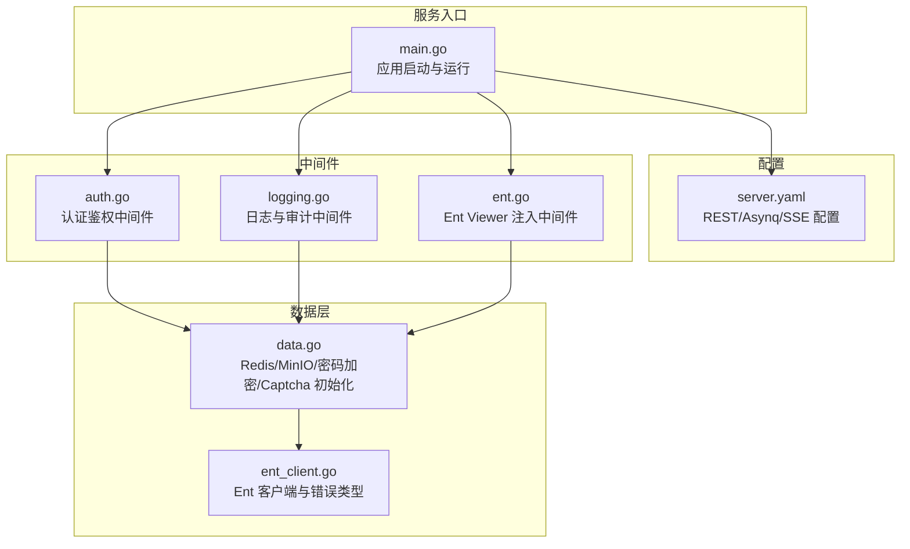
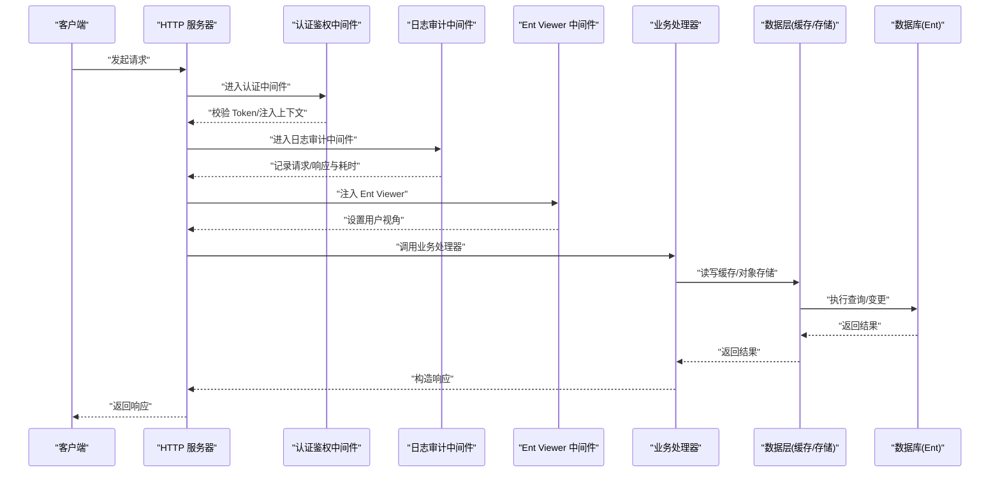
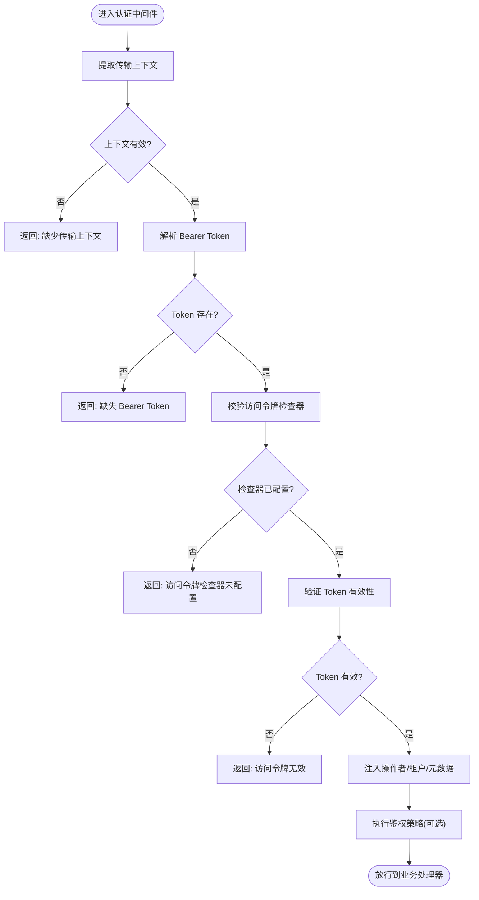
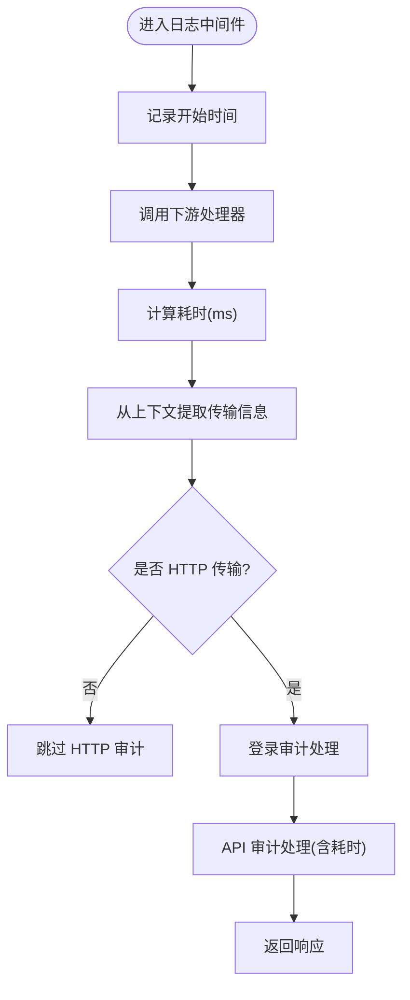
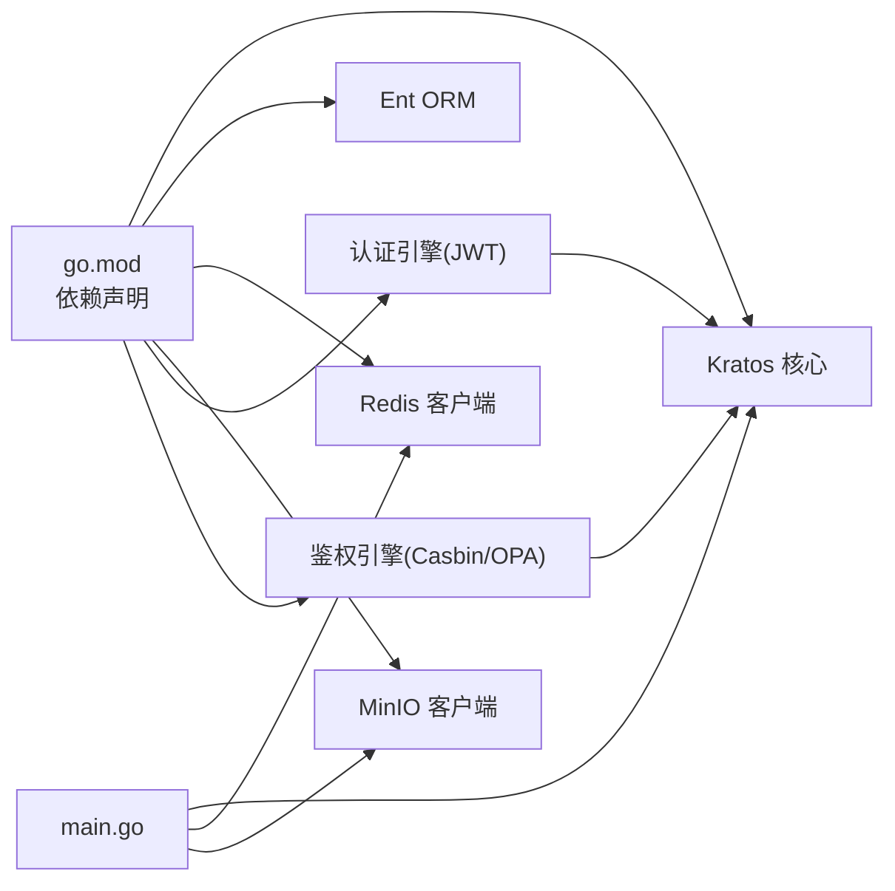

# 常见错误解决方案

<cite>
**本文引用的文件**
- [main.go](file://backend/app/admin/service/cmd/server/main.go)
- [go.mod](file://backend/go.mod)
- [server.yaml](file://backend/app/admin/service/configs/server.yaml)
- [logging.go](file://backend/pkg/middleware/logging/logging.go)
- [auth.go](file://backend/pkg/middleware/auth/auth.go)
- [ent.go](file://backend/pkg/middleware/ent/ent.go)
- [data.go](file://backend/app/admin/service/internal/data/data.go)
- [ent_client.go](file://backend/app/admin/service/internal/data/ent/ent.go)
</cite>

## 目录
1. [简介](#简介)
2. [项目结构](#项目结构)
3. [核心组件](#核心组件)
4. [架构总览](#架构总览)
5. [详细组件分析](#详细组件分析)
6. [依赖分析](#依赖分析)
7. [性能考虑](#性能考虑)
8. [故障排查指南](#故障排查指南)
9. [结论](#结论)
10. [附录](#附录)

## 简介
本文件面向 GoWind Admin 的开发者与运维人员，系统性梳理在开发与使用过程中常见的错误类型（编译错误、运行时错误、配置错误、API 调用错误等），提供错误代码对照表、错误信息解读、典型表现、可能原因、解决步骤与预防措施，并给出标准错误报告格式与反馈渠道建议。内容基于仓库现有源码与配置进行归纳，帮助快速定位与解决问题。

## 项目结构
后端采用 Kratos 框架与多模块组织方式，Admin 服务入口位于命令行程序，配置通过 YAML 文件集中管理，中间件与数据层分别承担认证鉴权、日志审计、实体访问控制等职责。

图表来源
- [main.go:1-76](file://backend/app/admin/service/cmd/server/main.go#L1-L76)
- [server.yaml:1-49](file://backend/app/admin/service/configs/server.yaml#L1-L49)
- [auth.go:1-122](file://backend/pkg/middleware/auth/auth.go#L1-L122)
- [logging.go:1-52](file://backend/pkg/middleware/logging/logging.go#L1-L52)
- [ent.go:1-42](file://backend/pkg/middleware/ent/ent.go#L1-L42)
- [data.go:1-63](file://backend/app/admin/service/internal/data/data.go#L1-L63)
- [ent_client.go:1-683](file://backend/app/admin/service/internal/data/ent/ent.go#L1-L683)

章节来源
- [main.go:1-76](file://backend/app/admin/service/cmd/server/main.go#L1-L76)
- [server.yaml:1-49](file://backend/app/admin/service/configs/server.yaml#L1-L49)

## 核心组件
- 应用启动与运行：负责初始化上下文、加载配置、启动 HTTP、异步队列与 SSE 服务。
- 中间件体系：认证鉴权、日志审计、Ent Viewer 注入，贯穿请求生命周期。
- 数据层：Redis、MinIO、密码加密、验证码等基础设施初始化。
- 配置中心：统一管理 REST、Asynq、SSE 与中间件开关。

章节来源
- [main.go:46-75](file://backend/app/admin/service/cmd/server/main.go#L46-L75)
- [auth.go:23-121](file://backend/pkg/middleware/auth/auth.go#L23-L121)
- [logging.go:14-51](file://backend/pkg/middleware/logging/logging.go#L14-L51)
- [ent.go:14-41](file://backend/pkg/middleware/ent/ent.go#L14-L41)
- [data.go:23-62](file://backend/app/admin/service/internal/data/data.go#L23-L62)
- [server.yaml:1-49](file://backend/app/admin/service/configs/server.yaml#L1-L49)

## 架构总览
下图展示一次请求从进入 REST 服务到最终返回的关键路径，以及中间件与数据层的交互。

图表来源
- [auth.go:38-119](file://backend/pkg/middleware/auth/auth.go#L38-L119)
- [logging.go:31-49](file://backend/pkg/middleware/logging/logging.go#L31-L49)
- [ent.go:15-40](file://backend/pkg/middleware/ent/ent.go#L15-L40)
- [data.go:23-62](file://backend/app/admin/service/internal/data/data.go#L23-L62)
- [ent_client.go:1-683](file://backend/app/admin/service/internal/data/ent/ent.go#L1-L683)

## 详细组件分析

### 认证鉴权中间件（auth）
- 典型错误类型
  - 缺少传输上下文或 Token：如“缺少传输上下文”“缺失 Bearer Token”
  - 访问令牌检查器未配置或过期：如“访问令牌检查器未配置”“访问令牌无效”
  - 请求参数注入失败：如操作者 ID 或租户 ID 注入失败
  - 鉴权策略处理异常：如权限不足或策略评估失败
- 可能原因
  - 客户端未携带合法 Bearer Token
  - JWT 解析失败或签名验证不通过
  - 上下文未正确传递传输信息
  - 鉴权引擎未正确初始化
- 解决步骤
  - 确认请求头携带 Authorization: Bearer <token>
  - 校验 Token 有效期与签发方
  - 检查中间件启用顺序与配置项
  - 确保注入操作者/租户 ID 的逻辑与请求体匹配
- 预防措施
  - 在网关或前置代理统一校验 Token
  - 对关键接口开启鉴权中间件
  - 使用统一的 Token 校验工具链

图表来源
- [auth.go:38-119](file://backend/pkg/middleware/auth/auth.go#L38-L119)

章节来源
- [auth.go:23-121](file://backend/pkg/middleware/auth/auth.go#L23-L121)

### 日志与审计中间件（logging）
- 典型错误类型
  - 传输上下文非 HTTP 类型导致无法记录
  - 登录/API 审计中间件处理异常
- 可能原因
  - 非 HTTP 通道（如 gRPC）未适配
  - 审计日志写入失败或限流
- 解决步骤
  - 确认请求通道类型并适配相应审计中间件
  - 检查审计日志目标存储可用性
- 预防措施
  - 明确各通道的审计策略
  - 为审计日志配置降级与重试

图表来源
- [logging.go:31-49](file://backend/pkg/middleware/logging/logging.go#L31-L49)

章节来源
- [logging.go:14-51](file://backend/pkg/middleware/logging/logging.go#L14-L51)

### Ent Viewer 注入中间件（ent）
- 典型错误类型
  - 上下文中缺少元数据导致无法注入
- 可能原因
  - 认证中间件未先于该中间件执行
  - 元数据上下文未正确设置
- 解决步骤
  - 调整中间件顺序，确保认证在前
  - 检查元数据提取逻辑
- 预防措施
  - 固定中间件顺序并纳入测试

章节来源
- [ent.go:14-41](file://backend/pkg/middleware/ent/ent.go#L14-L41)

### 数据层初始化（Redis/MinIO/密码/Captcha）
- 典型错误类型
  - Redis 连接失败
  - MinIO 凭据或桶配置错误
  - 密码加密引擎初始化失败
  - 验证码生成失败（键空间/过期时间）
- 可能原因
  - 配置文件中连接串或凭据不正确
  - 网络不可达或权限不足
  - 加密算法不支持或参数非法
- 解决步骤
  - 校验 server.yaml 中的 Redis/MinIO 配置
  - 使用最小化示例验证连通性
  - 检查加密算法名称与参数
- 预防措施
  - 将敏感配置放入环境变量或密钥管理
  - 提供初始化健康检查接口

章节来源
- [data.go:23-62](file://backend/app/admin/service/internal/data/data.go#L23-L62)
- [server.yaml:30-48](file://backend/app/admin/service/configs/server.yaml#L30-L48)

### Ent 错误类型与处理
- 常见错误
  - 字段/列校验失败：ValidationError
  - 未找到实体：NotFoundError
  - 非单值查询返回多条：NotSingularError
  - 边/约束冲突：ConstraintError
- 处理建议
  - 使用 IsXXX 包装函数识别错误类型
  - 对 NotFound 场景可选择掩码处理
  - 对约束冲突返回明确的业务提示

章节来源
- [ent_client.go:245-360](file://backend/app/admin/service/internal/data/ent/ent.go#L245-L360)

## 依赖分析
- 关键依赖
  - Kratos 框架与扩展组件（HTTP、Asynq、SSE）
  - Ent 数据库 ORM
  - Redis/MinIO 等外部服务
  - 认证鉴权引擎（JWT、Casbin/OPA）
- 潜在风险
  - 版本不兼容导致编译或运行时异常
  - 中间件顺序不当引发上下文缺失
  - 外部服务不可用造成级联失败

图表来源
- [go.mod:5-65](file://backend/go.mod#L5-L65)
- [main.go:3-40](file://backend/app/admin/service/cmd/server/main.go#L3-L40)

章节来源
- [go.mod:1-290](file://backend/go.mod#L1-L290)

## 性能考虑
- 中间件链路较长时应关注延迟与并发
- Redis/MinIO 等外部依赖需配置合理的超时与重试
- Asynq 队列并发与队列优先级需结合业务负载调整
- 启用 pprof 便于线上性能分析

## 故障排查指南

### 编译错误
- 症状
  - 找不到包或导入路径错误
  - 版本不兼容导致编译失败
- 排查
  - 检查 go.mod 依赖版本与 go 版本
  - 清理模块缓存并重新安装
- 预防
  - 使用固定版本与锁定文件
  - 在 CI 中强制执行 go mod tidy

章节来源
- [go.mod:1-290](file://backend/go.mod#L1-L290)

### 运行时错误
- 症状
  - 应用启动即崩溃或无法监听端口
  - 请求处理过程中 panic
- 排查
  - 查看启动日志与 panic 栈
  - 检查 server.yaml 中端口占用与 CORS 配置
  - 确认中间件启用顺序与依赖
- 预防
  - 启用恢复中间件与健康检查
  - 在容器编排中设置优雅关闭

章节来源
- [main.go:71-75](file://backend/app/admin/service/cmd/server/main.go#L71-L75)
- [server.yaml:1-49](file://backend/app/admin/service/configs/server.yaml#L1-L49)

### 配置错误
- 症状
  - Redis/MinIO 连接失败
  - Asynq 队列无法消费
  - Swagger/SSE 无法访问
- 排查
  - 校验 server.yaml 中的连接串、凭据、超时
  - 确认网络连通与防火墙规则
- 预防
  - 使用环境变量覆盖敏感配置
  - 提供配置校验脚本

章节来源
- [server.yaml:1-49](file://backend/app/admin/service/configs/server.yaml#L1-L49)
- [data.go:23-43](file://backend/app/admin/service/internal/data/data.go#L23-L43)

### API 调用错误
- 症状
  - 返回 401/403（认证/鉴权失败）
  - 参数校验失败
  - 数据库约束冲突
- 排查
  - 检查 Authorization 头与 Token 有效性
  - 使用 OpenAPI/Swagger 校验请求格式
  - 分析数据库约束错误并映射到业务语义
- 预防
  - 在网关统一接入认证与参数校验
  - 对关键接口增加幂等与重试策略

章节来源
- [auth.go:38-119](file://backend/pkg/middleware/auth/auth.go#L38-L119)
- [logging.go:31-49](file://backend/pkg/middleware/logging/logging.go#L31-L49)
- [ent_client.go:335-360](file://backend/app/admin/service/internal/data/ent/ent.go#L335-L360)

### 数据访问错误
- 症状
  - 查询字段不存在或排序列非法
  - 未找到实体或重复查询
- 排查
  - 使用 IsValidationError/IsNotFound 辨识错误类型
  - 检查列名校验与查询条件
- 预防
  - 在模型层统一校验字段名
  - 对前端输入进行白名单过滤

章节来源
- [ent_client.go:156-178](file://backend/app/admin/service/internal/data/ent/ent.go#L156-L178)
- [ent_client.go:270-314](file://backend/app/admin/service/internal/data/ent/ent.go#L270-L314)

## 结论
通过规范的中间件顺序、完善的配置管理与健壮的错误处理机制，可以显著降低编译、运行与 API 层面的故障率。建议将错误分类与处理流程标准化，并在开发与运维流程中固化最佳实践与检查清单。

## 附录

### 错误代码对照表（示例）
- 认证相关
  - 缺少传输上下文：ErrWrongContext
  - 缺失 Bearer Token：ErrMissingBearerToken
  - 访问令牌检查器未配置：ErrAccessTokenCheckerNotConfigured
  - 访问令牌无效：ErrAccessTokenExpired
- 数据访问相关
  - 字段/列校验失败：ValidationError
  - 未找到实体：NotFoundError
  - 非单值查询：NotSingularError
  - 约束冲突：ConstraintError

章节来源
- [auth.go:38-119](file://backend/pkg/middleware/auth/auth.go#L38-L119)
- [ent_client.go:245-360](file://backend/app/admin/service/internal/data/ent/ent.go#L245-L360)

### 错误信息解读与解决步骤
- “缺少传输上下文”
  - 含义：请求未携带传输上下文
  - 解决：确认请求通道类型与中间件顺序
- “缺失 Bearer Token”
  - 含义：Authorization 头缺失或格式错误
  - 解决：按规范添加 Bearer Token
- “访问令牌检查器未配置”
  - 含义：鉴权引擎未初始化
  - 解决：检查初始化流程与配置
- “访问令牌无效”
  - 含义：Token 过期或签名不合法
  - 解决：刷新 Token 或检查签发方
- “字段/列校验失败”
  - 含义：查询字段不存在
  - 解决：修正字段名或使用允许列表
- “未找到实体”
  - 含义：查询结果为空
  - 解决：检查查询条件或数据是否存在

章节来源
- [auth.go:38-119](file://backend/pkg/middleware/auth/auth.go#L38-L119)
- [ent_client.go:156-178](file://backend/app/admin/service/internal/data/ent/ent.go#L156-L178)
- [ent_client.go:270-314](file://backend/app/admin/service/internal/data/ent/ent.go#L270-L314)

### 错误预防最佳实践
- 开发阶段
  - 使用单元测试覆盖关键中间件与数据层
  - 引入静态检查与格式化工具
- 运行阶段
  - 启用日志审计与分布式追踪
  - 配置健康检查与自动重启
  - 对外部依赖实现熔断与降级

### 标准错误报告格式
- 服务名称：Admin 服务
- 版本：由构建参数注入
- 环境：操作系统、Go 版本、依赖版本
- 复现步骤：最小可复现的请求与配置
- 期望行为：预期响应
- 实际行为：实际响应与错误信息
- 日志片段：关键时间点的日志
- 配置快照：server.yaml 关键节
- 附加信息：网络拓扑、外部依赖状态

### 问题反馈渠道
- 提交 Issue 时附带上述标准格式
- 提供最小可复现工程或脚本
- 如涉及安全问题，请私下联系维护者