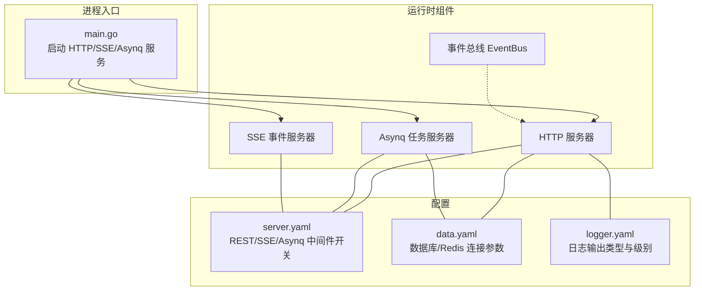
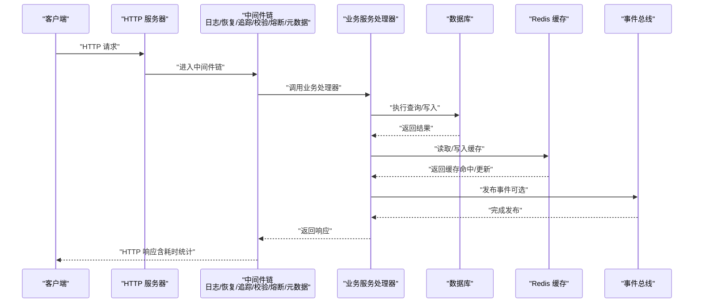
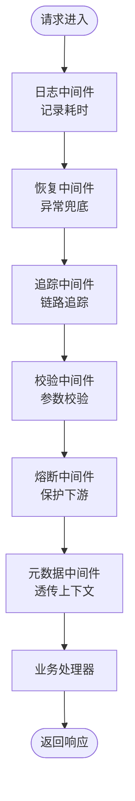
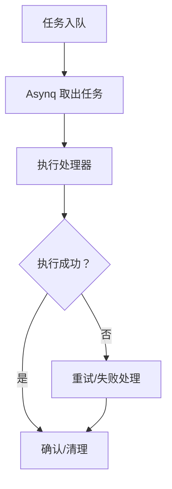
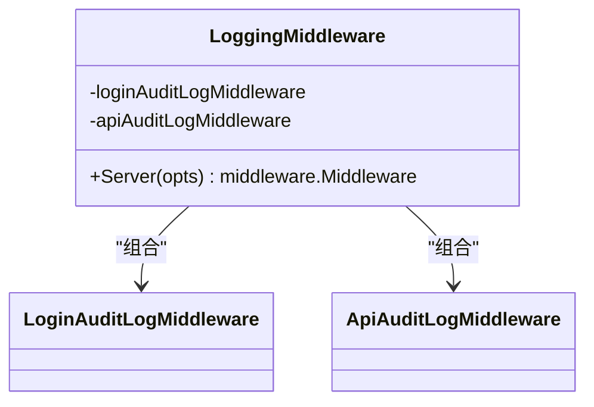
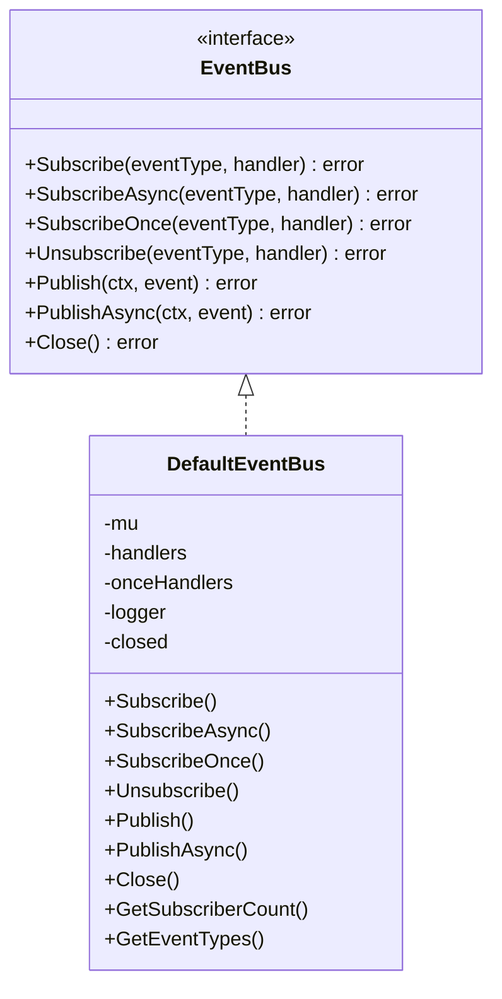
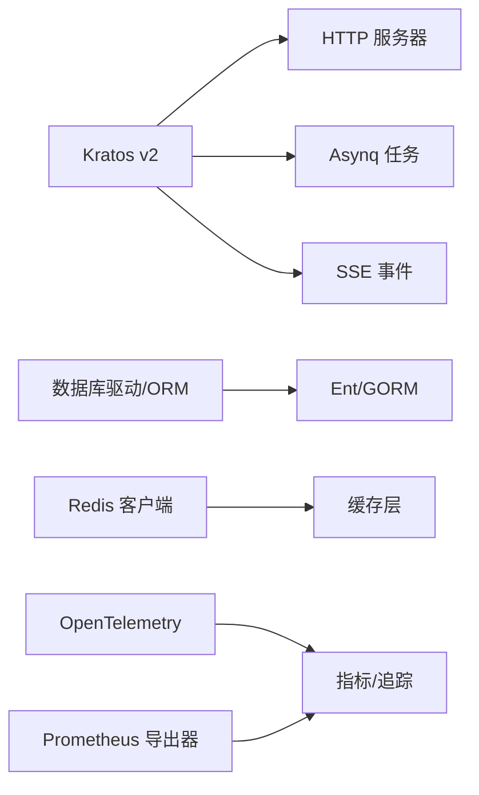

# 性能问题诊断

<cite>
**本文引用的文件**
- [main.go](file://backend/app/admin/service/cmd/server/main.go)
- [go.mod](file://backend/go.mod)
- [server.yaml](file://backend/app/admin/service/configs/server.yaml)
- [data.yaml](file://backend/app/admin/service/configs/data.yaml)
- [logger.yaml](file://backend/app/admin/service/configs/logger.yaml)
- [logging.go](file://backend/pkg/middleware/logging/logging.go)
- [eventbus.go](file://backend/pkg/eventbus/eventbus.go)
</cite>

## 目录
1. [简介](#简介)
2. [项目结构](#项目结构)
3. [核心组件](#核心组件)
4. [架构总览](#架构总览)
5. [详细组件分析](#详细组件分析)
6. [依赖分析](#依赖分析)
7. [性能考量](#性能考量)
8. [故障排查指南](#故障排查指南)
9. [结论](#结论)
10. [附录](#附录)

## 简介
本指南面向 GoWind Admin 的性能问题诊断与优化，聚焦以下关键场景：CPU 使用率过高、内存泄漏、数据库查询慢、API 响应时间长。文档提供系统化排查步骤、监控工具使用方法、日志性能指标分析、热点代码与慢查询定位策略，并给出缓存策略、数据库索引与并发处理的优化建议。

## 项目结构
后端采用 Kratos 框架，HTTP 服务、异步任务（Asynq）与 SSE 事件推送通过统一入口启动；配置集中在 YAML 文件中，便于在不同环境快速切换；中间件层提供日志、审计、熔断、元数据等能力；事件总线支持同步与异步事件发布，有助于解耦与削峰。

图表来源
- [main.go:1-76](file://backend/app/admin/service/cmd/server/main.go#L1-L76)
- [server.yaml:1-49](file://backend/app/admin/service/configs/server.yaml#L1-L49)
- [data.yaml:1-21](file://backend/app/admin/service/configs/data.yaml#L1-L21)
- [logger.yaml:1-32](file://backend/app/admin/service/configs/logger.yaml#L1-L32)

章节来源
- [main.go:1-76](file://backend/app/admin/service/cmd/server/main.go#L1-L76)
- [server.yaml:1-49](file://backend/app/admin/service/configs/server.yaml#L1-L49)
- [data.yaml:1-21](file://backend/app/admin/service/configs/data.yaml#L1-L21)
- [logger.yaml:1-32](file://backend/app/admin/service/configs/logger.yaml#L1-L32)

## 核心组件
- HTTP 服务与中间件：启用日志、恢复、追踪、校验、熔断、元数据等中间件，便于观测与限流。
- Asynq 异步任务：配置队列优先级、并发度、优雅关闭、严格优先级等，影响后台任务吞吐与延迟。
- SSE 事件推送：支持自动流式与自动回复，适合实时通知场景。
- 数据库与 Redis：连接池大小、超时、迁移开关、调试与指标开关等，直接影响 IO 延迟与资源占用。
- 日志中间件：记录请求耗时、登录/接口审计，是性能分析的重要数据源。
- 事件总线：支持同步与异步事件发布，避免阻塞主流程，但需关注订阅者数量与处理耗时。

章节来源
- [server.yaml:1-49](file://backend/app/admin/service/configs/server.yaml#L1-L49)
- [data.yaml:1-21](file://backend/app/admin/service/configs/data.yaml#L1-L21)
- [logging.go:1-52](file://backend/pkg/middleware/logging/logging.go#L1-L52)
- [eventbus.go:1-214](file://backend/pkg/eventbus/eventbus.go#L1-L214)

## 架构总览
下图展示 HTTP 请求在系统内的典型路径，包括中间件链路、数据库与 Redis 访问、事件总线发布等环节，有助于定位性能瓶颈。

图表来源
- [logging.go:1-52](file://backend/pkg/middleware/logging/logging.go#L1-L52)
- [server.yaml:1-49](file://backend/app/admin/service/configs/server.yaml#L1-L49)
- [data.yaml:1-21](file://backend/app/admin/service/configs/data.yaml#L1-L21)

## 详细组件分析

### HTTP 服务与中间件
- 中间件开关：日志、恢复、追踪、校验、熔断、元数据均开启，有利于性能可观测与稳定性保障。
- 超时设置：REST 服务超时为 10 秒，需结合实际接口复杂度评估是否合理。
- Swagger 与 pprof：开发/测试阶段建议开启，生产环境谨慎开启以降低风险。

图表来源
- [server.yaml:22-28](file://backend/app/admin/service/configs/server.yaml#L22-L28)
- [logging.go:31-50](file://backend/pkg/middleware/logging/logging.go#L31-L50)

章节来源
- [server.yaml:1-49](file://backend/app/admin/service/configs/server.yaml#L1-L49)
- [logging.go:1-52](file://backend/pkg/middleware/logging/logging.go#L1-L52)

### Asynq 异步任务
- 并发度与队列优先级：critical/default/low 队列并发与权重可调，影响任务吞吐与延迟。
- 优雅关闭与严格优先级：在高负载或资源紧张时，合理设置关闭超时与优先级策略。
- Redis 连接：任务队列依赖 Redis，需确保连接池与超时配置合理。

图表来源
- [server.yaml:30-42](file://backend/app/admin/service/configs/server.yaml#L30-L42)

章节来源
- [server.yaml:30-42](file://backend/app/admin/service/configs/server.yaml#L30-L42)

### SSE 实时事件
- 自动流式与自动回复：减少客户端轮询开销，提升交互体验，但需控制事件频率与消息体大小。
- 地址与路径：独立端口与路径，便于隔离与扩展。

章节来源
- [server.yaml:43-49](file://backend/app/admin/service/configs/server.yaml#L43-L49)

### 数据库与缓存
- 数据库驱动与连接参数：Postgres/MySQL 可选，连接池上限、最大生命周期等参数直接影响并发与资源占用。
- Redis 连接参数：地址、密码、读写超时等，需与网络与实例规格匹配。
- 迁移与调试：迁移开关与调试模式在生产环境应谨慎开启。

章节来源
- [data.yaml:1-21](file://backend/app/admin/service/configs/data.yaml#L1-L21)

### 日志与审计中间件
- 耗时统计：中间件记录请求开始时间与结束时间，计算耗时并用于性能分析。
- 登录/接口审计：对登录与 API 调用进行审计，辅助定位异常用户行为与慢操作。

图表来源
- [logging.go:14-51](file://backend/pkg/middleware/logging/logging.go#L14-L51)

章节来源
- [logging.go:1-52](file://backend/pkg/middleware/logging/logging.go#L1-L52)

### 事件总线
- 同步与异步发布：支持同步广播与异步发布，异步发布使用带超时的背景上下文，避免阻塞。
- 订阅者管理：支持一次性订阅、取消订阅，订阅者数量与处理耗时直接影响系统延迟。
- 关闭与资源清理：关闭后拒绝新事件，释放内部结构，避免资源泄露。

图表来源
- [eventbus.go:12-34](file://backend/pkg/eventbus/eventbus.go#L12-L34)
- [eventbus.go:36-52](file://backend/pkg/eventbus/eventbus.go#L36-L52)

章节来源
- [eventbus.go:1-214](file://backend/pkg/eventbus/eventbus.go#L1-L214)

## 依赖分析
- 运行时框架：Kratos v2 提供 HTTP、gRPC、中间件生态；Asynq 与 SSE 作为传输扩展。
- ORM/数据库：Ent 与 GORM 插件生态，支持多数据库与指标插件。
- 缓存：Redis 官方客户端，支持 OpenTelemetry 指标集成。
- 监控与追踪：OpenTelemetry SDK 与导出器，Prometheus 指标导出器。
- 其他：日志（zap、logrus）、配置中心与注册中心扩展点预留。

图表来源
- [go.mod:1-290](file://backend/go.mod#L1-L290)

章节来源
- [go.mod:1-290](file://backend/go.mod#L1-L290)

## 性能考量
- CPU 使用率过高
  - 排查要点：检查中间件链路耗时、事件总线订阅者处理耗时、数据库查询复杂度、Redis 命中率。
  - 优化方向：减少不必要的中间件、拆分事件处理、优化 SQL 与索引、提升缓存命中。
- 内存泄漏
  - 排查要点：关注事件总线一次性订阅者是否正确清理、Asynq 任务上下文是否泄漏、HTTP 请求上下文绑定对象。
  - 优化方向：确保订阅者及时取消、任务完成后释放资源、避免大对象常驻。
- 数据库查询慢
  - 排查要点：慢查询日志、索引缺失、锁等待、连接池饱和。
  - 优化方向：补充必要索引、拆分复杂查询、调整连接池参数、使用只读副本。
- API 响应时间长
  - 排查要点：中间件耗时、下游依赖（DB/Redis/外部服务）、并发与阻塞。
  - 优化方向：引入缓存、异步化非关键路径、限流与熔断、升级硬件或分片。

## 故障排查指南

### 一、CPU 使用率过高
- 步骤
  1) 开启 pprof（server.yaml 中已启用），访问 pprof 分析热点函数与堆栈。
  2) 查看日志中间件统计的请求耗时分布，定位慢接口。
  3) 检查事件总线订阅者数量与单次处理耗时，必要时拆分或降级。
  4) 对比数据库与 Redis 的慢查询与超时次数，优化热点查询。
- 工具
  - pprof：本地分析 CPU/内存火焰图。
  - Prometheus + Grafana：采集系统与应用指标，观察 CPU/内存/IO。
  - OpenTelemetry：链路追踪定位慢调用链路。

章节来源
- [server.yaml:6](file://backend/app/admin/service/configs/server.yaml#L6)
- [logging.go:37-49](file://backend/pkg/middleware/logging/logging.go#L37-L49)
- [eventbus.go:106-151](file://backend/pkg/eventbus/eventbus.go#L106-L151)

### 二、内存泄漏
- 步骤
  1) 使用 pprof heap 分析，对比不同时间点的分配情况。
  2) 检查事件总线是否长期持有大量一次性订阅者未清理。
  3) 审核 Asynq 任务上下文与全局变量，避免循环引用。
  4) 观察 GC 次数与停顿时间，判断是否存在对象逃逸。
- 工具
  - pprof heap：查看对象分配与存活。
  - Go runtime/metrics：采集 GC、堆大小、对象数等。

章节来源
- [eventbus.go:142-148](file://backend/pkg/eventbus/eventbus.go#L142-L148)

### 三、数据库查询慢
- 步骤
  1) 打开数据库调试与追踪（data.yaml 中 debug/enable_trace 可按需开启）。
  2) 结合慢查询日志与执行计划，补充缺失索引。
  3) 检查连接池参数（最大空闲/打开连接、生命周期）是否合理。
  4) 将热点查询结果放入 Redis 缓存，设置合理过期时间。
- 工具
  - 数据库慢查询日志与 EXPLAIN。
  - Prometheus 数据库指标（连接数、查询耗时、锁等待）。

章节来源
- [data.yaml:8-13](file://backend/app/admin/service/configs/data.yaml#L8-L13)

### 四、API 响应时间长
- 步骤
  1) 利用日志中间件统计的耗时，识别慢接口与异常峰值。
  2) 在中间件链中增加限流与熔断，保护下游。
  3) 对非关键逻辑异步化（如事件总线 PublishAsync），降低同步阻塞。
  4) 优化 Redis 读写超时与批量操作，减少 RTT。
- 工具
  - 中间件日志与审计。
  - Prometheus + Grafana 展示 P50/P95/P99 延迟。

章节来源
- [logging.go:37-49](file://backend/pkg/middleware/logging/logging.go#L37-L49)
- [server.yaml:22-28](file://backend/app/admin/service/configs/server.yaml#L22-L28)
- [eventbus.go:154-167](file://backend/pkg/eventbus/eventbus.go#L154-L167)
- [data.yaml:18-20](file://backend/app/admin/service/configs/data.yaml#L18-L20)

### 五、日志与指标分析
- 日志中间件会记录请求耗时，可用于生成延迟直方图与慢请求列表。
- 日志类型与级别在 logger.yaml 中配置，生产环境建议使用结构化日志（zap/logrus）并降低级别以减少开销。
- 结合 OpenTelemetry 与 Prometheus，建立端到端链路追踪与系统指标面板。

章节来源
- [logging.go:37-49](file://backend/pkg/middleware/logging/logging.go#L37-L49)
- [logger.yaml:1-32](file://backend/app/admin/service/configs/logger.yaml#L1-L32)

### 六、缓存策略优化
- 命中率优先：热点数据放入 Redis，设置合适 TTL 与预热。
- 失效策略：使用互斥锁避免缓存击穿，使用多级缓存（本地+分布式）。
- 写策略：先写 DB 再删缓存，或写缓存并异步同步 DB，避免不一致。

章节来源
- [data.yaml:15-21](file://backend/app/admin/service/configs/data.yaml#L15-L21)

### 七、数据库索引优化
- 命中率优先：为高频查询字段建立复合索引，避免全表扫描。
- 执行计划：定期审查 EXPLAIN 输出，删除冗余索引。
- 分库分表：对超大表进行分片，降低单表压力。

章节来源
- [data.yaml:2-7](file://backend/app/admin/service/configs/data.yaml#L2-L7)

### 八、并发处理优化
- Asynq 并发与队列：根据任务类型与资源限制调整 critical/default/low 并发度。
- 优雅关闭：设置合理的关闭超时，保证任务处理完整性。
- 事件总线异步化：将非关键事件改为异步发布，降低主流程阻塞。

章节来源
- [server.yaml:30-42](file://backend/app/admin/service/configs/server.yaml#L30-L42)
- [eventbus.go:154-167](file://backend/pkg/eventbus/eventbus.go#L154-L167)

## 结论
通过 pprof、日志中间件、事件总线与数据库/Redis 连接池的协同治理，可系统性定位并缓解 GoWind Admin 的性能瓶颈。建议在生产环境逐步启用指标与追踪，持续监控关键指标，配合缓存与索引优化，实现稳定高效的在线服务。

## 附录
- 快速检查清单
  - pprof 是否启用并可用
  - 日志中间件是否记录耗时
  - 事件总线订阅者数量与处理耗时
  - 数据库慢查询与索引覆盖
  - Redis 命中率与超时
  - Asynq 并发与优雅关闭配置
  - 连接池参数与生命周期