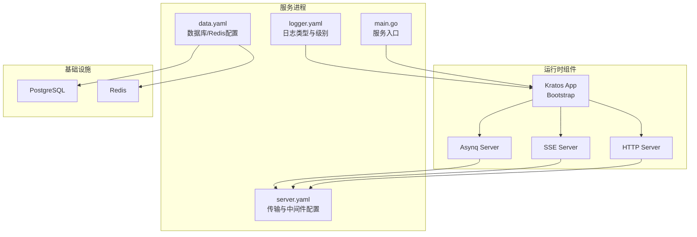
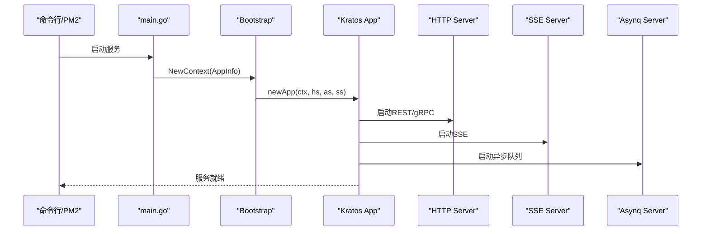
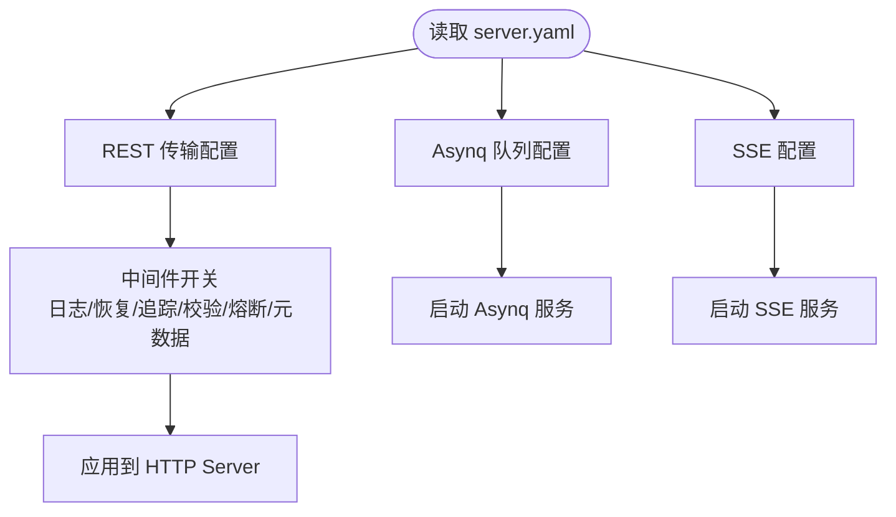
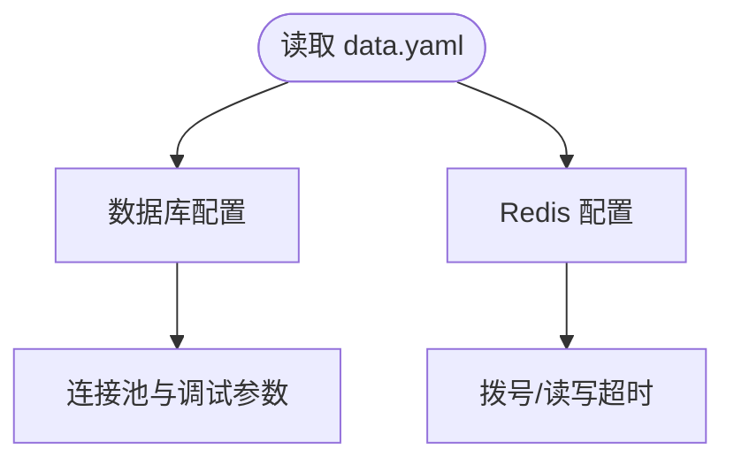
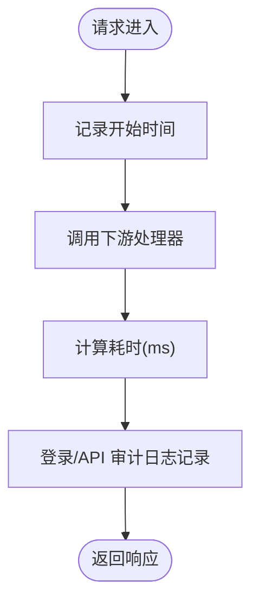
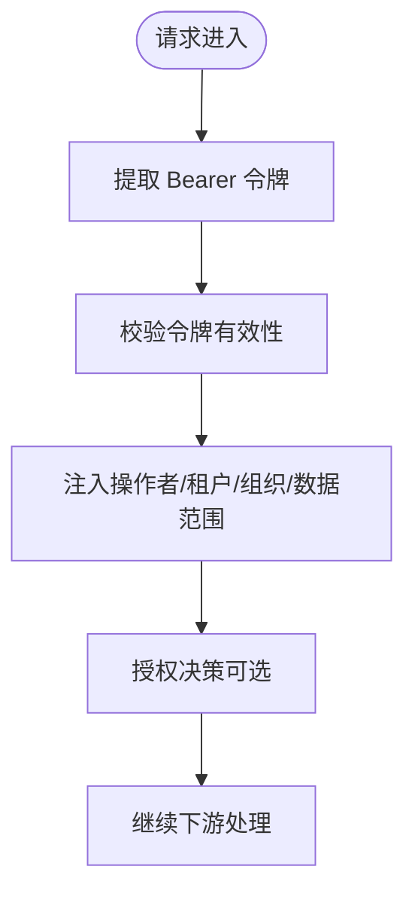
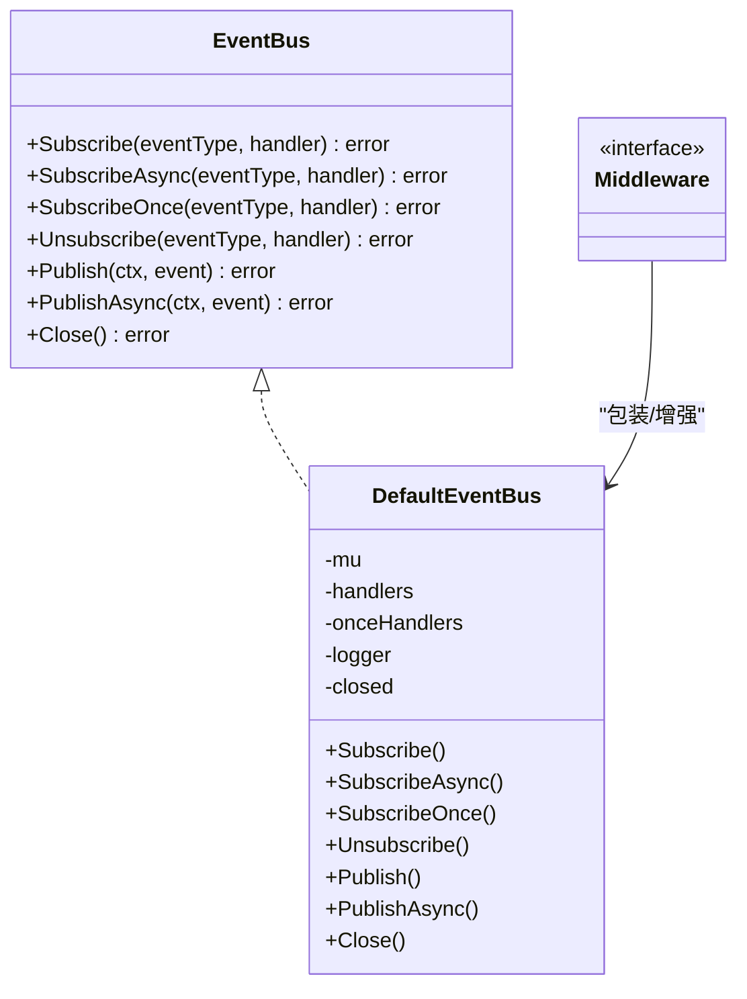
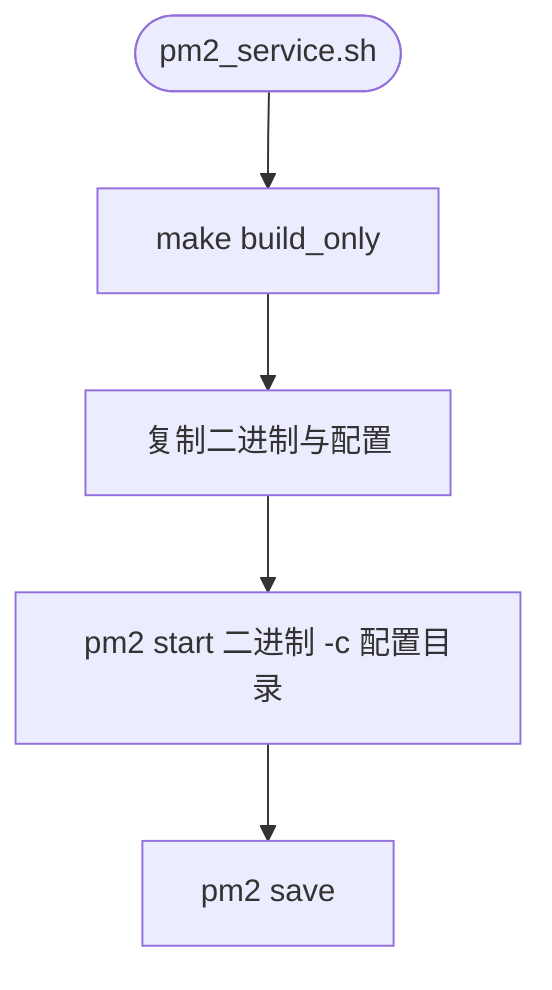
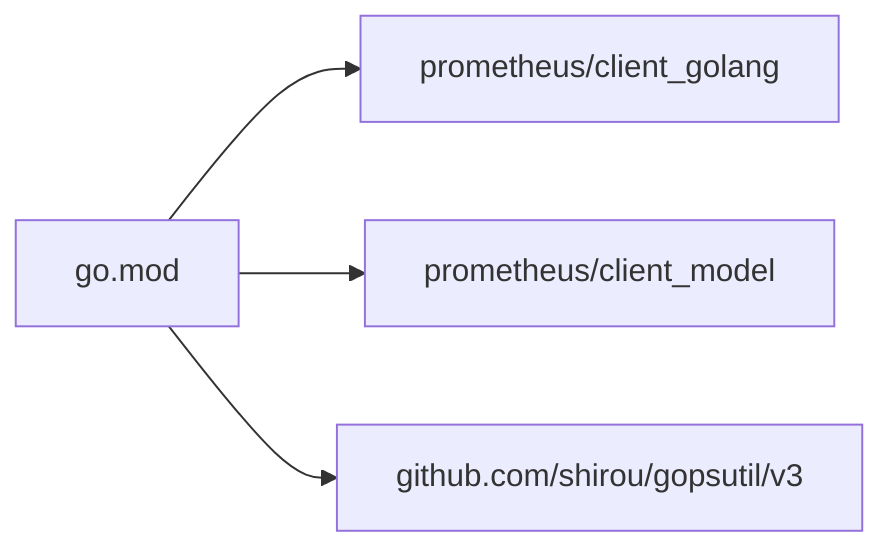
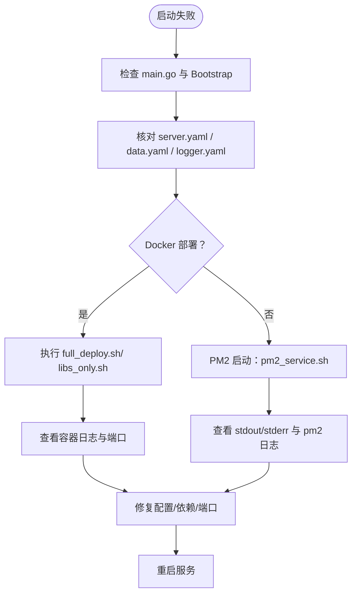

# 故障排除

<cite>
**本文引用的文件**   
- [main.go](file://backend/app/admin/service/cmd/server/main.go)
- [server.yaml](file://backend/app/admin/service/configs/server.yaml)
- [data.yaml](file://backend/app/admin/service/configs/data.yaml)
- [logger.yaml](file://backend/app/admin/service/configs/logger.yaml)
- [logging.go](file://backend/pkg/middleware/logging/logging.go)
- [auth.go](file://backend/pkg/middleware/auth/auth.go)
- [eventbus.go](file://backend/pkg/eventbus/eventbus.go)
- [middleware.go](file://backend/pkg/eventbus/middleware.go)
- [pm2_service.sh](file://backend/scripts/deploy/pm2_service.sh)
- [backend_deploy.md](file://docs/backend_deploy.md)
- [backend_readme.md](file://backend/README.md)
- [Makefile](file://backend/Makefile)
- [libs_only.sh](file://backend/scripts/docker/libs_only.sh)
- [full_deploy.sh](file://backend/scripts/docker/full_deploy.sh)
- [go.mod](file://backend/go.mod)
- [go.sum](file://backend/go.sum)
- [README.md](file://README.md)
</cite>

## 目录
1. [简介](#简介)
2. [项目结构](#项目结构)
3. [核心组件](#核心组件)
4. [架构总览](#架构总览)
5. [详细组件分析](#详细组件分析)
6. [依赖分析](#依赖分析)
7. [性能考虑](#性能考虑)
8. [故障排除指南](#故障排除指南)
9. [结论](#结论)
10. [附录](#附录)

## 简介
本指南面向 GoWind Admin 的运维与开发人员，聚焦于系统在启动失败、数据库连接、权限配置、性能问题等方面的常见故障诊断与解决。文档同时提供日志分析方法、调试工具使用建议、监控指标解读与异常处理策略，并给出生产环境故障处理标准流程与应急响应方案。

## 项目结构
后端采用 go-kratos 微服务架构，服务通过 Bootstrap 初始化，支持 REST、gRPC、SSE、异步队列等多种传输协议。配置集中于 YAML 文件，日志与审计中间件贯穿服务生命周期，事件总线提供异步解耦与可观测性增强。

**图表来源**
- [main.go:1-76](file://backend/app/admin/service/cmd/server/main.go#L1-L76)
- [server.yaml:1-49](file://backend/app/admin/service/configs/server.yaml#L1-L49)
- [data.yaml:1-21](file://backend/app/admin/service/configs/data.yaml#L1-L21)
- [logger.yaml:1-32](file://backend/app/admin/service/configs/logger.yaml#L1-L32)

**章节来源**
- [main.go:1-76](file://backend/app/admin/service/cmd/server/main.go#L1-L76)
- [server.yaml:1-49](file://backend/app/admin/service/configs/server.yaml#L1-L49)
- [data.yaml:1-21](file://backend/app/admin/service/configs/data.yaml#L1-L21)
- [logger.yaml:1-32](file://backend/app/admin/service/configs/logger.yaml#L1-L32)

## 核心组件
- 服务入口与运行控制：负责初始化上下文、组装传输层与中间件、启动服务。
- 配置体系：分别管理传输层、数据库/缓存、日志输出类型与级别。
- 日志与审计中间件：统一记录请求耗时、登录/操作审计日志。
- 权限中间件：令牌校验、注入操作者与租户上下文、授权决策。
- 事件总线：订阅/发布事件，支持异步处理、超时与重试中间件。
- 部署与进程管理：Docker 一键部署与 PM2 进程守护。

**章节来源**
- [main.go:46-76](file://backend/app/admin/service/cmd/server/main.go#L46-L76)
- [server.yaml:1-49](file://backend/app/admin/service/configs/server.yaml#L1-L49)
- [data.yaml:1-21](file://backend/app/admin/service/configs/data.yaml#L1-L21)
- [logger.yaml:1-32](file://backend/app/admin/service/configs/logger.yaml#L1-L32)
- [logging.go:14-52](file://backend/pkg/middleware/logging/logging.go#L14-L52)
- [auth.go:24-122](file://backend/pkg/middleware/auth/auth.go#L24-L122)
- [eventbus.go:12-34](file://backend/pkg/eventbus/eventbus.go#L12-L34)
- [pm2_service.sh:96-137](file://backend/scripts/deploy/pm2_service.sh#L96-L137)

## 架构总览
服务启动流程从 main.go 入手，通过 Bootstrap 初始化 Kratos App，挂载 HTTP/SSE/Asynq 传输层，并加载 server.yaml、data.yaml、logger.yaml 等配置。权限与日志中间件在请求链路上进行拦截与增强，事件总线提供异步扩展点。

**图表来源**
- [main.go:46-76](file://backend/app/admin/service/cmd/server/main.go#L46-L76)
- [server.yaml:1-49](file://backend/app/admin/service/configs/server.yaml#L1-L49)

## 详细组件分析

### 传输与中间件配置（server.yaml）
- REST 地址与超时、Swagger 与 pprof 开关、CORS 白名单、中间件开关（日志、恢复、追踪、校验、熔断、元数据）。
- Asynq 队列连接、编码、并发、优雅关闭、优先级、时区与队列权重。
- SSE 地址、编码、路径、自动流式与自动回复。

**图表来源**
- [server.yaml:1-49](file://backend/app/admin/service/configs/server.yaml#L1-L49)

**章节来源**
- [server.yaml:1-49](file://backend/app/admin/service/configs/server.yaml#L1-L49)

### 数据与缓存配置（data.yaml）
- 数据库驱动与连接串、迁移开关、调试/追踪/指标开关、连接池参数。
- Redis 地址、密码、拨号/读写超时。

**图表来源**
- [data.yaml:1-21](file://backend/app/admin/service/configs/data.yaml#L1-L21)

**章节来源**
- [data.yaml:1-21](file://backend/app/admin/service/configs/data.yaml#L1-L21)

### 日志配置（logger.yaml）
- 日志类型（标准输出/文件/第三方采集）、Zap/Logrus 等具体参数、级别与归档策略。

**章节来源**
- [logger.yaml:1-32](file://backend/app/admin/service/configs/logger.yaml#L1-L32)

### 日志与审计中间件（logging.go）
- 在服务端中间件中统计耗时，记录登录与 API 审计日志，支持对敏感字段脱敏后的请求/响应记录。

**图表来源**
- [logging.go:14-52](file://backend/pkg/middleware/logging/logging.go#L14-L52)

**章节来源**
- [logging.go:14-52](file://backend/pkg/middleware/logging/logging.go#L14-L52)

### 权限中间件（auth.go）
- 从上下文提取 Bearer 令牌，校验有效性，注入操作者/租户/组织/数据范围上下文，支持授权决策与 Ent Viewer 注入。

**图表来源**
- [auth.go:24-122](file://backend/pkg/middleware/auth/auth.go#L24-L122)

**章节来源**
- [auth.go:24-122](file://backend/pkg/middleware/auth/auth.go#L24-L122)

### 事件总线（eventbus.go 与 middleware.go）
- 提供订阅/一次性订阅/异步发布/关闭等能力，内置日志、恢复、超时、重试、指标中间件，支持异步解耦与可观测性。

**图表来源**
- [eventbus.go:12-34](file://backend/pkg/eventbus/eventbus.go#L12-L34)
- [eventbus.go:36-52](file://backend/pkg/eventbus/eventbus.go#L36-L52)
- [middleware.go:10-114](file://backend/pkg/eventbus/middleware.go#L10-L114)

**章节来源**
- [eventbus.go:106-184](file://backend/pkg/eventbus/eventbus.go#L106-L184)
- [middleware.go:13-114](file://backend/pkg/eventbus/middleware.go#L13-L114)

### 部署与进程管理（pm2_service.sh）
- 构建二进制、复制配置、以 PM2 启动服务，支持命名空间、工作目录、日志输出与错误输出重定向。

**图表来源**
- [pm2_service.sh:38-94](file://backend/scripts/deploy/pm2_service.sh#L38-L94)
- [pm2_service.sh:118-132](file://backend/scripts/deploy/pm2_service.sh#L118-L132)

**章节来源**
- [pm2_service.sh:1-137](file://backend/scripts/deploy/pm2_service.sh#L1-L137)

## 依赖分析
- 运行时依赖 Prometheus 客户端库与相关模型，可用于应用性能监控与指标导出。
- 项目使用 gopsutil、shirou/gopsutil 等库进行系统资源与进程信息采集，便于性能分析与监控。

**图表来源**
- [go.mod:189-202](file://backend/go.mod#L189-L202)

**章节来源**
- [go.sum:773-786](file://backend/go.sum#L773-L786)
- [go.mod:189-202](file://backend/go.mod#L189-L202)

## 性能考虑
- 连接池与超时：合理设置数据库最大空闲/活动连接数与连接最大生存时间，避免连接抖动与资源枯竭。
- 中间件开销：在高并发场景下谨慎开启调试与追踪，必要时仅在特定环境启用。
- 异步队列：根据业务优先级配置队列权重与并发，结合超时与重试中间件提升稳定性。
- 日志级别：生产环境建议使用 info 或 warn 级别，避免过多 I/O 压力。

[本节为通用指导，无需“章节来源”]

## 故障排除指南

### 启动失败排查
- 检查服务入口与配置加载
  - 确认 main.go 中 Bootstrap 初始化与 newApp 调用正确。
  - 确认 server.yaml、data.yaml、logger.yaml 路径与权限正确。
- Docker 一键部署
  - 使用 full_deploy.sh 启动完整应用与依赖，检查容器日志与端口占用。
  - 使用 libs_only.sh 仅启动依赖，本地运行应用以便调试。
- PM2 进程管理
  - 确认 pm2_service.sh 成功复制二进制与配置，检查 stdout/stderr 日志文件。
  - 使用 pm2 list/status 查看进程状态，必要时 pm2 delete 并重新启动。

**图表来源**
- [main.go:46-76](file://backend/app/admin/service/cmd/server/main.go#L46-L76)
- [server.yaml:1-49](file://backend/app/admin/service/configs/server.yaml#L1-L49)
- [data.yaml:1-21](file://backend/app/admin/service/configs/data.yaml#L1-L21)
- [logger.yaml:1-32](file://backend/app/admin/service/configs/logger.yaml#L1-L32)
- [full_deploy.sh:1-47](file://backend/scripts/docker/full_deploy.sh#L1-L47)
- [libs_only.sh:1-120](file://backend/scripts/docker/libs_only.sh#L1-L120)
- [pm2_service.sh:96-137](file://backend/scripts/deploy/pm2_service.sh#L96-L137)

**章节来源**
- [backend_readme.md:181-213](file://backend/README.md#L181-L213)
- [backend_deploy.md:42-85](file://docs/backend_deploy.md#L42-L85)
- [Makefile:147-188](file://backend/Makefile#L147-L188)

### 数据库连接问题
- 连接串与驱动
  - 确认 data.yaml 中 driver 与 source 正确，PostgreSQL/MySQL 任选其一。
  - 确认数据库服务可达，网络连通与防火墙策略。
- 连接池与超时
  - 调整 max_idle_connections、max_open_connections、connection_max_lifetime。
  - 检查迁移开关 migrate 是否导致启动阻塞。
- Docker 环境域名解析
  - 按部署文档修改 hosts，确保容器内可解析 postgres、redis、minio、jaeger 等域名。

**章节来源**
- [data.yaml:1-21](file://backend/app/admin/service/configs/data.yaml#L1-L21)
- [backend_deploy.md:61-78](file://docs/backend_deploy.md#L61-L78)

### 权限配置错误
- 令牌校验失败
  - 检查 Bearer 令牌是否携带、是否过期。
  - 确认 AccessToken 校验器已正确注入与配置。
- 上下文注入
  - 确认操作者/租户/组织/数据范围注入逻辑生效。
- 授权决策
  - 若启用授权，确认授权引擎可用且策略匹配。

**章节来源**
- [auth.go:46-61](file://backend/pkg/middleware/auth/auth.go#L46-L61)
- [auth.go:95-116](file://backend/pkg/middleware/auth/auth.go#L95-L116)

### 性能问题诊断
- 系统资源
  - 使用系统监控工具观察 CPU、内存、磁盘 IO、网络带宽。
- 应用性能
  - 结合日志中间件统计耗时，定位慢请求与慢接口。
  - 启用 pprof（server.yaml 中 enable_pprof）进行热点分析。
- 异步队列
  - 监控队列积压、处理耗时与失败重试次数，调整并发与队列权重。

**章节来源**
- [server.yaml:6](file://backend/app/admin/service/configs/server.yaml#L6)
- [logging.go:32-49](file://backend/pkg/middleware/logging/logging.go#L32-L49)
- [eventbus.go:154-167](file://backend/pkg/eventbus/eventbus.go#L154-L167)

### 日志分析方法与技巧
- 后端日志
  - 根据 logger.yaml 选择日志类型，生产环境建议文件输出并配置轮转。
  - 关注登录/操作审计日志中的 trace_id/span_id，结合分布式追踪定位问题。
- 前端日志
  - 浏览器控制台与网络面板查看请求/响应与错误堆栈。
- 数据库日志
  - PostgreSQL/MySQL 的慢查询日志与错误日志，配合 EXPLAIN 分析瓶颈。

**章节来源**
- [logger.yaml:1-32](file://backend/app/admin/service/configs/logger.yaml#L1-L32)
- [logging.go:14-52](file://backend/pkg/middleware/logging/logging.go#L14-L52)
- [backend_readme.md:34-43](file://backend/README.md#L34-L43)

### 调试工具使用指南
- 性能分析
  - 使用 pprof（server.yaml enable_pprof）导出性能数据，结合火焰图定位热点。
- 内存泄漏检测
  - 使用 Go 内置 pprof heap profile，对比不同时间点的堆快照。
- 网络问题排查
  - 使用 curl/浏览器开发者工具验证 REST/gRPC/SSE 接口。
  - 检查 CORS 配置与代理转发。

**章节来源**
- [server.yaml:6](file://backend/app/admin/service/configs/server.yaml#L6)
- [backend_readme.md:34-43](file://backend/README.md#L34-L43)

### 监控指标解读与异常处理
- 系统资源监控
  - CPU/内存/磁盘/网络利用率，关注突发峰值与持续高负载。
- 应用性能监控
  - QPS、P95/P99 延迟、错误率、超时率，结合 trace_id 追踪。
- 错误率监控
  - 统计 4xx/5xx 比例与错误类型分布，快速定位业务异常。
- 事件总线指标
  - 使用 MetricsMiddleware 收集事件处理耗时与成功率。

**章节来源**
- [middleware.go:90-104](file://backend/pkg/eventbus/middleware.go#L90-L104)
- [go.mod:189-202](file://backend/go.mod#L189-L202)

### 常见错误与解决方案
- go.sum 依赖验证失败
  - 清理模块缓存后重新 tidy，必要时删除 go.sum 重建。
- 中间件连接失败（postgres/redis/minio）
  - 修改 hosts，确保容器内域名解析到宿主机或服务名。
- Redis 认证/命令报错
  - 升级至 Redis 6.0+ 以支持 HExpire/HSETEX 等命令。

**章节来源**
- [backend_readme.md:214-260](file://backend/README.md#L214-L260)

### 生产环境故障处理标准流程与应急响应
- 标准流程
  - 发现告警 -> 快速隔离 -> 降级/熔断 -> 回滚/回溯 -> 修复 -> 验证 -> 复盘。
- 应急响应
  - 启用只读模式、关闭非关键接口、扩容实例、切换备用数据库/缓存。
  - 使用 PM2 自动重启与日志轮转，保障服务连续性。

**章节来源**
- [pm2_service.sh:118-132](file://backend/scripts/deploy/pm2_service.sh#L118-L132)
- [backend_deploy.md:42-85](file://docs/backend_deploy.md#L42-L85)

## 结论
通过规范的配置管理、完善的日志与审计、严格的中间件与事件总线设计，以及系统化的部署与监控体系，GoWind Admin 能够在复杂环境中保持稳定与高性能。本指南提供了从启动到运行、从诊断到优化的全链路实践建议，帮助团队快速定位与解决问题。

## 附录
- 快速参考
  - 启动与停止：make run/build/compose-up/compose-down
  - 部署：full_deploy.sh/libs_only.sh/pm2_service.sh
  - 文档与演示：Swagger UI、演示站点与默认账号

**章节来源**
- [backend_readme.md:166-188](file://backend/README.md#L166-L188)
- [README.md:15-22](file://README.md#L15-L22)