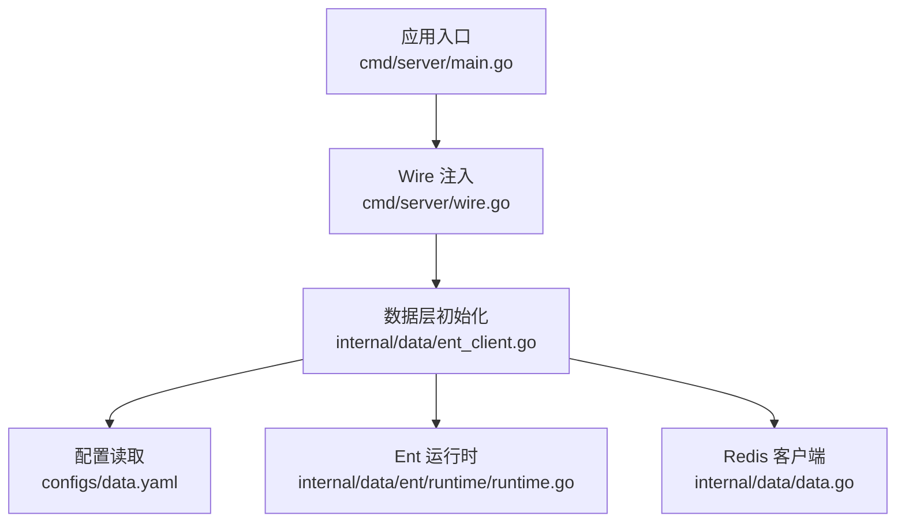
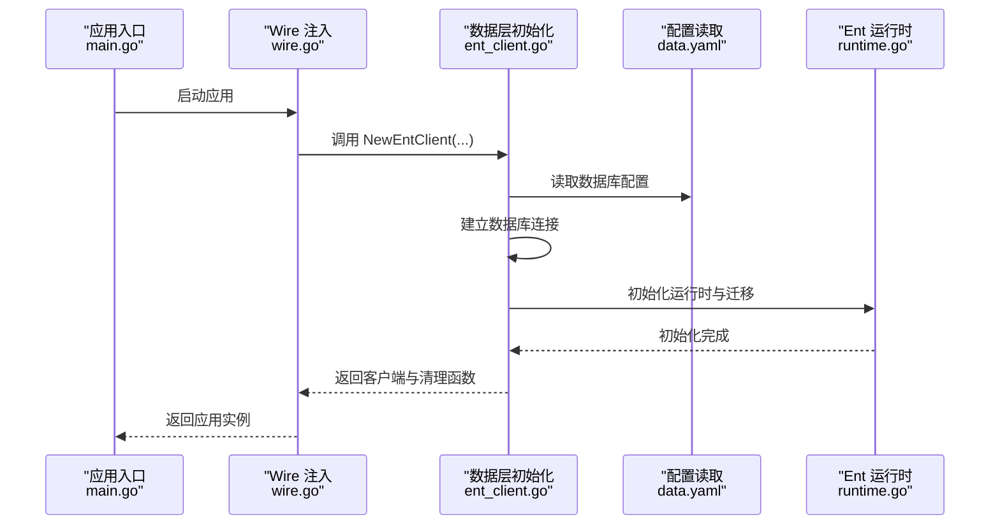
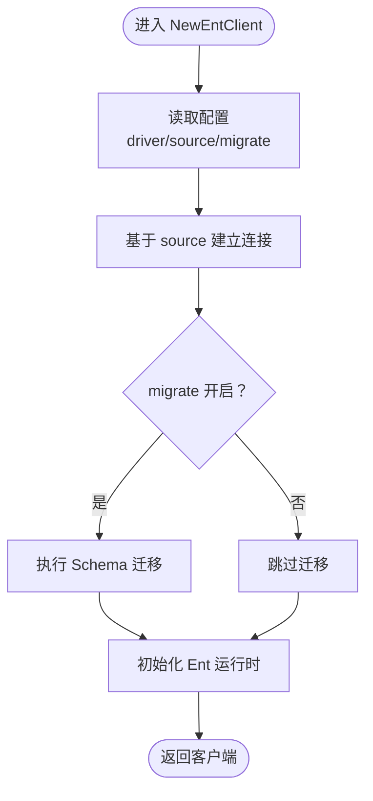
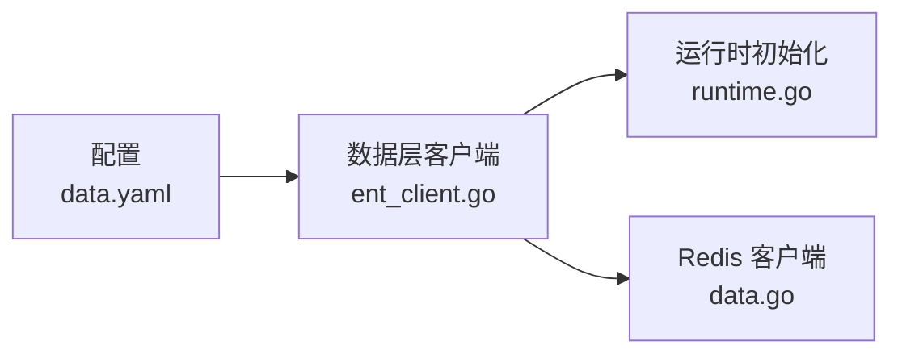

# 数据库连接问题

<cite>
**本文引用的文件**
- [backend/app/admin/service/cmd/server/main.go](file://backend/app/admin/service/cmd/server/main.go)
- [backend/app/admin/service/cmd/server/wire.go](file://backend/app/admin/service/cmd/server/wire.go)
- [backend/app/admin/service/configs/data.yaml](file://backend/app/admin/service/configs/data.yaml)
- [backend/app/admin/service/internal/data/ent_client.go](file://backend/app/admin/service/internal/data/ent_client.go)
- [backend/app/admin/service/internal/data/data.go](file://backend/app/admin/service/internal/data/data.go)
- [backend/app/admin/service/internal/data/ent/runtime/runtime.go](file://backend/app/admin/service/internal/data/ent/runtime/runtime.go)
</cite>

## 目录
1. [简介](#简介)
2. [项目结构](#项目结构)
3. [核心组件](#核心组件)
4. [架构总览](#架构总览)
5. [详细组件分析](#详细组件分析)
6. [依赖分析](#依赖分析)
7. [性能考虑](#性能考虑)
8. [故障排查指南](#故障排查指南)
9. [结论](#结论)
10. [附录](#附录)

## 简介
本指南聚焦于 GoWind Admin 后端在启动阶段与数据库建立连接时可能出现的问题与排查路径。内容覆盖连接超时、认证失败、网络不通、数据库服务不可用等常见场景；提供数据库连接参数的正确配置方法（主机、端口、用户名、密码、数据库名等）；说明如何使用命令行工具进行连通性测试；解释如何查看数据库日志；并针对连接池相关问题给出建议。同时，结合项目中对 PostgreSQL 和 MySQL 的支持差异，分别给出两类数据库的特定问题与解决方案。

## 项目结构
与数据库连接直接相关的关键位置如下：
- 配置文件：backend/app/admin/service/configs/data.yaml
- 数据层入口：backend/app/admin/service/internal/data/ent_client.go
- Redis 客户端：backend/app/admin/service/internal/data/data.go
- Ent 运行时初始化：backend/app/admin/service/internal/data/ent/runtime/runtime.go
- 应用启动入口：backend/app/admin/service/cmd/server/main.go
- Wire 注入入口：backend/app/admin/service/cmd/server/wire.go

图表来源
- [backend/app/admin/service/cmd/server/main.go:1-76](file://backend/app/admin/service/cmd/server/main.go#L1-L76)
- [backend/app/admin/service/cmd/server/wire.go:1-47](file://backend/app/admin/service/cmd/server/wire.go#L1-L47)
- [backend/app/admin/service/internal/data/ent_client.go:1-64](file://backend/app/admin/service/internal/data/ent_client.go#L1-L64)
- [backend/app/admin/service/configs/data.yaml:1-21](file://backend/app/admin/service/configs/data.yaml#L1-L21)
- [backend/app/admin/service/internal/data/ent/runtime/runtime.go:1-800](file://backend/app/admin/service/internal/data/ent/runtime/runtime.go#L1-L800)
- [backend/app/admin/service/internal/data/data.go:1-63](file://backend/app/admin/service/internal/data/data.go#L1-L63)

章节来源
- [backend/app/admin/service/cmd/server/main.go:1-76](file://backend/app/admin/service/cmd/server/main.go#L1-L76)
- [backend/app/admin/service/cmd/server/wire.go:1-47](file://backend/app/admin/service/cmd/server/wire.go#L1-L47)
- [backend/app/admin/service/configs/data.yaml:1-21](file://backend/app/admin/service/configs/data.yaml#L1-L21)
- [backend/app/admin/service/internal/data/ent_client.go:1-64](file://backend/app/admin/service/internal/data/ent_client.go#L1-L64)
- [backend/app/admin/service/internal/data/data.go:1-63](file://backend/app/admin/service/internal/data/data.go#L1-L63)
- [backend/app/admin/service/internal/data/ent/runtime/runtime.go:1-800](file://backend/app/admin/service/internal/data/ent/runtime/runtime.go#L1-L800)

## 核心组件
- 数据库驱动与连接
  - 通过 Ent ORM 与底层 SQL 驱动交互，支持 PostgreSQL 与 MySQL。
  - 配置项位于 data.yaml 中，包含 driver、source、migrate、debug、连接池参数等。
- Redis 客户端
  - 同样由配置驱动，用于缓存与验证码等场景。
- 应用启动流程
  - main.go 调用 bootstrap.RunApp，内部通过 Wire 注入完成各组件初始化，其中包含数据库客户端的创建。

章节来源
- [backend/app/admin/service/configs/data.yaml:1-21](file://backend/app/admin/service/configs/data.yaml#L1-L21)
- [backend/app/admin/service/internal/data/ent_client.go:1-64](file://backend/app/admin/service/internal/data/ent_client.go#L1-L64)
- [backend/app/admin/service/internal/data/data.go:1-63](file://backend/app/admin/service/internal/data/data.go#L1-L63)
- [backend/app/admin/service/cmd/server/main.go:1-76](file://backend/app/admin/service/cmd/server/main.go#L1-L76)
- [backend/app/admin/service/cmd/server/wire.go:1-47](file://backend/app/admin/service/cmd/server/wire.go#L1-L47)

## 架构总览
下图展示从应用启动到数据库连接建立的关键步骤与依赖关系：

图表来源
- [backend/app/admin/service/cmd/server/main.go:59-75](file://backend/app/admin/service/cmd/server/main.go#L59-L75)
- [backend/app/admin/service/cmd/server/wire.go:37-46](file://backend/app/admin/service/cmd/server/wire.go#L37-L46)
- [backend/app/admin/service/internal/data/ent_client.go:22-62](file://backend/app/admin/service/internal/data/ent_client.go#L22-L62)
- [backend/app/admin/service/configs/data.yaml:1-21](file://backend/app/admin/service/configs/data.yaml#L1-L21)
- [backend/app/admin/service/internal/data/ent/runtime/runtime.go:1-800](file://backend/app/admin/service/internal/data/ent/runtime/runtime.go#L1-L800)

## 详细组件分析

### 数据库连接参数与配置
- 关键配置项
  - driver：数据库驱动类型（postgres 或 mysql）
  - source：连接字符串（包含 host、port、user、password、dbname、sslmode 等）
  - migrate：是否自动执行迁移
  - debug：是否启用调试日志
  - 连接池参数：max_idle_connections、max_open_connections、connection_max_lifetime
- 配置示例与要点
  - PostgreSQL 示例已启用，包含 sslmode 等参数
  - MySQL 示例注释保留，可按需启用
  - 连接池参数建议根据并发与资源限制合理设置

章节来源
- [backend/app/admin/service/configs/data.yaml:1-21](file://backend/app/admin/service/configs/data.yaml#L1-L21)

### 数据库驱动与连接建立
- 驱动导入
  - 同时引入了 PostgreSQL 与 MySQL 的驱动占位，确保编译期可用
- 客户端创建
  - NewEntClient 通过配置创建 Ent 客户端，支持自动迁移
  - 日志记录与错误处理集中在数据层
- 迁移与运行时
  - 在启用 migrate 的情况下，启动时执行 Schema 创建
  - 运行时初始化加载实体与策略

图表来源
- [backend/app/admin/service/internal/data/ent_client.go:22-62](file://backend/app/admin/service/internal/data/ent_client.go#L22-L62)
- [backend/app/admin/service/configs/data.yaml:1-21](file://backend/app/admin/service/configs/data.yaml#L1-L21)
- [backend/app/admin/service/internal/data/ent/runtime/runtime.go:1-800](file://backend/app/admin/service/internal/data/ent/runtime/runtime.go#L1-L800)

章节来源
- [backend/app/admin/service/internal/data/ent_client.go:1-64](file://backend/app/admin/service/internal/data/ent_client.go#L1-L64)
- [backend/app/admin/service/internal/data/ent/runtime/runtime.go:1-800](file://backend/app/admin/service/internal/data/ent/runtime/runtime.go#L1-L800)

### Redis 客户端与数据库的关系
- Redis 客户端同样由配置驱动，用于缓存与验证码等场景
- 与数据库连接相互独立，但同属应用启动阶段初始化

章节来源
- [backend/app/admin/service/internal/data/data.go:23-39](file://backend/app/admin/service/internal/data/data.go#L23-L39)
- [backend/app/admin/service/configs/data.yaml:15-21](file://backend/app/admin/service/configs/data.yaml#L15-L21)

## 依赖分析
- 组件耦合
  - 数据层通过配置中心读取数据库参数，耦合度低
  - Ent 运行时与实体定义解耦，便于扩展
- 外部依赖
  - PostgreSQL 与 MySQL 驱动均以导入形式存在，便于切换
- 潜在风险
  - 配置缺失或错误会导致启动阶段直接失败
  - 连接池参数不当可能导致连接泄漏或资源耗尽

图表来源
- [backend/app/admin/service/configs/data.yaml:1-21](file://backend/app/admin/service/configs/data.yaml#L1-L21)
- [backend/app/admin/service/internal/data/ent_client.go:1-64](file://backend/app/admin/service/internal/data/ent_client.go#L1-L64)
- [backend/app/admin/service/internal/data/ent/runtime/runtime.go:1-800](file://backend/app/admin/service/internal/data/ent/runtime/runtime.go#L1-L800)
- [backend/app/admin/service/internal/data/data.go:1-63](file://backend/app/admin/service/internal/data/data.go#L1-L63)

章节来源
- [backend/app/admin/service/configs/data.yaml:1-21](file://backend/app/admin/service/configs/data.yaml#L1-L21)
- [backend/app/admin/service/internal/data/ent_client.go:1-64](file://backend/app/admin/service/internal/data/ent_client.go#L1-L64)
- [backend/app/admin/service/internal/data/data.go:1-63](file://backend/app/admin/service/internal/data/data.go#L1-L63)
- [backend/app/admin/service/internal/data/ent/runtime/runtime.go:1-800](file://backend/app/admin/service/internal/data/ent/runtime/runtime.go#L1-L800)

## 性能考虑
- 连接池参数
  - max_idle_connections 与 max_open_connections 控制空闲与最大连接数
  - connection_max_lifetime 控制连接复用时长，避免长时间占用导致资源老化
- 日志与追踪
  - debug、enable_trace、enable_metrics 可辅助定位性能瓶颈
- 并发与迁移
  - 启动时执行迁移会阻塞应用启动，生产环境建议预迁移或离线执行

章节来源
- [backend/app/admin/service/configs/data.yaml:7-14](file://backend/app/admin/service/configs/data.yaml#L7-L14)
- [backend/app/admin/service/internal/data/ent_client.go:44-49](file://backend/app/admin/service/internal/data/ent_client.go#L44-L49)

## 故障排查指南

### 一、连接超时
- 症状
  - 应用启动阶段卡住或报超时错误
- 排查步骤
  1) 检查配置中的 host、port 是否正确
  2) 使用命令行工具验证网络连通性（如 ping、telnet、nc）
  3) 若使用容器编排，确认服务间网络与 DNS 解析正常
  4) 调整连接池参数与超时时间（如 connection_max_lifetime）
- 相关配置参考
  - [backend/app/admin/service/configs/data.yaml:1-21](file://backend/app/admin/service/configs/data.yaml#L1-L21)

章节来源
- [backend/app/admin/service/configs/data.yaml:1-21](file://backend/app/admin/service/configs/data.yaml#L1-L21)

### 二、认证失败
- 症状
  - 报用户名或密码错误、权限不足
- 排查步骤
  1) 确认 source 中的 user、password 与数据库实际一致
  2) 对于 PostgreSQL，检查 pg_hba.conf 与角色权限
  3) 对于 MySQL，确认用户是否存在、密码是否正确、主机白名单
  4) 如使用 SSL，确认 sslmode 与证书配置
- 相关配置参考
  - [backend/app/admin/service/configs/data.yaml:3-6](file://backend/app/admin/service/configs/data.yaml#L3-L6)

章节来源
- [backend/app/admin/service/configs/data.yaml:3-6](file://backend/app/admin/service/configs/data.yaml#L3-L6)

### 三、网络不通
- 症状
  - 连接被拒绝、DNS 解析失败、超时
- 排查步骤
  1) 使用命令行工具测试端口连通性（如 telnet/nc）
  2) 检查防火墙与安全组规则
  3) 在容器环境中，确认服务名解析与网络模式
- 相关配置参考
  - [backend/app/admin/service/configs/data.yaml:3-6](file://backend/app/admin/service/configs/data.yaml#L3-L6)

章节来源
- [backend/app/admin/service/configs/data.yaml:3-6](file://backend/app/admin/service/configs/data.yaml#L3-L6)

### 四、数据库服务不可用
- 症状
  - 服务未启动、版本不兼容、资源不足
- 排查步骤
  1) 登录数据库服务器，确认服务状态
  2) 查看数据库日志（如 PostgreSQL 的 pg_log、MySQL 的 error log）
  3) 检查数据库版本与驱动兼容性
  4) 观察系统资源（CPU、内存、磁盘 IO）
- 相关配置参考
  - [backend/app/admin/service/configs/data.yaml:1-21](file://backend/app/admin/service/configs/data.yaml#L1-L21)

章节来源
- [backend/app/admin/service/configs/data.yaml:1-21](file://backend/app/admin/service/configs/data.yaml#L1-L21)

### 五、连接池相关问题
- 症状
  - 连接数过多、连接泄漏、频繁重建连接
- 排查步骤
  1) 检查 max_idle_connections 与 max_open_connections 设置是否合理
  2) 观察 connection_max_lifetime 是否过短或过长
  3) 结合 debug 日志定位异常关闭或超时
- 相关配置参考
  - [backend/app/admin/service/configs/data.yaml:11-13](file://backend/app/admin/service/configs/data.yaml#L11-L13)

章节来源
- [backend/app/admin/service/configs/data.yaml:11-13](file://backend/app/admin/service/configs/data.yaml#L11-L13)

### 六、不同数据库类型的特定问题与解决
- PostgreSQL
  - 常见问题：SSL 模式、字符集、时区、权限
  - 建议：使用 sslmode=disable 仅限开发环境；生产环境配置证书与严格权限
  - 参考配置：[backend/app/admin/service/configs/data.yaml:3-4](file://backend/app/admin/service/configs/data.yaml#L3-L4)
- MySQL
  - 常见问题：字符集、时区、parseTime、charset、loc
  - 建议：统一 charset 与 loc，开启 parseTime 提升时间字段处理一致性
  - 参考配置：[backend/app/admin/service/configs/data.yaml:5-6](file://backend/app/admin/service/configs/data.yaml#L5-L6)

章节来源
- [backend/app/admin/service/configs/data.yaml:3-6](file://backend/app/admin/service/configs/data.yaml#L3-L6)

### 七、命令行工具测试数据库连接
- PostgreSQL
  - 使用 psql 连接测试：psql "host=... port=... user=... password=... dbname=..."
- MySQL
  - 使用 mysql 客户端连接测试：mysql -h ... -P ... -u ... -p ... -D ...
- 网络连通性
  - 使用 nc 或 telnet 测试端口连通性
- 建议
  - 在相同网络环境下进行测试，排除容器/主机差异

### 八、查看数据库日志
- PostgreSQL
  - 查找日志目录（通常在数据目录下的 log 子目录），关注连接、认证、权限相关条目
- MySQL
  - 查看 error.log，关注启动、连接、权限错误
- 建议
  - 生产环境开启详细日志，注意日志轮转与存储空间

### 九、启动流程与初始化顺序
- 应用启动时序
  1) main.go 启动引导
  2) Wire 注入初始化
  3) 数据层创建数据库客户端
  4) 运行时初始化与迁移
- 关键点
  - 若数据库不可用，应用会在创建客户端阶段失败
  - 迁移过程会阻塞启动，建议预迁移

章节来源
- [backend/app/admin/service/cmd/server/main.go:59-75](file://backend/app/admin/service/cmd/server/main.go#L59-L75)
- [backend/app/admin/service/cmd/server/wire.go:37-46](file://backend/app/admin/service/cmd/server/wire.go#L37-L46)
- [backend/app/admin/service/internal/data/ent_client.go:22-62](file://backend/app/admin/service/internal/data/ent_client.go#L22-L62)

## 结论
- 数据库连接问题多源于配置错误、网络不通、认证失败与服务不可用
- 正确配置 driver 与 source 是基础，合理设置连接池参数可提升稳定性
- 借助命令行工具与数据库日志可快速定位问题根因
- PostgreSQL 与 MySQL 在 SSL、字符集与时区等方面存在差异，应分别优化

## 附录
- 配置文件路径与关键项
  - [backend/app/admin/service/configs/data.yaml:1-21](file://backend/app/admin/service/configs/data.yaml#L1-L21)
- 数据层初始化入口
  - [backend/app/admin/service/internal/data/ent_client.go:1-64](file://backend/app/admin/service/internal/data/ent_client.go#L1-L64)
- Redis 客户端初始化
  - [backend/app/admin/service/internal/data/data.go:1-63](file://backend/app/admin/service/internal/data/data.go#L1-L63)
- 应用启动入口
  - [backend/app/admin/service/cmd/server/main.go:1-76](file://backend/app/admin/service/cmd/server/main.go#L1-L76)
- Wire 注入入口
  - [backend/app/admin/service/cmd/server/wire.go:1-47](file://backend/app/admin/service/cmd/server/wire.go#L1-L47)