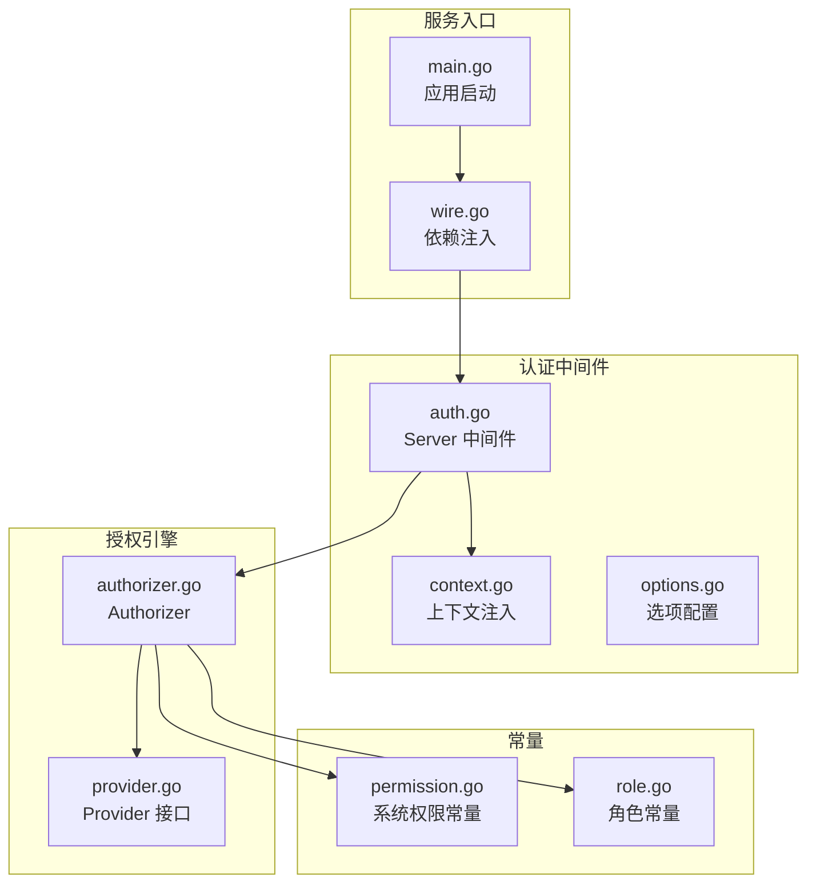
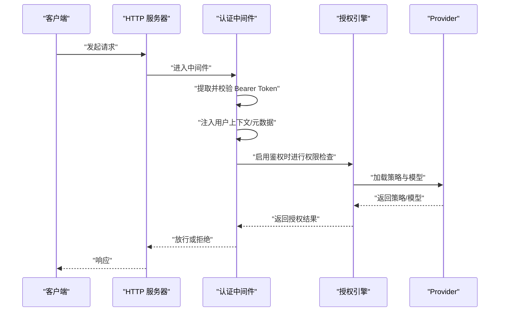
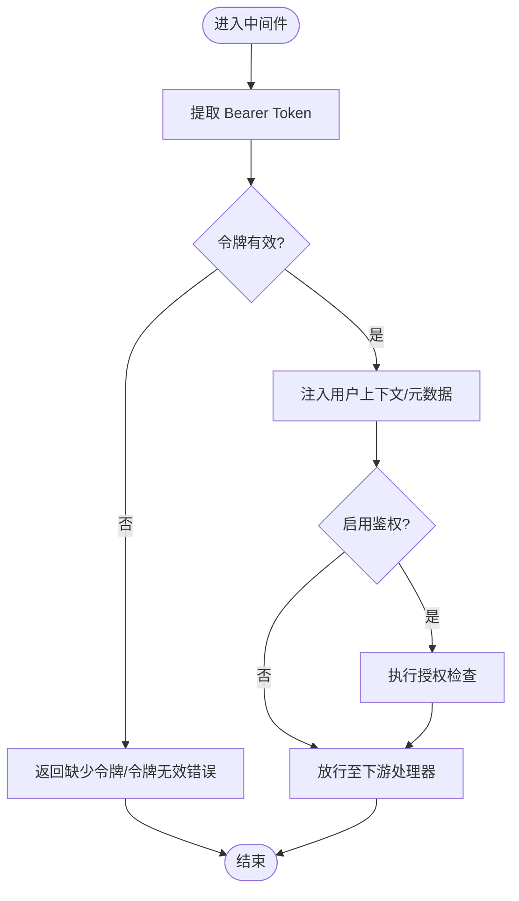
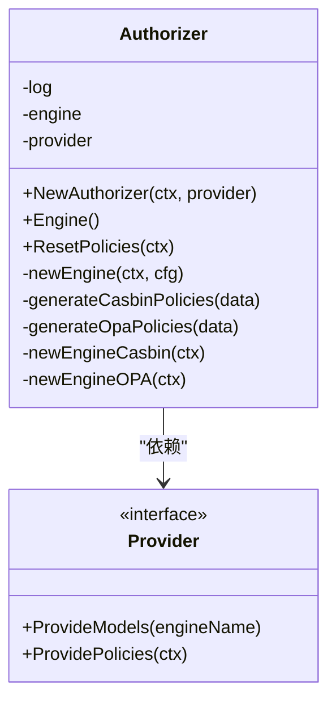
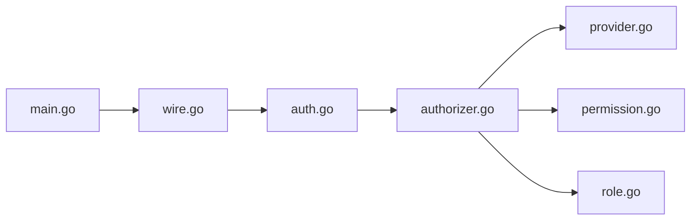

# 权限配置错误

<cite>
**本文引用的文件**
- [backend/pkg/middleware/auth/auth.go](file://backend/pkg/middleware/auth/auth.go)
- [backend/pkg/middleware/auth/options.go](file://backend/pkg/middleware/auth/options.go)
- [backend/pkg/middleware/auth/context.go](file://backend/pkg/middleware/auth/context.go)
- [backend/pkg/authorizer/authorizer.go](file://backend/pkg/authorizer/authorizer.go)
- [backend/pkg/authorizer/provider.go](file://backend/pkg/authorizer/provider.go)
- [backend/pkg/constants/permission.go](file://backend/pkg/constants/permission.go)
- [backend/pkg/constants/role.go](file://backend/pkg/constants/role.go)
- [backend/app/admin/service/cmd/server/main.go](file://backend/app/admin/service/cmd/server/main.go)
- [backend/app/admin/service/cmd/server/wire.go](file://backend/app/admin/service/cmd/server/wire.go)
</cite>

## 目录
1. [简介](#简介)
2. [项目结构](#项目结构)
3. [核心组件](#核心组件)
4. [架构总览](#架构总览)
5. [详细组件分析](#详细组件分析)
6. [依赖分析](#依赖分析)
7. [性能考虑](#性能考虑)
8. [故障排查指南](#故障排查指南)
9. [结论](#结论)
10. [附录](#附录)

## 简介
本指南聚焦于 GoWind Admin 在权限配置与校验环节常见的“权限验证失败”“角色权限不生效”“接口访问被拒绝”等问题，提供系统化的诊断与修复路径。内容覆盖用户角色分配、权限绑定关系、菜单权限配置、权限缓存清理、权限规则重新加载、RBAC 配置验证、日志分析与调试工具使用，并解释权限继承与冲突处理。

## 项目结构
后端采用 Kratos 微服务框架，权限相关能力由认证中间件与授权引擎共同实现：
- 认证中间件负责从请求中提取并校验访问令牌，注入用户上下文与元数据，并在开启鉴权时进行权限检查。
- 授权引擎支持多种实现（如 Casbin、OPA 等），通过 Provider 提供策略与模型，动态加载策略规则。
- 常量模块定义了系统级权限与角色前缀，确保权限与角色命名规范一致。

图表来源
- [backend/app/admin/service/cmd/server/main.go:1-76](file://backend/app/admin/service/cmd/server/main.go#L1-L76)
- [backend/app/admin/service/cmd/server/wire.go:1-47](file://backend/app/admin/service/cmd/server/wire.go#L1-L47)
- [backend/pkg/middleware/auth/auth.go:1-122](file://backend/pkg/middleware/auth/auth.go#L1-L122)
- [backend/pkg/middleware/auth/context.go:1-26](file://backend/pkg/middleware/auth/context.go#L1-L26)
- [backend/pkg/middleware/auth/options.go:1-146](file://backend/pkg/middleware/auth/options.go#L1-L146)
- [backend/pkg/authorizer/authorizer.go:1-241](file://backend/pkg/authorizer/authorizer.go#L1-L241)
- [backend/pkg/authorizer/provider.go:1-28](file://backend/pkg/authorizer/provider.go#L1-L28)
- [backend/pkg/constants/permission.go:1-39](file://backend/pkg/constants/permission.go#L1-L39)
- [backend/pkg/constants/role.go:1-49](file://backend/pkg/constants/role.go#L1-L49)

章节来源
- [backend/app/admin/service/cmd/server/main.go:1-76](file://backend/app/admin/service/cmd/server/main.go#L1-L76)
- [backend/app/admin/service/cmd/server/wire.go:1-47](file://backend/app/admin/service/cmd/server/wire.go#L1-L47)

## 核心组件
- 认证中间件：负责提取 Bearer Token、校验有效性、注入用户 Viewer 与元数据，并在启用鉴权时调用授权引擎进行权限判断。
- 授权引擎：根据配置选择具体引擎（noop、casbin、opa 等），通过 Provider 提供策略与模型，动态设置策略规则。
- Provider 接口：抽象出策略与模型的数据源，便于从数据库或配置中心加载最新权限数据。
- 常量模块：统一系统权限与角色命名规范，避免因命名不一致导致的权限不生效。

章节来源
- [backend/pkg/middleware/auth/auth.go:1-122](file://backend/pkg/middleware/auth/auth.go#L1-L122)
- [backend/pkg/authorizer/authorizer.go:1-241](file://backend/pkg/authorizer/authorizer.go#L1-L241)
- [backend/pkg/authorizer/provider.go:1-28](file://backend/pkg/authorizer/provider.go#L1-L28)
- [backend/pkg/constants/permission.go:1-39](file://backend/pkg/constants/permission.go#L1-L39)
- [backend/pkg/constants/role.go:1-49](file://backend/pkg/constants/role.go#L1-L49)

## 架构总览
下图展示一次请求从进入服务到完成权限校验的关键流程，包括认证、上下文注入与授权检查。

图表来源
- [backend/pkg/middleware/auth/auth.go:38-121](file://backend/pkg/middleware/auth/auth.go#L38-L121)
- [backend/pkg/authorizer/authorizer.go:50-109](file://backend/pkg/authorizer/authorizer.go#L50-L109)
- [backend/pkg/authorizer/provider.go:20-27](file://backend/pkg/authorizer/provider.go#L20-L27)

## 详细组件分析

### 认证中间件（auth.go）
- 关键职责
  - 从请求元数据中提取 Bearer Token。
  - 调用 AccessTokenChecker 校验令牌有效性与黑名单状态。
  - 注入用户 Viewer（含用户 ID、租户 ID、组织单元 ID、数据范围）与 OperatorMetadata。
  - 在启用鉴权时调用授权检查流程。
- 常见问题定位
  - 缺少传输上下文或缺失 Bearer Token。
  - AccessTokenChecker 未正确配置或返回无效。
  - 注入的用户 Viewer 或元数据字段为空导致后续授权失败。

图表来源
- [backend/pkg/middleware/auth/auth.go:38-121](file://backend/pkg/middleware/auth/auth.go#L38-L121)

章节来源
- [backend/pkg/middleware/auth/auth.go:1-122](file://backend/pkg/middleware/auth/auth.go#L1-L122)
- [backend/pkg/middleware/auth/options.go:62-75](file://backend/pkg/middleware/auth/options.go#L62-L75)
- [backend/pkg/middleware/auth/context.go:15-25](file://backend/pkg/middleware/auth/context.go#L15-L25)

### 授权引擎（authorizer.go）
- 关键职责
  - 根据配置选择授权引擎类型（noop、casbin、opa 等）。
  - 通过 Provider 加载策略与模型，生成对应格式的策略规则。
  - 将策略写入引擎并可选地重新加载策略。
- 常见问题定位
  - 引擎类型配置错误或模型缺失导致初始化失败。
  - 策略生成阶段转换异常或策略为空。
  - 引擎 SetPolicies 失败导致规则未生效。

图表来源
- [backend/pkg/authorizer/authorizer.go:18-241](file://backend/pkg/authorizer/authorizer.go#L18-L241)
- [backend/pkg/authorizer/provider.go:20-27](file://backend/pkg/authorizer/provider.go#L20-L27)

章节来源
- [backend/pkg/authorizer/authorizer.go:1-241](file://backend/pkg/authorizer/authorizer.go#L1-L241)
- [backend/pkg/authorizer/provider.go:1-28](file://backend/pkg/authorizer/provider.go#L1-L28)

### Provider 接口与策略数据结构
- PermissionData/PermissionDataMap：描述角色到 API 权限的映射，包含路径、方法、域等信息。
- Provider 接口：抽象策略与模型提供者，便于扩展数据源。
- 常见问题定位
  - ProvidePolicies 返回空或格式不匹配导致策略生成失败。
  - OPA 模型缺失或加载失败导致授权引擎不可用。

章节来源
- [backend/pkg/authorizer/provider.go:5-27](file://backend/pkg/authorizer/provider.go#L5-L27)

### 常量模块（权限与角色）
- 系统权限前缀与受保护权限代码，确保关键权限命名规范。
- 角色前缀（平台/租户/模板），辅助角色继承与模板化管理。
- 常见问题定位
  - 权限代码不以系统前缀开头或与受保护列表冲突。
  - 角色前缀不匹配导致策略无法正确关联。

章节来源
- [backend/pkg/constants/permission.go:1-39](file://backend/pkg/constants/permission.go#L1-L39)
- [backend/pkg/constants/role.go:1-49](file://backend/pkg/constants/role.go#L1-L49)

## 依赖分析
- 认证中间件依赖授权引擎与 Provider；授权引擎依赖配置与 Provider。
- 服务启动通过 wire 注入依赖，确保中间件与授权引擎正确装配。

图表来源
- [backend/app/admin/service/cmd/server/main.go:46-75](file://backend/app/admin/service/cmd/server/main.go#L46-L75)
- [backend/app/admin/service/cmd/server/wire.go:37-46](file://backend/app/admin/service/cmd/server/wire.go#L37-L46)
- [backend/pkg/middleware/auth/auth.go:1-122](file://backend/pkg/middleware/auth/auth.go#L1-L122)
- [backend/pkg/authorizer/authorizer.go:1-241](file://backend/pkg/authorizer/authorizer.go#L1-L241)
- [backend/pkg/authorizer/provider.go:1-28](file://backend/pkg/authorizer/provider.go#L1-L28)
- [backend/pkg/constants/permission.go:1-39](file://backend/pkg/constants/permission.go#L1-L39)
- [backend/pkg/constants/role.go:1-49](file://backend/pkg/constants/role.go#L1-L49)

章节来源
- [backend/app/admin/service/cmd/server/main.go:1-76](file://backend/app/admin/service/cmd/server/main.go#L1-L76)
- [backend/app/admin/service/cmd/server/wire.go:1-47](file://backend/app/admin/service/cmd/server/wire.go#L1-L47)

## 性能考虑
- 授权引擎初始化与策略加载应在启动阶段完成，避免运行时频繁重载。
- 对于高并发场景，建议使用缓存层减少重复计算；同时注意缓存失效策略与一致性。
- 日志级别应按环境调整，避免在生产环境输出过多调试日志影响性能。

## 故障排查指南

### 一、权限验证失败
- 现象
  - 请求直接被拒绝，返回认证或授权错误。
- 诊断步骤
  - 检查请求头是否携带有效的 Bearer Token。
  - 确认 AccessTokenChecker 已正确配置且返回有效负载。
  - 查看中间件日志，确认是否抛出“缺少令牌/令牌无效/上下文缺失”等错误。
  - 若启用鉴权，确认授权引擎已成功加载策略。
- 修复建议
  - 修正令牌颁发与传递流程，确保令牌有效且未过期。
  - 检查 AccessTokenChecker 实现，确保黑名单校验与有效期校验逻辑正确。
  - 如需临时放行，可在开发环境禁用鉴权选项进行对比测试。

章节来源
- [backend/pkg/middleware/auth/auth.go:46-61](file://backend/pkg/middleware/auth/auth.go#L46-L61)
- [backend/pkg/middleware/auth/options.go:79-138](file://backend/pkg/middleware/auth/options.go#L79-L138)

### 二、角色权限不生效
- 现象
  - 用户拥有某角色，但访问受限。
- 诊断步骤
  - 核对用户角色分配是否正确，角色前缀与命名是否符合规范。
  - 检查策略生成过程，确认角色到 API 的映射是否存在。
  - 确认授权引擎类型与模型是否匹配策略格式。
- 修复建议
  - 使用受保护权限与角色常量，确保命名与前缀一致。
  - 重新加载策略，确保新角色已纳入授权引擎。

章节来源
- [backend/pkg/constants/role.go:1-49](file://backend/pkg/constants/role.go#L1-L49)
- [backend/pkg/authorizer/authorizer.go:111-160](file://backend/pkg/authorizer/authorizer.go#L111-L160)

### 三、接口访问被拒绝
- 现象
  - 特定接口返回拒绝。
- 诊断步骤
  - 确认接口路径、方法与域是否与策略匹配。
  - 检查 Provider 的策略数据是否包含该接口的权限条目。
  - 对比不同角色的策略差异，定位冲突或遗漏。
- 修复建议
  - 在 Provider 层补充缺失的策略条目，或调整策略优先级。
  - 对于 OPA，核对模型是否正确解析策略。

章节来源
- [backend/pkg/authorizer/provider.go:5-27](file://backend/pkg/authorizer/provider.go#L5-L27)
- [backend/pkg/authorizer/authorizer.go:135-160](file://backend/pkg/authorizer/authorizer.go#L135-L160)

### 四、权限缓存清理与规则重新加载
- 操作步骤
  - 调用授权器的策略重载方法，触发从 Provider 获取最新策略并写入引擎。
  - 确认重载日志输出，检查策略数量与引擎类型是否一致。
- 注意事项
  - 重载期间可能短暂影响授权判断，建议在低峰时段执行。
  - 若引擎初始化失败，需先修复模型或配置再尝试重载。

章节来源
- [backend/pkg/authorizer/authorizer.go:62-109](file://backend/pkg/authorizer/authorizer.go#L62-L109)

### 五、RBAC 配置验证
- 检查点
  - 角色前缀与模板角色是否正确，避免继承链断裂。
  - 系统权限前缀与受保护权限代码是否一致。
  - 策略映射是否覆盖所有角色与接口。
- 工具与方法
  - 使用日志输出当前策略数量与引擎类型，核对预期值。
  - 通过最小化用例（单角色+单接口）快速验证 RBAC 生效。

章节来源
- [backend/pkg/constants/permission.go:1-39](file://backend/pkg/constants/permission.go#L1-L39)
- [backend/pkg/constants/role.go:1-49](file://backend/pkg/constants/role.go#L1-L49)
- [backend/pkg/authorizer/authorizer.go:162-183](file://backend/pkg/authorizer/authorizer.go#L162-L183)

### 六、日志分析与调试
- 日志要点
  - 认证中间件：令牌提取、校验、上下文注入、授权检查。
  - 授权引擎：引擎类型、策略生成、模型加载、策略设置。
- 调试建议
  - 开启中间件与授权引擎的日志，定位错误发生的具体阶段。
  - 使用最小化请求复现问题，逐步缩小范围。

章节来源
- [backend/pkg/middleware/auth/auth.go:24-36](file://backend/pkg/middleware/auth/auth.go#L24-L36)
- [backend/pkg/authorizer/authorizer.go:30-47](file://backend/pkg/authorizer/authorizer.go#L30-L47)

### 七、权限继承与冲突处理
- 继承链
  - 模板角色到实际角色的映射，确保策略继承链完整。
- 冲突处理
  - 当多个角色赋予同一接口权限时，依据引擎规则确定优先级。
  - 建议统一角色命名与策略粒度，减少歧义。

章节来源
- [backend/pkg/constants/role.go:43-48](file://backend/pkg/constants/role.go#L43-L48)
- [backend/pkg/authorizer/authorizer.go:111-160](file://backend/pkg/authorizer/authorizer.go#L111-L160)

## 结论
权限问题通常源于“令牌校验失败”“策略未加载/不匹配”“角色命名不规范”等几个关键环节。通过规范命名、完善策略数据、正确配置授权引擎与中间件，并结合日志与最小化用例进行调试，可高效定位并修复权限配置错误。对于复杂场景，建议在低峰时段执行策略重载，并建立变更后的回归验证流程。

## 附录
- 服务启动与依赖注入
  - 应用通过引导上下文与 wire 组合依赖，确保中间件与授权引擎正确装配。
- 常用检查清单
  - 令牌是否有效且未过期。
  - Provider 是否返回非空策略数据。
  - 授权引擎类型与模型是否匹配。
  - 角色与权限命名是否符合常量规范。
  - 是否执行了策略重载并观察日志输出。

章节来源
- [backend/app/admin/service/cmd/server/main.go:59-75](file://backend/app/admin/service/cmd/server/main.go#L59-L75)
- [backend/app/admin/service/cmd/server/wire.go:37-46](file://backend/app/admin/service/cmd/server/wire.go#L37-L46)