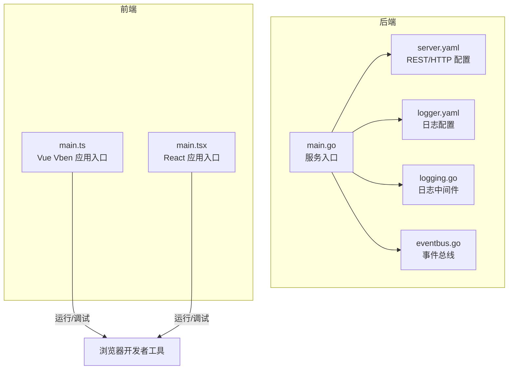
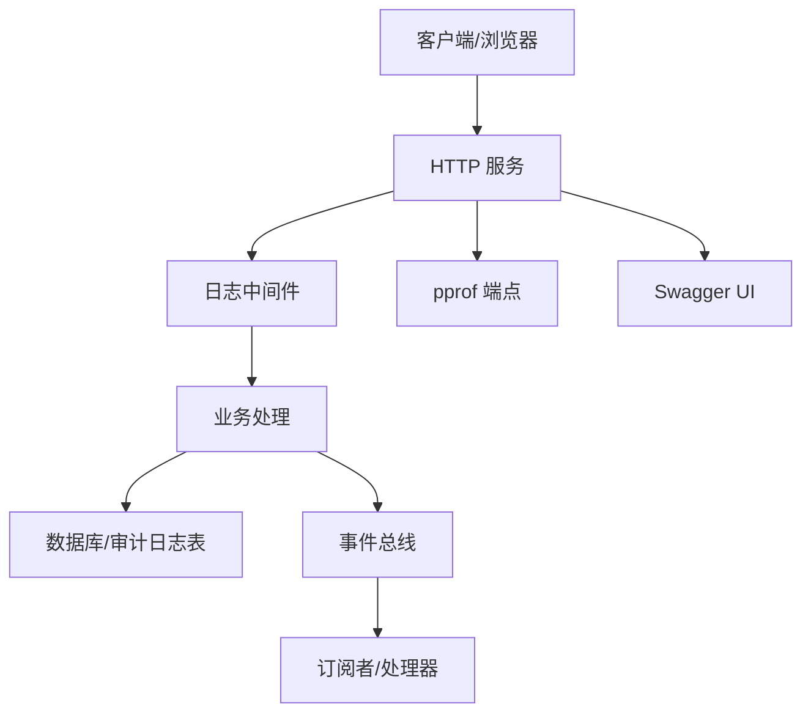
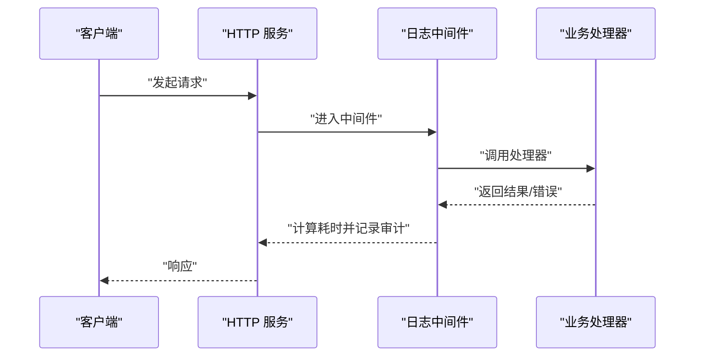
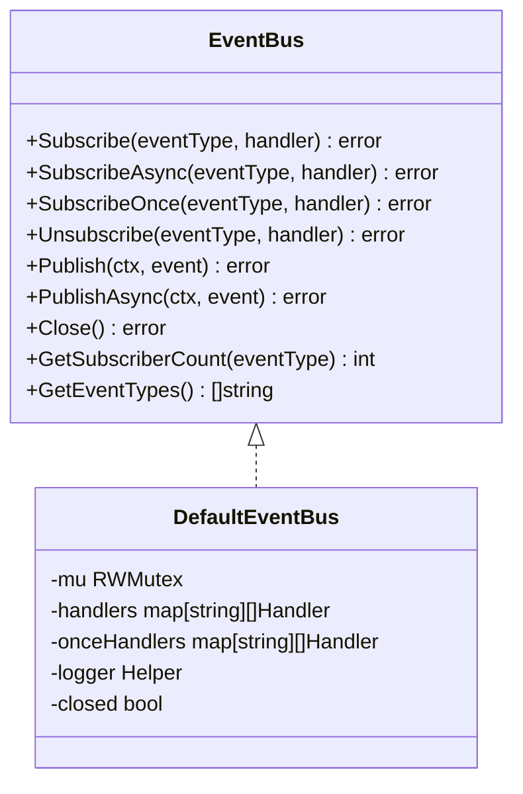
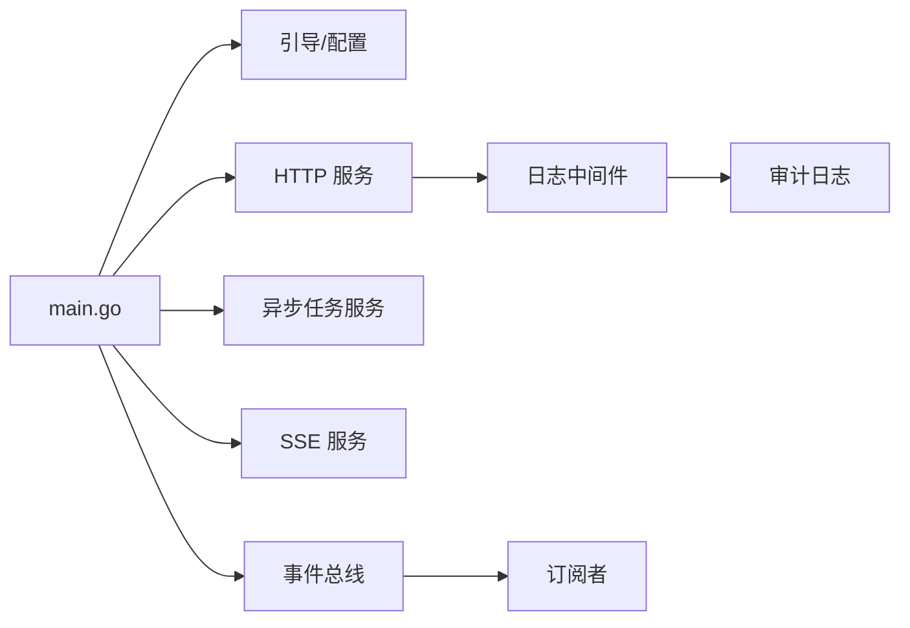

# 调试工具使用

<cite>
**本文引用的文件**
- [main.go](file://backend/app/admin/service/cmd/server/main.go)
- [server.yaml](file://backend/app/admin/service/configs/server.yaml)
- [logger.yaml](file://backend/app/admin/service/configs/logger.yaml)
- [logging.go](file://backend/pkg/middleware/logging/logging.go)
- [options.go](file://backend/pkg/middleware/logging/options.go)
- [eventbus.go](file://backend/pkg/eventbus/eventbus.go)
- [main.ts](file://frontend/admin/vue-vben/apps/admin/src/main.ts)
- [main.tsx](file://frontend/admin/react/src/main.tsx)
</cite>

## 目录
1. [简介](#简介)
2. [项目结构](#项目结构)
3. [核心组件](#核心组件)
4. [架构总览](#架构总览)
5. [详细组件分析](#详细组件分析)
6. [依赖分析](#依赖分析)
7. [性能考虑](#性能考虑)
8. [故障排查指南](#故障排查指南)
9. [结论](#结论)
10. [附录](#附录)

## 简介
本指南面向 GoWind Admin 的后端与前端开发者，系统性讲解如何使用与配置各类调试工具，覆盖日志分析、性能分析、内存泄漏检测、网络问题排查、断点调试、调用链路分析、单元与集成测试等。文档同时给出配置要点、操作步骤与注意事项，帮助快速定位与解决问题。

## 项目结构
- 后端采用 Kratos 框架，入口位于服务命令行目录；配置集中在 configs 目录；中间件与事件总线位于 pkg 目录。
- 前端提供 Vue Vben 与 React 两套实现，分别在各自 apps 目录下启动，均支持开发期调试工具。

图表来源
- [main.go:1-76](file://backend/app/admin/service/cmd/server/main.go#L1-L76)
- [server.yaml:1-49](file://backend/app/admin/service/configs/server.yaml#L1-L49)
- [logger.yaml:1-32](file://backend/app/admin/service/configs/logger.yaml#L1-L32)
- [logging.go:1-52](file://backend/pkg/middleware/logging/logging.go#L1-L52)
- [eventbus.go:1-214](file://backend/pkg/eventbus/eventbus.go#L1-L214)
- [main.ts:1-32](file://frontend/admin/vue-vben/apps/admin/src/main.ts#L1-L32)
- [main.tsx:1-46](file://frontend/admin/react/src/main.tsx#L1-L46)

章节来源
- [main.go:1-76](file://backend/app/admin/service/cmd/server/main.go#L1-L76)
- [server.yaml:1-49](file://backend/app/admin/service/configs/server.yaml#L1-L49)
- [logger.yaml:1-32](file://backend/app/admin/service/configs/logger.yaml#L1-L32)
- [logging.go:1-52](file://backend/pkg/middleware/logging/logging.go#L1-L52)
- [eventbus.go:1-214](file://backend/pkg/eventbus/eventbus.go#L1-L214)
- [main.ts:1-32](file://frontend/admin/vue-vben/apps/admin/src/main.ts#L1-L32)
- [main.tsx:1-46](file://frontend/admin/react/src/main.tsx#L1-L46)

## 核心组件
- 服务入口与运行：后端通过统一入口启动，内置 HTTP、异步任务与 SSE 服务，并通过配置开关启用 pprof 与 Swagger。
- 日志中间件：对登录与 API 访问进行审计记录，统计耗时并写入审计日志。
- 日志配置：支持标准输出、文件、zap、logrus、阿里云、腾讯云等多种日志后端。
- 事件总线：提供同步/异步订阅发布能力，便于扩展审计、监控与可观测性。

章节来源
- [main.go:46-76](file://backend/app/admin/service/cmd/server/main.go#L46-L76)
- [logging.go:14-52](file://backend/pkg/middleware/logging/logging.go#L14-L52)
- [logger.yaml:1-32](file://backend/app/admin/service/configs/logger.yaml#L1-L32)
- [eventbus.go:12-34](file://backend/pkg/eventbus/eventbus.go#L12-L34)

## 架构总览
后端基于 Kratos 框架，REST 服务默认监听端口可配置，pprof 与 Swagger 可按需开启；日志中间件在请求处理前后记录关键指标；事件总线提供跨模块解耦的发布订阅机制。

图表来源
- [server.yaml:2-6](file://backend/app/admin/service/configs/server.yaml#L2-L6)
- [logging.go:31-50](file://backend/pkg/middleware/logging/logging.go#L31-L50)
- [eventbus.go:106-152](file://backend/pkg/eventbus/eventbus.go#L106-L152)

## 详细组件分析

### 后端调试工具配置与使用

#### pprof 性能分析
- 开关与端点：REST 配置中启用 pprof，访问路径由框架默认提供。
- 使用建议：
  - 在本地或测试环境开启，避免在生产高负载时频繁采样。
  - 结合火焰图工具生成热点函数，优先优化热点路径与慢查询。
  - 定期对比基线，观察回归。

章节来源
- [server.yaml:6](file://backend/app/admin/service/configs/server.yaml#L6)

#### Swagger 接口文档与调试
- 开关与端点：REST 配置中启用 Swagger，便于查看接口定义与在线调试。
- 使用建议：
  - 在开发阶段使用，确保接口参数与返回体完整标注。
  - 对比线上版本，避免文档与实现不一致。

章节来源
- [server.yaml:5](file://backend/app/admin/service/configs/server.yaml#L5)

#### 日志中间件与审计
- 中间件职责：统计耗时、记录登录/登出、记录 API 访问与错误信息。
- 关键指标：请求耗时（毫秒）、TraceID/SpanID、状态码、原因、请求头/体摘要等。
- 使用建议：
  - 将关键路径打点，结合 TraceID 追踪调用链。
  - 对高频慢接口进行专项分析，定位瓶颈。

图表来源
- [logging.go:31-50](file://backend/pkg/middleware/logging/logging.go#L31-L50)

章节来源
- [logging.go:14-52](file://backend/pkg/middleware/logging/logging.go#L14-L52)
- [options.go:10-61](file://backend/pkg/middleware/logging/options.go#L10-L61)

#### 日志配置与输出
- 支持多种日志后端：标准输出、文件、zap、logrus、阿里云、腾讯云。
- 建议：
  - 开发环境使用 zap/logrus 提升可读性；生产环境结合集中化日志平台。
  - 文件日志注意轮转策略与磁盘占用。

章节来源
- [logger.yaml:1-32](file://backend/app/admin/service/configs/logger.yaml#L1-L32)

#### 事件总线与可观测性
- 功能：同步/异步订阅、一次性订阅、关闭清理、订阅者统计。
- 建议：
  - 将审计、告警、埋点等作为事件发布，降低模块耦合。
  - 异步发布避免阻塞主流程，注意超时与重试策略。

图表来源
- [eventbus.go:12-34](file://backend/pkg/eventbus/eventbus.go#L12-L34)
- [eventbus.go:36-52](file://backend/pkg/eventbus/eventbus.go#L36-L52)

章节来源
- [eventbus.go:54-152](file://backend/pkg/eventbus/eventbus.go#L54-L152)
- [eventbus.go:154-184](file://backend/pkg/eventbus/eventbus.go#L154-L184)

### 前端调试技巧

#### 浏览器开发者工具
- 网络面板：查看请求/响应、耗时、状态码、请求头与 Cookie。
- 控制台：过滤错误与警告，结合源码映射定位问题。
- 性能面板：录制页面交互，分析主线程占用与重绘。

#### API 请求调试
- 使用浏览器 Network 面板抓包，核对鉴权头、请求体与响应体。
- 对比 Swagger 文档与实际返回，确认字段一致性。

#### 组件状态检查
- Vue Vben：利用组件树与状态面板，观察 props、data、computed 与 watch 的变化。
- React：利用 React DevTools，检查组件树、Hooks 状态与渲染次数。

章节来源
- [main.ts:1-32](file://frontend/admin/vue-vben/apps/admin/src/main.ts#L1-L32)
- [main.tsx:1-46](file://frontend/admin/react/src/main.tsx#L1-L46)

#### React Query 调试
- React Query Devtools：仅在开发环境启用，可查看缓存状态、查询状态与重试次数。
- 建议：
  - 在开发阶段打开，生产构建自动摇树移除。
  - 利用 Devtools 观察缓存命中率与失效策略。

章节来源
- [main.tsx:7-10](file://frontend/admin/react/src/main.tsx#L7-L10)
- [main.tsx:41](file://frontend/admin/react/src/main.tsx#L41)

### 断点调试与调用链路分析

#### 后端断点调试
- IDE 断点：在关键业务入口、中间件、数据层设置断点，逐步执行。
- 调用链路：结合日志中的 TraceID/SpanID 串联请求到数据库与外部服务的调用链。
- 建议：
  - 在日志中间件处设置断点，验证耗时统计与审计字段是否正确。
  - 对慢查询与异常错误路径重点断点。

章节来源
- [logging.go:31-50](file://backend/pkg/middleware/logging/logging.go#L31-L50)

#### 前端断点调试
- 在路由守卫、请求拦截器、Store/状态管理处设置断点。
- 结合浏览器 Network 面板与控制台，验证请求参数与响应数据流。

章节来源
- [main.tsx:12-14](file://frontend/admin/react/src/main.tsx#L12-L14)
- [main.ts:16-25](file://frontend/admin/vue-vben/apps/admin/src/main.ts#L16-L25)

### 单元测试与集成测试

#### 后端测试
- 单元测试：针对函数与小模块编写测试，使用表驱动测试覆盖边界条件。
- 集成测试：启动最小化服务，验证中间件、路由与数据层协作。
- 建议：
  - 使用 pprof 与基准测试（Benchmark）识别性能瓶颈。
  - 对日志中间件与事件总线编写行为测试，确保审计与可观测性。

#### 前端测试
- 单元测试：组件与工具函数测试，使用快照与渲染断言。
- 集成测试：端到端验证用户流程，结合 Mock API 与真实后端。
- 建议：
  - 在开发环境启用 React Query Devtools，辅助调试缓存与状态。

章节来源
- [main.tsx:7-10](file://frontend/admin/react/src/main.tsx#L7-L10)

## 依赖分析
- 服务入口依赖配置与引导库，统一启动 HTTP、异步任务与 SSE 服务。
- 日志中间件依赖传输层上下文，提取 HTTP 传输信息并写入审计。
- 事件总线独立于业务，提供跨模块解耦的发布订阅能力。

图表来源
- [main.go:46-76](file://backend/app/admin/service/cmd/server/main.go#L46-L76)
- [logging.go:31-50](file://backend/pkg/middleware/logging/logging.go#L31-L50)
- [eventbus.go:106-152](file://backend/pkg/eventbus/eventbus.go#L106-L152)

章节来源
- [main.go:46-76](file://backend/app/admin/service/cmd/server/main.go#L46-L76)
- [logging.go:14-52](file://backend/pkg/middleware/logging/logging.go#L14-L52)
- [eventbus.go:12-34](file://backend/pkg/eventbus/eventbus.go#L12-L34)

## 性能考虑
- pprof：在非生产高负载时段采样，关注 CPU、内存分配与阻塞热点。
- 日志：避免在热路径打印大对象，必要时使用结构化日志与采样。
- 缓存：前端合理使用缓存与去重策略，减少重复请求。
- 数据库：结合审计日志中的耗时与影响行数，定位慢查询与锁等待。

## 故障排查指南

### 后端常见问题
- 无法访问 pprof/Swagger
  - 检查 REST 配置中的开关与端口。
  - 确认 CORS 配置允许浏览器访问。
- 日志为空或格式异常
  - 检查日志类型与后端配置，确认文件权限与路径。
- 审计日志缺失
  - 确认中间件已启用，且写入函数正常工作。
- 事件总线无回调
  - 检查订阅是否成功，事件类型是否匹配，总线是否被提前关闭。

章节来源
- [server.yaml:2-28](file://backend/app/admin/service/configs/server.yaml#L2-L28)
- [logger.yaml:1-32](file://backend/app/admin/service/configs/logger.yaml#L1-L32)
- [logging.go:14-52](file://backend/pkg/middleware/logging/logging.go#L14-L52)
- [eventbus.go:54-104](file://backend/pkg/eventbus/eventbus.go#L54-L104)

### 前端常见问题
- 请求失败或鉴权失败
  - 检查请求拦截器与 Token 设置，核对响应状态与错误信息。
- 页面空白或白屏
  - 查看控制台错误，确认资源加载与初始化流程。
- 缓存异常
  - 使用 React Query Devtools 检查缓存状态与失效策略。

章节来源
- [main.tsx:12-14](file://frontend/admin/react/src/main.tsx#L12-L14)
- [main.ts:16-25](file://frontend/admin/vue-vben/apps/admin/src/main.ts#L16-L25)

## 结论
通过合理的配置与工具组合，可以高效地完成从日志分析、性能优化到网络与前端调试的全链路问题排查。建议在开发与测试环境充分启用 pprof、Swagger、日志中间件与事件总线，在生产环境保持最小化可观测性与安全开关。

## 附录

### 快速操作清单
- 后端
  - 启用 pprof 与 Swagger：检查 REST 配置开关。
  - 配置日志后端：选择适合的输出方式并设置级别。
  - 核查审计字段：确认登录/登出与 API 访问记录是否完整。
  - 事件总线：验证订阅与发布流程。
- 前端
  - 打开浏览器开发者工具，核对网络与控制台。
  - React 环境启用 React Query Devtools，观察缓存与状态。
  - 使用 Vue/React DevTools 检查组件状态与渲染。