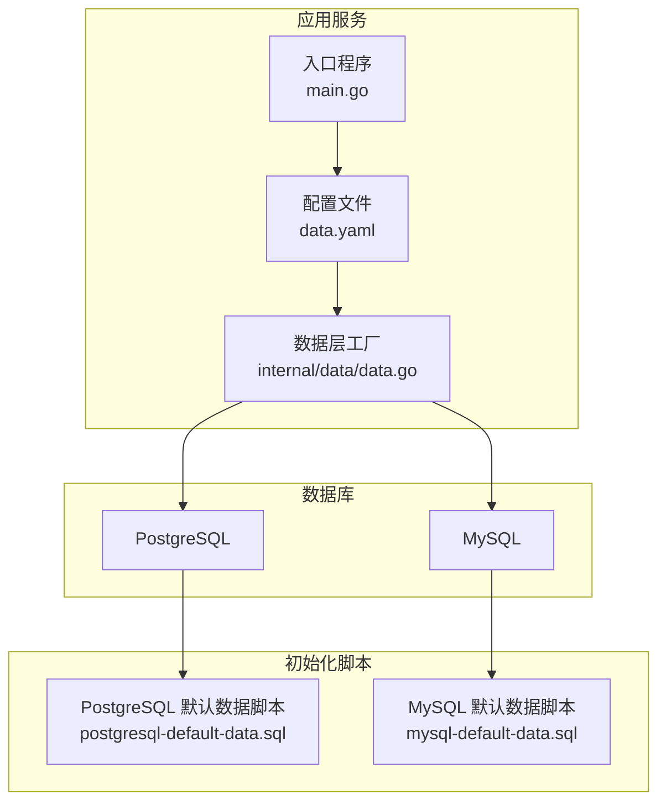
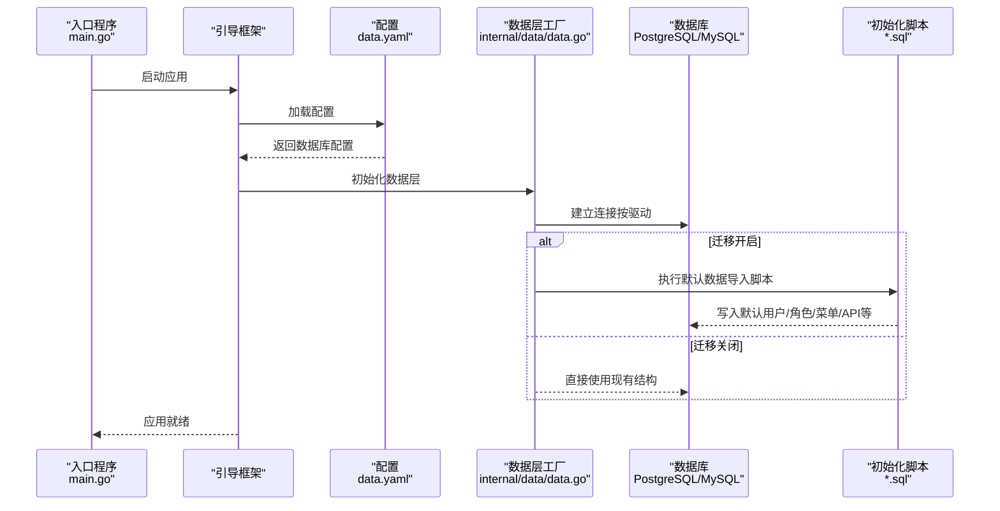
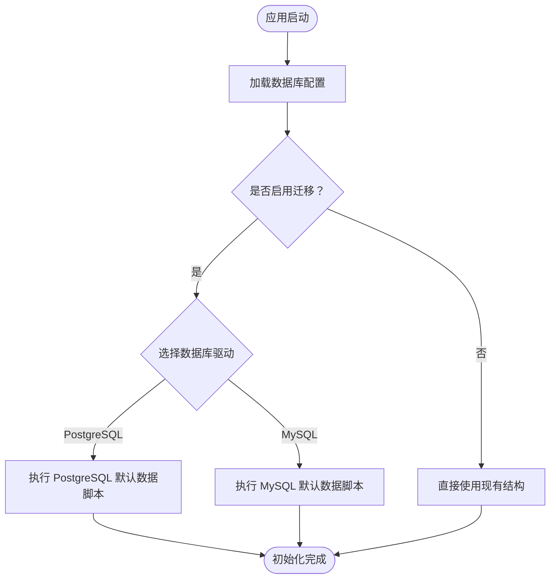
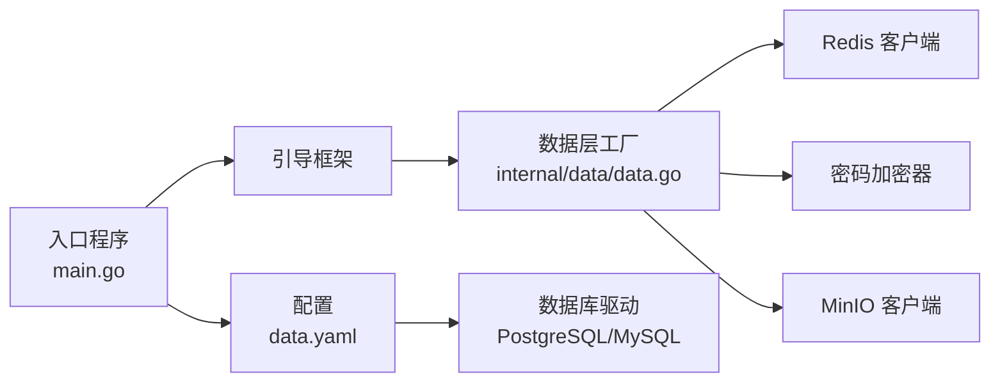

# 数据库架构

<cite>
**本文引用的文件**
- [backend/app/admin/service/cmd/server/main.go](file://backend/app/admin/service/cmd/server/main.go)
- [backend/app/admin/service/configs/data.yaml](file://backend/app/admin/service/configs/data.yaml)
- [backend/app/admin/service/internal/data/data.go](file://backend/app/admin/service/internal/data/data.go)
- [backend/sql/postgresql-default-data.sql](file://backend/sql/postgresql-default-data.sql)
- [backend/sql/mysql-default-data.sql](file://backend/sql/mysql-default-data.sql)
</cite>

## 目录
1. [简介](#简介)
2. [项目结构](#项目结构)
3. [核心组件](#核心组件)
4. [架构总览](#架构总览)
5. [详细组件分析](#详细组件分析)
6. [依赖分析](#依赖分析)
7. [性能考虑](#性能考虑)
8. [故障排查指南](#故障排查指南)
9. [结论](#结论)
10. [附录](#附录)

## 简介
本文件系统化梳理 GoWind Admin 的数据库架构与实现，覆盖 PostgreSQL 与 MySQL 双数据库支持、连接配置与连接池管理、事务处理机制、数据库初始化流程（含默认数据导入、表结构与索引）、版本管理策略（迁移脚本与自动化升级）、性能调优建议以及监控与维护最佳实践。内容面向技术与非技术读者，力求循序渐进、可操作性强。

## 项目结构
后端服务通过统一的引导框架启动，数据库配置位于应用配置中，Redis 作为缓存与会话辅助存储。数据库初始化脚本分别提供 PostgreSQL 与 MySQL 版本的默认数据导入脚本。

**图表来源**
- [backend/app/admin/service/cmd/server/main.go:1-76](file://backend/app/admin/service/cmd/server/main.go#L1-L76)
- [backend/app/admin/service/configs/data.yaml:1-21](file://backend/app/admin/service/configs/data.yaml#L1-L21)
- [backend/app/admin/service/internal/data/data.go:1-63](file://backend/app/admin/service/internal/data/data.go#L1-L63)
- [backend/sql/postgresql-default-data.sql:1-3](file://backend/sql/postgresql-default-data.sql#L1-L3)
- [backend/sql/mysql-default-data.sql:1-12](file://backend/sql/mysql-default-data.sql#L1-L12)

**章节来源**
- [backend/app/admin/service/cmd/server/main.go:1-76](file://backend/app/admin/service/cmd/server/main.go#L1-L76)
- [backend/app/admin/service/configs/data.yaml:1-21](file://backend/app/admin/service/configs/data.yaml#L1-L21)
- [backend/app/admin/service/internal/data/data.go:1-63](file://backend/app/admin/service/internal/data/data.go#L1-L63)
- [backend/sql/postgresql-default-data.sql:1-3](file://backend/sql/postgresql-default-data.sql#L1-L3)
- [backend/sql/mysql-default-data.sql:1-12](file://backend/sql/mysql-default-data.sql#L1-L12)

## 核心组件
- 应用入口与引导：应用通过引导框架启动，负责加载配置、初始化服务与中间件。
- 数据库配置：集中于 data.yaml，定义驱动类型、连接字符串、迁移开关、调试与追踪开关、连接池参数等。
- 数据层工厂：提供 Redis 客户端、密码加密器、验证码生成器等基础设施能力。
- 初始化脚本：提供 PostgreSQL 与 MySQL 的默认数据导入脚本，用于首次部署或重置环境。

**章节来源**
- [backend/app/admin/service/cmd/server/main.go:1-76](file://backend/app/admin/service/cmd/server/main.go#L1-L76)
- [backend/app/admin/service/configs/data.yaml:1-21](file://backend/app/admin/service/configs/data.yaml#L1-L21)
- [backend/app/admin/service/internal/data/data.go:1-63](file://backend/app/admin/service/internal/data/data.go#L1-L63)

## 架构总览
下图展示数据库相关组件的交互关系：应用启动时读取配置，根据驱动选择 PostgreSQL 或 MySQL；初始化阶段按需执行迁移与默认数据导入；运行期通过连接池访问数据库，配合 Redis 提升性能与用户体验。

**图表来源**
- [backend/app/admin/service/cmd/server/main.go:1-76](file://backend/app/admin/service/cmd/server/main.go#L1-L76)
- [backend/app/admin/service/configs/data.yaml:1-21](file://backend/app/admin/service/configs/data.yaml#L1-L21)
- [backend/app/admin/service/internal/data/data.go:1-63](file://backend/app/admin/service/internal/data/data.go#L1-L63)
- [backend/sql/postgresql-default-data.sql:1-3](file://backend/sql/postgresql-default-data.sql#L1-L3)
- [backend/sql/mysql-default-data.sql:1-12](file://backend/sql/mysql-default-data.sql#L1-L12)

## 详细组件分析

### 数据库驱动与连接配置
- 驱动选择：配置项明确指定数据库驱动为 PostgreSQL；MySQL 配置示例被注释保留以便切换。
- 连接字符串：包含主机、端口、用户名、密码、数据库名与 SSL 模式等关键参数。
- 迁移控制：migrate 字段用于启用/禁用自动迁移与默认数据导入。
- 调试与可观测性：debug、enable_trace、enable_metrics 控制日志与追踪输出。
- 连接池参数：max_idle_connections、max_open_connections、connection_max_lifetime 控制连接池规模与生命周期。

**章节来源**
- [backend/app/admin/service/configs/data.yaml:1-21](file://backend/app/admin/service/configs/data.yaml#L1-L21)

### 连接池管理与事务处理
- 连接池参数说明
  - 最大空闲连接数：限制空闲连接数量，避免资源浪费。
  - 最大打开连接数：限制并发连接上限，防止数据库过载。
  - 连接最大生命周期：定期回收旧连接，降低长连接带来的稳定性风险。
- 事务处理
  - 初始化脚本中显式使用事务以保证默认数据导入的原子性。
  - MySQL 脚本通过事务包裹多条写入，确保失败回滚。
  - PostgreSQL 脚本注释强调需在表结构存在后再执行，避免依赖缺失导致失败。

**章节来源**
- [backend/app/admin/service/configs/data.yaml:1-21](file://backend/app/admin/service/configs/data.yaml#L1-L21)
- [backend/sql/postgresql-default-data.sql:1-3](file://backend/sql/postgresql-default-data.sql#L1-L3)
- [backend/sql/mysql-default-data.sql:1-12](file://backend/sql/mysql-default-data.sql#L1-L12)

### 数据库初始化流程
- 初始化时机：由引导框架在应用启动时根据配置决定是否执行迁移与默认数据导入。
- 默认数据导入：分别提供 PostgreSQL 与 MySQL 的默认数据脚本，涵盖默认用户、角色、菜单与 API 资源等。
- 备份提示：脚本注释强调执行前应备份数据，避免误操作造成损失。
- 外键与兼容性：MySQL 脚本通过临时关闭外键检查与事务包裹，提升导入效率与一致性。

**图表来源**
- [backend/app/admin/service/configs/data.yaml:1-21](file://backend/app/admin/service/configs/data.yaml#L1-L21)
- [backend/sql/postgresql-default-data.sql:1-3](file://backend/sql/postgresql-default-data.sql#L1-L3)
- [backend/sql/mysql-default-data.sql:1-12](file://backend/sql/mysql-default-data.sql#L1-L12)

**章节来源**
- [backend/app/admin/service/configs/data.yaml:1-21](file://backend/app/admin/service/configs/data.yaml#L1-L21)
- [backend/sql/postgresql-default-data.sql:1-3](file://backend/sql/postgresql-default-data.sql#L1-L3)
- [backend/sql/mysql-default-data.sql:1-12](file://backend/sql/mysql-default-data.sql#L1-L12)

### 数据层工厂与外部依赖
- Redis 客户端：通过数据层工厂创建并返回 Redis 客户端实例，便于验证码、会话等场景使用。
- 密码加密：提供密码加密器工厂，用于安全存储与校验用户凭据。
- MinIO 客户端：提供对象存储客户端，用于文件上传与访问。

**章节来源**
- [backend/app/admin/service/internal/data/data.go:1-63](file://backend/app/admin/service/internal/data/data.go#L1-L63)

## 依赖分析
- 组件耦合
  - 入口程序仅负责启动与配置加载，不直接操作数据库，耦合度低、职责清晰。
  - 数据层工厂集中管理外部依赖（Redis、MinIO、密码加密），便于替换与测试。
- 外部依赖
  - 数据库驱动：PostgreSQL 与 MySQL 双栈支持，通过配置切换。
  - 缓存：Redis 用于验证码与会话等高并发场景。
  - 对象存储：MinIO 用于文件存储与分发。

**图表来源**
- [backend/app/admin/service/cmd/server/main.go:1-76](file://backend/app/admin/service/cmd/server/main.go#L1-L76)
- [backend/app/admin/service/configs/data.yaml:1-21](file://backend/app/admin/service/configs/data.yaml#L1-L21)
- [backend/app/admin/service/internal/data/data.go:1-63](file://backend/app/admin/service/internal/data/data.go#L1-L63)

**章节来源**
- [backend/app/admin/service/cmd/server/main.go:1-76](file://backend/app/admin/service/cmd/server/main.go#L1-L76)
- [backend/app/admin/service/configs/data.yaml:1-21](file://backend/app/admin/service/configs/data.yaml#L1-L21)
- [backend/app/admin/service/internal/data/data.go:1-63](file://backend/app/admin/service/internal/data/data.go#L1-L63)

## 性能考虑
- 连接池调优
  - 根据业务并发量调整最大打开连接数与最大空闲连接数，避免连接不足或过度占用。
  - 设置合理的连接最大生命周期，平衡资源回收与连接复用。
- 查询优化
  - 为高频查询字段建立合适索引，避免全表扫描。
  - 使用 EXPLAIN 分析慢查询，识别瓶颈并针对性优化。
- 事务与锁
  - 将批量写入放入单个事务，减少锁竞争与日志开销。
  - 避免长事务，缩短事务持续时间，降低锁持有时间。
- 缓存策略
  - 利用 Redis 存储热点数据与会话信息，降低数据库压力。
  - 合理设置缓存过期时间，避免脏数据与内存浪费。
- 分区与归档
  - 对历史数据进行分区或归档，保持热数据表较小，提升查询性能。

## 故障排查指南
- 连接失败
  - 检查数据库连接字符串中的主机、端口、用户名、密码与数据库名是否正确。
  - 确认网络连通性与防火墙策略，确保容器间或主机间可达。
- 迁移失败
  - 查看迁移开关与驱动配置，确认当前启用的数据库类型。
  - 检查初始化脚本的依赖顺序与语法，确保表结构先于数据导入。
- 性能问题
  - 使用数据库自带的性能分析工具定位慢查询与高负载时段。
  - 结合连接池参数与缓存命中率评估系统瓶颈。
- 数据一致性
  - 在导入默认数据时遵循事务包裹，确保失败回滚。
  - 对涉及外键约束的操作，注意临时关闭外键检查的适用范围与风险。

**章节来源**
- [backend/app/admin/service/configs/data.yaml:1-21](file://backend/app/admin/service/configs/data.yaml#L1-L21)
- [backend/sql/postgresql-default-data.sql:1-3](file://backend/sql/postgresql-default-data.sql#L1-L3)
- [backend/sql/mysql-default-data.sql:1-12](file://backend/sql/mysql-default-data.sql#L1-L12)

## 结论
GoWind Admin 的数据库架构采用“配置驱动 + 引导框架”的模式，实现了 PostgreSQL 与 MySQL 的双栈支持与统一的初始化流程。通过合理的连接池参数、事务包裹与缓存策略，系统在可用性与性能之间取得平衡。建议在生产环境中结合监控指标与定期演练，完善备份与故障恢复流程，持续优化索引与查询计划，保障系统的长期稳定运行。

## 附录
- 初始化脚本说明
  - PostgreSQL 默认数据脚本：提供默认用户、角色、菜单与 API 资源的初始化逻辑，强调需在表结构存在后执行。
  - MySQL 默认数据脚本：提供事务包裹与外键检查控制，确保导入过程的原子性与一致性。
- 配置项速览
  - 驱动与连接串：driver、source
  - 迁移与调试：migrate、debug、enable_trace、enable_metrics
  - 连接池：max_idle_connections、max_open_connections、connection_max_lifetime

**章节来源**
- [backend/sql/postgresql-default-data.sql:1-3](file://backend/sql/postgresql-default-data.sql#L1-L3)
- [backend/sql/mysql-default-data.sql:1-12](file://backend/sql/mysql-default-data.sql#L1-L12)
- [backend/app/admin/service/configs/data.yaml:1-21](file://backend/app/admin/service/configs/data.yaml#L1-L21)