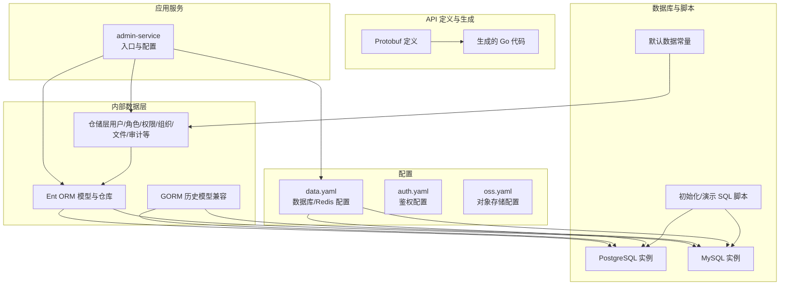
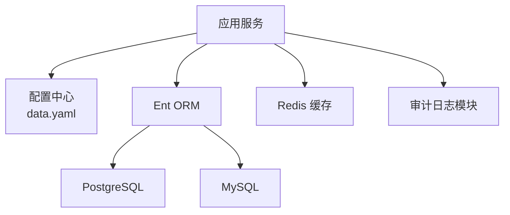
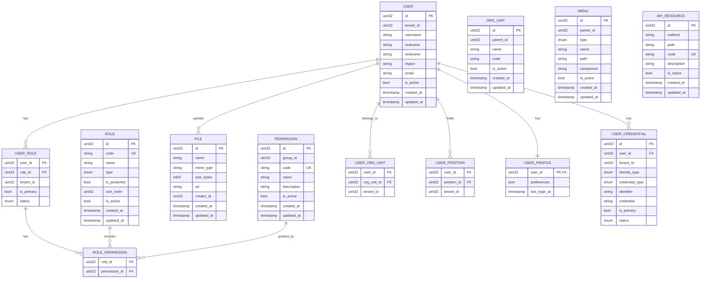
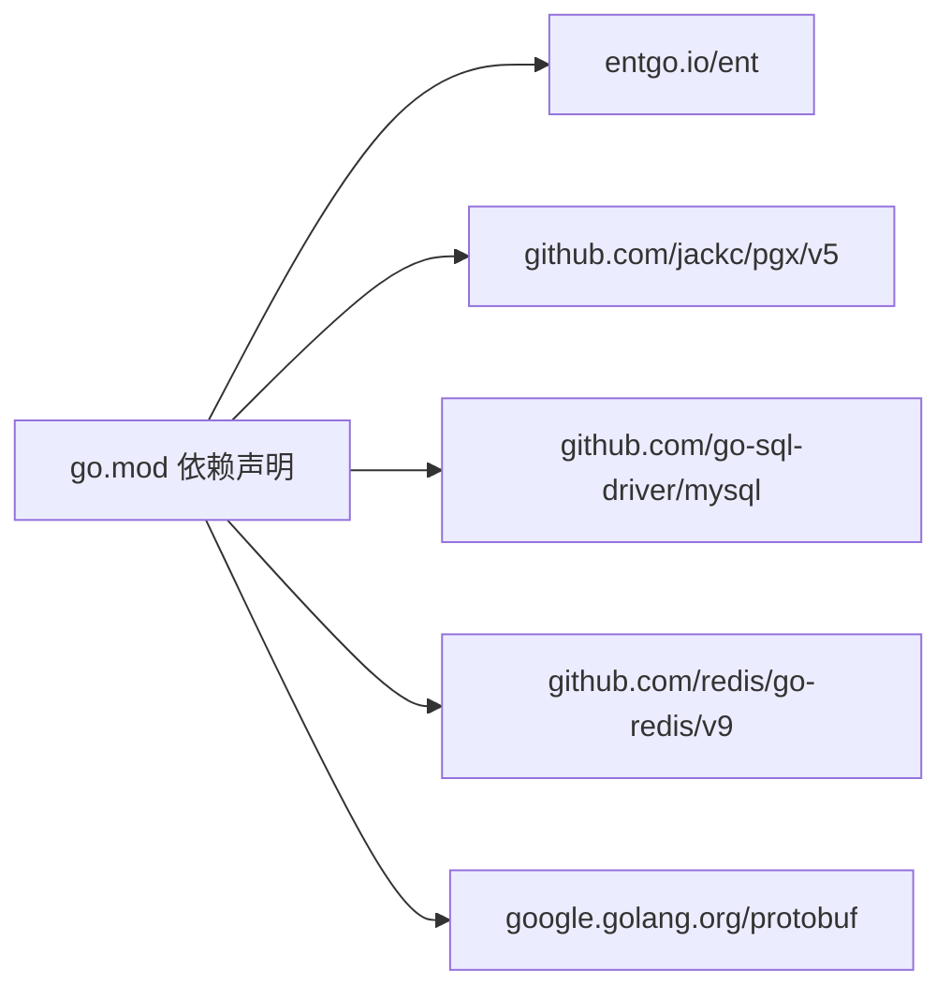

# 数据库设计

<cite>
**本文引用的文件**
- [go.mod](file://backend/go.mod)
- [data.yaml](file://backend/app/admin/service/configs/data.yaml)
- [data.go](file://backend/app/admin/service/internal/data/data.go)
- [default_data.go](file://backend/pkg/constants/default_data.go)
- [mysql-default-data.sql](file://backend/sql/mysql-default-data.sql)
- [postgresql-default-data.sql](file://backend/sql/postgresql-default-data.sql)
- [i_user.pb.go](file://backend/api/gen/go/identity/service/v1/i_user.pb.go)
- [i_role.pb.go](file://backend/api/gen/go/permission/service/v1/i_role.pb.go)
- [i_permission.pb.go](file://backend/api/gen/go/permission/service/v1/i_permission.pb.go)
- [i_org_unit.pb.go](file://backend/api/gen/go/identity/service/v1/i_org_unit.pb.go)
- [i_file.pb.go](file://backend/api/gen/go/storage/service/v1/i_file.pb.go)
- [i_menu.pb.go](file://backend/api/gen/go/resource/service/v1/i_menu.pb.go)
- [i_api.pb.go](file://backend/api/gen/go/resource/service/v1/i_api.pb.go)
- [i_login_audit_log.pb.go](file://backend/api/gen/go/audit/service/v1/i_login_audit_log.pb.go)
- [i_operation_audit_log.pb.go](file://backend/api/gen/go/audit/service/v1/i_operation_audit_log.pb.go)
- [i_data_access_audit_log.pb.go](file://backend/api/gen/go/audit/service/v1/i_data_access_audit_log.pb.go)
- [i_permission_audit_log.pb.go](file://backend/api/gen/go/audit/service/v1/i_permission_audit_log.pb.go)
</cite>

## 目录
1. [简介](#简介)
2. [项目结构](#项目结构)
3. [核心组件](#核心组件)
4. [架构总览](#架构总览)
5. [详细组件分析](#详细组件分析)
6. [依赖分析](#依赖分析)
7. [性能考量](#性能考量)
8. [故障排查指南](#故障排查指南)
9. [结论](#结论)
10. [附录](#附录)

## 简介
本文件面向 GoWind Admin 的数据库设计与实现，聚焦于基于 Ent ORM 的数据模型、表结构与字段、索引与约束、数据访问模式（查询构建器、事务、批量操作）、迁移管理（初始化脚本、版本升级、备份与恢复）、性能优化（查询、索引、缓存）、安全与审计等方面，并提供可操作的最佳实践与示例路径。

## 项目结构
后端采用多模块分层：应用服务、内部数据层、配置、API 定义与生成代码、SQL 脚本与默认数据常量等。数据库访问通过 Ent ORM 连接 PostgreSQL，默认配置中也保留了 MySQL 的注释样例，便于切换。

图表来源
- [data.yaml:1-21](file://backend/app/admin/service/configs/data.yaml#L1-L21)
- [go.mod:6-64](file://backend/go.mod#L6-L64)

章节来源
- [data.yaml:1-21](file://backend/app/admin/service/configs/data.yaml#L1-L21)
- [go.mod:6-64](file://backend/go.mod#L6-L64)

## 核心组件
- 数据库驱动与连接
  - 默认使用 PostgreSQL，驱动名与连接串在配置中定义；同时保留 MySQL 注释样例，便于快速切换。
  - 连接池参数：最大空闲连接、最大打开连接、连接最大生命周期等。
- 缓存与会话
  - Redis 作为缓存与验证码存储，连接参数在配置中定义。
- 密码加密
  - 使用 bcrypt 加密器进行密码处理。
- 对象存储
  - MinIO 客户端封装，用于文件上传与访问。
- 默认数据
  - 提供默认权限组、权限、角色、用户、菜单、语言等常量，用于初始化与演示。

章节来源
- [data.yaml:1-21](file://backend/app/admin/service/configs/data.yaml#L1-L21)
- [data.go:23-62](file://backend/app/admin/service/internal/data/data.go#L23-L62)
- [default_data.go:16-790](file://backend/pkg/constants/default_data.go#L16-L790)

## 架构总览
数据库层通过 Ent ORM 统一抽象，支持 PostgreSQL 与 MySQL 双栈。应用服务读取配置，建立数据库连接与缓存连接，仓储层负责业务数据的增删改查与批量操作，审计日志贯穿登录、操作、数据访问与权限评估等关键流程。

图表来源
- [data.yaml:1-21](file://backend/app/admin/service/configs/data.yaml#L1-L21)
- [go.mod:6-64](file://backend/go.mod#L6-L64)

## 详细组件分析

### 用户、角色、权限、组织与文件实体关系
基于 API 生成的实体定义，可抽象出以下核心实体及其关系：

图表来源
- [i_user.pb.go](file://backend/api/gen/go/identity/service/v1/i_user.pb.go)
- [i_role.pb.go](file://backend/api/gen/go/permission/service/v1/i_role.pb.go)
- [i_permission.pb.go](file://backend/api/gen/go/permission/service/v1/i_permission.pb.go)
- [i_org_unit.pb.go](file://backend/api/gen/go/identity/service/v1/i_org_unit.pb.go)
- [i_file.pb.go](file://backend/api/gen/go/storage/service/v1/i_file.pb.go)
- [i_menu.pb.go](file://backend/api/gen/go/resource/service/v1/i_menu.pb.go)
- [i_api.pb.go](file://backend/api/gen/go/resource/service/v1/i_api.pb.go)

章节来源
- [i_user.pb.go](file://backend/api/gen/go/identity/service/v1/i_user.pb.go)
- [i_role.pb.go](file://backend/api/gen/go/permission/service/v1/i_role.pb.go)
- [i_permission.pb.go](file://backend/api/gen/go/permission/service/v1/i_permission.pb.go)
- [i_org_unit.pb.go](file://backend/api/gen/go/identity/service/v1/i_org_unit.pb.go)
- [i_file.pb.go](file://backend/api/gen/go/storage/service/v1/i_file.pb.go)
- [i_menu.pb.go](file://backend/api/gen/go/resource/service/v1/i_menu.pb.go)
- [i_api.pb.go](file://backend/api/gen/go/resource/service/v1/i_api.pb.go)

### 数据访问模式与事务
- 查询构建器与仓储
  - 仓储层封装对 Ent 模型的读写，提供按主键、索引、范围、联表查询等方法，支持分页与排序。
  - 典型模式：先构建过滤条件，再选择字段，最后执行查询或更新。
- 事务处理
  - 在需要保证一致性（如批量导入、角色-权限绑定）时，使用事务包裹多个写入操作，失败回滚。
- 批量操作
  - 支持批量插入、批量更新、批量删除，减少往返次数，提升吞吐。
- 读写分离与连接池
  - 通过配置设置最大空闲/打开连接数与生命周期，避免连接耗尽与资源泄漏。

章节来源
- [data.yaml:11-13](file://backend/app/admin/service/configs/data.yaml#L11-L13)
- [data.go:23-62](file://backend/app/admin/service/internal/data/data.go#L23-L62)

### 数据迁移管理策略
- 初始化脚本
  - 提供 MySQL 与 PostgreSQL 的默认数据初始化脚本，包含事务包装与外键控制说明，适用于首次部署。
- 版本升级
  - 建议结合数据库迁移工具（如 Atlas 或框架内置迁移）维护 DDL/DML 变更，确保版本演进可追踪。
- 备份与恢复
  - 生产环境必须在执行初始化/升级前进行全量备份；恢复流程应验证数据完整性与索引状态。
- 默认数据常量
  - 通过常量定义默认权限组、权限、角色、用户、菜单、语言等，便于程序化初始化与回归测试。

章节来源
- [mysql-default-data.sql:1-12](file://backend/sql/mysql-default-data.sql#L1-L12)
- [postgresql-default-data.sql:1-3](file://backend/sql/postgresql-default-data.sql#L1-L3)
- [default_data.go:16-790](file://backend/pkg/constants/default_data.go#L16-L790)

### 审计与日志
- 登录审计日志
  - 记录登录尝试、结果、设备信息、地理定位等，支持检索与导出。
- 操作审计日志
  - 记录关键业务操作的发起者、目标、变更前后值等。
- 数据访问审计日志
  - 记录敏感数据的读取行为，便于合规与风控。
- 权限审计日志
  - 记录权限授予/撤销、策略评估结果等。

章节来源
- [i_login_audit_log.pb.go](file://backend/api/gen/go/audit/service/v1/i_login_audit_log.pb.go)
- [i_operation_audit_log.pb.go](file://backend/api/gen/go/audit/service/v1/i_operation_audit_log.pb.go)
- [i_data_access_audit_log.pb.go](file://backend/api/gen/go/audit/service/v1/i_data_access_audit_log.pb.go)
- [i_permission_audit_log.pb.go](file://backend/api/gen/go/audit/service/v1/i_permission_audit_log.pb.go)

## 依赖分析
- 外部依赖
  - Ent ORM：实体建模与查询。
  - PostgreSQL/MySQL 驱动：数据库访问。
  - Redis：缓存与验证码。
  - Protobuf 生成代码：API 规范与类型安全。
- 内部依赖
  - 配置驱动数据库与缓存连接。
  - 仓储层依赖 Ent 模型与配置。
  - 默认数据常量为初始化提供数据源。

图表来源
- [go.mod:6-64](file://backend/go.mod#L6-L64)

章节来源
- [go.mod:6-64](file://backend/go.mod#L6-L64)

## 性能考量
- 查询优化
  - 为高频过滤字段（如用户标识、角色编码、权限代码、组织层级）建立合适索引。
  - 避免 N+1 查询，优先使用预加载/联表查询。
  - 分页查询使用游标或基于索引的 LIMIT/OFFSET。
- 索引设计
  - 唯一索引：用户凭证标识、权限代码、角色编码等。
  - 复合索引：用户-角色、角色-权限、用户-组织、租户级主键等。
- 缓存策略
  - 将热点数据（如菜单树、权限集合、字典项）放入 Redis，设置合理过期时间。
  - 验证码、会话令牌等短期数据单独命名空间隔离。
- 连接池与并发
  - 根据 QPS 调整最大连接数与生命周期，避免峰值阻塞。
  - 对只读查询启用只读副本（若使用读写分离）。

## 故障排查指南
- 连接问题
  - 检查数据库驱动与连接串是否正确，确认网络可达与认证信息无误。
- 迁移失败
  - 查看迁移日志与错误码，核对脚本语法与依赖版本；必要时回滚至上一个稳定版本。
- 性能瓶颈
  - 使用 EXPLAIN 分析慢查询，补充缺失索引；拆分复杂查询为多步执行。
- 缓存异常
  - 校验 Redis 地址、密码与超时配置；清理异常键空间；观察命中率。
- 审计缺失
  - 确认审计模块开关与拦截器注册；检查日志级别与输出位置。

## 结论
本设计以 Ent ORM 为核心，结合 PostgreSQL/MySQL 双栈与 Redis 缓存，形成可扩展、可观测、可审计的数据层。通过规范化的仓储层、完善的迁移与备份策略、以及面向性能的索引与缓存设计，能够支撑从单租户到多租户的复杂场景。

## 附录
- 数据库操作示例（步骤指引）
  - 初始化默认数据
    - 在具备表结构后执行初始化脚本；注意事务与外键控制。
    - 参考路径：[mysql-default-data.sql:1-12](file://backend/sql/mysql-default-data.sql#L1-L12)、[postgresql-default-data.sql:1-3](file://backend/sql/postgresql-default-data.sql#L1-L3)
  - 启动时加载默认数据常量
    - 在应用启动阶段调用默认数据常量，批量写入权限、角色、用户、菜单等。
    - 参考路径：[default_data.go:16-790](file://backend/pkg/constants/default_data.go#L16-L790)
  - 配置数据库与缓存
    - 设置驱动、连接串、迁移开关、连接池参数与 Redis 地址。
    - 参考路径：[data.yaml:1-21](file://backend/app/admin/service/configs/data.yaml#L1-L21)
  - 事务与批量操作
    - 在需要一致性的场景使用事务；对大批量写入使用批量接口。
    - 参考路径：[data.go:23-62](file://backend/app/admin/service/internal/data/data.go#L23-L62)
- 最佳实践
  - 严格区分生产/开发/测试环境配置，避免误连。
  - 对敏感字段（如密码哈希、凭证）进行最小化暴露与加密存储。
  - 审计日志分级存储，定期归档与清理。
  - 对高频接口引入缓存与限流，保障稳定性。