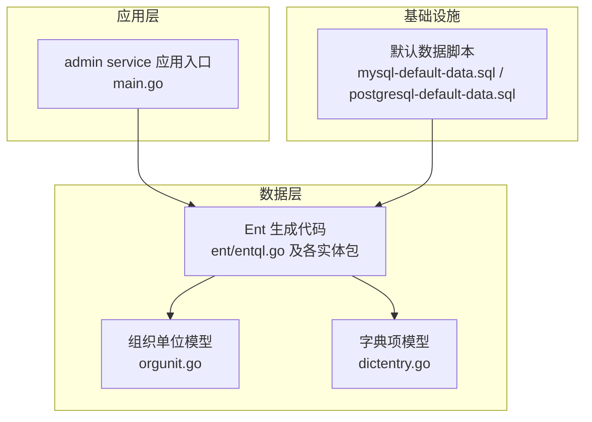
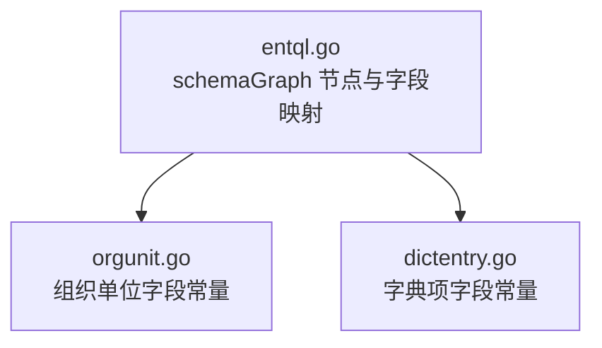
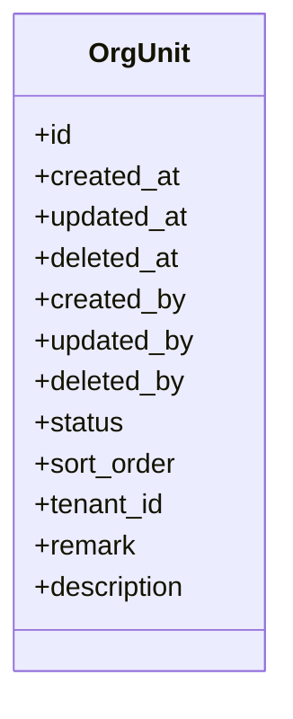
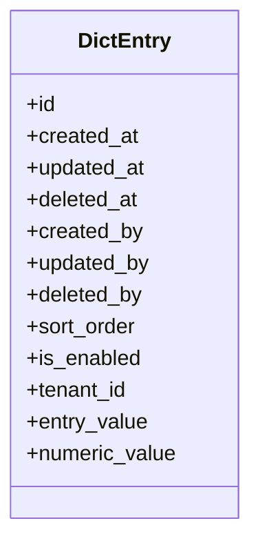
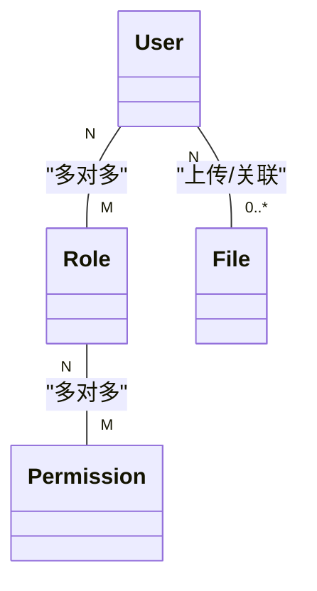
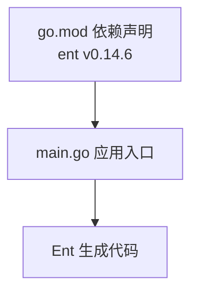

# 数据模型设计

<cite>
**本文引用的文件**
- [go.mod](file://backend/go.mod)
- [main.go](file://backend/app/admin/service/cmd/server/main.go)
- [entql.go](file://backend/app/admin/service/internal/data/ent/entql.go)
- [orgunit.go](file://backend/app/admin/service/internal/data/ent/orgunit/orgunit.go)
- [dictentry.go](file://backend/app/admin/service/internal/data/ent/dictentry/dictentry.go)
- [mysql-default-data.sql](file://backend/sql/mysql-default-data.sql)
- [postgresql-default-data.sql](file://backend/sql/postgresql-default-data.sql)
</cite>

## 目录
1. [简介](#简介)
2. [项目结构](#项目结构)
3. [核心组件](#核心组件)
4. [架构总览](#架构总览)
5. [详细组件分析](#详细组件分析)
6. [依赖分析](#依赖分析)
7. [性能考量](#性能考量)
8. [故障排查指南](#故障排查指南)
9. [结论](#结论)
10. [附录](#附录)

## 简介
本文件系统化梳理 GoWind Admin 基于 Ent ORM 的数据模型设计与实体关系。重点覆盖用户(User)、角色(Role)、权限(Permission)、组织单位(OrgUnit)、文件(File)等核心实体的表结构设计、字段定义、数据类型、约束与索引策略；阐明实体间的一对多、多对多关系及外键级联行为；总结 Ent ORM 的模型定义语法（字段标签、关系标签、索引标签）与最佳实践，并结合默认数据脚本说明数据完整性约束与初始化策略。

## 项目结构
后端采用模块化分层：应用入口位于 admin service，数据访问层通过 Ent 生成代码与数据库交互；默认数据脚本提供初始字典、租户、角色、权限等基础数据。

**图表来源**
- [main.go:1-76](file://backend/app/admin/service/cmd/server/main.go#L1-L76)
- [entql.go:52-190](file://backend/app/admin/service/internal/data/ent/entql.go#L52-L190)
- [orgunit.go:1-39](file://backend/app/admin/service/internal/data/ent/orgunit/orgunit.go#L1-L39)
- [dictentry.go:1-36](file://backend/app/admin/service/internal/data/ent/dictentry/dictentry.go#L1-L36)
- [mysql-default-data.sql](file://backend/sql/mysql-default-data.sql)
- [postgresql-default-data.sql](file://backend/sql/postgresql-default-data.sql)

**章节来源**
- [main.go:1-76](file://backend/app/admin/service/cmd/server/main.go#L1-L76)
- [go.mod:1-290](file://backend/go.mod#L1-L290)

## 核心组件
- 用户(User)：用于身份认证与授权的主体，通常与角色、组织单位存在多对多关系。
- 角色(Role)：权限集合的抽象，支持与用户、菜单、API 等建立关联。
- 权限(Permission)：细粒度的资源与操作控制单元，可按 API 或菜单维度管理。
- 组织单位(OrgUnit)：企业/机构的层级化组织结构，支持树形关系与成员归属。
- 文件(File)：存储业务相关文件元数据与访问信息，常与上传/下载流程集成。

上述实体在 Ent 生成代码中以 schema 形式存在，字段与关系由 entql 图与各实体包导出常量定义，确保运行时一致性。

**章节来源**
- [entql.go:52-190](file://backend/app/admin/service/internal/data/ent/entql.go#L52-L190)

## 架构总览
下图展示 Ent 生成代码与实体常量之间的映射关系，体现 Ent 在运行时对 schema 的图谱表示。

**图表来源**
- [entql.go:52-190](file://backend/app/admin/service/internal/data/ent/entql.go#L52-L190)
- [orgunit.go:13-39](file://backend/app/admin/service/internal/data/ent/orgunit/orgunit.go#L13-L39)
- [dictentry.go:11-36](file://backend/app/admin/service/internal/data/ent/dictentry/dictentry.go#L11-L36)

## 详细组件分析

### 组织单位(OrgUnit)模型
- 表名与标识：实体标签与字段常量定义了表名、主键与通用审计字段（创建时间、更新时间、删除时间、创建者、更新者、删除者）。
- 字段与类型：包含状态、排序、租户标识、备注、描述等字段，具体列名与类型在常量中声明。
- 索引策略：建议对租户标识、父节点（若存在）、状态、排序进行索引以优化查询与层级遍历。
- 关系设计：作为组织结构根节点，常与用户、岗位、角色建立多对多或从属关系；需考虑软删除与级联策略。

**图表来源**
- [orgunit.go:13-39](file://backend/app/admin/service/internal/data/ent/orgunit/orgunit.go#L13-L39)

**章节来源**
- [orgunit.go:1-39](file://backend/app/admin/service/internal/data/ent/orgunit/orgunit.go#L1-L39)

### 字典项(DictEntry)模型
- 表名与标识：实体标签与字段常量定义了表名、主键与通用审计字段。
- 字段与类型：包含排序、启用状态、租户标识、条目值、数值型值等字段，列名与类型在常量中声明。
- 索引策略：建议对租户标识、启用状态、排序进行索引，提升筛选与排序效率。
- 关系设计：字典项常与字典类型、国际化文案等形成一对多关系；需考虑软删除与级联策略。

**图表来源**
- [dictentry.go:11-36](file://backend/app/admin/service/internal/data/ent/dictentry/dictentry.go#L11-L36)

**章节来源**
- [dictentry.go:1-36](file://backend/app/admin/service/internal/data/ent/dictentry/dictentry.go#L1-L36)

### 用户(User)、角色(Role)、权限(Permission)、文件(File)模型
- 运行时映射：Ent 在运行时通过 schemaGraph 对各实体进行节点与字段映射，确保字段类型与列名一致。
- 字段与类型：用户、角色、权限、文件等实体的字段与类型在 entql 图中统一声明，包含审计字段与业务字段。
- 索引策略：建议对关键过滤字段（如用户名、邮箱、角色ID、权限码、文件标识）建立索引，提升查询性能。
- 关系设计：用户与角色为多对多；角色与权限为多对多；文件与上传者、业务对象可建立多对一或一对多关系；需明确软删除与级联策略。

**图表来源**
- [entql.go:52-190](file://backend/app/admin/service/internal/data/ent/entql.go#L52-L190)

**章节来源**
- [entql.go:52-190](file://backend/app/admin/service/internal/data/ent/entql.go#L52-L190)

### Ent ORM 模型定义语法与最佳实践
- 字段标签：通过常量声明字段名与类型，确保与数据库列严格对应。
- 关系标签：在实体 schema 中定义关系方向与约束，避免循环依赖与不一致。
- 索引标签：为高频查询字段添加索引，注意复合索引顺序与选择性。
- 软删除：统一使用逻辑删除字段，配合查询过滤器实现软删除隔离。
- 级联策略：谨慎设置级联删除/更新，优先使用限制或设置为空（ON DELETE SET NULL），避免误删造成数据链式破坏。
- 审计字段：统一维护创建/更新时间与操作人，便于审计与问题追踪。

**章节来源**
- [entql.go:52-190](file://backend/app/admin/service/internal/data/ent/entql.go#L52-L190)
- [orgunit.go:13-39](file://backend/app/admin/service/internal/data/ent/orgunit/orgunit.go#L13-L39)
- [dictentry.go:11-36](file://backend/app/admin/service/internal/data/ent/dictentry/dictentry.go#L11-L36)

### 默认数据与初始化
- 初始化策略：默认数据脚本提供基础字典、租户、角色、权限等初始数据，确保系统开箱即用。
- 数据完整性：初始化脚本应与实体 schema 保持一致，避免字段缺失或类型不匹配导致迁移失败。
- 执行顺序：建议先执行结构迁移，再导入默认数据，确保外键约束满足。

**章节来源**
- [mysql-default-data.sql](file://backend/sql/mysql-default-data.sql)
- [postgresql-default-data.sql](file://backend/sql/postgresql-default-data.sql)

## 依赖分析
- 外部依赖：项目使用 Ent v0.14.6 作为 ORM 框架，提供 schema 定义、代码生成与运行时图谱。
- 应用入口：admin service 通过 bootstrap 启动 HTTP、任务队列与 SSE 服务，数据层通过 Ent 生成代码访问数据库。

**图表来源**
- [go.mod:5-6](file://backend/go.mod#L5-L6)
- [main.go:1-76](file://backend/app/admin/service/cmd/server/main.go#L1-L76)

**章节来源**
- [go.mod:1-290](file://backend/go.mod#L1-L290)
- [main.go:1-76](file://backend/app/admin/service/cmd/server/main.go#L1-L76)

## 性能考量
- 索引优化：为常用过滤、排序、连接字段建立合适索引，避免全表扫描。
- 查询路径：尽量使用带索引的过滤条件，减少 JOIN 与子查询复杂度。
- 分页与缓存：对列表查询使用分页与结果缓存，降低数据库压力。
- 写入批处理：批量插入/更新时使用事务与批量 API，减少往返次数。
- 监控与剖析：结合数据库慢查询日志与 ORM 计数器，定位热点 SQL。

## 故障排查指南
- 字段不匹配：当实体字段与数据库列不一致时，检查 entql 图与生成代码是否同步。
- 索引缺失：针对慢查询分析执行计划，补充必要索引。
- 软删除冲突：确认软删除字段与查询过滤器配置正确，避免误删或重复数据。
- 级联异常：核对关系标签与外键约束，必要时调整为限制或设置为空策略。
- 初始化失败：检查默认数据脚本与实体 schema 是否兼容，修正后再执行。

## 结论
GoWind Admin 的数据模型以 Ent ORM 为核心，通过 schema 与生成代码确保字段、关系与索引的一致性。组织单位、字典项等实体具备清晰的审计字段与业务字段，配合默认数据脚本实现快速初始化。建议在生产环境中严格执行索引策略、软删除与级联规则，并持续监控查询性能与数据完整性。

## 附录
- 实体与字段常量：参考各实体包导出的常量定义，确保字段名与类型与数据库一致。
- 迁移与初始化：遵循“结构迁移 → 默认数据导入”的顺序，保证外键约束满足。
- 最佳实践清单：
  - 为高频字段建立索引
  - 使用软删除并统一过滤
  - 明确关系与级联策略
  - 审计字段规范化
  - 批量写入与事务控制