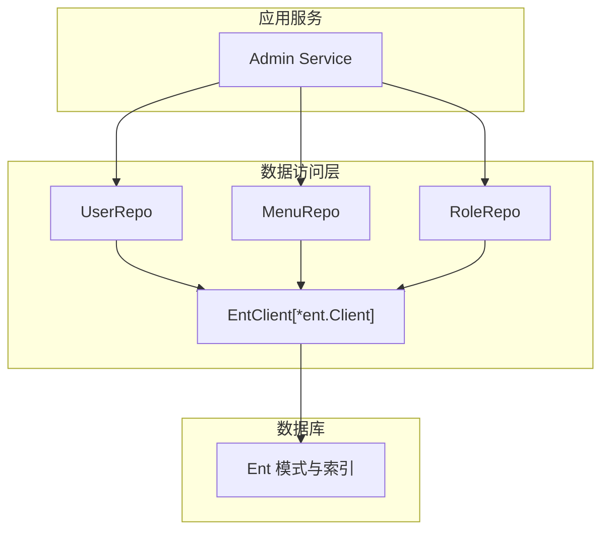
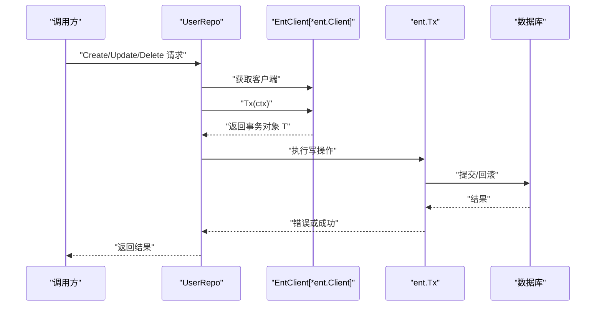
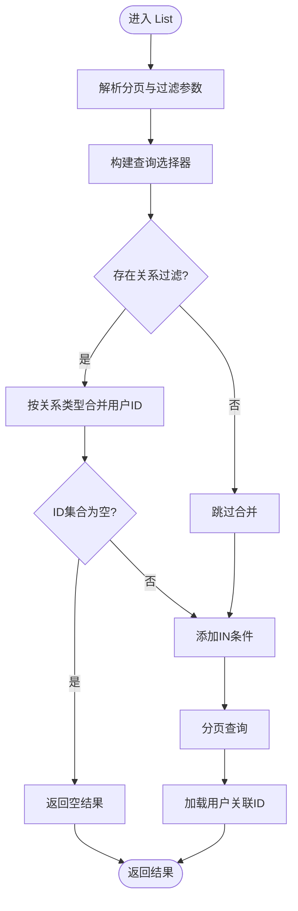
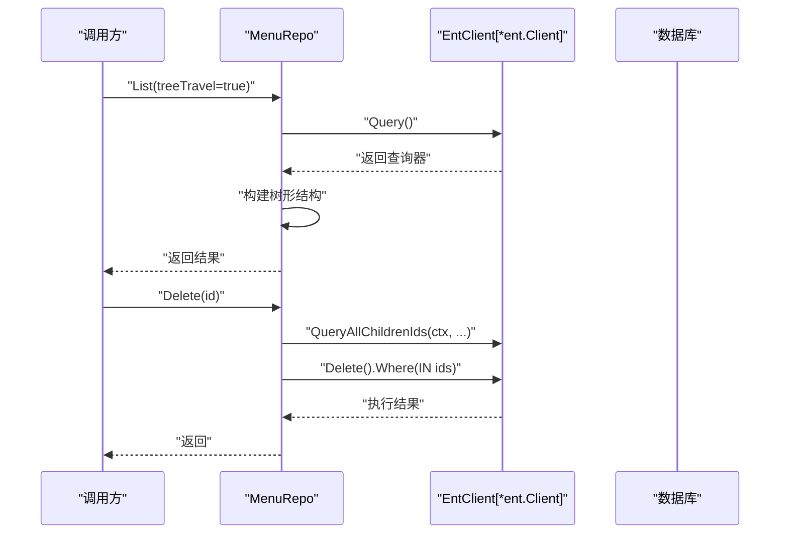
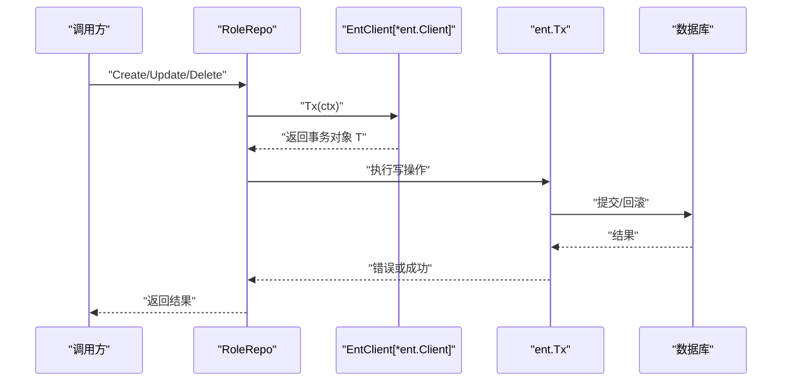
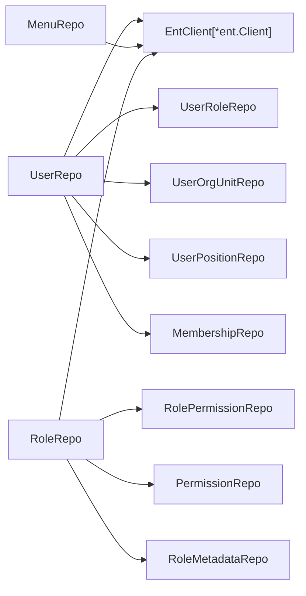

# 数据访问模式

<cite>
**本文引用的文件**
- [backend/app/admin/service/internal/data/data.go](file://backend/app/admin/service/internal/data/data.go)
- [backend/app/admin/service/internal/data/user_repo.go](file://backend/app/admin/service/internal/data/user_repo.go)
- [backend/app/admin/service/internal/data/menu_repo.go](file://backend/app/admin/service/internal/data/menu_repo.go)
- [backend/app/admin/service/internal/data/role_repo.go](file://backend/app/admin/service/internal/data/role_repo.go)
- [backend/app/admin/service/internal/data/ent/migrate/schema.go](file://backend/app/admin/service/internal/data/ent/migrate/schema.go)
- [backend/pkg/entgo/viewer/system_viewer.go](file://backend/pkg/entgo/viewer/system_viewer.go)
</cite>

## 目录
1. [简介](#简介)
2. [项目结构](#项目结构)
3. [核心组件](#核心组件)
4. [架构总览](#架构总览)
5. [详细组件分析](#详细组件分析)
6. [依赖分析](#依赖分析)
7. [性能考虑](#性能考虑)
8. [故障排查指南](#故障排查指南)
9. [结论](#结论)
10. [附录](#附录)

## 简介
本文件系统性梳理 GoWind Admin 基于 Ent ORM 的数据访问层设计与实现，重点覆盖以下方面：
- Repository 模式在各领域实体上的落地与职责划分
- 查询构建器（EntQL）的使用方法，包括复杂查询、条件组合、排序与分页
- 事务管理机制，含开启、提交、回滚与嵌套事务处理
- 批量操作（批量插入、更新、删除）的优化策略
- 数据访问最佳实践，涵盖查询性能优化、N+1 问题规避、缓存策略
- 提供具体代码片段路径与常见问题解决方案

## 项目结构
数据访问层位于后端服务内部，采用“领域仓库 + Ent 客户端”的分层设计：
- 领域仓库：封装 CRUD、复杂查询、事务与关联关系维护
- Ent 客户端：统一的数据库连接与事务入口
- 模式定义：Ent 自动生成的 schema 与索引定义，支撑查询性能与约束

图表来源
- [backend/app/admin/service/internal/data/user_repo.go:1-120](file://backend/app/admin/service/internal/data/user_repo.go#L1-L120)
- [backend/app/admin/service/internal/data/menu_repo.go:1-60](file://backend/app/admin/service/internal/data/menu_repo.go#L1-L60)
- [backend/app/admin/service/internal/data/role_repo.go:1-60](file://backend/app/admin/service/internal/data/role_repo.go#L1-L60)
- [backend/app/admin/service/internal/data/ent/migrate/schema.go:1-120](file://backend/app/admin/service/internal/data/ent/migrate/schema.go#L1-L120)

章节来源
- [backend/app/admin/service/internal/data/data.go:1-63](file://backend/app/admin/service/internal/data/data.go#L1-L63)
- [backend/app/admin/service/internal/data/user_repo.go:1-120](file://backend/app/admin/service/internal/data/user_repo.go#L1-L120)
- [backend/app/admin/service/internal/data/menu_repo.go:1-60](file://backend/app/admin/service/internal/data/menu_repo.go#L1-L60)
- [backend/app/admin/service/internal/data/role_repo.go:1-60](file://backend/app/admin/service/internal/data/role_repo.go#L1-L60)
- [backend/app/admin/service/internal/data/ent/migrate/schema.go:1-120](file://backend/app/admin/service/internal/data/ent/migrate/schema.go#L1-L120)

## 核心组件
- EntClient：封装 Ent 客户端与事务入口，提供统一的数据库访问能力
- 各领域仓库（UserRepo、MenuRepo、RoleRepo）：面向业务的仓储接口与实现，负责查询、写入、事务与关联关系维护
- 视图上下文（SystemViewer）：系统级上下文，用于审计开关、数据范围等策略控制

章节来源
- [backend/app/admin/service/internal/data/data.go:23-62](file://backend/app/admin/service/internal/data/data.go#L23-L62)
- [backend/app/admin/service/internal/data/user_repo.go:70-134](file://backend/app/admin/service/internal/data/user_repo.go#L70-L134)
- [backend/app/admin/service/internal/data/menu_repo.go:27-74](file://backend/app/admin/service/internal/data/menu_repo.go#L27-L74)
- [backend/app/admin/service/internal/data/role_repo.go:27-93](file://backend/app/admin/service/internal/data/role_repo.go#L27-L93)
- [backend/pkg/entgo/viewer/system_viewer.go:1-79](file://backend/pkg/entgo/viewer/system_viewer.go#L1-L79)

## 架构总览
数据访问层围绕 Ent ORM 构建，采用 Repository 模式隔离业务逻辑与底层数据操作。事务贯穿写操作，确保一致性；查询通过 EntQL 与分页工具实现高性能检索。

图表来源
- [backend/app/admin/service/internal/data/user_repo.go:460-555](file://backend/app/admin/service/internal/data/user_repo.go#L460-L555)
- [backend/app/admin/service/internal/data/role_repo.go:367-394](file://backend/app/admin/service/internal/data/role_repo.go#L367-L394)

## 详细组件分析

### 用户仓储（UserRepo）
- 职责
  - 列表与详情查询（支持分页、过滤、排序）
  - 复杂过滤：支持通过角色、组织单元、岗位 ID 进行过滤，并合并为最终用户 ID 集合
  - 写操作：创建、更新、删除均在事务中执行
  - 关联关系：根据配置选择一对一或一对多的关系分配策略
- 查询构建器（EntQL）
  - 使用 Ent 查询构建器进行条件拼装、排序与分页
  - 对外暴露的过滤表达式与内部关系过滤分离处理
- 事务管理
  - 所有写操作显式开启事务，异常时回滚，成功时提交
- 批量操作
  - 关联关系分配时对 ID 去重与批量写入
- N+1 优化
  - 列表查询后一次性加载关联 ID，避免逐条查询

图表来源
- [backend/app/admin/service/internal/data/user_repo.go:289-422](file://backend/app/admin/service/internal/data/user_repo.go#L289-L422)

章节来源
- [backend/app/admin/service/internal/data/user_repo.go:34-68](file://backend/app/admin/service/internal/data/user_repo.go#L34-L68)
- [backend/app/admin/service/internal/data/user_repo.go:136-152](file://backend/app/admin/service/internal/data/user_repo.go#L136-L152)
- [backend/app/admin/service/internal/data/user_repo.go:289-422](file://backend/app/admin/service/internal/data/user_repo.go#L289-L422)
- [backend/app/admin/service/internal/data/user_repo.go:460-555](file://backend/app/admin/service/internal/data/user_repo.go#L460-L555)
- [backend/app/admin/service/internal/data/user_repo.go:557-759](file://backend/app/admin/service/internal/data/user_repo.go#L557-L759)
- [backend/app/admin/service/internal/data/user_repo.go:785-811](file://backend/app/admin/service/internal/data/user_repo.go#L785-L811)
- [backend/app/admin/service/internal/data/user_repo.go:813-903](file://backend/app/admin/service/internal/data/user_repo.go#L813-L903)
- [backend/app/admin/service/internal/data/user_repo.go:905-1047](file://backend/app/admin/service/internal/data/user_repo.go#L905-L1047)
- [backend/app/admin/service/internal/data/user_repo.go:1049-1126](file://backend/app/admin/service/internal/data/user_repo.go#L1049-L1126)

### 菜单仓储（MenuRepo）
- 职责
  - 列表查询（支持树形遍历）、详情、创建、更新、删除
  - JSON 字段增量更新（仅更新指定路径）
- 查询构建器（EntQL）
  - 使用 Ent 查询构建器与分页工具完成列表与计数
- 事务管理
  - 更新与删除在客户端层面执行，未见显式事务包裹
- 批量操作
  - 删除时递归查询子节点并批量删除

图表来源
- [backend/app/admin/service/internal/data/menu_repo.go:91-136](file://backend/app/admin/service/internal/data/menu_repo.go#L91-L136)
- [backend/app/admin/service/internal/data/menu_repo.go:277-307](file://backend/app/admin/service/internal/data/menu_repo.go#L277-L307)

章节来源
- [backend/app/admin/service/internal/data/menu_repo.go:27-74](file://backend/app/admin/service/internal/data/menu_repo.go#L27-L74)
- [backend/app/admin/service/internal/data/menu_repo.go:76-89](file://backend/app/admin/service/internal/data/menu_repo.go#L76-L89)
- [backend/app/admin/service/internal/data/menu_repo.go:91-136](file://backend/app/admin/service/internal/data/menu_repo.go#L91-L136)
- [backend/app/admin/service/internal/data/menu_repo.go:138-147](file://backend/app/admin/service/internal/data/menu_repo.go#L138-L147)
- [backend/app/admin/service/internal/data/menu_repo.go:149-169](file://backend/app/admin/service/internal/data/menu_repo.go#L149-L169)
- [backend/app/admin/service/internal/data/menu_repo.go:171-202](file://backend/app/admin/service/internal/data/menu_repo.go#L171-L202)
- [backend/app/admin/service/internal/data/menu_repo.go:204-260](file://backend/app/admin/service/internal/data/menu_repo.go#L204-L260)
- [backend/app/admin/service/internal/data/menu_repo.go:262-275](file://backend/app/admin/service/internal/data/menu_repo.go#L262-L275)
- [backend/app/admin/service/internal/data/menu_repo.go:277-307](file://backend/app/admin/service/internal/data/menu_repo.go#L277-L307)

### 角色仓储（RoleRepo）
- 职责
  - 角色列表、详情、创建、更新、删除
  - 角色权限分配与清理、模板角色复制、元数据版本升级
- 查询构建器（EntQL）
  - 使用 Ent 查询构建器与分页工具完成列表与计数
- 事务管理
  - 所有写操作在事务中执行，异常回滚，成功提交
- 批量操作
  - 权限分配时批量写入

图表来源
- [backend/app/admin/service/internal/data/role_repo.go:367-394](file://backend/app/admin/service/internal/data/role_repo.go#L367-L394)
- [backend/app/admin/service/internal/data/role_repo.go:468-549](file://backend/app/admin/service/internal/data/role_repo.go#L468-L549)
- [backend/app/admin/service/internal/data/role_repo.go:552-600](file://backend/app/admin/service/internal/data/role_repo.go#L552-L600)

章节来源
- [backend/app/admin/service/internal/data/role_repo.go:27-93](file://backend/app/admin/service/internal/data/role_repo.go#L27-L93)
- [backend/app/admin/service/internal/data/role_repo.go:95-126](file://backend/app/admin/service/internal/data/role_repo.go#L95-L126)
- [backend/app/admin/service/internal/data/role_repo.go:140-164](file://backend/app/admin/service/internal/data/role_repo.go#L140-L164)
- [backend/app/admin/service/internal/data/role_repo.go:335-365](file://backend/app/admin/service/internal/data/role_repo.go#L335-L365)
- [backend/app/admin/service/internal/data/role_repo.go:367-465](file://backend/app/admin/service/internal/data/role_repo.go#L367-L465)
- [backend/app/admin/service/internal/data/role_repo.go:468-549](file://backend/app/admin/service/internal/data/role_repo.go#L468-L549)
- [backend/app/admin/service/internal/data/role_repo.go:552-600](file://backend/app/admin/service/internal/data/role_repo.go#L552-L600)

### Ent 模式与索引
- 模式定义
  - 包含 API 审计日志、数据访问审计日志、字典、文件、站内信、语言、登录审计日志等表
  - 定义了字段、主键、外键与索引，支撑查询性能与数据完整性
- 索引策略
  - 针对常用查询维度建立唯一与非唯一索引，如业务模块、路径+方法、租户+时间等

章节来源
- [backend/app/admin/service/internal/data/ent/migrate/schema.go:11-800](file://backend/app/admin/service/internal/data/ent/migrate/schema.go#L11-L800)

### 视图上下文（SystemViewer）
- 用途
  - 提供系统级上下文，用于审计开关、数据范围、权限判断与租户上下文判定
- 行为
  - 默认不审计、平台上下文、系统任务上下文等

章节来源
- [backend/pkg/entgo/viewer/system_viewer.go:1-79](file://backend/pkg/entgo/viewer/system_viewer.go#L1-L79)

## 依赖分析
- 仓库与客户端
  - 各仓库依赖 EntClient 提供的客户端与事务入口
- 事务边界
  - 写操作在仓库层开启事务，避免跨层传播事务细节
- 关联关系
  - UserRepo 根据配置选择一对一或一对多的关系分配策略，委托给子仓库或 Membership

图表来源
- [backend/app/admin/service/internal/data/user_repo.go:70-117](file://backend/app/admin/service/internal/data/user_repo.go#L70-L117)
- [backend/app/admin/service/internal/data/role_repo.go:27-76](file://backend/app/admin/service/internal/data/role_repo.go#L27-L76)

章节来源
- [backend/app/admin/service/internal/data/user_repo.go:70-117](file://backend/app/admin/service/internal/data/user_repo.go#L70-L117)
- [backend/app/admin/service/internal/data/role_repo.go:27-76](file://backend/app/admin/service/internal/data/role_repo.go#L27-L76)

## 性能考虑
- 查询性能优化
  - 充分利用模式中定义的索引，针对高频查询字段建立复合索引
  - 使用分页与计数分离，避免全表扫描
- N+1 问题
  - 列表查询后一次性加载关联 ID，避免逐条查询
- 批量操作
  - 关联关系分配时对 ID 去重与批量写入，减少往返与冗余写入
- 缓存策略
  - 可结合系统上下文与视图上下文，按租户与数据范围进行缓存键设计，降低重复查询成本

## 故障排查指南
- 事务相关
  - 现象：写操作失败后数据未回滚
  - 排查：确认仓库层是否正确捕获错误并调用回滚；检查提交阶段的错误处理
- 查询异常
  - 现象：列表查询报错或结果为空
  - 排查：检查过滤条件与关系过滤合并逻辑；核对分页参数与索引使用
- 关联关系
  - 现象：用户角色/组织单元/岗位未正确分配
  - 排查：确认关系类型配置；检查去重与批量写入逻辑

章节来源
- [backend/app/admin/service/internal/data/user_repo.go:460-555](file://backend/app/admin/service/internal/data/user_repo.go#L460-L555)
- [backend/app/admin/service/internal/data/role_repo.go:367-394](file://backend/app/admin/service/internal/data/role_repo.go#L367-L394)
- [backend/app/admin/service/internal/data/menu_repo.go:277-307](file://backend/app/admin/service/internal/data/menu_repo.go#L277-L307)

## 结论
GoWind Admin 的数据访问层以 Ent ORM 为核心，通过 Repository 模式实现了清晰的职责划分与良好的可维护性。事务管理、复杂查询、批量操作与 N+1 优化共同构成了稳定高效的持久化能力。建议在后续迭代中进一步完善缓存策略与审计日志的集成，持续提升查询性能与可观测性。

## 附录
- 代码片段路径参考
  - 用户仓储创建流程：[backend/app/admin/service/internal/data/user_repo.go:460-555](file://backend/app/admin/service/internal/data/user_repo.go#L460-L555)
  - 用户仓储更新流程：[backend/app/admin/service/internal/data/user_repo.go:557-686](file://backend/app/admin/service/internal/data/user_repo.go#L557-L686)
  - 用户仓储删除流程：[backend/app/admin/service/internal/data/user_repo.go:688-759](file://backend/app/admin/service/internal/data/user_repo.go#L688-L759)
  - 菜单仓储树形构建：[backend/app/admin/service/internal/data/menu_repo.go:117-125](file://backend/app/admin/service/internal/data/menu_repo.go#L117-L125)
  - 菜单仓储删除流程：[backend/app/admin/service/internal/data/menu_repo.go:277-307](file://backend/app/admin/service/internal/data/menu_repo.go#L277-L307)
  - 角色仓储创建流程：[backend/app/admin/service/internal/data/role_repo.go:367-465](file://backend/app/admin/service/internal/data/role_repo.go#L367-L465)
  - 角色仓储更新流程：[backend/app/admin/service/internal/data/role_repo.go:468-549](file://backend/app/admin/service/internal/data/role_repo.go#L468-L549)
  - 角色仓储删除流程：[backend/app/admin/service/internal/data/role_repo.go:552-600](file://backend/app/admin/service/internal/data/role_repo.go#L552-L600)
  - Ent 模式与索引定义：[backend/app/admin/service/internal/data/ent/migrate/schema.go:11-800](file://backend/app/admin/service/internal/data/ent/migrate/schema.go#L11-L800)
  - 系统视图上下文：[backend/pkg/entgo/viewer/system_viewer.go:1-79](file://backend/pkg/entgo/viewer/system_viewer.go#L1-L79)