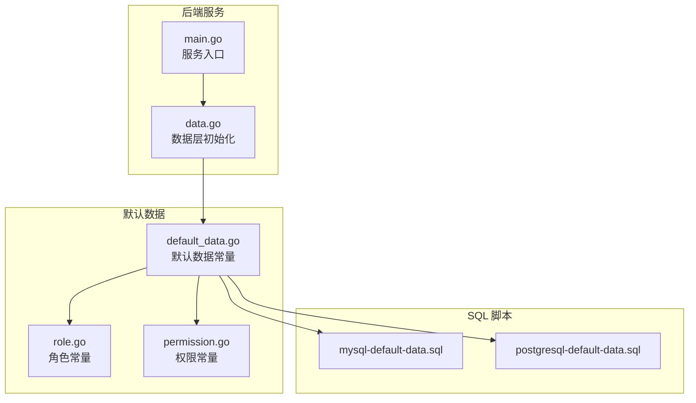
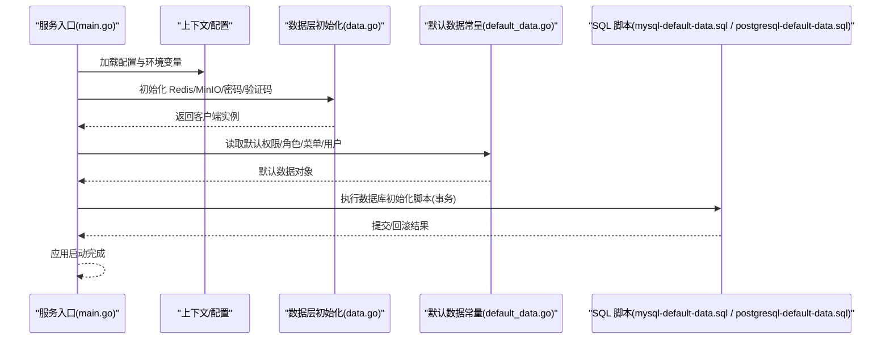
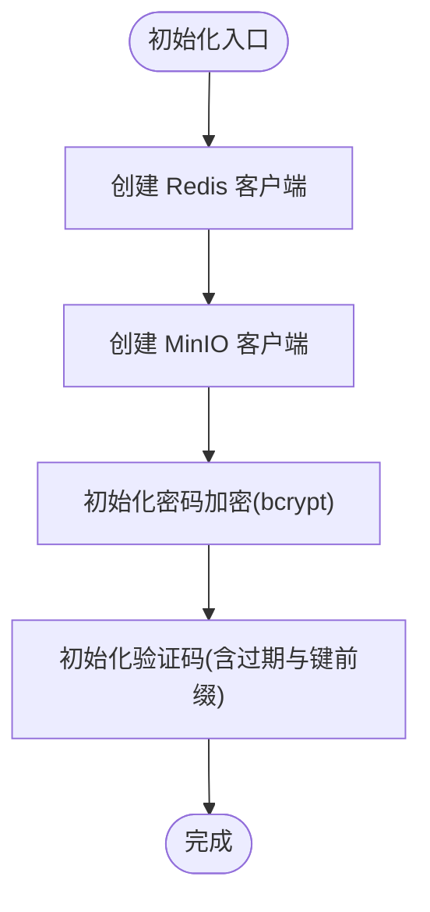
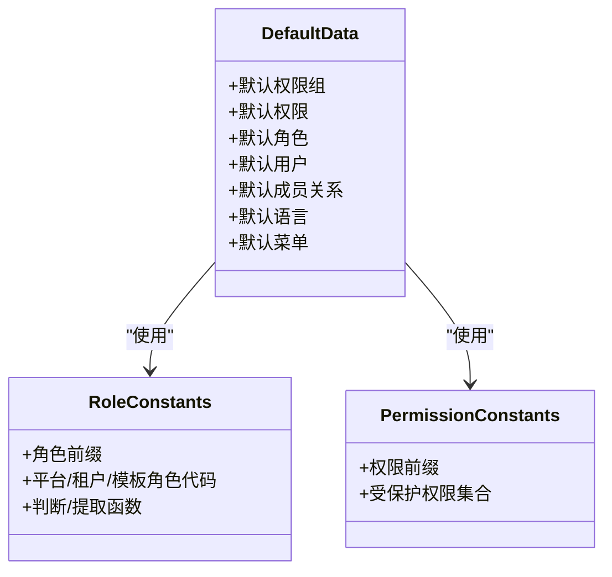
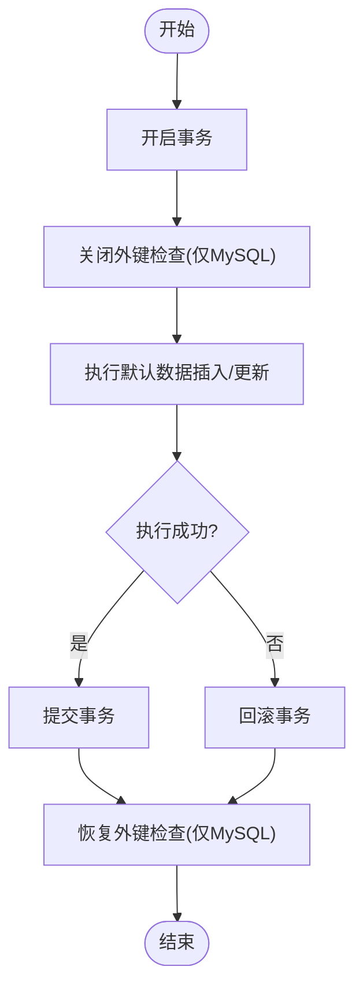
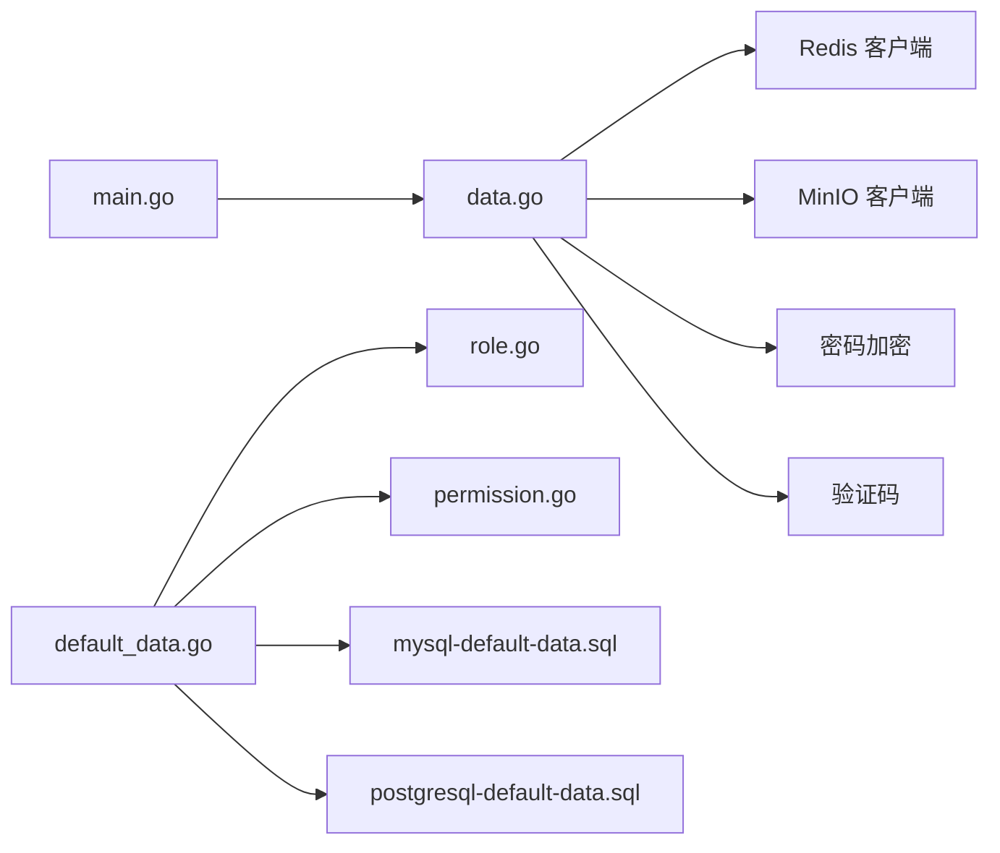

# 迁移管理

<cite>
**本文引用的文件**
- [backend/app/admin/service/cmd/server/main.go](file://backend/app/admin/service/cmd/server/main.go)
- [backend/app/admin/service/internal/data/data.go](file://backend/app/admin/service/internal/data/data.go)
- [backend/pkg/constants/default_data.go](file://backend/pkg/constants/default_data.go)
- [backend/pkg/constants/role.go](file://backend/pkg/constants/role.go)
- [backend/pkg/constants/permission.go](file://backend/pkg/constants/permission.go)
- [backend/sql/mysql-default-data.sql](file://backend/sql/mysql-default-data.sql)
- [backend/sql/postgresql-default-data.sql](file://backend/sql/postgresql-default-data.sql)
</cite>

## 目录
1. [简介](#简介)
2. [项目结构](#项目结构)
3. [核心组件](#核心组件)
4. [架构总览](#架构总览)
5. [详细组件分析](#详细组件分析)
6. [依赖分析](#依赖分析)
7. [性能考虑](#性能考虑)
8. [故障排查指南](#故障排查指南)
9. [结论](#结论)
10. [附录](#附录)

## 简介
本文件面向 GoWind Admin 的迁移管理，系统化梳理数据库迁移的完整流程与最佳实践，涵盖：
- 初始化迁移：表结构生成与默认数据导入
- 版本升级与回滚策略：基于事务与脚本的可控变更
- Ent ORM 迁移机制：自动生成与手动脚本协同
- 数据迁移：默认数据、演示数据与生产数据的导入策略
- 一致性保障：事务性迁移、数据校验与错误处理
- 最佳实践：版本控制、测试策略、回滚预案与常见问题解决

## 项目结构
与迁移管理直接相关的目录与文件：
- 后端服务入口：用于启动时初始化与运行
- 数据层与缓存：Redis 客户端、MinIO 对象存储、密码加密与验证码
- 默认数据常量：权限、角色、菜单、用户等默认值定义
- SQL 脚本：MySQL 与 PostgreSQL 的默认数据初始化脚本
- 权限与角色常量：角色代码前缀、受保护权限等

**图表来源**
- [backend/app/admin/service/cmd/server/main.go:1-76](file://backend/app/admin/service/cmd/server/main.go#L1-L76)
- [backend/app/admin/service/internal/data/data.go:1-63](file://backend/app/admin/service/internal/data/data.go#L1-L63)
- [backend/pkg/constants/default_data.go:1-790](file://backend/pkg/constants/default_data.go#L1-L790)
- [backend/pkg/constants/role.go:1-49](file://backend/pkg/constants/role.go#L1-L49)
- [backend/pkg/constants/permission.go:1-39](file://backend/pkg/constants/permission.go#L1-L39)
- [backend/sql/mysql-default-data.sql:1-12](file://backend/sql/mysql-default-data.sql#L1-L12)
- [backend/sql/postgresql-default-data.sql:1-3](file://backend/sql/postgresql-default-data.sql#L1-L3)

**章节来源**
- [backend/app/admin/service/cmd/server/main.go:1-76](file://backend/app/admin/service/cmd/server/main.go#L1-L76)
- [backend/app/admin/service/internal/data/data.go:1-63](file://backend/app/admin/service/internal/data/data.go#L1-L63)
- [backend/pkg/constants/default_data.go:1-790](file://backend/pkg/constants/default_data.go#L1-L790)
- [backend/pkg/constants/role.go:1-49](file://backend/pkg/constants/role.go#L1-L49)
- [backend/pkg/constants/permission.go:1-39](file://backend/pkg/constants/permission.go#L1-L39)
- [backend/sql/mysql-default-data.sql:1-12](file://backend/sql/mysql-default-data.sql#L1-L12)
- [backend/sql/postgresql-default-data.sql:1-3](file://backend/sql/postgresql-default-data.sql#L1-L3)

## 核心组件
- 服务入口与上下文：负责应用启动、配置注入与运行时生命周期管理
- 数据层初始化：创建 Redis、MinIO、密码加密与验证码等基础设施
- 默认数据常量：集中定义系统初始化所需的权限、角色、菜单、用户等默认值
- SQL 脚本：提供 MySQL 与 PostgreSQL 的默认数据初始化脚本，包含事务与外键控制
- 权限与角色常量：统一的角色与权限命名规范与受保护集合

**章节来源**
- [backend/app/admin/service/cmd/server/main.go:1-76](file://backend/app/admin/service/cmd/server/main.go#L1-L76)
- [backend/app/admin/service/internal/data/data.go:1-63](file://backend/app/admin/service/internal/data/data.go#L1-L63)
- [backend/pkg/constants/default_data.go:1-790](file://backend/pkg/constants/default_data.go#L1-L790)
- [backend/sql/mysql-default-data.sql:1-12](file://backend/sql/mysql-default-data.sql#L1-L12)
- [backend/sql/postgresql-default-data.sql:1-3](file://backend/sql/postgresql-default-data.sql#L1-L3)
- [backend/pkg/constants/role.go:1-49](file://backend/pkg/constants/role.go#L1-L49)
- [backend/pkg/constants/permission.go:1-39](file://backend/pkg/constants/permission.go#L1-L39)

## 架构总览
迁移管理涉及“服务启动 -> 数据层初始化 -> 默认数据导入”的链路。Ent ORM 通过自动生成的 schema 与 migrate 工具进行表结构管理；默认数据通过常量与 SQL 脚本共同完成。

**图表来源**
- [backend/app/admin/service/cmd/server/main.go:1-76](file://backend/app/admin/service/cmd/server/main.go#L1-L76)
- [backend/app/admin/service/internal/data/data.go:1-63](file://backend/app/admin/service/internal/data/data.go#L1-L63)
- [backend/pkg/constants/default_data.go:1-790](file://backend/pkg/constants/default_data.go#L1-L790)
- [backend/sql/mysql-default-data.sql:1-12](file://backend/sql/mysql-default-data.sql#L1-L12)
- [backend/sql/postgresql-default-data.sql:1-3](file://backend/sql/postgresql-default-data.sql#L1-L3)

## 详细组件分析

### 服务入口与运行时
- 负责创建应用上下文、注入配置信息，并启动 HTTP、异步队列与 SSE 服务
- 作为迁移流程的触发点，确保在启动阶段完成必要的初始化步骤

**章节来源**
- [backend/app/admin/service/cmd/server/main.go:1-76](file://backend/app/admin/service/cmd/server/main.go#L1-L76)

### 数据层初始化
- Redis 客户端：连接与关闭生命周期管理
- MinIO 客户端：对象存储初始化
- 密码加密：使用 bcrypt 实现密码哈希
- 验证码：基于 Redis 的图形/字符串验证码，带过期与键前缀

**图表来源**
- [backend/app/admin/service/internal/data/data.go:1-63](file://backend/app/admin/service/internal/data/data.go#L1-L63)

**章节来源**
- [backend/app/admin/service/internal/data/data.go:1-63](file://backend/app/admin/service/internal/data/data.go#L1-L63)

### 默认数据常量与导入
- 默认数据覆盖权限组、权限、角色、用户、成员关系、语言、菜单等
- 角色与权限采用统一前缀与受保护集合，确保系统安全边界
- 建议通过“常量定义 + SQL 脚本”双轨导入，先结构后数据，保证依赖顺序

**图表来源**
- [backend/pkg/constants/default_data.go:1-790](file://backend/pkg/constants/default_data.go#L1-L790)
- [backend/pkg/constants/role.go:1-49](file://backend/pkg/constants/role.go#L1-L49)
- [backend/pkg/constants/permission.go:1-39](file://backend/pkg/constants/permission.go#L1-L39)

**章节来源**
- [backend/pkg/constants/default_data.go:1-790](file://backend/pkg/constants/default_data.go#L1-L790)
- [backend/pkg/constants/role.go:1-49](file://backend/pkg/constants/role.go#L1-L49)
- [backend/pkg/constants/permission.go:1-39](file://backend/pkg/constants/permission.go#L1-L39)

### SQL 脚本与事务性迁移
- MySQL 脚本：显式开启事务、关闭外键检查以支持 TRUNCATE，最后提交并恢复设置
- PostgreSQL 脚本：简洁注释说明执行前提与注意事项
- 建议：在生产环境执行前务必备份；脚本应幂等或具备回滚能力

**图表来源**
- [backend/sql/mysql-default-data.sql:1-12](file://backend/sql/mysql-default-data.sql#L1-L12)
- [backend/sql/postgresql-default-data.sql:1-3](file://backend/sql/postgresql-default-data.sql#L1-L3)

**章节来源**
- [backend/sql/mysql-default-data.sql:1-12](file://backend/sql/mysql-default-data.sql#L1-L12)
- [backend/sql/postgresql-default-data.sql:1-3](file://backend/sql/postgresql-default-data.sql#L1-L3)

## 依赖分析
- 服务入口依赖配置与上下文，为迁移提供运行时环境
- 数据层初始化依赖配置中心与日志组件，确保 Redis、MinIO、密码与验证码可用
- 默认数据常量被服务逻辑引用，作为系统初始化的权威数据源
- SQL 脚本与默认数据常量相互补充，前者侧重批量数据导入，后者侧重结构化定义

**图表来源**
- [backend/app/admin/service/cmd/server/main.go:1-76](file://backend/app/admin/service/cmd/server/main.go#L1-L76)
- [backend/app/admin/service/internal/data/data.go:1-63](file://backend/app/admin/service/internal/data/data.go#L1-L63)
- [backend/pkg/constants/default_data.go:1-790](file://backend/pkg/constants/default_data.go#L1-L790)
- [backend/pkg/constants/role.go:1-49](file://backend/pkg/constants/role.go#L1-L49)
- [backend/pkg/constants/permission.go:1-39](file://backend/pkg/constants/permission.go#L1-L39)
- [backend/sql/mysql-default-data.sql:1-12](file://backend/sql/mysql-default-data.sql#L1-L12)
- [backend/sql/postgresql-default-data.sql:1-3](file://backend/sql/postgresql-default-data.sql#L1-L3)

**章节来源**
- [backend/app/admin/service/cmd/server/main.go:1-76](file://backend/app/admin/service/cmd/server/main.go#L1-L76)
- [backend/app/admin/service/internal/data/data.go:1-63](file://backend/app/admin/service/internal/data/data.go#L1-L63)
- [backend/pkg/constants/default_data.go:1-790](file://backend/pkg/constants/default_data.go#L1-L790)
- [backend/pkg/constants/role.go:1-49](file://backend/pkg/constants/role.go#L1-L49)
- [backend/pkg/constants/permission.go:1-39](file://backend/pkg/constants/permission.go#L1-L39)
- [backend/sql/mysql-default-data.sql:1-12](file://backend/sql/mysql-default-data.sql#L1-L12)
- [backend/sql/postgresql-default-data.sql:1-3](file://backend/sql/postgresql-default-data.sql#L1-L3)

## 性能考虑
- 外键检查关闭仅在批量导入场景使用，避免级联删除带来的额外开销
- 事务包裹默认数据导入，减少多次提交的开销并提升一致性
- Redis 与 MinIO 初始化在启动阶段完成，避免运行时抖动
- 建议对大表导入分批执行，结合索引策略与数据库参数调优

## 故障排查指南
- 执行 SQL 脚本报错
  - 确认数据库版本满足 JSON 字段要求（MySQL 5.7+）
  - 确认已备份目标表，避免 TRUNCATE 导致的数据丢失
  - 在 MySQL 中检查外键约束是否影响导入
- 默认数据不生效
  - 检查默认数据常量是否正确加载
  - 确认导入顺序：先结构后数据
- 启动失败
  - 检查 Redis/MinIO 连接配置
  - 查看日志输出定位初始化异常

## 结论
GoWind Admin 的迁移管理以“服务启动 -> 数据层初始化 -> 默认数据导入”为核心路径，结合默认数据常量与 SQL 脚本，形成结构与数据双轨并行的迁移体系。通过事务性脚本、受保护权限与角色前缀规范，有效保障了迁移的一致性与安全性。建议在生产环境中严格执行备份、回滚与测试策略，确保迁移零失误。

## 附录
- 迁移脚本示例路径
  - [MySQL 默认数据脚本:1-12](file://backend/sql/mysql-default-data.sql#L1-L12)
  - [PostgreSQL 默认数据脚本:1-3](file://backend/sql/postgresql-default-data.sql#L1-L3)
- 默认数据常量路径
  - [默认数据常量:1-790](file://backend/pkg/constants/default_data.go#L1-L790)
  - [角色常量:1-49](file://backend/pkg/constants/role.go#L1-L49)
  - [权限常量:1-39](file://backend/pkg/constants/permission.go#L1-L39)
- 服务与数据层初始化路径
  - [服务入口:1-76](file://backend/app/admin/service/cmd/server/main.go#L1-L76)
  - [数据层初始化:1-63](file://backend/app/admin/service/internal/data/data.go#L1-L63)