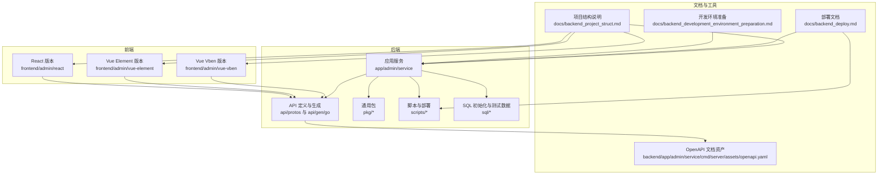
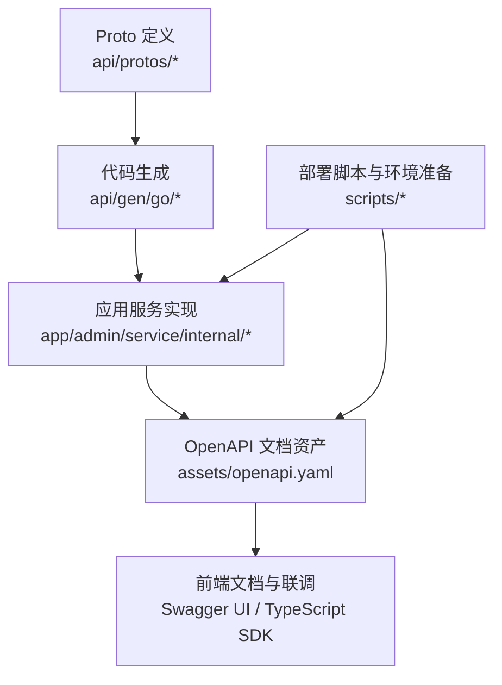
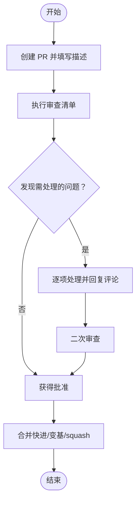
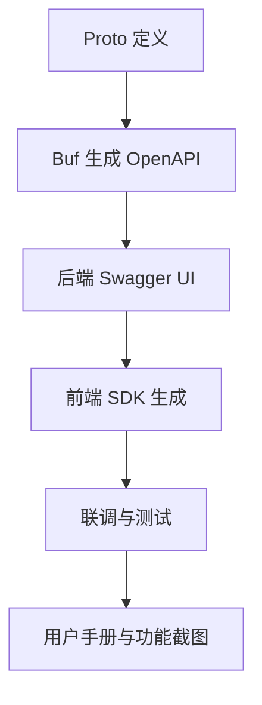
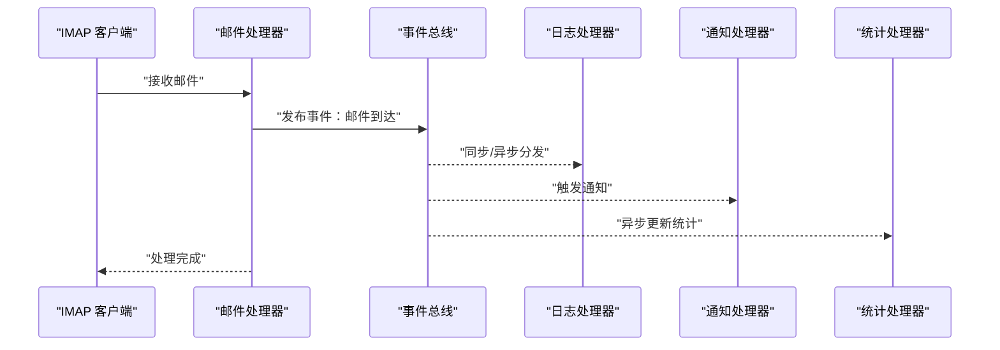
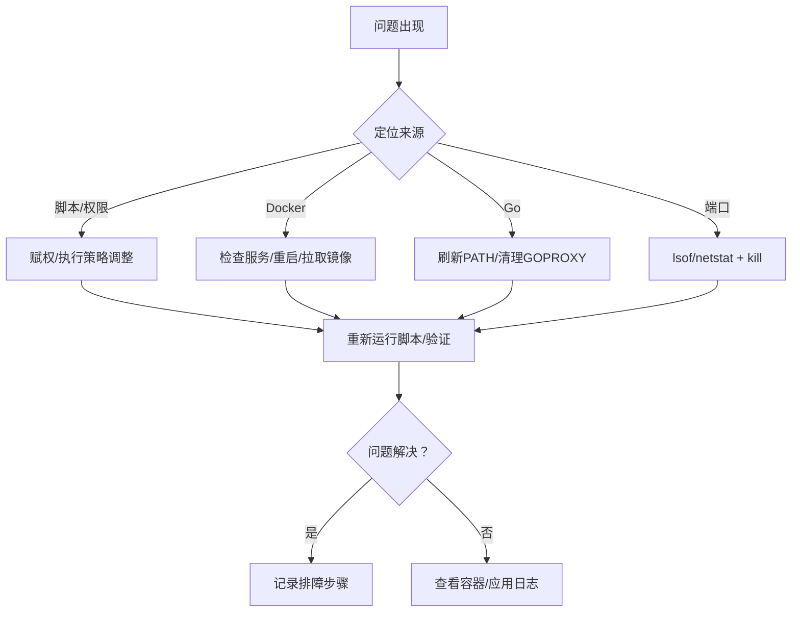

# 团队协作

<cite>
**本文引用的文件**   
- [README.md](file://README.md)
- [backend/scripts/WORKFLOWS_AND_BEST_PRACTICES.md](file://backend/scripts/WORKFLOWS_AND_BEST_PRACTICES.md)
- [docs/backend_project_struct.md](file://docs/backend_project_struct.md)
- [docs/backend_deploy.md](file://docs/backend_deploy.md)
- [docs/backend_development_environment_preparation.md](file://docs/backend_development_environment_preparation.md)
- [backend/pkg/eventbus/README.md](file://backend/pkg/eventbus/README.md)
- [backend/pkg/eventbus/INTEGRATION.md](file://backend/pkg/eventbus/INTEGRATION.md)
- [backend/pkg/crypto/README.md](file://backend/pkg/crypto/README.md)
- [frontend/admin/vue-vben/README.md](file://frontend/admin/vue-vben/README.md)
- [backend/app/admin/service/cmd/server/assets/openapi.yaml](file://backend/app/admin/service/cmd/server/assets/openapi.yaml)
</cite>

## 目录
1. [引言](#引言)
2. [项目结构](#项目结构)
3. [核心组件](#核心组件)
4. [架构总览](#架构总览)
5. [详细组件分析](#详细组件分析)
6. [依赖分析](#依赖分析)
7. [性能考虑](#性能考虑)
8. [故障排查指南](#故障排查指南)
9. [结论](#结论)
10. [附录](#附录)

## 引言
本指南面向 GoWind Admin 团队，旨在建立系统化的团队协作最佳实践，覆盖代码审查流程、文档编写规范、知识分享机制、沟通协作工具、冲突解决机制与团队建设活动。文档以仓库现有脚本、文档与组件为依据，结合项目实际工程实践，提供可落地的流程与可视化图示，帮助团队提升协作效率与交付质量。

## 项目结构
项目采用前后端分离的多服务架构，后端基于 go-kratos 微服务框架，前端提供 Vue3 与 React 两套实现，并通过 Buf 生成 OpenAPI 文档与前端 SDK，配合 Docker 与 PM2 实现本地开发与生产部署。

**图表来源**
- [docs/backend_project_struct.md:1-88](file://docs/backend_project_struct.md#L1-L88)
- [backend/app/admin/service/cmd/server/assets/openapi.yaml:6120-6156](file://backend/app/admin/service/cmd/server/assets/openapi.yaml#L6120-L6156)

**章节来源**
- [docs/backend_project_struct.md:1-88](file://docs/backend_project_struct.md#L1-L88)
- [README.md:1-185](file://README.md#L1-L185)

## 核心组件
- 事件总线（EventBus）：提供松耦合的事件驱动通信，支持中间件链、过滤器、链式处理器与一次性订阅，便于扩展日志、通知与统计等非关键处理逻辑。
- 加密工具（Crypto）：提供 AES-256-GCM 对敏感任务配置进行透明加密，支持配置开关、迁移工具与零停机升级。
- 脚本与最佳实践：涵盖本地开发、远程依赖、生产部署、Windows 开发、多人协作等完整工作流与排障清单。
- 文档与 OpenAPI：通过 Buf 生成 OpenAPI 文档，前端可直接访问 Swagger UI，支撑 API 文档与联调。

**章节来源**
- [backend/pkg/eventbus/README.md:1-283](file://backend/pkg/eventbus/README.md#L1-L283)
- [backend/pkg/crypto/README.md:1-300](file://backend/pkg/crypto/README.md#L1-L300)
- [backend/scripts/WORKFLOWS_AND_BEST_PRACTICES.md:1-544](file://backend/scripts/WORKFLOWS_AND_BEST_PRACTICES.md#L1-L544)
- [frontend/admin/vue-vben/README.md:1-47](file://frontend/admin/vue-vben/README.md#L1-L47)

## 架构总览
下图展示了后端服务、API 定义、文档生成与前端消费的整体关系，体现“协议先行、文档驱动”的协作方式。

**图表来源**
- [docs/backend_project_struct.md:56-64](file://docs/backend_project_struct.md#L56-L64)
- [docs/backend_project_struct.md:64-88](file://docs/backend_project_struct.md#L64-L88)
- [backend/app/admin/service/cmd/server/assets/openapi.yaml:6120-6156](file://backend/app/admin/service/cmd/server/assets/openapi.yaml#L6120-L6156)

## 详细组件分析

### 代码审查流程（PR 创建、审查清单、反馈处理、合并策略）
- PR 创建
  - 基于功能分支提交，遵循“变更最小化、主题明确”的原则。
  - 在 PR 描述中明确变更动机、影响范围、测试要点与风险评估。
- 审查清单
  - 代码风格与规范：遵循项目既有规范（Go、TypeScript、YAML、Markdown lint）。
  - 安全与合规：涉及加密、鉴权、日志、审计等模块需重点检查。
  - 文档与测试：新增/变更接口需同步更新 OpenAPI 文档与单元测试。
  - 性能与稳定性：关注事件总线异步处理、加密解密开销与资源释放。
- 反馈处理
  - 明确每条反馈的处理状态（已修复/待讨论/忽略），保持评审对话聚焦。
  - 对于争议性改动，建议在评审后安排同步讨论，形成共识。
- 合并策略
  - 采用快进合并或 squash 合并，保证历史清晰；重大变更建议交互式变基。
  - 合并前确保 CI 通过、文档更新、回归测试通过。

**章节来源**
- [backend/scripts/WORKFLOWS_AND_BEST_PRACTICES.md:394-416](file://backend/scripts/WORKFLOWS_AND_BEST_PRACTICES.md#L394-L416)
- [backend/pkg/crypto/README.md:173-226](file://backend/pkg/crypto/README.md#L173-L226)
- [backend/pkg/eventbus/README.md:224-232](file://backend/pkg/eventbus/README.md#L224-L232)

### 文档编写规范（技术文档、API 文档、用户手册、部署文档）
- 技术文档
  - 结构清晰、职责单一；与代码同版本演进，变更即更新。
  - 使用一致的标题层级与术语表，避免口语化表达。
- API 文档
  - 以 Proto 为单一事实来源，通过 Buf 自动生成 OpenAPI 文档。
  - 前端通过 Swagger UI 访问，同时生成 TypeScript SDK 供联调使用。
- 用户手册
  - 以功能清单与截图为主，配合操作步骤与注意事项。
- 部署文档
  - 包含环境准备、依赖安装、Docker 启动、PM2 管理与日志查看等步骤。
  - 提供常见问题排查清单与脚本执行参考时间。

**图表来源**
- [docs/backend_project_struct.md:60-64](file://docs/backend_project_struct.md#L60-L64)
- [frontend/admin/vue-vben/README.md:35-42](file://frontend/admin/vue-vben/README.md#L35-L42)
- [backend/app/admin/service/cmd/server/assets/openapi.yaml:6120-6156](file://backend/app/admin/service/cmd/server/assets/openapi.yaml#L6120-L6156)

**章节来源**
- [docs/backend_project_struct.md:56-64](file://docs/backend_project_struct.md#L56-L64)
- [docs/backend_deploy.md:1-85](file://docs/backend_deploy.md#L1-L85)
- [docs/backend_development_environment_preparation.md:1-173](file://docs/backend_development_environment_preparation.md#L1-L173)
- [frontend/admin/vue-vben/README.md:35-42](file://frontend/admin/vue-vben/README.md#L35-L42)

### 知识分享机制（技术分享会、代码讲解、经验总结、新人培训）
- 技术分享会
  - 固定周期（如双周）进行专题分享，围绕 EventBus、加密、脚本与最佳实践等主题。
- 代码讲解
  - 以 PR 审查为载体，对关键模块（事件总线、加密、脚本）进行讲解与回顾。
- 经验总结
  - 将排障案例、性能优化与最佳实践沉淀为知识库条目。
- 新人培训
  - 以“脚本工作流与最佳实践”为主线，结合环境准备、Docker 启动与 PM2 管理，帮助新人快速上手。

**章节来源**
- [backend/scripts/WORKFLOWS_AND_BEST_PRACTICES.md:1-544](file://backend/scripts/WORKFLOWS_AND_BEST_PRACTICES.md#L1-L544)
- [backend/pkg/eventbus/README.md:1-283](file://backend/pkg/eventbus/README.md#L1-L283)
- [backend/pkg/crypto/README.md:1-300](file://backend/pkg/crypto/README.md#L1-L300)

### 沟通协作工具（项目管理、即时通讯、视频会议、远程协作）
- 项目管理
  - 使用 Issue/PR 跟踪任务与变更，结合里程碑与标签管理进度。
- 即时通讯
  - 建议使用团队统一的即时通讯工具，用于日常沟通与问题定位。
- 视频会议
  - 关键评审、方案讨论与培训采用视频会议，保留会议纪要。
- 远程协作
  - 通过共享桌面/白板与 PR 审查实现远程协同，确保变更透明可追溯。

[本节为通用实践建议，不直接分析具体文件]

### 冲突解决机制（分歧处理、决策流程、责任划分）
- 分歧处理
  - 首先通过评审与讨论达成共识；若仍存在分歧，上升至技术负责人裁决。
- 决策流程
  - 重大变更需形成决策记录（Decision Record），明确背景、选项与结论。
- 责任划分
  - 明确各模块负责人（如 EventBus、加密、脚本与部署），确保变更可追踪。

**章节来源**
- [backend/scripts/WORKFLOWS_AND_BEST_PRACTICES.md:394-416](file://backend/scripts/WORKFLOWS_AND_BEST_PRACTICES.md#L394-L416)

### 团队建设活动（团建、技能提升、职业发展）
- 团建
  - 定期组织线下/线上团建，增强团队凝聚力。
- 技能提升
  - 鼓励参与开源、技术博客与内部分享，持续学习新技术与最佳实践。
- 职业发展
  - 建立导师制与成长路径规划，帮助成员明确发展方向。

[本节为通用实践建议，不直接分析具体文件]

## 依赖分析
- 事件总线集成
  - 事件总线通过中间件链实现日志、恢复、超时、重试与指标采集，订阅者可按需异步处理。
  - 集成示例展示了邮件处理器与通知、统计等处理器的解耦协作。

**图表来源**
- [backend/pkg/eventbus/INTEGRATION.md:260-278](file://backend/pkg/eventbus/INTEGRATION.md#L260-L278)

**章节来源**
- [backend/pkg/eventbus/README.md:103-164](file://backend/pkg/eventbus/README.md#L103-L164)
- [backend/pkg/eventbus/INTEGRATION.md:1-327](file://backend/pkg/eventbus/INTEGRATION.md#L1-L327)

## 性能考虑
- 事件总线
  - 非关键任务（日志、统计）采用异步发布，降低主处理路径延迟。
  - 中间件顺序建议将恢复中间件置于首位，保障稳定性。
- 加密
  - 采用 AES-256-GCM，支持零停机迁移；生产环境建议开启配置并定期轮换密钥。
- 脚本与部署
  - 本地开发优先使用仅依赖启动，减少容器开销；生产环境结合 PM2 管理进程与日志。

**章节来源**
- [backend/pkg/eventbus/README.md:224-232](file://backend/pkg/eventbus/README.md#L224-L232)
- [backend/pkg/crypto/README.md:220-250](file://backend/pkg/crypto/README.md#L220-L250)
- [backend/scripts/WORKFLOWS_AND_BEST_PRACTICES.md:254-266](file://backend/scripts/WORKFLOWS_AND_BEST_PRACTICES.md#L254-L266)

## 故障排查指南
- 环境与脚本
  - 权限问题：赋予脚本执行权限；Windows 修改执行策略。
  - Docker 权限：将当前用户加入 docker 组；确认 Docker Desktop 服务状态。
  - Go 环境：刷新 PATH 或重启终端；必要时清理 GOPROXY 环境变量冲突。
- 端口占用
  - Linux/macOS 使用 lsof 定位 PID 并终止；Windows 使用 netstat/taskkill。
- 镜像与依赖
  - 手动拉取缺失镜像；清理未使用资源并查看磁盘使用情况。
- 部署与日志
  - 查看容器日志与应用日志；PM2 日志用于生产环境诊断。

**章节来源**
- [backend/scripts/WORKFLOWS_AND_BEST_PRACTICES.md:418-544](file://backend/scripts/WORKFLOWS_AND_BEST_PRACTICES.md#L418-L544)
- [docs/backend_deploy.md:12-85](file://docs/backend_deploy.md#L12-L85)
- [docs/backend_development_environment_preparation.md:67-166](file://docs/backend_development_environment_preparation.md#L67-L166)

## 结论
通过标准化的代码审查流程、完善的文档体系、可落地的知识分享与协作工具、清晰的冲突解决机制与团队建设活动，GoWind Admin 团队可在保证交付质量的同时，持续提升协作效率与技术能力。建议将本文档纳入团队知识库，定期回顾与更新，确保与项目演进同步。

## 附录
- 项目演示与文档地址
  - 前端演示地址与后端 Swagger 文档地址见项目根 README。
- 前端文档与 Mock
  - Vue Vben 前端提供本地文档与远端文档地址，便于联调与测试。

**章节来源**
- [README.md:15-22](file://README.md#L15-L22)
- [frontend/admin/vue-vben/README.md:35-42](file://frontend/admin/vue-vben/README.md#L35-L42)