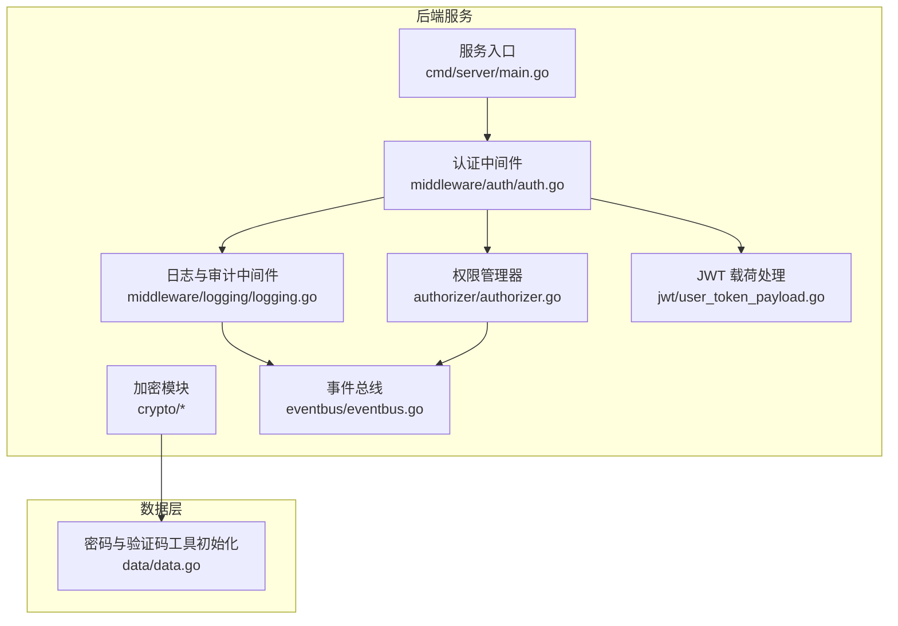
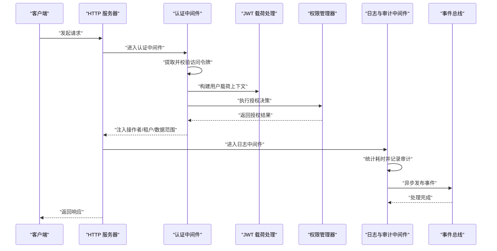
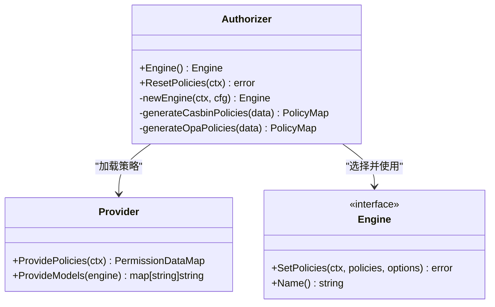
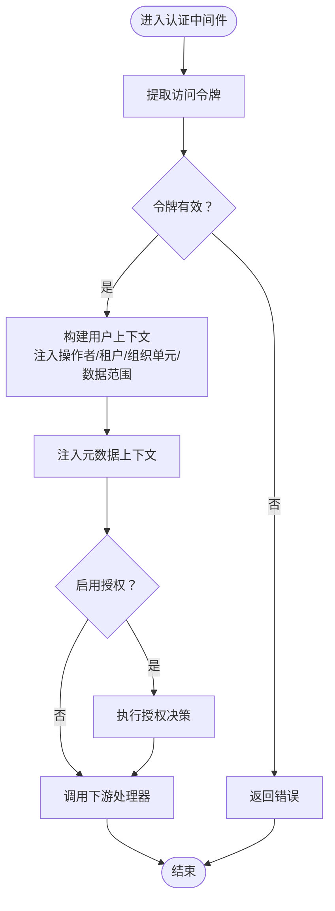
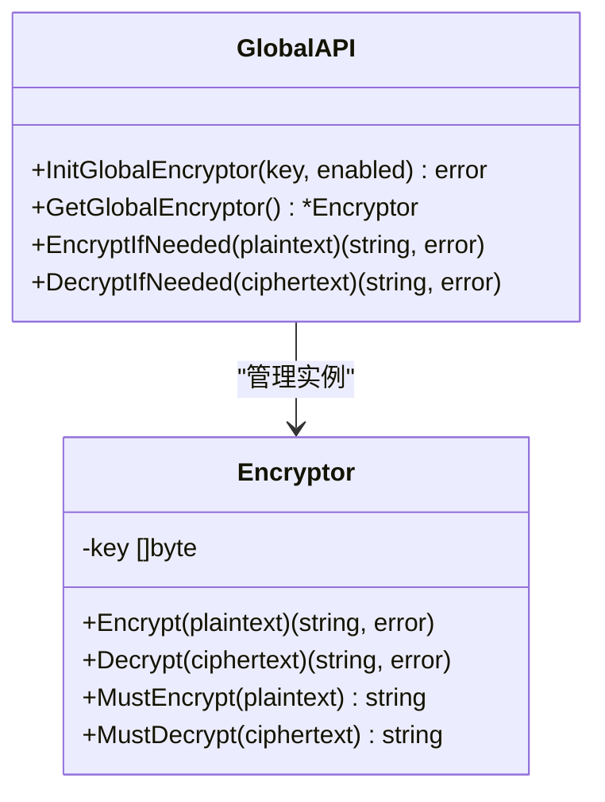
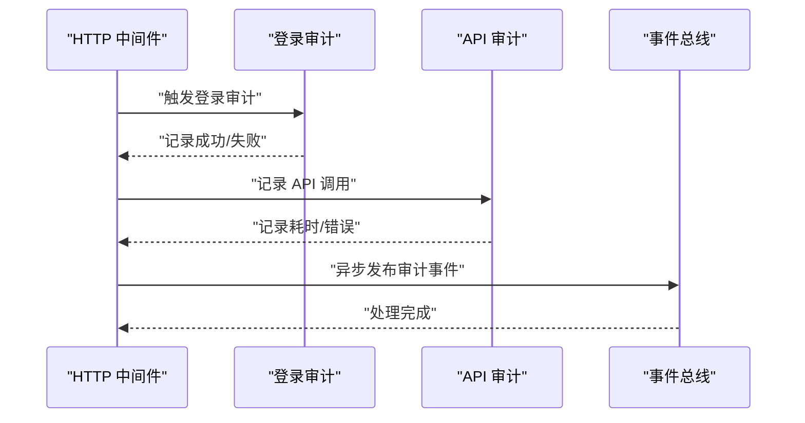
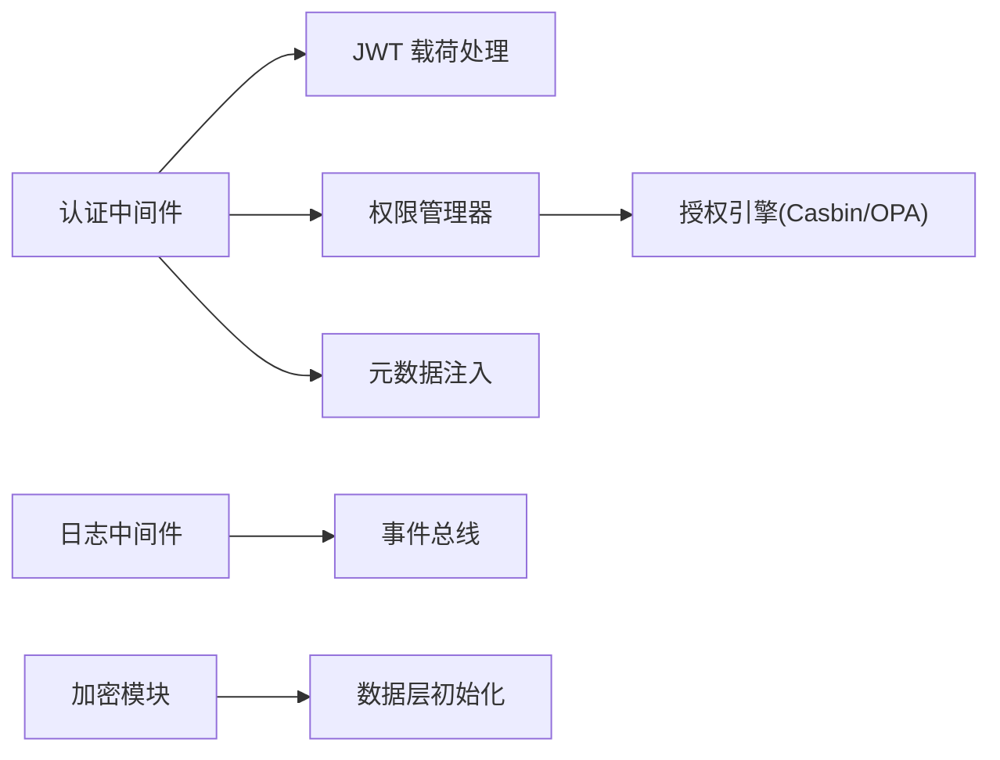

# 安全实践

<cite>
**本文引用的文件**
- [backend/pkg/crypto/encryptor.go](file://backend/pkg/crypto/encryptor.go)
- [backend/pkg/crypto/aes_gcm.go](file://backend/pkg/crypto/aes_gcm.go)
- [backend/pkg/authorizer/authorizer.go](file://backend/pkg/authorizer/authorizer.go)
- [backend/pkg/constants/permission.go](file://backend/pkg/constants/permission.go)
- [backend/pkg/middleware/auth/auth.go](file://backend/pkg/middleware/auth/auth.go)
- [backend/pkg/jwt/user_token_payload.go](file://backend/pkg/jwt/user_token_payload.go)
- [backend/app/admin/service/internal/data/data.go](file://backend/app/admin/service/internal/data/data.go)
- [backend/pkg/middleware/logging/logging.go](file://backend/pkg/middleware/logging/logging.go)
- [backend/pkg/eventbus/eventbus.go](file://backend/pkg/eventbus/eventbus.go)
- [backend/app/admin/service/cmd/server/main.go](file://backend/app/admin/service/cmd/server/main.go)
- [backend/pkg/crypto/payload_test.go](file://backend/pkg/crypto/payload_test.go)
- [backend/pkg/crypto/aes_gcm_test.go](file://backend/pkg/crypto/aes_gcm_test.go)
- [backend/pkg/jwt/user_token_payload_test.go](file://backend/pkg/jwt/user_token_payload_test.go)
- [backend/pkg/authorizer/authorizer_test.go](file://backend/pkg/authorizer/authorizer_test.go)
- [backend/pkg/middleware/auth/auth_test.go](file://backend/pkg/middleware/auth/auth_test.go)
- [backend/pkg/middleware/logging/logging_test.go](file://backend/pkg/middleware/logging/logging_test.go)
- [backend/pkg/eventbus/eventbus_test.go](file://backend/pkg/eventbus/eventbus_test.go)
</cite>

## 目录
1. [简介](#简介)
2. [项目结构](#项目结构)
3. [核心组件](#核心组件)
4. [架构总览](#架构总览)
5. [详细组件分析](#详细组件分析)
6. [依赖分析](#依赖分析)
7. [性能考虑](#性能考虑)
8. [故障排查指南](#故障排查指南)
9. [结论](#结论)
10. [附录](#附录)

## 简介
本指南面向 GoWind Admin 的后端与前端开发者，系统化梳理安全开发实践，覆盖输入验证、SQL 注入防护、XSS 防护、CSRF 防护、权限控制、加密实践以及安全审计。文档以仓库现有实现为依据，结合代码级分析与可视化图示，帮助团队在开发与运维中建立一致、可落地的安全基线。

## 项目结构
后端采用 Kratos 架构，服务通过 Bootstrap 初始化，中间件贯穿认证与授权流程；加密与权限控制分别由独立包提供；日志与事件总线用于审计与可观测性；前端权限与安全策略在前端工程中实现。

**图表来源**
- [backend/app/admin/service/cmd/server/main.go:1-76](file://backend/app/admin/service/cmd/server/main.go#L1-L76)
- [backend/pkg/middleware/auth/auth.go:1-122](file://backend/pkg/middleware/auth/auth.go#L1-L122)
- [backend/pkg/middleware/logging/logging.go:1-52](file://backend/pkg/middleware/logging/logging.go#L1-L52)
- [backend/pkg/authorizer/authorizer.go:1-241](file://backend/pkg/authorizer/authorizer.go#L1-L241)
- [backend/pkg/jwt/user_token_payload.go:1-279](file://backend/pkg/jwt/user_token_payload.go#L1-L279)
- [backend/pkg/crypto/encryptor.go:1-55](file://backend/pkg/crypto/encryptor.go#L1-L55)
- [backend/pkg/crypto/aes_gcm.go:1-154](file://backend/pkg/crypto/aes_gcm.go#L1-L154)
- [backend/pkg/eventbus/eventbus.go:1-214](file://backend/pkg/eventbus/eventbus.go#L1-L214)
- [backend/app/admin/service/internal/data/data.go:1-63](file://backend/app/admin/service/internal/data/data.go#L1-L63)

**章节来源**
- [backend/app/admin/service/cmd/server/main.go:1-76](file://backend/app/admin/service/cmd/server/main.go#L1-L76)
- [backend/pkg/middleware/auth/auth.go:1-122](file://backend/pkg/middleware/auth/auth.go#L1-L122)
- [backend/pkg/middleware/logging/logging.go:1-52](file://backend/pkg/middleware/logging/logging.go#L1-L52)
- [backend/pkg/authorizer/authorizer.go:1-241](file://backend/pkg/authorizer/authorizer.go#L1-L241)
- [backend/pkg/jwt/user_token_payload.go:1-279](file://backend/pkg/jwt/user_token_payload.go#L1-L279)
- [backend/pkg/crypto/encryptor.go:1-55](file://backend/pkg/crypto/encryptor.go#L1-L55)
- [backend/pkg/crypto/aes_gcm.go:1-154](file://backend/pkg/crypto/aes_gcm.go#L1-L154)
- [backend/pkg/eventbus/eventbus.go:1-214](file://backend/pkg/eventbus/eventbus.go#L1-L214)
- [backend/app/admin/service/internal/data/data.go:1-63](file://backend/app/admin/service/internal/data/data.go#L1-L63)

## 核心组件
- 认证与授权中间件：统一从请求元数据提取访问令牌，校验有效性，并注入操作者、租户、组织单元与数据范围上下文，随后进行鉴权决策。
- 权限管理器：支持多种授权引擎（如 Casbin、OPA），从提供者加载策略并注入到引擎，实现细粒度 API 访问控制。
- 加密模块：提供 AES-256-GCM 对称加密，支持全局开关与前缀标记，便于透明加密与解密。
- 日志与审计：HTTP 请求进入后统计耗时并记录登录与 API 审计日志，配合事件总线异步处理。
- 密码与验证码：内置 bcrypt 密码加密与 Redis 验证码生成，保障凭证安全与防刷。
- 事件总线：提供订阅/发布模型，支持一次性处理器与异步发布，便于扩展审计与告警。

**章节来源**
- [backend/pkg/middleware/auth/auth.go:1-122](file://backend/pkg/middleware/auth/auth.go#L1-L122)
- [backend/pkg/authorizer/authorizer.go:1-241](file://backend/pkg/authorizer/authorizer.go#L1-L241)
- [backend/pkg/crypto/encryptor.go:1-55](file://backend/pkg/crypto/encryptor.go#L1-L55)
- [backend/pkg/crypto/aes_gcm.go:1-154](file://backend/pkg/crypto/aes_gcm.go#L1-L154)
- [backend/pkg/middleware/logging/logging.go:1-52](file://backend/pkg/middleware/logging/logging.go#L1-L52)
- [backend/app/admin/service/internal/data/data.go:1-63](file://backend/app/admin/service/internal/data/data.go#L1-L63)
- [backend/pkg/eventbus/eventbus.go:1-214](file://backend/pkg/eventbus/eventbus.go#L1-L214)

## 架构总览
下图展示请求在服务中的安全处理路径：认证中间件负责令牌解析与注入，授权中间件基于策略引擎进行访问控制，日志中间件记录审计信息，事件总线异步处理后续动作。

**图表来源**
- [backend/pkg/middleware/auth/auth.go:1-122](file://backend/pkg/middleware/auth/auth.go#L1-L122)
- [backend/pkg/jwt/user_token_payload.go:1-279](file://backend/pkg/jwt/user_token_payload.go#L1-L279)
- [backend/pkg/authorizer/authorizer.go:1-241](file://backend/pkg/authorizer/authorizer.go#L1-L241)
- [backend/pkg/middleware/logging/logging.go:1-52](file://backend/pkg/middleware/logging/logging.go#L1-L52)
- [backend/pkg/eventbus/eventbus.go:1-214](file://backend/pkg/eventbus/eventbus.go#L1-L214)

## 详细组件分析

### 输入验证与参数校验
- 类型与长度约束：建议在 API 层对字符串长度、数值范围进行显式校验；对布尔、枚举字段进行白名单校验。
- 特殊字符过滤：对路径参数、查询参数与表单字段进行最小必要集过滤，避免注入与跨站风险。
- ORM 查询：优先使用结构化查询或预编译参数，避免拼接 SQL 字符串。
- 动态 SQL：若必须拼接，确保仅允许白名单内的关键字与列名，严格转义与参数化。

说明：上述为通用安全原则，具体实现需结合各服务的 API 定义与数据访问层。

### SQL 注入防护
- 预编译语句：使用数据库驱动提供的预编译接口，避免字符串拼接。
- ORM 安全查询：通过实体模型与谓词构造查询，避免手写 SQL。
- 动态 SQL 验证：对动态拼接的 SQL 进行白名单校验与最小权限授权。

说明：本项目使用 Ent ORM，其生成的谓词与查询接口天然具备参数化能力，建议在数据访问层统一通过 Ent 执行查询。

### XSS 防护
- 输出编码：对所有动态输出进行 HTML 编码，避免脚本注入。
- 内容安全策略（CSP）：在响应头中设置严格的 CSP 策略，限制脚本来源与执行。
- 富文本过滤：对富文本输入使用白名单标签与属性，移除潜在危险标签与脚本。

说明：本节为通用防护建议，具体实现需在前端渲染与模板输出处落实。

### CSRF 防护
- 令牌验证：在表单与敏感请求中引入一次性 CSRF 令牌，服务端严格校验。
- 同源策略：严格校验来源域名与来源头，拒绝跨域非预期来源。
- 安全头设置：启用 SameSite Cookie、Strict-Transport-Security、Referrer-Policy 等安全头。

说明：本节为通用防护建议，具体实现需在前端与服务端中间件中协同完成。

### 权限控制（RBAC）
- 授权引擎：支持 Casbin、OPA 等引擎，策略由提供者加载并注入。
- 策略规则：基于角色、路径与方法生成策略，支持多引擎统一管理。
- 数据权限：通过用户上下文注入数据范围（如租户、组织单元），在查询层应用数据范围过滤。

**图表来源**
- [backend/pkg/authorizer/authorizer.go:1-241](file://backend/pkg/authorizer/authorizer.go#L1-L241)

**章节来源**
- [backend/pkg/authorizer/authorizer.go:1-241](file://backend/pkg/authorizer/authorizer.go#L1-L241)
- [backend/pkg/constants/permission.go:1-39](file://backend/pkg/constants/permission.go#L1-L39)

### 认证中间件与令牌处理
- 令牌提取：从元数据中提取 Bearer 令牌并校验有效性。
- 上下文注入：注入操作者 ID、租户 ID、组织单元 ID、数据范围等。
- 鉴权集成：可选启用授权中间件，基于策略引擎进行访问控制。
- JWT 载荷：定义标准声明字段（用户名、用户 ID、租户 ID、角色码、数据范围、设备/客户端 ID 等），并提供过期与生效时间判断。

**图表来源**
- [backend/pkg/middleware/auth/auth.go:1-122](file://backend/pkg/middleware/auth/auth.go#L1-L122)
- [backend/pkg/jwt/user_token_payload.go:1-279](file://backend/pkg/jwt/user_token_payload.go#L1-L279)

**章节来源**
- [backend/pkg/middleware/auth/auth.go:1-122](file://backend/pkg/middleware/auth/auth.go#L1-L122)
- [backend/pkg/jwt/user_token_payload.go:1-279](file://backend/pkg/jwt/user_token_payload.go#L1-L279)

### 加密实践
- 对称加密：AES-256-GCM，自动派生 32 字节密钥，随机 Nonce，Base64 编码输出并带前缀标识。
- 全局开关：可通过初始化函数启用/禁用加密，禁用时返回明文。
- 透明加解密：提供便捷函数在需要时进行加密或解密。
- 测试覆盖：包含加密/解密与负载加密的测试用例，验证行为正确性。

**图表来源**
- [backend/pkg/crypto/encryptor.go:1-55](file://backend/pkg/crypto/encryptor.go#L1-L55)
- [backend/pkg/crypto/aes_gcm.go:1-154](file://backend/pkg/crypto/aes_gcm.go#L1-L154)

**章节来源**
- [backend/pkg/crypto/encryptor.go:1-55](file://backend/pkg/crypto/encryptor.go#L1-L55)
- [backend/pkg/crypto/aes_gcm.go:1-154](file://backend/pkg/crypto/aes_gcm.go#L1-L154)
- [backend/pkg/crypto/payload_test.go:179-211](file://backend/pkg/crypto/payload_test.go#L179-L211)
- [backend/pkg/crypto/aes_gcm_test.go](file://backend/pkg/crypto/aes_gcm_test.go)
- [backend/pkg/crypto/encryptor.go:1-55](file://backend/pkg/crypto/encryptor.go#L1-L55)

### 安全审计与日志
- 登录审计：记录登录/登出操作，便于追踪用户行为。
- API 审计：记录请求耗时、状态码与错误信息，辅助问题定位。
- 事件总线：支持异步发布事件，避免阻塞主请求链路，适合扩展审计与告警。

**图表来源**
- [backend/pkg/middleware/logging/logging.go:1-52](file://backend/pkg/middleware/logging/logging.go#L1-L52)
- [backend/pkg/eventbus/eventbus.go:1-214](file://backend/pkg/eventbus/eventbus.go#L1-L214)

**章节来源**
- [backend/pkg/middleware/logging/logging.go:1-52](file://backend/pkg/middleware/logging/logging.go#L1-L52)
- [backend/pkg/eventbus/eventbus.go:1-214](file://backend/pkg/eventbus/eventbus.go#L1-L214)

### 凭证与验证码
- 密码加密：使用 bcrypt 进行哈希，保证不可逆与抗彩虹表。
- 验证码：基于 Redis 存储，设置过期时间与键前缀，防止暴力破解。

**章节来源**
- [backend/app/admin/service/internal/data/data.go:1-63](file://backend/app/admin/service/internal/data/data.go#L1-L63)

## 依赖分析
- 认证中间件依赖 JWT 载荷处理与授权引擎，同时向下游注入元数据与 Ent Viewer。
- 权限管理器根据配置选择授权引擎，策略由提供者提供。
- 加密模块与数据层初始化相互独立，但可被业务逻辑按需调用。
- 日志中间件与事件总线解耦，便于扩展审计与异步处理。

**图表来源**
- [backend/pkg/middleware/auth/auth.go:1-122](file://backend/pkg/middleware/auth/auth.go#L1-L122)
- [backend/pkg/jwt/user_token_payload.go:1-279](file://backend/pkg/jwt/user_token_payload.go#L1-L279)
- [backend/pkg/authorizer/authorizer.go:1-241](file://backend/pkg/authorizer/authorizer.go#L1-L241)
- [backend/pkg/middleware/logging/logging.go:1-52](file://backend/pkg/middleware/logging/logging.go#L1-L52)
- [backend/pkg/eventbus/eventbus.go:1-214](file://backend/pkg/eventbus/eventbus.go#L1-L214)
- [backend/pkg/crypto/encryptor.go:1-55](file://backend/pkg/crypto/encryptor.go#L1-L55)
- [backend/app/admin/service/internal/data/data.go:1-63](file://backend/app/admin/service/internal/data/data.go#L1-L63)

**章节来源**
- [backend/pkg/middleware/auth/auth.go:1-122](file://backend/pkg/middleware/auth/auth.go#L1-L122)
- [backend/pkg/authorizer/authorizer.go:1-241](file://backend/pkg/authorizer/authorizer.go#L1-L241)
- [backend/pkg/middleware/logging/logging.go:1-52](file://backend/pkg/middleware/logging/logging.go#L1-L52)
- [backend/pkg/crypto/encryptor.go:1-55](file://backend/pkg/crypto/encryptor.go#L1-L55)
- [backend/app/admin/service/internal/data/data.go:1-63](file://backend/app/admin/service/internal/data/data.go#L1-L63)

## 性能考虑
- 中间件链路：尽量减少不必要的上下文转换与重复计算，避免在热路径中进行昂贵操作。
- 事件总线：异步发布降低同步阻塞，但需注意资源清理与超时控制。
- 加密开销：对大体量数据的加密应谨慎，优先在必要场景使用，避免影响吞吐。
- 缓存与验证码：验证码与会话缓存使用 Redis，注意连接池与过期策略，防止热点与内存膨胀。

## 故障排查指南
- 认证失败：检查令牌格式、签名与有效期；确认中间件已正确注入上下文。
- 授权拒绝：核对策略规则与角色映射，确认授权引擎已加载最新策略。
- 加密异常：确认密钥长度与初始化状态，检查前缀与编码格式。
- 审计缺失：检查日志中间件是否注册，事件总线是否正常运行。
- 性能问题：关注中间件耗时、事件总线异步队列积压与加密操作频率。

**章节来源**
- [backend/pkg/middleware/auth/auth.go:1-122](file://backend/pkg/middleware/auth/auth.go#L1-L122)
- [backend/pkg/authorizer/authorizer.go:1-241](file://backend/pkg/authorizer/authorizer.go#L1-L241)
- [backend/pkg/crypto/encryptor.go:1-55](file://backend/pkg/crypto/encryptor.go#L1-L55)
- [backend/pkg/middleware/logging/logging.go:1-52](file://backend/pkg/middleware/logging/logging.go#L1-L52)
- [backend/pkg/eventbus/eventbus.go:1-214](file://backend/pkg/eventbus/eventbus.go#L1-L214)

## 结论
本指南基于仓库现有实现，总结了 GoWind Admin 在认证授权、加密、审计与中间件方面的安全实践要点。建议在实际开发中将输入验证、SQL 注入防护、XSS 与 CSRF 防护作为默认约束纳入 API 设计与实现流程，并持续完善测试与监控体系，确保系统在演进过程中保持一致的安全基线。

## 附录
- 测试参考：加密、JWT、授权与日志中间件均配有测试用例，可作为集成与回归测试的参考。
- 配置与部署：服务启动入口集中于服务命令文件，建议在生产环境开启必要的安全头与审计日志。

**章节来源**
- [backend/pkg/crypto/payload_test.go:179-211](file://backend/pkg/crypto/payload_test.go#L179-L211)
- [backend/pkg/crypto/aes_gcm_test.go](file://backend/pkg/crypto/aes_gcm_test.go)
- [backend/pkg/jwt/user_token_payload_test.go](file://backend/pkg/jwt/user_token_payload_test.go)
- [backend/pkg/authorizer/authorizer_test.go](file://backend/pkg/authorizer/authorizer_test.go)
- [backend/pkg/middleware/auth/auth_test.go](file://backend/pkg/middleware/auth/auth_test.go)
- [backend/pkg/middleware/logging/logging_test.go](file://backend/pkg/middleware/logging/logging_test.go)
- [backend/pkg/eventbus/eventbus_test.go](file://backend/pkg/eventbus/eventbus_test.go)
- [backend/app/admin/service/cmd/server/main.go:1-76](file://backend/app/admin/service/cmd/server/main.go#L1-L76)