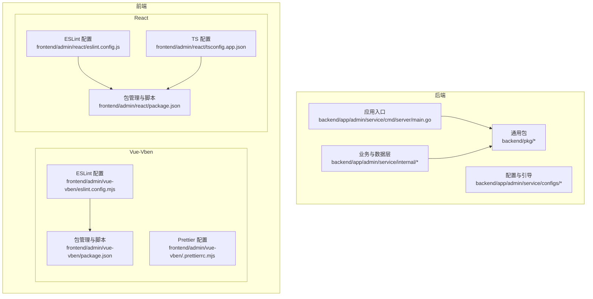
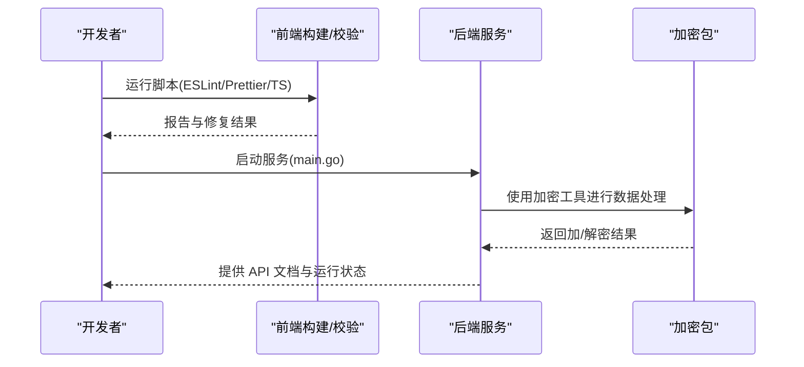
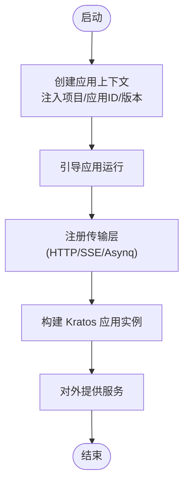
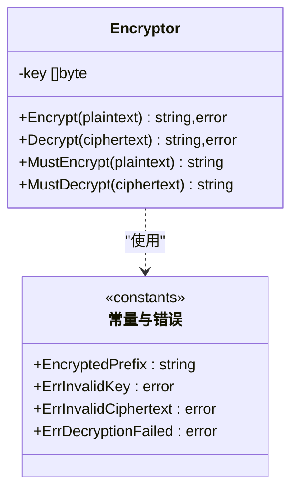
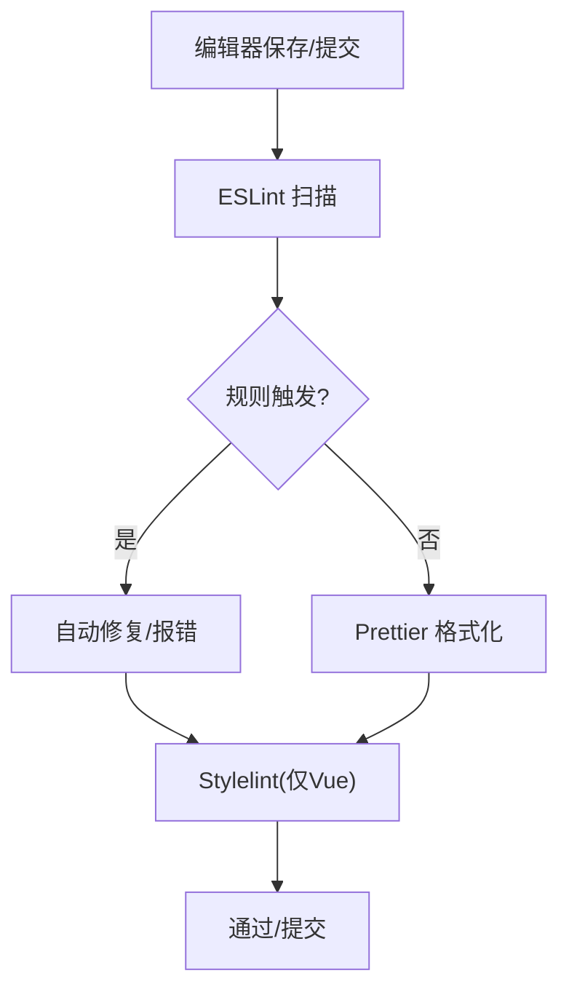
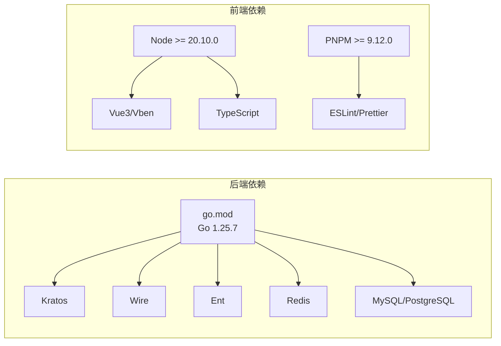

# 开发规范

<cite>
**本文引用的文件**
- [go.mod](file://backend/go.mod)
- [main.go](file://backend/app/admin/service/cmd/server/main.go)
- [aes_gcm.go](file://backend/pkg/crypto/aes_gcm.go)
- [.markdownlint.yaml](file://backend/.markdownlint.yaml)
- [.yamllint](file://backend/.yamllint)
- [eslint.config.mjs](file://frontend/admin/vue-vben/eslint.config.mjs)
- [.prettierrc.mjs](file://frontend/admin/vue-vben/.prettierrc.mjs)
- [eslint.config.js](file://frontend/admin/react/eslint.config.js)
- [tsconfig.app.json](file://frontend/admin/react/tsconfig.app.json)
- [package.json](file://frontend/admin/vue-vben/package.json)
- [package.json](file://frontend/admin/react/package.json)
- [README.md](file://README.md)
</cite>

## 目录
1. [简介](#简介)
2. [项目结构](#项目结构)
3. [核心组件](#核心组件)
4. [架构总览](#架构总览)
5. [详细组件分析](#详细组件分析)
6. [依赖分析](#依赖分析)
7. [性能考虑](#性能考虑)
8. [故障排查指南](#故障排查指南)
9. [结论](#结论)
10. [附录](#附录)

## 简介
本开发规范旨在统一 GoWind Admin 项目的代码风格、命名约定、注释规范、Git 提交与 PR 流程、代码审查清单，并结合项目现有配置与示例文件，给出可操作的实践建议与对比示例路径，帮助团队在前后端协同开发中保持一致性与高质量。

## 项目结构
项目采用前后端分离的多框架架构：
- 后端：基于 Go 语言与 Kratos 微服务框架，采用模块化与分层结构，包含服务入口、配置、中间件、工具包等。
- 前端：提供 Vue3/Vben 与 React 两套实现，分别配置了 ESLint、Prettier、TypeScript 等工具链。

**图表来源**
- [main.go:1-76](file://backend/app/admin/service/cmd/server/main.go#L1-L76)
- [eslint.config.mjs:1-6](file://frontend/admin/vue-vben/eslint.config.mjs#L1-L6)
- [.prettierrc.mjs:1-2](file://frontend/admin/vue-vben/.prettierrc.mjs#L1-L2)
- [eslint.config.js:1-140](file://frontend/admin/react/eslint.config.js#L1-L140)
- [tsconfig.app.json:1-30](file://frontend/admin/react/tsconfig.app.json#L1-L30)
- [package.json:1-118](file://frontend/admin/vue-vben/package.json#L1-L118)
- [package.json:1-82](file://frontend/admin/react/package.json#L1-L82)

**章节来源**
- [README.md:1-185](file://README.md#L1-L185)
- [main.go:1-76](file://backend/app/admin/service/cmd/server/main.go#L1-L76)

## 核心组件
- 后端服务入口与引导：负责应用上下文、HTTP/异步/SSE 传输与服务注册。
- 加密工具包：提供 AES-256-GCM 加解密与错误处理，便于安全存储与传输。
- 前端 ESLint/Prettier 配置：统一代码风格与静态检查规则。
- TypeScript 配置：约束类型检查与构建行为。

**章节来源**
- [main.go:46-75](file://backend/app/admin/service/cmd/server/main.go#L46-L75)
- [aes_gcm.go:1-154](file://backend/pkg/crypto/aes_gcm.go#L1-L154)
- [eslint.config.mjs:1-6](file://frontend/admin/vue-vben/eslint.config.mjs#L1-L6)
- [eslint.config.js:1-140](file://frontend/admin/react/eslint.config.js#L1-L140)
- [tsconfig.app.json:1-30](file://frontend/admin/react/tsconfig.app.json#L1-L30)

## 架构总览
后端通过 Kratos 引导应用，整合 HTTP、异步队列与 SSE 传输；前端通过各自工具链保证代码质量与一致性。

**图表来源**
- [main.go:60-75](file://backend/app/admin/service/cmd/server/main.go#L60-L75)
- [aes_gcm.go:46-130](file://backend/pkg/crypto/aes_gcm.go#L46-L130)
- [eslint.config.js:7-139](file://frontend/admin/react/eslint.config.js#L7-L139)
- [eslint.config.mjs:1-6](file://frontend/admin/vue-vben/eslint.config.mjs#L1-L6)

## 详细组件分析

### 后端服务入口与引导
- 应用上下文与版本注入，确保服务元信息一致。
- 传输层集成 HTTP、异步队列与 SSE，便于扩展。
- 引导器封装应用生命周期与配置加载。

**图表来源**
- [main.go:46-75](file://backend/app/admin/service/cmd/server/main.go#L46-L75)

**章节来源**
- [main.go:46-75](file://backend/app/admin/service/cmd/server/main.go#L46-L75)

### 加密工具包（AES-256-GCM）
- 关键字派生：使用 SHA-256 将任意长度密钥转换为 32 字节。
- 前缀标记：密文以特定前缀区分明文，提升兼容性。
- 错误处理：明确的错误类型与包装，便于定位问题。
- 工具方法：提供加密/解密、检测是否加密、测试辅助等。

**图表来源**
- [aes_gcm.go:15-154](file://backend/pkg/crypto/aes_gcm.go#L15-L154)

**章节来源**
- [aes_gcm.go:1-154](file://backend/pkg/crypto/aes_gcm.go#L1-L154)

### 前端 ESLint 与 Prettier 配置
- Vue-Vben：使用统一的配置包，简化维护成本。
- React：自定义规则集，覆盖常用 ESLint 规则与 React Hooks 校验。
- TS 配置：严格类型检查与构建选项，减少运行时风险。

**图表来源**
- [eslint.config.mjs:1-6](file://frontend/admin/vue-vben/eslint.config.mjs#L1-L6)
- [.prettierrc.mjs:1-2](file://frontend/admin/vue-vben/.prettierrc.mjs#L1-L2)
- [eslint.config.js:1-140](file://frontend/admin/react/eslint.config.js#L1-L140)
- [tsconfig.app.json:1-30](file://frontend/admin/react/tsconfig.app.json#L1-L30)

**章节来源**
- [eslint.config.mjs:1-6](file://frontend/admin/vue-vben/eslint.config.mjs#L1-L6)
- [.prettierrc.mjs:1-2](file://frontend/admin/vue-vben/.prettierrc.mjs#L1-L2)
- [eslint.config.js:1-140](file://frontend/admin/react/eslint.config.js#L1-L140)
- [tsconfig.app.json:1-30](file://frontend/admin/react/tsconfig.app.json#L1-L30)

## 依赖分析
- 后端依赖：Kratos、Wire、Ent、Redis、MySQL/PostgreSQL、gRPC、OpenAPI、Casbin/Opa 等。
- 前端依赖：Vue3、React、Ant Design、Vite、ESLint、Prettier、TypeScript 等。
- 版本与引擎：Go 语言版本、Node/PNPM 版本要求在配置中明确。

**图表来源**
- [go.mod:1-65](file://backend/go.mod#L1-L65)
- [package.json:70-75](file://frontend/admin/vue-vben/package.json#L70-L75)
- [package.json:1-82](file://frontend/admin/react/package.json#L1-L82)

**章节来源**
- [go.mod:1-65](file://backend/go.mod#L1-L65)
- [package.json:70-75](file://frontend/admin/vue-vben/package.json#L70-L75)
- [package.json:1-82](file://frontend/admin/react/package.json#L1-L82)

## 性能考虑
- 后端传输层：合理配置 HTTP/SSE/异步队列，避免阻塞与资源泄露。
- 前端构建：利用 Vite/Turbo 的增量构建与缓存，减少冷启动时间。
- 类型检查：开启严格的 TS 规则，提前发现潜在性能与稳定性问题。
- 依赖版本：遵循后端/前端引擎版本要求，避免兼容性导致的性能回退。

[本节为通用指导，无需列出具体文件来源]

## 故障排查指南
- Markdown 与 YAML 规则：关闭部分严格限制，便于协作与兼容。
- 前端脚本：统一使用包管理器脚本进行格式化、类型检查与依赖检查。
- 后端服务：通过引导器注入上下文与版本，便于诊断与可观测性。

**章节来源**
- [.markdownlint.yaml:1-4](file://backend/.markdownlint.yaml#L1-L4)
- [.yamllint:1-10](file://backend/.yamllint#L1-L10)
- [package.json:7-34](file://frontend/admin/vue-vben/package.json#L7-L34)
- [package.json:7-12](file://frontend/admin/react/package.json#L7-L12)

## 结论
通过统一的工具链配置、清晰的组件职责与严格的依赖版本管理，GoWind Admin 在前后端实现了高一致性与可维护性。建议在日常开发中严格遵循本文规范，并结合项目现有配置持续优化工作流。

[本节为总结，无需列出具体文件来源]

## 附录

### 代码风格与命名约定
- Go 语言
  - 包名与目录：采用小写、简短、语义化命名，避免复数与下划线。
  - 变量与常量：采用驼峰或帕斯卡命名，常量使用全大写与下划线组合。
  - 函数与方法：采用帕斯卡命名，返回错误时使用包装与错误类型。
  - 接口：以 -er 结尾或抽象名词，如 Reader、Writer。
  - 文件：采用小写、下划线或连字符，避免空格与特殊字符。
- TypeScript/JavaScript
  - 变量与函数：采用驼峰命名，避免下划线。
  - 类与接口：采用帕斯卡命名，接口前缀 I 或抽象名词。
  - 常量：全大写与下划线，位于模块顶层。
  - 文件：采用小写，按功能分层组织，避免跨层引用。
- Vue/React 组件
  - 组件文件：帕斯卡命名，与组件名称一致。
  - 组合式函数：useXxx 命名，便于识别。
  - 样式：按功能模块划分，避免全局污染。

[本节为通用规范，无需列出具体文件来源]

### 注释规范
- Go
  - 包注释：简洁说明包用途与关键接口。
  - 导出类型/函数：提供简要说明与参数/返回值含义。
  - 复杂逻辑：在函数/方法内部使用行内注释解释关键步骤。
- TypeScript/JavaScript
  - 函数/类：使用 JSDoc 风格注释，说明入参、返回值与异常。
  - 复杂表达式：在上方注释解释计算目的与边界条件。
  - 组件：说明 props、事件与行为。
- Vue/React
  - 组件：说明用途、属性、事件与插槽。
  - Hook：说明输入、输出与副作用。

[本节为通用规范，无需列出具体文件来源]

### Git 提交与 PR 规范
- 提交消息格式
  - 类型: 简洁主题
  - 内容: 说明变更动机、影响范围与注意事项
  - 示例路径：[提交脚本](file://frontend/admin/vue-vben/package.json#L19)
- 分支命名
  - feat/xxx：新功能
  - fix/xxx：缺陷修复
  - refactor/xxx：重构
  - docs/xxx：文档更新
- PR 规范
  - 标题与描述清晰，关联 Issue
  - 通过 CI 与代码审查
  - 保持最小变更集，附带测试或验证说明

[本节为通用规范，无需列出具体文件来源]

### 代码审查清单
- 安全性
  - 密钥与敏感信息：不硬编码，使用环境变量或安全存储；参考加密包的错误处理与前缀标记。
  - 输入校验：对用户输入与外部数据进行严格校验。
- 性能
  - 循环与递归：避免重复计算与深层嵌套。
  - 异步与并发：合理使用 Promise/Async/Await，避免阻塞主线程。
- 兼容性
  - 依赖版本：遵循后端/前端引擎版本要求。
  - 浏览器与 Node：按目标平台编写与测试。
- 可维护性
  - 命名一致性：遵循上述命名约定。
  - 注释与文档：关键流程与决策点有注释。
  - 单元测试：覆盖核心逻辑与边界条件。

**章节来源**
- [aes_gcm.go:15-24](file://backend/pkg/crypto/aes_gcm.go#L15-L24)
- [go.mod](file://backend/go.mod#L3)
- [package.json:70-75](file://frontend/admin/vue-vben/package.json#L70-L75)
- [package.json:1-82](file://frontend/admin/react/package.json#L1-L82)