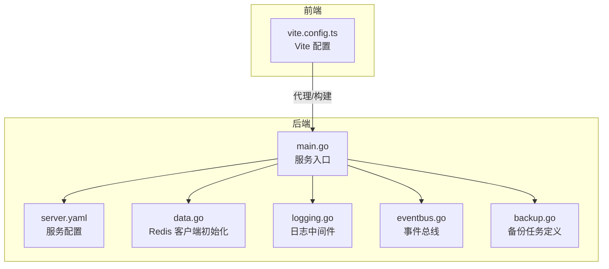
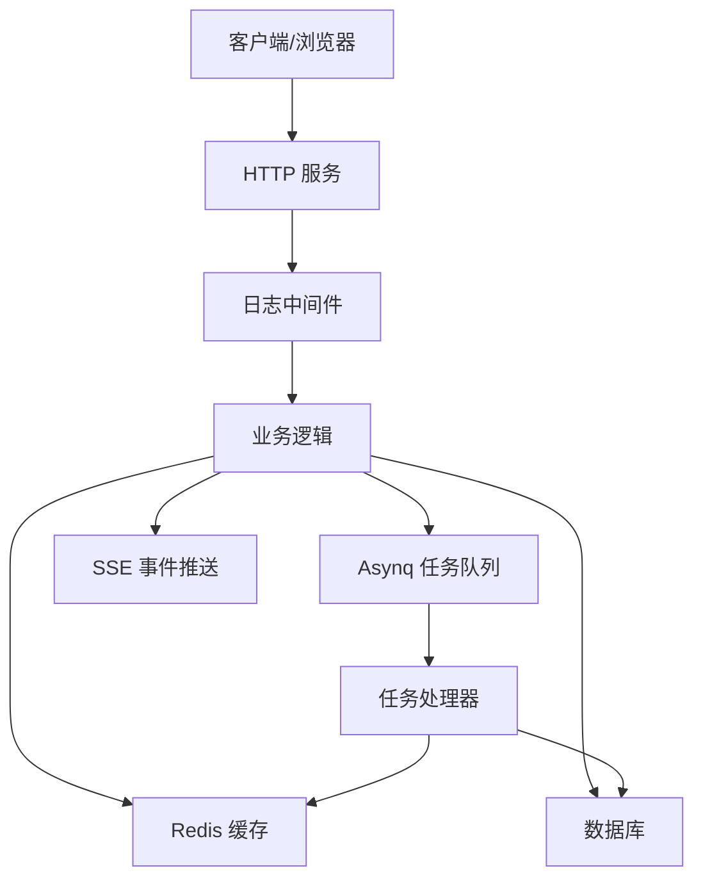
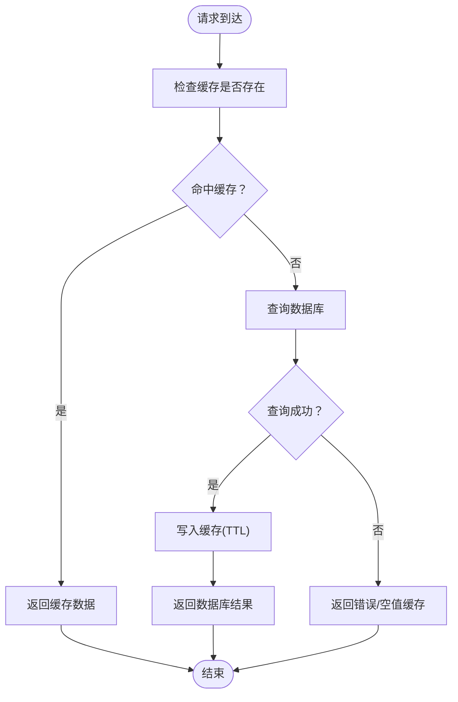
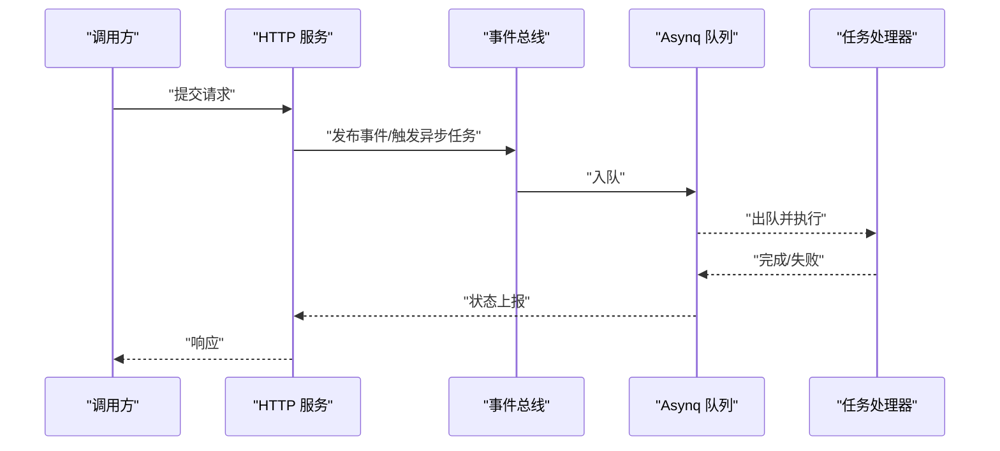
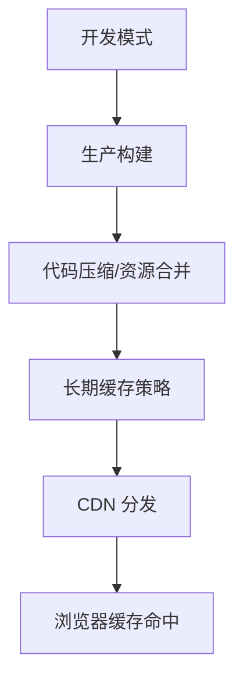
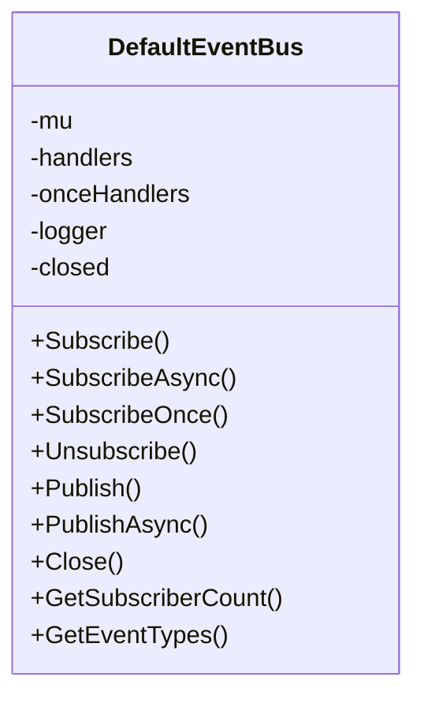
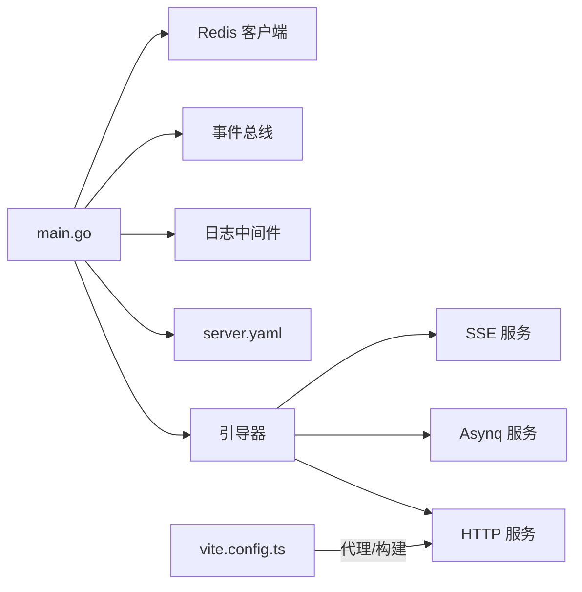

# 性能优化

<cite>
**本文引用的文件**
- [main.go](file://backend/app/admin/service/cmd/server/main.go)
- [server.yaml](file://backend/app/admin/service/configs/server.yaml)
- [data.go](file://backend/app/admin/service/internal/data/data.go)
- [logging.go](file://backend/pkg/middleware/logging/logging.go)
- [eventbus.go](file://backend/pkg/eventbus/eventbus.go)
- [backup.go](file://backend/pkg/task/backup.go)
- [vite.config.ts](file://frontend/admin/react/vite.config.ts)
</cite>

## 目录
1. [简介](#简介)
2. [项目结构](#项目结构)
3. [核心组件](#核心组件)
4. [架构总览](#架构总览)
5. [详细组件分析](#详细组件分析)
6. [依赖分析](#依赖分析)
7. [性能考虑](#性能考虑)
8. [故障排查指南](#故障排查指南)
9. [结论](#结论)
10. [附录](#附录)

## 简介
本指南面向 GoWind Admin 后端与前端的性能优化实践，聚焦以下方面：
- 数据库查询优化：索引设计、查询语句优化、批量操作、连接池配置
- 缓存策略：Redis 缓存、本地缓存、缓存失效策略、缓存穿透防护
- 异步处理优化：任务队列配置、并发控制、资源限制、错误重试机制
- 前端性能优化：组件懒加载、路由懒加载、图片优化、资源压缩
- 内存管理优化：对象池、垃圾回收、内存泄漏检测
- 监控指标：响应时间、吞吐量、资源使用率等关键指标的监控与分析方法

## 项目结构
后端采用 Kratos 框架，服务入口通过引导器启动 HTTP、异步（Asynq）与 SSE 服务；前端基于 Vite 构建，提供开发与生产构建配置。

图示来源
- [main.go:1-76](file://backend/app/admin/service/cmd/server/main.go#L1-L76)
- [server.yaml:1-49](file://backend/app/admin/service/configs/server.yaml#L1-L49)
- [data.go:1-63](file://backend/app/admin/service/internal/data/data.go#L1-L63)
- [logging.go:1-52](file://backend/pkg/middleware/logging/logging.go#L1-L52)
- [eventbus.go:1-214](file://backend/pkg/eventbus/eventbus.go#L1-L214)
- [backup.go:1-19](file://backend/pkg/task/backup.go#L1-L19)
- [vite.config.ts:1-47](file://frontend/admin/react/vite.config.ts#L1-L47)

章节来源
- [main.go:1-76](file://backend/app/admin/service/cmd/server/main.go#L1-L76)
- [server.yaml:1-49](file://backend/app/admin/service/configs/server.yaml#L1-L49)
- [data.go:1-63](file://backend/app/admin/service/internal/data/data.go#L1-L63)
- [logging.go:1-52](file://backend/pkg/middleware/logging/logging.go#L1-L52)
- [eventbus.go:1-214](file://backend/pkg/eventbus/eventbus.go#L1-L214)
- [backup.go:1-19](file://backend/pkg/task/backup.go#L1-L19)
- [vite.config.ts:1-47](file://frontend/admin/react/vite.config.ts#L1-L47)

## 核心组件
- 服务入口与引导：通过引导器启动 HTTP、Asynq 与 SSE 服务，统一生命周期管理。
- 中间件：日志中间件统计请求耗时，并记录登录与 API 审计日志。
- 事件总线：支持同步与一次性订阅、异步发布、关闭清理与订阅者统计。
- 缓存：内置 Redis 客户端初始化与验证码缓存前缀配置。
- 异步任务：备份任务类型常量与任务 ID 规则定义。
- 前端构建：Vite 开发服务器、代理、插件与构建选项配置。

章节来源
- [main.go:46-75](file://backend/app/admin/service/cmd/server/main.go#L46-L75)
- [logging.go:14-51](file://backend/pkg/middleware/logging/logging.go#L14-L51)
- [eventbus.go:12-34](file://backend/pkg/eventbus/eventbus.go#L12-L34)
- [data.go:23-62](file://backend/app/admin/service/internal/data/data.go#L23-L62)
- [backup.go:5-18](file://backend/pkg/task/backup.go#L5-L18)
- [vite.config.ts:6-46](file://frontend/admin/react/vite.config.ts#L6-L46)

## 架构总览
后端服务由 HTTP 入口接收请求，经中间件处理后进入业务逻辑；异步任务通过 Asynq 队列执行；事件总线用于模块解耦；前端通过 Vite 提供开发与构建能力。

图示来源
- [main.go:46-57](file://backend/app/admin/service/cmd/server/main.go#L46-L57)
- [server.yaml:30-48](file://backend/app/admin/service/configs/server.yaml#L30-L48)
- [logging.go:31-50](file://backend/pkg/middleware/logging/logging.go#L31-L50)
- [data.go:23-39](file://backend/app/admin/service/internal/data/data.go#L23-L39)

## 详细组件分析

### 数据库查询优化
- 索引设计
  - 建议对高频查询字段建立合适索引，避免全表扫描；对多列过滤条件建立复合索引以提升命中率。
  - 对排序与分页字段建立覆盖索引，减少回表与排序成本。
- 查询语句优化
  - 使用 EXPLAIN 分析慢查询，避免 SELECT *，仅取必要字段。
  - 将复杂联表查询拆分为多次简单查询或使用物化视图/派生表。
- 批量操作
  - 使用批量插入/更新/删除减少往返次数；控制单批大小，避免事务过长。
- 连接池配置
  - 合理设置最大连接数、空闲连接数与连接生命周期，避免连接泄漏与抖动。
  - 在高并发场景下启用连接池复用与健康检查。

说明：当前仓库未包含数据库访问层源码，以上为通用优化建议与最佳实践。

### 缓存策略
- Redis 缓存
  - 使用内置 Redis 客户端进行读写缓存；对热点数据设置合理过期时间，避免缓存雪崩。
  - 对验证码等临时数据设置短 TTL 并带统一前缀，便于清理与隔离。
- 本地缓存
  - 对只读且低频变更的数据可引入进程内缓存，降低 Redis 压力。
- 缓存失效策略
  - 采用“延迟双删”或“先删缓存再更新数据库”的策略，保证最终一致性。
- 缓存穿透防护
  - 对空值也做短 TTL 缓存；对非法参数直接拦截，避免穿透到后端。

图示来源
- [data.go:53-62](file://backend/app/admin/service/internal/data/data.go#L53-L62)

章节来源
- [data.go:23-62](file://backend/app/admin/service/internal/data/data.go#L23-L62)

### 异步处理优化
- 任务队列配置
  - Asynq 队列按优先级划分（critical/default/low），根据业务重要性分配不同并发与权重。
  - 设置合理的并发度与队列容量，避免饥饿与拥塞。
- 并发控制与资源限制
  - 控制 worker 数量与每秒处理速率，结合熔断与限流保护下游系统。
- 错误重试机制
  - 对幂等任务支持自动重试与死信队列；对非幂等任务需谨慎重试或人工介入。
- 生命周期管理
  - 启动与优雅停机流程中确保任务处理完成或迁移至其他节点。

图示来源
- [eventbus.go:106-151](file://backend/pkg/eventbus/eventbus.go#L106-L151)
- [server.yaml:30-48](file://backend/app/admin/service/configs/server.yaml#L30-L48)
- [backup.go:5-18](file://backend/pkg/task/backup.go#L5-L18)

章节来源
- [server.yaml:30-48](file://backend/app/admin/service/configs/server.yaml#L30-L48)
- [eventbus.go:106-184](file://backend/pkg/eventbus/eventbus.go#L106-L184)
- [backup.go:5-18](file://backend/pkg/task/backup.go#L5-L18)

### 前端性能优化
- 组件懒加载与路由懒加载
  - 将大组件与非首屏路由按需加载，减少初始包体积与解析时间。
- 图片优化
  - 使用现代格式（WebP/AVIF）、响应式尺寸与懒加载；对占位图使用低质量预览（LQIP）。
- 资源压缩与缓存
  - 启用 Gzip/Brotli 压缩；开启长期缓存与版本化资源；利用 CDN 加速静态资源。
- 构建与开发体验
  - Vite 已内置常用优化项；可通过插件扩展压缩、Tree-shaking 与产物分析。

图示来源
- [vite.config.ts:6-46](file://frontend/admin/react/vite.config.ts#L6-L46)

章节来源
- [vite.config.ts:6-46](file://frontend/admin/react/vite.config.ts#L6-L46)

### 内存管理优化
- 对象池
  - 复用高频分配的对象（如缓冲区、请求上下文），降低 GC 压力。
- 垃圾回收
  - 合理设置 GOGC 与 GOMAXPROCS；避免大对象频繁分配与逃逸。
- 内存泄漏检测
  - 使用 pprof/trace 定位泄漏点；关注未释放的通道、互斥锁与定时器。
- 事件总线资源
  - 关闭事件总线时清理订阅者列表，避免悬挂引用。

图示来源
- [eventbus.go:36-51](file://backend/pkg/eventbus/eventbus.go#L36-L51)
- [eventbus.go:169-184](file://backend/pkg/eventbus/eventbus.go#L169-L184)

章节来源
- [eventbus.go:36-51](file://backend/pkg/eventbus/eventbus.go#L36-L51)
- [eventbus.go:169-184](file://backend/pkg/eventbus/eventbus.go#L169-L184)

### 监控指标
- 响应时间
  - 通过日志中间件统计请求耗时，结合采样与分位数分析识别慢接口。
- 吞吐量
  - 统计 QPS、并发连接数与队列积压，评估系统承载能力。
- 资源使用率
  - 监控 CPU、内存、GC 次数与停顿时间、网络 I/O、磁盘 I/O。
- Redis 与数据库
  - 关注连接池使用率、命令耗时分布、慢查询数量与命中率。
- Asynq 与 SSE
  - 监控队列长度、任务失败率、事件推送延迟与客户端连接数。

章节来源
- [logging.go:31-50](file://backend/pkg/middleware/logging/logging.go#L31-L50)
- [server.yaml:22-28](file://backend/app/admin/service/configs/server.yaml#L22-L28)

## 依赖分析
后端服务入口依赖引导器创建 HTTP、Asynq 与 SSE 服务；配置文件集中管理中间件开关与异步队列参数；日志中间件在服务端上下文中统计耗时并输出审计信息；事件总线提供模块间解耦与异步扩展；前端 Vite 配置负责开发与构建优化。

图示来源
- [main.go:46-57](file://backend/app/admin/service/cmd/server/main.go#L46-L57)
- [server.yaml:1-49](file://backend/app/admin/service/configs/server.yaml#L1-L49)
- [logging.go:14-51](file://backend/pkg/middleware/logging/logging.go#L14-L51)
- [eventbus.go:12-34](file://backend/pkg/eventbus/eventbus.go#L12-L34)
- [data.go:23-39](file://backend/app/admin/service/internal/data/data.go#L23-L39)
- [vite.config.ts:6-46](file://frontend/admin/react/vite.config.ts#L6-L46)

章节来源
- [main.go:46-57](file://backend/app/admin/service/cmd/server/main.go#L46-L57)
- [server.yaml:1-49](file://backend/app/admin/service/configs/server.yaml#L1-L49)
- [logging.go:14-51](file://backend/pkg/middleware/logging/logging.go#L14-L51)
- [eventbus.go:12-34](file://backend/pkg/eventbus/eventbus.go#L12-L34)
- [data.go:23-39](file://backend/app/admin/service/internal/data/data.go#L23-L39)
- [vite.config.ts:6-46](file://frontend/admin/react/vite.config.ts#L6-L46)

## 性能考虑
- 数据库
  - 使用连接池与批量操作；对热点数据加缓存；定期分析慢查询并优化索引。
- 缓存
  - 合理设置 TTL 与淘汰策略；对缓存穿透与击穿进行防护；监控命中率与延迟。
- 异步
  - 任务优先级与并发度匹配业务负载；失败与重试策略明确；关注队列积压与延迟。
- 前端
  - 按需加载与资源压缩；图片与字体优化；构建产物分析与缓存策略。
- 内存
  - 对象池与 GC 参数调优；使用 pprof 定位泄漏；事件总线及时关闭。
- 监控
  - 建立端到端链路追踪与关键指标看板；对异常波动快速告警。

## 故障排查指南
- 请求超时与慢响应
  - 检查日志中间件耗时统计与慢查询日志；定位瓶颈模块与依赖服务。
- Asynq 任务堆积
  - 查看队列长度与失败任务；调整并发度与重试策略；检查下游依赖。
- 缓存异常
  - 核对 TTL 与键空间；检查 Redis 连接与内存使用；验证穿透防护是否生效。
- 事件总线异常
  - 确认订阅者数量与事件类型；检查关闭流程与资源清理。
- 前端白屏或加载缓慢
  - 检查构建产物与缓存头；确认代理与跨域配置；分析网络瀑布图。

章节来源
- [logging.go:31-50](file://backend/pkg/middleware/logging/logging.go#L31-L50)
- [server.yaml:30-48](file://backend/app/admin/service/configs/server.yaml#L30-L48)
- [eventbus.go:106-151](file://backend/pkg/eventbus/eventbus.go#L106-L151)
- [vite.config.ts:29-44](file://frontend/admin/react/vite.config.ts#L29-L44)

## 结论
通过数据库索引与查询优化、缓存策略与穿透防护、异步队列与并发控制、前端资源优化与监控体系，GoWind Admin 可在高并发场景下保持稳定与高性能。建议持续进行性能回归测试与容量规划，确保系统在演进过程中维持优良的用户体验与运维效率。

## 附录
- 配置参考
  - 服务端配置：中间件开关、Asynq 队列与并发、SSE 地址与路径
  - 前端配置：开发端口、代理、构建选项与插件
- 最佳实践清单
  - 数据库：索引、EXPLAIN、批量、连接池
  - 缓存：TTL、穿透防护、命中率监控
  - 异步：优先级、并发、重试、优雅停机
  - 前端：懒加载、压缩、CDN、分析
  - 内存：对象池、GC 调优、pprof
  - 监控：响应时间、吞吐量、资源使用率、链路追踪