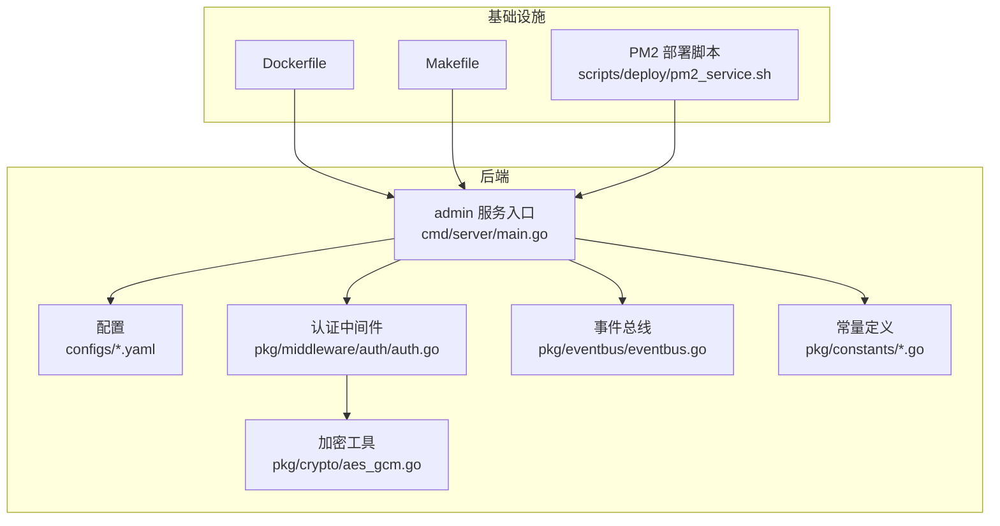
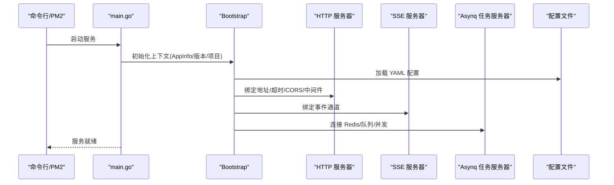
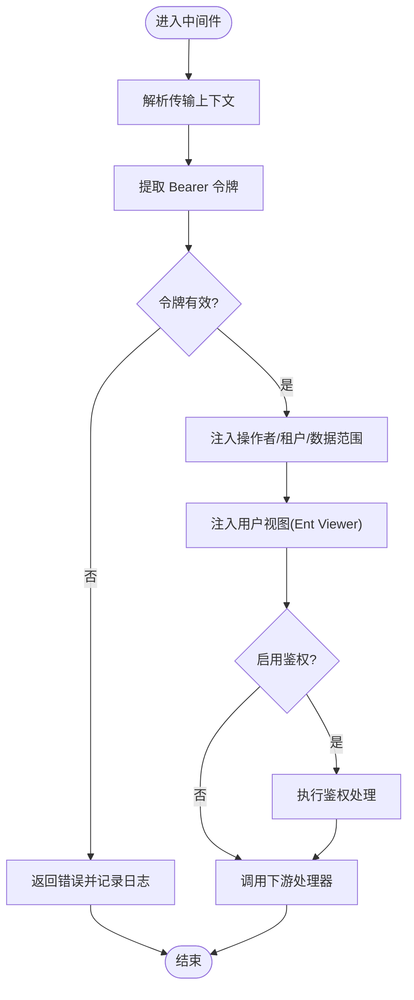
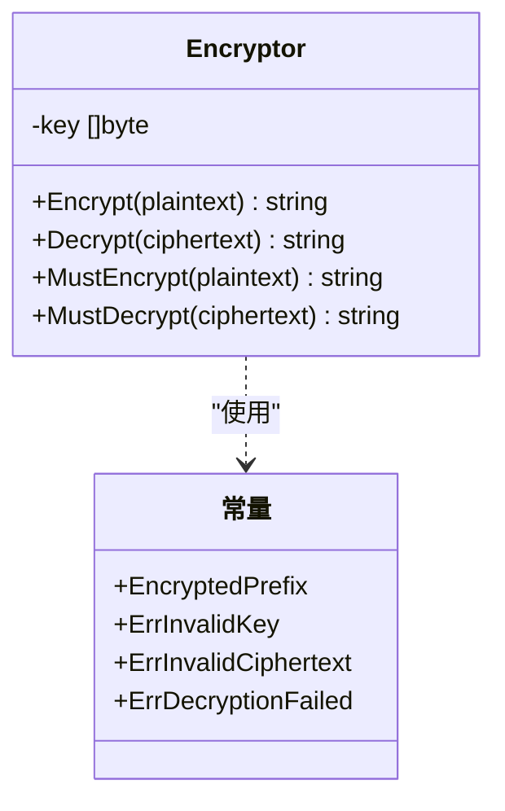
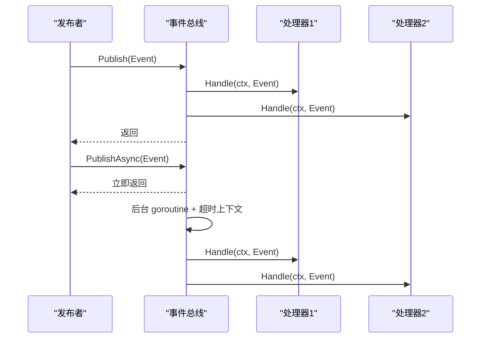
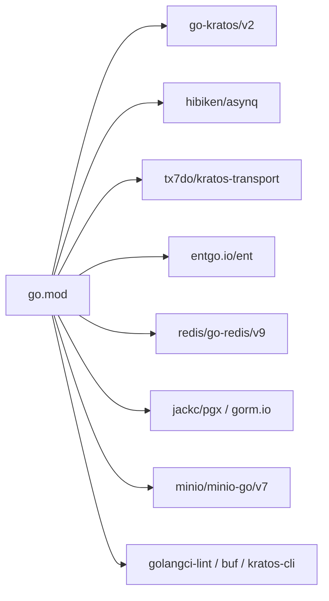

# 最佳实践

<cite>
**本文引用的文件**   
- [backend/app/admin/service/cmd/server/main.go](file://backend/app/admin/service/cmd/server/main.go)
- [backend/app/admin/service/configs/server.yaml](file://backend/app/admin/service/configs/server.yaml)
- [backend/app/admin/service/configs/auth.yaml](file://backend/app/admin/service/configs/auth.yaml)
- [backend/app/admin/service/configs/data.yaml](file://backend/app/admin/service/configs/data.yaml)
- [backend/app/admin/service/configs/logger.yaml](file://backend/app/admin/service/configs/logger.yaml)
- [backend/app/admin/service/configs/oss.yaml](file://backend/app/admin/service/configs/oss.yaml)
- [backend/pkg/middleware/auth/auth.go](file://backend/pkg/middleware/auth/auth.go)
- [backend/pkg/crypto/aes_gcm.go](file://backend/pkg/crypto/aes_gcm.go)
- [backend/pkg/eventbus/eventbus.go](file://backend/pkg/eventbus/eventbus.go)
- [backend/pkg/constants/permission.go](file://backend/pkg/constants/permission.go)
- [backend/pkg/constants/role.go](file://backend/pkg/constants/role.go)
- [backend/scripts/deploy/pm2_service.sh](file://backend/scripts/deploy/pm2_service.sh)
- [backend/Dockerfile](file://backend/Dockerfile)
- [backend/go.mod](file://backend/go.mod)
- [backend/Makefile](file://backend/Makefile)
- [backend/scripts/WORKFLOWS_AND_BEST_PRACTICES.md](file://backend/scripts/WORKFLOWS_AND_BEST_PRACTICES.md)
</cite>

## 目录
1. [引言](#引言)
2. [项目结构](#项目结构)
3. [核心组件](#核心组件)
4. [架构总览](#架构总览)
5. [详细组件分析](#详细组件分析)
6. [依赖分析](#依赖分析)
7. [性能考虑](#性能考虑)
8. [故障排查指南](#故障排查指南)
9. [结论](#结论)
10. [附录](#附录)

## 引言
本指南面向 GoWind Admin 的开发与运维团队，提供一套可落地的最佳实践，覆盖开发规范、架构设计、配置管理、性能优化、安全实践、版本与发布流程以及团队协作方法论。内容基于仓库现有实现与脚本，结合 Kratos 微服务框架与相关中间件、加密与事件总线等模块，帮助团队建立高效、稳定、可扩展的开发与运维流程。

## 项目结构
后端采用多服务分层组织，admin 服务为核心入口，配合配置中心、认证授权、事件总线、加密工具、对象存储等模块协同工作；前端提供 React/Vue 多套实现，通过 Protobuf 生成的 API 与后端交互；脚本与 Makefile 提供环境准备、构建、打包、部署与运维能力。

**图表来源**
- [backend/app/admin/service/cmd/server/main.go:1-76](file://backend/app/admin/service/cmd/server/main.go#L1-L76)
- [backend/app/admin/service/configs/server.yaml:1-49](file://backend/app/admin/service/configs/server.yaml#L1-L49)
- [backend/pkg/middleware/auth/auth.go:1-122](file://backend/pkg/middleware/auth/auth.go#L1-L122)
- [backend/pkg/crypto/aes_gcm.go:1-154](file://backend/pkg/crypto/aes_gcm.go#L1-L154)
- [backend/pkg/eventbus/eventbus.go:1-214](file://backend/pkg/eventbus/eventbus.go#L1-L214)
- [backend/pkg/constants/permission.go:1-39](file://backend/pkg/constants/permission.go#L1-L39)
- [backend/pkg/constants/role.go:1-49](file://backend/pkg/constants/role.go#L1-L49)
- [backend/Dockerfile:1-66](file://backend/Dockerfile#L1-L66)
- [backend/Makefile:1-227](file://backend/Makefile#L1-L227)
- [backend/scripts/deploy/pm2_service.sh:1-137](file://backend/scripts/deploy/pm2_service.sh#L1-L137)

**章节来源**
- [backend/app/admin/service/cmd/server/main.go:1-76](file://backend/app/admin/service/cmd/server/main.go#L1-L76)
- [backend/Makefile:1-227](file://backend/Makefile#L1-L227)

## 核心组件
- 服务入口与引导：admin 服务通过 Kratos Bootstrap 初始化上下文、HTTP/SSE/Asynq 传输层，并注入服务元信息。
- 认证与授权中间件：统一从请求元数据提取令牌，校验访问令牌有效性，注入操作者、租户、数据范围等上下文，支持可选鉴权引擎。
- 配置体系：YAML 配置集中管理服务端口、CORS、中间件开关、Redis/数据库连接、日志与 OSS 等。
- 加密工具：AES-256-GCM 对称加密封装，带前缀标识与错误处理，支持测试辅助函数。
- 事件总线：同步/异步事件订阅与发布，支持一次性处理器、关闭清理与订阅统计。
- 常量与权限模型：统一的权限与角色前缀、受保护权限集合，便于权限治理与角色继承。

**章节来源**
- [backend/app/admin/service/cmd/server/main.go:46-76](file://backend/app/admin/service/cmd/server/main.go#L46-L76)
- [backend/pkg/middleware/auth/auth.go:24-122](file://backend/pkg/middleware/auth/auth.go#L24-L122)
- [backend/app/admin/service/configs/server.yaml:1-49](file://backend/app/admin/service/configs/server.yaml#L1-L49)
- [backend/pkg/crypto/aes_gcm.go:26-154](file://backend/pkg/crypto/aes_gcm.go#L26-L154)
- [backend/pkg/eventbus/eventbus.go:12-214](file://backend/pkg/eventbus/eventbus.go#L12-L214)
- [backend/pkg/constants/permission.go:1-39](file://backend/pkg/constants/permission.go#L1-L39)
- [backend/pkg/constants/role.go:1-49](file://backend/pkg/constants/role.go#L1-L49)

## 架构总览
下图展示 admin 服务启动、配置加载、中间件链路与外部依赖的关系。

**图表来源**
- [backend/app/admin/service/cmd/server/main.go:46-76](file://backend/app/admin/service/cmd/server/main.go#L46-L76)
- [backend/app/admin/service/configs/server.yaml:1-49](file://backend/app/admin/service/configs/server.yaml#L1-L49)
- [backend/Dockerfile:64-66](file://backend/Dockerfile#L64-L66)

## 详细组件分析

### 认证与授权中间件
- 功能要点
  - 从传输上下文中解析 Bearer 令牌
  - 校验访问令牌有效性，支持过期与缺失错误
  - 可选注入操作者 ID、租户 ID、数据范围
  - 将用户视图注入 Ent Viewer 上下文，支持数据域隔离
  - 可选启用鉴权处理（如 Casbin/OpenFGA/Keto 等）
- 错误处理
  - 缺失或无效令牌返回明确错误
  - 上下文缺失或令牌载荷异常记录日志并回滚
- 安全建议
  - 令牌校验器需支持黑名单/撤销列表
  - 严格限制 CORS 与中间件开关，生产环境开启恢复、追踪、验证与熔断

**图表来源**
- [backend/pkg/middleware/auth/auth.go:38-121](file://backend/pkg/middleware/auth/auth.go#L38-L121)

**章节来源**
- [backend/pkg/middleware/auth/auth.go:24-122](file://backend/pkg/middleware/auth/auth.go#L24-L122)

### 配置管理
- 服务配置
  - REST 地址、超时、Swagger、pprof、CORS 白名单
  - 中间件开关：日志、恢复、追踪、验证、熔断、元数据
  - Asynq：Redis 连接、编码、并发、队列优先级、时区、队列权重
  - SSE：地址、编码、路径、自动流式
- 认证配置
  - 认证类型：JWT/OIDC/预共享密钥
  - 鉴权类型：Casbin/OPA/Zanzibar(Keto/OpenFGA)
- 数据库与缓存
  - 数据库驱动与连接串、迁移、连接池参数
  - Redis 地址、密码、超时
- 日志与对象存储
  - 日志类型与参数（标准输出/文件/第三方）
  - MinIO 端点、凭证、是否使用 SSL

**章节来源**
- [backend/app/admin/service/configs/server.yaml:1-49](file://backend/app/admin/service/configs/server.yaml#L1-L49)
- [backend/app/admin/service/configs/auth.yaml:1-37](file://backend/app/admin/service/configs/auth.yaml#L1-L37)
- [backend/app/admin/service/configs/data.yaml:1-21](file://backend/app/admin/service/configs/data.yaml#L1-L21)
- [backend/app/admin/service/configs/logger.yaml:1-32](file://backend/app/admin/service/configs/logger.yaml#L1-L32)
- [backend/app/admin/service/configs/oss.yaml:1-10](file://backend/app/admin/service/configs/oss.yaml#L1-L10)

### 加密工具（AES-GCM）
- 设计要点
  - 密钥派生：SHA-256 派生 32 字节密钥
  - 密文格式：前缀 + Base64，便于与明文区分
  - 错误处理：无效密文、解密失败、长度不足等
  - 测试辅助：MustEncrypt/MustDecrypt
- 使用建议
  - 生产环境密钥由配置中心或 KMS 注入，避免硬编码
  - 严格管理密钥轮换与归档策略

**图表来源**
- [backend/pkg/crypto/aes_gcm.go:26-154](file://backend/pkg/crypto/aes_gcm.go#L26-L154)

**章节来源**
- [backend/pkg/crypto/aes_gcm.go:1-154](file://backend/pkg/crypto/aes_gcm.go#L1-L154)

### 事件总线
- 能力
  - 同步/异步订阅、一次性订阅、取消订阅
  - 发布事件（含一次性处理器执行后清理）
  - 关闭资源、统计订阅数与事件类型
- 异步发布
  - 使用带超时的背景上下文，避免调用方取消影响异步任务
- 建议
  - 事件处理器内部做好幂等与重试策略
  - 对高频事件设置队列优先级与并发限制

**图表来源**
- [backend/pkg/eventbus/eventbus.go:106-167](file://backend/pkg/eventbus/eventbus.go#L106-L167)

**章节来源**
- [backend/pkg/eventbus/eventbus.go:1-214](file://backend/pkg/eventbus/eventbus.go#L1-L214)

### 权限与角色常量
- 权限前缀与受保护集合
  - 系统权限前缀 sys:
  - 受保护权限：后台访问、租户管理、审计日志、平台/租户管理员
- 角色前缀与模板角色
  - 前缀：template/platform/tenant
  - 模板角色可提取真实角色代码
- 建议
  - 新增权限/角色时遵循前缀规范，避免破坏受保护集合
  - 模板角色用于租户级角色复用与继承

**章节来源**
- [backend/pkg/constants/permission.go:1-39](file://backend/pkg/constants/permission.go#L1-L39)
- [backend/pkg/constants/role.go:1-49](file://backend/pkg/constants/role.go#L1-L49)

## 依赖分析
- 运行时依赖
  - Kratos v2、Asynq、SSE、OpenTelemetry、Ent/GORM、MinIO、Redis、Postgres/MySQL 等
- 构建与工具
  - Protobuf、Buf、Kratos CLI、golangci-lint、ent、wire 等
- 依赖关系可视化

**图表来源**
- [backend/go.mod:5-65](file://backend/go.mod#L5-L65)

**章节来源**
- [backend/go.mod:1-290](file://backend/go.mod#L1-L290)

## 性能考虑
- 数据库
  - 合理设置最大空闲/活动连接数、连接最大生命周期
  - 开启调试/追踪/指标（开发环境）以定位慢查询
- 缓存
  - 使用 Redis 作为缓存层，注意键空间设计与过期策略
  - 对热点数据设置合理 TTL，避免缓存穿透与击穿
- 异步处理
  - Asynq 队列按优先级划分（critical/default/low），并发与超时按业务峰值评估
  - 异步发布使用带超时的背景上下文，避免阻塞调用方
- 资源管理
  - Dockerfile 使用非 root 用户运行，减少权限风险
  - PM2 管理进程，自动保存状态，便于故障恢复

**章节来源**
- [backend/app/admin/service/configs/data.yaml:11-13](file://backend/app/admin/service/configs/data.yaml#L11-L13)
- [backend/app/admin/service/configs/server.yaml:30-42](file://backend/app/admin/service/configs/server.yaml#L30-L42)
- [backend/pkg/eventbus/eventbus.go:154-167](file://backend/pkg/eventbus/eventbus.go#L154-L167)
- [backend/Dockerfile:56-60](file://backend/Dockerfile#L56-L60)
- [backend/scripts/deploy/pm2_service.sh:118-132](file://backend/scripts/deploy/pm2_service.sh#L118-L132)

## 故障排查指南
- 启动与部署
  - 使用 PM2 脚本一键安装与启动，检查二进制可执行性与配置目录
  - Dockerfile 指定 CMD 参数为 -c /app/configs，确认配置挂载正确
- 环境准备
  - Makefile 提供 install-dev/install-prod/docker-up/docker-libs/pm2-deploy 等目标
  - WORKFLOWS_AND_BEST_PRACTICES.md 提供多场景工作流与常见问题排查
- 日志与监控
  - logger.yaml 支持多种日志后端，生产环境建议使用文件滚动或第三方采集
  - Asynq/SSE/HTTP 中间件均开启日志与恢复，便于定位异常
- 端口与依赖
  - 端口冲突时参考脚本中的排查步骤，修改 docker-compose 端口映射后重启
- 配置变更
  - 修改 YAML 后重启服务或通过配置导出工具同步至配置中心（如 etcd）

**章节来源**
- [backend/scripts/deploy/pm2_service.sh:96-137](file://backend/scripts/deploy/pm2_service.sh#L96-L137)
- [backend/Dockerfile:64-66](file://backend/Dockerfile#L64-L66)
- [backend/Makefile:166-208](file://backend/Makefile#L166-L208)
- [backend/scripts/WORKFLOWS_AND_BEST_PRACTICES.md:418-544](file://backend/scripts/WORKFLOWS_AND_BEST_PRACTICES.md#L418-L544)

## 结论
本最佳实践以现有代码与脚本为基础，围绕“配置即代码”“中间件统一”“事件驱动”“安全优先”的原则，给出开发、运维与团队协作的可执行方案。建议在后续迭代中持续完善 CI/CD、可观测性与安全扫描，保持配置与代码的双保险。

## 附录

### 开发规范与最佳实践
- 代码风格
  - 使用 golangci-lint 与 gowind 工具链，统一静态检查与生成工具
- 架构设计
  - 服务边界清晰，依赖注入与接口抽象，中间件链路统一
- 命名约定
  - 包名小写、简洁；常量使用前缀 sys:/template:/platform:/tenant:；权限/角色代码与前缀保持一致
- 注释规范
  - 公共接口与复杂逻辑补充注释，错误返回与边界条件明确

**章节来源**
- [backend/Makefile:75-77](file://backend/Makefile#L75-L77)
- [backend/pkg/constants/permission.go:3-29](file://backend/pkg/constants/permission.go#L3-L29)
- [backend/pkg/constants/role.go:3-25](file://backend/pkg/constants/role.go#L3-L25)

### 安全开发实践
- 输入验证
  - 开启验证中间件，结合 Protobuf 验证规则
- SQL 注入防护
  - 使用 Ent/GORM ORM，避免原生 SQL 拼接
- XSS/CSRF 防护
  - CORS 白名单配置，生产环境严格限制来源
  - 中间件开启恢复与追踪，便于审计与溯源

**章节来源**
- [backend/app/admin/service/configs/server.yaml:7-28](file://backend/app/admin/service/configs/server.yaml#L7-L28)
- [backend/go.mod:6-65](file://backend/go.mod#L6-L65)

### 版本管理与发布流程
- Git 工作流
  - 使用 Makefile 目标完成依赖安装、代码生成、构建与打包
- 版本控制
  - main.go 中版本号可通过 ldflags 注入，Dockerfile 也支持参数化
- 持续集成
  - 建议在 CI 中集成 golangci-lint、测试覆盖率与构建产物校验
- 自动化部署
  - PM2 脚本一键安装与启动，支持命名空间与日志输出

**章节来源**
- [backend/app/admin/service/cmd/server/main.go:42-44](file://backend/app/admin/service/cmd/server/main.go#L42-L44)
- [backend/Dockerfile:9-10](file://backend/Dockerfile#L9-L10)
- [backend/scripts/deploy/pm2_service.sh:96-137](file://backend/scripts/deploy/pm2_service.sh#L96-L137)
- [backend/Makefile:166-208](file://backend/Makefile#L166-L208)

### 团队协作最佳实践
- 代码审查
  - 使用 golangci-lint 与 gowind 工具链，统一风格与质量门槛
- 文档编写
  - 依据 WORKFLOWS_AND_BEST_PRACTICES.md 维护脚本与流程文档
- 知识分享
  - 通过 Makefile 目标与脚本标准化日常操作，降低上手成本

**章节来源**
- [backend/scripts/WORKFLOWS_AND_BEST_PRACTICES.md:1-544](file://backend/scripts/WORKFLOWS_AND_BEST_PRACTICES.md#L1-L544)
- [backend/Makefile:42-52](file://backend/Makefile#L42-L52)