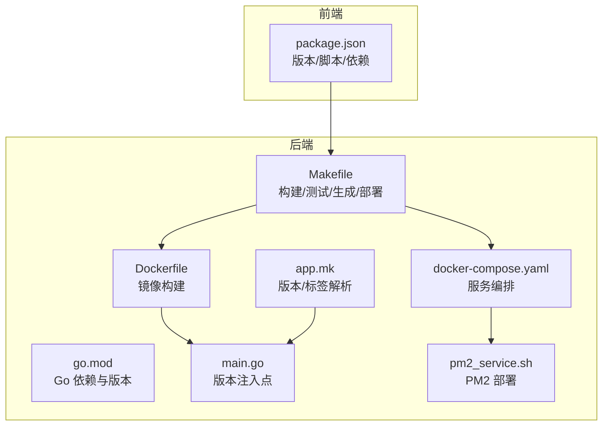
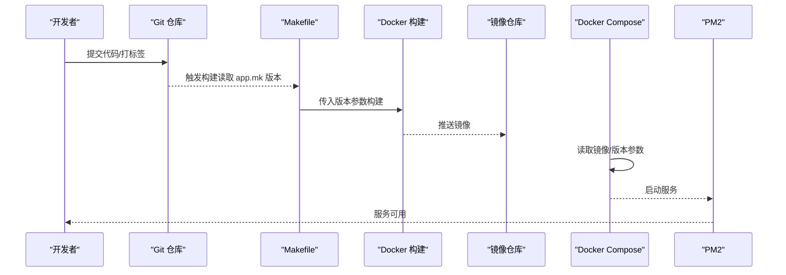
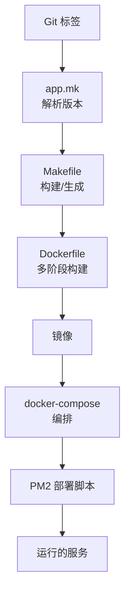

# 版本管理

<cite>
**本文引用的文件**
- [backend/go.mod](file://backend/go.mod)
- [backend/app/admin/service/cmd/server/main.go](file://backend/app/admin/service/cmd/server/main.go)
- [backend/Dockerfile](file://backend/Dockerfile)
- [backend/docker-compose.yaml](file://backend/docker-compose.yaml)
- [backend/Makefile](file://backend/Makefile)
- [backend/app.mk](file://backend/app.mk)
- [backend/scripts/deploy/pm2_service.sh](file://backend/scripts/deploy/pm2_service.sh)
- [backend/scripts/WORKFLOWS_AND_BEST_PRACTICES.md](file://backend/scripts/WORKFLOWS_AND_BEST_PRACTICES.md)
- [frontend/admin/vue-vben/package.json](file://frontend/admin/vue-vben/package.json)
- [backend/.gitignore](file://backend/.gitignore)
- [frontend/admin/vue-vben/.gitignore](file://frontend/admin/vue-vben/.gitignore)
- [backend/.dockerignore](file://backend/.dockerignore)
</cite>

## 目录
1. [简介](#简介)
2. [项目结构](#项目结构)
3. [核心组件](#核心组件)
4. [架构总览](#架构总览)
5. [详细组件分析](#详细组件分析)
6. [依赖分析](#依赖分析)
7. [性能考虑](#性能考虑)
8. [故障排查指南](#故障排查指南)
9. [结论](#结论)
10. [附录](#附录)

## 简介
本指南面向 GoWind Admin 的版本管理与发布流程，覆盖 Git 工作流、分支策略、提交规范、合并流程与冲突解决；版本控制（语义化版本、标签管理、版本号规则、变更日志维护）；持续集成（自动化测试、代码质量检查、构建流水线、部署自动化）；发布流程（版本打包、发布检查、回滚机制、发布通知）；依赖管理（Go modules、npm packages、依赖更新、安全漏洞修复）；以及发布策略（蓝绿部署、灰度发布、A/B 测试）的落地建议与实践。

## 项目结构
- 后端采用多服务分层与模块化组织，使用 Go modules 管理依赖，并通过 Makefile 统一编排生成、构建、测试、静态分析、Docker 化与部署。
- 前端采用 pnpm workspace 管理多子项目，使用 Changesets 进行变更日志与版本管理。
- Docker 与 Docker Compose 提供本地与生产环境的一致化运行与部署。

图表来源
- [backend/Makefile:18-227](file://backend/Makefile#L18-L227)
- [backend/Dockerfile:1-66](file://backend/Dockerfile#L1-L66)
- [backend/docker-compose.yaml:1-125](file://backend/docker-compose.yaml#L1-L125)
- [backend/app/admin/service/cmd/server/main.go:42-44](file://backend/app/admin/service/cmd/server/main.go#L42-L44)
- [backend/app.mk:49-67](file://backend/app.mk#L49-L67)
- [backend/scripts/deploy/pm2_service.sh:1-137](file://backend/scripts/deploy/pm2_service.sh#L1-L137)
- [frontend/admin/vue-vben/package.json:1-118](file://frontend/admin/vue-vben/package.json#L1-L118)

章节来源
- [backend/Makefile:18-227](file://backend/Makefile#L18-L227)
- [backend/Dockerfile:1-66](file://backend/Dockerfile#L1-L66)
- [backend/docker-compose.yaml:1-125](file://backend/docker-compose.yaml#L1-L125)
- [backend/app.admin.service.cmd.server.main.go:42-44](file://backend/app/admin/service/cmd/server/main.go#L42-L44)
- [backend/app.mk:49-67](file://backend/app.mk#L49-L67)
- [backend/scripts/deploy/pm2_service.sh:1-137](file://backend/scripts/deploy/pm2_service.sh#L1-L137)
- [frontend/admin/vue-vben/package.json:1-118](file://frontend/admin/vue-vben/package.json#L1-L118)

## 核心组件
- 版本注入与镜像构建
  - 后端服务在构建时通过 ldflags 注入版本号，Dockerfile 将版本参数传递给构建阶段，最终写入二进制。
  - 参考：[backend/app/admin/service/cmd/server/main.go:42-44](file://backend/app/admin/service/cmd/server/main.go#L42-L44)、[backend/Dockerfile:23-27](file://backend/Dockerfile#L23-L27)
- 版本解析与 LDFLAGS
  - app.mk 通过 git describe 计算当前版本与最近标签，用于生成阶段注入版本。
  - 参考：[backend/app.mk:49-67](file://backend/app.mk#L49-L67)
- 构建与打包
  - Makefile 提供 build、build_only、gen、api、openapi、ts、docker 等目标，统一生成与构建流程。
  - 参考：[backend/Makefile:54-124](file://backend/Makefile#L54-L124)
- 部署与运行
  - docker-compose 定义服务镜像与端口映射；PM2 脚本负责将构建产物复制到安装目录并注册到 PM2。
  - 参考：[backend/docker-compose.yaml:104-125](file://backend/docker-compose.yaml#L104-L125)、[backend/scripts/deploy/pm2_service.sh:66-132](file://backend/scripts/deploy/pm2_service.sh#L66-L132)
- 前端版本与变更日志
  - package.json 中包含 changeset 相关脚本，用于版本推进与变更日志生成。
  - 参考：[frontend/admin/vue-vben/package.json:12-34](file://frontend/admin/vue-vben/package.json#L12-L34)

章节来源
- [backend/app/admin/service/cmd/server/main.go:42-44](file://backend/app/admin/service/cmd/server/main.go#L42-L44)
- [backend/Dockerfile:23-27](file://backend/Dockerfile#L23-L27)
- [backend/app.mk:49-67](file://backend/app.mk#L49-L67)
- [backend/Makefile:54-124](file://backend/Makefile#L54-L124)
- [backend/docker-compose.yaml:104-125](file://backend/docker-compose.yaml#L104-L125)
- [backend/scripts/deploy/pm2_service.sh:66-132](file://backend/scripts/deploy/pm2_service.sh#L66-L132)
- [frontend/admin/vue-vben/package.json:12-34](file://frontend/admin/vue-vben/package.json#L12-L34)

## 架构总览
下图展示从代码提交到镜像构建、容器编排与 PM2 运行的关键节点，体现版本号在各环节的传递路径。

图表来源
- [backend/app.mk:49-67](file://backend/app.mk#L49-L67)
- [backend/Makefile:112-124](file://backend/Makefile#L112-L124)
- [backend/Dockerfile:23-27](file://backend/Dockerfile#L23-L27)
- [backend/docker-compose.yaml:104-125](file://backend/docker-compose.yaml#L104-L125)
- [backend/scripts/deploy/pm2_service.sh:96-132](file://backend/scripts/deploy/pm2_service.sh#L96-L132)

## 详细组件分析

### Git 工作流与分支策略
- 分支模型建议
  - 主分支：保护分支，仅允许通过合并请求（含审查与 CI 通过）合并。
  - develop 分支：日常集成，每日构建与测试。
  - feature/*：功能开发分支，基于 develop 拉取与合并。
  - release/*：预发布分支，冻结功能，集中修复缺陷。
  - hotfix/*：线上紧急修复分支，基于主分支切出，修复后回并主分支与 develop。
- 提交规范
  - 使用约定式提交（Conventional Commits），结合 commitlint 与 husky 在本地强制执行。
  - 参考前端仓库中的 commitlint 与 husky 配置与脚本。
- 合并流程
  - 采用 Squash Merge 保持主分支整洁；或 Rebase Merge 保留线性历史。
  - 合并前必须通过 CI（测试、静态检查、构建）。
- 冲突解决
  - rebase 或 merge 产生冲突时，优先在 feature 分支上解决，再回退到上游分支。
  - 使用工具（如 VS Code/Goland）可视化解决冲突，完成后提交修复提交并推送。

章节来源
- [frontend/admin/vue-vben/package.json:19-26](file://frontend/admin/vue-vben/package.json#L19-L26)
- [backend/scripts/WORKFLOWS_AND_BEST_PRACTICES.md:1-544](file://backend/scripts/WORKFLOWS_AND_BEST_PRACTICES.md#L1-L544)

### 版本控制与标签管理
- 语义化版本（SemVer）
  - 采用主.次.修订号（MAJOR.MINOR.PATCH），遵循语义化版本规则。
- 标签管理
  - 通过 git tag 创建带前缀的标签（如 v1.2.3），app.mk 读取最近标签作为版本号。
  - 参考：[backend/app.mk:49-57](file://backend/app.mk#L49-L57)
- 版本号规则
  - 版本号由 app.mk 通过 git describe 推导，构建时注入到二进制。
  - 参考：[backend/app.mk:66-67](file://backend/app.mk#L66-L67)
- 变更日志维护
  - 前端使用 Changesets 管理变更日志与版本推进，package.json 中提供 changeset 与 version 脚本。
  - 参考：[frontend/admin/vue-vben/package.json:12-34](file://frontend/admin/vue-vben/package.json#L12-L34)

章节来源
- [backend/app.mk:49-67](file://backend/app.mk#L49-L67)
- [frontend/admin/vue-vben/package.json:12-34](file://frontend/admin/vue-vben/package.json#L12-L34)

### 持续集成与自动化
- 自动化测试
  - 后端：go test、go test -coverprofile；前端：vitest 单测、Playwright E2E。
  - 参考：[backend/Makefile:63-68](file://backend/Makefile#L63-L68)、[frontend/admin/vue-vben/package.json:30-31](file://frontend/admin/vue-vben/package.json#L30-L31)
- 代码质量检查
  - 后端：golangci-lint；前端：ESLint、Stylelint、Prettier、TypeScript 类型检查。
  - 参考：[backend/Makefile:75-76](file://backend/Makefile#L75-L76)、[frontend/admin/vue-vben/package.json:13-17](file://frontend/admin/vue-vben/package.json#L13-L17)
- 构建流水线
  - Makefile 统一入口，Dockerfile 完成多阶段构建，docker-compose 编排服务。
  - 参考：[backend/Makefile:112-124](file://backend/Makefile#L112-L124)、[backend/Dockerfile:1-66](file://backend/Dockerfile#L1-L66)、[backend/docker-compose.yaml:1-125](file://backend/docker-compose.yaml#L1-L125)
- 部署自动化
  - PM2 脚本负责复制二进制与配置，注册到 PM2 并持久化。
  - 参考：[backend/scripts/deploy/pm2_service.sh:66-132](file://backend/scripts/deploy/pm2_service.sh#L66-L132)

章节来源
- [backend/Makefile:63-76](file://backend/Makefile#L63-L76)
- [backend/Dockerfile:1-66](file://backend/Dockerfile#L1-L66)
- [backend/docker-compose.yaml:1-125](file://backend/docker-compose.yaml#L1-L125)
- [backend/scripts/deploy/pm2_service.sh:66-132](file://backend/scripts/deploy/pm2_service.sh#L66-L132)
- [frontend/admin/vue-vben/package.json:13-31](file://frontend/admin/vue-vben/package.json#L13-L31)

### 发布流程
- 版本打包
  - 后端：Makefile -> Dockerfile -> docker-compose -> 镜像。
  - 前端：pnpm build -> 产物 -> 部署。
  - 参考：[backend/Makefile:112-124](file://backend/Makefile#L112-L124)、[backend/Dockerfile:23-27](file://backend/Dockerfile#L23-L27)、[frontend/admin/vue-vben/package.json:8-11](file://frontend/admin/vue-vben/package.json#L8-L11)
- 发布检查
  - 本地验证：构建成功、测试通过、静态检查通过、OpenAPI 文档生成。
  - 参考：[backend/Makefile:63-76](file://backend/Makefile#L63-L76)、[backend/Makefile:100-104](file://backend/Makefile#L100-L104)
- 回滚机制
  - 通过 docker-compose 指定镜像版本或回退到上一个标签对应的镜像；PM2 支持删除与重载。
  - 参考：[backend/docker-compose.yaml:104-125](file://backend/docker-compose.yaml#L104-L125)、[backend/scripts/deploy/pm2_service.sh:120-132](file://backend/scripts/deploy/pm2_service.sh#L120-L132)
- 发布通知
  - 建议在发布后通过变更日志与团队沟通渠道同步版本信息与变更摘要。
  - 参考：[frontend/admin/vue-vben/package.json:12-13](file://frontend/admin/vue-vben/package.json#L12-L13)

章节来源
- [backend/Makefile:100-124](file://backend/Makefile#L100-L124)
- [backend/Dockerfile:23-27](file://backend/Dockerfile#L23-L27)
- [backend/docker-compose.yaml:104-125](file://backend/docker-compose.yaml#L104-L125)
- [backend/scripts/deploy/pm2_service.sh:120-132](file://backend/scripts/deploy/pm2_service.sh#L120-L132)
- [frontend/admin/vue-vben/package.json:12-13](file://frontend/admin/vue-vben/package.json#L12-L13)

### 依赖管理
- Go modules
  - go.mod 管理后端依赖；使用 go mod download / tidy；版本升级通过编辑 go.mod 后 go mod tidy。
  - 参考：[backend/go.mod:1-65](file://backend/go.mod#L1-L65)
- npm packages
  - 前端使用 pnpm 管理依赖；更新依赖使用 update:deps 脚本；版本推进使用 changeset。
  - 参考：[frontend/admin/vue-vben/package.json:32-33](file://frontend/admin/vue-vben/package.json#L32-L33)
- 依赖更新与安全修复
  - 定期运行依赖更新脚本与安全扫描（如 Snyk/Dependabot），在受控分支上验证后再合并。
- .gitignore 与 .dockerignore
  - 后端忽略构建产物与日志；前端忽略 node_modules、dist、缓存等；Docker 忽略 CI、文档与构建产物。
  - 参考：[backend/.gitignore:1-38](file://backend/.gitignore#L1-L38)、[frontend/admin/vue-vben/.gitignore:1-52](file://frontend/admin/vue-vben/.gitignore#L1-L52)、[backend/.dockerignore:1-47](file://backend/.dockerignore#L1-L47)

章节来源
- [backend/go.mod:1-65](file://backend/go.mod#L1-L65)
- [frontend/admin/vue-vben/package.json:32-33](file://frontend/admin/vue-vben/package.json#L32-L33)
- [backend/.gitignore:1-38](file://backend/.gitignore#L1-L38)
- [frontend/admin/vue-vben/.gitignore:1-52](file://frontend/admin/vue-vben/.gitignore#L1-L52)
- [backend/.dockerignore:1-47](file://backend/.dockerignore#L1-L47)

### 发布策略
- 蓝绿部署
  - 通过 docker-compose 同时运行两套服务，切换流量至新版本，失败则回切。
  - 参考：[backend/docker-compose.yaml:104-125](file://backend/docker-compose.yaml#L104-L125)
- 灰度发布
  - 结合反向代理（如 Nginx/Envoy）对部分 IP/Header 进行分流，逐步扩大流量比例。
- A/B 测试
  - 通过网关或服务端特性开关，对不同用户群体返回不同功能或界面，收集指标评估效果。

[本节为概念性内容，无需列出章节来源]

## 依赖分析
- 版本号传递链路
  - git 标签 -> app.mk -> Makefile -> Dockerfile -> 二进制 -> docker-compose -> PM2
- 关键耦合点
  - app.mk 与 Dockerfile 的版本参数需保持一致。
  - docker-compose 与 PM2 部署脚本需与构建产物路径匹配。

图表来源
- [backend/app.mk:49-67](file://backend/app.mk#L49-L67)
- [backend/Makefile:112-124](file://backend/Makefile#L112-L124)
- [backend/Dockerfile:23-27](file://backend/Dockerfile#L23-L27)
- [backend/docker-compose.yaml:104-125](file://backend/docker-compose.yaml#L104-L125)
- [backend/scripts/deploy/pm2_service.sh:66-132](file://backend/scripts/deploy/pm2_service.sh#L66-L132)

章节来源
- [backend/app.mk:49-67](file://backend/app.mk#L49-L67)
- [backend/Makefile:112-124](file://backend/Makefile#L112-L124)
- [backend/Dockerfile:23-27](file://backend/Dockerfile#L23-L27)
- [backend/docker-compose.yaml:104-125](file://backend/docker-compose.yaml#L104-L125)
- [backend/scripts/deploy/pm2_service.sh:66-132](file://backend/scripts/deploy/pm2_service.sh#L66-L132)

## 性能考虑
- 构建性能
  - 使用多阶段构建减少镜像体积与构建时间；缓存 GOPROXY 与 GOSUMDB 以提升依赖下载速度。
  - 参考：[backend/Dockerfile:18-20](file://backend/Dockerfile#L18-L20)
- 运行性能
  - docker-compose 中合理设置资源限制与只读文件系统；PM2 启动参数优化日志与内存。
  - 参考：[backend/docker-compose.yaml:1-125](file://backend/docker-compose.yaml#L1-L125)、[backend/scripts/deploy/pm2_service.sh:118-129](file://backend/scripts/deploy/pm2_service.sh#L118-L129)

[本节提供一般性指导，无需列出章节来源]

## 故障排查指南
- 构建失败
  - 检查 go.mod 依赖是否完整；确认 GOPROXY 与 GOSUMDB 配置；查看 Makefile 目标输出。
  - 参考：[backend/Makefile:55-56](file://backend/Makefile#L55-L56)、[backend/Dockerfile](file://backend/Dockerfile#L20)
- 镜像无法拉取
  - 确认镜像名称与版本参数正确；检查 docker-compose 中的镜像字段。
  - 参考：[backend/docker-compose.yaml:104-125](file://backend/docker-compose.yaml#L104-L125)
- PM2 启动失败
  - 检查二进制可执行权限与配置目录；查看 PM2 日志定位错误。
  - 参考：[backend/scripts/deploy/pm2_service.sh:106-132](file://backend/scripts/deploy/pm2_service.sh#L106-L132)
- 前端构建异常
  - 检查 pnpm 锁文件与 Node 版本；运行类型检查与 lint。
  - 参考：[frontend/admin/vue-vben/package.json:7-34](file://frontend/admin/vue-vben/package.json#L7-L34)

章节来源
- [backend/Makefile:55-56](file://backend/Makefile#L55-L56)
- [backend/Dockerfile](file://backend/Dockerfile#L20)
- [backend/docker-compose.yaml:104-125](file://backend/docker-compose.yaml#L104-L125)
- [backend/scripts/deploy/pm2_service.sh:106-132](file://backend/scripts/deploy/pm2_service.sh#L106-L132)
- [frontend/admin/vue-vben/package.json:7-34](file://frontend/admin/vue-vben/package.json#L7-L34)

## 结论
通过将 Git 标签、Makefile 构建、Docker 多阶段构建、docker-compose 编排与 PM2 部署串联起来，GoWind Admin 实现了从版本号注入到服务上线的闭环。配合约定式提交、变更日志与 CI 质量门禁，可稳定支撑持续交付与快速回滚。建议在现有基础上完善 CI/CD 流水线与监控告警，进一步提升发布效率与可靠性。

[本节为总结性内容，无需列出章节来源]

## 附录
- 版本号注入点一览
  - 后端：main.go 中 version 变量与 Dockerfile ldflags 注入。
  - 前端：package.json 中 version 字段与 changeset 脚本。
- 常用命令参考
  - 后端：make build、make test、make lint、make docker、make compose-up
  - 前端：pnpm build、pnpm test:unit、pnpm lint、pnpm changeset

章节来源
- [backend/app/admin/service/cmd/server/main.go:42-44](file://backend/app/admin/service/cmd/server/main.go#L42-L44)
- [backend/Dockerfile:23-27](file://backend/Dockerfile#L23-L27)
- [backend/Makefile:18-227](file://backend/Makefile#L18-L227)
- [frontend/admin/vue-vben/package.json:1-118](file://frontend/admin/vue-vben/package.json#L1-L118)