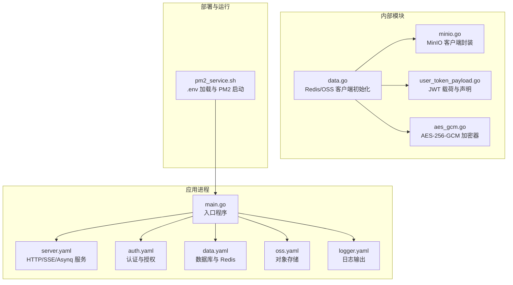
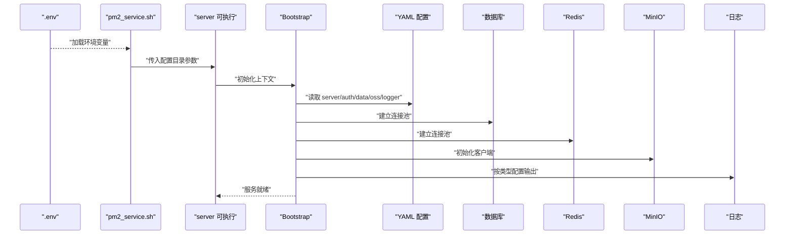
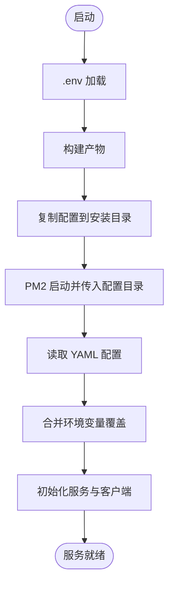
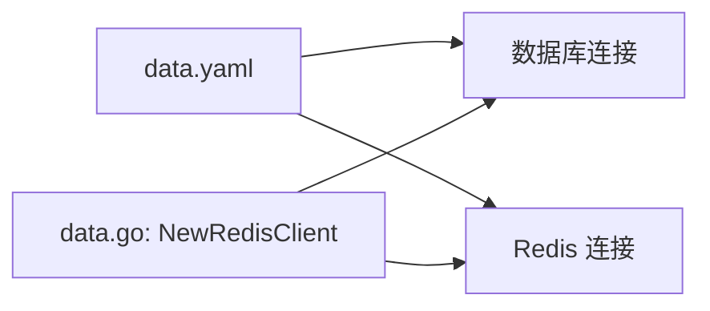
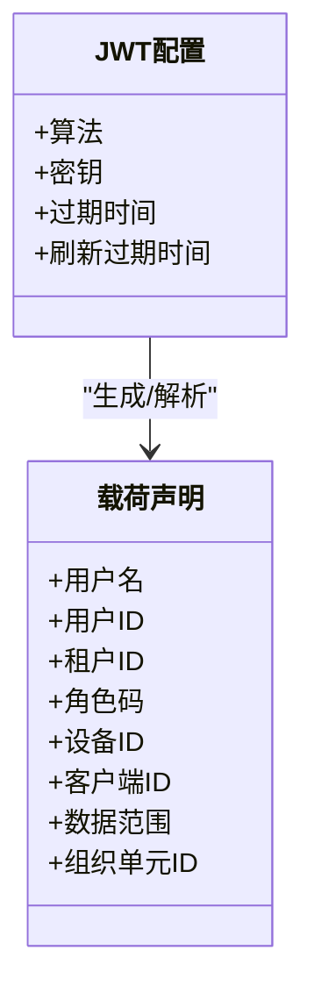
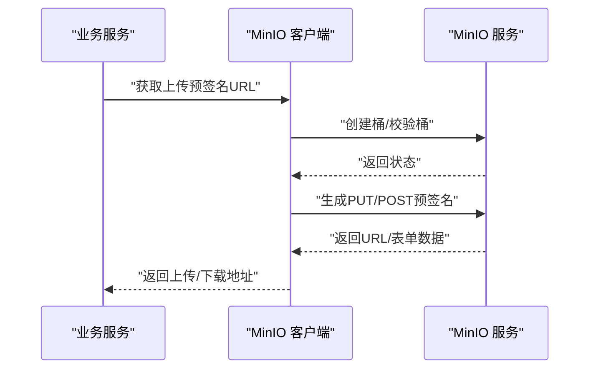
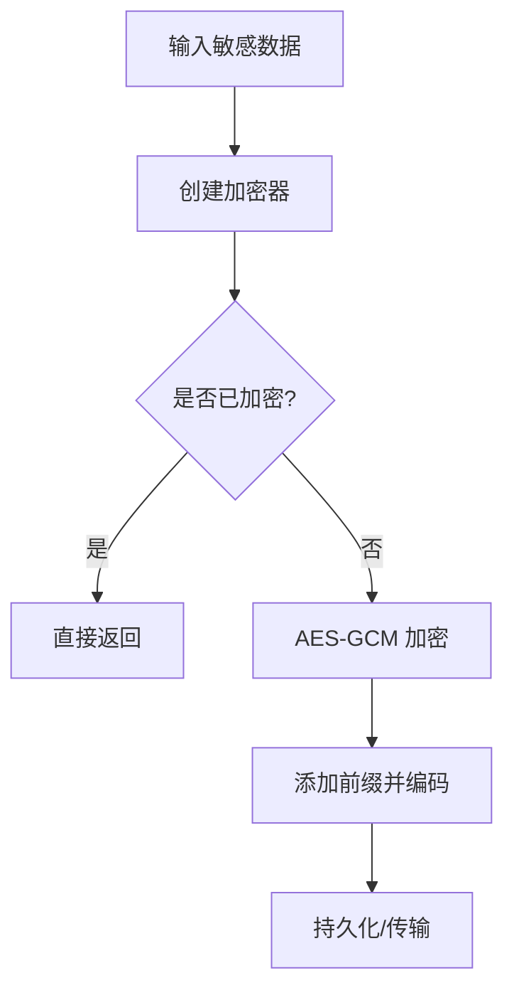
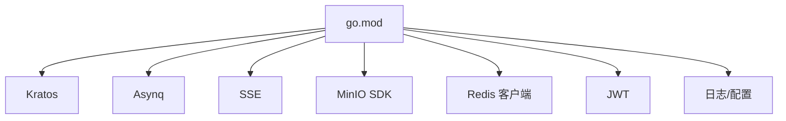

# 生产配置

<cite>
**本文引用的文件**   
- [main.go](file://backend/app/admin/service/cmd/server/main.go)
- [server.yaml](file://backend/app/admin/service/configs/server.yaml)
- [auth.yaml](file://backend/app/admin/service/configs/auth.yaml)
- [oss.yaml](file://backend/app/admin/service/configs/oss.yaml)
- [data.yaml](file://backend/app/admin/service/configs/data.yaml)
- [logger.yaml](file://backend/app/admin/service/configs/logger.yaml)
- [data.go](file://backend/app/admin/service/internal/data/data.go)
- [minio.go](file://backend/pkg/oss/minio.go)
- [aes_gcm.go](file://backend/pkg/crypto/aes_gcm.go)
- [user_token_payload.go](file://backend/pkg/jwt/user_token_payload.go)
- [pm2_service.sh](file://backend/scripts/deploy/pm2_service.sh)
- [go.mod](file://backend/go.mod)
</cite>

## 目录
1. [简介](#简介)
2. [项目结构](#项目结构)
3. [核心组件](#核心组件)
4. [架构总览](#架构总览)
5. [详细组件分析](#详细组件分析)
6. [依赖分析](#依赖分析)
7. [性能考虑](#性能考虑)
8. [故障排查指南](#故障排查指南)
9. [结论](#结论)
10. [附录](#附录)

## 简介
本指南面向 GoWind Admin 在生产环境中的配置管理，围绕以下目标展开：
- 环境变量与配置文件的协同使用方式
- 关键参数（数据库、Redis、JWT、OSS）的配置要点与安全建议
- 配置加载顺序、优先级与环境区分策略
- 敏感信息保护（密码加密、证书管理、密钥轮换）
- 配置验证机制（启动时检查、热更新与回滚思路）
- 多环境配置策略（开发、测试、预发布、生产）
- 结合部署脚本的实际落地与最佳实践

## 项目结构
后端采用 Kratos Bootstrap 与 tx7do 扩展，配置集中在各服务的 configs 目录中，并通过启动脚本加载。部署脚本支持通过 .env 注入环境变量，并将构建产物与配置复制到安装目录，再由 PM2 启动。

**图示来源**
- [main.go:1-76](file://backend/app/admin/service/cmd/server/main.go#L1-L76)
- [server.yaml:1-49](file://backend/app/admin/service/configs/server.yaml#L1-L49)
- [auth.yaml:1-37](file://backend/app/admin/service/configs/auth.yaml#L1-L37)
- [data.yaml:1-21](file://backend/app/admin/service/configs/data.yaml#L1-L21)
- [oss.yaml:1-10](file://backend/app/admin/service/configs/oss.yaml#L1-L10)
- [logger.yaml:1-32](file://backend/app/admin/service/configs/logger.yaml#L1-L32)
- [data.go:1-63](file://backend/app/admin/service/internal/data/data.go#L1-L63)
- [minio.go:1-467](file://backend/pkg/oss/minio.go#L1-L467)
- [user_token_payload.go:1-279](file://backend/pkg/jwt/user_token_payload.go#L1-L279)
- [aes_gcm.go:1-154](file://backend/pkg/crypto/aes_gcm.go#L1-L154)
- [pm2_service.sh:1-137](file://backend/scripts/deploy/pm2_service.sh#L1-L137)

**章节来源**
- [main.go:1-76](file://backend/app/admin/service/cmd/server/main.go#L1-L76)
- [pm2_service.sh:1-137](file://backend/scripts/deploy/pm2_service.sh#L1-L137)

## 核心组件
- 配置加载与应用
  - 入口程序通过 Bootstrap 上下文加载配置并启动 HTTP、Asynq、SSE 服务。
  - 配置文件位于 configs 目录，分别定义服务端口、中间件、数据库、Redis、JWT、OSS、日志等。
- 客户端初始化
  - Redis 客户端与 MinIO 客户端在内部数据层统一创建，依赖配置中心提供的配置对象。
- 安全与合规
  - JWT 载荷与声明处理；敏感字段可采用 AES-256-GCM 加密存储或传输。
  - 日志输出类型可选标准输出、文件、第三方云厂商日志服务。

**章节来源**
- [main.go:46-76](file://backend/app/admin/service/cmd/server/main.go#L46-L76)
- [server.yaml:1-49](file://backend/app/admin/service/configs/server.yaml#L1-L49)
- [auth.yaml:1-37](file://backend/app/admin/service/configs/auth.yaml#L1-L37)
- [data.yaml:1-21](file://backend/app/admin/service/configs/data.yaml#L1-L21)
- [oss.yaml:1-10](file://backend/app/admin/service/configs/oss.yaml#L1-L10)
- [logger.yaml:1-32](file://backend/app/admin/service/configs/logger.yaml#L1-L32)
- [data.go:23-63](file://backend/app/admin/service/internal/data/data.go#L23-L63)

## 架构总览
生产配置管理的关键流程如下：
- 启动前：.env 注入环境变量；PM2 启动时将配置目录传给服务进程。
- 启动时：服务读取 YAML 配置，校验关键参数；初始化数据库、Redis、JWT、OSS 客户端。
- 运行期：日志按配置输出；任务队列与 SSE 服务按配置运行；访问控制由认证/授权引擎驱动。
- 回收期：优雅关闭资源，释放连接与句柄。

**图示来源**
- [pm2_service.sh:24-130](file://backend/scripts/deploy/pm2_service.sh#L24-L130)
- [main.go:46-76](file://backend/app/admin/service/cmd/server/main.go#L46-L76)
- [server.yaml:1-49](file://backend/app/admin/service/configs/server.yaml#L1-L49)
- [auth.yaml:1-37](file://backend/app/admin/service/configs/auth.yaml#L1-L37)
- [data.yaml:1-21](file://backend/app/admin/service/configs/data.yaml#L1-L21)
- [oss.yaml:1-10](file://backend/app/admin/service/configs/oss.yaml#L1-L10)
- [logger.yaml:1-32](file://backend/app/admin/service/configs/logger.yaml#L1-L32)

## 详细组件分析

### 配置文件管理与加载顺序
- 配置来源
  - 本地 YAML 文件：configs 目录下的 server.yaml、auth.yaml、data.yaml、oss.yaml、logger.yaml。
  - 环境变量：通过 .env 注入，部署脚本自动导出并在构建与启动时生效。
- 加载顺序与优先级
  - 启动参数优先于环境变量，环境变量优先于默认值与配置文件。
  - 部署脚本通过 PM2 启动时显式传入配置目录，确保服务读取到正确的 configs。
- 环境区分
  - 不同环境使用不同的 .env 与 configs 子集，避免混用。

**图示来源**
- [pm2_service.sh:24-130](file://backend/scripts/deploy/pm2_service.sh#L24-L130)

**章节来源**
- [pm2_service.sh:24-130](file://backend/scripts/deploy/pm2_service.sh#L24-L130)

### 数据库与 Redis 配置
- 数据库
  - 驱动选择与连接字符串、迁移开关、调试与指标开关、连接池参数（最大空闲/打开连接数、生命周期）。
- Redis
  - 地址、密码、拨号与读写超时，用于验证码、会话等缓存场景。

**图示来源**
- [data.yaml:1-21](file://backend/app/admin/service/configs/data.yaml#L1-L21)
- [data.go:23-43](file://backend/app/admin/service/internal/data/data.go#L23-L43)

**章节来源**
- [data.yaml:1-21](file://backend/app/admin/service/configs/data.yaml#L1-L21)
- [data.go:23-43](file://backend/app/admin/service/internal/data/data.go#L23-L43)

### JWT 配置与安全
- 认证类型与算法
  - 支持多种签名算法；密钥需满足长度要求。
- 载荷与声明
  - 用户名、用户ID、租户ID、角色码、设备ID、客户端ID、数据范围、组织单元ID等。
- 过期与生效时间
  - 提供默认过期时间与时间容差，避免时钟偏差导致验证失败。

**图示来源**
- [auth.yaml:1-37](file://backend/app/admin/service/configs/auth.yaml#L1-L37)
- [user_token_payload.go:17-37](file://backend/pkg/jwt/user_token_payload.go#L17-L37)
- [user_token_payload.go:39-100](file://backend/pkg/jwt/user_token_payload.go#L39-L100)

**章节来源**
- [auth.yaml:1-37](file://backend/app/admin/service/configs/auth.yaml#L1-L37)
- [user_token_payload.go:17-37](file://backend/pkg/jwt/user_token_payload.go#L17-L37)
- [user_token_payload.go:39-100](file://backend/pkg/jwt/user_token_payload.go#L39-L100)

### 对象存储（OSS）配置
- MinIO 客户端
  - 端点、上传/下载主机、凭证、SSL 开关。
  - 提供预签名上传/下载、直传、桶存在性检查、对象列举与删除等能力。
- 配置来源
  - 通过 configs/oss.yaml 与内部 MinIO 客户端封装对接。

**图示来源**
- [oss.yaml:1-10](file://backend/app/admin/service/configs/oss.yaml#L1-L10)
- [minio.go:86-163](file://backend/pkg/oss/minio.go#L86-L163)

**章节来源**
- [oss.yaml:1-10](file://backend/app/admin/service/configs/oss.yaml#L1-L10)
- [minio.go:86-163](file://backend/pkg/oss/minio.go#L86-L163)

### 日志配置
- 输出类型
  - 标准输出、文件、Fluent、Zap、Logrus、阿里云、腾讯云等。
- 参数
  - 级别、文件名、滚动大小/天数/备份数等。

**章节来源**
- [logger.yaml:1-32](file://backend/app/admin/service/configs/logger.yaml#L1-L32)

### 敏感信息保护
- 密码与凭据
  - Redis/数据库/MinIO 凭据建议使用强口令与独立账号；避免硬编码在配置文件中。
- 加密存储
  - 使用 AES-256-GCM 对敏感字段进行加解密，支持带前缀的密文格式与自动识别。
- 证书与密钥
  - HTTPS/传输层证书与私钥应由运维集中管理，避免随代码分发。

**图示来源**
- [aes_gcm.go:46-78](file://backend/pkg/crypto/aes_gcm.go#L46-L78)
- [aes_gcm.go:80-130](file://backend/pkg/crypto/aes_gcm.go#L80-L130)

**章节来源**
- [aes_gcm.go:1-154](file://backend/pkg/crypto/aes_gcm.go#L1-L154)

### 配置验证机制
- 启动时检查
  - 校验数据库连接串、Redis 地址与密码、JWT 算法与密钥、OSS 端点与凭证、日志类型与路径。
- 配置热更新与回滚
  - 建议通过配置中心（Apollo/Consul/Etcd/Nacos/Kubernetes）启用配置热更新；对关键参数变更进行灰度与回滚预案。
  - 本仓库未内置热更新模块，可通过扩展 tx7do 配置适配器实现。

**章节来源**
- [main.go:46-76](file://backend/app/admin/service/cmd/server/main.go#L46-L76)
- [server.yaml:1-49](file://backend/app/admin/service/configs/server.yaml#L1-L49)
- [auth.yaml:1-37](file://backend/app/admin/service/configs/auth.yaml#L1-L37)
- [data.yaml:1-21](file://backend/app/admin/service/configs/data.yaml#L1-L21)
- [oss.yaml:1-10](file://backend/app/admin/service/configs/oss.yaml#L1-L10)
- [logger.yaml:1-32](file://backend/app/admin/service/configs/logger.yaml#L1-L32)

### 多环境配置策略
- 开发环境
  - 本地 SQLite 或 MySQL/PostgreSQL、本地 MinIO、低严格度日志级别。
- 测试环境
  - 与生产隔离的数据库与对象存储实例，开启必要指标与审计。
- 预发布环境
  - 接近生产的配置规模与网络拓扑，进行端到端回归。
- 生产环境
  - 强隔离、强加密、强审计；最小权限原则；定期轮换密钥与证书。

[本节为通用策略说明，不直接分析具体文件]

## 依赖分析
- 运行时依赖
  - Kratos、Asynq、SSE、MinIO SDK、Redis 客户端、JWT 库、日志与配置加载组件。
- 配置依赖
  - 服务端口、中间件、数据库连接、Redis 连接、JWT 算法与密钥、OSS 端点与凭证、日志类型与参数。

**图示来源**
- [go.mod:5-65](file://backend/go.mod#L5-L65)

**章节来源**
- [go.mod:5-65](file://backend/go.mod#L5-L65)

## 性能考虑
- 连接池参数
  - 合理设置数据库与 Redis 的最大连接数、空闲连接数与生命周期，避免资源耗尽。
- 中间件
  - 启用必要的中间件（日志、恢复、验证、熔断、元数据）以提升可观测性与稳定性。
- 任务队列
  - Asynq 并发与队列优先级需根据业务峰值调整，避免积压与抖动。

[本节提供通用指导，不直接分析具体文件]

## 故障排查指南
- 启动失败
  - 检查 .env 是否正确加载；确认配置目录参数传递；核对 YAML 语法与必需字段。
- 连接异常
  - 数据库：核对驱动与连接串；检查网络连通与 TLS 设置。
  - Redis：核对地址、密码、超时；检查 ACL 与网络策略。
  - OSS：核对端点、凭证、SSL；确认桶存在与权限策略。
- 日志问题
  - 确认日志类型与输出路径；检查文件权限与磁盘空间。
- 安全问题
  - 密钥与证书轮换流程；监控异常登录与访问行为；定期审计配置变更。

**章节来源**
- [pm2_service.sh:24-130](file://backend/scripts/deploy/pm2_service.sh#L24-L130)
- [data.yaml:1-21](file://backend/app/admin/service/configs/data.yaml#L1-L21)
- [oss.yaml:1-10](file://backend/app/admin/service/configs/oss.yaml#L1-L10)
- [logger.yaml:1-32](file://backend/app/admin/service/configs/logger.yaml#L1-L32)

## 结论
生产配置管理的核心在于“清晰的环境区分、严格的敏感信息保护、完善的启动校验与可观测性”。通过将 .env 与 YAML 配置解耦、利用配置中心实现热更新与回滚、以及在部署脚本中固化加载流程，可以显著提升系统的安全性与可维护性。

## 附录
- 配置模板与最佳实践
  - 使用独立的 .env 与 configs 子目录，按环境命名（如 dev、test、prod）。
  - 敏感字段一律通过加密存储或外部密管系统注入。
  - 为关键参数设置默认值与最小可用集合，确保最小化启动成功。
  - 对外暴露的端点与中间件按需开启，避免过度放权。

[本节为通用建议，不直接分析具体文件]